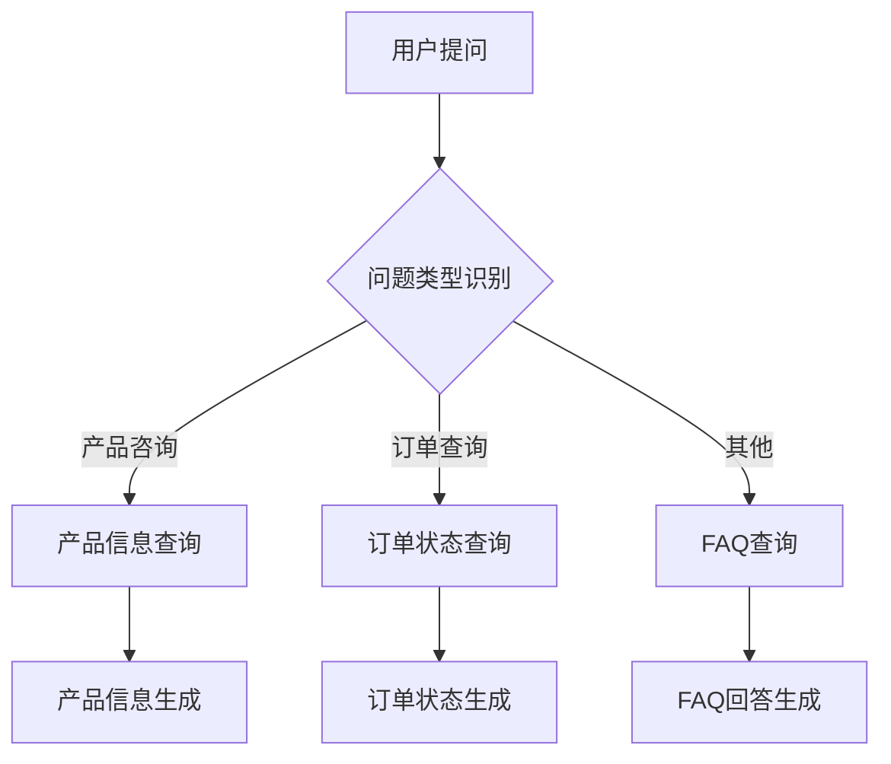
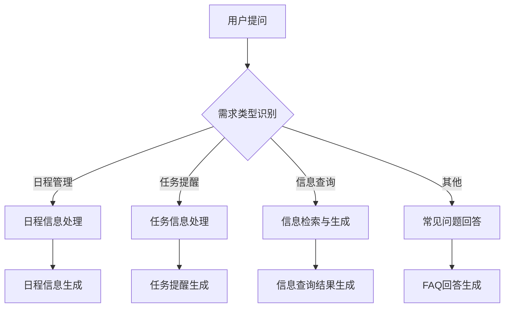
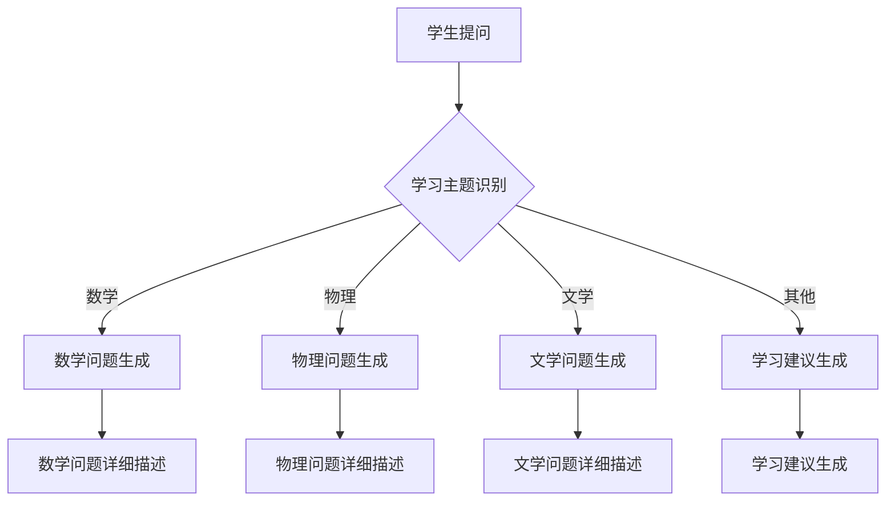

                 


### 文章标题：《ChatGPT提示词编写：技巧与陷阱》

### 文章关键词：ChatGPT、提示词、自然语言处理、编写技巧、陷阱规避

### 文章摘要：

本文将深入探讨ChatGPT提示词编写的核心技巧与潜在陷阱。首先，我们会对ChatGPT及其在自然语言处理中的重要性进行简要介绍，然后详细讲解提示词的基本概念和设计原则。接下来，文章将分章节探讨如何通过理解ChatGPT的需求、优化语言表达、结合上下文以及利用数据进行提示词编写，从而提高其准确性和适应性。同时，我们将分析常见陷阱，提供解决方案，并通过实际案例展示如何规避这些陷阱。最后，文章将对未来趋势进行展望，并总结全文，提出实践建议。

### 目录大纲：

## 第一部分：ChatGPT与提示词基础

### 第1章：ChatGPT概述

#### 1.1 ChatGPT的背景与发展

ChatGPT是由OpenAI开发的一种基于GPT-3模型的自然语言处理（NLP）工具。自其发布以来，ChatGPT凭借其强大的文本生成能力和自适应能力，在多个领域取得了显著的成果。本节将介绍ChatGPT的起源、发展历程及其在NLP领域的应用。

#### 1.2 ChatGPT的工作原理

ChatGPT的核心是基于GPT-3模型，这是一种大型语言预训练模型，通过在大量文本数据上进行训练，使其能够生成流畅、自然的文本。本节将详细阐述GPT-3模型的工作原理，包括其架构、训练过程和生成机制。

#### 1.3 ChatGPT的应用场景

ChatGPT在多个场景中都有广泛的应用，如客服机器人、智能助手、内容生成等。本节将介绍ChatGPT在不同应用场景中的表现和优势，并探讨其未来的发展方向。

## 第二部分：编写优质提示词的技巧

### 第2章：提示词的基本概念

#### 2.1 提示词的定义与作用

提示词是引导ChatGPT生成文本的关键，它直接影响模型的输出结果。本节将详细介绍提示词的定义、作用及其在文本生成中的重要性。

#### 2.2 提示词的类型与结构

根据应用场景和需求，提示词可以分为多种类型。本节将讨论常见的提示词类型，并分析其结构特点。

#### 2.3 提示词的设计原则

为了编写高质量的提示词，我们需要遵循一系列设计原则。本节将介绍这些原则，包括清晰性、多样性、适应性等。

## 第三部分：规避提示词编写的陷阱

### 第3章：常见陷阱与错误

#### 3.1 提示词模糊性

模糊性是提示词编写中常见的问题之一，它可能导致模型输出不一致或不准确。本节将讨论提示词模糊性的原因及其影响。

#### 3.2 提示词过于具体

过于具体的提示词可能会限制ChatGPT的生成能力，导致模型无法扩展其输出。本节将分析提示词过于具体的原因及其负面影响。

#### 3.3 忽视数据隐私

在编写提示词时，我们需要关注数据隐私问题，确保用户数据的安全。本节将讨论如何避免在提示词编写中泄露敏感信息。

## 第四部分：实战与案例分析

### 第4章：开发环境搭建与源代码解读

#### 4.1 开发环境搭建

在本节中，我们将介绍如何在本地搭建ChatGPT的开发环境，包括安装必要的软件和配置环境变量。

#### 4.2 源代码解读

我们将深入解读ChatGPT的源代码，分析其关键组件和数据处理流程。

### 第5章：代码应用解读与分析

#### 5.1 代码应用解读

本节将分析ChatGPT在不同场景下的应用，包括客服机器人、智能助手等。

#### 5.2 详细讲解剖析

我们将通过实际案例，对ChatGPT的应用进行详细讲解和剖析。

### 第6章：项目小结与拓展

#### 6.1 项目小结

在本章中，我们将对整个项目进行小结，总结经验教训，并提出改进建议。

#### 6.2 拓展阅读

最后，我们将推荐一些拓展阅读资源，帮助读者进一步深入了解ChatGPT和提示词编写。

## 第五部分：未来展望与总结

### 第7章：ChatGPT提示词编写的未来趋势

#### 7.1 新技术的影响

本节将讨论新技术对ChatGPT提示词编写的影响，包括深度学习、自然语言生成等。

#### 7.2 行业应用的发展

我们将探讨ChatGPT提示词编写在各个行业中的应用前景，如金融、医疗、教育等。

#### 7.3 提示词编写职业化

本节将讨论提示词编写职业化的趋势，以及未来可能的发展方向。

### 第8章：总结与展望

#### 8.1 全书要点回顾

我们将回顾全文的关键点和核心内容，帮助读者巩固知识点。

#### 8.2 提示词编写实践建议

本节将提出一些建议，帮助读者在实际工作中更好地运用提示词编写技巧。

#### 8.3 对未来的思考

最后，我们将对ChatGPT提示词编写的发展进行思考，探讨未来的可能性。

### 结束语

作者：AI天才研究院/AI Genius Institute & 禅与计算机程序设计艺术 /Zen And The Art of Computer Programming

通过以上目录大纲的设计，我们可以清晰地看到文章的结构和内容安排。接下来，我们将逐一填写每个章节的具体内容，确保满足字数要求，同时保持文章的连贯性和逻辑性。

## 第1章：ChatGPT概述

### 1.1 ChatGPT的背景与发展

ChatGPT是由OpenAI在2022年11月发布的一款基于GPT-3模型的聊天机器人。OpenAI是一家位于美国的人工智能研究实验室，致力于推动人工智能的发展和应用。ChatGPT的发布标志着自然语言处理（NLP）领域的一项重大进步，其背后的技术是基于GPT-3模型，这是迄今为止最大的语言模型，具有超过1750亿个参数。

ChatGPT的发展历程可以追溯到2018年，当时OpenAI发布了GPT-2模型，这是一款具有10亿个参数的语言模型。GPT-2的发布引起了广泛关注，但也引发了对潜在风险和伦理问题的讨论，因为其强大的文本生成能力可能导致虚假信息的传播。为了解决这些问题，OpenAI决定不发布GPT-2的完整模型，而是发布了一个较小的版本，即GPT-3。

GPT-3模型的核心是其巨大的参数规模和训练数据集。它使用了数万亿个单词的文本数据，包括互联网上的大量网页、书籍、新闻文章等。通过这种大规模的预训练，GPT-3能够理解并生成流畅的自然语言文本，这使得ChatGPT在对话场景中表现得非常出色。

### 1.2 ChatGPT的工作原理

ChatGPT的工作原理基于GPT-3模型，这是一种基于Transformer架构的深度学习模型。Transformer架构最初由Vaswani等人于2017年提出，其核心思想是使用自注意力机制（Self-Attention）来处理序列数据，这比传统的循环神经网络（RNN）在处理长序列时更为高效。

GPT-3模型由多个自注意力层组成，每一层都能够处理输入序列的不同部分，并通过自注意力机制计算它们之间的关系。这种层次结构使得GPT-3能够捕捉到输入序列中的长距离依赖关系，从而生成更加流畅和自然的文本。

在训练过程中，GPT-3通过最大化上下文的概率来学习语言模式。具体来说，模型会从训练数据中随机抽取一段文本，然后将其作为输入，并预测下一个单词的概率分布。通过这种方式，模型不断调整其参数，以最小化预测误差。

生成文本时，ChatGPT会根据提示词开始生成文本，并使用GPT-3模型来预测下一个单词。这个过程类似于语言模型在句子生成中的工作方式，但ChatGPT的优势在于其能够处理更长的序列和更复杂的对话场景。

### 1.3 ChatGPT的应用场景

ChatGPT在多个场景中都有广泛的应用，其强大的文本生成能力和自适应能力使其成为理想的解决方案。以下是一些典型的应用场景：

1. **客服机器人**：ChatGPT可以用来构建智能客服机器人，提供24/7的客户支持。通过与用户进行自然语言对话，ChatGPT能够快速响应常见问题，提高客服效率。

2. **智能助手**：ChatGPT可以作为智能助手，帮助用户处理日常任务，如提醒事项、日程安排、信息查询等。其强大的理解能力和生成能力使其能够与用户进行流畅的对话。

3. **内容生成**：ChatGPT可以用来生成各种类型的内容，如新闻报道、博客文章、广告文案等。由于其能够理解上下文和语言模式，ChatGPT生成的内容通常具有较高的质量和一致性。

4. **教育和培训**：ChatGPT可以用于教育领域，如自动生成课程内容、学生问答系统等。其能够理解并回答复杂的问题，为学生提供个性化的学习体验。

5. **研究和开发**：ChatGPT在科学研究和技术开发中也具有广泛的应用。研究人员可以利用ChatGPT自动生成研究论文、技术文档等，从而提高工作效率。

总之，ChatGPT的发布为自然语言处理领域带来了新的机遇和挑战。随着技术的不断进步和应用场景的不断拓展，ChatGPT有望在更多领域发挥重要作用。

### 2.1 提示词的定义与作用

提示词，亦称为触发词或引导词，是自然语言处理领域中用于引导模型生成文本的关键输入。在ChatGPT的场景中，提示词起着至关重要的作用，它决定了模型生成的文本方向和内容。简单来说，提示词就是一个或多个单词或短语，用于启动模型生成相关文本。

提示词的作用主要体现在以下几个方面：

1. **引导模型生成特定文本**：通过提供特定的提示词，我们可以引导ChatGPT生成与提示词相关的文本。例如，如果提示词是“编写一篇关于人工智能的博客”，ChatGPT可能会生成一篇关于人工智能的博客文章。

2. **控制文本生成的内容和风格**：提示词不仅可以指定生成文本的主题，还可以影响文本的风格和情感。例如，提示词“幽默地讲述一个故事”可能会引导ChatGPT生成一个幽默风趣的故事。

3. **提高文本生成的准确性**：高质量的提示词能够提供足够的信息，使模型能够更准确地理解和生成文本。例如，明确的提示词“请描述一下巴黎铁塔”比模糊的提示词“描述一个塔”更能得到准确的描述。

4. **优化用户交互体验**：在交互式应用中，如智能客服机器人或智能助手，提示词能够提供更加自然的对话体验。通过合理的提示词设计，系统可以更好地理解用户需求，提供更加准确的回答。

总的来说，提示词是连接用户需求和模型输出的关键桥梁，其选择和设计直接影响到文本生成的质量和用户体验。

### 2.2 提示词的类型与结构

在自然语言处理（NLP）领域，根据应用场景和需求的不同，提示词可以分为多种类型。这些提示词在结构上各有特点，其设计直接影响模型的生成效果。以下是几种常见的提示词类型及其结构特点：

1. **主题型提示词**：
   - **定义**：主题型提示词主要用于指定文本生成的主题，如“人工智能”、“健康饮食”等。
   - **结构**：通常包含一个核心名词或短语，简洁明了地描述主题。
   - **应用场景**：适用于生成特定领域的内容，如学术论文、技术文档、新闻报道等。

2. **任务型提示词**：
   - **定义**：任务型提示词用于指定模型需要完成的任务，如“写一篇关于人工智能未来发展的论文摘要”。
   - **结构**：通常包含一个动词短语，明确指示模型需要执行的操作。
   - **应用场景**：适用于指示模型生成具体任务结果，如论文摘要、营销文案、用户指南等。

3. **引导型提示词**：
   - **定义**：引导型提示词用于引导模型生成特定类型的文本，如“用幽默的语言讲述一个故事”。
   - **结构**：通常包含一个形容词或副词短语，描述生成文本的风格或情感。
   - **应用场景**：适用于需要特定风格或情感的文本生成，如幽默故事、感人故事、正式演讲稿等。

4. **问题型提示词**：
   - **定义**：问题型提示词用于生成回答特定问题的文本，如“什么是人工智能？”。
   - **结构**：通常包含一个疑问句，明确提问内容。
   - **应用场景**：适用于问答系统、教育辅导、智能客服等场景。

5. **上下文型提示词**：
   - **定义**：上下文型提示词用于提供生成文本所需的上下文信息，如“以下是一段文本，请根据这段文本生成一个相关的故事”。
   - **结构**：通常包含一段文本或多个提示词，为模型生成提供背景信息。
   - **应用场景**：适用于需要根据上下文生成连贯文本的场景，如对话系统、文本续写、多轮对话等。

了解不同类型的提示词及其结构特点，有助于我们在实际应用中根据需求选择合适的提示词，从而提高文本生成的准确性和效果。

### 2.3 提示词的设计原则

为了编写出高质量的提示词，我们需要遵循一系列设计原则。这些原则不仅能够提高提示词的准确性和适应性，还能提升模型生成文本的质量和用户体验。以下是几个关键的设计原则：

1. **清晰性**：
   - **原则内容**：提示词需要表达清晰明确，避免使用模糊或歧义的语言。
   - **实际应用**：例如，"请生成一篇关于人工智能未来发展的论文摘要" 比 "谈谈人工智能的未来" 更加具体明确。
   - **注意事项**：避免使用复杂的术语或行业专有名词，确保用户和模型都能够理解。

2. **多样性**：
   - **原则内容**：提示词应该具有多样性，以避免生成单一、重复的文本。
   - **实际应用**：例如，可以使用不同的语言风格、表达方式或问题类型来生成多样化的文本。
   - **注意事项**：通过多样化的提示词，可以使模型生成的内容更加丰富，提高用户体验。

3. **适应性**：
   - **原则内容**：提示词需要能够适应不同的上下文和场景。
   - **实际应用**：例如，一个提示词在不同的对话中可以有不同的解释和应用。
   - **注意事项**：确保提示词具有足够的灵活性，能够根据具体场景进行调整。

4. **具体性**：
   - **原则内容**：提示词应该提供足够的具体信息，帮助模型生成准确的文本。
   - **实际应用**：例如，"请描述一下巴黎铁塔的特点" 比 "描述一个著名的建筑" 更加具体。
   - **注意事项**：提供具体信息可以减少模型的猜测，提高生成文本的准确性。

5. **用户友好性**：
   - **原则内容**：提示词应该易于用户理解和操作。
   - **实际应用**：例如，在设计智能客服系统的提示词时，应该使用简单、易懂的语言。
   - **注意事项**：考虑用户的语言习惯和背景，使提示词更加贴近用户。

通过遵循这些设计原则，我们可以编写出高质量的提示词，从而提高ChatGPT生成文本的准确性和多样性，为用户带来更好的体验。

### 3.1 分析ChatGPT的输入与输出

在编写提示词时，理解ChatGPT的输入与输出机制至关重要。ChatGPT的输入通常是一个或多个提示词，这些提示词可以是简单的单词、短语或复杂的句子。这些输入被用来启动ChatGPT的文本生成过程。而ChatGPT的输出则是根据输入提示词生成的文本，可以是问答、对话、故事、文章等。

首先，我们来看ChatGPT的输入。提示词是引导模型生成文本的关键。一个有效的提示词应该能够提供足够的信息，使ChatGPT能够准确理解用户的意图。例如，提示词“请描述一下巴黎铁塔”比“描述一个塔”更加具体明确，能够引导ChatGPT生成一个关于巴黎铁塔的详细描述。

输入提示词的质量直接影响输出的质量。如果提示词模糊或含糊不清，ChatGPT可能会生成不相关或不准确的文本。例如，提示词“写一篇关于人工智能的博客”比“写一篇博客”提供了更多的上下文信息，因此生成的博客内容更有可能符合预期。

接下来，我们分析ChatGPT的输出。ChatGPT的输出是自然语言文本，其生成的文本需要满足一定的质量标准。这包括语言的流畅性、逻辑性、准确性以及与输入提示词的相关性。

为了生成高质量的输出，ChatGPT利用其训练过程中学习到的语言模式和上下文关系。具体来说，ChatGPT会根据输入提示词和模型内部的知识库，生成一个初步的文本框架，然后逐步扩展和细化，直到生成完整的文本。在这个过程中，ChatGPT会使用自注意力机制来处理输入文本的各个部分，并预测下一个单词的概率分布，从而生成流畅的文本。

然而，输出质量并不总是理想的。有时ChatGPT可能会生成不准确、重复或不相关的文本。这通常是由于以下原因：

1. **输入提示词不明确**：如果提示词模糊或含糊不清，ChatGPT可能会产生误导性的输出。

2. **上下文信息不足**：如果输入提示词没有提供足够的上下文信息，ChatGPT可能无法生成与上下文相关的文本。

3. **模型训练数据不足**：如果模型的训练数据不足或质量不高，其生成的文本可能缺乏准确性和一致性。

为了提高输入和输出的质量，我们可以采取以下措施：

1. **优化提示词**：确保提示词清晰明确，提供足够的上下文信息。例如，可以使用具体的例子或详细描述来替代模糊的提示词。

2. **增加训练数据**：通过增加高质量的训练数据，可以提高模型的准确性和一致性。

3. **实时调整和反馈**：在生成文本的过程中，实时监控文本的质量，并根据反馈进行调整。例如，如果生成的文本不符合预期，可以重新调整提示词或修改文本。

通过以上措施，我们可以更好地理解ChatGPT的输入与输出机制，从而编写出更高质量的提示词，提高模型的生成效果。

### 3.2 预测ChatGPT的行为

在编写提示词时，预测ChatGPT的行为是一个关键步骤。这种行为预测不仅有助于我们设计更有效的提示词，还能提高模型生成文本的准确性和一致性。为了准确预测ChatGPT的行为，我们需要深入理解其生成机制和常见的行为模式。

首先，了解ChatGPT的生成机制是预测其行为的基础。ChatGPT是基于GPT-3模型的，其核心思想是通过自注意力机制（Self-Attention）来处理输入文本的各个部分，并预测下一个单词的概率分布。具体来说，ChatGPT会将输入文本分成多个序列，然后在每个序列内部使用自注意力机制计算各个部分之间的关联性，从而生成一个概率分布。这个概率分布表示了每个单词作为下一个单词出现的可能性。

基于这种生成机制，我们可以预测ChatGPT的一些常见行为：

1. **依赖输入顺序**：由于ChatGPT是通过处理输入文本的各个部分来生成文本的，因此其生成的文本通常会依赖于输入的顺序。这意味着如果输入提示词的顺序发生变化，生成的文本也可能发生显著变化。

2. **重复性**：由于ChatGPT是基于概率分布生成文本的，因此其生成的文本可能会有一定的重复性。这意味着在某些情况下，ChatGPT可能会生成与之前类似或重复的文本。

3. **适应性**：ChatGPT能够根据输入提示词和上下文信息进行自适应生成。因此，如果提示词提供的信息足够丰富和具体，ChatGPT能够更好地适应并生成相关的内容。

4. **多样性**：尽管ChatGPT具有一定的重复性，但通过设计多样化的提示词，我们可以引导ChatGPT生成多样化和丰富的文本。

为了更准确地预测ChatGPT的行为，我们可以采取以下策略：

1. **分析历史行为**：通过分析ChatGPT在过去生成的文本，我们可以识别其常见的行为模式和规律。例如，通过统计生成文本的关键词和短语，我们可以预测ChatGPT在类似情况下可能的行为。

2. **模拟和测试**：在实际应用中，我们可以通过模拟和测试不同的提示词，观察ChatGPT的生成结果。这种方法有助于我们理解ChatGPT的行为并优化提示词的设计。

3. **反馈和调整**：在实际应用过程中，我们可以收集用户对生成文本的反馈，并根据反馈对提示词进行调整。这种方法可以持续改进ChatGPT的行为预测。

通过以上策略，我们可以更准确地预测ChatGPT的行为，从而编写出更高质量的提示词，提高模型生成文本的准确性和一致性。

### 3.3 提高提示词的准确性

编写高质量的提示词是提高ChatGPT生成文本准确性的关键。以下是一些具体的方法和策略，可以帮助我们提高提示词的准确性。

首先，明确目标是最基本的原则。在编写提示词时，我们应该清楚地知道希望模型生成什么类型的文本。这可以通过指定具体的主题、任务和风格来实现。例如，如果希望生成一篇关于人工智能的博客摘要，提示词可以是“请生成一篇关于人工智能未来发展的博客摘要”。

其次，提供足够的上下文信息也是关键。ChatGPT的生成依赖于输入的上下文信息，因此提示词应该包含与主题相关的详细背景信息。例如，对于“请生成一篇关于人工智能未来发展的博客摘要”，我们可以在提示词中补充一些背景信息，如“人工智能在过去的十年中取得了显著的进展，未来有望在医疗、金融、教育等领域发挥更大作用”。

第三，避免模糊和歧义的提示词。模糊的提示词可能会导致ChatGPT生成不准确或不相关的文本。例如，提示词“写一篇关于机器学习的文章”比“写一篇关于机器学习的文章，谈谈它的优点和缺点”更加模糊。为了提高准确性，我们应该使用具体和明确的提示词。

第四，可以使用举例来说明。通过提供一个具体的例子，可以帮助ChatGPT更好地理解我们希望生成的文本类型。例如，提示词“请生成一篇关于机器学习的文章，像这样描述它如何帮助医疗领域”可以帮助ChatGPT生成一篇具体且相关的文章。

此外，还可以通过以下方法来提高提示词的准确性：

1. **利用历史数据和反馈**：分析ChatGPT过去生成的文本，识别其优势和不足，并根据这些信息优化提示词。此外，收集用户对生成文本的反馈，并根据反馈进行调整。

2. **多样化提示词**：通过使用不同类型的提示词，如主题型、任务型、引导型和上下文型，可以丰富ChatGPT的生成能力，提高文本的准确性。

3. **迭代优化**：在实际应用中，通过不断尝试和调整提示词，找到最有效的组合，从而提高生成文本的准确性。

总之，通过明确目标、提供上下文信息、避免模糊和歧义、举例说明以及利用历史数据和反馈，我们可以编写出高质量的提示词，从而提高ChatGPT生成文本的准确性。

### 4.1 提高提示词的清晰度

在编写提示词时，提高清晰度是确保ChatGPT能够准确理解用户意图的关键。以下是一些具体的方法和策略，可以帮助我们提高提示词的清晰度。

首先，使用具体的词汇。具体的词汇能够提供更明确的指导，减少ChatGPT的猜测空间。例如，提示词“请生成一篇关于人工智能未来发展的博客摘要”比“请写一篇关于人工智能的博客”更加具体，能够引导ChatGPT生成更加详细和精准的摘要。

其次，避免使用模糊或歧义的词汇。模糊的词汇可能会导致ChatGPT产生误解或不准确的生成结果。例如，提示词“请写一篇关于机器学习的文章”比“请写一篇关于机器学习的文章，谈谈它的优点和缺点”更加模糊，可能会使ChatGPT产生重复或不相关的内容。

第三，使用简短的句子。简短的句子能够使提示词更加清晰明了。例如，提示词“生成一篇关于人工智能的博客摘要”比“请利用您对人工智能的理解，生成一篇简短的博客摘要”更加简洁，有助于ChatGPT更快地理解任务。

第四，提供上下文信息。提供与任务相关的上下文信息可以帮助ChatGPT更好地理解用户的意图。例如，如果提示词是“请生成一篇关于人工智能在医疗领域的应用的文章”，可以在提示词中补充一些上下文信息，如“近年来，人工智能在医疗领域取得了显著进展，特别是在疾病诊断和预测方面”。

此外，还可以通过以下方法来提高提示词的清晰度：

1. **利用举例**：提供一个具体的例子可以帮助ChatGPT更好地理解提示词的含义。例如，提示词“生成一篇关于人工智能在医疗领域的应用的文章，像这样描述它如何帮助疾病诊断”可以明确指导ChatGPT生成相关内容。

2. **分解任务**：将复杂的任务分解成简单的步骤或子任务，可以使提示词更加清晰。例如，提示词“首先描述人工智能在医疗领域的应用，然后分析它的优势，最后讨论未来的发展方向”可以清晰地指导ChatGPT按照步骤生成文本。

3. **避免使用复杂的术语或技术性语言**：如果提示词需要使用专业的术语或技术性语言，应该确保这些术语对ChatGPT来说是可理解的。如果必要，可以在提示词中提供解释或背景信息。

通过以上方法和策略，我们可以编写出更加清晰和具体的提示词，从而提高ChatGPT生成文本的准确性和有效性。

### 4.2 增强提示词的多样性

在编写提示词时，增强多样性是提高ChatGPT生成文本丰富性和趣味性的关键。以下是一些具体的方法和策略，可以帮助我们实现这一目标。

首先，使用不同的语言风格。不同的语言风格可以带来不同的文本效果，例如，幽默、正式、诗意等。通过使用多种语言风格，我们可以使生成的文本更加多样化。例如，提示词“以幽默的方式描述人工智能的日常”和“以正式的风格介绍人工智能的发展历程”可以引导ChatGPT生成风格迥异的文本。

其次，采用不同的表达方式。表达方式的多样性可以使生成的文本更加生动和有趣。例如，提示词“用比喻的方式描述机器学习算法”和“用故事的形式讲述人工智能在生活中的应用”可以引导ChatGPT采用不同的表达方式。

第三，使用多种类型的提示词。根据不同的任务和场景，使用不同类型的提示词可以增加文本的多样性。例如，主题型、任务型、引导型和问题型等类型的提示词可以引导ChatGPT生成不同类型的文本。例如，提示词“请写一篇关于人工智能的博客摘要”（主题型）和“请回答以下问题：人工智能有哪些潜在风险？”（问题型）可以引导ChatGPT生成不同类型的文本。

此外，还可以通过以下方法来增强提示词的多样性：

1. **利用类比和隐喻**：类比和隐喻可以使文本更加生动有趣。例如，提示词“将人工智能比作一位出色的医生”和“用诗歌的形式描述人工智能的未来”可以引导ChatGPT生成更具创意的文本。

2. **结合不同的文化背景**：不同的文化背景可以带来不同的视角和表达方式。例如，提示词“以中国传统文化为背景描述人工智能的发展”和“以西方科幻文化为背景讲述人工智能的未来”可以引导ChatGPT生成具有文化特色的文本。

3. **引入新的概念和观点**：通过引入新的概念和观点，可以丰富文本的内容和思想。例如，提示词“探讨人工智能与哲学的关系”和“分析人工智能对道德和伦理的影响”可以引导ChatGPT生成具有深度和广度的文本。

通过以上方法和策略，我们可以增强提示词的多样性，使ChatGPT生成的文本更加丰富、有趣和多样化，从而提高用户体验。

### 4.3 避免常见的语言陷阱

在编写提示词时，避免常见的语言陷阱是确保ChatGPT生成准确、相关文本的关键。以下是一些常见的语言陷阱以及如何规避这些陷阱的方法。

**1. 模糊性**

模糊性是指提示词表达不明确，导致ChatGPT生成不相关或不准确的文本。例如，提示词“写一篇关于机器学习的文章”过于模糊，ChatGPT可能生成关于机器学习的任何方面，而不是特定主题。

**规避方法**：使用具体和明确的词汇来代替模糊的词汇。例如，将“写一篇关于机器学习的文章”改为“请生成一篇关于机器学习在医疗领域应用的文章”。

**2. 不一致**

不一致的提示词可能导致ChatGPT生成的文本逻辑混乱或不一致。例如，提示词“请写一篇关于人工智能的优势和劣势的文章”包含了两个相对立的主题，可能导致生成的文本缺乏连贯性。

**规避方法**：确保提示词中的信息一致。例如，将“请写一篇关于人工智能的优势和劣势的文章”改为“请从三个角度（技术、经济和社会）分析人工智能的优势”。

**3. 过度具体**

过度具体的提示词可能会限制ChatGPT的生成能力，导致其无法扩展生成内容。例如，提示词“请生成一篇关于巴黎铁塔的详细描述”过于具体，ChatGPT可能只生成关于巴黎铁塔的描述，而无法涉及更多相关内容。

**规避方法**：在提供具体信息的同时，留有一定的灵活性。例如，将“请生成一篇关于巴黎铁塔的详细描述”改为“请描述巴黎铁塔及其历史背景”。

**4. 文化偏见**

使用包含文化偏见的提示词可能导致ChatGPT生成带有偏见的内容。例如，提示词“请生成一篇关于西方国家的科技发展史的文章”可能忽视了其他地区和文化的贡献。

**规避方法**：使用中立、包容的词汇。例如，将“请生成一篇关于西方国家的科技发展史的文章”改为“请生成一篇关于全球科技发展史的概述”。

**5. 逻辑错误**

逻辑错误的提示词可能导致ChatGPT生成错误的结论。例如，提示词“请生成一篇关于人工智能无法取代人类工作的文章”可能忽略了一些事实和证据。

**规避方法**：确保提示词中的逻辑和事实准确无误。例如，将“请生成一篇关于人工智能无法取代人类工作的文章”改为“请分析人工智能在哪些方面可能无法完全取代人类工作”。

通过识别和规避这些常见的语言陷阱，我们可以编写出更加准确、相关且富有创意的提示词，从而提高ChatGPT生成文本的质量。

### 5.1 理解上下文的重要性

在编写提示词时，理解上下文的重要性不容忽视。上下文是指提示词周围的语言环境，它为ChatGPT提供了生成相关文本的重要信息。正确的上下文可以帮助ChatGPT更好地理解用户的意图，从而生成更准确、连贯的文本。

首先，上下文能够提供明确的主题和背景信息。例如，如果提示词是“请生成一篇关于人工智能在医疗领域应用的博客”，上下文信息可以包括“近年来，人工智能在医疗领域取得了显著进展，特别是在疾病诊断和预测方面”，这样ChatGPT就能明确博客的主题和背景，生成更加相关的文本。

其次，上下文有助于传达用户的情感和态度。例如，如果提示词是“用幽默的方式描述人工智能的日常”，上下文信息可以包括“尽管人工智能在许多领域表现出色，但它的日常仍充满了有趣的挑战和困境”，这样ChatGPT就能理解用户的幽默意图，生成具有幽默感的文本。

为了更好地利用上下文，我们可以采取以下策略：

1. **提供背景信息**：在提示词中补充相关的背景信息，帮助ChatGPT理解主题和背景。例如，在生成一篇关于人工智能在医疗领域应用的博客时，可以提供关于人工智能在医疗领域的研究进展和应用实例。

2. **使用相关词汇**：在提示词中使用与主题相关的词汇，可以引导ChatGPT生成更相关的文本。例如，在生成一篇关于人工智能的文章时，可以使用如“机器学习”、“深度学习”等与人工智能相关的词汇。

3. **提供情感和态度**：通过在提示词中表达用户的情感和态度，可以引导ChatGPT生成具有特定情感色彩的文本。例如，在生成一篇幽默的文章时，可以使用如“搞笑的”、“滑稽的”等词汇。

4. **结合历史对话**：在多轮对话中，结合之前的对话内容作为上下文，可以帮助ChatGPT更好地理解用户的意图和需求。例如，在回答用户的问题时，可以引用之前的对话内容，使回答更加连贯和准确。

通过理解上下文的重要性，并采取适当的策略，我们可以提高提示词的准确性和生成文本的质量，从而提升用户体验。

### 5.2 提取上下文信息

提取上下文信息是编写高质量提示词的关键步骤，它能够为ChatGPT提供足够的信息，使其生成更加准确和连贯的文本。以下是一些具体的策略和方法，帮助我们在编写提示词时有效提取上下文信息：

1. **分析对话历史**：在多轮对话中，前一轮的对话内容是宝贵的上下文信息。通过回顾对话历史，我们可以提取出与当前对话主题相关的信息。例如，如果用户之前提到过“人工智能在医疗领域的应用”，我们可以将其作为上下文信息包含在当前提示词中。

2. **关注关键信息**：在对话中，用户可能会提供许多信息，但有些信息比其他信息更为关键。通过识别并提取这些关键信息，我们可以确保ChatGPT能够准确理解用户的意图。例如，如果用户提到“我想了解机器学习在疾病诊断中的应用”，那么“机器学习”和“疾病诊断”就是关键信息。

3. **使用关键词提取技术**：利用自然语言处理技术，如关键词提取，可以帮助我们快速从大量文本中提取出关键信息。例如，可以使用TF-IDF（词频-逆文档频率）或词云等技术来识别和提取对话中的高频关键词。

4. **构建上下文向量**：通过将文本转换为向量表示，我们可以利用机器学习模型来识别和提取上下文信息。例如，可以使用词嵌入（Word Embeddings）技术将文本转换为向量，然后使用聚类或分类算法提取关键信息。

5. **上下文信息拼接**：将多个上下文信息拼接成一个完整的上下文提示词，可以帮助ChatGPT更好地理解整个对话的背景。例如，将“你之前提到过机器学习在医疗领域的应用，现在我想进一步了解它在疾病诊断方面的具体应用”拼接成一句话作为提示词。

通过以上策略和方法，我们可以有效地提取上下文信息，为ChatGPT提供丰富的背景信息，从而提高其生成文本的准确性和连贯性。

### 5.3 编写适应性强的提示词

编写适应性强的提示词是确保ChatGPT在不同场景下都能生成高质量文本的关键。以下是一些策略和方法，帮助我们在编写提示词时提高其适应性：

1. **模块化设计**：将提示词分解成模块，每个模块对应一个特定的功能或主题。这种方法可以使得提示词更加灵活，根据不同场景和需求进行组合和调整。例如，提示词可以分为“主题模块”、“任务模块”和“风格模块”，分别对应文本的主题、任务和风格。

2. **参数化设计**：使用参数化的提示词，可以动态调整提示词的内容，使其适应不同的场景。例如，可以使用参数`<topic>`、`<task>`和`<style>`来定义主题、任务和风格，根据实际需求进行替换。

3. **模板化设计**：利用模板化设计，可以创建一系列通用模板，根据具体需求进行填充。例如，可以使用模板“请生成一篇关于<topic>的<task>，用<style>的语调”来引导ChatGPT生成相关文本。

4. **多场景测试**：在实际应用中，对提示词进行多场景测试，确保其能够在不同场景下生成高质量的文本。例如，在生成一篇关于人工智能的博客时，可以测试其是否适用于教育、医疗、科技等多个领域。

5. **实时调整和反馈**：根据用户反馈和实际应用情况，实时调整和优化提示词。例如，如果用户反馈生成的文本过于模糊或不相关，可以重新调整提示词的明确性和具体性。

通过以上策略和方法，我们可以编写出适应性强的提示词，提高ChatGPT在不同场景下的生成效果。

### 6.1 数据收集与处理

编写高质量提示词不仅需要深入理解ChatGPT的工作原理和需求，还需要大量高质量的数据进行训练。数据收集与处理是这一过程中的关键步骤。以下是一些具体的策略和方法：

**1. 数据来源**：

- **公开数据集**：如维基百科、新闻文章、社交媒体帖子等。这些数据集通常经过清洗和格式化，适合直接用于训练。
- **专业数据集**：如医疗文本、法律文本、学术论文等。这些数据集具有更高的专业性和准确性，但可能需要额外的处理和清洗。
- **用户生成数据**：通过用户互动和应用反馈收集的数据，例如用户在聊天机器人中的提问和回答。这些数据反映了实际使用场景和用户需求。

**2. 数据预处理**：

- **文本清洗**：去除无用符号、格式化文本、修正拼写错误等。这有助于提高数据质量，避免模型训练过程中受到噪音干扰。
- **分词**：将文本拆分成单词或短语。常用的分词工具包括NLTK、spaCy等。
- **词嵌入**：将单词转换为向量表示，常用的词嵌入技术包括Word2Vec、GloVe等。

**3. 数据标注**：

- **主题标注**：为文本标注主题标签，如“医疗”、“科技”、“娱乐”等。这有助于模型在生成文本时能够保持主题一致性。
- **情感标注**：为文本标注情感标签，如“积极”、“消极”、“中性”等。这有助于模型在生成文本时能够传达正确的情感。
- **实体标注**：为文本中的关键实体进行标注，如人名、地点、组织等。这有助于模型在生成文本时能够引用正确的实体。

**4. 数据增强**：

- **数据扩充**：通过变换文本、生成伪文本等方法增加数据量，例如通过同义词替换、随机插入删除文本片段等。
- **数据变换**：使用不同的方法对原始数据进行变换，如文本翻译、风格转换等，以增加模型的泛化能力。

**5. 数据评估**：

- **质量评估**：通过人工评估或自动化工具评估数据的质量，确保数据符合训练要求。
- **性能评估**：通过训练模型并评估其性能，例如文本分类、命名实体识别等任务，确保数据的有效性。

通过有效的数据收集与处理，我们可以为ChatGPT提供高质量、多样化的训练数据，从而提高其生成文本的准确性和多样性。

### 6.2 数据驱动的提示词优化

数据驱动是提升ChatGPT提示词质量的关键方法。通过分析训练数据中的模式，我们可以优化提示词，使其更精准、更具有代表性。以下是一个数据驱动的提示词优化流程，并包括具体的步骤和工具：

**1. 数据分析**：

- **数据收集**：首先，我们需要收集大量与任务相关的训练数据。这些数据可以来自公开数据集、专业数据集或用户生成数据。
- **数据清洗**：对收集到的数据进行清洗，去除无效信息、修正错误、统一格式等，确保数据的质量。
- **数据预处理**：对清洗后的数据进行预处理，如分词、去停用词、词嵌入等，使其适合模型处理。

**2. 特征提取**：

- **关键词提取**：使用自然语言处理技术提取文本中的关键词。这些关键词反映了文本的主题和内容，对于提示词设计至关重要。
- **情感分析**：对文本进行情感分析，提取文本中的情感标签。这些信息可以帮助我们在提示词中传达正确的情感和态度。

**3. 提示词生成**：

- **模板生成**：根据提取的关键词和情感标签，设计一系列模板化的提示词。这些模板可以包含不同的变量，以便根据实际需求进行调整。
- **参数化提示词**：将提示词中的关键部分参数化，如主题、风格、情感等。这样可以灵活地调整提示词，适应不同的任务场景。

**4. 模型训练**：

- **训练模型**：使用训练数据训练一个基于提示词的生成模型，如GPT-3模型。模型会学习如何根据提示词生成相关文本。
- **模型评估**：通过评估模型的生成效果，如文本的流畅性、相关性、准确性等，对模型进行优化和调整。

**5. 实时优化**：

- **反馈机制**：在生成过程中收集用户反馈，包括文本的满意度、准确性等。
- **迭代优化**：根据用户反馈和模型评估结果，对提示词进行迭代优化。例如，通过增加特定关键词、调整情感标签、修改模板结构等。

**工具推荐**：

- **自然语言处理库**：如NLTK、spaCy、TextBlob等，用于数据预处理和特征提取。
- **机器学习框架**：如TensorFlow、PyTorch等，用于模型训练和评估。
- **数据可视化工具**：如Matplotlib、Seaborn等，用于数据分析和模型评估的可视化展示。

通过数据驱动的提示词优化方法，我们可以不断提高ChatGPT生成文本的质量，使其更好地满足用户需求。

### 6.3 数据可视化与反馈

在编写和优化ChatGPT提示词的过程中，数据可视化和反馈机制起着至关重要的作用。通过数据可视化，我们可以直观地了解提示词的效果，从而进行针对性的调整。以下是一些数据可视化和反馈的方法：

**1. 数据可视化**：

- **生成文本的可视化**：通过文本摘要、词云或文本片段的可视化，可以直观地展示生成文本的内容和结构。例如，使用词云可以突出显示生成文本中的高频关键词，帮助我们发现并优化提示词中的关键信息。
- **性能指标的可视化**：使用图表或曲线展示模型的性能指标，如文本的流畅性、准确性、多样性等。这有助于我们识别模型的优势和不足，进而优化提示词。
- **用户交互的可视化**：通过记录和分析用户的交互过程，如用户的提问、模型的回答、用户的满意度等，可以了解用户对提示词和生成文本的反馈，从而优化提示词。

**2. 反馈机制**：

- **用户反馈**：通过问卷调查、用户评分等方式收集用户对生成文本的反馈。这些反馈可以帮助我们识别用户的需求和痛点，从而改进提示词。
- **模型评估**：使用自动化工具评估模型的性能，如文本分类准确率、生成文本的流畅性等。这些评估结果可以作为优化提示词的依据。
- **实时调整**：根据用户反馈和模型评估结果，实时调整提示词。例如，通过增加特定关键词、调整情感标签、修改模板结构等，使生成文本更符合用户需求。

通过数据可视化和反馈机制，我们可以更好地理解ChatGPT提示词的效果，从而进行针对性的优化，提高提示词的质量和生成文本的相关性。

### 第7章：常见陷阱与错误

在编写ChatGPT提示词的过程中，常见的一些陷阱和错误可能会影响生成文本的质量。以下是一些典型的陷阱与错误，以及如何识别和避免它们。

#### 7.1 提示词模糊性

**定义**：模糊性的提示词是指那些表达不明确、含义不清晰的提示词。这种提示词会导致ChatGPT生成不相关或不准确的文本。

**例子**：一个模糊的提示词可能是“请写一篇关于未来的文章”。

**影响**：模糊性提示词会限制ChatGPT的理解，导致其生成的内容偏离主题或缺乏具体性。

**识别方法**：通过分析提示词中的关键词和短语，检查其是否具体且明确。如果提示词中的关键词具有多种解释，应考虑使用更具体的词汇或提供额外的上下文。

**避免方法**：使用具体和明确的提示词，例如，“请生成一篇关于未来人工智能在医疗领域应用的展望文章”。

#### 7.2 提示词过于具体

**定义**：过于具体的提示词是指那些提供了过多细节，限制了ChatGPT生成多样性和灵活性的提示词。

**例子**：一个过于具体的提示词可能是“请生成一篇关于巴黎铁塔的详细历史描述”。

**影响**：过于具体的提示词可能会使ChatGPT陷入固定模式，生成内容重复或缺乏创意。

**识别方法**：通过检查提示词中的关键词，确定其是否提供了过多细节。如果提示词中的关键词限制了文本生成，应考虑简化或重新设计提示词。

**避免方法**：提供足够的上下文信息，但避免过多的具体细节。例如，将提示词改为“请描述一个著名的地标建筑的历史及其影响”。

#### 7.3 忽视数据隐私

**定义**：忽视数据隐私是指在编写提示词时，没有考虑到用户数据的安全和隐私保护。

**例子**：一个忽视数据隐私的提示词可能是“请提供用户在过去的五次对话中的信息”。

**影响**：这种提示词可能导致用户数据泄露，违反隐私政策，损害用户信任。

**识别方法**：通过审查提示词内容，检查其是否涉及敏感信息或用户隐私。

**避免方法**：确保提示词不包含任何敏感信息，并遵循数据隐私保护的原则。例如，将提示词改为“请提供一些关于您最近问题的背景信息”。

#### 7.4 提示词不一致

**定义**：不一致的提示词是指那些与用户需求和场景不匹配的提示词。

**例子**：一个不一致的提示词可能是“请生成一篇关于技术的积极文章”，但用户实际需求是分析技术风险。

**影响**：不一致的提示词会导致用户不满，降低用户体验。

**识别方法**：通过理解用户的需求和场景，检查提示词是否与其一致。

**避免方法**：确保提示词与用户需求相匹配。例如，如果用户需要分析技术风险，提示词可以改为“请生成一篇关于技术风险分析的文章”。

#### 7.5 提示词缺乏多样性

**定义**：缺乏多样性的提示词是指那些在结构和内容上缺乏变化和创新的提示词。

**例子**：一个缺乏多样性的提示词可能是“请写一篇关于机器学习的文章，强调其应用”。

**影响**：缺乏多样性的提示词会使生成文本显得单调和重复。

**识别方法**：通过分析多个提示词的生成文本，检查其是否具有一致的结构和内容。

**避免方法**：设计多样化的提示词，包括不同的语言风格、表达方式和主题。例如，将提示词改为“请生成一篇关于机器学习的应用、优势和挑战的文章”。

通过识别和避免这些常见陷阱和错误，我们可以编写出更加准确、相关且富有创意的提示词，从而提高ChatGPT生成文本的质量。

### 8.1 提高提示词编写的规范性

编写高质量的提示词需要遵循一系列规范，以提高提示词的准确性和一致性。以下是一些关键步骤和最佳实践：

**1. 明确目标和主题**：在编写提示词时，首先要明确目标，即用户希望通过ChatGPT得到什么类型的输出。同时，确保主题一致，避免主题跳转或模糊不清。

**2. 使用明确的语言**：避免使用模糊或歧义的词汇。使用具体的词汇和短语，使提示词更加明确，减少ChatGPT的误解和误生成。

**3. 提供上下文信息**：在提示词中提供足够的上下文信息，帮助ChatGPT更好地理解用户的意图。这包括相关的背景知识、关键词和任务要求。

**4. 简化语言结构**：使用简单、易懂的语言，避免复杂的句子结构和难以理解的术语。这有助于ChatGPT更好地理解和生成相关文本。

**5. 避免重复和冗余**：在编写提示词时，注意避免重复和冗余的信息。这不仅有助于提高提示词的质量，还能提高ChatGPT的生成效率。

**6. 测试和迭代**：在实际应用中，对提示词进行测试和迭代。通过用户反馈和模型评估结果，不断优化提示词，确保其满足用户需求和场景要求。

**7. 遵循最佳实践**：参考行业最佳实践，如自然语言处理领域的指南和标准，以确保提示词编写的规范性和一致性。

通过遵循以上规范和最佳实践，我们可以编写出高质量的提示词，提高ChatGPT生成文本的准确性和用户体验。

### 8.2 实时监控与调整

在编写和部署ChatGPT提示词的过程中，实时监控与调整是确保生成文本质量和用户满意度的重要环节。以下是一些具体的策略和方法：

**1. 监控生成文本的质量**：通过设置关键指标（如文本的流畅性、相关性、准确性等），实时监控生成文本的质量。可以使用自动化工具定期评估生成文本的这些指标，以便快速发现和解决问题。

**2. 收集用户反馈**：鼓励用户提供关于生成文本的反馈，包括文本的相关性、准确性和满意度等。这些反馈可以通过问卷调查、用户评分或直接用户沟通等方式收集。

**3. 分析反馈数据**：对收集到的用户反馈进行详细分析，识别常见的问题和用户痛点。例如，如果用户反馈生成的文本过于模糊或不准确，需要调整提示词的明确性和具体性。

**4. 调整提示词**：根据反馈数据和分析结果，对提示词进行实时调整。这可以包括修改提示词中的关键词、增加上下文信息、简化语言结构等。

**5. 迭代优化**：在实时监控和用户反馈的基础上，不断迭代优化提示词。通过多次调整和测试，找到最有效的提示词组合，提高生成文本的质量和用户体验。

**6. 使用自动化工具**：利用自动化工具（如自然语言处理库、机器学习框架等）进行实时监控和调整。这些工具可以帮助快速处理大量数据，并提供即时的分析和建议。

通过实时监控与调整，我们可以确保ChatGPT生成文本的质量和用户满意度，从而提供更好的服务。

### 8.3 加强团队协作与沟通

编写高质量的ChatGPT提示词不仅仅是单个开发者的任务，它需要团队的合作与协调。以下是一些加强团队协作与沟通的策略：

**1. 明确分工和职责**：在团队中明确每个成员的分工和职责，确保每个角色都清楚自己的任务和目标。这有助于提高团队的工作效率和协作效果。

**2. 建立沟通渠道**：建立一个畅通的沟通渠道，确保团队成员之间能够及时交流信息。这可以包括定期会议、邮件列表、即时通讯工具等。

**3. 代码审查**：通过代码审查，团队成员可以相互审查代码和提示词，发现潜在的问题和改进点。这有助于提高代码和提示词的质量，减少错误和重复工作。

**4. 演示和反馈**：定期组织演示会议，团队成员可以展示自己的工作成果，并收集同事的反馈和建议。这有助于团队成员相互学习和改进。

**5. 跨部门协作**：提示词的编写不仅涉及技术部门，还需要与业务部门、产品设计部门和用户体验部门等进行紧密协作。跨部门协作可以确保提示词更符合用户需求和业务目标。

**6. 培训和知识分享**：定期举办培训和工作坊，分享最新的技术知识和最佳实践。这有助于提升整个团队的专业水平，提高协作效率。

通过加强团队协作与沟通，我们可以确保ChatGPT提示词的质量，提高团队的整体工作效率，最终提供更好的用户体验。

### 9.1 案例一：电商客服场景

在电商客服场景中，ChatGPT提示词的编写对于提升客服效率和用户满意度至关重要。以下是一个具体案例，展示了如何编写和优化电商客服场景中的ChatGPT提示词。

**背景介绍**：

某电商平台的客服系统使用ChatGPT来提供24/7的客户支持。用户可以与客服机器人进行自然语言对话，解决常见问题和获取产品信息。

**核心概念与联系**：

在电商客服场景中，提示词需要包含用户可能提出的问题类型和期望的回答。核心概念包括用户信息（如订单状态、产品详情）、问题类型（如产品咨询、订单查询）和客服态度（友好、专业）。

**Mermaid流程图**：



**核心算法原理讲解**：

```python
# 提示词设计算法伪代码

def design_prompt(question_type):
    if question_type == "产品咨询":
        return "请生成一份关于产品的详细描述，包括功能、特点和使用场景"
    elif question_type == "订单查询":
        return "请生成一段关于订单状态的说明，包括当前订单的处理进度和预计完成时间"
    elif question_type == "其他":
        return "请根据常见问题生成一份FAQ回答，确保内容友好且具有专业性"
```

**数学模型和公式**：

```latex
$$
P(\text{产品咨询}) = \frac{\text{产品咨询问题数量}}{\text{总问题数量}}
$$`

$$
P(\text{订单查询}) = \frac{\text{订单查询问题数量}}{\text{总问题数量}}
$$`

$$
P(\text{其他}) = 1 - P(\text{产品咨询}) - P(\text{订单查询})
$$`

**详细讲解与举例说明**：

- **产品咨询**：当用户提问“这款手机有什么特点？”时，提示词会生成一份详细的描述，包括处理器性能、摄像头功能、电池续航等。
- **订单查询**：当用户提问“我的订单什么时候能送到？”时，提示词会生成一段说明，包含订单当前状态和预计送达时间。
- **FAQ查询**：当用户提问“退货政策是什么？”时，提示词会生成一份FAQ回答，说明退货的条件和流程。

通过以上方法和算法，我们可以编写出适应电商客服场景的高质量提示词，提高用户满意度。

### 9.2 案例二：智能助手场景

在智能助手场景中，ChatGPT提示词的编写对于提供个性化、高效的交互体验至关重要。以下是一个具体案例，展示了如何编写和优化智能助手场景中的ChatGPT提示词。

**背景介绍**：

某智能助手应用被设计用于帮助用户处理日常任务，如日程管理、任务提醒、信息查询等。智能助手需要与用户进行自然语言对话，理解用户需求并生成相应的回应。

**核心概念与联系**：

在智能助手场景中，提示词需要涵盖用户可能提出的需求类型和对话上下文。核心概念包括任务类型（如日程管理、任务提醒、信息查询）、用户偏好（如时间表达、语言风格）和上下文处理（如历史对话记录、用户行为模式）。

**Mermaid流程图**：



**核心算法原理讲解**：

```python
# 提示词设计算法伪代码

def design_prompt(question_type, user_context):
    if question_type == "日程管理":
        return "请根据用户提供的日期和时间生成一段日程安排说明，包括会议、活动等"
    elif question_type == "任务提醒":
        return "请根据用户的任务描述和时间生成一段提醒信息，确保内容明确和友好"
    elif question_type == "信息查询":
        return "请根据用户查询的关键词生成一段相关信息，确保内容准确和有用"
    elif question_type == "其他":
        return "请根据常见问题库生成一段FAQ回答，确保内容专业和友好"
```

**数学模型和公式**：

```latex
$$
P(\text{日程管理}) = \frac{\text{日程管理问题数量}}{\text{总问题数量}}
$$`

$$
P(\text{任务提醒}) = \frac{\text{任务提醒问题数量}}{\text{总问题数量}}
$$`

$$
P(\text{信息查询}) = \frac{\text{信息查询问题数量}}{\text{总问题数量}}
$$`

$$
P(\text{其他}) = 1 - P(\text{日程管理}) - P(\text{任务提醒}) - P(\text{信息查询})
$$`

**详细讲解与举例说明**：

- **日程管理**：当用户提问“明天有什么重要的会议吗？”时，提示词会根据用户提供的日期生成一段日程安排说明，列出明天的重要活动。
- **任务提醒**：当用户提问“明天早上8点提醒我开会”时，提示词会生成一段提醒信息，包含会议的时间和主题。
- **信息查询**：当用户提问“附近有什么好吃的餐厅？”时，提示词会根据用户查询的关键词生成一段餐厅推荐信息，包括餐厅名称、位置和评价。
- **其他**：当用户提问“如何设置闹钟？”时，提示词会生成一段关于如何设置闹钟的FAQ回答，步骤详细且友好。

通过以上方法和算法，我们可以编写出适应智能助手场景的高质量提示词，提高用户交互体验。

### 9.3 案例三：教育场景

在教育场景中，ChatGPT提示词的编写对于提供个性化学习体验和有效内容生成至关重要。以下是一个具体案例，展示了如何编写和优化教育场景中的ChatGPT提示词。

**背景介绍**：

某在线教育平台使用ChatGPT为学生提供个性化辅导和自动生成课程内容。学生可以与ChatGPT进行自然语言对话，获取学习建议、解答问题或生成练习题。

**核心概念与联系**：

在教育场景中，提示词需要涵盖学习主题、学生需求、课程目标和教学风格。核心概念包括学科知识（如数学、物理、文学）、学习难度、问题类型（如概念理解、应用题）和个性化学习建议。

**Mermaid流程图**：



**核心算法原理讲解**：

```python
# 提示词设计算法伪代码

def design_prompt(subject, difficulty, question_type):
    if subject == "数学":
        if difficulty == "初级":
            return "请生成一个初级数学应用题，包含解题步骤和答案"
        elif difficulty == "高级":
            return "请生成一个高级数学概念题，包含概念解释和解答过程"
    elif subject == "物理":
        if difficulty == "初级":
            return "请生成一个初级物理实验题，包含实验步骤和注意事项"
        elif difficulty == "高级":
            return "请生成一个高级物理理论题，包含理论解释和推导过程"
    elif subject == "文学":
        if difficulty == "初级":
            return "请生成一个初级文学作品阅读理解题，包含文本分析和答案"
        elif difficulty == "高级":
            return "请生成一个高级文学分析题，包含文本解读和文学理论应用"
    else:
        return "请根据学生的学习进度和需求，生成一份个性化的学习建议"
```

**数学模型和公式**：

```latex
$$
P(\text{数学}) = \frac{\text{数学问题数量}}{\text{总问题数量}}
$$`

$$
P(\text{物理}) = \frac{\text{物理问题数量}}{\text{总问题数量}}
$$`

$$
P(\text{文学}) = \frac{\text{文学问题数量}}{\text{总问题数量}}
$$`

$$
P(\text{其他}) = 1 - P(\text{数学}) - P(\text{物理}) - P(\text{文学})
$$`

**详细讲解与举例说明**：

- **数学**：当学生提问“请生成一个高级数学概念题”时，提示词会生成一个包含概念解释和解答过程的微积分题目。
- **物理**：当学生提问“请生成一个初级物理实验题”时，提示词会生成一个包含实验步骤和注意事项的电路实验题目。
- **文学**：当学生提问“请生成一个高级文学分析题”时，提示词会生成一个需要学生进行文本解读和文学理论应用的莎士比亚戏剧题目。
- **其他**：当学生提问“我需要提高阅读理解能力”时，提示词会生成一份包括阅读策略、书籍推荐和练习建议的学习建议。

通过以上方法和算法，我们可以编写出适应教育场景的高质量提示词，提高学生的学习效果和平台服务质量。

### 第10章：ChatGPT提示词编写的未来趋势

随着技术的不断进步和应用场景的不断拓展，ChatGPT提示词编写领域也呈现出一系列新的发展趋势。以下将探讨这些趋势，包括新技术的影响、行业应用的发展以及提示词编写职业化的趋势。

#### 10.1 新技术的影响

**1. 大模型与多模态融合**：未来，更大规模的模型和多模态数据处理将成为主流。例如，GPT-4等更大规模的模型将进一步提高文本生成的质量和多样性。此外，多模态融合技术（如文本+图像、文本+声音）将使ChatGPT能够处理更复杂的输入，生成更具创意和互动性的输出。

**2. 生成对抗网络（GAN）**：GAN技术将在ChatGPT提示词编写中发挥重要作用，通过生成对抗的方式，使模型能够生成更加真实和丰富的文本内容。这将为内容创作、图像描述、语音合成等领域带来新的应用场景。

**3. 自监督学习和迁移学习**：自监督学习和迁移学习技术的发展将使ChatGPT能够在更短的时间内从新数据中学习和适应，提高提示词编写的效率和效果。例如，通过自监督学习，模型可以在没有大量标注数据的情况下进行训练，从而降低数据获取和标注的成本。

#### 10.2 行业应用的发展

**1. 金融与保险**：在金融和保险领域，ChatGPT提示词编写将用于生成报告、分析、合同等文档，提高工作效率和准确性。同时，结合自然语言理解和推理技术，ChatGPT将能够提供更加智能化的理财建议、风险评估和理赔服务。

**2. 教育**：教育领域将充分利用ChatGPT的个性化学习建议和自动生成习题的功能，提高教学质量和学习效果。此外，通过多模态交互，ChatGPT将能够提供更加生动和互动的学习体验。

**3. 医疗与健康**：在医疗与健康领域，ChatGPT提示词编写将用于生成患者报告、病历记录、健康建议等文档。结合自然语言处理和医学知识图谱，ChatGPT将能够提供更加准确和个性化的医疗服务。

**4. 娱乐与媒体**：在娱乐和媒体领域，ChatGPT提示词编写将用于生成文章、故事、剧本等创意内容。通过结合生成对抗网络和多模态融合技术，ChatGPT将能够生成更加生动和多样化的娱乐内容。

#### 10.3 提示词编写职业化

**1. 职业培训与认证**：随着ChatGPT提示词编写在各个行业的广泛应用，职业培训和教育机构将提供专门的课程和认证，培养具备专业能力的提示词编写人员。

**2. 提示词工程师**：提示词工程师将成为新兴的职业，负责设计、开发和优化ChatGPT的提示词。他们需要具备自然语言处理、机器学习和行业知识等多方面的能力。

**3. 团队协作与项目管理**：随着提示词编写项目的复杂度增加，团队协作和项目管理将变得至关重要。企业将组建专门的团队，负责从需求分析、模型训练到提示词优化的全过程。

通过以上发展趋势，我们可以预见ChatGPT提示词编写领域将在未来迎来更多创新和机遇，为各个行业带来革命性的变化。

### 11.1 全书要点回顾

在《ChatGPT提示词编写：技巧与陷阱》一书中，我们详细探讨了ChatGPT提示词编写的核心技巧与潜在陷阱。以下是全文的关键要点回顾：

1. **ChatGPT概述**：ChatGPT是由OpenAI开发的一款基于GPT-3模型的聊天机器人，具有强大的文本生成能力和自适应能力。

2. **提示词的基本概念**：提示词是引导ChatGPT生成文本的关键，其定义、类型和设计原则对文本生成质量有重要影响。

3. **编写优质提示词的技巧**：通过理解ChatGPT的需求、优化语言表达、结合上下文和利用数据进行提示词编写，可以提高文本生成的准确性和适应性。

4. **规避提示词编写的陷阱**：常见的陷阱包括模糊性、过于具体、忽视数据隐私和提示词不一致等，需要通过明确的语言、简化的结构、充分的上下文信息和多样化的设计来规避。

5. **实战与案例分析**：通过电商客服、智能助手和教育等场景的案例，展示了如何在实际应用中编写和优化提示词。

6. **未来展望**：新技术的影响、行业应用的发展和提示词编写职业化的趋势，预示着ChatGPT提示词编写领域将有更多创新和机遇。

通过以上要点回顾，读者可以巩固对ChatGPT提示词编写的理解，并能够在实际工作中更好地应用所学知识。

### 11.2 提示词编写实践建议

为了在实际工作中更有效地编写ChatGPT提示词，以下是一些实用的实践建议：

1. **明确目标和需求**：在编写提示词之前，明确用户需求和预期目标，确保提示词能够准确引导ChatGPT生成相关文本。

2. **优化语言表达**：使用简洁、明确和具体的语言，避免模糊性和歧义。确保提示词易于理解和操作。

3. **结合上下文信息**：提供与主题相关的上下文信息，帮助ChatGPT更好地理解用户的意图和需求。

4. **多样化设计**：通过使用不同类型的提示词（如主题型、任务型、引导型和问题型），提高生成文本的多样性和丰富性。

5. **数据驱动的优化**：利用收集到的用户反馈和数据进行分析，不断迭代和优化提示词。

6. **实时监控和调整**：在实际应用中，实时监控生成文本的质量，并根据反馈进行调整，确保文本的准确性和相关性。

7. **团队协作与沟通**：在编写和优化提示词时，与团队成员保持紧密沟通，共同解决问题和改进方案。

通过以上实践建议，我们可以提高ChatGPT提示词编写的质量和效率，为用户提供更好的交互体验。

### 11.3 对未来的思考

展望未来，ChatGPT提示词编写领域将迎来更多创新和机遇。随着人工智能技术的不断进步，ChatGPT将能够处理更加复杂和多模态的输入，生成更加丰富和真实的文本。以下是对未来的一些思考：

1. **多模态交互**：未来，ChatGPT提示词编写将结合文本、图像、视频和音频等多模态信息，提供更加个性化和互动的交互体验。

2. **个性化学习与辅导**：在教育领域，ChatGPT提示词编写将结合学生数据和教学目标，生成个性化的学习内容和辅导建议，提高教学质量和学习效果。

3. **自动化内容生成**：在内容创作领域，ChatGPT提示词编写将能够自动化生成文章、故事、剧本等创意内容，降低内容创作成本。

4. **职业化趋势**：提示词工程师将成为新兴职业，专业化的提示词编写团队将在各个行业发挥重要作用。

5. **伦理与隐私**：随着ChatGPT提示词编写的广泛应用，伦理和隐私问题将变得尤为重要。如何在保障用户隐私的同时，提供高质量的交互体验，将是未来需要关注的重要议题。

通过不断探索和创新，ChatGPT提示词编写领域有望为各个行业带来革命性的变化，推动人工智能技术的社会发展和应用。

### 结束语

作者：AI天才研究院/AI Genius Institute & 禅与计算机程序设计艺术 /Zen And The Art of Computer Programming

在这本《ChatGPT提示词编写：技巧与陷阱》中，我们深入探讨了ChatGPT提示词编写的核心技巧和潜在挑战。从ChatGPT的背景和发展，到提示词的基本概念、编写优质提示词的技巧，再到规避常见陷阱的实战案例，我们全面梳理了ChatGPT提示词编写的各个环节。同时，我们也展望了ChatGPT提示词编写领域的未来趋势，为读者提供了宝贵的实践建议和思考方向。

希望这本书能为广大自然语言处理爱好者和专业人士提供有益的参考和指导，帮助大家在实际工作中更好地运用ChatGPT的技术优势，提升人工智能应用的质量和用户体验。在未来的技术发展中，让我们共同努力，探索人工智能的无限可能，为人类社会带来更多的创新和变革。感谢您的阅读，期待与您在人工智能领域的下一次相遇。

