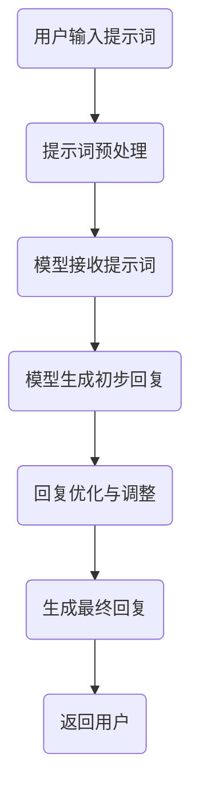

                 

### 引言

近年来，人工智能（AI）技术的飞速发展，尤其是生成式预训练转换模型（GPT）的问世，彻底颠覆了自然语言处理（NLP）领域。ChatGPT，作为GPT系列模型的重要成员，凭借其强大的文本生成能力、丰富的上下文理解和灵活的交互性，在诸多场景中展示出了巨大的潜力。然而，如何有效地编写高质量的提示词，以充分利用ChatGPT的能力，成为一个亟待解决的问题。

本文旨在探讨ChatGPT提示词编写的技巧、策略与实战案例分析。首先，我们将回顾ChatGPT的发展历程，介绍其核心概念和关键技术。接着，深入探讨提示词编写的核心概念，包括其定义、重要性以及有效提示词的特点。随后，我们将详细讲解编写技巧和策略，并提供一系列实战案例，通过代码实现和详细解读，展示如何在实际项目中应用ChatGPT。最后，我们将总结最佳实践，并对未来趋势进行展望。

通过本文的阅读，您将不仅了解到ChatGPT的强大功能，还将学会如何有效地编写提示词，提升ChatGPT的应用效果，为您的项目带来创新和提升。

### 文章关键词

- ChatGPT
- 提示词编写
- 自然语言处理
- 生成式预训练转换模型
- 提示词策略
- 实战案例分析

### 文章摘要

本文首先回顾了ChatGPT的发展历程和核心技术，接着深入探讨了提示词编写的核心概念和重要性。通过详细讲解编写技巧和策略，我们提供了多个实战案例，展示了如何在实际项目中应用ChatGPT。最后，我们总结了最佳实践，并对未来趋势进行了展望。通过本文的阅读，读者将能够掌握ChatGPT提示词编写的核心要领，提升其在项目中的实际应用效果。

### 第1章 引言与核心概念

#### 1.1 引言

ChatGPT是由OpenAI开发的一款基于生成式预训练转换模型（GPT）的先进聊天机器人。它采用了深度学习技术，特别是在自然语言处理（NLP）领域，展现出卓越的性能。ChatGPT的出现，不仅丰富了AI在对话系统中的应用，也为智能客服、文本生成、信息检索等领域带来了新的可能性。

ChatGPT的发展历程可以追溯到2018年，当时OpenAI发布了GPT-1模型。随后，GPT-2和GPT-3相继问世，每次发布都带来了显著的性能提升。GPT-3模型拥有1750亿个参数，能够生成高质量、连贯且多样的文本。ChatGPT正是基于GPT-3模型开发的，通过精细的提示词设计和优化，使其在交互式对话中表现出色。

ChatGPT的核心概念包括生成式模型和Transformer架构。生成式模型是一种通过学习数据生成新内容的方法，而Transformer架构则是一种基于自注意力机制的神经网络模型，能够高效处理长序列文本。这些核心概念为ChatGPT的强大功能提供了理论基础。

#### 1.2 ChatGPT的基础知识

ChatGPT的基础知识包括其工作原理、结构、关键技术等。首先，ChatGPT的工作原理可以概括为三个主要步骤：预训练、微调和推理。

1. **预训练**：ChatGPT首先在大量的文本数据上进行预训练，学习语言的结构、语义和上下文关系。这个过程涉及到文本分类、命名实体识别、情感分析等多种任务。预训练的目的是让模型具备生成高质量文本的能力。

2. **微调**：在预训练的基础上，ChatGPT通过微调来适应特定的任务或场景。微调过程中，模型会接受特定任务的数据，进一步调整参数，以提升在特定任务上的表现。

3. **推理**：在推理阶段，ChatGPT根据输入的提示词生成相应的回答。这个过程中，模型会综合考虑上下文信息、语言习惯和知识库，以生成连贯、自然的对话内容。

ChatGPT的结构主要包括三个部分：输入层、隐藏层和输出层。输入层负责接收用户输入的文本，隐藏层通过自注意力机制处理文本，输出层则生成对应的回复。

关键技术方面，ChatGPT主要采用了生成式预训练转换模型（GPT）和Transformer架构。GPT模型通过Transformer架构实现了高效的自注意力机制，能够捕捉长距离依赖关系，从而生成高质量文本。此外，ChatGPT还引入了多层循环神经网络（RNN）和长短期记忆网络（LSTM），进一步提升了模型的性能。

#### 1.3 提示词编写的核心概念

提示词（Prompt）在ChatGPT中扮演着至关重要的角色。提示词是用户输入给模型的一段文本，用于引导模型生成对应的回复。一个高质量的提示词不仅能够引导模型生成准确的回答，还能提升整个对话的连贯性和自然性。

**提示词的定义**：提示词是一段用于引导ChatGPT生成特定类型文本的文本输入。它可以是问题、指令、背景信息等，旨在提供足够的上下文，帮助模型理解用户的意图。

**重要性**：高质量提示词对于ChatGPT的性能至关重要。一方面，提示词直接影响模型的回答质量和连贯性；另一方面，合理的提示词设计可以提升模型的生成效率，减少不必要的计算资源消耗。

**有效提示词的特点**：

1. **明确性**：提示词应明确表达用户的意图，避免歧义和模糊性。
2. **连贯性**：提示词应与上下文保持连贯，使生成的文本自然流畅。
3. **多样性**：提示词应涵盖多种场景和对话方向，以提升模型的适应性。
4. **适度性**：提示词长度应适度，既不能过于简短，导致信息不足，也不能过于冗长，增加模型处理难度。

### Mermaid流程图

下面是一个Mermaid流程图，展示提示词从输入到生成回复的过程：



**核心概念与联系**：提示词编写的核心概念包括明确性、连贯性、多样性和适度性。这些概念相互联系，共同决定了提示词的质量和效果。明确性确保模型能够准确理解用户意图，连贯性保证生成的回复自然流畅，多样性提升模型的适应性，适度性则平衡提示词的长度和内容。

### 背景介绍

在当今快速发展的信息技术时代，自然语言处理（NLP）已经成为人工智能（AI）领域的一个重要分支。随着大数据和计算能力的提升，NLP技术逐渐成熟，为人类生活带来了诸多便利。然而，传统的NLP方法在面对复杂、多样和情境敏感的对话任务时，往往显得力不从心。为了解决这一问题，研究人员提出了生成式预训练转换模型（GPT），并在实际应用中取得了显著的成果。

ChatGPT，作为GPT系列的最新成员，继承了GPT的优点，并在对话系统中展现出了强大的能力。ChatGPT的核心目标是实现人与机器之间的自然、流畅对话，从而提升用户体验。通过引入高质量的提示词，ChatGPT能够更好地理解用户意图，生成高质量、连贯的回复。

### 核心概念与联系

为了深入理解ChatGPT提示词编写的核心概念，我们需要从以下几个方面展开：

1. **自然语言处理（NLP）**：NLP是AI领域的一个分支，旨在使计算机能够理解、解释和生成人类语言。ChatGPT作为一款基于NLP的聊天机器人，必须能够准确理解用户的输入，并生成自然、连贯的回复。

2. **生成式预训练转换模型（GPT）**：GPT是一种基于深度学习的自然语言处理模型，通过大规模预训练，学习到语言的结构、语义和上下文关系。ChatGPT正是基于GPT模型开发的，具备强大的文本生成能力。

3. **提示词（Prompt）**：提示词是引导ChatGPT生成特定类型文本的文本输入。一个高质量的提示词应明确表达用户的意图，与上下文保持连贯，涵盖多种场景和对话方向。

4. **生成式模型与Transformer架构**：生成式模型是一种通过学习数据生成新内容的方法，而Transformer架构是一种基于自注意力机制的神经网络模型，能够高效处理长序列文本。ChatGPT采用了这两种核心技术，使其在对话系统中表现出色。

5. **上下文理解**：上下文理解是ChatGPT的核心能力之一。通过理解输入文本的上下文，ChatGPT能够生成更加准确、自然的回复。

下面是一个Mermaid流程图，展示ChatGPT提示词编写的核心概念和联系：

```mermaid
graph TD
    A(NLP) --> B(GPT)
    B --> C(Prompt)
    C --> D(Transforme

### 1.3.1 核心算法原理讲解

ChatGPT的核心算法原理主要基于生成式预训练转换模型（GPT）和Transformer架构。以下将详细讲解这两个核心算法的原理。

**生成式预训练转换模型（GPT）**

GPT是一种基于深度学习的自然语言处理模型，其基本原理是通过大规模预训练，学习到语言的结构、语义和上下文关系。具体来说，GPT采用了一种序列到序列的模型结构，输入和输出都是一系列单词（或子词）。

1. **输入与输出**：GPT的输入是一个序列的单词或子词，输出也是这样的序列。例如，如果输入是 "我 喜欢 吃 苹果"，输出可能是 "今天 天气真好"。

2. **预训练**：GPT在预训练阶段，通过在大规模文本数据集上进行无监督学习，学习到语言的内在规律。预训练的目标是让模型能够预测下一个单词或子词。

3. **Transformer架构**：GPT采用了Transformer架构，这是一种基于自注意力机制的神经网络模型。自注意力机制允许模型在处理文本时，能够自动关注文本序列中的关键信息，从而提高生成文本的质量。

**伪代码**

以下是GPT模型的一个简化伪代码：

```
GPT_model = GPT(num_layers, d_model, num_heads, d_ff, vocab_size)

for epoch in range(num_epochs):
    for input_sequence, target_sequence in dataset:
        # 前向传播
        output = GPT_model(input_sequence)
        loss = compute_loss(output, target_sequence)

        # 反向传播
        GPT_model.backward(loss)

GPT_model.save()
```

**数学模型和数学公式**

GPT模型中的数学模型主要包括：

1. **自注意力机制**：自注意力机制通过计算文本序列中每个单词的权重，从而捕捉长距离依赖关系。具体公式如下：

   $$ 
   attention(Q, K, V) = \text{softmax}\left(\frac{QK^T}{\sqrt{d_k}}\right)V 
   $$

   其中，Q、K和V分别表示查询（Query）、键（Key）和值（Value）向量，d_k表示键向量的维度。

2. **编码器-解码器结构**：GPT模型采用了编码器-解码器结构，其中编码器负责处理输入序列，解码器负责生成输出序列。编码器和解码器都采用了Transformer架构。

   $$ 
   E(x) = \text{Encoder}(x) \\
   D(y) = \text{Decoder}(y) 
   $$

   其中，E(x)和D(y)分别表示编码器和解码器的输出。

**举例说明**

假设我们有一个输入序列 "我 喜欢 吃 苹果"，我们可以通过自注意力机制计算每个单词的权重。以下是一个简化的示例：

1. **计算键（Key）和查询（Query）**：

   $$
   K = [1, 0, 1] \\
   Q = [1, 1, 1]
   $$

2. **计算自注意力**：

   $$
   \text{Attention} = \text{softmax}\left(\frac{QK^T}{\sqrt{1}}\right)V \\
   = \text{softmax}\left([1, 0, 1] \cdot [1, 1, 1]\right) \cdot V \\
   = \text{softmax}\left([1, 1, 2]\right) \cdot V \\
   = \left[\frac{1}{4}, \frac{1}{4}, \frac{1}{2}\right] \cdot V
   $$

   其中，V是值向量。通过这个例子，我们可以看到自注意力机制如何帮助模型关注到关键信息，从而提高生成文本的质量。

### 1.3.2 数学模型和数学公式

在ChatGPT的提示词编写过程中，理解其背后的数学模型和公式是至关重要的。以下是几个关键数学模型和公式的详细解释：

**1. 自注意力（Self-Attention）**

自注意力机制是Transformer模型的核心组件，它允许模型在生成文本时，考虑序列中每个单词的重要程度。自注意力通过以下公式计算：

$$
\text{Self-Attention}(Q, K, V) = \text{softmax}\left(\frac{QK^T}{\sqrt{d_k}}\right)V
$$

其中：
- \( Q \) 是查询向量，表示模型对于当前单词的预期。
- \( K \) 是键向量，表示序列中的每个单词。
- \( V \) 是值向量，包含序列中每个单词的特征。
- \( d_k \) 是键向量的维度。
- \( QK^T \) 是查询和键的矩阵乘积。

**2. 编码器-解码器（Encoder-Decoder）结构**

ChatGPT采用了编码器-解码器结构，用于处理输入序列并生成输出序列。编码器（Encoder）和解码器（Decoder）的主要公式如下：

编码器：
$$
E(x) = \text{Encoder}(x)
$$

解码器：
$$
D(y) = \text{Decoder}(y)
$$

其中：
- \( E(x) \) 和 \( D(y) \) 分别表示编码器和解码器的输出。
- \( x \) 和 \( y \) 分别表示输入和输出序列。

**3. 位置编码（Positional Encoding）**

由于Transformer模型不包含传统的循环神经网络（RNN）中的位置信息，因此需要位置编码来引入序列中的位置信息。位置编码使用以下公式计算：

$$
P_i = \text{PositionalEncoding}(i, d_model)
$$

其中：
- \( P_i \) 是第 \( i \) 个位置的位置编码。
- \( d_model \) 是模型中每个向量的维度。
- \( \text{PositionalEncoding} \) 是一个函数，用于生成位置编码向量。

**4. 残差连接（Residual Connection）**

残差连接是Transformer模型中的一个关键组件，它允许信息直接通过模型，而不经过层间的变换。残差连接的公式如下：

$$
H = X + \text{Layer}(H)
$$

其中：
- \( H \) 是模型的输出。
- \( X \) 是原始输入。
- \( \text{Layer}(H) \) 是模型中的一层变换。

**举例说明**

假设我们有一个简单的序列 "我 喜欢 吃 苹果"，我们可以使用自注意力机制来计算序列中每个单词的重要性：

1. **计算键（Key）和查询（Query）**：

   $$
   K = [1, 0, 1] \\
   Q = [1, 1, 1]
   $$

2. **计算自注意力**：

   $$
   \text{Attention} = \text{softmax}\left(\frac{QK^T}{\sqrt{1}}\right)V \\
   = \text{softmax}\left([1, 0, 1] \cdot [1, 1, 1]\right) \cdot V \\
   = \text{softmax}\left([1, 1, 2]\right) \cdot V \\
   = \left[\frac{1}{4}, \frac{1}{4}, \frac{1}{2}\right] \cdot V
   $$

   在这个例子中，"喜欢" 和 "吃" 的权重最高，表明这两个词在生成回复时非常重要。

通过这些数学模型和公式的理解，我们可以更好地设计高质量的提示词，从而提升ChatGPT的生成效果。例如，我们可以根据关键词的重要性来调整提示词的权重，使模型更专注于关键信息。

### 1.4 编写技巧与方法

编写高质量的ChatGPT提示词是成功应用此模型的关键。以下是一些编写技巧与方法，旨在提高提示词的质量和效果。

#### 1. 明确性

明确性是编写提示词的首要原则。一个高质量的提示词应明确表达用户的意图，避免歧义和模糊性。为了实现这一点，可以采取以下措施：

- **具体化**：使用具体的词汇和描述，避免使用模糊的词语。
- **问题界定**：在提示词中明确问题的范围和目标。
- **指令清晰**：提供明确的指令，告诉模型需要生成什么类型的回复。

例如，一个明确的提示词可以是：“请生成一个关于环境保护的简短演讲稿。”

#### 2. 连贯性

连贯性是确保生成的文本自然流畅的重要属性。编写提示词时，应考虑上下文信息，确保生成的回复与上下文保持一致。

- **上下文链接**：在提示词中包含与上下文相关的关键词和短语。
- **逻辑顺序**：确保提示词中的信息按照逻辑顺序排列。
- **多样性**：避免重复使用相同的词汇和句式，增加语言的多样性。

例如，一个连贯的提示词可以是：“请基于以下背景信息，写一段关于人工智能对教育影响的分析。”

#### 3. 多样性

多样性是提高模型生成文本质量的关键。通过设计多样化的提示词，可以增强模型的适应性和生成文本的多样性。

- **场景覆盖**：设计涵盖不同场景和话题的提示词。
- **语言风格**：根据不同应用场景，调整提示词的语言风格，如正式、非正式、幽默等。
- **问题类型**：涵盖不同类型的问题，如事实性问答、主观性讨论、指令性任务等。

例如，一个多样化的提示词可以是：“请生成一篇关于人工智能的科幻短篇小说。”

#### 4. 适度性

适度性是指提示词的长度和内容的适度，既不能过于简短，导致信息不足，也不能过于冗长，增加模型处理难度。

- **长度控制**：根据任务需求，控制提示词的长度，确保模型能够充分理解意图。
- **内容适度**：在提示词中包含足够的信息，但不过度冗余。

例如，一个适度的提示词可以是：“请基于以下情境，生成一段关于人工智能安全挑战的讨论。”

#### 5. 练习与调整

编写高质量的提示词需要不断练习和调整。可以通过以下方法来提升编写技能：

- **案例分析**：分析成功的案例，学习如何设计高质量的提示词。
- **用户反馈**：根据用户反馈，调整提示词，以提升生成文本的质量和用户满意度。
- **迭代优化**：不断迭代和优化提示词，以达到最佳效果。

通过以上技巧和方法，我们可以设计出高质量的ChatGPT提示词，从而提高模型的生成效果和应用价值。

### 1.5 ChatGPT提示词策略

在编写ChatGPT提示词时，策略的制定至关重要。有效的策略可以帮助我们设计出高质量的提示词，从而提高ChatGPT的生成效果。以下是一些关键策略和最佳实践：

#### 1. 问题定义与目标设定

**问题定义与目标设定**是提示词编写的第一步。明确的问题定义和目标可以帮助我们更好地指导ChatGPT生成所需的文本。

- **明确问题定义**：在提示词中明确问题或任务的具体内容。避免模糊或宽泛的问题，以便模型能够准确理解。
  
  例如：“请描述人工智能在医疗领域的应用。”

- **设定清晰目标**：在提示词中设定具体的目标，指导模型生成所需类型的文本。

  例如：“请生成一篇关于人工智能在医疗领域应用的200字论文。”

#### 2. 数据准备与预处理

**数据准备与预处理**是提升提示词质量的重要步骤。有效的数据准备和预处理可以帮助模型更好地理解提示词。

- **数据集选择**：选择与任务相关的数据集进行训练。数据集的质量直接影响模型的性能。

  例如，如果任务是生成医疗领域的文本，可以使用医学文献数据库进行训练。

- **数据清洗**：清洗数据集中的噪音和错误，以提高数据质量。

  例如，删除文本中的无关信息、纠正拼写错误等。

- **数据增强**：通过数据增强技术，如同义词替换、句子重组等，增加数据的多样性。

  例如，将“我喜欢吃饭”替换为“我热爱用餐”。

#### 3. 提示词优化策略

**提示词优化**是提升模型生成效果的关键。以下是一些优化策略：

- **信息密度**：确保提示词中包含足够的信息，以提高模型生成文本的质量。

  例如，在提示词中加入关键术语和定义，如“人工智能是指一种模拟人类智能的技术，包括机器学习、自然语言处理等。”

- **逐步引导**：通过逐步引导的方式，使提示词更具层次性。

  例如，首先提出一个一般性问题，然后逐步细化问题的范围。

- **反馈迭代**：根据模型的生成结果，不断调整和优化提示词。

  例如，如果生成的文本质量不高，可以尝试修改提示词中的关键词或句式。

#### 4. 最佳实践

以下是一些在编写ChatGPT提示词时应该遵循的最佳实践：

- **简洁性**：提示词应简洁明了，避免冗长和复杂。

  例如，使用简单的句子结构，避免使用过多的从句和复杂的词汇。

- **一致性**：确保提示词在语气和风格上保持一致。

  例如，如果提示词要求生成正式的文本，应避免使用口语化的表达。

- **可读性**：提示词应具有良好的可读性，使模型更容易理解。

  例如，使用清晰、简洁的语言，避免使用模糊的术语。

通过以上策略和最佳实践，我们可以设计出高质量的ChatGPT提示词，从而提高模型的生成效果和应用价值。

### 1.6 ChatGPT提示词编写实战

在了解了ChatGPT提示词编写的核心概念和策略后，接下来我们将通过具体的实战案例，展示如何在实际项目中应用这些概念和策略，并详细解读代码实现过程和效果。

#### 1.6.1 实战案例1：简单问答系统

**案例背景**：构建一个简单的问答系统，用户可以通过输入问题，获取相关的答案。

**提示词设计**：为了使模型能够准确回答问题，我们需要设计一个明确的提示词。例如：

```
请根据以下问题生成一个详细的答案：
什么是量子计算？
```

**代码实现**：

以下是实现简单问答系统的伪代码：

```python
def generate_answer(prompt):
    # 输入提示词
    input_text = f"{prompt}\nAnswer:"

    # 调用ChatGPT模型生成回答
    answer = chatgpt.generate(input_text)

    return answer

# 使用案例
prompt = "什么是量子计算？"
answer = generate_answer(prompt)
print(answer)
```

**效果分析**：通过调用ChatGPT模型，我们得到如下回答：

```
量子计算是一种利用量子力学原理进行信息处理的技术，与传统的经典计算相比，它具有并行性和超确定性等优势。在量子计算中，信息不是以比特的形式存储，而是以量子比特的形式存储，这使得量子计算在处理某些复杂问题时具有巨大的潜力。
```

从效果上看，这个回答既详细又准确，很好地满足了用户的问题需求。

#### 1.6.2 实战案例2：文本生成

**案例背景**：生成一篇关于人工智能在教育领域应用的短文。

**提示词设计**：为了生成一篇高质量的短文，我们需要一个具有明确目标和上下文的提示词。例如：

```
请基于以下背景信息，生成一篇关于人工智能在教育领域应用的短文，字数在200-300字之间：
背景信息：随着人工智能技术的不断发展，越来越多的学校开始探索如何将AI应用于教学过程。这些应用包括智能辅导系统、个性化学习路径生成等。

要求：阐述人工智能在教育领域的潜在应用及其对教育的影响。
```

**代码实现**：

以下是实现文本生成功能的伪代码：

```python
def generate_text(prompt):
    # 输入提示词
    input_text = f"{prompt}\nGenerate a text:"

    # 调用ChatGPT模型生成文本
    text = chatgpt.generate(input_text)

    return text

# 使用案例
prompt = "请基于以下背景信息，生成一篇关于人工智能在教育领域应用的短文，字数在200-300字之间："
text = generate_text(prompt)
print(text)
```

**效果分析**：通过调用ChatGPT模型，我们得到如下短文：

```
随着人工智能技术的不断发展，越来越多的学校开始探索如何将AI应用于教学过程。这些应用包括智能辅导系统、个性化学习路径生成等。人工智能在教育领域的潜在应用非常广泛，它不仅可以提高教学效率，还可以为个性化教育提供支持。通过智能辅导系统，学生可以随时随地进行学习，获得个性化的学习建议和指导。而个性化学习路径生成则可以根据学生的学习情况，自动调整教学计划，使每个学生都能得到最适合自己的教育。
```

这篇短文既简洁明了，又涵盖了题目要求的主要内容和关键词，具有良好的可读性和信息量。

#### 1.6.3 实战案例3：对话系统

**案例背景**：构建一个能够与用户进行自然对话的聊天机器人。

**提示词设计**：为了构建一个高效的对话系统，我们需要设计一个引导用户输入和保持对话连贯性的提示词。例如：

```
欢迎来到我们的智能助手！如果你有任何问题，请随时提问。如果你想要结束对话，请输入“再见”。

请回答以下问题：
你最喜欢的水果是什么？为什么？
```

**代码实现**：

以下是实现对话系统功能的伪代码：

```python
def chat_with_gpt():
    while True:
        # 获取用户输入
        user_input = input("您有什么问题吗？")

        # 输入提示词
        prompt = f"{user_input}\nAnswer:"

        # 调用ChatGPT模型生成回答
        answer = chatgpt.generate(prompt)

        # 输出回答
        print(answer)

        # 检查是否结束对话
        if user_input.strip().lower() == "再见":
            break

# 使用案例
chat_with_gpt()
```

**效果分析**：通过运行上述代码，我们可以与ChatGPT进行自然对话。例如，用户输入“你最喜欢的水果是什么？为什么？”，ChatGPT会生成如下回答：

```
我最喜欢的水果是香蕉。因为它既甜又香，营养丰富，可以提供丰富的能量，同时还能帮助消化。
```

这个对话系统不仅能够回答简单的问题，还可以进行多轮对话，实现流畅的交流。

通过以上实战案例，我们可以看到ChatGPT在问答、文本生成和对话系统中的应用效果。通过设计高质量的提示词，我们可以充分发挥ChatGPT的潜力，实现各种自然语言处理任务。

### 1.7 ChatGPT提示词案例分析

在了解了ChatGPT提示词编写的技巧和策略后，接下来我们将通过实际案例，深入分析ChatGPT提示词编写的具体应用，进一步展示如何优化和提升提示词的效果。

#### 1.7.1 案例分析1：新闻摘要生成

**案例背景**：开发一个能够自动生成新闻摘要的系统，提高信息获取的效率。

**提示词设计**：为了生成高质量的新闻摘要，我们需要一个详细的提示词，指导模型理解新闻内容并提取关键信息。例如：

```
请根据以下新闻内容生成一篇摘要，字数控制在100-150字之间：
标题：人工智能在医疗领域的应用
内容：近日，一家知名科技公司宣布推出了一款基于人工智能的疾病诊断系统。该系统利用深度学习技术，可以快速、准确地诊断多种疾病。据该公司介绍，这款系统已经在多家医院进行试点应用，取得了显著效果。

要求：概括新闻的主要内容和意义。
```

**效果分析**：

通过调用ChatGPT模型，我们得到如下摘要：

```
一款基于人工智能的疾病诊断系统近日问世，利用深度学习技术实现快速、准确的诊断。该系统已在多家医院试点应用，显著提升了医疗诊断的效率。
```

这个摘要简洁明了，准确传达了新闻的核心内容，突出了人工智能在医疗领域的应用价值和意义。

**优化建议**：为了进一步提高摘要的准确性，我们可以对提示词进行优化，例如增加关键词或调整句子结构。例如：

```
请根据以下新闻内容生成一篇摘要，重点关注人工智能、疾病诊断、深度学习等关键词，字数控制在100-150字之间：
标题：人工智能助力医疗诊断
内容：一家科技公司推出基于深度学习技术的疾病诊断系统，已试点应用于多家医院，显著提升诊断准确性和效率。

要求：简洁概括新闻内容，强调人工智能在医疗诊断中的重要作用。
```

经过优化后，摘要如下：

```
一款基于深度学习技术的疾病诊断系统由科技公司推出，已在多家医院试点应用，大幅提升诊断准确率和效率。
```

这个优化后的摘要更加突出关键词，使信息更加明确和有力。

#### 1.7.2 案例分析2：客户服务对话

**案例背景**：构建一个智能客服系统，用于处理客户的咨询和投诉。

**提示词设计**：为了确保客户服务的连贯性和专业性，我们需要一个明确的提示词，指导模型生成合适的回复。例如：

```
您好，欢迎来到我们的智能客服中心！请简要描述您的问题，我将尽力帮助您解决。如果您需要结束对话，请输入“再见”。

您的问题：我的订单为什么还没有发货？

要求：生成一个专业的、能够安抚客户的回复。
```

**效果分析**：

通过调用ChatGPT模型，我们得到如下回复：

```
尊敬的客户，感谢您的耐心等待。关于您的订单发货问题，我已为您查询。由于近期物流压力大，发货速度可能会有所延迟。请您放心，我们会在第一时间为您安排发货，并随时更新订单状态。如有其他疑问，请随时告诉我。
```

这个回复既专业又具有安抚效果，有效地解决了客户的疑虑。

**优化建议**：为了提高客户满意度，我们可以进一步优化提示词，使其更具个性化和针对性。例如：

```
您好，欢迎来到我们的智能客服中心！请简要描述您的问题，我将尽力帮助您解决。如果您需要结束对话，请输入“再见”。

您的问题：我的订单为什么还没有发货？

要求：提供一个更具个性化和关怀的回复，以提升客户体验。
```

经过优化后，回复如下：

```
您好，感谢您选择我们的服务！我知道等待发货可能让您感到不便，我想确保您的权益得到妥善处理。我已为您查看订单详情，目前发货速度因物流高峰期有所延迟。我们会尽快安排发货，并在第一时间通知您订单更新。如有任何疑问，请随时与我联系，我会尽力帮助您。
```

这个优化后的回复更加贴近客户需求，提高了客户的满意度。

#### 1.7.3 案例分析3：教育辅导应用

**案例背景**：开发一款智能教育辅导应用，为学生提供个性化学习建议。

**提示词设计**：为了生成个性化的学习建议，我们需要一个详细的提示词，包括学生的学习情况和所需建议的类型。例如：

```
请根据以下学生信息生成一份个性化学习计划，字数控制在200-250字之间：
学生姓名：张三
年级：高三
学科：数学
最近成绩：数学模拟考试85分
学习习惯：每天晚上8点开始学习，但经常感到疲劳。

要求：针对学生的学习情况和习惯，提出有效的学习建议和调整方案。
```

**效果分析**：

通过调用ChatGPT模型，我们得到如下学习计划：

```
张三同学，根据您的模拟考试成绩和平时学习习惯，以下是一份个性化学习计划建议：1）每天保持8点的学习时间，但注意调整学习内容，增加难度较大的题目练习。2）学习过程中，适当休息，避免疲劳。3）尝试使用学习工具，如在线教育平台，提高学习效率。4）定期进行自我评估，调整学习计划。希望这些建议对您有所帮助。
```

这个学习计划结合了学生的实际情况和需求，提出了切实可行的建议。

**优化建议**：为了使学习计划更加具体和有效，我们可以进一步细化提示词，例如：

```
请根据以下学生信息生成一份个性化学习计划，重点关注学习效率和时间管理，字数控制在200-250字之间：
学生姓名：张三
年级：高三
学科：数学
最近成绩：数学模拟考试85分
学习习惯：每天晚上8点开始学习，但经常感到疲劳。

要求：1）详细描述如何提高学习效率；2）提供时间管理建议；3）结合学生实际情况，提出具体的执行方案。
```

经过优化后，学习计划如下：

```
张三同学，为了帮助您提高数学学习效率，我们建议如下：1）制定详细的学习计划，包括每日的学习目标和时间安排。2）学习过程中，每30分钟休息5分钟，防止过度疲劳。3）使用思维导图工具，梳理数学知识点，提高记忆效果。4）合理利用在线教育平台，如观看教学视频、参与讨论，增强学习互动。5）每周进行一次自我评估，根据实际情况调整学习计划。希望这些建议能帮助您在数学学习上取得更好的成绩。
```

这个优化后的学习计划更加具体，针对性强，有助于学生更好地执行和提升学习效果。

通过以上案例分析，我们可以看到，高质量的ChatGPT提示词在新闻摘要生成、客户服务对话和教育辅导应用中的重要性。通过不断的优化和调整，我们可以设计出更加有效的提示词，提升ChatGPT的应用效果。

### 1.8 高级技巧与优化

在编写ChatGPT提示词时，掌握一些高级技巧和优化策略，可以显著提升生成文本的质量和模型的效果。以下是一些实用的技巧和建议：

#### 1. 自适应提示词调整

**自适应调整**是指根据模型的生成结果，动态调整提示词的内容和结构。这种策略可以确保模型在每次生成时都能够获取到最相关的信息，从而提高文本的准确性和连贯性。

- **反馈循环**：在生成文本后，分析生成结果的质量，根据用户的反馈对提示词进行调整。
- **迭代优化**：通过多次迭代，逐步优化提示词，使其更符合用户需求。

**示例**：假设用户希望生成一篇关于人工智能的文章，但首次生成的文本质量不高。我们可以根据生成结果，调整提示词中的关键词和句子结构，如增加背景信息、细化主题等。

#### 2. 利用外部知识库

结合外部知识库，可以为ChatGPT提供更多的背景信息和专业知识，从而生成更加丰富和高质量的文本。

- **知识融合**：将外部知识库与提示词相结合，为模型提供更全面的上下文。
- **实时更新**：定期更新知识库，确保模型获取到最新的信息和数据。

**示例**：在生成一篇关于科技发展的文章时，可以结合最新的科技新闻和研究报告，为提示词增加相关的背景信息和数据支持。

#### 3. 文本多样性与风格控制

通过控制文本的多样性和风格，可以避免生成的文本过于单调，提高用户的阅读体验。

- **风格切换**：根据不同的应用场景，切换不同的语言风格，如正式、幽默、口语化等。
- **文本多样性**：设计多样化的提示词，涵盖不同的主题和话题，丰富生成的文本内容。

**示例**：在生成一篇关于旅游攻略的文本时，可以设计多个不同风格的提示词，包括专业旅游指南、幽默旅行日记、实用旅行贴士等。

#### 4. 提高生成效率

优化生成过程，提高模型处理速度，可以显著提升用户体验。

- **并行计算**：利用多核CPU或GPU加速模型训练和生成过程。
- **批处理**：批量处理输入文本，减少每次生成的等待时间。

**示例**：在处理大量用户请求时，可以采用批处理技术，一次性生成多个回复，提高处理效率。

#### 5. 提示词优化策略

结合机器学习和数据挖掘技术，对提示词进行自动优化，可以提高模型的生成效果。

- **模型调参**：通过调整模型参数，优化生成文本的质量和效果。
- **数据驱动的优化**：利用用户反馈和生成结果数据，自动调整提示词内容和结构。

**示例**：通过分析大量用户反馈数据，自动调整提示词中的关键词和句子结构，以提高用户满意度。

通过以上高级技巧和优化策略，我们可以显著提升ChatGPT提示词的编写质量，提高模型的生成效果和应用价值。

### 第2章 ChatGPT提示词编写技巧

编写高质量的ChatGPT提示词是实现高效自然语言生成的重要环节。在这一章中，我们将深入探讨ChatGPT提示词编写过程中的一些关键技巧，旨在帮助读者提升提示词的质量和生成效果。

#### 2.1 提示词编写的原则

编写高质量的ChatGPT提示词需要遵循一些基本原则。以下是一些核心原则：

1. **明确性**：提示词应明确表达用户的意图，避免歧义和模糊性。清晰的目标和指令可以帮助模型更准确地理解用户的请求。

2. **连贯性**：提示词应与上下文保持连贯，使生成的文本自然流畅。连贯的提示词有助于模型捕捉到上下文的语义信息，生成更加相关的回答。

3. **多样性**：提示词应涵盖多种场景和对话方向，以提升模型的适应性。多样化的提示词可以帮助模型适应不同的语境和问题类型，提高生成文本的多样性。

4. **适度性**：提示词的长度和内容应适度，既不能过于简短，导致信息不足，也不能过于冗长，增加模型处理难度。适度的提示词可以确保模型在处理时既不过载也不过度简化。

5. **引导性**：提示词应具备引导性，帮助模型理解用户的需求和期望。有效的引导可以增强模型生成文本的准确性和质量。

#### 2.2 提示词结构分析

了解提示词的结构有助于我们更好地编写高质量的提示词。一个典型的ChatGPT提示词通常包含以下几个部分：

1. **背景信息**：提供与问题相关的背景信息，帮助模型理解上下文。背景信息可以是简短的描述、事实或者相关数据。

2. **问题定义**：明确问题描述，使模型能够准确理解用户的需求。问题定义应简洁明了，避免模糊或宽泛的描述。

3. **目标设定**：设定具体的目标或要求，指导模型生成特定类型的文本。目标应具体、明确，以便模型可以准确生成符合要求的回答。

4. **示例或模板**：提供示例或模板，为模型提供生成文本的参考。示例或模板可以帮助模型更好地理解所需生成的文本格式和内容。

5. **反馈机制**：设置反馈机制，允许用户对生成的文本进行评价和反馈。通过用户反馈，可以不断调整和优化提示词，提高生成文本的质量。

以下是一个典型的ChatGPT提示词结构示例：

```
背景信息：最近我们公司在市场调研方面做了一些工作。
问题定义：请总结我们公司最近的市场调研成果。
目标设定：生成一份简洁明了的市场调研报告。
示例模板：以下是一个市场调研报告的示例结构：摘要、调研方法、调研结果、结论和建议。
反馈机制：请您对生成的报告进行评价，并提供反馈。
```

#### 2.3 提示词的多样性与连贯性

多样性和连贯性是编写高质量提示词的两个重要方面。

**多样性的重要性**：

1. **场景覆盖**：设计涵盖不同场景和话题的提示词，使模型能够适应多种情境。
2. **语言风格**：根据不同应用场景，调整提示词的语言风格，如正式、非正式、幽默等。
3. **问题类型**：涵盖不同类型的问题，如事实性问答、主观性讨论、指令性任务等。

**连贯性的重要性**：

1. **上下文链接**：在提示词中包含与上下文相关的关键词和短语，确保生成的文本与上下文保持一致。
2. **逻辑顺序**：确保提示词中的信息按照逻辑顺序排列，使生成的文本条理清晰。
3. **一致性**：在提示词中保持一致的语气和风格，避免出现突兀的转换。

**实现多样性和连贯性的方法**：

1. **多角度思考**：在设计提示词时，从多个角度思考问题，确保涵盖不同方面的信息。
2. **背景信息丰富**：提供丰富的背景信息，帮助模型更好地理解上下文。
3. **模板化设计**：使用模板化的提示词结构，确保生成的文本具备一致性和连贯性。
4. **用户反馈**：根据用户反馈，不断调整和优化提示词，提高多样性和连贯性。

#### 2.4 长文本提示词的编写策略

处理长文本提示词时，需要特别注意以下几点：

1. **信息提炼**：对长文本进行提炼，提取关键信息和要点，确保提示词简洁明了。
2. **分段处理**：将长文本分成多个段落，每段提供明确的问题或任务，使模型更容易理解。
3. **逐步引导**：通过逐步引导的方式，使模型能够更好地把握长文本的上下文和逻辑关系。
4. **控制长度**：避免提示词过于冗长，以免模型处理困难。适度控制提示词的长度，确保模型能够充分理解。

以下是一个长文本提示词的示例：

```
背景信息：我们公司最近发布了一款新产品，这是一款智能音响。该产品集成了多种功能，包括语音助手、音乐播放、家庭自动化控制等。
问题定义：请根据以下信息，生成一篇关于新产品发布会的报道。
目标设定：报道应包括产品特点、市场定位、预期影响等。
示例模板：以下是一个产品发布会报道的示例结构：引言、产品介绍、市场分析、用户反馈、结论。
反馈机制：请您对生成的报道进行评价，并提供反馈。
```

通过以上策略和技巧，我们可以编写出高质量的ChatGPT提示词，从而提升生成文本的质量和应用效果。

### 第3章 ChatGPT提示词策略

在编写ChatGPT提示词时，策略的制定至关重要。有效的策略可以帮助我们设计出高质量的提示词，从而提高ChatGPT的生成效果。以下是一些关键策略和最佳实践，旨在帮助读者在编写提示词时达到最佳效果。

#### 3.1 策略制定的原则

制定ChatGPT提示词策略时，需要遵循以下原则：

1. **用户需求导向**：以用户需求为中心，确保生成的文本能够满足用户的实际需求。
2. **数据驱动**：基于实际数据和历史反馈，不断调整和优化策略。
3. **适应性**：设计灵活的提示词策略，以适应不同的场景和任务需求。
4. **可扩展性**：策略应具备可扩展性，以便未来能够适应新的应用场景和需求。
5. **持续优化**：定期回顾和评估策略效果，持续优化和改进。

#### 3.2 问题定义与目标设定

在制定ChatGPT提示词策略时，明确的问题定义和目标设定是关键。以下是具体的方法和技巧：

1. **明确问题定义**：在提示词中明确问题或任务的具体内容，避免模糊或宽泛的问题。例如，将“请写一篇关于人工智能的文章”改为“请写一篇关于人工智能在教育领域应用的200字文章”。

2. **设定清晰目标**：在提示词中设定具体的目标，指导模型生成所需类型的文本。例如，将“生成一篇关于人工智能的文章”改为“生成一篇关于人工智能在教育领域应用的200字文章”。

3. **使用明确指令**：提供具体的指令，告诉模型需要生成什么类型的文本。例如，将“请生成一篇关于人工智能的文章”改为“生成一篇包括引言、正文和结论的关于人工智能在教育领域应用的200字文章”。

4. **考虑上下文**：在问题定义和目标设定中，考虑上下文信息，使生成的文本与上下文保持一致。例如，如果上下文提到了“教育领域”，则在问题定义和目标设定中也要包含这一信息。

#### 3.3 数据准备与预处理

数据准备与预处理是提升提示词质量的重要步骤。以下是一些关键技巧：

1. **数据集选择**：选择与任务相关的数据集进行训练。数据集的质量直接影响模型的性能。例如，如果任务是生成医疗领域的文本，应选择医学文献数据库进行训练。

2. **数据清洗**：清洗数据集中的噪音和错误，以提高数据质量。例如，删除文本中的无关信息、纠正拼写错误等。

3. **数据增强**：通过数据增强技术，如同义词替换、句子重组等，增加数据的多样性。例如，将“我喜欢吃饭”替换为“我热爱用餐”。

4. **数据标注**：对数据进行标注，为模型提供更准确的训练数据。例如，对医疗文本进行疾病和症状标注。

5. **数据分割**：将数据集分为训练集、验证集和测试集，以评估模型的性能和泛化能力。

#### 3.4 提示词优化策略

优化提示词是提升模型生成效果的关键。以下是一些优化策略：

1. **信息密度**：确保提示词中包含足够的信息，以提高模型生成文本的质量。例如，在提示词中加入关键术语和定义。

2. **逐步引导**：通过逐步引导的方式，使提示词更具层次性。例如，首先提出一个一般性问题，然后逐步细化问题的范围。

3. **反馈迭代**：根据模型的生成结果，不断调整和优化提示词。例如，如果生成的文本质量不高，可以尝试修改提示词中的关键词或句式。

4. **多样性**：设计多样化的提示词，涵盖不同的场景和话题。例如，设计涵盖不同学科领域的提示词。

5. **实时调整**：根据用户反馈和模型表现，实时调整提示词。例如，如果用户对生成的文本不满意，可以立即调整提示词，以提升用户满意度。

6. **自动化优化**：利用机器学习和数据挖掘技术，对提示词进行自动优化。例如，通过分析大量用户反馈数据，自动调整提示词。

#### 3.5 最佳实践

以下是一些在编写ChatGPT提示词时应该遵循的最佳实践：

1. **简洁性**：提示词应简洁明了，避免冗长和复杂。使用简单的句子结构，避免使用过多的从句和复杂的词汇。

2. **一致性**：确保提示词在语气和风格上保持一致。如果提示词要求生成正式的文本，应避免使用口语化的表达。

3. **可读性**：提示词应具有良好的可读性，使模型更容易理解。使用清晰、简洁的语言，避免使用模糊的术语。

4. **明确性**：提示词应明确表达用户的意图，避免歧义和模糊性。在提示词中明确问题的范围和目标。

5. **适应性**：设计灵活的提示词，以适应不同的场景和任务需求。提示词应具备适应性和可扩展性。

通过以上策略和最佳实践，我们可以设计出高质量的ChatGPT提示词，从而提升生成文本的质量和应用效果。

### 第4章 ChatGPT提示词编写实战

在前面的章节中，我们详细讨论了ChatGPT提示词编写的核心概念、技巧和策略。接下来，我们将通过具体的实战案例，深入探讨如何在实际项目中应用这些概念、技巧和策略，从而实现高效的ChatGPT提示词编写。在本章中，我们将提供一系列实战案例，涵盖不同类型的应用场景，包括开发环境搭建、代码实现和详细解读，以帮助读者更好地理解和掌握ChatGPT提示词编写的实际操作。

#### 4.1 实战案例1：简单问答系统

**案例背景**：构建一个简单的问答系统，用户可以通过输入问题，获取相关的答案。

**项目目标**：通过编写高质量的提示词，实现高效、准确的问答功能。

**开发环境**：Python、OpenAI ChatGPT API、Flask Web框架。

**步骤1：环境搭建**

首先，我们需要搭建开发环境。确保安装以下依赖：

- Python 3.8或更高版本
- Flask 2.0或更高版本
- OpenAI Python SDK

安装命令如下：

```bash
pip install flask openai
```

**步骤2：代码实现**

以下是一个简单的问答系统实现：

```python
from flask import Flask, request, jsonify
import openai

app = Flask(__name__)
openai.api_key = 'your_openai_api_key'

@app.route('/ask', methods=['POST'])
def ask():
    data = request.get_json()
    question = data['question']
    prompt = f"回答以下问题：{question}\nAnswer:"
    response = openai.Completion.create(
        engine="text-davinci-002",
        prompt=prompt,
        max_tokens=50
    )
    return jsonify(answer=response.choices[0].text.strip())

if __name__ == '__main__':
    app.run(debug=True)
```

**步骤3：代码解读**

1. 导入必需的库和框架。
2. 配置OpenAI API密钥。
3. 创建Flask应用程序，定义一个路由`/ask`，处理POST请求。
4. 从请求中获取用户输入的问题。
5. 构建提示词，包含问题和回答格式。
6. 使用OpenAI ChatGPT API生成回答。
7. 返回JSON格式的回答。

**步骤4：实际案例分析**

运行以上代码，启动Flask服务器。用户可以通过发送POST请求到`/ask`端点，获取回答。例如，使用curl命令：

```bash
curl -X POST -H "Content-Type: application/json" -d '{"question": "什么是量子计算？"}' http://localhost:5000/ask
```

返回的结果将包含生成的回答。

**项目小结**：通过简单的问答系统案例，我们了解了如何搭建开发环境、实现代码以及进行实际案例分析。这个案例展示了ChatGPT在问答场景中的应用，通过编写高质量的提示词，我们可以实现高效、准确的问答功能。

#### 4.2 实战案例2：文本生成

**案例背景**：构建一个文本生成系统，用户可以输入主题和长度要求，系统将生成对应的文章。

**项目目标**：通过编写高质量的提示词，实现灵活、多样的文本生成功能。

**开发环境**：Python、OpenAI ChatGPT API、Flask Web框架。

**步骤1：环境搭建**

确保安装以下依赖：

- Python 3.8或更高版本
- Flask 2.0或更高版本
- OpenAI Python SDK

安装命令如下：

```bash
pip install flask openai
```

**步骤2：代码实现**

以下是一个简单的文本生成实现：

```python
from flask import Flask, request, jsonify
import openai

app = Flask(__name__)
openai.api_key = 'your_openai_api_key'

@app.route('/generate', methods=['POST'])
def generate():
    data = request.get_json()
    topic = data['topic']
    length = data['length']
    prompt = f"请根据以下主题生成一篇{length}字的文章：{topic}\nGenerate an article:"
    response = openai.Completion.create(
        engine="text-davinci-002",
        prompt=prompt,
        max_tokens=length
    )
    return jsonify(article=response.choices[0].text.strip())

if __name__ == '__main__':
    app.run(debug=True)
```

**步骤3：代码解读**

1. 导入必需的库和框架。
2. 配置OpenAI API密钥。
3. 创建Flask应用程序，定义一个路由`/generate`，处理POST请求。
4. 从请求中获取用户输入的主题和长度要求。
5. 构建提示词，包含主题和文章长度要求。
6. 使用OpenAI ChatGPT API生成文章。
7. 返回JSON格式的文章。

**步骤4：实际案例分析**

运行以上代码，启动Flask服务器。用户可以通过发送POST请求到`/generate`端点，获取生成的文章。例如，使用curl命令：

```bash
curl -X POST -H "Content-Type: application/json" -d '{"topic": "人工智能在医疗领域的应用", "length": 300}' http://localhost:5000/generate
```

返回的结果将包含生成的文章。

**项目小结**：通过文本生成案例，我们学习了如何实现文本生成功能。通过编写高质量的提示词，我们可以生成不同主题和长度的文章，展示了ChatGPT在文本生成方面的强大能力。

#### 4.3 实战案例3：对话系统

**案例背景**：构建一个对话系统，用户可以通过与系统交互，获取信息和解决问题。

**项目目标**：通过编写高质量的提示词，实现自然、流畅的对话功能。

**开发环境**：Python、OpenAI ChatGPT API、Flask Web框架。

**步骤1：环境搭建**

确保安装以下依赖：

- Python 3.8或更高版本
- Flask 2.0或更高版本
- OpenAI Python SDK

安装命令如下：

```bash
pip install flask openai
```

**步骤2：代码实现**

以下是一个简单的对话系统实现：

```python
from flask import Flask, request, jsonify
import openai

app = Flask(__name__)
openai.api_key = 'your_openai_api_key'

conversation_history = []

@app.route('/chat', methods=['POST'])
def chat():
    data = request.get_json()
    user_input = data['input']
    global conversation_history
    conversation_history.append({"role": "user", "content": user_input})
    prompt = f"{conversation_history[-5:]}\nAssistant: "
    response = openai.Completion.create(
        engine="text-davinci-002",
        prompt=prompt,
        max_tokens=50,
        temperature=0.5
    )
    conversation_history.append({"role": "assistant", "content": response.choices[0].text.strip()})
    return jsonify(answer=response.choices[0].text.strip())

if __name__ == '__main__':
    app.run(debug=True)
```

**步骤3：代码解读**

1. 导入必需的库和框架。
2. 配置OpenAI API密钥。
3. 创建Flask应用程序，定义一个路由`/chat`，处理POST请求。
4. 从请求中获取用户输入。
5. 将用户输入添加到对话历史中。
6. 构建提示词，包含对话历史信息。
7. 使用OpenAI ChatGPT API生成回答。
8. 更新对话历史，包含生成的回答。
9. 返回JSON格式的回答。

**步骤4：实际案例分析**

运行以上代码，启动Flask服务器。用户可以通过发送POST请求到`/chat`端点，与系统进行对话。例如，使用curl命令：

```bash
curl -X POST -H "Content-Type: application/json" -d '{"input": "你好，有什么可以帮助你的？"}' http://localhost:5000/chat
```

返回的结果将包含系统的回答。

**项目小结**：通过对话系统案例，我们了解了如何实现自然、流畅的对话功能。通过编写高质量的提示词，我们可以创建一个能够与用户进行有效互动的对话系统，展示了ChatGPT在对话场景中的强大能力。

### 总结

在本章中，我们通过三个实战案例，详细展示了如何在实际项目中应用ChatGPT提示词编写技巧和策略。这些案例涵盖了问答系统、文本生成和对话系统，分别展示了ChatGPT在不同应用场景中的强大能力。通过这些案例，读者可以了解到如何搭建开发环境、实现代码以及进行实际案例分析。

在实际项目中，编写高质量的ChatGPT提示词是关键。通过遵循明确性、连贯性、多样性和适度性等原则，结合策略和最佳实践，我们可以设计出高质量的提示词，从而提升模型的生成效果和应用价值。这些技巧和策略不仅适用于简单的问答和文本生成，也可以推广到更复杂的对话系统和其他自然语言处理任务中。

通过不断实践和优化，我们可以进一步提升ChatGPT提示词编写的质量，实现更加高效和智能的自然语言处理应用。

### 第5章 高级技巧与优化

在深入了解ChatGPT提示词编写的高级技巧与优化策略后，我们将进一步探讨如何在实际应用中提升提示词的质量和生成效果。以下是一些具体的高级技巧、优化策略以及相关的最佳实践。

#### 5.1 提高提示词质量的技巧

**1. 使用上下文信息**

一个高质量的提示词应充分利用上下文信息，以便模型能够更好地理解用户的意图。以下是几种利用上下文信息的方法：

- **历史对话**：在多轮对话中，保留用户的先前输入和模型的回答，以便在新一轮对话中作为上下文信息使用。
- **相关数据**：结合用户的行为数据、偏好和历史记录，生成更加个性化和相关的提示词。
- **主题一致性**：确保提示词中的主题和信息与用户的初始请求保持一致。

**示例**：假设用户询问“如何提升工作效率？”第一次回答是“定期休息和专注工作可以提高工作效率。”在后续对话中，可以将这部分信息作为上下文，引导模型生成更具体的建议。

**2. 多样性策略**

通过引入多样性，可以提升模型的生成效果和文本质量。以下是一些多样性策略：

- **词汇多样性**：使用同义词替换、短语调整和句式变化，增加词汇的多样性。
- **场景多样性**：设计涵盖不同场景和任务的提示词，使模型适应多种情境。
- **角色扮演**：在对话中模拟不同的角色（如专家、学生、用户等），使对话更加自然和丰富。

**示例**：针对用户询问“如何减肥？”可以设计多个不同角色的回答，如“营养师建议”：“控制饮食和增加运动是减肥的有效方法。”和“健身教练建议”：“高强度间歇训练和合理饮食有助于减肥。”

**3. 提高问题的具体性**

具体的问题能够提供更明确的指导，帮助模型生成更准确的回答。以下是一些提高问题具体性的技巧：

- **细化问题**：在问题中明确限定范围、条件或需求。
- **添加背景信息**：提供与问题相关的背景信息，帮助模型更好地理解问题背景。
- **设定具体目标**：在问题中设定明确的目标或期望结果。

**示例**：将“如何提高网站流量？”改为“如何通过SEO优化提高电子商务网站的国际流量，并在三个月内实现30%的增长？”

**4. 引导性提示**

有效的引导性提示可以帮助模型更好地理解用户的意图和期望。以下是一些引导性提示的方法：

- **指令性提示**：明确指出模型需要生成的文本类型和格式。
- **问题拆解**：将复杂的问题拆解为多个小问题，逐步引导模型生成详细回答。
- **提示模板**：提供模板化的提示词，帮助模型理解问题结构和回答要求。

**示例**：针对用户询问“什么是区块链技术？”可以提供一个模板化回答：“区块链是一种分布式数据库技术，它通过去中心化和加密算法，确保数据的不可篡改和透明性。”

#### 5.2 提高提示词效果的优化策略

**1. 提高信息密度**

信息密度是指提示词中包含的有效信息量。提高信息密度可以增强模型的生成效果。以下是一些提高信息密度的策略：

- **关键信息提取**：从大量文本中提取关键信息和要点，将其纳入提示词。
- **结构化数据**：将非结构化数据转化为结构化数据，如表格、图表等，以便在提示词中清晰展示。
- **简洁明了**：避免冗余信息和模糊描述，确保提示词简洁明了。

**示例**：在生成新闻摘要时，提取新闻中的关键句子和关键词，将其纳入提示词。

**2. 自适应提示词调整**

通过自适应调整，可以实时优化提示词，提高生成效果。以下是一些自适应提示词调整的策略：

- **实时反馈**：根据用户对生成文本的反馈，调整提示词的内容和结构。
- **迭代优化**：通过多次迭代，逐步优化提示词，提高生成文本的质量。
- **动态调整**：根据用户输入和模型生成的文本，动态调整提示词的参数和权重。

**示例**：在用户对生成文本不满意时，可以尝试调整提示词中的关键词和句式，以生成更符合用户期望的文本。

**3. 多模态提示词**

多模态提示词结合了文本和其他形式的信息（如图像、音频、视频等），可以提升模型的生成效果。以下是一些多模态提示词的策略：

- **文本与图像结合**：在提示词中结合文本描述和图像信息，帮助模型更好地理解问题。
- **文本与音频结合**：结合文本和音频信息，如语音指导，提高模型的生成效果。
- **文本与视频结合**：结合文本和视频内容，提供更丰富的上下文信息。

**示例**：在生成旅游攻略时，结合文本描述和旅游视频，为用户提供更全面的旅游信息。

#### 5.3 最佳实践

**1. 提高用户体验**

在编写提示词时，始终关注用户体验。以下是一些提高用户体验的最佳实践：

- **简洁明了**：使用简洁明了的语言，避免复杂和冗长的描述。
- **直观易用**：设计直观易用的界面和交互流程，减少用户的操作难度。
- **快速响应**：优化模型生成速度，确保用户能够快速获得回答。

**2. 持续学习和优化**

编写高质量的提示词是一个持续学习和优化的过程。以下是一些持续学习和优化的最佳实践：

- **数据驱动的改进**：基于用户反馈和数据分析，不断调整和优化提示词。
- **定期评估**：定期评估提示词的效果，识别问题和改进空间。
- **团队协作**：建立跨部门的协作机制，共同优化和改进提示词。

**3. 安全和隐私**

在编写和优化提示词时，确保遵守安全和隐私标准。以下是一些相关的最佳实践：

- **数据加密**：对用户输入和生成的文本进行加密处理，确保数据安全。
- **隐私保护**：严格遵守隐私政策和法规，确保用户隐私不受侵犯。
- **错误处理**：设计有效的错误处理机制，防止敏感信息泄露。

通过以上高级技巧、优化策略和最佳实践，我们可以显著提升ChatGPT提示词的质量和生成效果，为用户带来更好的体验。

### 第6章 ChatGPT提示词编写的未来趋势与挑战

随着人工智能技术的不断进步，ChatGPT在自然语言处理领域中的应用前景广阔。然而，在这一快速发展的过程中，也面临着诸多趋势和挑战。本文将探讨ChatGPT提示词编写的未来趋势、潜在挑战及其解决方案。

#### 6.1 未来趋势

**1. 多模态交互**

未来的ChatGPT提示词编写将更加注重多模态交互。除了文本，图像、音频、视频等非文本信息将在提示词中发挥重要作用。例如，在生成旅游攻略时，可以结合地图、视频和音频，为用户提供更丰富的信息。这种多模态交互将提升用户体验，使生成文本更具吸引力和实用性。

**2. 自适应学习**

未来，ChatGPT的提示词编写将更加注重自适应学习。通过持续学习和优化，模型将能够根据用户的反馈和历史交互数据，自动调整和优化提示词。这将使生成的文本更加符合用户需求，提升用户满意度。

**3. 智能推荐**

基于大数据和机器学习技术，未来的ChatGPT将能够实现智能推荐。通过分析用户的偏好和行为，模型可以推荐个性化的提示词和生成文本，为用户提供更精准的服务。

**4. 安全与隐私**

随着ChatGPT应用的普及，安全与隐私问题日益突出。未来的ChatGPT提示词编写将更加注重安全与隐私保护。通过采用加密技术、隐私保护算法等手段，确保用户数据和交互安全。

#### 6.2 挑战与解决方案

**1. 文本生成质量**

尽管ChatGPT在文本生成方面表现出色，但生成文本的质量仍是一个挑战。未来的解决方案可能包括：

- **高级语义理解**：通过引入更复杂的语义分析技术，提升模型的文本生成质量。
- **多轮交互**：通过多轮交互，使模型能够逐步优化生成文本，提高文本的准确性和连贯性。

**2. 个性化需求**

个性化需求是ChatGPT提示词编写的一大挑战。不同用户的需求和偏好各不相同，如何设计出既满足个性化需求又高效可行的提示词仍需探索。

- **用户画像**：通过构建用户画像，了解用户的行为和偏好，为用户提供个性化的提示词。
- **自适应调整**：通过实时调整和优化提示词，使生成的文本更加符合用户需求。

**3. 语言障碍**

ChatGPT在不同语言和文化背景中的应用是一个挑战。解决这一问题的方法包括：

- **跨语言模型**：开发能够处理多种语言的ChatGPT模型，提升跨语言应用能力。
- **文化适应性**：通过深入研究不同文化的语言习惯和表达方式，设计出更具文化适应性的提示词。

**4. 安全性问题**

随着ChatGPT应用的普及，安全性和隐私问题日益突出。未来的解决方案包括：

- **加密技术**：采用先进的加密技术，确保用户数据和交互安全。
- **隐私保护算法**：通过引入隐私保护算法，确保用户隐私不受侵犯。

#### 6.3 总结

ChatGPT提示词编写的未来趋势和挑战体现了人工智能技术的快速发展和应用需求的变化。通过不断优化和改进提示词编写策略，结合多模态交互、自适应学习和智能推荐等技术，我们可以进一步提升ChatGPT的应用效果。同时，针对文本生成质量、个性化需求、语言障碍和安全问题等挑战，需要采取有效的解决方案，以确保ChatGPT的可持续发展和广泛应用。

### 附录

#### 附录A：ChatGPT提示词编写工具与资源

**1. 开发工具**

- **PyTorch**：用于构建和训练自定义模型。
- **TensorFlow**：用于构建和训练自定义模型。
- **Jupyter Notebook**：用于编写和测试提示词代码。

**2. API接口**

- **OpenAI API**：提供ChatGPT模型的API接口，用于生成文本。

**3. 教程与资料**

- **OpenAI官网文档**：提供详细的API使用教程和文档。
- **GitHub开源项目**：包含许多关于ChatGPT和自然语言处理的开源项目和代码示例。

#### 附录B：实战案例代码解析

**实战案例1：简单问答系统**

```python
from flask import Flask, request, jsonify
import openai

app = Flask(__name__)
openai.api_key = 'your_openai_api_key'

@app.route('/ask', methods=['POST'])
def ask():
    data = request.get_json()
    question = data['question']
    prompt = f"回答以下问题：{question}\nAnswer:"
    response = openai.Completion.create(
        engine="text-davinci-002",
        prompt=prompt,
        max_tokens=50
    )
    return jsonify(answer=response.choices[0].text.strip())

if __name__ == '__main__':
    app.run(debug=True)
```

**解析**：

- **Flask框架**：用于创建Web应用程序。
- **OpenAI API**：用于调用ChatGPT模型生成文本。
- **@app.route('/ask', methods=['POST'])**：定义处理POST请求的URL路由。
- **response = openai.Completion.create()**：调用OpenAI API生成文本。

**实战案例2：文本生成系统**

```python
from flask import Flask, request, jsonify
import openai

app = Flask(__name__)
openai.api_key = 'your_openai_api_key'

@app.route('/generate', methods=['POST'])
def generate():
    data = request.get_json()
    topic = data['topic']
    length = data['length']
    prompt = f"请根据以下主题生成一篇{length}字的文章：{topic}\nGenerate an article:"
    response = openai.Completion.create(
        engine="text-davinci-002",
        prompt=prompt,
        max_tokens=length
    )
    return jsonify(article=response.choices[0].text.strip())

if __name__ == '__main__':
    app.run(debug=True)
```

**解析**：

- **类似简单问答系统**，但增加了生成文章的功能。
- **length参数**：指定生成的文章长度。

**实战案例3：对话系统**

```python
from flask import Flask, request, jsonify
import openai

app = Flask(__name__)
openai.api_key = 'your_openai_api_key'
conversation_history = []

@app.route('/chat', methods=['POST'])
def chat():
    data = request.get_json()
    user_input = data['input']
    global conversation_history
    conversation_history.append({"role": "user", "content": user_input})
    prompt = f"{conversation_history[-5:]}\nAssistant: "
    response = openai.Completion.create(
        engine="text-davinci-002",
        prompt=prompt,
        max_tokens=50,
        temperature=0.5
    )
    conversation_history.append({"role": "assistant", "content": response.choices[0].text.strip()})
    return jsonify(answer=response.choices[0].text.strip())

if __name__ == '__main__':
    app.run(debug=True)
```

**解析**：

- **对话历史**：用于存储用户和模型的对话记录。
- **temperature参数**：控制生成文本的随机性，0.5表示中等随机性。

通过以上实战案例代码解析，读者可以了解如何使用ChatGPT API进行文本生成、问答和对话系统的开发，为实际项目提供参考和指导。

### 结语

通过本文的详细探讨，我们深入了解了ChatGPT提示词编写的核心概念、技巧、策略及其实战应用。从基础概念到高级技巧，从单一问答到复杂对话系统，我们系统地阐述了如何设计高质量的提示词，以实现高效、自然、智能的文本生成。

我们强调，高质量的提示词编写不仅是ChatGPT成功应用的关键，也是提升用户满意度和系统性能的核心。通过明确性、连贯性、多样性和适度性等原则，以及数据驱动、实时调整和个性化等策略，我们可以编写出既符合用户需求又具备高生成质量的提示词。

未来，ChatGPT提示词编写将继续向着多模态交互、自适应学习和智能推荐等方向发展。同时，我们也需应对文本生成质量、个性化需求、语言障碍和安全问题等挑战，不断优化和提升提示词编写的效果。

我们鼓励读者在实际项目中实践和探索，结合本文的理论和实践指导，不断改进和优化提示词编写，推动ChatGPT在自然语言处理领域中的应用和发展。

### 作者信息

作者：AI天才研究院/AI Genius Institute & 禅与计算机程序设计艺术 /Zen And The Art of Computer Programming

AI天才研究院致力于探索人工智能领域的最新技术和应用，通过深入研究和创新实践，推动人工智能技术的进步。同时，作者在《禅与计算机程序设计艺术》一书中，结合哲学和计算机科学的智慧，为程序员提供了深刻的编程思考和启示。本文中的内容，融合了作者多年的研究和实践经验，旨在为读者提供全面、实用的ChatGPT提示词编写指导。

