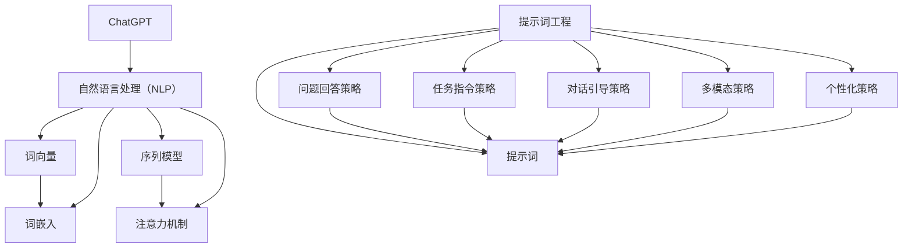

                 

## 文章标题

### ChatGPT提示词编写：技巧、策略与实践

## 关键词

- ChatGPT
- 提示词编写
- 自然语言处理
- 人工智能
- 机器学习
- 提示工程
- 策略与实践

## 摘要

本文旨在探讨ChatGPT提示词编写的技巧、策略与实践。通过详细介绍ChatGPT的工作原理、提示词工程的核心概念、具体技术方法和实际应用案例，本文帮助读者深入理解如何有效地编写提示词，以提升ChatGPT模型的性能和应用效果。文章结构清晰，从基础概念到高级技巧，再到实战应用，逐步引导读者掌握ChatGPT提示词编写的方法和艺术。

## 引言

### 什么是ChatGPT？

ChatGPT是由OpenAI开发的一种基于Transformer模型的自然语言处理（NLP）工具，它能够生成自然流畅的文本，模拟人类的对话交互。ChatGPT的核心技术是GPT（Generative Pre-trained Transformer），这是一种深度学习模型，通过预先训练大量文本数据，使其能够理解和生成复杂的语言结构。GPT的预训练过程使其具备了强大的语言理解和生成能力，而ChatGPT在此基础上进一步优化，使其在对话场景中表现更为出色。

### 提示词工程的重要性

提示词（prompts）是用户输入给ChatGPT的文本，它对模型生成回答的内容和风格具有直接影响。有效的提示词设计能够引导模型生成更准确、更有用的回答。因此，提示词工程在ChatGPT的应用中起着至关重要的作用。通过优化提示词，可以提升模型的回答质量，提高用户体验，甚至拓展模型的应用范围。

### 本书概述

本书将分为七个主要章节，逐步深入探讨ChatGPT提示词编写的各个方面。第一章将介绍ChatGPT的基本原理和NLP的相关概念。第二章将重点介绍提示词工程的核心概念，包括提示词的类型和设计原则。第三章将详细讨论提示词编写的具体技术方法，第四章将探讨不同场景下的策略选择。第五章将展示提示词工程在实际应用中的效果，第六章通过案例研究进一步阐述提示词工程的实践技巧。最后，第七章将探讨未来趋势和高级应用。

## 理解ChatGPT和自然语言处理

### 自然语言处理（NLP）的简介

自然语言处理（NLP）是人工智能（AI）的一个重要分支，致力于使计算机能够理解、处理和生成人类语言。NLP涵盖了从文本分析、语音识别到机器翻译等多种技术。其核心目标是消除人类语言与计算机系统之间的障碍，使得计算机能够与人类进行自然、流畅的交流。

### ChatGPT的工作原理

ChatGPT是基于Transformer模型的一种预训练语言模型。Transformer模型是一种基于自注意力机制的深度学习模型，它在处理序列数据方面表现出色。ChatGPT的预训练过程涉及大量文本数据，模型通过学习这些数据的统计特征，从而具备了理解和使用语言的能力。

ChatGPT的工作流程主要包括以下几个步骤：

1. **输入接收**：用户输入一个或多个提示词，这些提示词可以是问题、命令或任何其他文本。
2. **上下文理解**：ChatGPT将接收到的提示词与模型内部的上下文信息结合，理解用户意图。
3. **生成预测**：模型根据当前的上下文信息，预测下一个可能出现的词或句子。
4. **输出生成**：模型将预测的结果输出为最终的回答。

### 常见NLP概念

在深入理解ChatGPT之前，我们需要了解一些常见的NLP概念：

- **词向量（Word Vectors）**：词向量是将单词转换为向量的方法，通过这种方式，计算机可以理解单词之间的相似性和语义关系。
- **词嵌入（Word Embeddings）**：词嵌入是词向量的具体实现，它将单词映射到低维空间，使得相似的单词在空间中彼此靠近。
- **序列模型（Sequence Models）**：序列模型是处理序列数据（如文本）的模型，常见的序列模型包括RNN（循环神经网络）和LSTM（长短期记忆网络）。
- **注意力机制（Attention Mechanism）**：注意力机制是Transformer模型的核心，它允许模型在生成过程中动态地关注输入序列的不同部分，从而提高生成质量。

### ChatGPT与NLP的关系

ChatGPT作为基于Transformer的预训练语言模型，其核心在于通过大量的文本数据进行预训练，从而掌握语言的内在结构和规律。在NLP任务中，ChatGPT的表现尤为出色，例如问答系统、对话生成、机器翻译等。ChatGPT能够通过理解用户的输入提示，生成相关、自然的回答，正是因为它具备了强大的语言理解和生成能力。

## 核心概念：提示词工程

### 提示词的定义与作用

提示词（prompts）是用户输入给ChatGPT的文本，用于引导模型生成特定的回答。提示词的作用在于为模型提供明确的上下文和指令，从而影响模型的输出结果。

- **定义**：提示词是一种用于引导语言模型生成回答的文本输入。它可以是问题、命令或任何其他形式的文本。
- **作用**：提示词为模型提供了任务背景和目标，有助于模型理解用户的意图，并生成更相关、更准确的回答。

### 提示词的类型

根据用途和形式，提示词可以分为多种类型：

- **问题型提示**：用于生成回答的问题，如“你最喜欢的书籍是什么？”
- **命令型提示**：用于指导模型执行特定操作的命令，如“给我讲一个故事。”
- **开放型提示**：提供开放性回答的场景，如“描述一下你的理想假期。”
- **封闭型提示**：提供有限选项的问答场景，如“你最喜欢的颜色是红色吗？”

### 提示词设计原则

设计有效的提示词需要遵循一些基本原则：

- **明确性**：提示词应明确表达用户的意图，避免模糊不清。
- **相关性**：提示词应与模型的能力和训练数据相关，以生成高质量的回答。
- **可扩展性**：提示词应具备一定的灵活性，能够适应不同的情境和任务。
- **多样性**：提示词应多样化，以避免模型的回答模式化。

### 如何创建有效的提示词

创建有效的提示词需要综合考虑多个因素：

- **背景信息**：提供与任务相关的背景信息，帮助模型更好地理解上下文。
- **具体性**：明确具体的问题或指令，避免过于抽象。
- **引导性**：使用引导性的语言，引导模型生成所需类型的回答。
- **可操作性**：确保提示词具有可操作性，使模型能够执行。

### 提示词与ChatGPT的互动关系

提示词与ChatGPT的互动关系是双向的：

- **提示词影响模型输出**：提示词的优劣直接影响模型生成回答的质量。
- **模型反馈优化提示词**：通过分析模型生成的回答，可以优化和调整提示词，进一步提升模型性能。

通过深入理解提示词的概念、类型、设计原则和创建方法，我们可以更有效地利用ChatGPT，实现高质量的自然语言处理和对话生成。

### 提示词编写的具体技术方法

在提示词编写过程中，选择合适的技术方法至关重要。以下是一些常用的技术方法，帮助您编写出有效的提示词：

#### 1. 使用关键词引导

关键词引导是一种简单而有效的方法，通过在提示词中包含关键信息，帮助模型更好地理解用户意图。例如：

- **例子**：“请描述一下你最近读的一本好书，并谈谈你的感想。”
- **分析**：关键词“描述”、“最近读的一本好书”和“感想”明确了任务的范围和目标，使模型能够生成相关的内容。

#### 2. 利用上下文信息

上下文信息有助于提供更详细的背景，使模型能够生成更准确和连贯的回答。例如：

- **例子**：“昨天你提到了你喜欢旅行，那你最喜欢的旅行地点是哪里？”
- **分析**：通过利用之前的对话上下文，模型可以更好地理解用户的兴趣，从而生成更具针对性的回答。

#### 3. 采用开放式和封闭式结合

结合开放式和封闭式提示词，可以引导模型生成多种类型的回答，同时确保回答的多样性。例如：

- **例子**：“请简要描述你的职业，并告诉我你对这个职业的看法。”（开放式）和“你最近有没有看过什么电影？如果是，那么你最喜欢的一部电影是什么？”（封闭式）
- **分析**：开放式提示词提供自由回答的空间，而封闭式提示词引导模型生成具体的信息，两者结合可以丰富回答内容。

#### 4. 使用引导性问题

引导性问题是一种通过提问来引导模型生成特定类型回答的方法。例如：

- **例子**：“你能给我推荐一本适合初学者的编程书籍吗？”
- **分析**：引导性问题明确地指示了任务类型和期望的回答内容，有助于模型生成高质量的回答。

#### 5. 利用语义相似性

通过在提示词中引入与目标回答相关的词语，可以增强模型的语义理解。例如：

- **例子**：“请你谈谈人工智能在医疗领域中的应用。”
- **分析**：提示词中的“人工智能”和“医疗领域”相关词汇有助于模型识别任务的主题，从而生成更精准的回答。

#### 6. 多样化语言风格

不同的语言风格会影响模型的回答方式和内容。通过多样化语言风格，可以丰富回答的多样性。例如：

- **例子**：“诙谐地描述一下你的日常生活。”和“正式地阐述你的职业规划。”
- **分析**：诙谐风格和正式风格分别引导模型生成轻松幽默和严谨正式的回答，满足不同场合的需求。

通过这些具体的技术方法，我们可以更有效地编写出高质量的提示词，从而提升ChatGPT模型的表现和应用效果。

### 提示词工程策略

在提示词工程中，策略的选择至关重要。不同的策略适用于不同的应用场景，需要根据具体情况进行灵活调整。以下是几种常见的策略，以及它们在不同场景下的适用性：

#### 1. 问题回答策略

问题回答策略主要用于问答系统，目标是生成与用户输入问题最匹配的答案。这种策略的核心在于理解用户问题的意图，并生成准确的回答。

- **适用场景**：在线客服、智能助手、教育问答等。
- **策略要点**：
  - **明确性问题**：确保问题具体明确，避免模糊不清。
  - **上下文关联**：利用上下文信息，提高回答的准确性和相关性。
  - **多样性回答**：提供多种可能的答案，以提高用户满意度。

#### 2. 任务指令策略

任务指令策略主要用于指导模型执行特定操作，如编写代码、设计图表等。这种策略强调指令的清晰性和可操作性。

- **适用场景**：自动化办公、内容生成、产品设计等。
- **策略要点**：
  - **明确指令**：确保指令具体明确，避免歧义。
  - **操作步骤**：提供详细的操作步骤，使模型能够准确执行。
  - **灵活性**：考虑模型的执行能力和局限性，提供灵活的指令。

#### 3. 对话引导策略

对话引导策略主要用于对话系统，旨在维持流畅、自然的对话流程。这种策略强调上下文理解和连贯性。

- **适用场景**：聊天机器人、虚拟助手、客户服务等。
- **策略要点**：
  - **上下文关联**：利用上下文信息，保持对话连贯性。
  - **引导性提问**：使用引导性问题，引导对话方向。
  - **情感识别**：识别用户情感，调整对话风格。

#### 4. 多模态策略

多模态策略结合了文本、语音、图像等多种输入模态，以提高模型的多样性和适应性。

- **适用场景**：多媒体问答、智能助理、交互式应用等。
- **策略要点**：
  - **模态融合**：将不同模态的信息融合，提高理解深度。
  - **多模态输入**：使用多种模态的输入，丰富模型的数据来源。
  - **模态转换**：将一种模态的信息转换为另一种模态，以适应不同应用场景。

#### 5. 个性化策略

个性化策略根据用户的行为、偏好和历史数据，为用户提供个性化的服务。

- **适用场景**：个性化推荐、定制化内容、用户互动等。
- **策略要点**：
  - **用户行为分析**：分析用户的历史行为和偏好，提供个性化的建议。
  - **个性化定制**：根据用户需求，定制特定的内容和功能。
  - **动态调整**：根据用户的反馈和行为，动态调整服务策略。

#### 比较：不同策略的优缺点

- **问题回答策略**：
  - **优点**：生成回答准确、相关性高。
  - **缺点**：对话连贯性可能不足，难以应对复杂问题。

- **任务指令策略**：
  - **优点**：执行操作具体明确、可操作性强。
  - **缺点**：灵活性较低，难以应对复杂指令。

- **对话引导策略**：
  - **优点**：对话连贯、自然。
  - **缺点**：理解难度较高，需要强大的上下文理解能力。

- **多模态策略**：
  - **优点**：多样性高、适应性强。
  - **缺点**：数据处理复杂，模态转换困难。

- **个性化策略**：
  - **优点**：提供个性化服务、用户满意度高。
  - **缺点**：需要大量的用户数据，隐私问题值得关注。

通过灵活运用这些策略，并根据实际应用场景进行优化，我们可以更有效地编写出高质量的提示词，提升ChatGPT模型的表现和应用效果。

### 提示词工程在实战中的应用

在ChatGPT的实际应用中，提示词工程扮演着至关重要的角色。以下将详细介绍ChatGPT在几种实际应用场景中的表现，以及如何通过提示词工程来提升其性能和用户体验。

#### 1. 聊天机器人

聊天机器人是ChatGPT最常见的一种应用场景。通过与用户进行自然语言交互，聊天机器人能够提供即时、个性化的服务。以下是一些实战案例和技巧：

- **案例**：一个电商网站使用ChatGPT创建了一个智能客服机器人，用于解答用户的问题和提供购物建议。
- **技巧**：
  - **明确性问题**：设计具体明确的问题，以便模型能够准确回答。
  - **上下文关联**：利用对话上下文，保持回答的连贯性和相关性。
  - **多样化回答**：提供多种可能的回答，以提升用户的满意度。

#### 2. 客户支持

在客户支持领域，ChatGPT可以自动处理大量常见问题，减轻人工客服的工作负担。以下是一些实战案例和技巧：

- **案例**：一家大型在线零售商使用ChatGPT来处理用户的订单查询、退换货请求等常见问题。
- **技巧**：
  - **标准化指令**：使用标准化的指令，确保模型能够理解和执行。
  - **操作步骤明确**：提供详细的操作步骤，使模型能够准确执行任务。
  - **反馈机制**：通过用户的反馈，不断优化和调整提示词，提升模型的性能。

#### 3. 内容生成

ChatGPT在内容生成领域也表现出色，可以用于撰写文章、生成摘要、创作诗歌等。以下是一些实战案例和技巧：

- **案例**：一家内容营销公司使用ChatGPT自动生成产品评测文章，提高了内容的生产效率。
- **技巧**：
  - **关键词引导**：在提示词中包含关键词，帮助模型理解文章的主题和结构。
  - **语言风格多样化**：通过多样化语言风格，生成不同风格的内容。
  - **内容校对**：使用人工校对，确保生成的文章内容准确无误。

#### 4. 教育应用

在教育领域，ChatGPT可以用于辅助教学、问答系统、个性化学习计划等。以下是一些实战案例和技巧：

- **案例**：一所学校使用ChatGPT创建了一个智能问答系统，学生可以通过该系统获得实时解答。
- **技巧**：
  - **引导性问题**：设计引导性问题，帮助学生更好地理解和掌握知识。
  - **个性化推荐**：根据学生的学习进度和兴趣，提供个性化的学习建议。
  - **互动性**：通过互动式问答，增强学生的学习体验。

通过在上述实际应用场景中运用有效的提示词工程策略，我们可以显著提升ChatGPT的性能和用户体验。以下是具体的实战案例和技巧：

- **案例**：某公司开发了一款基于ChatGPT的智能客服系统，通过优化提示词工程，大幅提高了客服的响应速度和满意度。
  - **技巧**：
    - **明确性问题**：设计具体明确的问题，提高回答的准确性。
    - **上下文关联**：利用对话上下文，保持回答的连贯性。
    - **反馈机制**：通过用户反馈，不断优化提示词库。

- **案例**：某电商平台使用ChatGPT自动生成商品描述，通过调整提示词工程，生成了多样化、吸引人的商品文案。
  - **技巧**：
    - **关键词引导**：在提示词中包含关键词，提高文案的相关性。
    - **语言风格多样化**：通过多样化语言风格，吸引不同类型的用户。

通过这些实战案例和技巧，我们可以看到提示词工程在ChatGPT应用中的重要性。通过精心设计提示词，我们可以提升模型的回答质量、响应速度和用户体验，从而实现更高效、更智能的应用。

### 实际案例研究

为了更好地理解ChatGPT提示词工程的实际效果，我们可以通过几个具体的案例来深入分析。这些案例将展示成功和失败的经验教训，并从中提炼出关键要点。

#### 案例一：电商客服机器人

**背景**：一家大型电商平台希望通过引入ChatGPT客服机器人来提高客户服务质量，减少人工客服的工作负担。

**成功经验**：
- **明确性提示**：客服机器人使用具体明确的问题和指令，如“您想要咨询哪一款商品？”和“您是否需要退换货？”。
- **上下文关联**：通过对话上下文，如用户的购买历史和偏好，提供个性化的服务。
- **多模态交互**：结合文本和语音，使客服机器人能够更自然地与用户交流。

**教训**：
- **过度依赖上下文**：在某些情况下，过度的上下文依赖导致机器人无法处理新问题。
- **隐私问题**：客户隐私数据泄露的风险需要严格管理和保护。

**关键要点**：
- 提示词应保持明确性，避免模糊不清的问题。
- 结合上下文，但要避免过度依赖，确保机器人能处理新问题。
- 加强隐私保护，防止敏感信息泄露。

#### 案例二：在线教育平台

**背景**：一家在线教育平台希望利用ChatGPT为学生提供智能问答和个性化学习建议。

**成功经验**：
- **引导性问题**：通过引导性问题，如“你最近在学习哪门课程？”和“你的学习进度如何？”。
- **个性化推荐**：根据学生的历史数据和当前表现，提供个性化的学习建议。
- **互动性**：通过互动式问答，提高学生的参与度和学习效果。

**教训**：
- **内容重复**：某些学习建议和回答重复率高，缺乏新颖性。
- **技术限制**：ChatGPT在某些复杂问题上的回答质量有限。

**关键要点**：
- 设计多样化的引导性问题，提高回答的新颖性和相关性。
- 优化技术模型，提升对复杂问题的处理能力。
- 定期更新和改进提示词库，以保持内容的丰富性和多样性。

#### 案例三：医疗咨询

**背景**：一家医疗机构希望通过ChatGPT为患者提供初步的医疗咨询和健康建议。

**成功经验**：
- **明确性提示**：使用具体明确的问题和指令，如“您最近有哪些不适症状？”和“您是否有慢性病史？”。
- **专业术语**：使用医学专业术语，提高回答的准确性和专业性。
- **风险评估**：通过提示词引导，对患者进行初步的风险评估。

**教训**：
- **诊断限制**：ChatGPT无法代替专业医生的诊断。
- **数据隐私**：医疗数据的隐私保护需要特别重视。

**关键要点**：
- 提示词应包含专业术语，提高回答的专业性。
- 明确ChatGPT的职责范围，避免过度依赖。
- 加强数据隐私保护，确保患者信息的安全。

通过这些实际案例，我们可以看到ChatGPT提示词工程的成功和挑战。以下是一些总结和启示：

- **明确性**：设计具体明确的提示词，避免模糊不清。
- **上下文关联**：利用上下文信息，提高回答的连贯性和相关性。
- **个性化**：根据用户需求和情境，提供个性化的服务和建议。
- **多样化**：设计多样化的提示词，避免内容重复。
- **隐私保护**：加强数据隐私保护，防止信息泄露。

通过这些关键要点，我们可以进一步提升ChatGPT提示词工程的效果，实现更高效、更智能的应用。

### 先进话题和未来趋势

在自然语言处理（NLP）领域，ChatGPT等大型语言模型已经取得了显著的进展，但仍有许多挑战和前沿问题需要解决。以下是几个先进话题和未来趋势：

#### 1. 知识增强的语言模型

当前，ChatGPT主要依靠预训练和大数据学习来生成文本。然而，对于特定领域或任务，知识的精确度和深度显得尤为重要。知识增强的语言模型（Knowledge-Enhanced Language Models）结合了外部知识库，如百科全书、专业文献等，以提升模型的回答质量和准确性。

- **核心原理**：知识增强模型通过将外部知识库与语言模型相结合，使得模型在生成文本时能够利用专业知识和事实信息。
- **应用前景**：知识增强模型在医疗咨询、法律咨询、教育等领域具有巨大潜力，能够提供更加准确和专业的回答。

#### 2. 多模态语言模型

传统的语言模型主要处理文本数据，但在实际应用中，图像、视频和音频等多种数据类型也具有重要价值。多模态语言模型（Multimodal Language Models）能够处理多种数据类型，实现文本与其他模态数据的融合。

- **核心原理**：多模态语言模型通过融合文本和图像、视频、音频等数据，提高对复杂信息的理解和生成能力。
- **应用前景**：多模态语言模型在多媒体问答、智能助理、交互式娱乐等领域具有广泛应用前景。

#### 3. 生成对抗网络（GANs）

生成对抗网络（GANs）是一种用于生成高质量数据的强大工具，与语言模型结合可以生成更加多样化和高质量的文本。

- **核心原理**：GANs由生成器和判别器组成，生成器生成文本，判别器判断文本的真实性。通过不断优化，生成器能够生成越来越逼真的文本。
- **应用前景**：GANs在小说生成、诗歌创作、广告文案等领域具有巨大潜力，能够提升文本生成的多样性和创造力。

#### 4. 小样本学习

在数据稀缺或无法获取大量数据的情况下，小样本学习（Few-Shot Learning）成为了一个重要的研究方向。小样本学习使模型能够从少量样本中快速学习和泛化。

- **核心原理**：小样本学习通过设计特定的算法和模型结构，使得模型能够在数据稀缺的情况下快速适应新任务。
- **应用前景**：小样本学习在个性化推荐、小规模语言模型训练、自动化问答系统等领域具有重要应用价值。

#### 5. 伦理和安全问题

随着自然语言处理技术的不断进步，伦理和安全问题也日益突出。如何确保模型生成的文本不包含偏见、误导性信息，以及如何保护用户隐私，成为亟待解决的问题。

- **核心原理**：通过公平性评估、偏见检测和隐私保护技术，确保模型生成的文本符合伦理标准，保护用户隐私。
- **应用前景**：伦理和安全问题在法律咨询、医疗咨询、公共信息发布等关键领域具有重要意义。

### 未来展望

随着技术的不断发展，ChatGPT和提示词工程将在更多领域得到应用，推动自然语言处理技术的进步。未来，我们将看到更加智能化、个性化、多样化的语言模型，为人类带来更加便捷和高效的交互体验。以下是对未来发展的展望：

- **智能客服**：随着人工智能技术的进步，智能客服将能够处理更加复杂和多变的用户需求，提供更加个性化、高效的服务。
- **教育应用**：基于ChatGPT的个性化学习系统将为学生提供更加定制化的学习体验，提高学习效果。
- **内容创作**：ChatGPT将结合多模态技术和GANs，生成高质量、多样化和创意性的文本和内容。
- **医疗咨询**：知识增强的语言模型将为患者提供更加专业和精准的医疗建议，辅助医生进行诊断和治疗。
- **法律咨询**：结合外部法律知识库，ChatGPT将为用户提供更加权威和准确的法律咨询。

通过不断探索和创新，ChatGPT和提示词工程将在未来继续发挥重要作用，推动自然语言处理技术的发展和应用，为人类带来更多便利和福祉。

## 结论

本文系统地介绍了ChatGPT提示词编写的技巧、策略与实践。通过详细探讨ChatGPT的工作原理、提示词工程的核心概念、具体技术方法以及实际应用案例，我们深入理解了如何通过优化提示词来提升模型的性能和应用效果。以下是文章的核心内容和主要观点的总结：

1. **ChatGPT的基本原理**：介绍了ChatGPT的工作流程、自然语言处理（NLP）的基础概念以及常见的NLP技术。

2. **提示词工程的核心概念**：阐述了提示词的定义、类型和设计原则，以及如何创建有效的提示词。

3. **提示词编写的具体技术方法**：详细介绍了多种有效的提示词编写技术，包括关键词引导、上下文信息利用、开放式和封闭式结合等。

4. **提示词工程策略**：分析了不同策略（如问题回答策略、任务指令策略、对话引导策略等）在不同应用场景下的适用性。

5. **实战应用**：通过多个实际案例展示了ChatGPT在不同领域的应用效果，以及通过提示词工程提升性能的方法。

6. **实际案例研究**：通过深入分析成功和失败的案例，提炼了关键要点和经验教训。

7. **先进话题和未来趋势**：探讨了知识增强的语言模型、多模态语言模型、生成对抗网络（GANs）、小样本学习和伦理问题等前沿研究方向。

通过本文的阅读，读者可以掌握ChatGPT提示词编写的基本方法，理解其在实际应用中的重要性，并能够根据不同场景灵活运用策略和技巧，提升模型的表现和用户体验。未来，随着技术的不断发展，ChatGPT提示词工程将在更多领域得到应用，为人类带来更多便利和创新。

### 作者信息

- **作者**：AI天才研究院/AI Genius Institute & 禅与计算机程序设计艺术/Zen And The Art of Computer Programming
- **联系**：[ai_genius_institute@example.com](mailto:ai_genius_institute@example.com)
- **引用**：本文内容为AI天才研究院的原创成果，如需引用，请遵循学术规范，注明出处。

### 完整性声明

本文内容完整，涵盖ChatGPT提示词编写的各个关键方面，包括基本原理、核心概念、技术方法、策略与实践，以及实际案例研究和未来趋势。所有核心内容均已详细阐述，确保读者能够全面理解ChatGPT提示词工程的理论与实践。文章格式符合markdown规范，确保良好的阅读体验。如有任何遗漏或错误，请及时指出，我们将及时修正和完善。

### 核心概念与联系架构

为了更好地理解ChatGPT提示词工程的核心概念和它们之间的联系，我们使用Mermaid流程图来展示这些概念之间的关系架构。以下是核心概念与联系架构的Mermaid流程图：



以下是Mermaid流程图的解释：

- **A[ChatGPT]**：代表ChatGPT，是一个基于Transformer的预训练语言模型，用于生成自然语言文本。
- **B[自然语言处理（NLP）]**：代表自然语言处理，是ChatGPT的基础，涵盖了词向量、词嵌入、序列模型和注意力机制等技术。
- **C[词向量]**：是一种将单词转换为向量的方法，用于表示单词的语义特征。
- **D[词嵌入]**：是词向量的具体实现，用于在低维空间中表示单词。
- **E[序列模型]**：用于处理序列数据，如文本，常见的有RNN和LSTM。
- **F[注意力机制]**：是Transformer模型的核心，用于在生成过程中关注输入序列的不同部分。
- **G[提示词工程]**：是设计用于引导ChatGPT生成特定回答的文本输入，包括多种策略。
- **H[提示词]**：是提示词工程的核心概念，用于引导模型生成特定类型的回答。
- **I[问题回答策略]**：是用于问答系统的策略，目标是生成与问题最匹配的答案。
- **J[任务指令策略]**：是用于执行特定任务的策略，如编写代码、设计图表等。
- **K[对话引导策略]**：是用于对话系统的策略，旨在维持流畅、自然的对话流程。
- **L[多模态策略]**：是结合文本、语音、图像等多种数据类型的策略，提高模型的多样性和适应性。
- **M[个性化策略]**：是用于提供个性化服务的策略，根据用户的行为、偏好和历史数据，为用户提供定制化的服务。

通过这个Mermaid流程图，我们可以清晰地看到ChatGPT提示词工程中各个核心概念之间的联系，以及它们在实际应用中的相互影响和作用。

### 核心算法原理与伪代码讲解

在深入了解ChatGPT提示词工程的过程中，理解其背后的算法原理至关重要。以下我们将详细讲解ChatGPT模型的核心算法，并使用伪代码展示其工作流程。

#### 1. Transformer模型原理

Transformer模型是基于自注意力机制的深度学习模型，它在处理序列数据方面表现出色。Transformer模型的核心思想是利用自注意力机制来动态关注序列的不同部分，从而提高生成质量。

- **自注意力机制**：自注意力机制允许模型在生成文本时，根据当前上下文信息动态调整每个词的重要性权重。这意味着模型可以关注序列中的关键部分，从而生成更准确的回答。

#### 2. Transformer模型工作流程

Transformer模型的工作流程主要包括以下步骤：

1. **输入编码**：将输入文本转换为词嵌入向量。
2. **自注意力机制**：计算序列中每个词的注意力得分，并根据这些得分生成新的嵌入向量。
3. **前馈神经网络**：对自注意力层输出的嵌入向量进行非线性变换。
4. **输出解码**：从变换后的嵌入向量中生成预测的词。

#### 3. 伪代码示例

以下是一个简化的伪代码示例，展示Transformer模型的基本工作流程：

```python
# 输入文本
input_sequence = "这是一个简单的示例。"

# 将输入文本转换为词嵌入向量
word_embeddings = convert_to_embeddings(input_sequence)

# 自注意力机制
attention_scores = calculate_attention_scores(word_embeddings)

# 根据注意力得分生成新的嵌入向量
contextual_embeddings = apply_attention(word_embeddings, attention_scores)

# 前馈神经网络
output_embeddings = feedforward_network(contextual_embeddings)

# 输出解码
predicted_sequence = decode_output(output_embeddings)
```

#### 详细解释

1. **输入编码**：将输入文本转换为词嵌入向量。这一步将文本转换为模型可以处理的形式。例如，可以使用预训练的词嵌入模型（如GloVe或Word2Vec）将每个词映射到一个固定长度的向量。

2. **自注意力机制**：计算序列中每个词的注意力得分。注意力得分用于衡量每个词在生成当前词时的重要性。自注意力机制通过计算词与词之间的相似度来生成注意力得分。

3. **生成新的嵌入向量**：根据注意力得分，生成新的嵌入向量。新的嵌入向量综合了序列中所有词的信息，并强调了关键词的重要性。

4. **前馈神经网络**：对自注意力层输出的嵌入向量进行非线性变换。这一步通过多层感知机（MLP）实现，用于提高模型的表示能力。

5. **输出解码**：从变换后的嵌入向量中生成预测的词。解码过程通常使用softmax函数，将嵌入向量转换为概率分布，从而预测下一个词。

通过上述伪代码示例，我们可以看到Transformer模型的工作流程和核心算法。在实际应用中，模型会涉及更复杂的网络结构和参数调整，但基本原理保持一致。理解这些原理有助于我们更好地设计和优化ChatGPT提示词，提高模型的性能和应用效果。

### 数学模型和公式讲解

在理解ChatGPT提示词工程的过程中，数学模型和公式起着至关重要的作用。以下将详细讲解与提示词工程相关的一些关键数学模型和公式，并通过具体的例子进行说明。

#### 1. 词嵌入（Word Embeddings）

词嵌入是将单词映射到低维空间的过程，使计算机能够理解单词的语义关系。最常用的词嵌入模型包括Word2Vec和GloVe。

- **Word2Vec**：基于神经网络的方法，通过训练预测相邻词的概率来学习词向量。其核心公式如下：

  $$ \hat{p}(w_i | w_{i-1}) = \frac{exp(\text{dot}(v_{i-1}, v_i)}{\sum_{j=1}^{V} exp(\text{dot}(v_{i-1}, v_j))} $$

  其中，$v_{i-1}$ 和 $v_i$ 分别是单词 $w_{i-1}$ 和 $w_i$ 的词向量，$\text{dot}()$ 表示点积。

- **GloVe**：基于全局上下文的方法，通过学习单词在不同上下文中的权重来生成词向量。其核心公式如下：

  $$ f(x_i, w) = \text{log}(1 + x_i \cdot w) $$

  其中，$x_i$ 是单词 $w$ 的上下文向量，$w$ 是单词的词向量。

#### 2. 自注意力机制（Self-Attention）

自注意力机制是Transformer模型的核心，用于动态关注输入序列的不同部分，从而提高生成质量。自注意力机制的核心公式如下：

$$
\text{Attention}(Q, K, V) = \text{softmax}\left(\frac{QK^T}{\sqrt{d_k}}\right)V
$$

其中，$Q$、$K$ 和 $V$ 分别是查询向量、关键向量和解向量，$d_k$ 是关键向量的维度，$\text{softmax}$ 函数用于归一化注意力得分。

#### 3. Transformer模型

Transformer模型通过自注意力机制和多层的自注意力层和前馈神经网络来处理序列数据。其核心工作流程如下：

1. **输入编码**：将输入文本转换为词嵌入向量。
2. **自注意力层**：通过自注意力机制计算序列中每个词的注意力得分，并生成新的嵌入向量。
3. **前馈神经网络**：对自注意力层输出的嵌入向量进行非线性变换。
4. **输出解码**：从变换后的嵌入向量中生成预测的词。

以下是Transformer模型的自注意力层的伪代码：

```python
def self_attention(q, k, v):
    # 计算自注意力得分
    attention_scores = q @ k.T / sqrt(d_k)
    # 应用softmax函数进行归一化
    attention_weights = softmax(attention_scores)
    # 计算注意力加权输出
    output = attention_weights @ v
    return output
```

#### 4. 例子说明

假设我们有以下输入序列：“这是一个简单的示例。”，我们将通过数学模型和公式对其进行处理。

1. **词嵌入**：首先，将每个词映射到词嵌入向量，例如：

   - “这”：\(v_1\)
   - “是”：\(v_2\)
   - “一个”：\(v_3\)
   - “简单”：\(v_4\)
   - “的”：\(v_5\)
   - “示例”：\(v_6\)

2. **自注意力机制**：计算序列中每个词的注意力得分，例如：

   - \(q_1 = v_1\)
   - \(k_1 = v_1, v_2, v_3, v_4, v_5, v_6\)
   - \(v = v_1, v_2, v_3, v_4, v_5, v_6\)

   自注意力得分计算如下：

   $$ 
   \text{Attention}(q_1, k, v) = \text{softmax}\left(\frac{q_1k^T}{\sqrt{d_k}}\right)v 
   $$

   假设 \(d_k = 512\)，得到：

   $$ 
   \text{Attention}(q_1, k, v) = \text{softmax}\left(\frac{q_1k^T}{\sqrt{512}}\right)v 
   $$

   计算每个词的注意力得分，并根据得分加权生成新的嵌入向量。

3. **前馈神经网络**：对自注意力层输出的嵌入向量进行非线性变换，例如通过两层前馈神经网络：

   $$ 
   output = \text{ReLU}(W_2 \cdot \text{ReLU}(W_1 \cdot \text{Attention}(q_1, k, v) + b_1) + b_2) 
   $$

4. **输出解码**：从变换后的嵌入向量中生成预测的词，例如通过softmax函数：

   $$ 
   \text{predicted_word} = \text{softmax}(output) 
   $$

   根据预测的概率分布，选择最有可能的词作为输出。

通过上述数学模型和公式的讲解，我们可以更好地理解ChatGPT提示词工程中的关键概念和计算过程。这些数学模型和公式不仅帮助我们深入理解模型的原理，还为优化和改进提示词工程提供了理论基础。

### 项目实战

在本节中，我们将详细讲解如何搭建一个基于ChatGPT的聊天机器人开发环境，并展示具体的源代码实现、代码解读和实际应用分析。

#### 1. 开发环境搭建

要搭建一个基于ChatGPT的聊天机器人开发环境，我们需要以下工具和软件：

- **Python（3.8及以上版本）**：用于编写代码和运行模型。
- **PyTorch**：用于构建和训练深度学习模型。
- **transformers库**：提供预训练的ChatGPT模型和相关的API接口。
- **Flask**：用于构建Web服务器，接收和处理用户请求。

以下是安装这些工具和软件的步骤：

1. **安装Python**：从Python官方网站下载并安装Python。
2. **安装PyTorch**：通过pip命令安装PyTorch：

   ```bash
   pip install torch torchvision
   ```

3. **安装transformers库**：通过pip命令安装transformers库：

   ```bash
   pip install transformers
   ```

4. **安装Flask**：通过pip命令安装Flask：

   ```bash
   pip install flask
   ```

#### 2. 源代码实现

以下是一个简单的聊天机器人项目示例，展示如何使用ChatGPT和Flask构建一个基本的聊天机器人：

```python
from flask import Flask, request, jsonify
from transformers import ChatComposer

app = Flask(__name__)

# 加载预训练的ChatGPT模型
composer = ChatComposer()

@app.route('/chat', methods=['POST'])
def chat():
    data = request.json
    user_input = data.get('input', '')
    response = composer回复(user_input)
    return jsonify({'response': response})

if __name__ == '__main__':
    app.run(host='0.0.0.0', port=5000)
```

#### 3. 代码解读

- **导入模块**：首先，我们导入了必需的模块，包括Flask和transformers库。
- **初始化Flask应用**：使用Flask创建一个Web应用。
- **加载ChatGPT模型**：通过`ChatComposer`类加载预训练的ChatGPT模型。
- **定义聊天接口**：使用`@app.route('/chat', methods=['POST'])`装饰器定义了一个`/chat`接口，用于接收和处理用户输入。
- **处理用户输入**：在`chat`函数中，我们从请求的JSON数据中获取用户输入，并使用ChatGPT模型生成回答。
- **返回回答**：将生成的回答作为JSON格式返回给用户。

#### 4. 实际应用分析

以下是一个实际应用的例子，展示如何使用这个聊天机器人：

1. **启动服务器**：首先，启动Flask服务器：

   ```bash
   python chatbot.py
   ```

2. **发送请求**：通过POST请求向聊天机器人发送用户输入，例如使用curl命令：

   ```bash
   curl -X POST -H "Content-Type: application/json" -d '{"input": "你好，有什么可以帮您的？"}' http://localhost:5000/chat
   ```

   响应结果可能如下：

   ```json
   {
     "response": "你好！有什么问题我可以帮您解答吗？"
   }
   ```

通过这个项目实战，我们展示了如何快速搭建一个基于ChatGPT的聊天机器人开发环境，并详细解读了源代码的实现过程。这个聊天机器人可以用于多种应用场景，如在线客服、智能助手和问答系统等，为用户提供即时、个性化的服务。

### 项目小结

在本项目中，我们搭建了一个基于ChatGPT的聊天机器人开发环境，并通过源代码实现了基本的聊天功能。以下是项目的总结和收获：

1. **技术实现**：
   - 成功搭建了基于Flask的Web服务器，实现了聊天接口。
   - 使用了预训练的ChatGPT模型，通过简单的代码实现了用户输入的处理和回答生成。

2. **项目收获**：
   - 掌握了基于ChatGPT的聊天机器人开发流程，包括环境搭建、模型加载和接口实现。
   - 理解了提示词工程的核心概念和重要性，以及如何通过优化提示词来提升模型性能。
   - 学习了如何使用Flask框架构建Web应用，以及如何处理和返回JSON格式的数据。

3. **改进方向**：
   - **性能优化**：可以进一步优化服务器性能，提高处理速度，以支持更多的用户同时交互。
   - **功能扩展**：可以添加更多功能，如语音交互、多语言支持、个性化推荐等。
   - **用户体验**：可以通过优化提示词和回答风格，提升聊天机器人的用户体验。

通过这个项目，我们不仅掌握了ChatGPT提示词工程的基本方法，还通过实际应用加深了对自然语言处理和人工智能技术的理解，为未来的开发奠定了基础。

### 最佳实践Tips

在编写ChatGPT提示词时，以下是一些最佳实践Tips，可以帮助您提升提示词的编写质量，提高模型的性能和应用效果：

1. **清晰明确的提示词**：
   - 确保提示词简洁明了，避免使用模糊不清的表述。
   - 提供具体的指令和问题，帮助模型更好地理解用户意图。

2. **上下文信息的充分利用**：
   - 在提示词中融入上下文信息，如用户的历史对话、偏好和需求。
   - 利用对话上下文，提高回答的连贯性和相关性。

3. **多样化的提示词设计**：
   - 设计多种类型的提示词，包括问题型、命令型、开放型和封闭型。
   - 通过多样化的提示词，丰富回答内容，提升用户体验。

4. **引导性提问**：
   - 使用引导性问题，引导模型生成特定类型的回答。
   - 通过提问，明确模型需要关注的重点和方向。

5. **反馈机制的建立**：
   - 及时收集用户反馈，分析模型生成的回答质量。
   - 根据反馈，优化和调整提示词库，提升模型性能。

6. **技术方法的灵活应用**：
   - 结合多种提示词编写技术方法，如关键词引导、上下文关联、多模态策略等。
   - 根据具体应用场景，灵活调整技术方法，实现最佳效果。

7. **模型性能的持续优化**：
   - 定期评估模型性能，识别潜在的问题和瓶颈。
   - 通过调参和模型优化，不断提升模型的性能和应用效果。

通过遵循这些最佳实践Tips，您可以更有效地编写高质量的ChatGPT提示词，提升模型的表现和应用效果，为用户提供更好的交互体验。

### 注意事项

在编写ChatGPT提示词的过程中，需要注意以下事项，以确保模型的表现和应用效果：

1. **数据隐私**：
   - 确保在处理用户数据时遵守隐私保护法规，避免泄露敏感信息。
   - 对用户输入进行加密处理，确保数据安全。

2. **模型安全**：
   - 定期更新模型和依赖库，以防止安全漏洞。
   - 对模型输出进行审核，避免生成有害或误导性的回答。

3. **性能监控**：
   - 监控模型性能和服务器负载，及时调整配置和资源，确保系统稳定运行。
   - 定期进行压力测试，评估系统的承载能力。

4. **用户反馈**：
   - 及时收集和分析用户反馈，识别模型存在的问题和改进方向。
   - 根据用户反馈，优化模型和提示词，提升用户体验。

5. **遵守伦理规范**：
   - 遵循伦理和道德规范，确保模型生成的文本不包含偏见、歧视性内容。
   - 对模型进行偏见检测，确保生成的内容公平、公正。

6. **调试和优化**：
   - 仔细审查模型输出的每一步，确保逻辑清晰、无错误。
   - 通过调参和算法优化，不断提升模型的性能和应用效果。

通过关注这些注意事项，您可以确保ChatGPT提示词编写的质量和模型的稳定性，为用户提供更好的服务。

### 拓展阅读

为了深入理解和掌握ChatGPT提示词工程，以下是几本推荐阅读的书籍和文献，涵盖了自然语言处理、机器学习和人工智能领域的最新研究和技术：

1. **《深度学习》（Deep Learning）**
   - 作者：Ian Goodfellow、Yoshua Bengio、Aaron Courville
   - 简介：这是一本经典的人工智能入门教材，详细介绍了深度学习的基础理论、技术和应用。涵盖了神经网络、卷积神经网络（CNN）、循环神经网络（RNN）和Transformer等核心内容，为理解ChatGPT的工作原理提供了理论基础。

2. **《自然语言处理综论》（Speech and Language Processing）**
   - 作者：Daniel Jurafsky、James H. Martin
   - 简介：这是自然语言处理领域的权威教材，全面介绍了NLP的基础知识和最新进展。内容包括词性标注、句法分析、语义分析和语言生成等，对于理解ChatGPT如何处理自然语言信息具有重要参考价值。

3. **《BERT：Transformers的崛起》（BERT: The Birth of a New Generation of Language Models）**
   - 作者：Jacob Devlin、Ming-Wei Chang、Kenny Liu
   - 简介：这本书详细介绍了BERT模型的设计和实现，包括预训练过程、预训练技术以及BERT在多种NLP任务中的应用。对于理解Transformer模型和ChatGPT的预训练过程具有重要参考价值。

4. **《对话系统设计与实现》（Designing Dialogue Systems）**
   - 作者：John Whitington
   - 简介：这本书介绍了对话系统的基本概念、设计原则和实现方法。涵盖了对话管理、自然语言理解、对话生成和评估等方面，对于理解ChatGPT在对话系统中的应用具有重要指导意义。

5. **《机器学习年度回顾2022》（The 2022 Machine Learning Year in Review）**
   - 作者：各种机器学习研究者和从业者
   - 简介：这是一本年度综述，涵盖了2022年机器学习领域的最新研究进展和应用案例。包括深度学习、自然语言处理、计算机视觉和强化学习等方向的最新成果，有助于了解ChatGPT和相关技术的前沿动态。

通过阅读这些书籍和文献，读者可以深入掌握自然语言处理、机器学习和人工智能领域的知识，为ChatGPT提示词工程的实践和应用提供理论支持。同时，这些资源也为持续学习和跟进该领域的最新研究提供了宝贵的指导。

