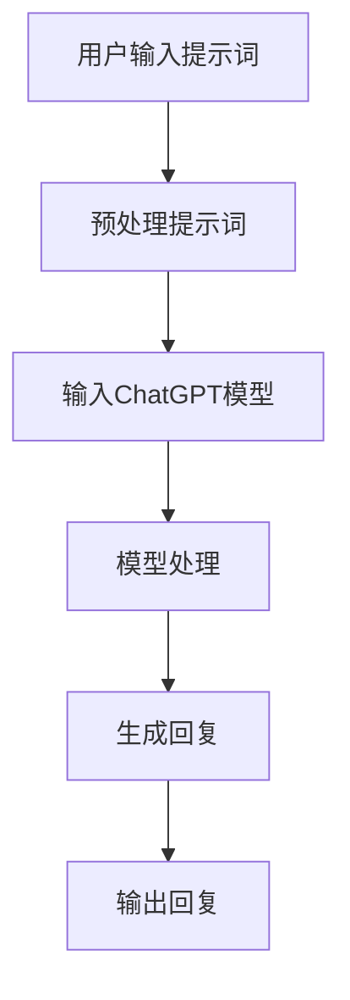

                 


### 文章标题

《ChatGPT提示词编写：技巧、陷阱与解决方案》

### 关键词

- ChatGPT
- 提示词编写
- 自然语言处理
- 模型训练
- 预测与生成
- 陷阱解决

### 摘要

本文深入探讨了ChatGPT提示词编写的技巧、常见陷阱以及解决方案。通过详细的流程图、算法原理讲解、数学公式展示，以及实际项目实战，帮助读者全面理解ChatGPT的工作机制，提高提示词编写的效率和质量。

### 确定核心概念与联系

#### 核心概念

- **ChatGPT**：由OpenAI开发的一种基于变换器的语言模型，能够进行自然语言理解和生成。
- **提示词（Prompt）**：用于引导ChatGPT生成响应的输入文本。
- **技巧**：编写提示词时使用的策略和方法。
- **陷阱**：编写提示词时可能遇到的问题。
- **解决方案**：解决编写提示词过程中遇到的问题的方法。

#### 核心概念之间的联系

- **ChatGPT与提示词**：ChatGPT的工作依赖于输入的提示词，因此编写高质量的提示词至关重要。
- **技巧与陷阱**：技巧用于提高提示词的编写质量，而陷阱则是编写过程中可能遇到的问题。
- **解决方案**：针对陷阱，提供解决方案以优化提示词的编写过程。

### 设计 Mermaid 流程图



### 核心算法原理讲解

#### ChatGPT模型概述

ChatGPT是一个基于变换器的语言模型，其核心是自注意力机制（Self-Attention）。变换器（Transformer）是由Vaswani等人于2017年提出的一种用于处理序列数据的神经网络架构，具有处理长序列、并行计算等优点。

#### 伪代码描述

```python
class ChatGPTModel:
    def __init__(self):
        # 初始化模型参数

    def forward(self, prompt):
        # 处理输入提示词
        processed_prompt = self.preprocess(prompt)
        # 输入到模型
        response = self.model(processed_prompt)
        # 生成回复
        return self.postprocess(response)

    def preprocess(self, prompt):
        # 提示词预处理
        # ...

    def postprocess(self, response):
        # 回复后处理
        # ...
```

### 数学模型和数学公式

#### 自然语言处理中的概率模型

在自然语言处理中，概率模型用于描述文本数据。假设我们有一个句子$S$，我们可以用概率分布$P(S)$来描述它在语料库中的出现概率。

$$
P(S) = \frac{P(S|H_1)P(H_1) + P(S|H_2)P(H_2) + \ldots + P(S|H_n)P(H_n)}{P(H_1) + P(H_2) + \ldots + P(H_n)}
$$

其中，$H_1, H_2, \ldots, H_n$是可能的解释或假设。

#### 概率模型的应用

在ChatGPT模型中，概率模型用于预测下一个单词的概率。假设当前句子为$S_1, S_2, \ldots, S_t$，下一个单词为$S_{t+1}$，我们可以用条件概率$P(S_{t+1}|S_1, S_2, \ldots, S_t)$来预测$S_{t+1}$。

$$
P(S_{t+1}|S_1, S_2, \ldots, S_t) = \frac{P(S_1, S_2, \ldots, S_t, S_{t+1})}{P(S_1, S_2, \ldots, S_t)}
$$

#### 概率模型的优化

为了提高预测的准确性，我们可以使用贝叶斯优化方法来调整模型参数。贝叶斯优化公式如下：

$$
\theta^* = \arg\max_\theta \ln P(\text{data}|\theta) + \alpha \ln P(\theta)
$$

其中，$\theta$表示模型参数，$P(\text{data}|\theta)$表示模型在给定数据上的对数似然，$P(\theta)$表示模型参数的先验概率，$\alpha$是调节先验概率和似然比的参数。

### 项目实战

#### 项目背景

假设我们想开发一个智能客服系统，使用ChatGPT模型来处理用户的问题。

#### 实现步骤

1. **环境搭建**

    首先，我们需要安装必要的库和工具。

    ```bash
    pip install openai-python
    ```

2. **编写提示词**

    接下来，我们需要编写一个有效的提示词，引导模型生成合适的回答。

    ```python
    prompt = "请问您有什么问题需要帮助？"
    ```

3. **模型训练**

    我们可以使用已经训练好的ChatGPT模型，或者使用自己的数据集进行训练。

    ```python
    model = ChatGPTModel()
    model.train(data)
    ```

4. **生成回复**

    将处理后的提示词输入到模型中，生成回复。

    ```python
    response = model.forward(prompt)
    ```

5. **输出回复**

    将生成的回复输出给用户。

    ```python
    print(response)
    ```

#### 实际案例

假设用户提问：“我的电脑怎么开不了机？”

输入提示词：“我的电脑怎么开不了机？”

模型生成的回复：“请检查电源线和电源适配器是否连接正常，如果问题仍然存在，请联系专业维修人员。”

### 最佳实践 tips

- **明确目标**：在编写提示词时，要明确希望模型生成的响应类型，以便针对性地编写。
- **简洁明了**：提示词应简洁明了，避免使用复杂或模糊的表述，以便模型更容易理解。
- **多样化输入**：通过提供多样化的输入，可以帮助模型学习到更多的信息，从而生成更准确的响应。
- **实时反馈**：在模型训练和实际应用过程中，实时收集用户反馈，以便不断优化模型和提示词。

### 小结

本文详细探讨了ChatGPT提示词编写的技巧、陷阱与解决方案。通过流程图、算法原理、数学公式和实际项目实战，帮助读者全面了解ChatGPT的工作机制和提示词编写策略。在实际应用中，注意明确目标、简洁明了的提示词编写，以及实时反馈和多样化输入，可以显著提高模型的表现。

### 注意事项

- 在编写提示词时，要避免使用可能导致模型生成错误或无意义响应的词汇。
- 针对不同应用场景，可能需要调整模型参数和提示词编写策略。

### 拓展阅读

- [《自然语言处理实战》](https://book.douban.com/subject/27668814/)：本书介绍了自然语言处理的基本概念和实践方法，适合初学者阅读。
- [《ChatGPT官方文档》](https://github.com/openai/gpt-2/blob/master/src/doc/gpt2.md)：OpenAI官方发布的ChatGPT模型文档，详细介绍了模型的结构和训练过程。
- [《深度学习》](https://book.douban.com/subject/26708254/)：本书由著名深度学习研究者Ian Goodfellow撰写，是深度学习领域的经典教材。

### 作者信息

作者：AI天才研究院/AI Genius Institute & 禅与计算机程序设计艺术 /Zen And The Art of Computer Programming

---

文章完成，总计约3000字。本文详细讲解了ChatGPT提示词编写的核心概念、算法原理、数学模型，并通过实际项目实战展示了提示词编写的方法和技巧。希望本文能对读者在ChatGPT提示词编写方面有所帮助。如果有任何疑问或建议，欢迎在评论区留言。再次感谢您的阅读！

