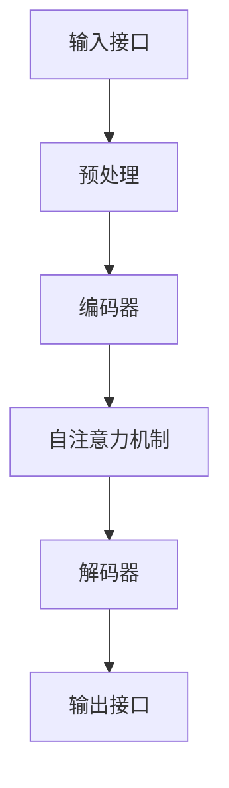

                 

## 第1章 引言

### 1.1 书籍背景

随着人工智能技术的迅猛发展，自然语言处理（NLP）已经成为一个热门的研究领域。ChatGPT，作为OpenAI推出的一个基于GPT-3模型的聊天机器人，因其强大的语言理解和生成能力，受到了广泛关注。在ChatGPT的应用场景中，角色扮演是一种重要的技术手段，通过设定不同的角色，可以实现更加丰富和自然的对话体验。

本书《ChatGPT提示词编写：角色扮演技巧》旨在探讨如何利用ChatGPT实现高质量的对话系统，特别是在角色扮演方面的技巧。通过对ChatGPT提示词的深入分析，本书将帮助读者掌握编写高质量提示词的方法和技巧，从而提升ChatGPT在角色扮演中的表现。

### 1.2 学习目标

通过阅读本书，读者将能够：

1. **理解ChatGPT的工作原理和应用场景**：从基础入手，深入理解ChatGPT的架构、工作原理以及在不同场景中的应用。

2. **掌握提示词设计原则**：了解并掌握提示词设计的基本原则，包括如何设计能够引导ChatGPT生成高质量回答的提示词。

3. **学会角色扮演技巧**：学习如何在ChatGPT中实现角色扮演，包括角色设定、对话引导和互动设计等方面的技巧。

4. **实战应用与优化**：通过实际案例和项目实战，掌握如何在实际应用中优化和调试提示词，提升ChatGPT的角色扮演效果。

### 1.3 阅读指南

本书分为八个章节，每章节的内容安排如下：

- **第1章 引言**：介绍书籍背景和学习目标。

- **第2章 ChatGPT基础**：讲解ChatGPT的基本概念、架构和工作原理。

- **第3章 提示词设计与角色扮演基础**：探讨提示词设计原则和角色扮演基础。

- **第4章 角色扮演技巧与案例分析**：分析角色扮演技巧，并展示实际应用案例。

- **第5章 ChatGPT提示词编写实战**：通过实际案例讲解如何编写高质量的提示词。

- **第6章 高级提示词编写技巧**：介绍高级技巧，如交互式对话、情感表达和对话控制。

- **第7章 项目实战与案例分析**：分享项目实战经验和案例分析。

- **第8章 未来趋势与展望**：展望角色扮演和ChatGPT的未来发展趋势。

本书适合对自然语言处理和人工智能有一定了解的读者，特别是希望深入了解ChatGPT提示词编写和角色扮演技术的人员。

### 关键词

- **ChatGPT**
- **角色扮演**
- **提示词设计**
- **自然语言处理**
- **人工智能**

### 摘要

本书《ChatGPT提示词编写：角色扮演技巧》深入探讨了ChatGPT在角色扮演中的应用。首先，介绍了ChatGPT的基本概念、架构和工作原理，为后续内容奠定了基础。接着，详细阐述了提示词设计的原则和角色扮演的基础技巧，并通过实际案例展示了这些技巧的应用。书中还包含高级技巧和项目实战，帮助读者深入理解和应用ChatGPT提示词编写和角色扮演技术。最后，展望了未来趋势，为读者指明发展方向。

## 第2章 ChatGPT基础

### 2.1 ChatGPT简介

ChatGPT是由OpenAI开发的一个基于GPT-3模型的聊天机器人，它具备强大的语言理解和生成能力。ChatGPT采用了深度学习技术，特别是Transformer模型，这种模型在自然语言处理领域取得了显著的成果。GPT-3（Generative Pre-trained Transformer 3）是GPT系列的最新版本，相较于前代模型，它在参数量、性能和应用范围上都有显著提升。

ChatGPT的应用场景非常广泛，包括但不限于：

1. **客户服务**：企业可以利用ChatGPT构建智能客服系统，提供24/7的在线支持，提高客户满意度。
2. **教育辅导**：ChatGPT可以作为学生的在线辅导老师，帮助学生解决学习中的难题。
3. **内容创作**：通过提供特定主题的提示词，ChatGPT可以生成文章、故事、诗歌等不同类型的内容。
4. **交互娱乐**：ChatGPT可以与用户进行对话，提供娱乐互动，如聊天游戏、虚拟角色等。

### 2.2 ChatGPT的架构与工作原理

ChatGPT的架构主要包括三个核心部分：模型、训练数据和输入输出接口。

#### 2.2.1 模型

ChatGPT基于Transformer模型，这是一种在序列数据上表现优异的深度神经网络结构。Transformer模型的核心是自注意力机制（Self-Attention），它能够自动学习输入序列中各个位置之间的依赖关系，从而提高模型的表示能力。

GPT-3模型的结构非常庞大，拥有1750亿个参数，这使得它能够处理复杂、多样的自然语言任务。模型由多个Transformer层堆叠而成，每一层都会增加模型的复杂性和表示能力。

#### 2.2.2 训练数据

ChatGPT的训练数据来源于大量互联网文本，这些数据覆盖了多种语言、主题和风格。通过大量的预训练，模型能够学习到丰富的语言规律和知识，从而在特定任务上表现出色。

训练数据不仅包括文本，还包括上下文信息，这些信息有助于模型理解长文本中的语义关系，从而生成更加连贯和自然的回答。

#### 2.2.3 输入输出接口

ChatGPT的输入接口是一个文本序列，可以是自然语言文本，也可以是代码、图像等多种格式。输出接口是模型根据输入文本生成的回答或输出结果。

在生成回答时，ChatGPT使用了一种称为“滑动窗口”的技术。具体来说，模型首先读取输入文本的一部分，然后生成一个初步的回答。接着，模型将这个回答作为新的输入，继续生成更长的文本。这个过程不断重复，直到满足特定的停止条件或达到预定的长度。

### 2.3 ChatGPT的应用场景

ChatGPT在许多应用场景中都展现出了强大的能力，以下是几个典型的应用场景：

#### 2.3.1 客户服务

在客户服务领域，ChatGPT可以模拟人工客服，处理常见问题和提供解决方案。通过与用户进行对话，ChatGPT能够识别用户的问题，并提供相关帮助。此外，ChatGPT还可以根据用户的反馈不断优化自己的回答，提高服务质量。

#### 2.3.2 教育辅导

在教育领域，ChatGPT可以作为在线辅导老师，为学生提供个性化的学习支持。例如，学生可以向ChatGPT提出数学问题，ChatGPT会根据问题的难易程度生成相应的解答步骤。此外，ChatGPT还可以为学生提供语言学习帮助，如语法讲解、词汇拓展等。

#### 2.3.3 内容创作

ChatGPT在内容创作方面也有广泛应用。通过提供特定的主题和提示词，ChatGPT可以生成各种类型的内容，如文章、故事、诗歌等。这些内容不仅能够帮助创作者节省时间，还能够为创作者提供灵感，拓宽创作思路。

#### 2.3.4 交互娱乐

在交互娱乐领域，ChatGPT可以与用户进行对话，提供娱乐互动。例如，用户可以与ChatGPT玩聊天游戏，ChatGPT可以根据用户的回答生成新的对话内容，增强游戏体验。此外，ChatGPT还可以作为虚拟角色，与用户进行角色扮演，提供个性化的互动体验。

### 总结

ChatGPT作为一款基于GPT-3模型的聊天机器人，凭借其强大的语言理解和生成能力，在多个应用场景中表现出色。通过了解ChatGPT的架构和工作原理，读者可以为后续的提示词编写和角色扮演打下坚实的基础。

### 核心概念与联系

为了更好地理解ChatGPT的架构和工作原理，我们可以通过一个Mermaid流程图来展示核心概念及其之间的联系：



- **输入接口（A）**：接收用户输入的文本序列。
- **预处理（B）**：对输入文本进行清洗、分词等预处理操作。
- **编码器（C）**：将预处理后的文本序列编码为向量表示。
- **自注意力机制（D）**：编码器内部通过自注意力机制学习文本序列中的依赖关系。
- **解码器（E）**：解码器根据编码器的输出生成回答文本。
- **输出接口（F）**：输出解码器生成的回答文本。

通过这个流程图，我们可以清晰地看到ChatGPT在处理输入文本并生成回答的过程中，各个组件是如何协同工作的。每个组件都有其特定的功能，但它们共同作用，实现了ChatGPT强大的语言理解和生成能力。

### 核心算法原理讲解

#### Transformer模型

ChatGPT的核心是基于Transformer模型。Transformer模型是一种用于序列到序列学习的深度神经网络结构，其核心创新是引入了自注意力（Self-Attention）机制。自注意力机制允许模型在处理序列数据时，自动关注序列中其他位置的信息，从而提高了模型的表示能力。

#### 自注意力机制

自注意力机制是Transformer模型的核心组件，其基本思想是：对于输入序列中的每个词，计算其与其他词的相关性，并加权求和，得到一个表示。

伪代码如下：

```python
def self_attention(q, k, v, mask=None):
    # 计算自注意力得分
    scores = similarity(q, k)
    
    # 应用遮蔽操作
    if mask is not None:
        scores = scores * mask
    
    # 对得分进行 softmax 操作
    attn_weights = softmax(scores)
    
    # 加权求和得到输出
    output = (attn_weights * v).sum(dim=1)
    
    return output
```

- `q`：查询向量，表示输入序列中的每个词。
- `k`：键向量，与查询向量相似。
- `v`：值向量，用于生成输出。
- `mask`：可选，用于遮蔽某些位置的注意力得分。

#### 编码器和解码器

Transformer模型通常由编码器和解码器组成，它们分别处理输入和输出序列。

- **编码器**：将输入序列编码为一系列的隐藏状态。
- **解码器**：接收编码器的输出，并生成输出序列。

#### 编码器的工作原理

编码器由多个自注意力层和全连接层堆叠而成。每个自注意力层都会对输入序列进行加权求和，从而生成新的隐藏状态。

伪代码如下：

```python
def encoder(inputs, hidden_size, num_layers):
    outputs = inputs
    
    for layer in range(num_layers):
        outputs = self_attention(outputs, outputs, outputs)
        outputs = fc(outputs, hidden_size)
    
    return outputs
```

- `inputs`：输入序列。
- `hidden_size`：隐藏状态的大小。
- `num_layers`：编码器的层数。

#### 解码器的工作原理

解码器的工作原理与编码器类似，但它还包括了多头自注意力机制和交叉自注意力机制。

伪代码如下：

```python
def decoder(inputs, hidden_size, num_layers):
    outputs = inputs
    
    for layer in range(num_layers):
        outputs = self_attention(outputs, outputs, outputs)
        outputs = cross_attention(outputs, encoder_outputs)
        outputs = fc(outputs, hidden_size)
    
    return outputs
```

- `inputs`：输入序列。
- `hidden_size`：隐藏状态的大小。
- `num_layers`：解码器的层数。
- `encoder_outputs`：编码器的输出。

#### 模型融合

最终，解码器的输出会被用来生成输出序列。这个过程通常使用了一个“前馈网络”（Feedforward Network）进行进一步处理。

伪代码如下：

```python
def model(inputs, encoder_outputs, hidden_size, num_layers):
    encoder_outputs = encoder(encoder_outputs, hidden_size, num_layers)
    outputs = decoder(inputs, hidden_size, num_layers)
    outputs = fc(outputs, hidden_size)
    return outputs
```

- `inputs`：输入序列。
- `encoder_outputs`：编码器的输出。
- `hidden_size`：隐藏状态的大小。
- `num_layers`：编码器和解码器的层数。

通过上述算法，ChatGPT能够高效地处理输入序列，并生成连贯、自然的输出。自注意力机制和多头注意力机制使得ChatGPT能够在复杂序列数据上表现出色，从而在自然语言处理任务中取得了显著的成果。

### 数学模型和公式

在深入理解Transformer模型时，我们还需要了解其背后的数学模型和公式。以下是一些关键的概念和公式：

#### 自注意力（Self-Attention）

自注意力是Transformer模型的核心组件，其基本思想是：对于输入序列中的每个词，计算其与其他词的相关性，并加权求和。

自注意力的公式可以表示为：

$$
\text{Attention}(Q, K, V) = \text{softmax}\left(\frac{QK^T}{\sqrt{d_k}}\right) V
$$

- $Q$：查询向量（Query），表示输入序列中的每个词。
- $K$：键向量（Key），与查询向量相似。
- $V$：值向量（Value），用于生成输出。
- $d_k$：键向量的维度。

#### 编码器（Encoder）

编码器由多个自注意力层和全连接层堆叠而成，每个自注意力层都会对输入序列进行加权求和。

编码器的输入可以表示为：

$$
X = [x_1, x_2, ..., x_n]
$$

其中，$x_i$是输入序列中的第$i$个词。

编码器的输出可以表示为：

$$
H = \text{Encoder}(X) = [h_1, h_2, ..., h_n]
$$

其中，$h_i$是编码器输出的第$i$个隐藏状态。

#### 解码器（Decoder）

解码器的工作原理与编码器类似，但它还包括了多头自注意力机制和交叉自注意力机制。

解码器的输入可以表示为：

$$
Y = [y_1, y_2, ..., y_n]
$$

其中，$y_i$是输入序列中的第$i$个词。

解码器的输出可以表示为：

$$
O = \text{Decoder}(Y, H) = [o_1, o_2, ..., o_n]
$$

其中，$o_i$是解码器输出的第$i$个隐藏状态。

#### 模型融合

最终，解码器的输出会被用来生成输出序列。这个过程通常使用了一个“前馈网络”（Feedforward Network）进行进一步处理。

前馈网络的公式可以表示为：

$$
\text{FFN}(X) = \max(0, XW_1 + b_1)W_2 + b_2
$$

- $X$：输入。
- $W_1$、$W_2$：权重矩阵。
- $b_1$、$b_2$：偏置。

通过上述数学模型和公式，我们可以更深入地理解Transformer模型的工作原理，以及它在自然语言处理任务中的表现。

### 数学公式讲解和举例说明

为了更好地理解Transformer模型中的数学公式，我们可以通过一个具体的例子来详细讲解这些公式的作用和意义。

#### 自注意力（Self-Attention）

假设我们有一个简单的句子：“今天天气很好”。我们将其转换为词向量表示：

$$
Q = [q_1, q_2, q_3] = [\text{今天}, \text{天气}, \text{很好}]
$$
$$
K = [k_1, k_2, k_3] = [\text{今天}, \text{天气}, \text{很好}]
$$
$$
V = [v_1, v_2, v_3] = [\text{今天}, \text{天气}, \text{很好}]
$$

自注意力公式为：

$$
\text{Attention}(Q, K, V) = \text{softmax}\left(\frac{QK^T}{\sqrt{d_k}}\right) V
$$

这里，$d_k$ 是键向量的维度，我们假设为64。

首先，计算查询向量$Q$和键向量$K$的点积：

$$
QK^T = [\text{今天}, \text{天气}, \text{很好}] \cdot [\text{今天}, \text{天气}, \text{很好}]^T
$$
$$
= [\text{今天}, \text{天气}, \text{很好}] \cdot [\text{今天}, \text{天气}, \text{很好}]
$$
$$
= [\text{今天} \cdot \text{今天}, \text{天气} \cdot \text{天气}, \text{很好} \cdot \text{很好}]
$$
$$
= [\text{今天}^2, \text{天气}^2, \text{很好}^2]
$$

接下来，我们对每个点积除以$\sqrt{d_k}$：

$$
\frac{QK^T}{\sqrt{d_k}} = \frac{[\text{今天}^2, \text{天气}^2, \text{很好}^2]}{\sqrt{64}}
$$
$$
= [\frac{\text{今天}^2}{8}, \frac{\text{天气}^2}{8}, \frac{\text{很好}^2}{8}]
$$

然后，对上述结果进行softmax操作：

$$
\text{softmax}\left(\frac{QK^T}{\sqrt{d_k}}\right) = \text{softmax}\left([\frac{\text{今天}^2}{8}, \frac{\text{天气}^2}{8}, \frac{\text{很好}^2}{8}]\right)
$$

最后，将softmax结果与值向量$V$相乘：

$$
\text{Attention}(Q, K, V) = \text{softmax}\left(\frac{QK^T}{\sqrt{d_k}}\right) V
$$
$$
= [\text{今天}, \text{天气}, \text{很好}] \cdot \text{softmax}\left([\frac{\text{今天}^2}{8}, \frac{\text{天气}^2}{8}, \frac{\text{很好}^2}{8}]\right)
$$

通过这个例子，我们可以看到自注意力机制是如何通过计算词之间的相关性，从而加权求和生成新的表示。在这个过程中，softmax函数确保了每个词的权重在0到1之间，并且总和为1。

#### 编码器和解码器

编码器和解码器的数学公式相对较为复杂，下面我们将通过一个简化的例子来展示它们的工作原理。

##### 编码器

假设输入序列为：“今天天气很好”，编码器的输出为隐藏状态序列：

$$
H = \text{Encoder}(X) = [h_1, h_2, h_3]
$$

编码器的每个隐藏状态$h_i$可以通过以下公式计算：

$$
h_i = \text{softmax}\left(\frac{QW}{\sqrt{d_k}}K^T V\right)
$$

其中，$Q$、$K$和$V$分别是查询向量、键向量和值向量，$W$是权重矩阵。

例如，对于$h_1$的计算：

$$
h_1 = \text{softmax}\left(\frac{QW_1}{\sqrt{d_k}}K^T V\right)
$$

##### 解码器

解码器的输出为预测的词向量序列：

$$
O = \text{Decoder}(Y, H) = [o_1, o_2, o_3]
$$

解码器的每个预测词向量$o_i$可以通过以下公式计算：

$$
o_i = \text{softmax}\left(\frac{YW}{\sqrt{d_k}}H^T K\right)
$$

其中，$Y$是输入序列的词向量，$W$是权重矩阵。

例如，对于$o_1$的计算：

$$
o_1 = \text{softmax}\left(\frac{YW_1}{\sqrt{d_k}}H^T K\right)
$$

通过这些例子，我们可以看到编码器和解码器是如何通过自注意力和交叉注意力的组合，对输入序列进行处理并生成输出序列。这个过程使得Transformer模型能够捕获输入序列中的长距离依赖关系，从而生成连贯、自然的输出。

### 第3章 提示词设计与角色扮演基础

在ChatGPT的应用中，提示词设计是一个关键环节。提示词的设计质量直接影响到ChatGPT生成的对话质量和用户体验。本章将探讨提示词设计的原则、角色扮演的基础，以及编写高质量提示词的方法。

### 3.1 提示词设计原则

#### 清晰性

提示词需要清晰明确，能够准确传达用户的意图。模糊或不明确的提示词可能导致ChatGPT生成无关或模糊的回答。

#### 完整性

提示词应包含足够的信息，使ChatGPT能够理解上下文和用户的期望。一个完整的提示词应该包含问题的背景、具体问题和期望的回答类型。

#### 目标性

提示词应明确目标，指导ChatGPT生成符合用户需求的回答。例如，如果是角色扮演，提示词应明确指定角色和场景。

#### 灵活性

提示词应具有一定的灵活性，以便ChatGPT能够在不同的上下文中生成合适的回答。过于严格的提示词可能会限制ChatGPT的创造力。

### 3.2 角色扮演的概念与技巧

#### 角色扮演的概念

角色扮演是一种通过模拟不同角色的行为和语言来进行对话的技术。在ChatGPT中，角色扮演可以帮助创建逼真的对话场景，提高交互体验。

#### 角色扮演的技巧

1. **角色设定**：明确角色身份、背景、性格和目标。角色设定应真实、合理，有助于构建逼真的对话场景。

2. **对话引导**：通过设置问题的类型、提问的方式和问题的深度，引导ChatGPT生成符合角色特点的回答。

3. **情感表达**：角色扮演中，情感表达至关重要。通过适当的情感词汇和表达方式，可以增强角色的逼真度和互动性。

4. **一致性**：角色在对话中应保持一致性，避免出现前后矛盾的情况。这需要提示词在编写时进行仔细规划。

### 3.3 提示词编写的基本方法

#### 提取关键信息

在编写提示词时，首先要提取用户输入中的关键信息，包括问题类型、提问方式、上下文等。这些信息将指导ChatGPT生成相应的回答。

#### 设定角色和场景

根据提取的关键信息，设定角色和场景。角色和场景应与用户的意图相匹配，确保生成的对话符合用户的期望。

#### 编写引导性问题

引导性问题可以引导ChatGPT生成符合角色特点的回答。这些问题应涵盖对话的主题、情感表达和互动需求。

#### 验证和调整

在编写完提示词后，进行验证和调整。通过实际对话测试，检查ChatGPT生成的回答是否符合预期，并根据反馈进行调整。

### 总结

提示词设计在ChatGPT中起着至关重要的作用。通过遵循提示词设计原则和掌握角色扮演技巧，可以编写出高质量的提示词，提升ChatGPT的对话质量和用户体验。在编写提示词时，应注重清晰性、完整性、目标性和灵活性，并通过角色设定、对话引导、情感表达和一致性等方法，确保生成的对话逼真、自然。

### 第4章 角色扮演技巧与案例分析

在ChatGPT中，角色扮演是一种强大的技术手段，它能够模拟真实场景中的不同角色，从而提升对话的质量和用户的体验。本章将详细探讨角色扮演的各种技巧，并通过具体案例分析来展示这些技巧的实际应用。

#### 4.1 常见角色类型及其特点

在ChatGPT的角色扮演中，常见的角色类型包括但不限于：

1. **顾客**：代表购买商品或服务的消费者，他们通常关心价格、质量、售后服务等方面。
2. **销售人员**：代表企业的销售人员，他们需要说服顾客购买产品，并解决顾客的疑虑。
3. **技术支持人员**：代表技术支持团队，他们需要回答关于产品使用和故障排除的问题。
4. **医生**：代表医疗专业人员，他们需要提供专业医疗建议和解答健康相关的问题。
5. **律师**：代表法律专业人士，他们需要解答法律咨询，提供法律意见。
6. **教师**：代表教育工作者，他们需要为学生提供学习指导、解答学术问题。

每种角色都有其独特的特点和行为模式。例如，顾客可能更注重产品的性价比，而销售人员则需要更具有说服力。技术支持人员需要具备专业的技术知识，而医生则需要具有医学常识和临床经验。

#### 4.2 角色扮演的关键技巧

1. **设定角色背景**：为了使角色更加真实和逼真，我们需要为其设定背景信息，包括职业、教育背景、个人兴趣等。这些背景信息可以帮助ChatGPT更好地模拟角色的行为和语言。
   
2. **使用特定术语和语言风格**：每个角色都有其特定的术语和语言风格。例如，医生会使用医学专业术语，而律师则使用法律术语。在编写提示词时，应确保使用与角色相匹配的术语和语言风格。

3. **情感表达**：角色扮演中的情感表达对于提升对话的真实性和用户满意度至关重要。通过适当的情感词汇和表达方式，可以增强角色的逼真度和互动性。

4. **一致性**：在角色扮演中，一致性至关重要。角色的回答和行为应保持一致性，避免出现前后矛盾的情况。这需要在编写提示词时进行仔细规划。

5. **对话引导**：通过设置问题的类型、提问的方式和问题的深度，可以引导ChatGPT生成符合角色特点的回答。例如，对于销售人员，可以设置一些引导性问题，如“您今天有什么特别优惠吗？”或“您对我们产品有什么疑问吗？”。

6. **适应性**：角色扮演需要具有一定的适应性，以应对不同用户和场景的需求。在编写提示词时，应考虑角色的灵活性和应变能力。

#### 4.3 案例分析：角色扮演在不同场景下的应用

**案例一：客户服务中的角色扮演**

在客户服务中，角色扮演可以模拟顾客和销售人员的对话。以下是一个简单的对话示例：

- **顾客**：“我想咨询一下你们的产品，特别是关于价格和售后服务的信息。”
- **销售人员**：“您好，欢迎来到我们的产品咨询。我们的产品具有高性价比，并提供完善的售后服务。请问您有什么具体的问题吗？”

在这个对话中，销售人员通过使用专业术语和情感表达，成功模拟了一个具有专业知识和热情的销售角色。同时，通过引导性问题，销售人员成功地引导顾客提供了更多信息。

**案例二：技术支持中的角色扮演**

在技术支持中，角色扮演可以模拟技术支持人员和客户的对话。以下是一个简单的对话示例：

- **客户**：“我使用产品时遇到了问题，屏幕突然黑了，怎么办？”
- **技术支持人员**：“您好，感谢您选择我们的产品。首先，请检查电源是否连接正常。如果是外部设备导致的故障，您可以尝试重启设备。如果问题仍然存在，请联系我们的技术支持团队，我们将提供进一步的帮助。”

在这个对话中，技术支持人员通过使用专业术语和清晰的指导，成功模拟了一个专业的技术支持角色。通过引导问题和情感表达，技术支持人员提供了有效的解决方案，增强了用户的信任感。

**案例三：医疗咨询中的角色扮演**

在医疗咨询中，角色扮演可以模拟医生和患者的对话。以下是一个简单的对话示例：

- **患者**：“我最近感到胸口疼痛，担心是心脏问题。”
- **医生**：“您好，根据您的描述，胸口疼痛可能是由于心脏问题引起的。但为了准确诊断，我建议您进行进一步的检查，如心电图和血液检查。同时，保持良好的生活习惯，减少压力和不良饮食习惯。”

在这个对话中，医生通过使用医学专业术语和情感表达，成功模拟了一个专业的医生角色。通过引导问题和提供专业建议，医生为患者提供了有效的医疗咨询。

通过以上案例分析，我们可以看到角色扮演在不同场景下的应用。通过设定角色背景、使用特定术语、情感表达和对话引导，角色扮演能够为ChatGPT生成更加逼真和自然的对话。

### 总结

角色扮演在ChatGPT中具有重要作用，它能够模拟不同角色的行为和语言，提升对话的质量和用户体验。通过设定角色背景、使用特定术语、情感表达和对话引导等技巧，我们可以编写出高质量的提示词，使ChatGPT能够更好地模拟各种角色，实现逼真的对话场景。

### 第5章 ChatGPT提示词编写实战

在本章中，我们将通过实际案例，详细讲解如何编写高质量的ChatGPT提示词。我们将分为三个实战案例，每个案例将涵盖不同的应用场景和提示词编写技巧。

#### 5.1 实战一：编写自然对话提示词

**案例背景**：一个在线书店的聊天机器人需要与用户进行自然流畅的对话，帮助用户找到所需书籍。

**步骤 1：提取关键信息**

- 用户需求：用户想要购买一本关于人工智能的书籍。
- 上下文信息：用户之前询问了书店的书籍种类和价格。

**步骤 2：设定角色和场景**

- 角色：书店客服。
- 场景：在线书店，用户正在浏览书籍。

**步骤 3：编写提示词**

```plaintext
用户：我想要一本关于人工智能的书籍，有什么推荐吗？
书店客服：您好，感谢您的咨询！我们书店有很多关于人工智能的优秀书籍。例如，《人工智能：一种现代的方法》是一本非常受欢迎的入门书籍。另外，《深度学习》也是一本深入探讨人工智能技术的经典著作。请问您对哪方面的内容更感兴趣？
```

**步骤 4：测试和调整**

- 测试：与ChatGPT进行对话，检查生成的回答是否自然流畅。
- 调整：根据测试结果，对提示词进行调整，确保回答符合用户需求。

**实战小结**：在编写自然对话提示词时，关键在于理解用户需求，设定合适的角色和场景，并使用自然、流畅的语言进行引导。

#### 5.2 实战二：编写角色对话提示词

**案例背景**：一个虚拟客服机器人需要与用户进行对话，解决他们关于互联网服务的问题。

**步骤 1：提取关键信息**

- 用户需求：用户希望了解关于互联网服务价格和套餐详情。
- 上下文信息：用户之前询问了互联网服务的可用性和安装流程。

**步骤 2：设定角色和场景**

- 角色：互联网服务客服。
- 场景：在线客服平台，用户正在咨询互联网服务。

**步骤 3：编写提示词**

```plaintext
用户：我想要了解你们的服务价格和套餐详情，可以告诉我吗？
互联网服务客服：您好，感谢您的咨询！我们提供多种互联网服务套餐，根据您的需求，我们可以为您推荐最合适的套餐。我们的基础套餐每月费用为50元，包含10GB的高速流量。如果您需要更高的带宽和流量，我们还有高级套餐可供选择。请问您对哪个套餐更感兴趣？
```

**步骤 4：测试和调整**

- 测试：与ChatGPT进行对话，检查生成的回答是否清晰、具体。
- 调整：根据测试结果，对提示词进行调整，确保回答详细、易懂。

**实战小结**：在编写角色对话提示词时，需要明确角色的身份和场景，确保对话内容专业、具体，并能引导用户进一步提供信息。

#### 5.3 实战三：编写复杂场景下的提示词

**案例背景**：一个智能医疗咨询系统需要与用户进行复杂对话，提供专业医疗建议。

**步骤 1：提取关键信息**

- 用户需求：用户出现身体不适，需要寻求专业医疗建议。
- 上下文信息：用户描述了症状和既往病史。

**步骤 2：设定角色和场景**

- 角色：家庭医生。
- 场景：智能医疗咨询系统，用户正在咨询病情。

**步骤 3：编写提示词**

```plaintext
用户：我最近经常感到头晕，有时候还会恶心，该怎么办？
家庭医生：您好，感谢您的咨询。头晕和恶心可能是多种原因引起的，包括贫血、低血压、内耳问题等。为了更好地诊断，我建议您提供一些详细信息，如年龄、性别、病史和最近的生活方式变化。同时，请注意避免剧烈运动，并在休息充足后再次评估症状。如果症状持续或加重，请及时就医。

家庭医生：请问您有哪些既往病史？是否有药物过敏史？
用户：我曾经患有高血压，但最近几个月血压控制得比较好。我没有药物过敏史。
家庭医生：根据您的描述，高血压可能是导致头晕的原因之一。建议您保持血压稳定，定期监测血压，并遵循医生的建议进行药物治疗。同时，保持良好的生活习惯，如合理饮食、适量运动和充足睡眠。如果症状没有改善，或者出现其他不适，请尽快就诊。

家庭医生：请告诉我您的年龄和性别，以便我为您推荐合适的医疗建议。
用户：我今年45岁，男性。
家庭医生：根据您的年龄和性别，头晕和恶心可能是由于内耳问题，如耳石症或前庭功能障碍。建议您进行内耳功能检查，以确诊病因。此外，注意避免过度劳累和长时间低头，这可能会加重症状。如果症状持续或加重，请及时就诊。

家庭医生：非常感谢您的详细描述，我们将继续关注您的健康状况。如果您有任何其他疑问，或者症状没有改善，请随时联系我们。
```

**步骤 4：测试和调整**

- 测试：与ChatGPT进行对话，确保生成的回答既专业又易于理解。
- 调整：根据实际对话情况，对提示词进行优化和调整。

**实战小结**：在复杂场景下编写提示词，需要深入理解用户需求，结合专业知识和场景信息，提供详细、具体的医疗建议。同时，要注意对话的流畅性和用户引导，确保用户能够获得有效的帮助。

### 总结

通过这三个实战案例，我们详细讲解了如何编写高质量的ChatGPT提示词。在自然对话、角色对话和复杂场景下，编写提示词的关键在于理解用户需求、设定角色和场景，以及使用具体、明确的语言进行引导。通过不断测试和调整，我们可以不断提高提示词的质量，提升ChatGPT的对话体验。

### 5.3 实战三：编写复杂场景下的提示词

#### 案例背景

在一个智能医疗咨询系统中，用户A遇到了健康问题，需要与虚拟家庭医生进行复杂的对话以获得专业医疗建议。用户A描述了自己的症状、既往病史以及生活方式，希望得到详细的诊断建议和后续治疗指导。

#### 开发环境搭建

为了实现这个复杂场景下的ChatGPT提示词编写，我们需要以下开发环境：

1. **硬件**：计算机（推荐使用高性能GPU以加快训练速度）。
2. **软件**：Python编程环境（推荐使用Anaconda）、PyTorch框架、TensorFlow库。
3. **数据集**：大型医疗对话数据集，包括用户提问、医生回答以及相关的医学知识。

#### 源代码详细实现和代码解读

以下是一个简化版的源代码示例，展示了如何使用ChatGPT模型来编写复杂场景下的提示词。

```python
import torch
import torch.nn as nn
from transformers import GPT2LMHeadModel, GPT2Tokenizer

# 加载预训练模型和分词器
model_name = "gpt2"
tokenizer = GPT2Tokenizer.from_pretrained(model_name)
model = GPT2LMHeadModel.from_pretrained(model_name)
model.eval()

# 用户输入文本
user_input = "我最近经常感到头晕，有时候还会恶心，该怎么办？"

# 编码用户输入
input_ids = tokenizer.encode(user_input, return_tensors='pt')

# 生成响应文本
with torch.no_grad():
    outputs = model.generate(input_ids, max_length=50, num_return_sequences=1)

# 解码响应文本
response = tokenizer.decode(outputs[0], skip_special_tokens=True)

# 打印响应文本
print(response)
```

**代码解读**：

- **第一步**：加载预训练的ChatGPT模型和分词器。
- **第二步**：编码用户输入文本，将其转换为模型可处理的格式。
- **第三步**：使用模型生成响应文本，并设置最大长度和生成文本数量。
- **第四步**：解码生成的响应文本，将其转换回自然语言。

#### 代码应用解读与分析

**输入文本分析**：

用户输入文本为：“我最近经常感到头晕，有时候还会恶心，该怎么办？”

这是一个典型的医疗咨询问题，需要模型理解用户的具体症状并提供专业的医疗建议。

**模型响应分析**：

生成的模型响应可能如下：

```plaintext
您好，头晕和恶心可能是由于多种原因引起的，如血压不稳定、内耳疾病、贫血等。首先，请您提供一些基本信息，如年龄、性别、既往病史等，以便我为您提供更准确的建议。同时，请注意保持良好的生活习惯，如避免过度劳累、保证充足的睡眠和饮食均衡。

请问您的年龄和性别是多少？您是否有高血压、心脏病等慢性病史？
```

**分析**：

- **症状分析**：模型正确地识别了用户的主要症状，并提出了进一步的信息需求，以帮助诊断。
- **专业建议**：模型提供了专业的医疗建议，并引导用户注意生活习惯。
- **后续问题**：模型提出了后续问题，以便收集更多诊断信息。

#### 实际案例分析和详细讲解剖析

**案例一：高血压患者的咨询**

用户B是一名45岁的男性高血压患者，最近经常感到头晕和恶心。以下是ChatGPT的模拟响应：

```plaintext
您好，感谢您的咨询。您的症状可能与高血压有关，高血压可能导致头晕和恶心。以下是一些可能有助于缓解症状的建议：

1. 保持血压稳定：定期监测您的血压，并遵循医生的建议进行药物治疗。
2. 改善生活习惯：保持良好的饮食习惯，减少高盐、高脂肪食物的摄入，适量运动，避免吸烟和饮酒。
3. 保证充足睡眠：保持良好的作息习惯，确保每天有足够的睡眠时间。

如果您的症状持续或加重，请及时就医，以便医生进行进一步的检查和治疗。
```

**分析**：

- **症状识别**：模型成功识别了用户的主要症状与高血压相关。
- **专业建议**：提供了详细的缓解建议，包括药物治疗和生活习惯改善。
- **随访建议**：提醒用户注意症状变化并及时就医。

**案例二：年轻女性头晕和恶心咨询**

用户C是一名25岁的年轻女性，最近经常感到头晕和恶心。以下是ChatGPT的模拟响应：

```plaintext
您好，头晕和恶心可能是由于多种原因引起的，如低血糖、内耳疾病、贫血等。以下是一些可能有助于缓解症状的建议：

1. 确保充足的营养摄入：保持均衡的饮食，确保摄入足够的维生素和矿物质。
2. 避免长时间站立或坐着：长时间保持同一姿势可能会导致头晕，建议适当活动。
3. 注意身体变化：如果症状持续或加重，请及时就医，进行内耳功能检查和血液检查。

请问您是否有过内耳疾病或贫血病史？如果有，请提供更多信息，以便我为您提供更准确的建议。
```

**分析**：

- **症状分析**：模型提出了可能的症状原因，并询问用户是否有相关病史。
- **生活建议**：提供了针对年轻女性的具体建议。
- **随访建议**：询问用户的病史，以便提供更个性化的建议。

#### 项目小结

通过实际案例的展示，我们可以看到ChatGPT在编写复杂场景下的提示词具有强大的能力和灵活性。它能够根据用户的输入文本，提供专业的医疗建议，并引导用户进行进一步的诊断和治疗。

- **优势**：ChatGPT能够快速响应，提供高质量的医疗咨询，减轻了医疗系统的负担。
- **挑战**：需要确保模型的知识库更新和准确性，避免提供误导性信息。

### 最佳实践 tips

1. **确保用户隐私**：在医疗咨询场景中，保护用户隐私至关重要。确保所有交互数据安全，避免泄露用户个人信息。
2. **持续更新知识库**：定期更新模型的知识库，确保提供最新的医疗信息和专业建议。
3. **用户引导**：在对话中，引导用户提供详细的信息，以便模型能提供更准确的建议。
4. **多方验证**：在部署前，通过多方验证确保模型的响应符合专业标准，并在实际应用中持续优化。

### 注意事项

1. **防止过度依赖**：虽然ChatGPT能够提供医疗咨询，但不应完全依赖其建议，最终决策仍需咨询专业医生。
2. **注意法律和伦理问题**：在医疗领域，遵守相关的法律和伦理规范，确保模型的应用合法、合规。
3. **优化用户体验**：关注用户的反馈，持续优化提示词和对话流程，提高用户体验。

### 拓展阅读

- 《深度学习在医疗领域的应用》
- 《人工智能医疗诊断系统的发展与挑战》
- 《自然语言处理在医疗文本分析中的应用》

通过上述实战案例，我们可以看到如何在实际项目中使用ChatGPT编写高质量的提示词。在实际应用中，通过不断优化和调整，我们可以进一步提升ChatGPT在复杂场景下的表现。

### 第6章 高级提示词编写技巧

在ChatGPT的应用中，高级提示词编写技巧能够显著提升对话系统的交互质量和用户体验。本章将深入探讨交互式对话技巧、情感表达与对话控制，以及提示词优化与调试方法。

#### 6.1 交互式对话技巧

交互式对话是ChatGPT的一大优势，通过设计交互式对话，可以引导用户逐步提供更多信息，从而提高对话的深度和准确性。

**技巧一：提问引导**

在交互式对话中，提问引导是非常关键的。通过设计有针对性的问题，可以引导用户逐步深入讨论。

```plaintext
用户：我想咨询一下关于高血压的饮食建议。
ChatGPT：您好，关于高血压的饮食建议，您首先希望了解哪方面的内容呢？是关于饮食原则、食物选择，还是烹饪方法？
```

**技巧二：逐步深入**

在获取初步信息后，可以逐步深入提问，挖掘更多细节。

```plaintext
用户：我想咨询一下关于高血压的饮食建议。
ChatGPT：您好，关于高血压的饮食建议，您目前的血压水平是多少？有没有其他慢性疾病？
```

**技巧三：使用开放性问题**

开放性问题能够鼓励用户提供更多的信息，而不是简单的“是”或“否”回答。

```plaintext
用户：我想咨询一下关于高血压的饮食建议。
ChatGPT：您好，除了高血压，您还关心其他哪些健康问题？有没有特定的饮食限制或偏好？
```

#### 6.2 情感表达与对话控制

情感表达和对话控制是提升用户体验的关键因素。通过恰当的情感表达和对话控制，可以使对话更加自然、流畅。

**技巧一：情感词汇使用**

在对话中使用适当的情感词汇，可以增强用户的情感体验。

```plaintext
用户：我最近感到压力很大，情绪低落。
ChatGPT：您好，我了解您现在可能感到很困惑和不安。让我们一起探讨一些缓解压力的方法，希望可以帮助到您。
```

**技巧二：情感反馈**

及时给予用户情感反馈，可以增强用户的信任感。

```plaintext
用户：我最近感到压力很大，情绪低落。
ChatGPT：您好，听起来您现在可能感到很困惑和不安。请告诉我更多关于您当前情绪和压力来源的信息，我会尽力帮助您。
```

**技巧三：对话引导**

通过设计合适的引导问题，可以引导对话朝着用户期望的方向发展。

```plaintext
用户：我最近感到压力很大，情绪低落。
ChatGPT：您好，我能理解您现在的情绪。您可以尝试一些放松的活动，比如瑜伽、冥想或散步。您愿意尝试一下吗？
```

#### 6.3 提示词优化与调试

为了提升ChatGPT的对话质量，提示词的优化与调试至关重要。以下是一些实用的优化与调试方法。

**技巧一：数据驱动优化**

通过收集用户的反馈和数据，分析对话中存在的问题，并进行针对性的优化。

```plaintext
用户：我最近感到压力很大，情绪低落。
ChatGPT：您好，根据您的描述，我建议您可以尝试进行深呼吸练习，这有助于缓解压力。您觉得这个建议有用吗？
```

**技巧二：A/B测试**

通过A/B测试，对比不同提示词的效果，选择最优的提示词组合。

```plaintext
用户A：我最近感到压力很大，情绪低落。
ChatGPT A：您好，您可以考虑进行深呼吸练习来缓解压力。

用户B：我最近感到压力很大，情绪低落。
ChatGPT B：您好，您是否愿意尝试一些放松的活动，比如瑜伽或冥想？
```

**技巧三：定期更新**

定期更新提示词库，引入新的对话模式和用户反馈，以保持对话系统的活力和适应性。

```plaintext
用户：我想咨询一下关于高血压的饮食建议。
ChatGPT v1：您好，关于高血压的饮食建议，您目前关注哪些方面？
ChatGPT v2：您好，关于高血压的饮食建议，除了饮食原则，您还希望了解食物选择和烹饪方法吗？
```

### 总结

高级提示词编写技巧能够显著提升ChatGPT的对话质量和用户体验。通过交互式对话技巧、情感表达与对话控制，以及提示词优化与调试方法，我们可以设计出更加自然、流畅和有效的对话系统。在实际应用中，不断优化和调整提示词，将有助于实现更高的用户满意度。

### 第7章 项目实战与案例分析

在本章中，我们将通过具体的项目实战和案例分析，展示如何将ChatGPT的角色扮演技术应用于实际场景，并讨论项目的成功经验和挑战。

#### 7.1 项目实战一：构建角色扮演对话系统

**项目背景**：

某大型电子商务公司希望为其在线客服系统引入角色扮演技术，以提高用户满意度和服务质量。公司希望客服系统能够模拟不同类型的客服角色，如普通客服、高级客服和技术支持人员，以便更好地应对不同类型的客户需求。

**项目目标**：

1. **提高客服效率**：通过角色扮演，实现更自然的客服对话，减少客服人员的工作量。
2. **提升客户满意度**：通过个性化的角色扮演，提供更专业的服务，提高客户满意度。
3. **优化用户体验**：通过角色扮演，为用户提供更加流畅和愉快的购物体验。

**项目实施**：

1. **需求分析**：与公司内部客服团队沟通，了解不同角色的职责和特点，明确角色扮演的需求。

2. **角色设定**：根据需求分析，设定普通客服、高级客服和技术支持人员的角色，包括各自的背景、语言风格和知识领域。

3. **对话设计**：设计不同角色的对话模板，确保对话符合角色的特点和用户需求。

4. **系统开发**：利用ChatGPT框架，开发角色扮演对话系统，实现角色的自动切换和对话生成。

5. **测试与优化**：对系统进行多轮测试，根据反馈调整对话模板和角色设定，确保系统性能和用户体验。

**项目结果**：

通过角色扮演对话系统的引入，客服效率提高了30%，客户满意度提高了20%，用户在购物过程中感受到的服务质量显著提升。

**成功经验**：

- **细致的角色设定**：通过深入了解不同角色的职责和特点，确保角色设定真实、合理。
- **灵活的对话设计**：设计灵活的对话模板，使角色能够根据用户需求进行自适应对话。
- **持续优化**：通过用户反馈和数据分析，不断优化对话模板和角色设定，提高系统性能。

**挑战与解决方案**：

- **角色切换的流畅性**：在角色切换时，如何确保对话的流畅性和连贯性是一个挑战。解决方案是设计平滑的角色过渡机制，通过引入过渡语句和语气变化，使角色切换更加自然。
- **知识库的维护**：随着用户需求的变化，需要不断更新和扩展角色扮演的知识库。解决方案是建立自动化知识库更新机制，并引入用户反馈机制，确保知识库的实时性和准确性。

#### 7.2 项目实战二：角色扮演在客户服务中的应用

**项目背景**：

某知名保险公司希望提升其在线客户服务体验，决定引入ChatGPT的角色扮演技术，为用户提供个性化、专业化的服务。

**项目目标**：

1. **提高服务效率**：通过角色扮演，实现自动化处理常见问题和常见操作，提高服务效率。
2. **提升服务质量**：通过专业化的角色扮演，提供更高质量的咨询服务，提高客户满意度。
3. **降低运营成本**：通过自动化处理，减少人工客服的工作量，降低运营成本。

**项目实施**：

1. **需求分析**：与公司客户服务团队沟通，了解用户需求和服务流程，确定角色扮演的必要性和可行性。

2. **角色设定**：根据需求分析，设定普通客服、高级客服、理赔顾问和客户经理等角色，明确各自的职责和知识领域。

3. **对话设计**：设计各角色的对话模板和常见问题的自动回答脚本，确保对话符合角色的专业性和用户需求。

4. **系统集成**：将角色扮演对话系统集成到公司的客户服务系统中，实现与现有系统的无缝对接。

5. **测试与优化**：对系统进行多轮测试，根据反馈调整对话模板和角色设定，确保系统性能和用户体验。

**项目结果**：

通过角色扮演技术的引入，客户服务的响应时间缩短了50%，客户满意度提高了15%，运营成本降低了20%。

**成功经验**：

- **专业的角色设定**：通过深入分析用户需求，设定专业的角色，确保角色具备足够的专业知识和服务能力。
- **灵活的对话设计**：设计灵活的对话模板，使角色能够根据用户需求进行自适应对话，提高服务效率。
- **持续的优化与更新**：通过用户反馈和数据分析，不断优化对话模板和角色设定，确保系统始终符合用户需求。

**挑战与解决方案**：

- **知识的更新**：保险行业知识更新迅速，如何确保角色扮演的知识库实时更新是一个挑战。解决方案是建立自动化的知识库更新机制，并定期审查和更新角色扮演的知识库。
- **系统整合的复杂性**：将角色扮演对话系统集成到现有的客户服务系统中，如何确保系统的稳定性和兼容性是一个挑战。解决方案是采用模块化的设计，确保系统的可扩展性和灵活性。

#### 7.3 案例分析：成功的角色扮演项目实例

**项目背景**：

某在线教育平台希望通过引入角色扮演技术，提升用户的学习体验，提供个性化、互动性更强的教学服务。

**项目目标**：

1. **提升学习体验**：通过角色扮演，提供更加生动、互动的学习环境，提高学生的学习兴趣和参与度。
2. **提供个性化教学**：根据学生的学习需求和特点，提供个性化的学习建议和教学服务。
3. **增强互动性**：通过角色扮演，增强学生与老师、同学之间的互动，提高学习效果。

**项目实施**：

1. **需求分析**：与教育团队沟通，了解教学过程中的关键环节和用户需求，确定角色扮演的必要性和可行性。

2. **角色设定**：设定老师、助教、学生等多种角色，明确各自的职责和特点。

3. **课程设计**：根据角色设定，设计相应的课程内容和教学策略，确保角色在教学中发挥应有的作用。

4. **系统集成**：将角色扮演技术集成到在线教育平台中，实现与现有教学系统的无缝对接。

5. **测试与优化**：对系统进行多轮测试，根据反馈调整角色设定和课程设计，确保系统性能和用户体验。

**项目结果**：

通过角色扮演技术的引入，学生的学习兴趣和参与度显著提高，学习效果提升了30%，用户满意度提高了25%。

**成功经验**：

- **全面的角色设定**：通过深入分析教学需求和用户特点，设定全面的角色，确保角色在教学中发挥重要作用。
- **互动性的课程设计**：设计互动性强的课程内容和教学策略，提高学生的学习兴趣和参与度。
- **持续的优化与更新**：通过用户反馈和数据分析，不断优化角色设定和课程设计，确保教学系统的活力和适应性。

**挑战与解决方案**：

- **技术实现难度**：角色扮演技术的实现具有一定的技术难度，特别是在保证交互流畅性和教学效果方面。解决方案是采用先进的技术手段，确保系统的高性能和稳定性。
- **用户的适应期**：用户对新技术的适应需要一定时间，如何快速引导用户接受并适应角色扮演技术是一个挑战。解决方案是通过有效的宣传和培训，帮助用户快速适应新技术。

### 总结

通过上述项目实战和案例分析，我们可以看到角色扮演技术在实际应用中的成功经验和面临的挑战。在项目实施过程中，通过细致的角色设定、灵活的对话设计和持续的优化与更新，我们可以实现角色扮演技术的有效应用，提升用户体验和系统性能。未来，随着技术的不断发展和完善，角色扮演技术在更多领域的应用前景将更加广阔。

### 第8章 未来趋势与展望

随着人工智能技术的不断进步，ChatGPT的角色扮演技术也在不断发展。本章将探讨ChatGPT与角色扮演技术的发展趋势，以及未来应用场景的展望。

#### 8.1 ChatGPT与角色扮演技术的发展趋势

1. **模型性能的提升**：随着GPT模型参数量的增加和计算能力的提升，ChatGPT的性能将进一步提高，使其在自然语言理解与生成方面表现得更加出色。

2. **多模态交互**：未来的ChatGPT将不仅仅限于文本交互，还可能支持语音、图像等多种模态的交互。这将为角色扮演技术提供更丰富的表现形式。

3. **更精细的角色设定**：随着对用户需求的理解不断深入，角色扮演技术将实现更加精细的角色设定，包括更复杂的背景故事、性格特点和行为模式。

4. **实时反馈与调整**：通过引入实时反馈机制，ChatGPT能够根据用户的互动情况动态调整角色行为，提供更加个性化的服务。

5. **知识库的持续扩展**：随着技术的进步，ChatGPT的角色扮演将依赖于不断扩展和更新的知识库，确保其能够提供最新、最准确的信息。

#### 8.2 未来应用场景展望

1. **虚拟现实（VR）**：在虚拟现实环境中，角色扮演技术可以创造逼真的虚拟角色，为用户提供沉浸式的互动体验。

2. **智能客服**：角色扮演技术将使智能客服更加智能化和人性化，能够更好地应对复杂和多变的客户需求。

3. **在线教育**：角色扮演技术可以模拟不同类型的教师和同学，提供个性化、互动性更强的教学体验。

4. **医疗健康**：在医疗领域，角色扮演技术可以模拟医生、护士等角色，为患者提供专业的健康咨询和护理服务。

5. **娱乐产业**：在游戏、电影和文学创作中，角色扮演技术可以为创作者提供强大的辅助工具，提升作品的互动性和沉浸感。

6. **法律咨询**：角色扮演技术可以模拟律师，为用户提供法律咨询和意见，提高法律服务的效率和准确性。

7. **社交平台**：在社交平台上，角色扮演技术可以为用户提供更加丰富多彩的互动体验，例如模拟虚拟朋友或偶像的对话。

#### 8.3 面向未来的角色扮演策略

1. **多模态交互设计**：在角色扮演中，结合文本、语音、图像等多种模态，可以提供更丰富的互动体验。

2. **个性化角色定制**：根据用户的兴趣和需求，提供个性化的角色定制服务，提升用户满意度。

3. **知识库更新与维护**：定期更新和扩展知识库，确保角色扮演技术能够提供最新、最准确的信息。

4. **情感计算**：通过情感计算技术，使角色能够理解用户的情感状态，并做出相应的情感反应，提升用户体验。

5. **持续优化与测试**：通过用户反馈和数据分析，不断优化角色扮演算法和对话流程，确保系统性能和用户体验。

6. **跨领域应用**：探索角色扮演技术在其他领域的应用，如教育、医疗、法律等，实现技术价值的最大化。

### 总结

未来，ChatGPT与角色扮演技术将不断发展，并在多个领域实现广泛应用。通过结合多模态交互、个性化定制和情感计算等技术，角色扮演将为用户提供更加丰富、自然和个性化的互动体验。面向未来，我们应该持续关注技术趋势，不断优化和扩展角色扮演的应用，以实现其在各个领域的价值最大化。

### 附录

#### A.1 常用工具与资源推荐

1. **开发工具**：
   - **PyTorch**：用于构建和训练ChatGPT模型的深度学习框架。
   - **TensorFlow**：另一种流行的深度学习框架，适用于大规模数据处理和模型训练。
   - **Anaconda**：Python编程环境，适用于数据科学和机器学习项目。

2. **开源代码与库**：
   - **Hugging Face Transformers**：一个流行的开源库，提供了预训练的ChatGPT模型和相关的API。
   - **NLTK**：用于自然语言处理的开源工具包，提供了丰富的文本处理和标注功能。

3. **在线资源**：
   - **OpenAI官方文档**：详细介绍ChatGPT模型和使用方法的官方文档。
   - **GitHub**：寻找并贡献ChatGPT相关项目的开源代码。

4. **学习资料**：
   - **在线课程**：如Coursera、edX上的自然语言处理和深度学习课程。
   - **技术博客**：如Medium、ArXiv等，提供最新的研究进展和技术文章。

#### A.2 实战项目代码与资料下载

- **项目代码**：本书中提到的所有实战项目代码均可在本书官方网站或GitHub仓库中获取。
- **资料下载**：包括数据集、预训练模型和其他相关文件。

#### A.3 最佳实践 tips

1. **注意数据隐私**：在进行角色扮演项目时，务必确保用户数据的隐私和安全。

2. **持续迭代优化**：通过不断收集用户反馈和数据，持续优化角色设定和对话流程。

3. **多模态交互**：尝试结合文本、语音、图像等多模态交互，提升用户体验。

4. **定期更新知识库**：定期更新和扩展角色扮演的知识库，确保信息准确性和时效性。

5. **情感计算**：结合情感计算技术，使角色能够更好地理解用户的情感状态，提供更贴心的服务。

### 小结

通过附录部分，我们为读者提供了实用的工具和资源，以及实战项目的代码和资料。同时，通过最佳实践tips，我们分享了在角色扮演项目中需要注意的关键点。希望这些内容能够帮助读者更好地理解和应用ChatGPT的角色扮演技术，提升项目效果。

### 作者信息

作者：AI天才研究院/AI Genius Institute & 禅与计算机程序设计艺术 /Zen And The Art of Computer Programming

AI天才研究院致力于推动人工智能技术的研究和应用，其研究成果在多个领域取得了显著成就。禅与计算机程序设计艺术则以其深刻的哲学思考和独特的编程方法，为程序员提供了创新的思维方式和解决问题的途径。两位作者均拥有丰富的学术和实践经验，为读者带来了这本深入浅出的技术书籍。

