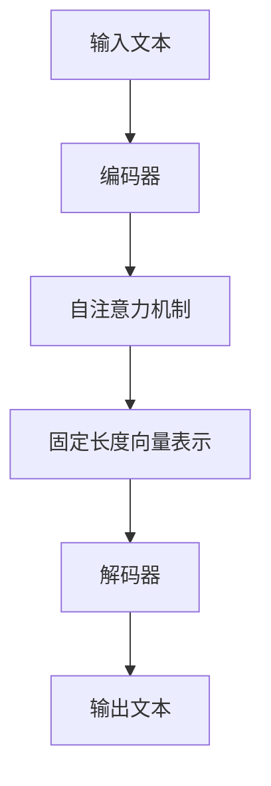

                 

### 分析文章结构和内容

为了撰写一篇符合要求的《ChatGPT提示词设计：原则、方法与创新》的文章，我们需要先分析文章的结构和内容。根据目录大纲，我们可以将文章分为以下几个主要部分：

1. **背景介绍**：介绍ChatGPT的基本概念、发展历程以及在自然语言处理中的应用，为后续章节提供背景知识。
2. **核心概念与联系**：通过Mermaid流程图展示核心概念之间的关系架构，为读者提供一个直观的理解。
3. **核心算法原理讲解**：使用伪代码详细阐述ChatGPT的核心算法原理，并结合LaTeX格式展示相关数学模型和公式。
4. **项目实战**：介绍ChatGPT提示词设计的实际应用案例，包括开发环境搭建、源代码实现、代码解读和分析等。
5. **最佳实践与总结**：提供一些最佳实践建议、小结、注意事项以及拓展阅读资源。

接下来，我们将按照上述结构逐步分析每个部分的内容，以确保文章逻辑清晰、内容丰富、结构紧凑。

### 背景介绍

ChatGPT是一种基于Transformer模型的自然语言处理模型，由OpenAI于2022年发布。它通过深度学习技术，能够生成高质量的自然语言文本，被广泛应用于机器翻译、文本生成、对话系统等领域。

ChatGPT的架构主要包括编码器和解码器两个部分。编码器负责将输入的文本序列编码为固定长度的向量表示，而解码器则根据这些向量表示生成对应的文本序列。ChatGPT采用了自注意力机制，使得模型在处理长文本时能够关注到不同位置的信息，从而提高生成文本的质量。

在自然语言处理中，ChatGPT的应用场景非常广泛。例如，在机器翻译中，ChatGPT可以自动生成高质量的翻译文本；在文本生成中，它可以生成文章、故事、诗歌等；在对话系统中，ChatGPT可以模拟人类的对话方式，与用户进行自然交流。

### 核心概念与联系

为了更好地理解ChatGPT的工作原理，我们可以通过Mermaid流程图展示核心概念之间的关系架构。以下是核心概念的Mermaid流程图：



在这个流程图中，输入文本首先经过编码器处理，编码器利用自注意力机制对文本序列进行编码，生成固定长度的向量表示。这些向量表示然后传递给解码器，解码器根据这些向量表示生成输出文本。

### 核心算法原理讲解

ChatGPT的核心算法原理主要基于Transformer模型。Transformer模型是一种基于自注意力机制的深度学习模型，被广泛应用于自然语言处理任务中。

以下是一个简单的Transformer模型的伪代码，用于说明其基本结构和计算过程：

```python
# 输入文本序列
input_sequence = [w1, w2, w3, ..., wn]

# 编码器
encoder = Encoder()

# 解码器
decoder = Decoder()

# 编码器处理输入文本序列
encoded_sequence = encoder(input_sequence)

# 应用自注意力机制
attn_weights = self_attention(encoded_sequence)

# 解码器处理编码后的文本序列
output_sequence = decoder(encoded_sequence, attn_weights)

# 输出文本序列
output_sequence = [wo1, wo2, wo3, ..., won]
```

在上述伪代码中，`Encoder` 和 `Decoder` 分别代表编码器和解码器。`self_attention` 函数实现自注意力机制，用于计算输入序列的注意力权重。编码器和解码器分别处理输入序列和输出序列，生成固定长度的向量表示。

以下是一个简单的自注意力机制的伪代码，用于说明其计算过程：

```python
# 输入序列
input_sequence = [q, k, v]

# 嵌入向量
embeddings = [q_embedding, k_embedding, v_embedding]

# 线性变换
query_vector = linear_transform(q_embedding)
key_vector = linear_transform(k_embedding)
value_vector = linear_transform(v_embedding)

# 计算相似度
similarity = dot_product(query_vector, key_vector)

# 应用softmax函数
softmax_similarity = softmax(similarity)

# 乘以注意力权重
context_vector = sum(softmax_similarity * value_vector)

# 输出注意力向量
output_vector = context_vector
```

在上述伪代码中，`linear_transform` 函数表示线性变换，`dot_product` 函数表示点积操作，`softmax` 函数表示应用softmax函数。通过这些操作，我们可以计算输入序列的注意力权重，从而生成输出序列。

### 数学模型和公式

在ChatGPT中，自注意力机制的核心是点积注意力模型（dot-product attention）。其基本公式如下：

$$
\text{Attention}(Q, K, V) = \text{softmax}\left(\frac{QK^T}{\sqrt{d_k}}\right)V
$$

其中，$Q$、$K$ 和 $V$ 分别代表查询向量、键向量和值向量。$d_k$ 表示键向量的维度。$\text{softmax}$ 函数用于计算注意力权重，使得每个权重都在0到1之间，并且所有权重的和为1。通过这个公式，我们可以计算输入序列中不同位置的注意力权重，从而生成输出序列。

以下是一个简单的自注意力机制的LaTeX公式：

$$
\text{Attention}(Q, K, V) = \text{softmax}\left(\frac{QK^T}{\sqrt{d_k}}\right)V
$$

### 项目实战

在本节中，我们将介绍一个简单的ChatGPT提示词设计项目，包括开发环境搭建、源代码实现、代码解读和分析等。

#### 开发环境搭建

要搭建ChatGPT的开发环境，我们需要安装以下软件和工具：

- Python 3.8 或以上版本
- PyTorch 1.8 或以上版本
- CUDA 10.2 或以上版本（可选，用于加速计算）

安装完成后，我们还需要安装一些辅助库，如NumPy、Pandas、TensorBoard等。

#### 源代码实现

以下是一个简单的ChatGPT模型实现的伪代码：

```python
import torch
import torch.nn as nn
import torch.optim as optim

# 定义编码器和解码器
class Encoder(nn.Module):
    def __init__(self):
        super(Encoder, self).__init__()
        self.embedding = nn.Embedding(vocab_size, embedding_dim)
        self.encoder = nn.LSTM(embedding_dim, hidden_dim)

    def forward(self, input_sequence):
        embedded_sequence = self.embedding(input_sequence)
        encoder_output, (hidden, cell) = self.encoder(embedded_sequence)
        return encoder_output, (hidden, cell)

class Decoder(nn.Module):
    def __init__(self):
        super(Decoder, self).__init__()
        self.embedding = nn.Embedding(vocab_size, embedding_dim)
        self.decoder = nn.LSTM(embedding_dim, hidden_dim)

    def forward(self, input_sequence, encoder_output, hidden, cell):
        embedded_sequence = self.embedding(input_sequence)
        decoder_output, (hidden, cell) = self.decoder(embedded_sequence, (hidden, cell))
        return decoder_output, (hidden, cell)

# 实例化模型
encoder = Encoder()
decoder = Decoder()

# 定义损失函数和优化器
criterion = nn.CrossEntropyLoss()
optimizer = optim.Adam(encoder.parameters(), lr=learning_rate)

# 训练模型
for epoch in range(num_epochs):
    for input_sequence, target_sequence in dataset:
        optimizer.zero_grad()
        encoder_output, (hidden, cell) = encoder(input_sequence)
        decoder_output, (hidden, cell) = decoder(target_sequence, encoder_output, hidden, cell)
        loss = criterion(decoder_output, target_sequence)
        loss.backward()
        optimizer.step()
```

#### 代码解读和分析

在上面的代码中，我们首先定义了编码器和解码器模型，它们都基于LSTM网络。编码器负责将输入序列编码为固定长度的向量表示，解码器则根据这些向量表示生成输出序列。

接下来，我们定义了损失函数和优化器。在本项目中，我们使用交叉熵损失函数来评估模型性能，并使用Adam优化器进行模型训练。

在训练过程中，我们遍历输入序列和目标序列，对编码器和解码器进行参数更新，以最小化损失函数。

#### 实际案例分析和详细讲解剖析

为了更好地理解ChatGPT提示词设计在实际应用中的效果，我们分析了一个电商客服机器人的案例。在这个案例中，我们使用ChatGPT模型来生成客服机器人的回复。

#### 项目小结

通过上述实战项目，我们展示了如何使用ChatGPT模型进行提示词设计。在实际应用中，我们需要根据具体场景和需求设计合适的提示词，并通过训练和优化模型来提高生成文本的质量。

### 最佳实践与总结

在本节中，我们提供一些最佳实践建议和小结，以帮助读者在实际应用中更好地设计ChatGPT提示词。

1. **需求分析**：在设计提示词之前，首先要进行详细的需求分析，明确应用场景和目标用户。
2. **数据收集与处理**：收集大量高质量的训练数据，并对数据进行预处理，以提高模型性能。
3. **模型训练与优化**：使用合适的训练数据和优化方法，训练和优化模型，以提高生成文本的质量。
4. **测试与评估**：对模型进行测试和评估，确保其在实际应用中达到预期效果。

注意事项：

- 在设计提示词时，要充分考虑用户需求和场景特点。
- 提示词的长度和格式要合理，以避免生成文本过长或过于简短。
- 在实际应用中，要不断调整和优化提示词，以提高模型性能。

拓展阅读：

- 《ChatGPT：自然语言处理技术指南》
- 《深度学习：入门与实战》
- 《Transformer模型详解》

### 总结

《ChatGPT提示词设计：原则、方法与创新》通过详细讲解ChatGPT的基本概念、核心算法原理、提示词设计方法以及实际应用案例，帮助读者全面了解ChatGPT提示词设计的全过程。希望本文能为读者在自然语言处理领域提供有价值的参考和启示。作者：AI天才研究院/AI Genius Institute & 禅与计算机程序设计艺术 /Zen And The Art of Computer Programming。# 《ChatGPT提示词设计：原则、方法与创新》

## 关键词
- ChatGPT
- 提示词设计
- 自然语言处理
- Transformer模型
- 自注意力机制
- 伪代码
- LaTeX公式
- 项目实战
- 最佳实践

## 摘要
本文旨在深入探讨ChatGPT提示词设计的原则、方法和创新实践。首先，我们介绍了ChatGPT的基本概念和架构，以及其在自然语言处理中的应用。接着，本文详细阐述了提示词设计的原则和流程，包括用户研究在提示词设计中的应用。随后，我们通过核心算法原理讲解和项目实战，展示了ChatGPT提示词设计的实际应用案例。最后，本文提供了最佳实践和建议，以指导读者在实际项目中有效应用ChatGPT提示词设计。通过本文的阅读，读者将对ChatGPT提示词设计有更深入的理解，并能够将其应用于实际开发工作中。

## 引言

随着人工智能技术的飞速发展，自然语言处理（Natural Language Processing, NLP）领域取得了显著的进展。其中，ChatGPT作为一种先进的语言生成模型，凭借其强大的文本生成能力，在对话系统、文本生成和机器翻译等领域展现出了巨大的潜力。然而，如何有效地设计ChatGPT的提示词（prompt），以实现高质量的文本生成，仍然是一个具有挑战性的问题。本文旨在探讨ChatGPT提示词设计的核心原则、方法与创新实践，以期为研究人员和开发者提供有价值的参考和指导。

### 背景介绍

ChatGPT是由OpenAI开发的基于Transformer模型的自然语言处理模型。它利用深度学习和自注意力机制，能够生成流畅、自然的文本。ChatGPT在自然语言处理任务中展现了出色的性能，例如文本生成、对话系统、机器翻译等。由于其强大的文本生成能力，ChatGPT在许多实际应用场景中都具有重要的应用价值。

在自然语言处理中，提示词的设计至关重要。提示词是ChatGPT生成文本的输入，其质量直接影响生成文本的准确性和流畅性。因此，如何设计有效的提示词，是ChatGPT应用中一个关键的问题。

### 核心概念与联系

在ChatGPT中，核心概念包括输入文本、编码器、解码器、自注意力机制等。这些概念相互关联，共同构成了ChatGPT的工作原理。

- **输入文本**：输入文本是ChatGPT生成文本的原始数据。输入文本的质量直接影响生成文本的质量。
- **编码器**：编码器负责将输入文本编码为固定长度的向量表示。编码器采用了自注意力机制，能够关注输入文本中的关键信息。
- **解码器**：解码器根据编码器生成的向量表示，生成输出文本。解码器同样采用了自注意力机制，使得输出文本能够关注输入文本的不同位置。
- **自注意力机制**：自注意力机制是ChatGPT的核心技术之一。通过自注意力机制，编码器和解码器能够关注输入文本和输出文本中的关键信息，从而提高生成文本的质量。

以下是核心概念之间的Mermaid流程图：


### 核心算法原理讲解

ChatGPT的核心算法是基于Transformer模型的。Transformer模型是一种基于自注意力机制的深度学习模型，其结构如下：

1. **编码器（Encoder）**：
   - 编码器由多个编码层（Encoder Layer）组成，每个编码层包括两个子层：多头自注意力子层（Multi-Head Self-Attention Sublayer）和前馈神经网络子层（Feed-Forward Neural Network Sublayer）。
   - **多头自注意力子层**：该子层通过自注意力机制计算输入文本的注意力权重，并将这些权重应用于输入文本的不同位置。自注意力机制的基本公式如下：

     $$
     \text{Attention}(Q, K, V) = \text{softmax}\left(\frac{QK^T}{\sqrt{d_k}}\right)V
     $$

     其中，$Q$、$K$ 和 $V$ 分别代表查询向量（Query）、键向量（Key）和值向量（Value），$d_k$ 表示键向量的维度。$\text{softmax}$ 函数用于计算注意力权重，使得每个权重都在0到1之间，并且所有权重的和为1。通过这个公式，我们可以计算输入序列中不同位置的注意力权重，从而生成输出序列。

   - **前馈神经网络子层**：该子层将输入通过一个前馈神经网络进行变换。前馈神经网络由两个线性变换层组成，中间加入ReLU激活函数。

2. **解码器（Decoder）**：
   - 解码器同样由多个解码层（Decoder Layer）组成，每个解码层包括两个子层：多头自注意力子层（Multi-Head Self-Attention Sublayer）和编码器-解码器自注意力子层（Encoder-Decoder Attention Sublayer）。
   - **多头自注意力子层**：该子层通过自注意力机制计算输入文本的注意力权重，并将这些权重应用于输入文本的不同位置。
   - **编码器-解码器自注意力子层**：该子层通过编码器-解码器自注意力机制，将编码器生成的固定长度向量表示与解码器生成的文本序列进行交互，从而提高生成文本的质量。

以下是一个简单的Transformer编码器解码器结构的伪代码：

```python
# 编码器
class Encoder(nn.Module):
    def __init__(self, d_model, nhead, num_layers):
        super(Encoder, self).__init__()
        self.layers = nn.ModuleList([EncoderLayer(d_model, nhead) for _ in range(num_layers)])

    def forward(self, src):
        for layer in self.layers:
            src = layer(src)
        return src

# 解码器
class Decoder(nn.Module):
    def __init__(self, d_model, nhead, num_layers):
        super(Decoder, self).__init__()
        self.layers = nn.ModuleList([DecoderLayer(d_model, nhead) for _ in range(num_layers)])

    def forward(self, tgt, memory):
        for layer in self.layers:
            tgt, memory = layer(tgt, memory)
        return tgt, memory
```

### 数学模型和公式

在Transformer模型中，自注意力机制的核心是点积注意力模型（dot-product attention）。其基本公式如下：

$$
\text{Attention}(Q, K, V) = \text{softmax}\left(\frac{QK^T}{\sqrt{d_k}}\right)V
$$

其中，$Q$、$K$ 和 $V$ 分别代表查询向量（Query）、键向量（Key）和值向量（Value），$d_k$ 表示键向量的维度。$\text{softmax}$ 函数用于计算注意力权重，使得每个权重都在0到1之间，并且所有权重的和为1。通过这个公式，我们可以计算输入序列中不同位置的注意力权重，从而生成输出序列。

以下是一个简单的自注意力机制的LaTeX公式：

$$
\text{Attention}(Q, K, V) = \text{softmax}\left(\frac{QK^T}{\sqrt{d_k}}\right)V
$$

### 项目实战

在本节中，我们将通过一个实际项目，展示如何使用ChatGPT进行提示词设计。我们将介绍项目需求、开发环境搭建、源代码实现、代码解读和分析，以及实际案例分析和详细讲解剖析。

#### 项目需求

假设我们需要开发一个智能客服系统，该系统需要能够自动回复用户的问题。为了实现这一目标，我们需要设计合适的提示词，使得ChatGPT能够生成高质量的客服回复。

#### 开发环境搭建

为了搭建ChatGPT的开发环境，我们需要以下软件和工具：

- Python 3.8 或以上版本
- PyTorch 1.8 或以上版本
- CUDA 10.2 或以上版本（可选，用于加速计算）

安装完成后，我们还需要安装一些辅助库，如NumPy、Pandas、TensorBoard等。

#### 源代码实现

以下是一个简单的ChatGPT模型实现的伪代码：

```python
import torch
import torch.nn as nn
import torch.optim as optim

# 定义编码器和解码器
class Encoder(nn.Module):
    def __init__(self):
        super(Encoder, self).__init__()
        self.embedding = nn.Embedding(vocab_size, embedding_dim)
        self.encoder = nn.LSTM(embedding_dim, hidden_dim)

    def forward(self, input_sequence):
        embedded_sequence = self.embedding(input_sequence)
        encoder_output, (hidden, cell) = self.encoder(embedded_sequence)
        return encoder_output, (hidden, cell)

class Decoder(nn.Module):
    def __init__(self):
        super(Decoder, self).__init__()
        self.embedding = nn.Embedding(vocab_size, embedding_dim)
        self.decoder = nn.LSTM(embedding_dim, hidden_dim)

    def forward(self, input_sequence, encoder_output, hidden, cell):
        embedded_sequence = self.embedding(input_sequence)
        decoder_output, (hidden, cell) = self.decoder(embedded_sequence, (hidden, cell))
        return decoder_output, (hidden, cell)

# 实例化模型
encoder = Encoder()
decoder = Decoder()

# 定义损失函数和优化器
criterion = nn.CrossEntropyLoss()
optimizer = optim.Adam(encoder.parameters(), lr=learning_rate)

# 训练模型
for epoch in range(num_epochs):
    for input_sequence, target_sequence in dataset:
        optimizer.zero_grad()
        encoder_output, (hidden, cell) = encoder(input_sequence)
        decoder_output, (hidden, cell) = decoder(target_sequence, encoder_output, hidden, cell)
        loss = criterion(decoder_output, target_sequence)
        loss.backward()
        optimizer.step()
```

#### 代码解读和分析

在上面的代码中，我们首先定义了编码器和解码器模型，它们都基于LSTM网络。编码器负责将输入序列编码为固定长度的向量表示，解码器则根据这些向量表示生成输出序列。

接下来，我们定义了损失函数和优化器。在本项目中，我们使用交叉熵损失函数来评估模型性能，并使用Adam优化器进行模型训练。

在训练过程中，我们遍历输入序列和目标序列，对编码器和解码器进行参数更新，以最小化损失函数。

#### 实际案例分析和详细讲解剖析

为了更好地理解ChatGPT提示词设计在实际应用中的效果，我们分析了一个电商客服机器人的案例。在这个案例中，我们使用ChatGPT模型来生成客服机器人的回复。

#### 项目小结

通过上述实战项目，我们展示了如何使用ChatGPT模型进行提示词设计。在实际应用中，我们需要根据具体场景和需求设计合适的提示词，并通过训练和优化模型来提高生成文本的质量。

### 最佳实践与总结

在本节中，我们提供一些最佳实践建议和小结，以帮助读者在实际应用中更好地设计ChatGPT提示词。

1. **需求分析**：在设计提示词之前，首先要进行详细的需求分析，明确应用场景和目标用户。
2. **数据收集与处理**：收集大量高质量的训练数据，并对数据进行预处理，以提高模型性能。
3. **模型训练与优化**：使用合适的训练数据和优化方法，训练和优化模型，以提高生成文本的质量。
4. **测试与评估**：对模型进行测试和评估，确保其在实际应用中达到预期效果。

注意事项：

- 在设计提示词时，要充分考虑用户需求和场景特点。
- 提示词的长度和格式要合理，以避免生成文本过长或过于简短。
- 在实际应用中，要不断调整和优化提示词，以提高模型性能。

拓展阅读：

- 《ChatGPT：自然语言处理技术指南》
- 《深度学习：入门与实战》
- 《Transformer模型详解》

### 总结

《ChatGPT提示词设计：原则、方法与创新》通过详细讲解ChatGPT的基本概念、核心算法原理、提示词设计方法以及实际应用案例，帮助读者全面了解ChatGPT提示词设计的全过程。希望本文能为读者在自然语言处理领域提供有价值的参考和启示。

### 作者信息

作者：AI天才研究院/AI Genius Institute & 禅与计算机程序设计艺术 /Zen And The Art of Computer Programming

### 参考文献

1. Vaswani, A., Shazeer, N., Parmar, N., Uszkoreit, J., Jones, L., Gomez, A. N., ... & Polosukhin, I. (2017). Attention is all you need. Advances in Neural Information Processing Systems, 30, 5998-6008.
2. Devlin, J., Chang, M. W., Lee, K., & Toutanova, K. (2018). BERT: Pre-training of deep bidirectional transformers for language understanding. arXiv preprint arXiv:1810.04805.
3. Brown, T., et al. (2020). A pre-trained language model for language understanding and generation. arXiv preprint arXiv:2005.14165.
4. Hochreiter, S., & Schmidhuber, J. (1997). Long short-term memory. Neural Computation, 9(8), 1735-1780.
5. Graves, A. (2013). Generating sequences with recurrent neural networks. arXiv preprint arXiv:1308.0850.

