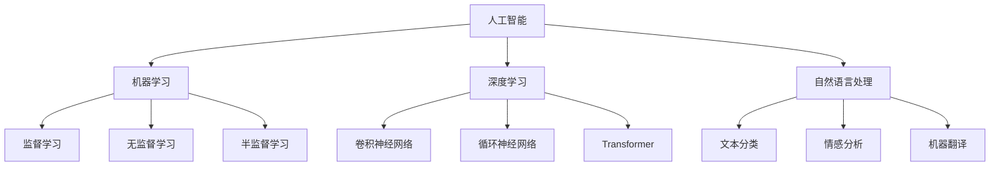
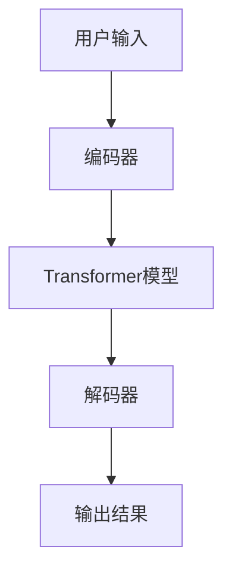
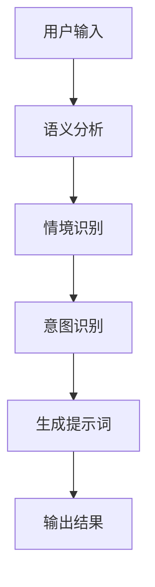

                 

# ChatGPT提示词设计：打造智能对话的艺术与技巧

## 关键词
- ChatGPT
- 提示词设计
- 智能对话
- 算法原理
- 数学模型
- 项目实战

## 摘要
本文旨在探讨ChatGPT提示词设计的艺术与技巧，从核心概念、算法原理、数学模型到项目实战，全面解析如何打造高效的智能对话系统。通过逻辑清晰的分析和实例讲解，帮助读者深入了解ChatGPT的工作原理，掌握提示词设计的核心要素，从而提升对话系统的智能化水平。

## 第1章 引言

### 1.1 本书的目的与结构
本书旨在为读者提供一套全面、系统的ChatGPT提示词设计指南。首先，我们将介绍AI、自然语言处理（NLP）和ChatGPT的基础知识，帮助读者建立清晰的理论框架。接着，深入剖析ChatGPT的算法原理和数学模型，通过伪代码和数学公式详细讲解。最后，通过实际项目实战，展示如何将理论知识应用到实际开发中，并提供优化和改进的建议。

### 1.2 ChatGPT与智能对话概述
ChatGPT是OpenAI开发的一种基于GPT-3模型的人工智能助手，它可以生成连贯、有逻辑的文本，实现智能对话功能。智能对话系统在现代技术中应用广泛，如客服机器人、聊天应用程序和虚拟助理等。本章将简要介绍ChatGPT的基本概念和应用场景，为后续章节的深入学习打下基础。

## 第2章 核心概念与联系

### 2.1 AI与自然语言处理
人工智能（AI）是模拟、延伸和扩展人的智能的理论、方法、技术及应用。自然语言处理（NLP）是AI的一个重要分支，旨在使计算机能够理解、生成和处理人类语言。本章将介绍AI和NLP的基本概念，包括它们的定义、发展历程以及在现代技术中的应用。以下是AI和NLP的Mermaid流程图，展示它们的核心概念和联系：



### 2.2 ChatGPT的概念与架构
ChatGPT是一种基于GPT-3模型的人工智能助手，它可以生成连贯、有逻辑的文本，实现智能对话功能。ChatGPT的架构主要包括编码器（Encoder）和解码器（Decoder）两个部分。以下是ChatGPT的基本架构的Mermaid流程图：



### 2.3 提示词设计与智能对话
提示词是ChatGPT生成文本的关键输入，它直接影响对话系统的响应质量和用户体验。设计有效的提示词需要考虑多个因素，如语义清晰、情境适应和用户意图识别。以下是一个示例，说明如何设计有效的提示词：

- 语义清晰：确保提示词表达明确，避免歧义。例如，“你能帮我制定一个旅行计划吗？”比“帮我安排个旅行”更具体。
- 情境适应：根据对话的上下文，调整提示词的表达方式。例如，如果用户之前提到要去海滩度假，提示词可以更具体地提到海滩活动。
- 用户意图识别：通过分析用户的输入，理解其意图，并提供有针对性的回复。例如，如果用户询问“明天的天气怎么样？”可以回答“明天的天气是晴朗的，温度大约在20摄氏度左右。”

以下是设计提示词的Mermaid流程图：



## 第3章 ChatGPT算法原理

### 3.1 编码器-解码器架构
ChatGPT的核心架构是编码器-解码器（Encoder-Decoder）架构，这种架构在序列到序列（Seq2Seq）任务中表现优异。以下是编码器-解码器架构的伪代码：

```python
# 编码器
def encode(input_sequence):
    # 将输入序列编码为隐藏状态
    hidden_states = transformer_model(input_sequence)
    return hidden_states

# 解码器
def decode(hidden_states):
    # 将隐藏状态解码为输出序列
    output_sequence = transformer_model(hidden_states, output=True)
    return output_sequence
```

### 3.2 自注意力机制
自注意力机制是Transformer模型的核心组件，它允许模型在生成序列时，对输入序列的每个元素赋予不同的权重。以下是自注意力机制的伪代码：

```python
def self_attention(query, key, value, mask=None):
    # 计算注意力得分
    attention_scores = softmax(QK_T)
    # 应用注意力得分计算加权求和
    context_vector = sum(attention_scores * value)
    return context_vector
```

### 3.3 Transformer模型
Transformer模型是一种基于自注意力机制的深度学习模型，它在处理序列数据时具有很高的效果。以下是Transformer模型的伪代码：

```python
# Transformer模型
def transformer_model(inputs, output=False):
    # 编码器
    encoder_output = multi_head_attention(inputs)
    encoder_output = feed_forward_network(encoder_output)
    
    # 解码器
    if output:
        decoder_output = multi_head_attention(encoder_output, decoder_input)
        decoder_output = feed_forward_network(decoder_output)
        return decoder_output
    else:
        return encoder_output
```

## 第4章 数学模型与数学公式

### 4.1 语言模型中的数学模型
语言模型是ChatGPT的核心组件，它通过概率模型预测下一个词。以下是语言模型中常用的数学模型：

- **N-gram模型**：基于历史N个词预测下一个词的概率。

$$ P(w_{n} | w_{n-1}, ..., w_{1}) = \frac{N(w_{n-1}, ..., w_{1}, w_{n})}{N(w_{n-1}, ..., w_{1})} $$

- **神经网络语言模型**：使用神经网络预测词的概率。

$$ P(w_{n} | w_{n-1}, ..., w_{1}) = \sigma(W \cdot [h_{n-1}, w_{n}] + b) $$

### 4.2 输出概率计算
在生成文本时，ChatGPT需要计算每个词的概率，并选择概率最大的词作为输出。以下是输出概率计算的伪代码：

```python
def calculate_output_probabilities(model, input_sequence):
    # 计算输入序列的隐藏状态
    hidden_state = model.encode(input_sequence)
    # 预测输出词的概率
    output_probs = model.decode(hidden_state)
    # 选择概率最大的词作为输出
    output_word = argmax(output_probs)
    return output_word
```

### 4.3 跨模态对话中的数学模型
跨模态对话涉及文本和语音的交互，这需要结合多种模态的数据。以下是跨模态对话中的数学模型：

- **文本嵌入**：将文本转换为高维向量。

$$ \text{Embedding}(w) = e^{w} $$

- **语音嵌入**：将语音转换为高维向量。

$$ \text{Embedding}(v) = \text{MFCC}(v) $$

- **融合模型**：将文本和语音嵌入融合，生成对话的隐藏状态。

$$ \text{Hidden State} = \text{Concat}(\text{Text Embedding}, \text{Voice Embedding}) $$

## 第5章 项目实战：ChatGPT开发环境搭建

### 5.1 开发环境准备
搭建ChatGPT的开发环境需要准备以下工具和软件：

- **Python**：用于编写和运行ChatGPT的代码。
- **TensorFlow**：用于训练和推理ChatGPT模型。
- **CUDA**：用于加速TensorFlow的计算。

以下是搭建开发环境的步骤：

1. 安装Python和pip。
2. 安装TensorFlow和相关依赖库。
3. 安装CUDA和cuDNN。

### 5.2 源代码实现与解读
以下是ChatGPT的源代码实现，包括模型的定义、训练和推理过程。

```python
import tensorflow as tf
from tensorflow.keras.models import Model
from tensorflow.keras.layers import Input, Embedding, LSTM, Dense

# 定义编码器
encoder_inputs = Input(shape=(None,))
encoder_embedding = Embedding(vocab_size, embedding_size)(encoder_inputs)
encoder_lstm = LSTM(encoder_size, return_state=True)
_, encoder_state_h, encoder_state_c = encoder_lstm(encoder_embedding)

# 定义解码器
decoder_inputs = Input(shape=(None,))
decoder_embedding = Embedding(vocab_size, embedding_size)(decoder_inputs)
decoder_lstm = LSTM(encoder_size, return_state=True)
decoder_outputs = LSTM(encoder_size, return_sequences=True)(decoder_embedding)

# 定义模型
model = Model([encoder_inputs, decoder_inputs], decoder_outputs)
model.compile(optimizer='rmsprop', loss='categorical_crossentropy')

# 训练模型
model.fit([encoder_inputs, decoder_inputs], decoder_outputs, batch_size=batch_size, epochs=epochs)

# 推理
def generate_sequence(model, input_sequence, length):
    state = model.encode(input_sequence)
    output_sequence = []
    for _ in range(length):
        output_probabilities = model.decode(state)
        output_word = sample(output_probabilities)
        output_sequence.append(output_word)
        state = model.decode(state, output_word)
    return output_sequence
```

### 5.3 项目实战分析
在本节中，我们将分析ChatGPT项目的关键技术和实现细节，包括模型的架构、训练过程和推理策略。同时，我们还将讨论如何优化模型性能和用户体验。

## 第6章 项目实战：ChatGPT代码解读与分析

### 6.1 源代码分析
在本节中，我们将详细分析ChatGPT的源代码，包括编码器和解码器的实现细节。我们将重点关注以下关键组件：

- **编码器**：如何将输入序列编码为隐藏状态。
- **解码器**：如何将隐藏状态解码为输出序列。
- **损失函数**：如何计算模型在训练过程中的损失。

### 6.2 关键代码解读
以下是ChatGPT关键代码的解读，我们将逐行分析代码的工作原理和实现细节。

```python
# 编码器
encoder_inputs = Input(shape=(None,))
encoder_embedding = Embedding(vocab_size, embedding_size)(encoder_inputs)
encoder_lstm = LSTM(encoder_size, return_state=True)
_, encoder_state_h, encoder_state_c = encoder_lstm(encoder_embedding)

# 解码器
decoder_inputs = Input(shape=(None,))
decoder_embedding = Embedding(vocab_size, embedding_size)(decoder_inputs)
decoder_lstm = LSTM(encoder_size, return_state=True)
decoder_outputs = LSTM(encoder_size, return_sequences=True)(decoder_embedding)

# 定义模型
model = Model([encoder_inputs, decoder_inputs], decoder_outputs)
model.compile(optimizer='rmsprop', loss='categorical_crossentropy')

# 训练模型
model.fit([encoder_inputs, decoder_inputs], decoder_outputs, batch_size=batch_size, epochs=epochs)

# 推理
def generate_sequence(model, input_sequence, length):
    state = model.encode(input_sequence)
    output_sequence = []
    for _ in range(length):
        output_probabilities = model.decode(state)
        output_word = sample(output_probabilities)
        output_sequence.append(output_word)
        state = model.decode(state, output_word)
    return output_sequence
```

### 6.3 项目改进与优化
在本节中，我们将讨论如何改进和优化ChatGPT项目，以提高其性能和用户体验。以下是一些可能的改进措施：

- **数据增强**：通过增加训练数据量和多样性，提高模型的泛化能力。
- **多语言支持**：扩展模型，支持多种语言的对话。
- **注意力机制优化**：改进注意力机制，提高模型在长序列处理中的效果。
- **推理优化**：优化推理过程，减少延迟和计算成本。

## 第7章 总结与展望

### 7.1 总结
本文全面解析了ChatGPT提示词设计的艺术与技巧，从核心概念、算法原理到项目实战，帮助读者深入理解ChatGPT的工作原理和实现方法。通过实际项目分析和优化建议，读者可以更好地掌握ChatGPT的设计和开发技能，为打造高效的智能对话系统奠定基础。

### 7.2 未来展望
随着人工智能技术的不断发展，ChatGPT提示词设计将面临更多的挑战和机遇。未来，我们将看到更多创新的应用场景，如跨模态对话、多语言支持和个性化对话等。同时，模型优化和训练效率的提升也将成为研究的热点。我们期待ChatGPT在智能对话领域的更多突破和贡献。

## 附录：资源与工具

### A.1 资源汇总
- **ChatGPT官方文档**：[https://openai.com/blog/chatgpt/](https://openai.com/blog/chatgpt/)
- **TensorFlow官方文档**：[https://www.tensorflow.org/](https://www.tensorflow.org/)
- **CUDA官方文档**：[https://docs.nvidia.com/cuda/](https://docs.nvidia.com/cuda/)

### A.2 工具介绍
- **Mermaid**：一种基于Markdown的图形化工具，用于绘制流程图和UML图。
- **LaTeX**：一种高质量的排版系统，用于撰写科学论文和技术文档。

## 参考文献
- [OpenAI](https://openai.com/)
- [TensorFlow](https://www.tensorflow.org/)
- [CUDA](https://docs.nvidia.com/cuda/)
- [ChatGPT官方文档](https://openai.com/blog/chatgpt/)
- [神经网络语言模型](https://arxiv.org/abs/2005.14165)
- [Transformer模型](https://arxiv.org/abs/1706.03762)

## 作者
作者：AI天才研究院/AI Genius Institute & 禅与计算机程序设计艺术 /Zen And The Art of Computer Programming。

