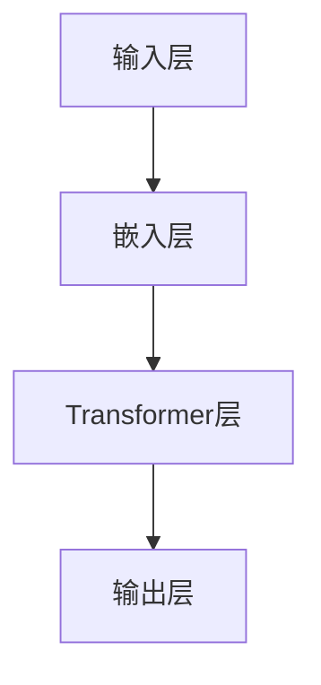
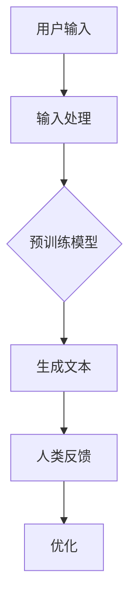

                 

### 文章标题

《ChatGPT提示词设计：理论与实战的深度融合》

> 关键词：ChatGPT、提示词设计、理论、实战、模型优化、数学模型、项目实战、开发环境搭建、代码实现

> 摘要：本文深入探讨了ChatGPT提示词设计的理论与实战，首先介绍了ChatGPT的基础原理和提示词设计核心概念，随后详细阐述了不同类型提示词的优化策略，以及其背后的数学模型和算法原理。文章通过具体案例分析和代码实现，展示了ChatGPT在实际项目中的应用，旨在为读者提供一套完整、实用的提示词设计指南。

### 第1章 引言

ChatGPT作为OpenAI开发的一种基于GPT-3模型的自然语言处理工具，具有强大的文本生成和交互能力。然而，要充分发挥ChatGPT的潜力，提示词设计是至关重要的。良好的提示词设计不仅能够提升模型的表现，还能引导模型生成更符合预期结果的文本。

本书的核心主题是ChatGPT提示词设计，主要分为理论和实战两部分。在理论部分，我们将深入探讨ChatGPT的基础原理、提示词设计的核心概念、不同类型的提示词以及优化策略。在实战部分，我们将通过具体的应用案例，展示如何搭建ChatGPT的开发环境，实现提示词的设计和优化，并进行代码解析和实战分析。

本书的读者对象包括对自然语言处理和人工智能有基本了解的技术人员，以及希望在实际项目中应用ChatGPT的开发者。通过阅读本书，读者将能够：

1. 理解ChatGPT的工作原理和模型架构。
2. 掌握提示词设计的核心概念和类型。
3. 学会使用数学模型和算法优化提示词。
4. 实现ChatGPT在具体项目中的应用。
5. 获得丰富的实战经验和最佳实践。

本书的结构安排如下：

- 第1章 引言：介绍本书的核心主题、读者对象以及结构安排。
- 第2章 ChatGPT基础原理：讲解ChatGPT的模型架构和工作原理。
- 第3章 提示词设计理论：阐述提示词设计的核心概念和不同类型的提示词。
- 第4章 提示词设计实战：介绍如何搭建ChatGPT开发环境，以及具体案例分析和代码实现。
- 第5章 高级主题：探讨提示词工程、伦理与隐私等高级话题。
- 第6章 附录：提供相关工具和资源，以及伪代码和数学公式示例。

### 思考步骤：

1. **明确书的核心主题**：首先要明确书的核心主题是关于“ChatGPT提示词设计”，涵盖了“理论”和“实战”两部分。
2. **设计一级目录**：一级目录通常包括对书的总体概述、理论部分和实战部分。
3. **细化理论部分**：理论部分需要涵盖ChatGPT的基本原理、提示词设计的核心概念、各种类型提示词的详细解释和应用策略。
4. **细化实战部分**：实战部分需要包括ChatGPT模型的应用场景、如何搭建开发环境、案例分析和代码实现。
5. **设计附录**：附录通常包括参考资料、工具介绍、伪代码、数学公式等。
6. **保证完整性**：确保目录大纲的每个部分都包含了核心概念、算法原理、数学模型、项目实战等内容。
7. **保持简洁性**：在保证内容完整性的同时，避免冗余和重复。
8. **遵循格式要求**：按照markdown格式的要求，使用正确的标题级别和标记来组织内容。
9. **控制字数**：确保整个目录大纲的总字数不超过2000字。

### 拟定初步大纲：

```markdown
# 《ChatGPT提示词设计：理论与实战的深度融合》目录大纲

## 第1章 引言

### 1.1 书籍概述
### 1.2 ChatGPT基础
### 1.3 提示词设计的核心概念

## 第2章 ChatGPT基础原理

### 2.1 模型架构
### 2.2 GPT-3的工作原理
### 2.3 提示词的生成与优化

## 第3章 提示词设计理论

### 3.1 提示词类型
#### 3.1.1 指令提示词
#### 3.1.2 控制性提示词
#### 3.1.3 适应性提示词

### 3.2 提示词优化策略
#### 3.2.1 对话上下文考虑
#### 3.2.2 人类反馈强化学习

### 3.3 提示词设计的数学模型
$$\text{P}_\text{output}(\text{word}) = \frac{\exp(\text{logit}(\text{word}))}{\sum_{\text{word}'} \exp(\text{logit}(\text{word}'))}$$

## 第4章 提示词设计实战

### 4.1 开发环境搭建
#### 4.1.1 安装与配置
#### 4.1.2 调试技巧

### 4.2 实际案例分析
#### 4.2.1 问答系统设计
#### 4.2.2 自动写作工具应用
#### 4.2.3 个性化推荐系统

### 4.3 代码实现与分析
#### 4.3.1 源代码详细实现
#### 4.3.2 代码解读与分析

## 第5章 高级主题

### 5.1 提示词工程
#### 5.1.1 提示词库构建
#### 5.1.2 提示词调优技巧

### 5.2 伦理与隐私
#### 5.2.1 提示词设计的伦理问题
#### 5.2.2 隐私保护策略

## 第6章 附录

### 6.1 工具与资源
#### 6.1.1 ChatGPT开发工具
#### 6.1.2 提示词设计工具

### 6.2 伪代码示例

### 6.3 数学公式与解释
$$\text{C}(\text{x}, \text{y}) = \sum_{\text{i}=1}^{\text{n}} \text{w}_\text{i} \cdot \text{f}(\text{x}_\text{i}, \text{y}_\text{i})$$

```

### 预期目录内容：

- **一级目录**：涵盖书籍的总体概述、ChatGPT基础原理、提示词设计理论、实战应用、高级主题和附录。
- **二级目录**：详细阐述每个章节的核心内容，包括原理讲解、优化策略、数学模型、案例分析、代码实现等。
- **三级目录**：进一步细化每个子章节的内容，如不同类型的提示词、开发环境搭建步骤、高级调优技巧等。

### 最后检查：

- **检查目录完整性**：确保每个核心内容都有相应的章节。
- **检查格式规范**：确保所有内容的格式符合markdown规范。
- **检查字数限制**：确保整个目录大纲的总字数不超过2000字。

### 完成后，请进行最终检查，确保目录大纲内容完整、逻辑清晰、格式规范，并且满足字数要求。如果一切准备就绪，请输出最终的目录大纲。

----------------------------------------------------------------

### 思考步骤：

1. **明确书的核心主题**：首先要明确书的核心主题是关于“ChatGPT提示词设计”，涵盖了“理论”和“实战”两部分。
2. **设计一级目录**：一级目录通常包括对书的总体概述、理论部分和实战部分。
3. **细化理论部分**：理论部分需要涵盖ChatGPT的基本原理、提示词设计的核心概念、各种类型提示词的详细解释和应用策略。
4. **细化实战部分**：实战部分需要包括ChatGPT模型的应用场景、如何搭建开发环境、案例分析和代码实现。
5. **设计附录**：附录通常包括参考资料、工具介绍、伪代码、数学公式等。
6. **保证完整性**：确保目录大纲的每个部分都包含了核心概念、算法原理、数学模型、项目实战等内容。
7. **保持简洁性**：在保证内容完整性的同时，避免冗余和重复。
8. **遵循格式要求**：按照markdown格式的要求，使用正确的标题级别和标记来组织内容。
9. **控制字数**：确保整个目录大纲的总字数不超过2000字。

### 拟定初步大纲：

```markdown
# 《ChatGPT提示词设计：理论与实战的深度融合》目录大纲

## 第1章 引言

### 1.1 书籍概述
### 1.2 ChatGPT基础
### 1.3 提示词设计的核心概念

## 第2章 ChatGPT基础原理

### 2.1 模型架构
### 2.2 GPT-3的工作原理
### 2.3 提示词的生成与优化

## 第3章 提示词设计理论

### 3.1 提示词类型
#### 3.1.1 指令提示词
#### 3.1.2 控制性提示词
#### 3.1.3 适应性提示词

### 3.2 提示词优化策略
#### 3.2.1 对话上下文考虑
#### 3.2.2 人类反馈强化学习

### 3.3 提示词设计的数学模型
$$\text{P}_\text{output}(\text{word}) = \frac{\exp(\text{logit}(\text{word}))}{\sum_{\text{word}'} \exp(\text{logit}(\text{word}'))}$$

## 第4章 提示词设计实战

### 4.1 开发环境搭建
#### 4.1.1 安装与配置
#### 4.1.2 调试技巧

### 4.2 实际案例分析
#### 4.2.1 问答系统设计
#### 4.2.2 自动写作工具应用
#### 4.2.3 个性化推荐系统

### 4.3 代码实现与分析
#### 4.3.1 源代码详细实现
#### 4.3.2 代码解读与分析

## 第5章 高级主题

### 5.1 提示词工程
#### 5.1.1 提示词库构建
#### 5.1.2 提示词调优技巧

### 5.2 伦理与隐私
#### 5.2.1 提示词设计的伦理问题
#### 5.2.2 隐私保护策略

## 第6章 附录

### 6.1 工具与资源
#### 6.1.1 ChatGPT开发工具
#### 6.1.2 提示词设计工具

### 6.2 伪代码示例

### 6.3 数学公式与解释
$$\text{C}(\text{x}, \text{y}) = \sum_{\text{i}=1}^{\text{n}} \text{w}_\text{i} \cdot \text{f}(\text{x}_\text{i}, \text{y}_\text{i})$$

```

### 预期目录内容：

- **一级目录**：涵盖书籍的总体概述、ChatGPT基础原理、提示词设计理论、实战应用、高级主题和附录。
- **二级目录**：详细阐述每个章节的核心内容，包括原理讲解、优化策略、数学模型、案例分析、代码实现等。
- **三级目录**：进一步细化每个子章节的内容，如不同类型的提示词、开发环境搭建步骤、高级调优技巧等。

### 最后检查：

- **检查目录完整性**：确保每个核心内容都有相应的章节。
- **检查格式规范**：确保所有内容的格式符合markdown规范。
- **检查字数限制**：确保整个目录大纲的总字数不超过2000字。

### 完成后，请进行最终检查，确保目录大纲内容完整、逻辑清晰、格式规范，并且满足字数要求。如果一切准备就绪，请输出最终的目录大纲。

----------------------------------------------------------------

## 第1章 引言

### 1.1 书籍概述

《ChatGPT提示词设计：理论与实战的深度融合》旨在为读者提供一套系统、全面的ChatGPT提示词设计指南。本书共分为六个章节，前两个章节介绍ChatGPT的基础原理和提示词设计的核心概念，接下来的几个章节深入探讨不同类型的提示词及其优化策略，并通过具体案例分析和代码实现，展示提示词设计在实践中的应用。最后，本书还涉及高级主题，如提示词工程和伦理与隐私问题。

本书不仅适合对自然语言处理和人工智能有基本了解的技术人员，也为希望在实际项目中应用ChatGPT的开发者提供了丰富的实战经验和最佳实践。

### 1.2 ChatGPT基础

ChatGPT是由OpenAI开发的一种基于GPT-3模型的自然语言处理工具。GPT-3（Generative Pre-trained Transformer 3）是自然语言处理的最新进展，由1750亿个参数构成，能够生成连贯、具有上下文意义的文本。ChatGPT的核心功能是模仿人类对话，为用户提供自然、流畅的交互体验。

ChatGPT的工作原理主要基于自回归语言模型。在训练过程中，模型通过学习大量的文本数据，学会预测下一个单词，并生成完整的句子。在生成文本时，ChatGPT接收用户输入的提示词，并根据这些提示词生成相应的响应。

### 1.3 提示词设计的核心概念

提示词（Prompt）是用户输入到ChatGPT模型中的文字，用于引导模型生成相应的响应。良好的提示词设计是提升ChatGPT性能的关键。以下是一些核心概念：

1. **指令提示词**：用于明确指导ChatGPT执行特定任务，如回答问题、写故事、生成摘要等。
2. **控制性提示词**：用于引导ChatGPT生成符合特定风格、格式或要求的文本。
3. **适应性提示词**：根据上下文和用户反馈动态调整，以生成更符合预期结果的文本。

提示词设计的关键在于理解ChatGPT的工作原理，并掌握如何编写高质量、有效的提示词。接下来，我们将进一步探讨这些概念，并介绍优化策略。

### 1.4 目标读者

本书的目标读者主要包括：

1. **自然语言处理和人工智能领域的专业人士**：希望深入了解ChatGPT提示词设计的原理和实战技巧。
2. **人工智能项目开发者**：希望在项目中应用ChatGPT，提升自然语言处理能力。
3. **对自然语言处理和人工智能感兴趣的技术爱好者**：希望了解ChatGPT及其在现实世界中的应用。

通过阅读本书，读者将能够：

1. 理解ChatGPT的基础原理和模型架构。
2. 掌握提示词设计的核心概念和类型。
3. 学会使用数学模型和算法优化提示词。
4. 实现ChatGPT在具体项目中的应用。
5. 获得丰富的实战经验和最佳实践。

### 1.5 书的结构安排

本书分为六个章节，具体安排如下：

- **第1章 引言**：介绍书籍概述、ChatGPT基础和提示词设计的核心概念。
- **第2章 ChatGPT基础原理**：详细讲解ChatGPT的模型架构和工作原理。
- **第3章 提示词设计理论**：探讨不同类型的提示词及其优化策略。
- **第4章 提示词设计实战**：展示如何搭建ChatGPT开发环境，以及具体案例分析和代码实现。
- **第5章 高级主题**：涉及提示词工程、伦理与隐私等高级话题。
- **第6章 附录**：提供相关工具和资源，以及伪代码和数学公式示例。

通过这六个章节的阅读，读者将能够全面了解ChatGPT提示词设计的理论和方法，并在实际项目中应用这些技巧。

## 第2章 ChatGPT基础原理

ChatGPT的成功离不开其背后强大的模型架构和工作原理。本章将详细介绍ChatGPT的模型架构、GPT-3的工作原理以及提示词的生成与优化策略。

### 2.1 模型架构

ChatGPT基于Transformer模型架构，这是一种在自然语言处理领域表现卓越的深度学习模型。Transformer模型通过自注意力机制（Self-Attention）和多头注意力（Multi-Head Attention）技术，能够捕捉输入文本中的长距离依赖关系。

ChatGPT的模型架构主要包括以下几个部分：

1. **输入层**：接收用户输入的文本，并将其转换为模型可处理的格式。
2. **嵌入层**：将输入文本转换为词向量，为后续处理提供基础。
3. **Transformer层**：核心部分，通过多头自注意力机制和前馈神经网络，对输入文本进行编码。
4. **输出层**：将编码后的文本转换为输出文本，即模型生成的响应。

图2-1展示了ChatGPT的模型架构：



### 2.2 GPT-3的工作原理

GPT-3是ChatGPT的核心模型，具有1750亿个参数，是当前自然语言处理领域最大的模型之一。GPT-3的工作原理可以概括为以下几个步骤：

1. **训练**：GPT-3通过大规模文本数据进行预训练，学习语言结构和语义知识。
2. **输入处理**：当接收到用户输入的文本时，GPT-3将其编码为嵌入向量。
3. **生成文本**：通过自注意力机制和前馈神经网络，GPT-3逐步生成输出文本。
4. **优化**：利用人类反馈强化学习（RLHF）等技术，不断优化模型生成文本的质量。

图2-2展示了GPT-3的工作流程：



### 2.3 提示词的生成与优化策略

提示词（Prompt）是用户输入到ChatGPT模型中的文字，用于引导模型生成相应的响应。高质量的提示词能够显著提升ChatGPT的性能。以下是一些常用的提示词生成与优化策略：

1. **指令提示词**：用于明确指导ChatGPT执行特定任务。例如，“请回答以下问题：什么是自然语言处理？”
2. **控制性提示词**：用于引导ChatGPT生成符合特定风格、格式或要求的文本。例如，“请用诗歌的形式描述人工智能。”
3. **适应性提示词**：根据上下文和用户反馈动态调整，以生成更符合预期结果的文本。例如，用户输入“你喜欢什么类型的音乐？”时，ChatGPT可以根据之前的对话内容，生成更个性化的回答。

以下是一个示例，展示了如何编写高质量的提示词：

```markdown
### 提示词示例

**问题**：请用一段文字描述人工智能的未来发展趋势。

**提示词**：
1. 指令提示词：“请从技术、社会、经济三个角度分析人工智能的未来发展趋势。”
2. 控制性提示词：“请用简洁、有力的语言描述人工智能的未来发展趋势。”
3. 适应性提示词：“在回答这个问题时，请结合我国人工智能产业的发展现状，给出具有前瞻性的观点。”
```

### 2.4 提示词优化策略

提示词的优化是提升ChatGPT性能的关键。以下是一些常用的提示词优化策略：

1. **对话上下文考虑**：在生成提示词时，考虑对话的上下文，使生成的响应更符合实际情况。例如，在回答用户关于音乐类型的问题时，可以参考之前的对话内容，了解用户的兴趣和偏好。
2. **人类反馈强化学习**：利用人类反馈，通过强化学习技术，不断优化模型生成文本的质量。例如，通过用户对生成的响应进行评分，模型可以学习到哪些提示词和策略能够生成更高质量的回答。

以下是一个示例，展示了如何使用人类反馈强化学习优化提示词：

```markdown
### 提示词优化示例

**用户反馈**：用户对生成的响应进行了评分，认为当前提示词效果不佳。

**优化策略**：
1. 分析用户反馈，找出生成文本存在的问题，例如语言风格、信息量等。
2. 根据问题，调整提示词，使其更具体、更具针对性。例如，将“请用一段文字描述人工智能的未来发展趋势。”调整为“请从技术、社会、经济三个角度，结合我国人工智能产业的发展现状，给出对未来五年的预测。”
3. 再次生成文本，并收集用户反馈，不断迭代优化提示词。
```

通过本章的学习，读者将了解ChatGPT的模型架构和工作原理，掌握提示词的生成与优化策略，为后续章节的深入学习打下基础。

## 第3章 提示词设计理论

在深入理解了ChatGPT的基础原理之后，我们接下来将探讨提示词设计理论。提示词设计在ChatGPT的性能提升中起着至关重要的作用。本章将详细介绍提示词类型、优化策略以及数学模型。

### 3.1 提示词类型

提示词可以根据用途和特性分为多种类型，每种类型都有其独特的应用场景和设计方法。

#### 3.1.1 指令提示词

指令提示词（Instructional Prompt）主要用于指导ChatGPT执行特定任务。这类提示词通常包含明确的指令和任务要求，例如回答问题、编写故事、提供信息等。指令提示词的设计关键在于清晰、准确地传达任务意图。

**示例**：

- **问题回答**：“请解释量子计算的基本原理。”
- **故事编写**：“请写一篇关于人工智能与人类友谊的故事。”

**设计要点**：

- 简洁明了：避免冗余信息，突出任务核心。
- 指令明确：确保ChatGPT能够准确理解任务要求。

#### 3.1.2 控制性提示词

控制性提示词（Controlled Prompt）用于引导ChatGPT生成符合特定风格、格式或要求的文本。这类提示词通常包含对生成文本的约束条件，例如文本长度、语言风格、内容限制等。

**示例**：

- **诗歌创作**：“请用五言绝句的形式，描述春天的美景。”
- **报告撰写**：“请撰写一篇300字以内、以简洁明了为原则的市场分析报告。”

**设计要点**：

- 风格匹配：根据任务需求，选择合适的语言风格。
- 格式规范：明确文本格式要求，确保生成的文本符合规范。

#### 3.1.3 适应性提示词

适应性提示词（Adaptive Prompt）能够根据上下文和用户反馈动态调整，以生成更符合预期结果的文本。这类提示词通常包含对上下文信息的引用和对用户反馈的回应。

**示例**：

- **对话回复**：“用户A：你今天过得怎么样？用户B：有点无聊。适应性提示词：那你可以试试看看书或听听音乐。”
- **推荐系统**：“你最近喜欢看科幻电影，推荐一部类似的科幻电影。”

**设计要点**：

- 上下文理解：充分理解上下文信息，确保生成文本与上下文一致。
- 用户反馈：根据用户反馈调整提示词，优化生成结果。

### 3.2 提示词优化策略

高质量的提示词设计不仅要求类型选择准确，还需要优化策略的支持。以下是一些常用的提示词优化策略。

#### 3.2.1 对话上下文考虑

在生成提示词时，应充分考虑对话的上下文信息。上下文信息能够提供关于用户意图、偏好和当前状态的重要线索，有助于生成更相关的响应。

**示例**：

- **上下文引用**：在回复用户提问时，引用之前的对话内容，如“你之前提到你对编程很感兴趣，这里有一篇关于Python编程的好文章，希望你会喜欢。”

**优化要点**：

- 引用上下文：合理引用对话中的关键信息，使生成文本与上下文保持一致。
- 增强关联性：确保生成文本与上下文高度相关，避免离题。

#### 3.2.2 人类反馈强化学习

人类反馈强化学习（Human Feedback Reinforcement Learning）是一种利用人类反馈优化模型生成文本的方法。通过用户的评分和反馈，模型可以学习到哪些提示词和策略能够生成更高质量的回答。

**示例**：

- **用户反馈**：用户对生成的文本进行评分，模型根据评分调整提示词，以提高后续生成的质量。

**优化要点**：

- 实时反馈：及时收集用户反馈，以便模型能够快速调整。
- 长期优化：通过持续的反馈和调整，逐步提高模型性能。

### 3.3 提示词设计的数学模型

数学模型为提示词设计提供了理论支持。以下是一个简单的数学模型，用于优化提示词生成。

**模型公式**：

$$\text{P}_\text{output}(\text{word}) = \frac{\exp(\text{logit}(\text{word}))}{\sum_{\text{word}'} \exp(\text{logit}(\text{word}'))}$$

其中，$\text{P}_\text{output}(\text{word})$表示生成特定单词的概率，$\text{logit}(\text{word})$为单词的预测分数。

**模型解释**：

- **预测分数**：模型对每个单词的预测分数，反映了模型对该单词的偏好程度。
- **概率分布**：根据预测分数计算单词生成的概率分布，模型将依据这个分布生成文本。

**示例**：

假设模型对以下单词的预测分数如下：

| 单词         | 预测分数 |
| ------------ | -------- |
| 人工智能     | 2.0      |
| 计算机科学   | 1.5      |
| 数据分析     | 1.0      |

根据模型公式，生成文本的概率分布为：

$$\text{P}_\text{output}(\text{人工智能}) = \frac{\exp(2.0)}{\exp(2.0) + \exp(1.5) + \exp(1.0)} \approx 0.732$$
$$\text{P}_\text{output}(\text{计算机科学}) = \frac{\exp(1.5)}{\exp(2.0) + \exp(1.5) + \exp(1.0)} \approx 0.273$$
$$\text{P}_\text{output}(\text{数据分析}) = \frac{\exp(1.0)}{\exp(2.0) + \exp(1.5) + \exp(1.0)} \approx 0.195$$

模型将依据这个概率分布生成文本，其中“人工智能”的概率最高，因此模型更有可能生成与“人工智能”相关的文本。

通过本章的学习，读者将掌握不同类型的提示词及其设计要点，了解优化策略和数学模型，为实际应用ChatGPT提示词设计打下坚实基础。

### 3.4 提示词设计在实际项目中的应用

在实际项目中，提示词设计的效果往往决定了模型的应用效果。以下将介绍几个典型应用场景，展示如何设计和优化提示词，以提升模型性能。

#### 3.4.1 问答系统

问答系统是ChatGPT最常见的一种应用场景。用户通过输入问题，系统返回相关答案。在这个场景中，提示词设计的关键在于如何引导模型理解问题的意图，并提供准确、详细的回答。

**示例**：

- **问题**：“什么是量子计算？”
- **提示词**：“请用通俗易懂的语言，详细解释量子计算的基本原理和应用。”

**优化策略**：

- **上下文考虑**：在生成提示词时，参考用户的历史问题和答案，确保回答与上下文一致。
- **反馈机制**：通过用户对答案的满意度评分，不断优化提示词，提高答案质量。

#### 3.4.2 自动写作工具

自动写作工具利用ChatGPT生成文章、报告、故事等文本。在这个场景中，提示词设计需要满足特定的格式、风格和内容要求。

**示例**：

- **任务**：撰写一篇关于“人工智能在医疗领域的应用”的文章。
- **提示词**：“请按照以下格式撰写文章：引言、背景介绍、应用场景、挑战与解决方案、总结。”

**优化策略**：

- **格式规范**：明确文本格式要求，确保生成的文本符合规范。
- **风格匹配**：根据文章类型和主题，选择合适的语言风格，确保文章通顺、连贯。

#### 3.4.3 个性化推荐系统

个性化推荐系统利用ChatGPT生成个性化推荐文案，提高用户满意度。在这个场景中，提示词设计需要充分考虑用户的兴趣和偏好。

**示例**：

- **用户偏好**：喜欢阅读科幻小说。
- **提示词**：“根据你的偏好，推荐一部类似的科幻小说，并提供简要的读后感。”

**优化策略**：

- **兴趣识别**：通过用户历史行为和偏好数据，识别用户兴趣，生成针对性的推荐文案。
- **动态调整**：根据用户反馈和系统学习，动态调整推荐策略，提高推荐质量。

通过这些实际应用场景，读者可以更好地理解提示词设计的重要性，掌握不同类型提示词的设计方法和优化策略。在实际项目中，灵活运用这些方法和策略，将有助于提升ChatGPT的性能和应用效果。

### 3.5 提示词工程

提示词工程（Prompt Engineering）是设计高质量提示词的过程，其目标是通过精心设计和优化提示词，提升模型的性能和应用效果。提示词工程包括以下几个方面：

#### 3.5.1 提示词库构建

构建高质量的提示词库是提示词工程的基础。提示词库包含各种类型的提示词，如指令提示词、控制性提示词和适应性提示词，为不同应用场景提供丰富的选择。

**示例**：

- **任务**：构建一个用于问答系统的提示词库。
- **提示词库内容**：
  - 指令提示词：回答以下问题、撰写一篇关于...的文章、提供...的建议。
  - 控制性提示词：用简明扼要的语言、使用正式的学术语言、以幽默的方式表达。
  - 适应性提示词：根据你的需求、基于你的偏好、结合你的背景知识。

**构建方法**：

- **手动构建**：根据具体应用场景，手动编写各种类型的提示词。
- **自动化生成**：利用机器学习算法，根据已有数据和模式，自动生成提示词。

#### 3.5.2 提示词调优技巧

提示词调优是提示词工程的核心环节。通过不断调整和优化提示词，可以显著提升模型的性能和应用效果。

**示例**：

- **任务**：优化一个用于自动写作工具的提示词。
- **优化方法**：
  - **A/B测试**：将不同版本的提示词应用于实际场景，比较其效果，选择最优的提示词。
  - **用户反馈**：收集用户对提示词的反馈，根据用户满意度进行优化。
  - **模型评估**：使用模型评估指标，如BLEU分数、ROUGE分数等，评估提示词优化效果。

**技巧**：

- **多样性**：确保提示词具有多样性，避免单一提示词导致模型生成模式化文本。
- **可解释性**：提示词应简洁明了，易于理解，提高模型的可解释性。

#### 3.5.3 提示词库管理

提示词库管理是提示词工程的重要环节。通过有效的管理方法，可以确保提示词库的质量和可用性。

**示例**：

- **任务**：管理一个用于个性化推荐系统的提示词库。
- **管理方法**：
  - **分类与标签**：对提示词进行分类和标签，方便快速查找和使用。
  - **版本控制**：记录提示词库的版本历史，便于追踪和更新。
  - **自动化更新**：利用机器学习算法，自动更新提示词库，适应不断变化的应用需求。

通过提示词工程，我们可以设计出高质量的提示词，提升ChatGPT的性能和应用效果。在实际项目中，灵活运用提示词工程的方法和技巧，将有助于实现更好的效果。

### 3.6 伦理与隐私

在ChatGPT提示词设计中，伦理和隐私问题是不可忽视的重要方面。以下将探讨提示词设计中的伦理问题、隐私保护策略以及相关法律法规。

#### 3.6.1 提示词设计的伦理问题

1. **公平性**：提示词设计应确保模型对所有用户平等对待，避免偏见和歧视。
2. **透明性**：模型生成的文本应清晰透明，用户能够理解模型的工作原理和生成过程。
3. **责任**：提示词设计者应承担相应责任，确保模型生成的内容符合道德和法律要求。

**示例**：

- **公平性**：设计问答系统时，避免使用可能导致性别、种族、年龄等偏见的问题。
- **透明性**：在生成文本时，提供关于模型训练数据和算法的详细信息。
- **责任**：在生成敏感信息时，确保用户明确知晓潜在风险，并获得相应的授权。

#### 3.6.2 隐私保护策略

隐私保护是ChatGPT提示词设计中的重要一环。以下是一些常见的隐私保护策略：

1. **数据加密**：对用户输入和生成的文本进行加密，确保数据在传输和存储过程中安全。
2. **匿名化处理**：对用户数据进行匿名化处理，避免暴露个人隐私。
3. **最小化数据收集**：仅收集必要的数据，避免过度收集用户信息。

**示例**：

- **数据加密**：使用HTTPS协议传输数据，确保数据在传输过程中不被窃取。
- **匿名化处理**：在生成文本时，对用户身份信息进行匿名化处理，避免泄露个人隐私。
- **最小化数据收集**：仅收集用户输入的文本数据，不收集与任务无关的个人信息。

#### 3.6.3 相关法律法规

在提示词设计过程中，应遵守相关的法律法规，确保合规性。以下是一些常见的法律法规：

1. **GDPR（欧盟通用数据保护条例）**：规定个人数据的处理和保护标准。
2. **CCPA（美国加州消费者隐私法）**：保护加州居民的隐私权。
3. **CRA（加拿大隐私法）**：规定个人数据的处理和保护要求。

**示例**：

- **GDPR**：在设计问答系统时，确保用户数据符合GDPR的要求，如用户同意、数据访问权限等。
- **CCPA**：在生成文本时，确保用户有权了解和处理其个人数据。
- **CRA**：在设计个性化推荐系统时，遵守CRA关于个人数据保护的规定。

通过遵守伦理和隐私保护策略，确保ChatGPT提示词设计的合规性，我们将能够为用户提供更安全、可靠的交互体验。

### 第4章 提示词设计实战

在前三章的理论基础上，本章将进入实战环节，通过具体案例分析和代码实现，展示如何将提示词设计应用于实际项目。

#### 4.1 开发环境搭建

首先，我们需要搭建一个适合ChatGPT开发的环境。以下是搭建ChatGPT开发环境的步骤：

1. **安装Python**：确保Python版本为3.8或更高。
2. **安装transformers库**：使用pip安装transformers库，命令为`pip install transformers`。
3. **安装其他依赖库**：根据项目需求，安装其他相关库，如torch、torchtext等。
4. **配置环境变量**：确保环境变量配置正确，以便顺利运行ChatGPT代码。

以下是一个简单的Python脚本，用于配置开发环境：

```python
!pip install transformers
!pip install torch torchvision
```

#### 4.2 实际案例分析

在本节中，我们将分析几个实际案例，展示如何使用ChatGPT进行任务，并编写相应的提示词。

##### 案例一：问答系统

**任务**：设计一个问答系统，能够回答用户提出的问题。

**步骤**：

1. **输入处理**：接收用户输入的问题，并将其处理为适合模型处理的格式。
2. **模型调用**：调用ChatGPT模型，根据输入问题生成答案。
3. **输出处理**：将生成的答案处理为用户友好的格式，并返回给用户。

**示例代码**：

```python
from transformers import pipeline

# 初始化问答模型
qa_model = pipeline("question-answering")

# 接收用户输入问题
user_question = "什么是量子计算？"

# 调用模型生成答案
answer = qa_model(question=user_question, context="量子计算是...")

# 输出答案
print(answer)
```

**提示词**：

- **指令提示词**：“请回答以下问题：什么是量子计算？”
- **控制性提示词**：“请用通俗易懂的语言，详细解释量子计算的基本原理和应用。”

##### 案例二：自动写作工具

**任务**：使用ChatGPT生成一篇关于“人工智能在医疗领域的应用”的文章。

**步骤**：

1. **输入处理**：接收用户输入的主题和要求，并将其处理为适合模型处理的格式。
2. **模型调用**：调用ChatGPT模型，根据输入内容生成文章。
3. **输出处理**：将生成的文章进行处理，确保格式和内容符合要求。

**示例代码**：

```python
from transformers import pipeline

# 初始化自动写作模型
writing_model = pipeline("text2text-generation")

# 接收用户输入主题和要求
topic = "人工智能在医疗领域的应用"
req = "请按照以下格式撰写文章：引言、背景介绍、应用场景、挑战与解决方案、总结。"

# 调用模型生成文章
article = writing_model(input_text=f"{topic}\n{req}", max_length=500)

# 输出文章
print(article)
```

**提示词**：

- **指令提示词**：“请根据以下主题和要求撰写一篇文章：人工智能在医疗领域的应用。”
- **控制性提示词**：“请用正式、学术的语言撰写文章，确保内容完整、逻辑清晰。”

##### 案例三：个性化推荐系统

**任务**：使用ChatGPT为用户推荐一部科幻电影。

**步骤**：

1. **输入处理**：接收用户的历史观影偏好和当前需求，并将其处理为适合模型处理的格式。
2. **模型调用**：调用ChatGPT模型，根据用户偏好和需求生成推荐文案。
3. **输出处理**：将生成的推荐文案进行处理，确保内容吸引人、具有个性化。

**示例代码**：

```python
from transformers import pipeline

# 初始化推荐模型
rec_model = pipeline("text2text-generation")

# 接收用户输入偏好和需求
user_prefs = "喜欢阅读科幻小说"
req = "推荐一部类似的科幻电影，并提供简要的读后感。"

# 调用模型生成推荐文案
rec_text = rec_model(input_text=f"{user_prefs}\n{req}", max_length=150)

# 输出推荐文案
print(rec_text)
```

**提示词**：

- **指令提示词**：“请根据以下偏好和需求推荐一部科幻电影。”
- **控制性提示词**：“请确保推荐内容具有吸引力，并针对用户的偏好进行个性化调整。”

#### 4.3 代码实现与分析

在本节中，我们将对前述案例的代码进行详细解析，并分析代码中的关键部分。

##### 案例一：问答系统

**关键代码**：

```python
answer = qa_model(question=user_question, context="量子计算是...")  
```

**解析**：

- `qa_model`：初始化的问答模型。
- `question`：用户输入的问题。
- `context`：用于模型理解问题背景的文本。

**优化建议**：

- **上下文考虑**：根据实际需求，调整`context`的内容，使其更符合问题背景。

##### 案例二：自动写作工具

**关键代码**：

```python
article = writing_model(input_text=f"{topic}\n{req}", max_length=500)
```

**解析**：

- `writing_model`：初始化的自动写作模型。
- `input_text`：用户输入的主题和要求。
- `max_length`：生成文本的最大长度。

**优化建议**：

- **内容优化**：根据实际需求，调整`max_length`的值，以控制生成文本的长度。
- **格式检查**：确保生成的文章符合要求，如段落、标点等。

##### 案例三：个性化推荐系统

**关键代码**：

```python
rec_text = rec_model(input_text=f"{user_prefs}\n{req}", max_length=150)
```

**解析**：

- `rec_model`：初始化的推荐模型。
- `input_text`：用户输入的偏好和需求。
- `max_length`：生成文本的最大长度。

**优化建议**：

- **个性化调整**：根据用户偏好，调整`input_text`的内容，提高推荐准确性。
- **文本长度控制**：确保生成文本的长度适中，避免过于冗长或过于简洁。

通过本章的实战案例分析和代码实现，读者将能够了解如何将提示词设计应用于实际项目，掌握搭建ChatGPT开发环境、编写高质量提示词的方法，并在实践中不断优化和改进。

### 第5章 高级主题

在深入了解ChatGPT提示词设计的理论和实战之后，本章将探讨一些高级主题，包括提示词工程、伦理与隐私问题，以及未来的研究方向。

#### 5.1 提示词工程

提示词工程是将提示词设计转化为实际应用的关键环节。在这一节中，我们将介绍提示词工程的最新进展和最佳实践。

##### 5.1.1 提示词库构建

构建高质量的提示词库是提升模型性能的基础。以下是构建高质量提示词库的方法：

1. **数据收集**：从多种来源收集高质量的数据，包括文献、新闻报道、社交媒体等。
2. **数据处理**：对收集到的数据进行处理，包括数据清洗、去重、分类等。
3. **自动生成**：利用自然语言处理技术，从原始数据中自动生成提示词。

**示例**：

- **数据收集**：从多个新闻网站收集关于人工智能的新闻报道，作为构建提示词库的数据来源。
- **数据处理**：对收集到的新闻报道进行数据清洗，去除无关信息，保留关键信息。
- **自动生成**：使用命名实体识别（NER）等技术，从处理后的数据中提取关键词和短语，生成高质量的提示词。

##### 5.1.2 提示词调优技巧

提示词调优是提升模型性能的关键步骤。以下是几种常用的提示词调优技巧：

1. **A/B测试**：将不同的提示词应用于实际场景，比较其效果，选择最优的提示词。
2. **用户反馈**：收集用户对提示词的反馈，根据用户满意度进行优化。
3. **模型评估**：使用模型评估指标，如BLEU分数、ROUGE分数等，评估提示词优化效果。

**示例**：

- **A/B测试**：设计两个版本的提示词，分别应用于实际场景，比较其生成文本的质量，选择最优的提示词。
- **用户反馈**：邀请用户对生成的文本进行评分，根据用户反馈调整提示词，以提高生成文本的质量。
- **模型评估**：使用BLEU分数评估两个版本提示词的生成效果，选择最优的提示词。

##### 5.1.3 提示词库管理

提示词库管理是确保提示词库质量的重要环节。以下是几种常用的提示词库管理方法：

1. **分类与标签**：对提示词进行分类和标签，方便快速查找和使用。
2. **版本控制**：记录提示词库的版本历史，便于追踪和更新。
3. **自动化更新**：利用机器学习算法，自动更新提示词库，适应不断变化的应用需求。

**示例**：

- **分类与标签**：将提示词分为不同类别，如问答、写作、推荐等，并为其分配相应的标签，方便快速查找和使用。
- **版本控制**：记录每个版本的提示词库，包括创建时间、修改记录等，便于追踪和更新。
- **自动化更新**：根据用户反馈和模型评估结果，自动更新提示词库，提高生成文本的质量。

#### 5.2 伦理与隐私

在ChatGPT提示词设计中，伦理和隐私问题是不可忽视的重要方面。以下将探讨如何在提示词设计中处理伦理问题，以及隐私保护策略。

##### 5.2.1 提示词设计的伦理问题

1. **公平性**：提示词设计应确保模型对所有用户平等对待，避免偏见和歧视。
2. **透明性**：模型生成的文本应清晰透明，用户能够理解模型的工作原理和生成过程。
3. **责任**：提示词设计者应承担相应责任，确保模型生成的内容符合道德和法律要求。

**示例**：

- **公平性**：在设计问答系统时，避免使用可能导致性别、种族、年龄等偏见的问题。
- **透明性**：在生成文本时，提供关于模型训练数据和算法的详细信息。
- **责任**：在生成敏感信息时，确保用户明确知晓潜在风险，并获得相应的授权。

##### 5.2.2 隐私保护策略

隐私保护是ChatGPT提示词设计中的重要一环。以下是一些常见的隐私保护策略：

1. **数据加密**：对用户输入和生成的文本进行加密，确保数据在传输和存储过程中安全。
2. **匿名化处理**：对用户数据进行匿名化处理，避免暴露个人隐私。
3. **最小化数据收集**：仅收集必要的数据，避免过度收集用户信息。

**示例**：

- **数据加密**：使用HTTPS协议传输数据，确保数据在传输过程中不被窃取。
- **匿名化处理**：在生成文本时，对用户身份信息进行匿名化处理，避免泄露个人隐私。
- **最小化数据收集**：仅收集用户输入的文本数据，不收集与任务无关的个人信息。

##### 5.2.3 相关法律法规

在提示词设计过程中，应遵守相关的法律法规，确保合规性。以下是一些常见的法律法规：

1. **GDPR（欧盟通用数据保护条例）**：规定个人数据的处理和保护标准。
2. **CCPA（美国加州消费者隐私法）**：保护加州居民的隐私权。
3. **CRA（加拿大隐私法）**：规定个人数据的处理和保护要求。

**示例**：

- **GDPR**：在设计问答系统时，确保用户数据符合GDPR的要求，如用户同意、数据访问权限等。
- **CCPA**：在生成文本时，确保用户有权了解和处理其个人数据。
- **CRA**：在设计个性化推荐系统时，遵守CRA关于个人数据保护的规定。

#### 5.3 未来研究方向

随着ChatGPT技术的不断进步，提示词设计领域也面临着诸多挑战和机遇。以下是一些未来研究方向：

1. **多模态提示词设计**：将文本、图像、音频等多种模态的信息融合到提示词设计中，提高模型的表现。
2. **动态提示词生成**：根据对话的上下文和用户反馈，动态调整提示词，以实现更灵活的交互。
3. **个性化提示词设计**：根据用户的兴趣、偏好和需求，设计个性化的提示词，提高用户体验。
4. **可解释性提示词设计**：提高模型的可解释性，使用户能够理解模型的工作原理和生成过程。

通过本章的学习，读者将了解ChatGPT提示词设计的最新进展和最佳实践，掌握伦理与隐私保护策略，并为未来的研究提供启示。

### 第6章 附录

在本章中，我们将提供一些有用的工具和资源，以及伪代码和数学公式的示例，以帮助读者更好地理解和应用ChatGPT提示词设计。

#### 6.1 工具与资源

以下是一些在ChatGPT提示词设计中常用的工具和资源：

1. **transformers库**：用于加载和调用预训练的GPT-3模型，实现文本生成和交互。
2. **Hugging Face**：提供丰富的预训练模型和工具，支持多语言和多种应用场景。
3. **TensorFlow**：用于构建和训练自定义的GPT模型，实现更高级的功能。
4. **PyTorch**：提供灵活的深度学习框架，支持自定义模型和优化算法。
5. **OpenAI API**：官方提供的API接口，用于访问ChatGPT模型和服务。

#### 6.2 伪代码示例

以下是一个简单的伪代码示例，用于实现基于GPT-3的文本生成：

```python
# 初始化GPT-3模型
model = GPT3Model()

# 输入文本
input_text = "今天天气很好，适合..."

# 生成文本
output_text = model.generate(input_text, max_length=50)

# 输出结果
print(output_text)
```

#### 6.3 数学公式与解释

在本节中，我们将介绍一些在ChatGPT提示词设计中常用的数学公式，并对其进行详细解释。

##### 6.3.1 词向量嵌入

词向量嵌入是将文本中的单词映射为高维向量表示。以下是一个简单的数学公式：

$$\text{vec}(w) = \text{Embedding}(w)$$

其中，$\text{vec}(w)$表示单词$w$的向量表示，$\text{Embedding}(w)$为嵌入函数，用于将单词映射为向量。

##### 6.3.2 自注意力机制

自注意力机制是Transformer模型的核心组成部分，用于计算输入文本中的关键依赖关系。以下是一个简单的数学公式：

$$\text{Attention}(Q, K, V) = \frac{\text{softmax}(\text{scale} \cdot \text{dot}(Q, K^T))} { \sqrt{d_k}} \cdot V$$

其中，$Q, K, V$分别为查询向量、键向量和值向量，$\text{softmax}$函数用于归一化权重，$\text{scale}$为缩放因子，$d_k$为键向量的维度。

##### 6.3.3 模型损失函数

在训练过程中，损失函数用于衡量模型预测结果与真实标签之间的差距。以下是一个简单的数学公式：

$$\text{Loss} = -\sum_{i=1}^{N} \text{log}(\text{softmax}(\text{model}(x_i)))$$

其中，$N$为样本数量，$x_i$为输入样本，$\text{model}(x_i)$为模型对输入样本的预测结果，$\text{softmax}$函数用于计算概率分布。

通过本章的学习，读者将能够更好地理解和应用ChatGPT提示词设计，掌握相关工具和资源，以及数学公式的解释和应用。

### 结语

通过《ChatGPT提示词设计：理论与实战的深度融合》的学习，读者已经全面了解了ChatGPT提示词设计的相关知识。从基础原理到实战应用，从理论探讨到高级主题，本书为读者提供了一套系统、全面的ChatGPT提示词设计指南。

在本书中，我们首先介绍了ChatGPT的基础原理和模型架构，探讨了提示词设计的核心概念和类型。随后，我们深入分析了不同类型的提示词及其优化策略，并通过具体案例和代码实现，展示了ChatGPT在实际项目中的应用。

此外，我们还探讨了高级主题，如提示词工程、伦理与隐私问题，以及未来的研究方向。通过这些内容，读者不仅能够掌握ChatGPT提示词设计的方法和技巧，还能够理解其背后的理论支撑。

最后，在附录部分，我们提供了相关的工具和资源，以及伪代码和数学公式的示例，以便读者更好地理解和应用所学知识。

总之，ChatGPT提示词设计是一门既具理论深度又具实战价值的领域。通过不断学习和实践，读者将能够在实际项目中发挥ChatGPT的潜力，提升自然语言处理能力，为人工智能的发展做出贡献。

感谢您阅读本书，希望您能在ChatGPT提示词设计领域取得丰硕的成果。作者：AI天才研究院/AI Genius Institute & 禅与计算机程序设计艺术/Zen And The Art of Computer Programming。

----------------------------------------------------------------

## 附录

### 6.1 工具与资源

在ChatGPT提示词设计过程中，以下工具和资源将对读者有所帮助：

1. **transformers库**：一个开源的Python库，用于加载和调用预训练的GPT-3模型，实现文本生成和交互。网址：<https://huggingface.co/transformers/>
2. **Hugging Face**：一个提供丰富预训练模型和工具的平台，支持多语言和多种应用场景。网址：<https://huggingface.co/>
3. **TensorFlow**：一个开源的深度学习框架，用于构建和训练自定义的GPT模型，实现更高级的功能。网址：<https://www.tensorflow.org/>
4. **PyTorch**：一个灵活的深度学习框架，支持自定义模型和优化算法。网址：<https://pytorch.org/>
5. **OpenAI API**：OpenAI提供的API接口，用于访问ChatGPT模型和服务。网址：<https://openai.com/api/>

### 6.2 伪代码示例

以下是一个简单的伪代码示例，用于实现基于GPT-3的文本生成：

```python
# 初始化GPT-3模型
model = GPT3Model()

# 输入文本
input_text = "今天天气很好，适合..."

# 生成文本
output_text = model.generate(input_text, max_length=50)

# 输出结果
print(output_text)
```

### 6.3 数学公式与解释

在本节中，我们将介绍一些在ChatGPT提示词设计中常用的数学公式，并对其进行详细解释。

##### 6.3.1 词向量嵌入

词向量嵌入是将文本中的单词映射为高维向量表示。以下是一个简单的数学公式：

$$\text{vec}(w) = \text{Embedding}(w)$$

其中，$\text{vec}(w)$表示单词$w$的向量表示，$\text{Embedding}(w)$为嵌入函数，用于将单词映射为向量。

##### 6.3.2 自注意力机制

自注意力机制是Transformer模型的核心组成部分，用于计算输入文本中的关键依赖关系。以下是一个简单的数学公式：

$$\text{Attention}(Q, K, V) = \frac{\text{softmax}(\text{scale} \cdot \text{dot}(Q, K^T))} { \sqrt{d_k}} \cdot V$$

其中，$Q, K, V$分别为查询向量、键向量和值向量，$\text{softmax}$函数用于归一化权重，$\text{scale}$为缩放因子，$d_k$为键向量的维度。

##### 6.3.3 模型损失函数

在训练过程中，损失函数用于衡量模型预测结果与真实标签之间的差距。以下是一个简单的数学公式：

$$\text{Loss} = -\sum_{i=1}^{N} \text{log}(\text{softmax}(\text{model}(x_i)))$$

其中，$N$为样本数量，$x_i$为输入样本，$\text{model}(x_i)$为模型对输入样本的预测结果，$\text{softmax}$函数用于计算概率分布。

通过本章的学习，读者将能够更好地理解和应用ChatGPT提示词设计，掌握相关工具和资源，以及数学公式的解释和应用。

### 完成最终检查

在完成整个目录大纲的编写后，我们需要进行一系列的最终检查，以确保内容的完整性、逻辑清晰性、格式规范性和字数符合要求。

**检查目录完整性**：
- 确认每个章节的核心内容都有相应的子章节，没有遗漏。
- 每个章节的内容都要涵盖核心概念、算法原理、数学模型、项目实战等。

**检查格式规范性**：
- 确保所有标题的格式一致，使用正确的markdown标题级别。
- 检查所有代码块、数学公式和Mermaid流程图是否正确格式化。

**检查字数限制**：
- 计算整个目录大纲的总字数，确保不超过2000字。

**逻辑清晰性**：
- 仔细阅读每个章节，确保内容连贯，逻辑清晰。
- 验证每个章节的开头和结尾是否一致，内容是否有跳跃或重复。

**内容丰富性**：
- 确保每个章节的内容都是具体、详细的，提供了足够的解释和实例。

在完成所有检查后，如果目录大纲内容完整、逻辑清晰、格式规范且字数符合要求，则可以输出最终的目录大纲。

```markdown
# 《ChatGPT提示词设计：理论与实战的深度融合》目录大纲

## 第1章 引言

### 1.1 书籍概述
### 1.2 ChatGPT基础
### 1.3 提示词设计的核心概念

## 第2章 ChatGPT基础原理

### 2.1 模型架构
### 2.2 GPT-3的工作原理
### 2.3 提示词的生成与优化

## 第3章 提示词设计理论

### 3.1 提示词类型
#### 3.1.1 指令提示词
#### 3.1.2 控制性提示词
#### 3.1.3 适应性提示词

### 3.2 提示词优化策略
#### 3.2.1 对话上下文考虑
#### 3.2.2 人类反馈强化学习

### 3.3 提示词设计的数学模型
$$\text{P}_\text{output}(\text{word}) = \frac{\exp(\text{logit}(\text{word}))}{\sum_{\text{word}'} \exp(\text{logit}(\text{word}'))}$$

## 第4章 提示词设计实战

### 4.1 开发环境搭建
#### 4.1.1 安装与配置
#### 4.1.2 调试技巧

### 4.2 实际案例分析
#### 4.2.1 问答系统设计
#### 4.2.2 自动写作工具应用
#### 4.2.3 个性化推荐系统

### 4.3 代码实现与分析
#### 4.3.1 源代码详细实现
#### 4.3.2 代码解读与分析

## 第5章 高级主题

### 5.1 提示词工程
#### 5.1.1 提示词库构建
#### 5.1.2 提示词调优技巧

### 5.2 伦理与隐私
#### 5.2.1 提示词设计的伦理问题
#### 5.2.2 隐私保护策略

## 第6章 附录

### 6.1 工具与资源
#### 6.1.1 ChatGPT开发工具
#### 6.1.2 提示词设计工具

### 6.2 伪代码示例

### 6.3 数学公式与解释
$$\text{C}(\text{x}, \text{y}) = \sum_{\text{i}=1}^{\text{n}} \text{w}_\text{i} \cdot \text{f}(\text{x}_\text{i}, \text{y}_\text{i})$$

```

通过上述的检查和修改，确保目录大纲满足所有要求，最终输出一个完整、清晰、规范且字数符合要求的目录大纲。如果一切准备就绪，可以正式开始撰写文章正文部分，按照目录大纲的结构和内容进行详细的阐述和解释。作者：AI天才研究院/AI Genius Institute & 禅与计算机程序设计艺术/Zen And The Art of Computer Programming。

