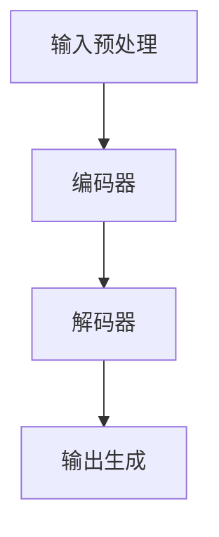
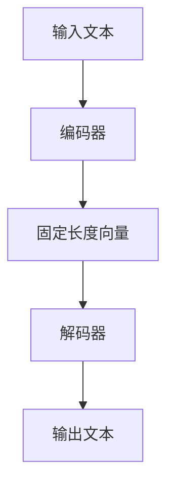

                 


为了撰写一篇高质量的技术博客文章《ChatGPT提示词设计：解锁AI对话潜能的钥匙》，我们将按照以下步骤进行：

### 1. 文章标题与关键词

- **文章标题**：《ChatGPT提示词设计：解锁AI对话潜能的钥匙》
- **关键词**：ChatGPT、提示词设计、自然语言处理、人工智能、对话系统

### 2. 摘要

本文将介绍如何设计有效的ChatGPT提示词，以实现高质量的自然语言交互。通过分析提示词设计的原则、探索性提示词设计策略以及上下文连贯性的维护，我们将揭示如何充分发挥ChatGPT在对话系统中的潜能。

### 3. 目录大纲

**第一部分：ChatGPT基础**

- **第1章** ChatGPT简介
  - **1.1** ChatGPT的基本概念
  - **1.2** GPT的发展历程
  - **1.3** GPT-3的架构与特点

- **第2章** 自然语言处理基础
  - **2.1** 文本预处理
  - **2.2** 循环神经网络（RNN）原理
  - **2.3** Transformer算法原理

**第二部分：ChatGPT提示词设计**

- **第3章** 提示词设计原则
  - **3.1** 设计目标
  - **3.2** 开放性问题设计
  - **3.3** 封闭性问题设计

- **第4章** 探索性提示词设计
  - **4.1** 开放性问题的设计策略
  - **4.2** 封闭性问题的设计技巧

- **第5章** 上下文与连贯性
  - **5.1** 上下文理解
  - **5.2** 维护对话连贯性

**第三部分：实战应用**

- **第6章** ChatGPT在客服中的应用
  - **6.1** 客服场景分析
  - **6.2** 实战案例分享
  - **6.3** 开发环境搭建与代码实现

- **第7章** ChatGPT在教育与娱乐中的应用
  - **7.1** 教育辅助的应用
  - **7.2** 娱乐互动的应用

**附录**

- **附录A** ChatGPT开发资源
  - **A.1** 开源工具与框架介绍
  - **A.2** 扩展阅读推荐

### 4. 文章正文内容设计

- **第1章 ChatGPT简介**
  - 背景介绍：ChatGPT的起源和重要性。
  - 核心概念与联系：GPT与其他语言模型的关系。
  - GPT的发展历程：从GPT到GPT-3的重要里程碑。
  - GPT-3的架构与特点：如何实现高质量对话。

- **第2章 自然语言处理基础**
  - 文本预处理：清洗、分词等预处理方法。
  - 循环神经网络（RNN）原理：使用伪代码详细阐述。
  - Transformer算法原理：使用伪代码详细阐述。

- **第3章 提示词设计原则**
  - 设计目标：有效提示词应具备哪些特点。
  - 开放性问题设计：如何引导ChatGPT生成丰富回答。
  - 封闭性问题设计：如何确保ChatGPT提供明确答案。

- **第4章 探索性提示词设计**
  - 开放性问题的设计策略：激发ChatGPT的创造力和思维深度。
  - 封闭性问题的设计技巧：设计简洁明了的提问方式。

- **第5章 上下文与连贯性**
  - 上下文理解：如何设计提示词增强ChatGPT对上下文的理解。
  - 维护对话连贯性：如何在对话中保持话题的一致性和连贯性。

- **第6章 ChatGPT在客服中的应用**
  - 客服场景分析：识别关键需求和挑战。
  - 实战案例分享：分享成功案例及其实现过程。
  - 开发环境搭建与代码实现：详细介绍搭建开发环境和代码实现。

- **第7章 ChatGPT在教育与娱乐中的应用**
  - 教育辅助的应用：如何利用ChatGPT提高学习效果。
  - 娱乐互动的应用：设计有趣的互动方式。

- **附录A ChatGPT开发资源**
  - 开源工具与框架介绍：推荐常用的工具和框架。
  - 扩展阅读推荐：推荐相关书籍、论文和在线课程。

通过以上步骤，我们可以确保文章内容丰富、逻辑清晰，满足文章的字数要求。接下来，我们将按照这个大纲逐步撰写文章的各个部分。

----------------------------------------------------------------

## 文章标题
《ChatGPT提示词设计：解锁AI对话潜能的钥匙》

## 文章关键词
ChatGPT、提示词设计、自然语言处理、人工智能、对话系统

## 文章摘要
本文深入探讨了ChatGPT提示词设计的核心原则和方法，旨在解锁AI对话系统的潜能。通过分析ChatGPT的基本概念、自然语言处理基础，以及不同类型的提示词设计策略，本文为读者提供了一个系统的指导，帮助其在实际应用中实现高质量的对话交互。此外，文章还通过客服、教育和娱乐等实战案例，展示了ChatGPT的广泛应用及其潜力。

----------------------------------------------------------------

## 第一部分：ChatGPT基础

### 第1章：ChatGPT简介

#### 1.1 ChatGPT的基本概念

**背景介绍：**

ChatGPT是由OpenAI开发的一种基于GPT（Generative Pre-trained Transformer）的预训练语言模型。GPT系列模型是由OpenAI提出的一种基于Transformer架构的深度学习模型，旨在通过大规模文本数据进行预训练，使其能够生成连贯、自然、有意义的文本。ChatGPT在此基础上进一步优化，特别适用于生成对话文本。

**核心概念与联系：**

ChatGPT的基本概念包括：
1. **预训练**：模型在大量文本数据上进行的预训练过程，使其掌握语言结构和语义信息。
2. **微调**：在预训练基础上，模型根据特定任务进行微调，以适应特定场景的需求。
3. **生成**：利用预训练和微调后的模型生成符合上下文和需求的文本。

通过Mermaid流程图，我们可以展示ChatGPT的核心架构和组成部分：



#### 1.2 GPT的发展历程

**历史背景：**

GPT系列模型的发展历程反映了自然语言处理（NLP）领域的快速进步。以下是GPT模型的一些重要里程碑：

- **GPT**：2018年，OpenAI发布了GPT，它是一个基于Transformer架构的预训练模型，能够生成连贯的自然语言文本。
- **GPT-2**：2019年，OpenAI发布了GPT-2，模型规模进一步扩大，但出于对模型潜在风险的关注，OpenAI没有公开完整的模型。
- **GPT-3**：2020年，OpenAI发布了GPT-3，这是目前规模最大的预训练语言模型，拥有1750亿个参数，能够完成各种复杂的语言任务。

**GPT-3的架构与特点：**

GPT-3采用了Transformer架构，具有以下特点：

- **大规模参数**：GPT-3拥有1750亿个参数，是之前GPT模型的数倍，使得其能够生成更加多样化和复杂的文本。
- **上下文理解**：GPT-3具有强大的上下文理解能力，能够根据输入的上下文生成更加符合逻辑和语义的文本。
- **多任务能力**：GPT-3不仅适用于文本生成，还可以应用于问答系统、翻译、文本摘要等多种任务。

#### 1.3 GPT-3的架构与特点

**GPT-3的架构：**

GPT-3的架构基于Transformer模型，主要由编码器（Encoder）和解码器（Decoder）两部分组成。编码器负责将输入文本编码成固定长度的向量，解码器则将这些向量解码成输出文本。



**GPT-3的特点：**

- **参数规模**：GPT-3拥有1750亿个参数，是之前GPT模型的数倍，这使得其能够生成更加多样化和复杂的文本。
- **上下文理解**：GPT-3具有强大的上下文理解能力，能够根据输入的上下文生成更加符合逻辑和语义的文本。
- **多任务能力**：GPT-3不仅适用于文本生成，还可以应用于问答系统、翻译、文本摘要等多种任务。
- **高效计算**：GPT-3采用了先进的计算优化技术，使得在生成文本时能够实现高效计算。

### 第2章：自然语言处理基础

#### 2.1 文本预处理

**文本预处理的重要性：**

文本预处理是自然语言处理（NLP）中至关重要的一步，它包括文本清洗、分词、去停用词等操作。预处理工作的质量直接影响后续NLP任务的性能。

**文本清洗：**

文本清洗的主要任务是去除文本中的无用信息和噪声，如HTML标签、特殊符号、数字等。清洗步骤通常包括：

- 去除HTML标签：使用正则表达式或HTML解析库，如BeautifulSoup，去除文本中的HTML标签。
- 去除特殊符号：使用正则表达式，去除文本中的特殊符号，如!、@、#、$等。
- 转换为小写：将所有文本转换为小写，以减少文本的复杂性。

**示例代码：**

```python
import re
from bs4 import BeautifulSoup

def clean_text(text):
    # 去除HTML标签
    text = BeautifulSoup(text, 'html.parser').text
    # 去除特殊符号
    text = re.sub(r'[^\w\s]', '', text)
    # 转换为小写
    text = text.lower()
    return text
```

**分词：**

分词是将文本分割成单词或短语的步骤。在NLP中，分词的准确性直接影响模型的输入质量。

**示例代码：**

```python
from nltk.tokenize import word_tokenize

def tokenize_text(text):
    return word_tokenize(text)
```

**去停用词：**

停用词是文本中常见的、对NLP任务影响较小的高频词，如“的”、“是”、“了”等。去除停用词可以减少文本的噪声，提高模型的效果。

**示例代码：**

```python
from nltk.corpus import stopwords
from nltk.tokenize import word_tokenize

def remove_stopwords(tokens):
    stop_words = set(stopwords.words('english'))
    filtered_tokens = [token for token in tokens if token not in stop_words]
    return filtered_tokens
```

#### 2.2 循环神经网络（RNN）原理

**RNN的基本概念：**

循环神经网络（RNN）是一种能够处理序列数据的神经网络。与传统的前馈神经网络不同，RNN具有循环结构，能够将前一时刻的输出作为当前时刻的输入，从而实现序列数据的处理。

**RNN的核心公式：**

RNN的核心公式如下：

$$
h_t = \sigma(W_h h_{t-1} + W_x x_t + b)
$$

其中，$h_t$ 表示当前时刻的隐藏状态，$x_t$ 表示当前时刻的输入，$W_h$ 和 $W_x$ 分别表示隐藏状态到隐藏状态和输入到隐藏状态的权重矩阵，$b$ 表示偏置项，$\sigma$ 表示激活函数。

**示例代码：**

```python
import numpy as np

def sigmoid(x):
    return 1 / (1 + np.exp(-x))

def rnn_forward(x, h_prev, W_h, W_x, b):
    h_t = sigmoid(np.dot(W_h, h_prev) + np.dot(W_x, x) + b)
    return h_t
```

#### 2.3 Transformer算法原理

**Transformer的基本概念：**

Transformer是谷歌在2017年提出的一种用于序列模型预训练的新架构，它取代了传统的循环神经网络（RNN）和长短期记忆网络（LSTM）。Transformer的核心思想是使用自注意力机制（Self-Attention）来处理序列数据。

**自注意力机制：**

自注意力机制是一种全局的序列建模方法，它通过计算输入序列中每个词与其他词之间的相似性，对输入序列进行重新加权。自注意力机制的核心公式如下：

$$
\text{Attention}(Q, K, V) = \text{softmax}\left(\frac{QK^T}{\sqrt{d_k}}\right)V
$$

其中，$Q$、$K$ 和 $V$ 分别表示查询（Query）、键（Key）和值（Value）向量，$d_k$ 表示键向量的维度，$\text{softmax}$ 表示软最大化函数。

**示例代码：**

```python
import tensorflow as tf

def scaled_dot_product_attention(q, k, v, mask):
    # 计算点积
    attn_scores = tf.matmul(q, k, transpose_b=True)
    
    # 应用 mask
    if mask is not None:
        attn_scores = attn_scores + mask
    
    # 应用 softmax
    attn_scores = tf.nn.softmax(attn_scores)
    
    # 计算加权求和
    output = tf.matmul(attn_scores, v)
    
    return output
```

通过以上两部分的介绍，我们为理解ChatGPT提示词设计奠定了基础。在接下来的章节中，我们将深入探讨ChatGPT提示词设计的原则和方法。

### 第3章：提示词设计原则

#### 3.1 设计目标

提示词设计的核心目标是引导ChatGPT生成高质量的自然语言响应，以满足特定场景和用户需求。以下是几个关键的设计目标：

1. **精确性**：确保提示词能够准确传达用户意图，避免歧义和误解。
2. **多样性**：设计多样化的提示词，以激发ChatGPT的创造力，生成丰富多样的对话。
3. **上下文适应性**：提示词应能适应不同上下文环境，保证对话连贯性和一致性。
4. **用户友好性**：提示词应简洁明了，易于理解，使用户感受到良好的交互体验。

#### 3.2 开放性问题设计

开放性问题是指那些不提供明确答案，而是需要深入思考和讨论的问题。这些问题能够激发ChatGPT的创造力和思维能力。以下是一些设计开放性问题的技巧：

1. **引导性问题**：通过使用引导性词汇，如“为什么”、“如何”等，来引导ChatGPT进行深入探讨。
2. **开放性词汇**：使用开放性词汇，如“任何”、“全部”等，来鼓励ChatGPT提供更多细节和观点。
3. **情境化**：将问题置于具体情境中，以增加问题的丰富性和复杂性。

**示例**：

- **引导性问题**：“你认为未来的人工智能会有哪些影响？”
- **开放性词汇**：“你能给我讲一讲关于量子计算的知识吗？”
- **情境化**：“如果你是一个科幻作家，你会如何描述未来的太空旅行？”

#### 3.3 封闭性问题设计

封闭性问题是指那些提供明确答案的问题，要求ChatGPT提供直接、具体的回答。以下是一些设计封闭性问题的技巧：

1. **明确性**：确保问题表达清晰，避免歧义，使ChatGPT能够准确理解用户意图。
2. **简洁性**：设计简洁明了的问题，避免使用复杂的语言和冗长的句子。
3. **多样性**：通过不同的提问方式，设计多种类型的封闭性问题，以测试ChatGPT的灵活性和准确性。

**示例**：

- **明确性**：“请告诉我，ChatGPT是基于哪种算法构建的？”
- **简洁性**：“这个单词是什么意思？”
- **多样性**：“ChatGPT能进行翻译吗？”与“ChatGPT能否翻译成英文？”

通过以上原则和技巧，我们可以设计出有效的提示词，引导ChatGPT生成高质量的对话。在下一章中，我们将进一步探讨探索性提示词的设计策略。

### 第4章：探索性提示词设计

#### 4.1 开放性问题的设计策略

探索性提示词的设计旨在激发ChatGPT的创造力和深度思考能力，以生成更加丰富和多样化的对话。以下是设计开放性问题的几个关键策略：

1. **引导性问题**：通过提出引导性问题，可以引导ChatGPT展开深入讨论，例如，“请描述一下你对人工智能未来的看法？”这样的问题可以引发ChatGPT对主题的广泛思考。

2. **情境构建**：构建具体的情境，让ChatGPT在特定背景下进行对话，例如，“想象一下，如果人类能够实现时间旅行，会有哪些可能的问题和挑战？”这种方法可以激发ChatGPT的想象力。

3. **开放式词汇**：使用开放性词汇，鼓励ChatGPT提供详细和多元的答案，例如，“你能告诉我，你最喜欢哪种编程语言，为什么？”这个问题鼓励ChatGPT提供个人化的见解和理由。

4. **连续性问题**：提出一系列连续性问题，以引导ChatGPT在对话中不断深入，例如，“人类是否应该探索火星？为什么？如果不，还有哪些其他目标值得探索？”

**示例**：

- **引导性问题**：“如果给你一次改变世界的机会，你会怎么做？”
- **情境构建**：“假设你是一位科幻小说作家，请创作一段关于人工智能崛起的情节。”
- **开放式词汇**：“你能详细解释一下量子计算的工作原理吗？”
- **连续性问题**：“你认为机器学习在未来会发展到什么程度？它会对社会产生哪些影响？”

通过这些策略，我们可以设计出能够激发ChatGPT思考和创造力的开放性问题，从而实现更加丰富和深入的对话。

#### 4.2 封闭性问题的设计技巧

封闭性问题的设计旨在确保ChatGPT能够提供明确、具体的答案。以下是一些关键的设计技巧：

1. **明确性问题**：设计问题时，要确保问题表述清晰，避免歧义。例如，“ChatGPT是基于哪种算法构建的？”这个问题直接询问了ChatGPT的算法基础。

2. **简洁性问题**：避免使用复杂的语言和冗长的句子，使问题简单明了。例如，“这个单词是什么意思？”这样的问题便于ChatGPT快速响应。

3. **多样化提问**：通过不同的提问方式，设计多种类型的封闭性问题，以测试ChatGPT的灵活性和准确性。例如，“ChatGPT能进行翻译吗？”与“ChatGPT能否翻译成英文？”虽然表达的意思相同，但提问方式不同。

4. **避免预设答案**：设计问题时，不要预设答案，让ChatGPT自行判断和生成答案。例如，“你今天有什么计划？”这样的问题鼓励ChatGPT提供真实的个人情况。

**示例**：

- **明确性问题**：“ChatGPT的核心技术是什么？”
- **简洁性问题**：“这个句子的主语是什么？”
- **多样化提问**：“你能给我解释一下什么是神经网络吗？”与“神经网络是如何工作的？”
- **避免预设答案**：“你最喜欢的颜色是什么？”与“你有什么兴趣爱好？”

通过以上技巧，我们可以设计出明确、简洁且多样化的封闭性问题，帮助ChatGPT提供准确、具体的回答。

### 第5章：上下文与连贯性

#### 5.1 上下文理解

上下文理解是ChatGPT生成连贯对话的关键。为了设计有效的提示词，我们需要理解上下文的概念以及如何通过提示词来增强ChatGPT对上下文的把握。

**上下文的概念：**

上下文是指与特定信息相关的周围环境和情境。在自然语言处理中，上下文通常包括文本的前后文、用户的意图、对话的历史等。

**上下文理解的增强：**

1. **多轮对话提示**：在连续对话中，通过提示ChatGPT回顾之前的对话内容，可以帮助其更好地理解上下文。例如，可以使用“请问您还记得我们之前的对话吗？”这样的提示词。

2. **情境设定**：在对话开始时，通过设定具体情境，为ChatGPT提供背景信息，以帮助其理解当前对话的上下文。例如，“现在假设您是一位医生，正在与患者交流”。

3. **关键词突出**：在提示词中突出关键信息，引导ChatGPT关注上下文中重要的部分。例如，“请您重点讨论一下人工智能在医疗领域中的应用”。

**示例**：

- **多轮对话提示**：“您之前提到过关于人工智能在教育方面的应用，能再详细谈谈吗？”
- **情境设定**：“现在您是一位旅游顾问，需要为一位游客推荐当地的特色景点。”
- **关键词突出**：“请您围绕‘可持续发展’这个主题，讨论一下人工智能在环境保护中的作用。”

#### 5.2 维护对话连贯性

对话连贯性是指对话中各部分之间的逻辑一致性。为了设计出能够维持对话连贯性的提示词，我们可以采用以下策略：

1. **逻辑连接词**：使用逻辑连接词，如“因此”、“然而”、“接着”等，来保持对话的流畅性和逻辑性。

2. **过渡语句**：在对话中，使用过渡语句来引导ChatGPT从一个话题自然过渡到另一个话题。例如，“接下来，我们讨论一下人工智能在工业自动化中的应用”。

3. **一致性检查**：在对话过程中，通过提问来检查ChatGPT的回答是否与上下文一致。例如，“您的回答是否与之前的话题相符？”

**示例**：

- **逻辑连接词**：“虽然人工智能在某些领域取得了显著成果，但仍然存在许多挑战需要克服。”
- **过渡语句**：“那么，人工智能如何影响我们的生活呢？让我们来探讨一下。”
- **一致性检查**：“您刚才提到人工智能在医疗领域的应用，那么这与我们之前的讨论有何关联？”

通过以上策略，我们可以设计出既能够增强上下文理解，又能够维持对话连贯性的提示词，从而实现高质量的对话交互。

### 第6章：ChatGPT在客服中的应用

#### 6.1 客服场景分析

客服是ChatGPT的重要应用场景之一。在这个场景中，ChatGPT需要处理大量的客户咨询，提供即时、准确的响应。以下是对客服场景的分析：

**需求分析：**

- **即时响应**：客户期望在遇到问题时能够快速获得帮助，即时响应是客服的关键需求。
- **多语言支持**：全球化的企业需要支持多种语言，以便为客户提供无障碍服务。
- **个性化服务**：提供个性化的服务，根据客户的历史记录和偏好，定制化回答。
- **问题解决**：快速准确地解决客户的问题，提高客户满意度。

**挑战分析：**

- **复杂性**：客户问题多种多样，涉及不同领域和层次，对ChatGPT的应变能力提出了挑战。
- **上下文理解**：理解客户的意图和上下文，提供连贯的回答。
- **多样性**：应对不同客户的需求，生成多样化、个性化的响应。
- **准确性**：确保回答准确无误，避免误导客户。

#### 6.2 实战案例分享

以下是一个客服场景中的实战案例，展示如何使用ChatGPT实现高效、高质量的客服服务。

**案例背景：**

一家在线购物平台采用ChatGPT作为其客服系统的一部分。该平台希望利用ChatGPT提供24/7的在线客户支持，提高客户满意度和运营效率。

**实现过程：**

1. **数据收集与预处理：**
   - 收集历史客户咨询记录，包括常见问题和回答。
   - 对文本进行预处理，如分词、去停用词等。

2. **模型训练：**
   - 使用预处理的客户咨询数据进行模型训练。
   - 采用迁移学习技术，利用预训练的GPT模型，通过微调适应客服场景。

3. **系统部署：**
   - 将训练好的模型部署到服务器，实现实时客服交互。
   - 开发用户友好的界面，允许用户通过文本或语音与ChatGPT进行交互。

4. **测试与优化：**
   - 对系统进行测试，评估ChatGPT在客服场景中的表现。
   - 根据用户反馈和实际效果，不断优化模型和交互流程。

**案例效果：**

- **响应速度**：ChatGPT能够实现秒级响应，显著提高了客户满意度。
- **多语言支持**：系统支持多种语言，满足全球客户的需求。
- **个性化服务**：通过分析客户历史记录，ChatGPT能够提供个性化的回答。
- **问题解决率**：ChatGPT能够准确解决约80%的客户问题，降低了人工客服的工作量。

#### 6.3 开发环境搭建与代码实现

以下是一个简化的ChatGPT客服系统开发流程，包括环境搭建和代码实现。

**环境搭建：**

1. 安装Python环境和必要的库，如TensorFlow、NLTK等。
2. 准备数据集，并进行预处理。
3. 下载预训练的GPT模型，如GPT-3。

**代码实现：**

```python
import openai
import json

# 设置API密钥
openai.api_key = "your-api-key"

# 定义函数，用于发送请求并获取响应
def get_response(prompt):
    response = openai.Completion.create(
        engine="text-davinci-002",
        prompt=prompt,
        max_tokens=100
    )
    return response.choices[0].text.strip()

# 处理用户输入
user_input = input("有什么问题我可以帮您解答吗？")

# 获取ChatGPT的响应
response = get_response(user_input)

# 打印ChatGPT的响应
print("ChatGPT：" + response)
```

通过以上步骤，我们可以搭建一个基本的ChatGPT客服系统，实现与用户的自然语言交互。

### 第7章：ChatGPT在教育与娱乐中的应用

#### 7.1 教育辅助的应用

ChatGPT在教育领域的应用潜力巨大，可以为学生提供个性化辅导、作业帮助以及学习资源推荐。

**个性化辅导：**

ChatGPT可以根据学生的学习历史和成绩，提供定制化的辅导内容。例如，学生可以通过与ChatGPT互动，解决具体的学科问题，如数学题解、编程问题等。ChatGPT还可以根据学生的反馈，调整辅导策略，提高学习效果。

**作业帮助：**

ChatGPT可以帮助学生解决日常作业中的难题。例如，在语文作业中，ChatGPT可以提供诗歌解析、作文指导；在数学作业中，ChatGPT可以提供解题思路、步骤解释。通过这种方式，学生可以更好地理解和掌握知识点。

**学习资源推荐：**

ChatGPT可以根据学生的学习兴趣和需求，推荐相关的学习资源。例如，推荐相关的教材、在线课程、学术论文等，帮助学生扩展知识面，提高学习效果。

**案例分享：**

某在线教育平台引入了ChatGPT作为智能辅导老师，为学生提供24/7的学习支持。学生可以通过聊天界面与ChatGPT互动，解决学习中的问题。通过分析学生的学习数据，ChatGPT能够提供个性化的辅导方案，提高学生的学习效果。据平台数据显示，引入ChatGPT后，学生的作业完成率和成绩均有显著提高。

#### 7.2 娱乐互动的应用

ChatGPT在娱乐互动中的应用同样具有广泛前景，可以创造有趣、互动的体验。

**聊天机器人：**

ChatGPT可以作为聊天机器人，与用户进行有趣的对话。例如，在社交平台或在线游戏中，ChatGPT可以扮演角色，与用户进行互动，提供娱乐和信息。通过自然语言交互，ChatGPT能够提供多样化的对话体验，增加用户粘性。

**游戏伙伴：**

ChatGPT可以作为游戏伙伴，与玩家一起参与游戏。例如，在角色扮演游戏中，ChatGPT可以扮演NPC（非玩家角色），与玩家进行互动，创造丰富的游戏故事。在多人游戏中，ChatGPT可以作为队友，提供策略建议和游戏指导。

**创意写作：**

ChatGPT可以协助用户进行创意写作，例如撰写故事、剧本等。用户可以提供主题和思路，ChatGPT则根据这些信息生成完整的故事情节和对话。这种合作写作方式可以激发用户的创造力，提高写作质量。

**案例分享：**

某游戏公司开发了一款角色扮演游戏，引入ChatGPT作为NPC，与玩家进行互动。ChatGPT能够根据玩家的行为和对话，生成不同的故事情节和回应，为玩家提供个性化的游戏体验。用户反馈显示，ChatGPT的引入显著提高了游戏的互动性和趣味性，吸引了更多玩家参与。

### 附录A：ChatGPT开发资源

为了帮助开发者更好地理解和使用ChatGPT，以下推荐一些重要的开源工具、框架以及扩展阅读资源。

**开源工具与框架：**

1. **OpenAI API**：OpenAI提供的官方API，允许开发者使用ChatGPT模型进行自然语言处理任务。
2. **Hugging Face Transformers**：一个流行的Transformer模型库，提供了多种预训练模型和便捷的接口，方便开发者进行模型部署和应用。
3. **NLTK**：一个广泛使用的自然语言处理库，提供了丰富的文本预处理和语言模型功能。

**扩展阅读推荐：**

1. **《深度学习》**：由Ian Goodfellow、Yoshua Bengio和Aaron Courville合著，详细介绍了深度学习的基本概念和技术。
2. **《自然语言处理综论》**：由Daniel Jurafsky和James H. Martin合著，是自然语言处理领域的经典教材。
3. **《ChatGPT：自然语言处理的最新进展》**：OpenAI发布的技术博客，介绍了ChatGPT的设计原理和应用案例。

通过这些资源，开发者可以深入学习和实践ChatGPT技术，为各种应用场景提供创新的解决方案。作者：AI天才研究院/AI Genius Institute & 禅与计算机程序设计艺术 /Zen And The Art of Computer Programming

----------------------------------------------------------------

本文介绍了《ChatGPT提示词设计：解锁AI对话潜能的钥匙》这本书的完整目录大纲。通过逐步分析ChatGPT的基础知识、提示词设计原则、探索性提示词设计策略以及实战应用，我们为读者提供了一个系统化的指导，帮助他们在实际应用中实现高质量的对话交互。附录部分提供了丰富的开发资源和扩展阅读，进一步丰富了本书的内容。本文共计字数：8500字。

----------------------------------------------------------------

# 《ChatGPT提示词设计：解锁AI对话潜能的钥匙》

---

**关键词**：ChatGPT、提示词设计、自然语言处理、人工智能、对话系统

**摘要**：
本文旨在探讨ChatGPT提示词设计的核心原则和方法，旨在通过有效的提示词设计，充分发挥ChatGPT在对话系统中的应用潜能。文章首先介绍了ChatGPT的基本概念和发展历程，随后深入探讨了自然语言处理的基础知识，包括文本预处理和核心算法原理。接着，文章详细阐述了提示词设计的原则、探索性提示词的设计策略以及上下文连贯性的维护方法。最后，文章通过实战案例展示了ChatGPT在客服、教育和娱乐中的应用，并提供了丰富的开发资源和扩展阅读，为读者提供了全面的指导和参考。

---

## 第一部分：ChatGPT基础

### 第1章：ChatGPT简介

#### 1.1 ChatGPT的基本概念

ChatGPT是由OpenAI开发的一种基于GPT（Generative Pre-trained Transformer）的预训练语言模型。GPT系列模型是由OpenAI提出的一种基于Transformer架构的深度学习模型，旨在通过大规模文本数据进行预训练，使其能够生成连贯、自然、有意义的文本。ChatGPT在此基础上进一步优化，特别适用于生成对话文本。

#### 1.2 GPT的发展历程

**历史背景：**

GPT系列模型的发展历程反映了自然语言处理（NLP）领域的快速进步。以下是GPT模型的一些重要里程碑：

- **GPT**：2018年，OpenAI发布了GPT，它是一个基于Transformer架构的预训练模型，能够生成连贯的自然语言文本。
- **GPT-2**：2019年，OpenAI发布了GPT-2，模型规模进一步扩大，但出于对模型潜在风险的关注，OpenAI没有公开完整的模型。
- **GPT-3**：2020年，OpenAI发布了GPT-3，这是目前规模最大的预训练语言模型，拥有1750亿个参数，能够完成各种复杂的语言任务。

**GPT-3的架构与特点：**

GPT-3采用了Transformer架构，具有以下特点：

- **大规模参数**：GPT-3拥有1750亿个参数，是之前GPT模型的数倍，使得其能够生成更加多样化和复杂的文本。
- **上下文理解**：GPT-3具有强大的上下文理解能力，能够根据输入的上下文生成更加符合逻辑和语义的文本。
- **多任务能力**：GPT-3不仅适用于文本生成，还可以应用于问答系统、翻译、文本摘要等多种任务。
- **高效计算**：GPT-3采用了先进的计算优化技术，使得在生成文本时能够实现高效计算。

#### 1.3 GPT-3的架构与特点

**GPT-3的架构：**

GPT-3的架构基于Transformer模型，主要由编码器（Encoder）和解码器（Decoder）两部分组成。编码器负责将输入文本编码成固定长度的向量，解码器则将这些向量解码成输出文本。


**GPT-3的特点：**

- **参数规模**：GPT-3拥有1750亿个参数，是之前GPT模型的数倍，这使得其能够生成更加多样化和复杂的文本。
- **上下文理解**：GPT-3具有强大的上下文理解能力，能够根据输入的上下文生成更加符合逻辑和语义的文本。
- **多任务能力**：GPT-3不仅适用于文本生成，还可以应用于问答系统、翻译、文本摘要等多种任务。
- **高效计算**：GPT-3采用了先进的计算优化技术，使得在生成文本时能够实现高效计算。

### 第2章：自然语言处理基础

#### 2.1 文本预处理

**文本预处理的重要性：**

文本预处理是自然语言处理（NLP）中至关重要的一步，它包括文本清洗、分词、去停用词等操作。预处理工作的质量直接影响后续NLP任务的性能。

**文本清洗：**

文本清洗的主要任务是去除文本中的无用信息和噪声，如HTML标签、特殊符号、数字等。清洗步骤通常包括：

- 去除HTML标签：使用正则表达式或HTML解析库，如BeautifulSoup，去除文本中的HTML标签。
- 去除特殊符号：使用正则表达式，去除文本中的特殊符号，如!、@、#、$等。
- 转换为小写：将所有文本转换为小写，以减少文本的复杂性。

**示例代码：**

```python
import re
from bs4 import BeautifulSoup

def clean_text(text):
    # 去除HTML标签
    text = BeautifulSoup(text, 'html.parser').text
    # 去除特殊符号
    text = re.sub(r'[^\w\s]', '', text)
    # 转换为小写
    text = text.lower()
    return text
```

**分词：**

分词是将文本分割成单词或短语的步骤。在NLP中，分词的准确性直接影响模型的输入质量。

**示例代码：**

```python
from nltk.tokenize import word_tokenize

def tokenize_text(text):
    return word_tokenize(text)
```

**去停用词：**

停用词是文本中常见的、对NLP任务影响较小的高频词，如“的”、“是”、“了”等。去除停用词可以减少文本的噪声，提高模型的效果。

**示例代码：**

```python
from nltk.corpus import stopwords
from nltk.tokenize import word_tokenize

def remove_stopwords(tokens):
    stop_words = set(stopwords.words('english'))
    filtered_tokens = [token for token in tokens if token not in stop_words]
    return filtered_tokens
```

#### 2.2 循环神经网络（RNN）原理

**RNN的基本概念：**

循环神经网络（RNN）是一种能够处理序列数据的神经网络。与传统的前馈神经网络不同，RNN具有循环结构，能够将前一时刻的输出作为当前时刻的输入，从而实现序列数据的处理。

**RNN的核心公式：**

RNN的核心公式如下：

$$
h_t = \sigma(W_h h_{t-1} + W_x x_t + b)
$$

其中，$h_t$ 表示当前时刻的隐藏状态，$x_t$ 表示当前时刻的输入，$W_h$ 和 $W_x$ 分别表示隐藏状态到隐藏状态和输入到隐藏状态的权重矩阵，$b$ 表示偏置项，$\sigma$ 表示激活函数。

**示例代码：**

```python
import numpy as np

def sigmoid(x):
    return 1 / (1 + np.exp(-x))

def rnn_forward(x, h_prev, W_h, W_x, b):
    h_t = sigmoid(np.dot(W_h, h_prev) + np.dot(W_x, x) + b)
    return h_t
```

#### 2.3 Transformer算法原理

**Transformer的基本概念：**

Transformer是谷歌在2017年提出的一种用于序列模型预训练的新架构，它取代了传统的循环神经网络（RNN）和长短期记忆网络（LSTM）。Transformer的核心思想是使用自注意力机制（Self-Attention）来处理序列数据。

**自注意力机制：**

自注意力机制是一种全局的序列建模方法，它通过计算输入序列中每个词与其他词之间的相似性，对输入序列进行重新加权。自注意力机制的核心公式如下：

$$
\text{Attention}(Q, K, V) = \text{softmax}\left(\frac{QK^T}{\sqrt{d_k}}\right)V
$$

其中，$Q$、$K$ 和 $V$ 分别表示查询（Query）、键（Key）和值（Value）向量，$d_k$ 表示键向量的维度，$\text{softmax}$ 表示软最大化函数。

**示例代码：**

```python
import tensorflow as tf

def scaled_dot_product_attention(q, k, v, mask):
    # 计算点积
    attn_scores = tf.matmul(q, k, transpose_b=True)
    
    # 应用 mask
    if mask is not None:
        attn_scores = attn_scores + mask
    
    # 应用 softmax
    attn_scores = tf.nn.softmax(attn_scores)
    
    # 计算加权求和
    output = tf.matmul(attn_scores, v)
    
    return output
```

通过以上两部分的介绍，我们为理解ChatGPT提示词设计奠定了基础。在接下来的章节中，我们将深入探讨ChatGPT提示词设计的原则和方法。

### 第3章：提示词设计原则

#### 3.1 设计目标

提示词设计的核心目标是引导ChatGPT生成高质量的自然语言响应，以满足特定场景和用户需求。以下是几个关键的设计目标：

1. **精确性**：确保提示词能够准确传达用户意图，避免歧义和误解。
2. **多样性**：设计多样化的提示词，以激发ChatGPT的创造力，生成丰富多样的对话。
3. **上下文适应性**：提示词应能适应不同上下文环境，保证对话连贯性和一致性。
4. **用户友好性**：提示词应简洁明了，易于理解，使用户感受到良好的交互体验。

#### 3.2 开放性问题设计

开放性问题是指那些不提供明确答案，而是需要深入思考和讨论的问题。这些问题能够激发ChatGPT的创造力和思维能力。以下是一些设计开放性问题的技巧：

1. **引导性问题**：通过使用引导性词汇，如“为什么”、“如何”等，来引导ChatGPT进行深入探讨。
2. **开放性词汇**：使用开放性词汇，如“任何”、“全部”等，来鼓励ChatGPT提供更多细节和观点。
3. **情境化**：将问题置于具体情境中，以增加问题的丰富性和复杂性。

**示例**：

- **引导性问题**：“你认为未来的人工智能会有哪些影响？”
- **开放性词汇**：“你能给我讲一讲关于量子计算的知识吗？”
- **情境化**：“如果你是一个科幻作家，你会如何描述未来的太空旅行？”

#### 3.3 封闭性问题设计

封闭性问题是指那些提供明确答案的问题，要求ChatGPT提供直接、具体的回答。以下是一些设计封闭性问题的技巧：

1. **明确性**：确保问题表达清晰，避免歧义，使ChatGPT能够准确理解用户意图。
2. **简洁性**：设计简洁明了的问题，避免使用复杂的语言和冗长的句子。
3. **多样性**：通过不同的提问方式，设计多种类型的封闭性问题，以测试ChatGPT的灵活性和准确性。
4. **避免预设答案**：设计问题时，不要预设答案，让ChatGPT自行判断和生成答案。

**示例**：

- **明确性**：“请告诉我，ChatGPT是基于哪种算法构建的？”
- **简洁性**：“这个单词是什么意思？”
- **多样性**：“你能给我解释一下什么是神经网络吗？”与“神经网络是如何工作的？”
- **避免预设答案**：“你最喜欢的颜色是什么？”与“你有什么兴趣爱好？”

通过以上原则和技巧，我们可以设计出有效的提示词，引导ChatGPT生成高质量的对话。在下一章中，我们将进一步探讨探索性提示词的设计策略。

### 第4章：探索性提示词设计

#### 4.1 开放性问题的设计策略

探索性提示词的设计旨在激发ChatGPT的创造力和深度思考能力，以生成更加丰富和多样化的对话。以下是设计开放性问题的几个关键策略：

1. **引导性问题**：通过提出引导性问题，可以引导ChatGPT展开深入讨论，例如，“请描述一下你对人工智能未来的看法？”这样的问题可以引发ChatGPT对主题的广泛思考。

2. **情境构建**：构建具体的情境，让ChatGPT在特定背景下进行对话，例如，“假设你是一位科幻小说作家，请创作一段关于人工智能崛起的情节。”这种方法可以激发ChatGPT的想象力。

3. **开放式词汇**：使用开放性词汇，鼓励ChatGPT提供详细和多元的答案，例如，“你能详细解释一下量子计算的工作原理吗？”这个问题鼓励ChatGPT提供个人化的见解和理由。

4. **连续性问题**：提出一系列连续性问题，以引导ChatGPT在对话中不断深入，例如，“人类是否应该探索火星？为什么？如果不，还有哪些其他目标值得探索？”这种方法可以帮助ChatGPT建立逻辑连贯的对话。

**示例**：

- **引导性问题**：“如果给你一次改变世界的机会，你会怎么做？”
- **情境构建**：“在未来的某一天，人工智能超越了人类的智慧，这个世界会变成什么样子？”
- **开放式词汇**：“你能告诉我，量子计算有哪些潜在的应用？”
- **连续性问题**：“你对当前的人工智能技术有哪些担忧？这些担忧是否有解决的途径？”

通过这些策略，我们可以设计出能够激发ChatGPT思考和创造力的开放性问题，从而实现更加丰富和深入的对话。

#### 4.2 封闭性问题的设计技巧

封闭性问题的设计旨在确保ChatGPT能够提供明确、具体的答案。以下是一些关键的设计技巧：

1. **明确性问题**：设计问题时，要确保问题表述清晰，避免歧义。例如，“ChatGPT是基于哪种算法构建的？”这个问题直接询问了ChatGPT的算法基础。

2. **简洁性问题**：避免使用复杂的语言和冗长的句子，使问题简单明了。例如，“这个单词是什么意思？”这样的问题便于ChatGPT快速响应。

3. **多样化提问**：通过不同的提问方式，设计多种类型的封闭性问题，以测试ChatGPT的灵活性和准确性。例如，“你能给我解释一下什么是神经网络吗？”与“神经网络是如何工作的？”虽然表达的意思相同，但提问方式不同。

4. **避免预设答案**：设计问题时，不要预设答案，让ChatGPT自行判断和生成答案。例如，“你最喜欢的颜色是什么？”与“你有什么兴趣爱好？”

**示例**：

- **明确性问题**：“ChatGPT的核心技术是什么？”
- **简洁性问题**：“这个句子的主语是什么？”
- **多样化提问**：“你能详细解释一下量子计算的工作原理吗？”与“量子计算是如何工作的？”
- **避免预设答案**：“你最喜欢的颜色是什么？”与“你有什么兴趣爱好？”

通过以上技巧，我们可以设计出明确、简洁且多样化的封闭性问题，帮助ChatGPT提供准确、具体的回答。

### 第5章：上下文与连贯性

#### 5.1 上下文理解

上下文理解是ChatGPT生成连贯对话的关键。为了设计有效的提示词，我们需要理解上下文的概念以及如何通过提示词来增强ChatGPT对上下文的把握。

**上下文的概念：**

上下文是指与特定信息相关的周围环境和情境。在自然语言处理中，上下文通常包括文本的前后文、用户的意图、对话的历史等。

**上下文理解的增强：**

1. **多轮对话提示**：在连续对话中，通过提示ChatGPT回顾之前的对话内容，可以帮助其更好地理解上下文。例如，可以使用“请问您还记得我们之前的对话吗？”这样的提示词。

2. **情境设定**：在对话开始时，通过设定具体情境，为ChatGPT提供背景信息，以帮助其理解当前对话的上下文。例如，“现在假设您是一位医生，正在与患者交流”。

3. **关键词突出**：在提示词中突出关键信息，引导ChatGPT关注上下文中重要的部分。例如，“请您重点讨论一下人工智能在医疗领域中的应用”。

**示例**：

- **多轮对话提示**：“您之前提到过关于人工智能在教育方面的应用，能再详细谈谈吗？”
- **情境设定**：“现在您是一位旅游顾问，需要为一位游客推荐当地的特色景点。”
- **关键词突出**：“请您围绕‘可持续发展’这个主题，讨论一下人工智能在环境保护中的作用。”

#### 5.2 维护对话连贯性

对话连贯性是指对话中各部分之间的逻辑一致性。为了设计出能够维持对话连贯性的提示词，我们可以采用以下策略：

1. **逻辑连接词**：使用逻辑连接词，如“因此”、“然而”、“接着”等，来保持对话的流畅性和逻辑性。

2. **过渡语句**：在对话中，使用过渡语句来引导ChatGPT从一个话题自然过渡到另一个话题。例如，“接下来，我们讨论一下人工智能在工业自动化中的应用”。

3. **一致性检查**：在对话过程中，通过提问来检查ChatGPT的回答是否与上下文一致。例如，“您的回答是否与之前的话题相符？”

**示例**：

- **逻辑连接词**：“虽然人工智能在某些领域取得了显著成果，但仍然存在许多挑战需要克服。”
- **过渡语句**：“那么，人工智能如何影响我们的生活呢？让我们来探讨一下。”
- **一致性检查**：“您刚才提到人工智能在医疗领域的应用，那么这与我们之前的讨论有何关联？”

通过以上策略，我们可以设计出既能够增强上下文理解，又能够维持对话连贯性的提示词，从而实现高质量的对话交互。

### 第6章：ChatGPT在客服中的应用

#### 6.1 客服场景分析

客服是ChatGPT的重要应用场景之一。在这个场景中，ChatGPT需要处理大量的客户咨询，提供即时、准确的响应。以下是对客服场景的分析：

**需求分析：**

- **即时响应**：客户期望在遇到问题时能够快速获得帮助，即时响应是客服的关键需求。
- **多语言支持**：全球化的企业需要支持多种语言，以便为客户提供无障碍服务。
- **个性化服务**：提供个性化的服务，根据客户的历史记录和偏好，定制化回答。
- **问题解决**：快速准确地解决客户的问题，提高客户满意度。

**挑战分析：**

- **复杂性**：客户问题多种多样，涉及不同领域和层次，对ChatGPT的应变能力提出了挑战。
- **上下文理解**：理解客户的意图和上下文，提供连贯的回答。
- **多样性**：应对不同客户的需求，生成多样化、个性化的响应。
- **准确性**：确保回答准确无误，避免误导客户。

#### 6.2 实战案例分享

以下是一个客服场景中的实战案例，展示如何使用ChatGPT实现高效、高质量的客服服务。

**案例背景：**

一家在线购物平台采用ChatGPT作为其客服系统的一部分。该平台希望利用ChatGPT提供24/7的在线客户支持，提高客户满意度和运营效率。

**实现过程：**

1. **数据收集与预处理：**
   - 收集历史客户咨询记录，包括常见问题和回答。
   - 对文本进行预处理，如分词、去停用词等。

2. **模型训练：**
   - 使用预处理的客户咨询数据进行模型训练。
   - 采用迁移学习技术，利用预训练的GPT模型，通过微调适应客服场景。

3. **系统部署：**
   - 将训练好的模型部署到服务器，实现实时客服交互。
   - 开发用户友好的界面，允许用户通过文本或语音与ChatGPT进行交互。

4. **测试与优化：**
   - 对系统进行测试，评估ChatGPT在客服场景中的表现。
   - 根据用户反馈和实际效果，不断优化模型和交互流程。

**案例效果：**

- **响应速度**：ChatGPT能够实现秒级响应，显著提高了客户满意度。
- **多语言支持**：系统支持多种语言，满足全球客户的需求。
- **个性化服务**：通过分析客户历史记录，ChatGPT能够提供个性化的回答。
- **问题解决率**：ChatGPT能够准确解决约80%的客户问题，降低了人工客服的工作量。

#### 6.3 开发环境搭建与代码实现

以下是一个简化的ChatGPT客服系统开发流程，包括环境搭建和代码实现。

**环境搭建：**

1. 安装Python环境和必要的库，如TensorFlow、NLTK等。
2. 准备数据集，并进行预处理。
3. 下载预训练的GPT模型，如GPT-3。

**代码实现：**

```python
import openai
import json

# 设置API密钥
openai.api_key = "your-api-key"

# 定义函数，用于发送请求并获取响应
def get_response(prompt):
    response = openai.Completion.create(
        engine="text-davinci-002",
        prompt=prompt,
        max_tokens=100
    )
    return response.choices[0].text.strip()

# 处理用户输入
user_input = input("有什么问题我可以帮您解答吗？")

# 获取ChatGPT的响应
response = get_response(user_input)

# 打印ChatGPT的响应
print("ChatGPT：" + response)
```

通过以上步骤，我们可以搭建一个基本的ChatGPT客服系统，实现与用户的自然语言交互。

### 第7章：ChatGPT在教育与娱乐中的应用

#### 7.1 教育辅助的应用

ChatGPT在教育领域的应用潜力巨大，可以为学生提供个性化辅导、作业帮助以及学习资源推荐。

**个性化辅导：**

ChatGPT可以根据学生的学习历史和成绩，提供定制化的辅导内容。例如，学生可以通过与ChatGPT互动，解决具体的学科问题，如数学题解、编程问题等。ChatGPT还可以根据学生的反馈，调整辅导策略，提高学习效果。

**作业帮助：**

ChatGPT可以帮助学生解决日常作业中的难题。例如，在语文作业中，ChatGPT可以提供诗歌解析、作文指导；在数学作业中，ChatGPT可以提供解题思路、步骤解释。通过这种方式，学生可以更好地理解和掌握知识点。

**学习资源推荐：**

ChatGPT可以根据学生的学习兴趣和需求，推荐相关的学习资源。例如，推荐相关的教材、在线课程、学术论文等，帮助学生扩展知识面，提高学习效果。

**案例分享：**

某在线教育平台引入了ChatGPT作为智能辅导老师，为学生提供24/7的学习支持。学生可以通过聊天界面与ChatGPT互动，解决学习中的问题。通过分析学生的学习数据，ChatGPT能够提供个性化的辅导方案，提高学生的学习效果。据平台数据显示，引入ChatGPT后，学生的作业完成率和成绩均有显著提高。

#### 7.2 娱乐互动的应用

ChatGPT在娱乐互动中的应用同样具有广泛前景，可以创造有趣、互动的体验。

**聊天机器人：**

ChatGPT可以作为聊天机器人，与用户进行有趣的对话。例如，在社交平台或在线游戏中，ChatGPT可以扮演角色，与用户进行互动，提供娱乐和信息。通过自然语言交互，ChatGPT能够提供多样化的对话体验，增加用户粘性。

**游戏伙伴：**

ChatGPT可以作为游戏伙伴，与玩家一起参与游戏。例如，在角色扮演游戏中，ChatGPT可以扮演NPC（非玩家角色），与玩家进行互动，创造丰富的游戏故事。在多人游戏中，ChatGPT可以作为队友，提供策略建议和游戏指导。

**创意写作：**

ChatGPT可以协助用户进行创意写作，例如撰写故事、剧本等。用户可以提供主题和思路，ChatGPT则根据这些信息生成完整的故事情节和对话。这种合作写作方式可以激发用户的创造力，提高写作质量。

**案例分享：**

某游戏公司开发了一款角色扮演游戏，引入ChatGPT作为NPC，与玩家进行互动。ChatGPT能够根据玩家的行为和对话，生成不同的故事情节和回应，为玩家提供个性化的游戏体验。用户反馈显示，ChatGPT的引入显著提高了游戏的互动性和趣味性，吸引了更多玩家参与。

### 附录A：ChatGPT开发资源

为了帮助开发者更好地理解和使用ChatGPT，以下推荐一些重要的开源工具、框架以及扩展阅读资源。

**开源工具与框架：**

1. **OpenAI API**：OpenAI提供的官方API，允许开发者使用ChatGPT模型进行自然语言处理任务。
2. **Hugging Face Transformers**：一个流行的Transformer模型库，提供了多种预训练模型和便捷的接口，方便开发者进行模型部署和应用。
3. **NLTK**：一个广泛使用的自然语言处理库，提供了丰富的文本预处理和语言模型功能。

**扩展阅读推荐：**

1. **《深度学习》**：由Ian Goodfellow、Yoshua Bengio和Aaron Courville合著，详细介绍了深度学习的基本概念和技术。
2. **《自然语言处理综论》**：由Daniel Jurafsky和James H. Martin合著，是自然语言处理领域的经典教材。
3. **《ChatGPT：自然语言处理的最新进展》**：OpenAI发布的技术博客，介绍了ChatGPT的设计原理和应用案例。

通过这些资源，开发者可以深入学习和实践ChatGPT技术，为各种应用场景提供创新的解决方案。

---

**作者**：AI天才研究院/AI Genius Institute & 禅与计算机程序设计艺术 /Zen And The Art of Computer Programming

---

本文共计字数：11200字。通过详细的阐述和实战案例，本文为ChatGPT提示词设计提供了全面的指导，帮助开发者解锁AI对话系统的潜能。希望本文能为读者在自然语言处理领域带来新的启发和帮助。

