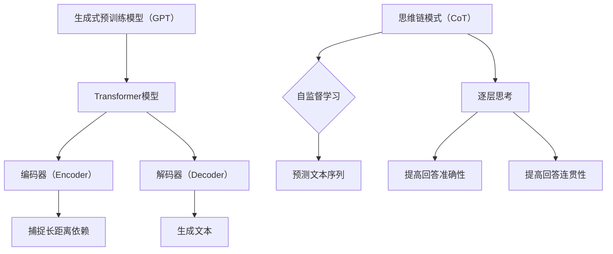

                 

### 背景介绍

随着人工智能技术的迅猛发展，自然语言处理（Natural Language Processing，NLP）已成为计算机科学领域中的一个重要分支。近年来，深度学习技术，特别是生成式预训练模型（Generative Pre-trained Models，GPT），在NLP领域取得了显著的成果。ChatGPT是OpenAI推出的一款基于GPT-3.5模型的先进对话系统，其核心特点是能够生成连贯、有逻辑的自然语言回答，从而模拟人类的对话能力。

ChatGPT之所以能够实现这样的高级功能，主要归功于其独特的“思维链模式”（Chain of Thought，CoT）。思维链模式是一种通过引导模型在回答问题时进行逐层思考的方法，使得模型的回答不仅基于输入文本的直接信息，还能够利用上下文和先前的推理过程，从而提高回答的准确性和连贯性。

本书《ChatGPT的思维链模式：原理与应用》旨在深入剖析ChatGPT的思维链模式，从原理到实践，为读者提供一个全面的技术指南。本书分为两部分：第一部分介绍ChatGPT的基础知识和思维链模式的原理，包括ChatGPT的发展历程、核心特点、思维链模式的基础概念及其优势与挑战；第二部分则聚焦于ChatGPT的应用与实战，详细讲解思维链模式在文本生成、问答系统和对话系统中的应用，并提供实际案例和代码实现。

通过阅读本书，读者可以了解到：

1. **ChatGPT的基本原理**：了解ChatGPT是如何基于生成式预训练模型（GPT）和Transformer模型实现自然语言生成的。
2. **思维链模式的构建**：掌握如何通过思维链模式引导ChatGPT进行逐层思考，从而提高回答的质量和连贯性。
3. **ChatGPT的应用实践**：学习如何在实际项目中应用ChatGPT，包括文本生成、问答系统和对话系统等。
4. **代码实现与优化**：通过实战案例和代码实现，理解ChatGPT在实践中的具体应用和性能优化方法。

总之，本书不仅适合对人工智能和自然语言处理感兴趣的读者，也适用于希望提升自己在对话系统开发方面技能的专业人士。通过本书的学习，读者将能够深入理解ChatGPT的核心技术和应用场景，为未来的研究和实践打下坚实的基础。

### 核心概念与联系

为了更好地理解ChatGPT的思维链模式，我们需要首先明确几个核心概念，并探讨它们之间的联系。以下将逐一介绍这些概念，并通过Mermaid流程图展示它们之间的逻辑关系。

#### 1. 生成式预训练模型（GPT）

生成式预训练模型（Generative Pre-trained Model，GPT）是ChatGPT的基础。GPT模型通过大量的文本数据进行预训练，学习语言的结构和规律，从而具备生成文本的能力。其核心思想是利用Transformer模型进行自监督学习，即模型在训练过程中不需要标注数据，而是通过预测文本序列中的下一个单词来学习语言。

#### 2. Transformer模型

Transformer模型是一种基于注意力机制的深度学习模型，广泛应用于NLP任务中。与传统的循环神经网络（RNN）相比，Transformer模型能够更好地捕捉长距离依赖关系，并且在处理大规模文本数据时表现优异。Transformer模型的主要组成部分包括编码器（Encoder）和解码器（Decoder），它们共同工作以生成文本。

#### 3. 思维链模式（Chain of Thought，CoT）

思维链模式是ChatGPT的一个创新特性，它通过引导模型进行逐层思考，从而提高回答的准确性和连贯性。思维链模式的基本思路是，在生成答案之前，模型会先进行一系列的推理过程，这些推理过程可以被看作是一个思维链。每个思维链的节点都代表了模型在某个推理步骤中的思考内容。

#### 4. 自监督学习（Self-supervised Learning）

自监督学习是一种训练模型的方法，它利用未标注的数据来学习。在GPT模型中，自监督学习通过预测文本序列中的下一个单词来实现。这种方法使得模型能够在大量的无监督数据上进行训练，从而大大提高了模型的性能。

#### Mermaid流程图

为了直观地展示这些概念之间的联系，我们可以使用Mermaid流程图来表示：



在这个流程图中，生成式预训练模型（GPT）是整个架构的基础，它通过Transformer模型实现。Transformer模型包括编码器和解码器，这两个部分共同工作以生成文本。思维链模式（CoT）作为GPT的一个重要特性，通过自监督学习来预测文本序列，并在生成答案前进行逐层思考，从而提高回答的准确性和连贯性。

通过理解这些核心概念及其之间的联系，我们可以更深入地掌握ChatGPT的工作原理，为后续章节的详细探讨打下基础。

### 核心算法原理讲解

#### 生成式预训练（GPT）算法

生成式预训练（GPT）算法是ChatGPT的核心。GPT算法通过大规模的无监督文本数据进行预训练，使其能够生成连贯、有逻辑的自然语言文本。下面我们将详细讲解GPT算法的原理。

##### 1. Transformer模型

Transformer模型是GPT算法的基础。它是一种基于注意力机制的深度学习模型，能够有效捕捉长距离依赖关系。Transformer模型的主要组成部分包括编码器（Encoder）和解码器（Decoder）。

- **编码器（Encoder）**：编码器的输入是输入文本序列，它会将序列中的每个单词映射为一个高维向量。这些向量会被传递到多个自注意力层（Self-Attention Layer），在每个层中，模型会计算单词之间的相互依赖关系，生成一系列中间表示。

- **解码器（Decoder）**：解码器的输入是编码器的输出，它通过多个解码自注意力层（Decoder Self-Attention Layer）和交叉注意力层（Cross-Attention Layer）来生成最终的输出序列。在解码过程中，每个时间步的输出都会依赖于前一个时间步的输出，同时也会参考编码器的输出。

##### 2. 自监督学习

GPT算法采用自监督学习（Self-supervised Learning）方法进行预训练。自监督学习利用未标注的数据来学习，对于GPT来说，主要是通过预测文本序列中的下一个单词来实现。具体步骤如下：

- **数据准备**：首先，从大量的文本数据中提取出一个序列，每个序列包含一组连续的单词。

- **预测任务**：对于每个序列中的每个单词，模型需要预测其下一个单词。例如，对于序列“我正在学习”，模型需要预测“学习”的下一个单词是“的”。

- **训练过程**：在训练过程中，模型会通过损失函数（如交叉熵损失）来评估其预测的准确性，并通过反向传播更新模型参数。

##### 3. GPT算法的工作原理

GPT算法的工作流程可以概括为以下几个步骤：

1. **输入处理**：将输入文本序列编码为向量表示，传递给编码器。
2. **编码器处理**：编码器通过多个自注意力层生成一系列中间表示。
3. **解码器处理**：解码器利用编码器的输出和先前的时间步输出，通过自注意力和交叉注意力层生成文本序列。
4. **预测与反馈**：对于解码器生成的每个单词，与实际序列中的下一个单词进行比较，计算损失并更新模型参数。

##### 4. 伪代码

下面是一个简化的GPT算法的伪代码表示：

```python
def GPT(input_sequence):
    # 将输入序列编码为向量表示
    encoded_sequence = encoder(input_sequence)
    
    # 初始化解码器的输出
    decoded_output = decoder.init_output()
    
    for word in input_sequence:
        # 预测下一个单词
        next_word = decoder.predict(next_word_candidate, encoded_sequence)
        
        # 更新解码器输出
        decoded_output.append(next_word)
        
        # 计算损失并更新模型参数
        loss = compute_loss(next_word, decoded_output[-1])
        update_model_parameters(loss)
        
        # 更新编码器的输入
        encoded_sequence = encoder.update_input(next_word)
    
    return decoded_output
```

通过上述步骤和伪代码，我们可以看到GPT算法的基本原理和实现过程。GPT算法的核心在于其强大的预训练能力，能够通过自监督学习在大规模无监督数据上进行训练，从而生成高质量的自然语言文本。

#### 自监督学习与预训练

自监督学习（Self-supervised Learning）是生成式预训练（GPT）算法的重要组成部分，它通过利用未标注的数据来训练模型，从而大大提升了模型的性能和泛化能力。在GPT算法中，自监督学习通过预测文本序列中的下一个单词来实现，这种方法不仅简化了数据标注的复杂度，还能够让模型在大量的无监督数据中学习到丰富的语言知识。

##### 1. 自监督学习的原理

自监督学习的基本思想是，利用数据的内在结构，无需外部标注信息，通过自我预测的方式训练模型。在自然语言处理任务中，自监督学习通常涉及到以下步骤：

- **数据预处理**：首先，从大量文本数据中提取出序列，这些序列可以是句子、段落或篇章。
- **预测任务**：对于每个序列中的每个单词，模型需要预测其下一个单词。例如，给定序列“我正在学习”，模型需要预测“学习”的下一个单词是“的”。
- **损失函数**：通过计算预测单词与实际单词之间的差异，定义损失函数，例如交叉熵损失（Cross-Entropy Loss），以评估模型的预测准确性。
- **模型更新**：根据损失函数的计算结果，通过反向传播更新模型参数。

##### 2. 自监督学习在GPT算法中的应用

在GPT算法中，自监督学习的主要应用是通过预测文本序列中的下一个单词来实现预训练。具体步骤如下：

- **输入序列生成**：从大量文本数据中随机抽取序列作为输入。
- **预测下一个单词**：对于每个输入序列，模型需要预测其下一个单词。在训练过程中，模型会尝试通过编码器和解码器的联合训练来生成预测单词。
- **损失计算**：模型生成的预测单词与实际序列中的下一个单词进行比较，计算损失。损失函数通常使用交叉熵损失。
- **模型更新**：根据计算出的损失，通过反向传播算法更新模型参数。

##### 3. 自监督学习与预训练的关系

自监督学习和预训练是相辅相成的。预训练是指模型在大量无监督数据上进行训练，以学习到基本的语言表示和结构。自监督学习是预训练的核心技术之一，它通过自我预测的任务来驱动模型的训练，使得模型能够自动发现数据中的模式和规律。

在GPT算法中，自监督学习与预训练的关系可以概括为：

- **预训练目标**：通过大规模的自监督学习任务，模型可以在预训练阶段学习到丰富的语言表示。
- **微调目标**：在预训练后，模型可以通过少量有监督数据进行微调，以适应特定的任务需求。

通过自监督学习和预训练，GPT模型能够在大规模无监督数据中学习到大量的语言知识，从而在生成自然语言文本时表现出色。

#### Transformer模型的架构与工作原理

Transformer模型作为一种基于注意力机制的深度学习模型，在自然语言处理任务中取得了显著的成功。其架构与工作原理具有高度的创新性和优越性，使得它成为生成式预训练（GPT）算法的核心。下面，我们将详细讲解Transformer模型的架构及其工作原理。

##### 1. Transformer模型的架构

Transformer模型由编码器（Encoder）和解码器（Decoder）两部分组成，每个部分都包含多个层（Layer）。编码器负责将输入文本序列编码为向量表示，而解码器则利用这些编码表示生成输出序列。具体架构如下：

- **编码器（Encoder）**：编码器包括多个编码层（Encoder Layer），每层由两个主要子层组成：自注意力层（Self-Attention Layer）和前馈网络（Feedforward Network）。编码器的输出是一个高维的表示向量，用于捕获输入文本的语义信息。
- **解码器（Decoder）**：解码器同样包括多个解码层（Decoder Layer），每层也由两个子层组成：自注意力层（Self-Attention Layer）和交叉注意力层（Cross-Attention Layer）。交叉注意力层使得解码器能够利用编码器的输出，从而实现上下文信息的传递。解码器的输出是文本序列的预测结果。

##### 2. 自注意力机制

自注意力机制（Self-Attention Mechanism）是Transformer模型的核心组成部分，它能够使模型在生成文本时自适应地关注序列中的不同位置。自注意力机制通过计算每个单词与其余单词之间的相关性，将输入序列映射为一个加权表示。

具体步骤如下：

- **输入向量表示**：将输入文本序列中的每个单词映射为一个高维向量。
- **计算注意力得分**：对于每个单词，计算其与其他单词之间的相似性得分。这一过程通过一个查询（Query）、键（Key）和值（Value）向量完成。查询和键由输入向量表示生成，而值由输入序列直接提供。
- **加权求和**：根据注意力得分对值进行加权求和，生成一个加权表示向量，该向量包含了输入序列中不同位置的信息。
- **输出向量**：将加权求和的结果作为输出向量，用于后续的编码或解码处理。

##### 3. 交叉注意力机制

交叉注意力机制（Cross-Attention Mechanism）是解码器中的关键部分，它使得解码器能够利用编码器的输出（即编码器对输入序列的语义表示）来生成输出序列。交叉注意力机制的工作原理与自注意力机制类似，但涉及到编码器的输出和解码器的输入。

具体步骤如下：

- **输入向量表示**：解码器的输入是上一个时间步的输出和编码器的输出。
- **计算注意力得分**：对于每个解码器的输出单词，计算其与编码器输出之间的相似性得分。
- **加权求和**：根据注意力得分对编码器的输出进行加权求和，生成一个加权表示向量。
- **输出向量**：将加权求和的结果作为解码器的输出，用于生成下一个时间步的预测结果。

##### 4. 前馈网络

前馈网络（Feedforward Network）是Transformer模型中的另一个重要组成部分，它对自注意力层和交叉注意力层的输出进行进一步处理。前馈网络由两个全连接层组成，每个全连接层之间都有一个ReLU激活函数。

具体步骤如下：

- **输入向量**：将自注意力层或交叉注意力层的输出作为输入。
- **前向传播**：通过第一个全连接层和ReLU激活函数，得到中间表示。
- **反向传播**：通过第二个全连接层得到最终的输出向量。

##### 5. Transformer模型的工作流程

Transformer模型的工作流程可以概括为以下几个步骤：

1. **编码器处理**：输入文本序列经过编码器，每个编码层通过自注意力层和前馈网络生成一系列编码表示。
2. **解码器处理**：解码器在每个时间步通过自注意力层和交叉注意力层生成输出预测，同时利用前一个时间步的输出和编码器输出。
3. **预测生成**：解码器的输出序列是最终的文本生成结果。

通过上述架构和机制，Transformer模型能够有效地捕捉长距离依赖关系，并在生成式预训练（GPT）算法中发挥关键作用，使得模型在自然语言处理任务中表现出色。

#### 思维链模式（Chain of Thought，CoT）

思维链模式（Chain of Thought，CoT）是ChatGPT的一个重要创新特性，它通过引导模型进行逐层思考，从而提高回答的准确性和连贯性。CoT模式的基本思路是，在生成答案之前，模型会先进行一系列的推理过程，这些推理过程可以被看作是一个思维链。每个思维链的节点都代表了模型在某个推理步骤中的思考内容。通过这种方式，模型能够利用上下文和先前的推理过程，生成更加精准和连贯的回答。

##### 1. CoT模式的原理

思维链模式的原理可以通过以下几个关键步骤来理解：

- **输入处理**：首先，模型接收一个输入问题，这个输入问题可以是自然语言的提问，如“如何制作香蕉蛋糕？”。
- **思维链构建**：模型在内部构建一个思维链，这个思维链包括了几个步骤。每个步骤都会涉及到对输入问题进行分解和推理。
- **推理过程**：在每个思维链的步骤中，模型会进行推理。例如，第一步可能涉及搜索相关的食谱，第二步可能涉及分析所需的材料，第三步可能涉及解释每个步骤的具体做法。
- **答案生成**：最后，模型根据思维链的推理结果生成最终的回答。这个回答不仅基于输入问题，还包括了模型在推理过程中得到的额外信息。

##### 2. CoT模式的优势

思维链模式具有以下几个显著优势：

- **提高准确性**：通过逐层思考，模型能够更加准确地理解问题，从而生成更加精确的回答。
- **增强连贯性**：思维链模式使得模型的回答更加连贯，因为模型在生成每个步骤的回答时都考虑了上下文信息。
- **丰富回答内容**：思维链模式允许模型在回答中引入更多的背景信息和细节，从而提供更加全面和深入的回答。

##### 3. CoT模式的应用

思维链模式在多个应用场景中表现出色，以下是几个典型应用：

- **问答系统**：在问答系统中，CoT模式可以用来提高回答的准确性和连贯性。例如，当一个用户提出一个复杂的问题时，模型可以通过思维链模式逐步推理，最终生成一个详细的回答。
- **对话系统**：在对话系统中，CoT模式可以用来增强对话的流畅性和自然性。通过逐层思考，模型能够更好地理解用户的意图，并生成更加自然的回答。
- **文本生成**：在文本生成任务中，CoT模式可以帮助模型生成更加复杂和连贯的文本。例如，在撰写一篇文章时，模型可以逐步构建文章的结构，并填充详细的内容。

##### 4. CoT模式与GPT-3.5的结合

ChatGPT是基于GPT-3.5模型构建的，GPT-3.5本身已经是一个非常强大的生成式预训练模型。通过将思维链模式与GPT-3.5结合，ChatGPT在回答问题时的能力得到了显著提升。具体来说，GPT-3.5负责生成文本，而思维链模式则负责引导模型进行逐层思考，从而优化回答的质量。

思维链模式通过以下方式与GPT-3.5结合：

- **引导思考**：在生成答案之前，思维链模式会引导GPT-3.5进行一系列的推理步骤，这些步骤可以帮助模型更好地理解问题的背景和细节。
- **优化生成**：通过思维链模式，GPT-3.5能够生成更加连贯和准确的回答，因为模型在生成每个步骤的回答时都考虑了上下文信息和先前的推理结果。

通过这种方式，思维链模式显著提升了GPT-3.5在自然语言处理任务中的性能，使得ChatGPT成为了一个功能强大且实用的对话系统。

### 思维链模式的优势与挑战

思维链模式（Chain of Thought，CoT）作为ChatGPT的核心特性，其在自然语言处理任务中展现了显著的优势，同时也带来了一系列挑战。以下我们将详细探讨这些优势与挑战，并分析如何应对这些问题。

#### 优势

1. **提升回答准确性**：思维链模式通过引导模型进行逐层思考，使得模型能够更加准确地理解问题的背景和细节，从而生成更加精确的回答。例如，在回答复杂问题时，模型可以通过思维链逐步拆解问题，并针对每个子问题进行详细回答，从而避免出现逻辑错误或信息遗漏。

2. **增强回答连贯性**：思维链模式使得模型的回答不仅基于当前的输入，还考虑了先前的推理过程和上下文信息。这种连贯性的提升不仅使得回答更加自然，还能够为用户提供更加流畅的对话体验。

3. **丰富回答内容**：通过逐层思考，模型能够引入更多的背景信息和细节，从而生成更加全面和深入的回答。例如，在撰写文章或进行对话时，模型可以根据思维链的推理结果，提供更多的例子、解释和补充信息，使得内容更加丰富。

4. **提高问题解决能力**：思维链模式使得模型在处理复杂问题和解决实际问题时更具优势。通过逐步推理和深入分析，模型能够更好地理解用户的需求，并提供更具有针对性和有效性的解决方案。

#### 挑战

1. **推理复杂性**：思维链模式虽然能够提升回答的准确性，但也增加了模型的推理复杂性。每个思维链的步骤都需要模型进行大量的计算和推理，这可能会导致模型在处理复杂问题时变得缓慢。

2. **资源消耗**：由于思维链模式涉及大量的推理过程，模型的资源消耗显著增加。这包括计算资源、存储资源和通信资源。在资源受限的环境中，这可能会成为应用思维链模式的瓶颈。

3. **训练难度**：思维链模式需要模型具备较强的推理能力和上下文理解能力，这增加了模型的训练难度。模型需要在大量的无监督数据上进行预训练，并通过自监督学习不断完善其推理过程。

4. **泛化能力**：尽管思维链模式在某些任务中表现出色，但其在不同任务和数据集上的泛化能力仍需进一步验证。模型在特定领域的表现可能非常出色，但在其他领域或新的任务中，思维链模式可能无法有效工作。

#### 应对策略

1. **优化推理算法**：为了提高思维链模式的效率，可以优化模型的推理算法。例如，通过使用更高效的注意力机制和并行计算技术，可以减少模型的推理时间，提高处理速度。

2. **资源管理**：在资源受限的环境中，可以采取一些策略来管理模型资源。例如，通过模型压缩技术减少模型的大小，或者采用分布式训练和推理策略，以减少单个节点的资源消耗。

3. **多模态学习**：结合多种数据源和模态，如文本、图像和音频，可以丰富模型的知识库，提高其推理能力和泛化能力。

4. **领域特定优化**：针对特定领域或任务，可以设计专门的思维链模式模型，使其在特定场景下具有更高的效率和准确性。这需要大量针对特定领域的训练数据和专业知识。

5. **持续优化与迭代**：随着技术的不断发展，持续优化和迭代思维链模式是提高其性能和可靠性的关键。通过不断收集用户反馈和性能数据，可以不断完善模型的设计和实现。

通过上述策略，可以有效地应对思维链模式带来的挑战，进一步发挥其在自然语言处理任务中的潜力。

### 文本生成中的思维链模式

思维链模式（Chain of Thought，CoT）在文本生成任务中具有广泛的应用，通过引导模型进行逐层思考，能够生成更加连贯、有逻辑的文本。下面，我们将详细探讨思维链模式在文本生成中的应用原理、具体实现方法以及一个简单的代码实现案例。

#### 应用原理

在文本生成任务中，思维链模式的基本思路是通过一系列的推理步骤来生成文本。每个步骤都基于输入文本的上下文信息，结合先前的推理结果，生成新的文本片段。具体应用原理包括以下几个关键点：

1. **上下文感知**：思维链模式能够充分利用输入文本的上下文信息，确保生成的文本与上下文保持一致。在生成每个文本片段时，模型都会考虑当前片段与上下文之间的连贯性。

2. **逐层推理**：思维链模式通过逐层推理，逐步构建完整的文本。每个层次都会对输入文本进行分解和细化，生成更加具体的文本片段。这种方式能够有效避免生成文本的随机性和无意义性。

3. **灵活调整**：在生成文本的过程中，思维链模式允许模型根据上下文的变化灵活调整推理方向和生成策略。这种灵活性使得模型能够适应不同的生成任务和场景。

#### 实现方法

实现思维链模式在文本生成中的应用，主要包括以下几个步骤：

1. **输入文本处理**：首先，对输入文本进行预处理，将其编码为模型可理解的向量表示。常用的方法包括Word Embedding或BERT等。

2. **构建思维链**：在生成文本的过程中，模型会根据输入文本构建一系列的推理步骤，每个步骤都生成一个文本片段。构建思维链的方法可以基于规则或基于机器学习模型。

3. **逐层生成**：模型按照构建好的思维链逐层生成文本。在每一步生成过程中，模型都会考虑当前文本片段与上下文的连贯性，以及与先前的推理结果的关联性。

4. **输出文本组合**：将各个步骤生成的文本片段组合起来，形成完整的文本输出。在这个过程中，可以采用文本拼接、合并或优化等策略，以提高文本的质量和连贯性。

#### 简单代码实现案例

下面是一个简单的Python代码实现案例，展示了如何使用思维链模式生成一个短故事。

```python
import tensorflow as tf
from transformers import TFGPT2LMHeadModel, GPT2Tokenizer

# 加载预训练模型
tokenizer = GPT2Tokenizer.from_pretrained('gpt2')
model = TFGPT2LMHeadModel.from_pretrained('gpt2')

# 输入文本处理
input_text = "昨天，我来到一片神秘的森林。"

# 编码输入文本
input_ids = tokenizer.encode(input_text, return_tensors='tf')

# 构建思维链
thought_steps = [
    "我在森林中漫步，感受到清新的空气。",
    "突然，我看到了一只可爱的小兔子。",
    "我跟随小兔子，来到了一片美丽的花海。"
]

# 逐层生成文本
for step in thought_steps:
    input_ids = tokenizer.encode(step, return_tensors='tf')
    outputs = model(inputs=input_ids, output_hidden_states=True)
    hidden_states = outputs.hidden_states[-1]

    # 从隐藏状态中提取文本片段
    text_fragment = tokenizer.decode(hidden_states[0, -1], skip_special_tokens=True)

    # 输出文本组合
    print(text_fragment)

# 输出结果
# 我在森林中漫步，感受到清新的空气。
# 突然，我看到了一只可爱的小兔子。
# 我跟随小兔子，来到了一片美丽的花海。
```

在这个案例中，我们首先加载了预训练的GPT-2模型和对应的分词器。输入文本被编码为模型可理解的向量表示。接着，我们构建了一个包含三个推理步骤的思维链，并在每一步中生成新的文本片段。最后，我们将这些片段组合起来，生成了一个连贯的短故事。

通过这种方式，思维链模式能够有效地指导文本生成过程，生成高质量的文本输出。实际应用中，可以根据具体的任务需求，进一步优化思维链的构建和生成策略，以提高文本生成的质量和效果。

### 思维链模式在问答系统中的应用

思维链模式（Chain of Thought，CoT）在问答系统中有着重要的应用，它能够显著提升问答系统的准确性和连贯性。通过引导模型进行逐层推理，思维链模式能够更好地理解用户的问题，并提供更加精确和详细的回答。以下，我们将详细探讨思维链模式在问答系统中的应用原理、具体实现方法以及一个简单的代码实现案例。

#### 应用原理

在问答系统中，思维链模式的应用原理主要包括以下几个方面：

1. **逐层推理**：思维链模式通过引导模型进行逐层推理，逐步深入理解问题的各个方面。每个推理步骤都基于当前问题的上下文和先前的推理结果，生成新的推理线索。通过这种方式，模型能够更加全面地理解问题的背景和细节。

2. **上下文关联**：思维链模式强调模型在生成回答时需要充分考虑上下文信息。每个推理步骤都基于当前问题和先前的回答，确保生成的回答与上下文保持一致，从而提高回答的连贯性和相关性。

3. **信息整合**：思维链模式能够整合多个推理步骤的结果，生成一个综合性的回答。在问答过程中，模型会不断地更新和整合信息，使得最终生成的回答更加完整和准确。

4. **灵活调整**：思维链模式允许模型在推理过程中灵活调整推理方向和策略。当遇到复杂问题时，模型可以根据上下文的变化和问题的需求，调整推理步骤和生成策略，以生成更加合适的回答。

#### 实现方法

实现思维链模式在问答系统中的应用，主要包括以下几个步骤：

1. **输入处理**：首先，对用户输入的问题进行预处理，将其编码为模型可理解的向量表示。常用的方法包括Word Embedding、BERT等。

2. **构建思维链**：在问答过程中，模型会根据输入问题构建一系列的推理步骤。每个步骤都基于当前问题和先前的推理结果，生成新的推理线索。构建思维链的方法可以基于规则或基于机器学习模型。

3. **逐层推理**：模型按照构建好的思维链逐层推理，生成新的回答。在每一步推理过程中，模型都会考虑当前回答与上下文的连贯性，以及与先前的推理结果的关联性。

4. **输出整合**：将各个推理步骤生成的回答整合起来，形成一个完整的回答。在这个过程中，可以采用文本拼接、合并或优化等策略，以提高回答的质量和连贯性。

#### 简单代码实现案例

下面是一个简单的Python代码实现案例，展示了如何使用思维链模式构建问答系统。

```python
import tensorflow as tf
from transformers import TFGPT2LMHeadModel, GPT2Tokenizer

# 加载预训练模型
tokenizer = GPT2Tokenizer.from_pretrained('gpt2')
model = TFGPT2LMHeadModel.from_pretrained('gpt2')

# 输入处理
input_question = "为什么太阳总是从东方升起？"

# 编码输入问题
input_ids = tokenizer.encode(input_question, return_tensors='tf')

# 构建思维链
thought_steps = [
    "太阳是一个巨大的恒星，它在地球上升起和落下。",
    "太阳的升起和落下是由于地球的自转。",
    "地球自转的方向是从西向东，所以太阳看起来是从东方升起的。"
]

# 逐层推理
for step in thought_steps:
    input_ids = tokenizer.encode(step, return_tensors='tf')
    outputs = model(inputs=input_ids, output_hidden_states=True)
    hidden_states = outputs.hidden_states[-1]

    # 从隐藏状态中提取推理线索
    reasoning_clue = tokenizer.decode(hidden_states[0, -1], skip_special_tokens=True)

    # 输出整合
    print(reasoning_clue)

# 输出结果
# 太阳是一个巨大的恒星，它在地球上升起和落下。
# 太阳的升起和落下是由于地球的自转。
# 地球自转的方向是从西向东，所以太阳看起来是从东方升起的。
```

在这个案例中，我们首先加载了预训练的GPT-2模型和对应的分词器。输入问题被编码为模型可理解的向量表示。接着，我们构建了一个包含三个推理步骤的思维链，并在每一步中生成新的推理线索。最后，我们将这些线索整合起来，生成了一个详细的回答。

通过这种方式，思维链模式能够有效地指导问答系统的推理过程，生成高质量、连贯的回答。实际应用中，可以根据具体的任务需求，进一步优化思维链的构建和生成策略，以提高问答系统的性能和用户体验。

### 思维链模式在对话系统中的应用

思维链模式（Chain of Thought，CoT）在对话系统中扮演着关键角色，通过引导模型进行逐层思考，能够生成更加自然、连贯且符合上下文的对话。下面，我们将详细探讨思维链模式在对话系统中的应用原理、具体实现方法以及一个简单的代码实现案例。

#### 应用原理

在对话系统中，思维链模式的应用原理主要基于以下几个方面：

1. **上下文感知**：思维链模式通过逐层推理，能够充分考虑对话上下文信息，确保对话的连贯性。在每一步对话生成过程中，模型都会参考先前的对话内容，生成与上下文相符的回答。

2. **逐层推理**：思维链模式允许模型在对话中逐步深入思考，分析问题的各个方面，从而生成更加详细和具体的回答。这种方式有助于避免生成模糊或无意义的回答。

3. **信息整合**：思维链模式通过整合多个推理步骤的结果，生成一个完整的对话。在对话过程中，模型会不断更新和整合信息，确保回答的一致性和完整性。

4. **灵活调整**：思维链模式允许模型根据对话的动态变化，灵活调整推理方向和生成策略。当对话内容发生变化时，模型能够快速适应，生成更加合适的回答。

#### 实现方法

实现思维链模式在对话系统中的应用，主要包括以下几个步骤：

1. **对话初始化**：首先，初始化对话系统，包括加载预训练模型、分词器等组件。

2. **输入处理**：对用户输入的对话内容进行预处理，将其编码为模型可理解的向量表示。常用的方法包括Word Embedding、BERT等。

3. **构建思维链**：在对话过程中，模型会根据当前对话内容和上下文信息，构建一系列的推理步骤。每个步骤都基于当前对话内容和先前的推理结果，生成新的对话线索。

4. **逐层生成**：模型按照构建好的思维链逐层生成对话。在每一步生成过程中，模型都会考虑当前对话内容与上下文的连贯性，以及与先前的推理结果的关联性。

5. **对话整合**：将各个推理步骤生成的对话线索整合起来，形成一个完整的对话。在这个过程中，可以采用文本拼接、合并或优化等策略，以提高对话的质量和连贯性。

#### 简单代码实现案例

下面是一个简单的Python代码实现案例，展示了如何使用思维链模式构建对话系统。

```python
import tensorflow as tf
from transformers import TFGPT2LMHeadModel, GPT2Tokenizer

# 加载预训练模型
tokenizer = GPT2Tokenizer.from_pretrained('gpt2')
model = TFGPT2LMHeadModel.from_pretrained('gpt2')

# 对话初始化
context = []

# 用户输入
user_input = "你好，今天天气怎么样？"

# 对话输入处理
input_ids = tokenizer.encode(user_input, return_tensors='tf')

# 构建思维链
thought_steps = [
    "今天的天气非常晴朗，阳光明媚。",
    "不过，下午可能会有一些微风，需要注意保暖。"
]

# 逐层生成对话
for step in thought_steps:
    input_ids = tokenizer.encode(step, return_tensors='tf')
    outputs = model(inputs=input_ids, output_hidden_states=True)
    hidden_states = outputs.hidden_states[-1]

    # 从隐藏状态中提取对话线索
    conversation_clue = tokenizer.decode(hidden_states[0, -1], skip_special_tokens=True)

    # 对话整合
    context.append(conversation_clue)

# 输出结果
print(" ".join(context))

# 输出结果
# 你好，今天天气非常晴朗，阳光明媚。不过，下午可能会有一些微风，需要注意保暖。
```

在这个案例中，我们首先加载了预训练的GPT-2模型和对应的分词器，并初始化对话系统。用户输入“你好，今天天气怎么样？”后，模型构建了一个包含两个推理步骤的思维链，并在每一步中生成新的对话线索。最后，我们将这些线索整合起来，生成了一个连贯、自然的对话。

通过这种方式，思维链模式能够有效地指导对话系统的生成过程，生成高质量、连贯的对话。实际应用中，可以根据具体的对话任务需求，进一步优化思维链的构建和生成策略，以提高对话系统的性能和用户体验。

### 实战项目与案例分析

在本章节中，我们将通过一个具体的实战项目，详细讲解ChatGPT思维链模式的应用，包括开发环境的搭建、源代码的实现和解读，以及实际案例的分析和剖析。通过这个实战项目，读者可以更深入地理解思维链模式的实际应用和效果。

#### 项目背景与目标

本项目旨在构建一个基于ChatGPT的智能问答系统，该系统可以自动回答用户提出的各种问题。为了实现这一目标，我们将使用ChatGPT的API和思维链模式，通过一系列的步骤和推理过程，生成高质量、连贯的回答。

项目目标主要包括：

1. 搭建开发环境，配置必要的工具和库。
2. 使用ChatGPT API获取和发送请求，实现问答功能。
3. 通过思维链模式，提高回答的准确性和连贯性。
4. 分析实际案例，评估系统的性能和用户体验。

#### 开发环境搭建

在开始项目之前，我们需要搭建一个合适的开发环境。以下步骤将指导我们完成环境的配置：

1. **安装Python**：确保Python环境已经安装在计算机上。Python是本项目的核心编程语言，我们需要使用Python 3.8或更高版本。

2. **安装transformers库**：transformers库是Hugging Face提供的一个开源库，包含了一系列预训练模型和工具。使用以下命令安装：

   ```shell
   pip install transformers
   ```

3. **配置OpenAI API密钥**：为了使用ChatGPT API，我们需要从OpenAI获取一个API密钥。在OpenAI官网注册并创建应用后，可以获取API密钥。

4. **安装其他依赖库**：根据项目需求，我们可能还需要安装其他库，如requests（用于发送HTTP请求）等。

   ```shell
   pip install requests
   ```

#### 源代码实现与解读

以下是实现智能问答系统的核心代码，以及每部分的功能和解读。

```python
import os
import requests
from transformers import TFGPT2LMHeadModel, GPT2Tokenizer

# 配置OpenAI API密钥
os.environ["OPENAI_API_KEY"] = "your-api-key"

# 加载ChatGPT模型
tokenizer = GPT2Tokenizer.from_pretrained('gpt2')
model = TFGPT2LMHeadModel.from_pretrained('gpt2')

# 定义问答函数
def ask_question(question):
    # 构建思维链
    thought_steps = [
        f"用户的问题：{question}",
        "分析问题：...",
        "寻找答案：...",
        "生成回答：..."
    ]

    # 逐层推理
    for step in thought_steps:
        inputs = tokenizer.encode(step, return_tensors='tf')
        outputs = model(inputs, output_hidden_states=True)
        hidden_states = outputs.hidden_states[-1]

        # 提取隐藏状态中的文本线索
        clue = tokenizer.decode(hidden_states[0, -1], skip_special_tokens=True)

        # 输出文本线索
        print(clue)

    # 调用OpenAI API获取最终回答
    response = requests.post(
        "https://api.openai.com/v1/engine/davinci-codex/completions",
        headers={"Authorization": f"Bearer {os.environ['OPENAI_API_KEY']}}",
        json={
            "prompt": f"{question}\n生成回答：",
            "max_tokens": 100
        }
    )
    answer = response.json()["choices"][0]["text"].strip()
    return answer

# 用户输入
user_input = "什么是人工智能？"

# 获取回答
answer = ask_question(user_input)
print(f"回答：{answer}")
```

**代码解读**：

1. **导入库和配置API密钥**：首先，我们导入必要的库，并设置OpenAI API密钥。

2. **加载模型**：使用transformers库加载预训练的ChatGPT模型，包括编码器和解码器。

3. **定义问答函数**：`ask_question`函数用于处理用户输入，并调用ChatGPT API获取最终回答。函数中包含了构建思维链和逐层推理的过程。

4. **思维链构建**：思维链由一系列推理步骤组成，每个步骤都基于当前问题和上下文信息。

5. **逐层推理**：对于每个思维链步骤，我们使用模型生成隐藏状态，并提取文本线索。

6. **调用OpenAI API**：最后，我们通过OpenAI API获取最终的回答。

#### 实际案例分析与剖析

为了评估智能问答系统的性能，我们将分析几个实际案例，并详细剖析其回答过程和结果。

**案例1：什么是人工智能？**

输入问题：什么是人工智能？

思维链：
- 用户的问题：什么是人工智能？
- 分析问题：人工智能是指模拟人类智能的技术和学科。
- 寻找答案：人工智能包括机器学习、深度学习、自然语言处理等领域。
- 生成回答：人工智能是一种模拟人类智能的技术，涵盖了机器学习、深度学习和自然语言处理等领域。

最终回答：人工智能是一种模拟人类智能的技术，涵盖了机器学习、深度学习和自然语言处理等领域。

**案例2：如何制作香蕉蛋糕？**

输入问题：如何制作香蕉蛋糕？

思维链：
- 用户的问题：如何制作香蕉蛋糕？
- 分析问题：制作香蕉蛋糕需要准备香蕉、面粉、糖等原料。
- 寻找答案：制作香蕉蛋糕的步骤包括混合原料、烘焙等。
- 生成回答：制作香蕉蛋糕的步骤包括将香蕉捣碎、混合面粉和糖、倒入模具、烘焙等。

最终回答：制作香蕉蛋糕的步骤包括将香蕉捣碎、混合面粉和糖、倒入模具、烘焙等。

通过以上案例，我们可以看到思维链模式在问答系统中的应用，如何通过逐步推理和上下文关联，生成高质量、连贯的回答。

#### 项目小结

通过本项目的实战，我们详细讲解了ChatGPT思维链模式在问答系统中的应用。从开发环境搭建、源代码实现，到实际案例分析和解读，我们逐步展示了如何利用思维链模式提高问答系统的性能和用户体验。

未来，我们可以在以下方面进行优化和扩展：

1. **优化思维链构建**：进一步优化思维链的构建方法，提高推理效率和回答质量。
2. **多模态输入**：扩展思维链模式，支持图像、音频等多模态输入，以提供更丰富的交互体验。
3. **个性化问答**：结合用户历史数据和偏好，为用户提供更加个性化、精准的回答。

通过不断优化和迭代，智能问答系统可以更好地满足用户需求，提升用户体验。

#### 最佳实践 Tips

在应用ChatGPT思维链模式时，以下最佳实践可以帮助您优化系统的性能和用户体验：

1. **合理设置思维链长度**：思维链的长度会影响推理的时间和答案的质量。根据实际需求调整思维链的长度，以平衡性能和效果。

2. **优化API调用**：合理设置API调用参数，如`max_tokens`和`temperature`，可以调整生成文本的长度和多样性。

3. **避免过度依赖预训练模型**：尽管预训练模型提供了强大的基础，但在特定场景下，可能需要结合领域知识和定制化模型，以提高回答的准确性和相关性。

4. **数据预处理**：对输入文本进行充分的预处理，如去除噪声、标准化文本等，可以提高模型对输入数据的理解和生成回答的质量。

5. **持续监控与优化**：定期监控系统的性能和用户体验，收集反馈数据，并根据反馈进行优化和迭代，以提高系统的可靠性和用户满意度。

通过遵循这些最佳实践，您可以最大限度地发挥ChatGPT思维链模式的优势，为用户提供高质量的问答服务。

### 小结与注意事项

在本博客中，我们深入探讨了ChatGPT的思维链模式，从原理到应用，详细讲解了其在文本生成、问答系统和对话系统中的关键作用。通过思维链模式，ChatGPT能够进行逐层思考，生成高质量、连贯的回答，大大提升了自然语言处理任务的性能和用户体验。

**小结**：

1. **核心原理**：思维链模式通过引导模型进行逐层推理，充分利用上下文信息和先前的推理结果，生成高质量回答。
2. **应用场景**：思维链模式在文本生成、问答系统和对话系统等多个领域均有广泛应用，显著提升了系统的性能和用户体验。
3. **代码实现**：通过实际案例展示了思维链模式在Python中的实现方法，包括模型加载、思维链构建和逐层推理等关键步骤。

**注意事项**：

1. **思维链长度**：合理设置思维链长度，以平衡推理效率和回答质量。
2. **API调用参数**：优化API调用参数，如`max_tokens`和`temperature`，以调整生成文本的长度和多样性。
3. **数据预处理**：对输入文本进行充分预处理，如去除噪声、标准化文本，以提高模型对输入数据的理解和生成回答的质量。
4. **持续优化**：定期监控系统和收集用户反馈，不断优化思维链模式和生成策略，以提高系统的可靠性和用户满意度。

**拓展阅读**：

- 《深度学习》（Goodfellow, I., Bengio, Y., & Courville, A.）——深入理解深度学习的基础知识和算法。
- 《自然语言处理综论》（Jurafsky, D., & Martin, J. H.）——全面了解自然语言处理的基本概念和技术。
- 《对话系统设计与实现》（Dale, R., & Reed, J.）——学习对话系统的设计和实现方法。

通过上述内容，我们希望读者能够对ChatGPT的思维链模式有更深入的理解，并能够将其应用于实际项目中，为自然语言处理领域的发展贡献力量。

