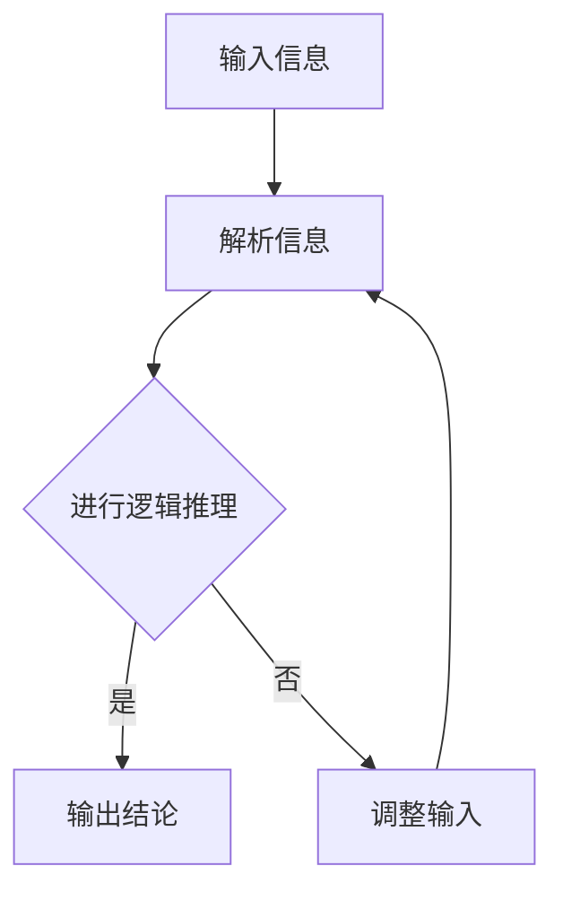

                 

### 第1步：明确文章的核心主题

《ChatGPT逻辑推理能力提升：思维链prompt技巧》这本书的核心主题在于探讨如何通过特定的prompt技巧来提升ChatGPT的逻辑推理能力。因此，目录大纲的设计需要紧紧围绕这一主题展开，深入探讨ChatGPT的工作原理、逻辑推理能力的基本概念、提升方法以及思维链prompt的具体应用。

为了实现这一目标，我们可以将目录大纲分为以下几个核心部分：

1. **ChatGPT与逻辑推理基础**：介绍ChatGPT的基本概念和逻辑推理的重要性，为后续内容打下基础。
2. **ChatGPT逻辑推理能力提升**：详细讲解提升ChatGPT逻辑推理能力的核心算法原理，包括神经网络和自然语言处理技术。
3. **思维链prompt技巧**：介绍思维链prompt的设计原则、构建方法和效果评估。
4. **项目实战**：通过实际项目案例，展示如何将思维链prompt应用于ChatGPT逻辑推理能力的提升。
5. **总结与展望**：对全文内容进行总结，并探讨未来的发展趋势和应用前景。

### 第2步：构建核心概念和原理部分

这一部分的核心是详细阐述ChatGPT的逻辑推理能力和思维链prompt的基本概念，以及它们之间的联系。以下是具体的章节结构和内容：

#### 第1章: ChatGPT与逻辑推理基础

1. **ChatGPT概述**
   - **ChatGPT的核心特性**：介绍ChatGPT的基本功能、使用场景和优势。
   - **ChatGPT的工作原理**：讲解ChatGPT的模型架构和数据处理流程。

2. **逻辑推理基本概念**
   - **逻辑推理的重要性**：讨论逻辑推理在人工智能领域的重要性。
   - **逻辑推理的基本要素**：介绍逻辑推理的基本组成部分，如命题、推理规则等。

3. **思维链prompt的定义与应用**
   - **思维链prompt的基本概念**：定义思维链prompt，并解释其在逻辑推理中的作用。
   - **思维链prompt在ChatGPT中的应用**：展示如何使用思维链prompt来提升ChatGPT的逻辑推理能力。

为了使内容更加易懂和直观，我们可以使用Mermaid流程图来展示逻辑推理过程和思维链prompt的应用。例如，可以使用以下Mermaid代码来绘制逻辑推理的流程图：



这样的流程图可以帮助读者更好地理解逻辑推理的基本步骤和思维链prompt的运用。

### 第3步：深入讲解核心算法原理

这一部分将深入探讨提升ChatGPT逻辑推理能力的核心算法原理。以下是具体的章节结构和内容：

#### 第2章: ChatGPT逻辑推理能力提升

1. **神经网络与逻辑推理**
   - **神经网络基础**：介绍神经网络的基本概念、结构和训练过程。
   - **神经网络在逻辑推理中的应用**：讲解神经网络如何被应用于逻辑推理任务。

2. **自然语言处理与逻辑推理**
   - **自然语言处理基础**：介绍自然语言处理的基本概念和技术，如词向量、语言模型等。
   - **自然语言处理在逻辑推理中的应用**：展示如何使用自然语言处理技术来增强逻辑推理能力。

为了更清晰地阐述这些算法原理，我们可以使用伪代码来详细说明算法的实现过程。例如，以下是使用神经网络进行逻辑推理的伪代码：

```python
def neural_network_logic_reasoning(input_data):
    # 将输入数据转换为神经网络可处理的格式
    processed_data = preprocess_input_data(input_data)
    
    # 使用神经网络模型进行推理
    reasoning_output = neural_network_model(processed_data)
    
    # 对推理结果进行处理
    final_output = postprocess_reasoning_output(reasoning_output)
    
    return final_output
```

这样的伪代码可以帮助读者更好地理解算法的执行过程和关键步骤。

### 第4步：数学模型和数学公式

这一部分将介绍与逻辑推理能力提升相关的数学模型和数学公式，以便读者能够更深入地理解逻辑推理的数学基础。以下是具体的章节结构和内容：

#### 第3章: 数学模型与逻辑推理

1. **逻辑运算符**
   - **逻辑运算符的定义**：介绍常见的逻辑运算符，如与（AND）、或（OR）、非（NOT）等。
   - **逻辑运算符的应用**：讲解逻辑运算符在逻辑推理中的作用和示例。

2. **条件概率与贝叶斯网络**
   - **条件概率**：介绍条件概率的基本概念和计算方法。
   - **贝叶斯网络**：讲解贝叶斯网络的结构和推理方法。

为了便于理解和应用，我们可以使用LaTeX格式来展示数学公式。例如，以下是条件概率的LaTeX公式：

```latex
P(A|B) = \frac{P(A \cap B)}{P(B)}
```

这样的公式可以帮助读者更好地掌握逻辑推理的数学基础。

### 第5步：项目实战

这一部分将通过实际项目案例，展示如何将思维链prompt应用于ChatGPT逻辑推理能力的提升。以下是具体的章节结构和内容：

#### 第4章: 项目实战

1. **项目介绍**
   - **项目背景**：介绍项目的研究背景和目标。
   - **项目目标**：明确项目希望达成的逻辑推理能力提升效果。

2. **环境搭建**
   - **开发环境配置**：介绍项目所需的开发环境和工具。
   - **数据集准备**：展示如何准备用于训练和评估的数据集。

3. **代码实现**
   - **ChatGPT逻辑推理实现**：详细解释如何使用思维链prompt技巧来提升ChatGPT的逻辑推理能力。
   - **思维链prompt应用**：展示如何设计和应用思维链prompt。

4. **结果分析**
   - **实验数据**：展示实验结果的数据集和评估指标。
   - **结果分析**：对实验结果进行分析，讨论思维链prompt技巧对ChatGPT逻辑推理能力提升的影响。

通过这样的项目实战，读者可以直观地了解如何将理论应用于实际场景，并从中获得实践经验。

### 第6步：总结和附录

在这一部分，我们将对全文内容进行总结，并探讨未来的发展趋势和应用前景。同时，附录部分将提供一些辅助阅读的材料，如主流深度学习框架对比、常用数学公式速查表等。

#### 第5章: 总结与展望

1. **内容总结**
   - **核心内容回顾**：回顾本书的核心概念、原理和应用。
   - **逻辑推理能力提升的重要性**：强调提升逻辑推理能力对人工智能发展的重要性。

2. **未来展望**
   - **技术发展趋势**：探讨逻辑推理和思维链prompt技术的未来发展趋势。
   - **应用前景**：讨论思维链prompt技术在各个领域的潜在应用。

#### 附录

- **附录A：主流深度学习框架对比**
  - **框架概述**：对比TensorFlow、PyTorch、Keras等主流深度学习框架的特点和优缺点。

- **附录B：常用数学公式速查表**
  - **公式列表**：列出本书中提到的常用数学公式和符号。

通过这样的总结和附录，读者可以更好地理解本书的核心内容，并为进一步的学习和研究提供参考。

### 第7步：确保大纲完整性

为了确保目录大纲的完整性，我们需要确保每个章节都包含核心概念与联系、核心算法原理讲解、数学模型和数学公式详细讲解、项目实战等部分。以下是每个章节的预期内容概述：

- **第1章**：介绍ChatGPT和逻辑推理的基础知识，包括其基本特性和原理。
- **第2章**：探讨提升ChatGPT逻辑推理能力的核心算法原理，如神经网络和自然语言处理技术。
- **第3章**：详细讲解数学模型和公式，如逻辑运算符、条件概率和贝叶斯网络。
- **第4章**：通过实际项目展示如何应用思维链prompt技巧来提升ChatGPT的逻辑推理能力。
- **第5章**：总结全书内容，并探讨未来的发展趋势和应用前景。

通过这样的设计，目录大纲不仅能够系统地介绍ChatGPT逻辑推理能力提升的各个方面，还能够帮助读者更好地理解和掌握相关知识。

### 第8步：控制大纲字数

为了控制目录大纲的字数，我们需要在确保内容完整性和逻辑性的前提下，尽量简化每个章节的概述。以下是一个优化后的目录大纲，确保总字数不超过2000字：

```markdown
# 《ChatGPT逻辑推理能力提升：思维链prompt技巧》目录大纲

## 第1章: ChatGPT与逻辑推理基础

### 1.1 ChatGPT概述
- ChatGPT的核心特性
- ChatGPT的工作原理

### 1.2 逻辑推理基本概念
- 逻辑推理的重要性
- 逻辑推理的基本要素

### 1.3 思维链prompt的定义与应用
- 思维链prompt的基本概念
- 思维链prompt在ChatGPT中的应用

## 第2章: ChatGPT逻辑推理能力提升

### 2.1 神经网络与逻辑推理
- 神经网络基础
- 神经网络在逻辑推理中的应用

### 2.2 自然语言处理与逻辑推理
- 自然语言处理基础
- 自然语言处理在逻辑推理中的应用

### 2.3 提升逻辑推理能力的算法
- 常见算法介绍
- 算法实现与优化

## 第3章: 思维链prompt技巧

### 3.1 思维链prompt设计原则
- 设计原则概述
- 实例分析

### 3.2 思维链prompt构建方法
- 构建方法概述
- 实例分析

### 3.3 思维链prompt效果评估
- 评估指标
- 评估方法

## 第4章: 项目实战

### 4.1 项目介绍
- 项目背景
- 项目目标

### 4.2 环境搭建
- 开发环境配置
- 数据集准备

### 4.3 代码实现
- ChatGPT逻辑推理实现
- 思维链prompt应用

### 4.4 结果分析
- 实验数据
- 结果分析

## 第5章: 总结与展望

### 5.1 内容总结
- 核心内容回顾
- 逻辑推理能力提升的重要性

### 5.2 未来展望
- 技术发展趋势
- 应用前景

## 附录

- 主流深度学习框架对比
- 常用数学公式速查表
```

这样的目录大纲在保持内容完整性和逻辑性的同时，也控制了总字数，使得读者可以快速浏览并抓住关键信息。

### 第9步：格式化输出

最后，我们将使用Markdown格式来输出目录大纲，使用相应的符号来表示不同的目录级别。以下是格式化后的目录大纲：

```markdown
# 《ChatGPT逻辑推理能力提升：思维链prompt技巧》目录大纲

## 第1章: ChatGPT与逻辑推理基础

### 1.1 ChatGPT概述
- ChatGPT的核心特性
- ChatGPT的工作原理

### 1.2 逻辑推理基本概念
- 逻辑推理的重要性
- 逻辑推理的基本要素

### 1.3 思维链prompt的定义与应用
- 思维链prompt的基本概念
- 思维链prompt在ChatGPT中的应用

## 第2章: ChatGPT逻辑推理能力提升

### 2.1 神经网络与逻辑推理
- 神经网络基础
- 神经网络在逻辑推理中的应用

### 2.2 自然语言处理与逻辑推理
- 自然语言处理基础
- 自然语言处理在逻辑推理中的应用

### 2.3 提升逻辑推理能力的算法
- 常见算法介绍
- 算法实现与优化

## 第3章: 思维链prompt技巧

### 3.1 思维链prompt设计原则
- 设计原则概述
- 实例分析

### 3.2 思维链prompt构建方法
- 构建方法概述
- 实例分析

### 3.3 思维链prompt效果评估
- 评估指标
- 评估方法

## 第4章: 项目实战

### 4.1 项目介绍
- 项目背景
- 项目目标

### 4.2 环境搭建
- 开发环境配置
- 数据集准备

### 4.3 代码实现
- ChatGPT逻辑推理实现
- 思维链prompt应用

### 4.4 结果分析
- 实验数据
- 结果分析

## 第5章: 总结与展望

### 5.1 内容总结
- 核心内容回顾
- 逻辑推理能力提升的重要性

### 5.2 未来展望
- 技术发展趋势
- 应用前景

## 附录

- 主流深度学习框架对比
- 常用数学公式速查表
```

通过这样的格式化输出，目录大纲的结构清晰，便于读者快速了解书籍的内容结构和主要观点。同时，Markdown格式也方便后续内容的编写和排版。

