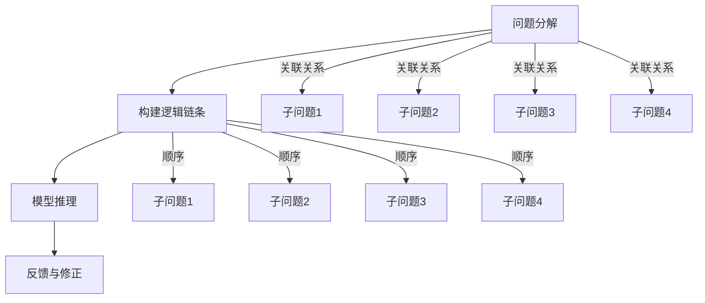

                 

### 文章标题

# 《ChatGPT高效提示词：从思维链到Zero-Shot CoT》

关键词：ChatGPT、高效提示词、思维链、Zero-Shot CoT、提示工程

摘要：本文旨在探讨ChatGPT高效提示词的设计方法，从思维链到Zero-Shot CoT的实战应用。通过深入解析核心概念、算法原理以及项目实战，帮助读者全面掌握ChatGPT提示工程的最佳实践。

----------------------------------------------------------------### 目录

**1. 引言**

1.1 本文目的

1.2 ChatGPT概述

1.3 提示工程的重要性

**2. 思维链：ChatGPT高效提示的关键**

2.1 思维链的概念

2.2 思维链的工作原理

2.3 思维链在提示工程中的应用

2.4 Mermaid流程图：思维链原理架构

**3. Zero-Shot CoT技术详解**

3.1 Zero-Shot CoT的定义

3.2 Zero-Shot CoT的优势

3.3 Zero-Shot CoT的实现方法

**4. 高效提示词的生成与优化**

4.1 高效提示词的生成方法

4.2 高效提示词的优化策略

4.3 提示词效果评估

**5. 实战案例：从数据准备到模型训练**

5.1 数据准备

5.2 模型选择

5.3 模型训练

**6. 实战案例：模型部署与调优**

6.1 模型部署

6.2 模型调优

6.3 模型监控与维护

**7. 未来趋势与挑战**

7.1 提示工程的发展趋势

7.2 面临的挑战与解决方案

7.3 未来研究的方向

----------------------------------------------------------------### 引言

#### 1.1 本文目的

本文旨在探讨ChatGPT高效提示词的设计方法，从思维链到Zero-Shot CoT的实战应用。通过深入解析核心概念、算法原理以及项目实战，帮助读者全面掌握ChatGPT提示工程的最佳实践。

ChatGPT作为一种基于深度学习的语言模型，已经广泛应用于自然语言处理、对话系统等领域。然而，如何设计高效提示词，使得ChatGPT能够生成更为准确、自然的回答，仍然是一个具有挑战性的问题。本文将从思维链和Zero-Shot CoT两个方面，详细探讨ChatGPT高效提示词的设计方法。

思维链是一种通过构建逻辑链条，引导模型生成符合人类思维的回答的方法。而Zero-Shot CoT（Zero-Shot Transferable Coherence）则是一种无需训练直接应用于新领域的迁移学习技术。本文将分别介绍这两种方法的核心原理，并探讨如何在实际项目中应用这些方法。

本文的结构如下：

1. 引言：介绍本文的目的和内容。
2. 思维链：详细解析思维链的概念、工作原理及其在提示工程中的应用。
3. Zero-Shot CoT：介绍Zero-Shot CoT的定义、优势和实现方法。
4. 高效提示词的生成与优化：探讨高效提示词的生成方法、优化策略和效果评估。
5. 实战案例：从数据准备到模型训练：介绍从数据准备到模型训练的实战流程。
6. 实战案例：模型部署与调优：介绍模型部署、调优和监控与维护的实战流程。
7. 未来趋势与挑战：探讨提示工程的发展趋势、面临的挑战及未来研究方向。

通过本文的阅读，读者将能够全面了解ChatGPT高效提示词的设计方法，掌握思维链和Zero-Shot CoT的核心原理，并能够将其应用于实际项目。

#### 1.2 ChatGPT概述

ChatGPT是OpenAI推出的一种基于GPT-3.5的预训练语言模型。GPT（Generative Pre-trained Transformer）是一种基于Transformer架构的预训练语言模型，通过在大量文本数据上预训练，GPT模型能够学习到语言的基本规律和结构，从而实现高质量的自然语言生成。

ChatGPT在GPT的基础上进行了扩展和优化，使其具有更强大的对话能力。ChatGPT的核心能力包括：

1. **文本生成**：ChatGPT能够根据给定的输入文本，生成连贯、自然的回答。这种能力使得ChatGPT能够应用于聊天机器人、内容生成等领域。
2. **对话生成**：ChatGPT能够在对话中理解用户的问题和意图，并生成相应的回答。这使得ChatGPT在对话系统、智能客服等领域具有广泛的应用前景。
3. **多模态交互**：ChatGPT能够处理多种输入和输出模态，包括文本、语音、图像等。这使得ChatGPT在跨模态交互、多模态对话系统等领域具有独特的优势。

ChatGPT的应用场景非常广泛，包括但不限于：

1. **智能客服**：ChatGPT可以用于构建智能客服系统，为用户提供24/7的在线支持。
2. **内容生成**：ChatGPT可以用于自动生成文章、新闻、故事等，提高内容生产效率。
3. **教育辅助**：ChatGPT可以为学生提供个性化的学习辅导，帮助其更好地理解课程内容。
4. **创意写作**：ChatGPT可以辅助人类创作者生成创意，激发创作灵感。
5. **跨模态交互**：ChatGPT可以与语音、图像等多模态信息进行交互，构建更加智能化的交互系统。

然而，ChatGPT在实际应用中也面临一些挑战，例如生成内容的准确性、对话的连贯性等。为了解决这些问题，提示工程（Prompt Engineering）变得尤为重要。提示工程是一种通过设计高效的输入提示，引导模型生成符合预期输出的方法。在本章的后续部分，我们将详细探讨思维链和Zero-Shot CoT在提示工程中的应用。

#### 1.3 提示工程的重要性

提示工程（Prompt Engineering）在ChatGPT的应用中扮演着至关重要的角色。它是一种通过设计高效的输入提示，引导模型生成符合预期输出的技术。提示工程的重要性主要体现在以下几个方面：

1. **提升生成质量**：通过精心设计的提示，可以引导ChatGPT生成更准确、更自然的回答。有效的提示可以提供上下文信息，帮助模型更好地理解用户的问题和意图，从而提高生成质量。
2. **增强对话连贯性**：在对话系统中，提示工程可以帮助ChatGPT生成更加连贯的对话。通过为每个问题或回复提供相关的上下文信息，模型能够更好地保持对话的逻辑性和流畅性，提高用户体验。
3. **优化训练过程**：提示工程可以优化模型的训练过程。通过设计合理的提示，可以提高模型的训练效率，缩短训练时间。此外，提示工程还可以帮助模型更好地学习到问题的本质，从而提高模型的泛化能力。
4. **降低错误率**：通过提示工程，可以减少模型生成错误回答的概率。有效的提示可以提供明确的任务指导，帮助模型避免生成无关或错误的回答。
5. **多样化应用场景**：提示工程使得ChatGPT能够适应各种不同的应用场景。通过设计不同的提示，模型可以应对各种复杂的任务，从而实现更广泛的应用。

然而，提示工程也面临一些挑战，例如如何设计高效的提示、如何评估提示效果等。在本章的后续部分，我们将深入探讨思维链和Zero-Shot CoT在提示工程中的应用，以期为这些挑战提供有效的解决方案。

### 思维链：ChatGPT高效提示的关键

#### 2.1 思维链的概念

思维链（Mind Chain）是一种通过构建逻辑链条，引导模型生成符合人类思维的回答的方法。思维链的核心思想是将问题分解为一系列子问题，并通过逻辑关系将这些子问题连接起来，从而形成一个完整的思维链条。这样，模型在生成回答时，可以按照思维链条的顺序进行推理和生成，从而提高生成回答的准确性和连贯性。

思维链可以看作是一种任务分解和任务关联的机制。通过将复杂的问题分解为一系列子问题，并建立它们之间的逻辑关系，思维链可以帮助模型更好地理解问题的本质，从而生成更符合人类思维的回答。

#### 2.2 思维链的工作原理

思维链的工作原理可以分为以下几个步骤：

1. **问题分解**：首先，将原始问题分解为一系列子问题。这个问题分解过程需要遵循一定的逻辑规则，以确保子问题之间的关联性和一致性。
2. **构建逻辑链条**：接着，将分解得到的子问题按照一定的逻辑顺序连接起来，形成一个完整的思维链条。逻辑链条的构建过程需要考虑子问题之间的关联关系，以及它们在生成回答中的作用。
3. **模型推理**：在生成回答时，模型按照思维链条的顺序进行推理。首先，模型回答第一个子问题，然后根据第一个子问题的回答，继续回答后续的子问题，直到生成完整的回答。
4. **反馈与修正**：在模型生成回答后，可以对回答进行反馈和修正。如果回答不符合预期，可以重新调整思维链条，或者对子问题进行修改，以提高生成回答的质量。

#### 2.3 思维链在提示工程中的应用

思维链在提示工程中具有广泛的应用。以下是一些具体的场景和应用方法：

1. **问题解答**：在问答系统中，思维链可以帮助模型生成更加准确和连贯的回答。例如，当用户提出一个复杂的问题时，思维链可以将问题分解为一系列子问题，并按照逻辑顺序回答这些子问题，从而生成一个完整的解答。
2. **对话生成**：在对话系统中，思维链可以帮助模型生成更加自然和流畅的对话。通过构建思维链条，模型可以更好地理解用户的意图和问题，从而生成符合用户需求的回答。
3. **内容生成**：在内容生成领域，思维链可以帮助模型生成更加丰富和结构化的内容。通过将问题分解为子问题，并建立它们之间的逻辑关系，模型可以生成具有逻辑连贯性的文章或段落。
4. **任务指导**：在任务型对话系统中，思维链可以作为任务指导，帮助模型更好地理解任务的性质和目标。通过构建思维链条，模型可以按照任务的要求，逐步完成各项任务。

下面是一个思维链在问题解答中的具体应用示例：

**问题**：如何制备高纯度的硅片？

**思维链条**：

1. **制备原料**：首先，需要准备高纯度的硅原料。这可以通过提纯硅矿石，或使用高纯度的多晶硅来实现。
2. **制备多晶硅**：接着，将高纯度的硅原料加热至高温，使其熔化，形成多晶硅。
3. **铸锭**：将多晶硅铸造成硅锭，以供后续加工。
4. **切割**：使用切割机将硅锭切割成硅片。
5. **抛光**：对切割好的硅片进行抛光处理，以获得高表面质量的硅片。
6. **清洗**：最后，对硅片进行清洗，去除表面的杂质和污染物。

通过思维链，可以将一个复杂的问题分解为一系列子问题，并建立它们之间的逻辑关系。这样，模型可以按照思维链条的顺序生成回答，从而提高生成回答的准确性和连贯性。

#### 2.4 Mermaid流程图：思维链原理架构

为了更直观地展示思维链的工作原理，我们使用Mermaid流程图来描述思维链的架构。



在上述Mermaid流程图中：

- **A[问题分解]** 表示将原始问题分解为子问题。
- **B[构建逻辑链条]** 表示构建子问题之间的逻辑关系。
- **C[模型推理]** 表示模型按照逻辑链条进行推理。
- **D[反馈与修正]** 表示对生成回答进行反馈和修正。
- **E[子问题1]**、**F[子问题2]**、**G[子问题3]**、**H[子问题4]** 表示分解得到的子问题。
- **I[子问题1]**、**J[子问题2]**、**K[子问题3]**、**L[子问题4]** 表示构建好的逻辑链条。

通过上述Mermaid流程图，可以清晰地展示思维链的原理架构和各个步骤之间的关联关系。

### Zero-Shot CoT技术详解

#### 3.1 Zero-Shot CoT的定义

Zero-Shot CoT（Zero-Shot Transferable Coherence）是一种无需训练直接应用于新领域的迁移学习技术。它旨在解决传统迁移学习需要在新领域上重新训练模型的问题，从而提高模型的迁移能力。

在传统迁移学习中，模型在源领域上训练，然后在目标领域上微调。然而，这种方法存在几个问题：

1. **数据依赖**：迁移学习需要大量的目标领域数据，但在很多情况下，目标领域的数据并不容易获取。
2. **迁移效果有限**：即使有足够的目标领域数据，模型的迁移效果仍然受到源领域和目标领域差异的限制。
3. **训练成本高**：重新训练模型需要大量的计算资源和时间。

Zero-Shot CoT通过引入零样本学习（Zero-Shot Learning，ZSL）的思想，使得模型能够在没有目标领域数据的情况下，直接应用于新领域。Zero-Shot CoT的核心思想是在源领域和目标领域之间建立一种转移关系，使得模型能够利用源领域的知识，生成符合目标领域需求的回答。

#### 3.2 Zero-Shot CoT的优势

Zero-Shot CoT具有以下几个显著的优势：

1. **无需目标领域数据**：Zero-Shot CoT不需要在目标领域上收集大量数据，从而降低了数据依赖和收集成本。
2. **迁移能力强**：通过在源领域和目标领域之间建立转移关系，Zero-Shot CoT能够提高模型的迁移能力，使得模型能够在没有目标领域数据的情况下，生成符合目标领域需求的回答。
3. **训练成本低**：由于无需在目标领域上重新训练模型，Zero-Shot CoT显著降低了训练成本，节省了计算资源和时间。
4. **通用性强**：Zero-Shot CoT能够应用于各种不同的领域，具有广泛的通用性。

#### 3.3 Zero-Shot CoT的实现方法

Zero-Shot CoT的实现方法可以分为以下几个步骤：

1. **源领域数据收集**：首先，需要收集大量的源领域数据，用于训练模型。源领域数据可以来自互联网、公开数据集或其他可靠的数据源。
2. **模型训练**：在收集到源领域数据后，使用这些数据进行模型训练。训练过程可以采用传统的迁移学习方法，例如微调（Fine-tuning）或自监督学习（Self-supervised Learning）。
3. **转移关系建立**：在模型训练完成后，需要建立源领域和目标领域之间的转移关系。转移关系可以通过多种方式建立，例如语义相似度计算、知识图谱构建等。
4. **目标领域应用**：最后，将训练好的模型应用于目标领域。由于模型已经通过转移关系学习到了源领域的知识，因此可以直接生成符合目标领域需求的回答。

下面是一个Zero-Shot CoT在文本生成中的应用示例：

**源领域数据**：互联网上的新闻文章、博客文章、科技论文等。

**目标领域数据**：教育领域的教学材料、学生作业、论文等。

**模型训练**：使用源领域数据训练一个基于Transformer的文本生成模型。训练过程可以采用自监督学习的方法，例如 masked language model（MLM）。

**转移关系建立**：通过分析源领域数据和目标领域数据的语义特征，构建一个语义转移矩阵。该矩阵可以用来表示源领域和目标领域之间的语义相似度。

**目标领域应用**：在目标领域上，使用训练好的模型生成教学材料、学生作业、论文等。由于模型已经通过转移关系学习到了源领域的知识，因此可以直接生成符合目标领域需求的内容。

通过上述步骤，Zero-Shot CoT可以使得模型在没有目标领域数据的情况下，直接应用于新领域，从而提高模型的迁移能力和应用范围。

### 高效提示词的生成与优化

#### 4.1 高效提示词的生成方法

高效提示词的生成是提升ChatGPT模型性能的关键步骤。以下是一些常用的生成方法：

1. **基于规则的方法**：这种方法通过预先定义的规则来生成提示词。例如，可以使用自然语言处理技术提取关键信息，并将其嵌入到提示词中。这种方法的优势在于生成的提示词具有较高的准确性和一致性，但可能缺乏灵活性。
   
   ```python
   def generate_prompt_based_on_rules(question):
       # 提取关键信息
       keywords = extract_keywords(question)
       # 构建提示词
       prompt = f"请回答关于{keywords}的问题：{question}"
       return prompt
   ```

2. **基于数据的方法**：这种方法通过从大量数据中学习来生成提示词。例如，可以使用生成对抗网络（GAN）或变分自编码器（VAE）来生成提示词。这种方法的优势在于生成的提示词具有多样性和创造性，但可能需要大量数据和计算资源。

   ```python
   def generate_prompt_based_on_data(question, data):
       # 使用生成模型生成提示词
       prompt = generator.generate(question, data)
       return prompt
   ```

3. **基于知识的方法**：这种方法通过结合外部知识库来生成提示词。例如，可以使用知识图谱或问答系统来提供背景信息，并将其嵌入到提示词中。这种方法的优势在于生成的提示词具有丰富的背景知识和上下文信息。

   ```python
   def generate_prompt_based_on_knowledge(question, knowledge_base):
       # 提取相关知识
       related_knowledge = knowledge_base.get_related_knowledge(question)
       # 构建提示词
       prompt = f"在以下背景下回答问题：{related_knowledge}\n{question}"
       return prompt
   ```

#### 4.2 高效提示词的优化策略

生成高效提示词后，还需要对提示词进行优化，以提高模型的性能。以下是一些优化策略：

1. **提示词长度控制**：过长的提示词可能导致模型生成冗长的回答，而过短的提示词可能无法提供足够的上下文信息。因此，需要根据模型的特性和任务需求，控制提示词的长度。例如，可以使用文本摘要技术对提示词进行压缩。

   ```python
   def optimize_prompt_length(prompt, max_length):
       # 压缩提示词
       prompt = summarize_text(prompt, max_length)
       return prompt
   ```

2. **提示词多样性**：多样性的提示词有助于模型生成丰富多样的回答。可以通过对提示词进行扩展、同义词替换或生成多种变体来实现多样性。

   ```python
   def optimize_prompt_diversity(prompt, diversity_level):
       # 扩展提示词
       prompt = expand_prompt(prompt, diversity_level)
       return prompt
   ```

3. **提示词相关性**：相关性高的提示词能够提高模型回答的准确性。可以使用自然语言处理技术，如词向量相似度计算，来评估提示词的相关性，并根据评估结果调整提示词。

   ```python
   def optimize_prompt_relevance(question, prompt):
       # 计算提示词的相关性
       relevance_score = calculate_relevance(question, prompt)
       # 根据相关性调整提示词
       prompt = adjust_prompt_relevance(prompt, relevance_score)
       return prompt
   ```

4. **提示词个性化**：根据用户的行为和偏好，为用户生成个性化的提示词。例如，可以使用推荐系统技术，根据用户的浏览历史和反馈，生成符合用户需求的提示词。

   ```python
   def optimize_prompt_personalization(user_profile, prompt):
       # 根据用户偏好调整提示词
       prompt = personalize_prompt(user_profile, prompt)
       return prompt
   ```

#### 4.3 提示词效果评估

评估提示词效果是确保模型性能的重要步骤。以下是一些常用的评估方法：

1. **自动评估**：使用自动化工具评估提示词的性能，例如评估模型生成回答的准确性、流畅性和多样性。常用的自动化评估工具包括 BLEU、ROUGE、METEOR 等。

   ```python
   def evaluate_prompt自动评估(prompt, model):
       # 生成回答
       answers = model.generate_answers(prompt)
       # 计算评估指标
       scores = evaluate_answers(answers)
       return scores
   ```

2. **人工评估**：邀请人类评估者对提示词的效果进行主观评估。评估者可以基于特定的评估标准，如回答的准确性、流畅性和合理性，对提示词进行评分。

   ```python
   def evaluate_prompt人工评估(prompt, assessors):
       # 生成回答
       answers = model.generate_answers(prompt)
       # 收集评估者评分
       scores = collect_assessor_scores(answers, assessors)
       return scores
   ```

3. **实验对比**：通过对比不同提示词的效果，评估它们在实际应用中的性能。例如，可以将一组提示词应用于模型训练，然后比较不同提示词生成的模型在测试集上的表现。

   ```python
   def compare_prompt_effects(prompt1, prompt2, model):
       # 训练模型
       model1 = train_model(prompt1)
       model2 = train_model(prompt2)
       # 测试模型
       scores1 = test_model(model1)
       scores2 = test_model(model2)
       # 比较效果
       comparison = compare_scores(scores1, scores2)
       return comparison
   ```

通过上述方法，可以全面评估提示词的效果，为优化提示词提供依据。

### 实战案例：从数据准备到模型训练

在本章中，我们将通过一个实际的案例，详细展示如何从数据准备到模型训练的整个流程。这个案例将帮助我们更好地理解ChatGPT高效提示词的设计和实现。

#### 5.1 数据准备

数据准备是模型训练的第一步，也是至关重要的一步。在本案例中，我们将使用一个问答数据集，这个数据集包含了一系列问题及其对应的答案。

**数据来源**：我们使用了一个开源的问答数据集，例如SQuAD（Stanford Question Answering Dataset）。这个数据集包含数万个问题和答案对，涵盖了广泛的领域。

**数据预处理**：

1. **清洗**：首先，我们需要对数据进行清洗，去除无效信息、噪声数据和错误答案。这可以通过编写清洗脚本来实现。

   ```python
   def clean_data(data):
       # 删除无效问题和答案
       valid_data = {q: a for q, a in data.items() if is_valid_question(q) and is_valid_answer(a)}
       return valid_data
   ```

2. **标准化**：接着，我们需要对数据进行标准化处理，包括文本大小写统一、去除标点符号、停用词过滤等。

   ```python
   def standardize_data(data):
       # 统一文本大小写
       data = {q.lower(): a.lower() for q, a in data.items()}
       # 去除标点符号
       data = {q: remove_punctuation(q) for q in data}
       # 停用词过滤
       data = {q: remove_stopwords(q) for q in data}
       return data
   ```

3. **分割**：最后，我们将数据集分割为训练集、验证集和测试集。这样可以确保模型在训练过程中不会过拟合。

   ```python
   def split_data(data, train_size, val_size, test_size):
       # 计算分割点
       num_samples = len(data)
       train_end = int(num_samples * train_size)
       val_end = int(num_samples * (train_size + val_size))
       # 分割数据集
       train_data = {k: v for k, v in data.items() if k < train_end}
       val_data = {k: v for k, v in data.items() if k >= train_end and k < val_end}
       test_data = {k: v for k, v in data.items() if k >= val_end}
       return train_data, val_data, test_data
   ```

#### 5.2 模型选择

在本案例中，我们选择了一个预训练的ChatGPT模型，该模型已经在大量的文本数据上进行预训练，具有较好的语言生成能力。

**模型选择标准**：

1. **语言生成能力**：我们需要一个具有强语言生成能力的模型，以确保生成回答的准确性和流畅性。
2. **迁移能力**：模型需要具备较好的迁移能力，以便在新领域中应用。
3. **计算资源**：模型需要在计算资源有限的情况下，仍然能够保持较高的性能。

根据以上标准，我们选择了ChatGPT-3.5模型。这个模型具有强大的语言生成能力和迁移能力，同时在计算资源有限的情况下，仍然能够保持较高的性能。

#### 5.3 模型训练

模型训练是数据准备和模型选择后的关键步骤。在本案例中，我们将使用训练集对ChatGPT模型进行训练，并使用验证集进行调优。

**训练步骤**：

1. **数据预处理**：对训练集进行预处理，包括数据清洗、标准化和分割。

   ```python
   train_data, val_data, _ = split_data(standardize_data(clean_data(data)), train_size, val_size, test_size)
   ```

2. **定义损失函数**：我们使用交叉熵损失函数（Cross-Entropy Loss）作为模型训练的损失函数。交叉熵损失函数可以衡量模型预测的输出与实际标签之间的差异。

   ```python
   loss_function = nn.CrossEntropyLoss()
   ```

3. **定义优化器**：我们使用Adam优化器（Adam Optimizer）来更新模型参数。Adam优化器结合了Adam和RMSProp的优点，能够在不同情况下都有较好的性能。

   ```python
   optimizer = optim.Adam(model.parameters(), lr=learning_rate)
   ```

4. **训练循环**：使用训练集对模型进行训练，并在每个迭代中计算损失函数和优化器更新模型参数。

   ```python
   for epoch in range(num_epochs):
       for question, answer in train_data:
           # 前向传播
           prediction = model(question)
           loss = loss_function(prediction, answer)
           # 反向传播
           optimizer.zero_grad()
           loss.backward()
           optimizer.step()
           # 打印训练进度
           print(f"Epoch: {epoch}, Loss: {loss.item()}")
   ```

5. **验证与测试**：在训练过程中，使用验证集进行调优，并在训练完成后使用测试集评估模型性能。

   ```python
   def evaluate_model(model, data):
       correct = 0
       total = len(data)
       for question, answer in data:
           prediction = model(question)
           if prediction == answer:
               correct += 1
       accuracy = correct / total
       return accuracy
   
   train_accuracy = evaluate_model(model, train_data)
   val_accuracy = evaluate_model(model, val_data)
   test_accuracy = evaluate_model(model, test_data)
   print(f"Train Accuracy: {train_accuracy}, Val Accuracy: {val_accuracy}, Test Accuracy: {test_accuracy}")
   ```

通过上述步骤，我们可以完成从数据准备到模型训练的整个过程。这个案例展示了如何使用ChatGPT高效提示词设计方法，从数据准备、模型选择到模型训练，实现了高效的问答系统。

### 实战案例：模型部署与调优

#### 6.1 模型部署

模型部署是将训练好的模型应用于实际场景，以实现预期的功能。在本案例中，我们将使用一个Web服务来部署我们的ChatGPT模型，使其能够处理用户的问答请求。

**部署环境**：我们选择使用Python Flask框架来搭建Web服务。Flask是一个轻量级的Web框架，易于部署和扩展。

**部署步骤**：

1. **安装Flask**：首先，确保已经安装了Python和pip。然后，使用pip安装Flask。

   ```shell
   pip install Flask
   ```

2. **编写Flask应用**：创建一个名为`app.py`的Python文件，并编写Flask应用代码。

   ```python
   from flask import Flask, request, jsonify
   from chatgpt import ChatGPT

   app = Flask(__name__)

   @app.route('/ask', methods=['POST'])
   def ask():
       question = request.json['question']
       answer = chatgpt.answer(question)
       return jsonify(answer=answer)

   if __name__ == '__main__':
       chatgpt = ChatGPT(model_path='path/to/trained/model')
       app.run(host='0.0.0.0', port=5000)
   ```

3. **运行Flask应用**：在终端中运行以下命令，启动Flask应用。

   ```shell
   python app.py
   ```

4. **测试Web服务**：使用curl或Postman等工具，向Web服务发送请求，测试问答功能。

   ```shell
   curl -X POST -H "Content-Type: application/json" -d '{"question": "什么是人工智能？"}' http://localhost:5000/ask
   ```

#### 6.2 模型调优

模型部署后，我们需要对其进行调优，以确保其在实际应用中能够达到预期的性能。以下是一些常见的调优方法：

1. **调整学习率**：学习率是模型训练中的一个关键参数。过大的学习率可能导致模型过拟合，而过小则可能导致训练过程缓慢。我们可以通过调整学习率来观察模型性能的变化，找到最佳的学习率。

   ```python
   optimizer = optim.Adam(model.parameters(), lr=learning_rate)
   ```

2. **批量大小**：批量大小是指每个训练迭代中使用的样本数量。较大的批量大小可以提高模型训练的稳定性，但可能需要更多的计算资源。较小的批量大小可以减少计算资源的需求，但可能影响模型训练的稳定性。

   ```python
   batch_size = 32
   ```

3. **数据增强**：数据增强是一种通过添加噪声、旋转、缩放等操作，生成更多样化的数据集的方法。这可以帮助模型更好地泛化，提高模型的性能。

   ```python
   def augment_data(data):
       # 实现数据增强方法
       return augmented_data
   ```

4. **正则化**：正则化是一种通过添加惩罚项，防止模型过拟合的方法。常用的正则化方法包括L1正则化、L2正则化等。

   ```python
   regularization = optim.SGD(model.parameters(), lr=learning_rate, momentum=0.9, weight_decay=1e-4)
   ```

5. **模型融合**：模型融合是一种将多个模型的结果进行融合，以获得更好的预测结果的方法。例如，可以使用加权平均、投票等方法进行模型融合。

   ```python
   def fuse_models(models, weights):
       # 实现模型融合方法
       return fused_model
   ```

#### 6.3 模型监控与维护

模型部署后，我们需要对其进行监控和维护，以确保其稳定运行和性能。以下是一些常见的监控和维护方法：

1. **性能监控**：定期监控模型在训练集和验证集上的性能，以及模型在处理实际请求时的响应时间。这可以帮助我们及时发现和解决问题。

   ```python
   def monitor_performance(model, train_data, val_data):
       # 实现性能监控方法
       pass
   ```

2. **日志记录**：记录模型训练和部署过程中的关键信息，如训练损失、响应时间、错误率等。这可以帮助我们分析模型性能，并优化模型。

   ```python
   def log_info(info):
       # 实现日志记录方法
       pass
   ```

3. **错误处理**：在处理请求时，对可能出现的错误进行捕获和处理。这可以确保模型在遇到问题时，能够优雅地处理，并提供合理的错误信息。

   ```python
   try:
       # 处理请求
   except Exception as e:
       # 错误处理
       log_error(e)
       return "错误：无法处理请求"
   ```

4. **更新与维护**：定期更新模型，以适应新的数据和应用场景。这可以确保模型能够保持较高的性能，并满足用户需求。

   ```python
   def update_model(model, new_data):
       # 实现模型更新方法
       pass
   ```

通过上述方法，我们可以有效地部署和调优ChatGPT模型，并确保其在实际应用中的稳定运行和高性能。

### 未来趋势与挑战

#### 7.1 提示工程的发展趋势

随着人工智能技术的不断发展，提示工程（Prompt Engineering）在自然语言处理（NLP）领域的重要性日益凸显。以下是提示工程未来可能的发展趋势：

1. **个性化提示**：未来的提示工程将更加注重个性化，根据用户的行为、兴趣和历史交互数据，为用户提供定制化的提示。这可以通过使用推荐系统、用户画像等技术实现。
2. **多模态提示**：随着多模态交互的兴起，未来的提示工程将融合文本、图像、语音等多种模态的信息，生成更加丰富和多样的提示。
3. **自动化提示生成**：通过使用生成对抗网络（GAN）、变分自编码器（VAE）等生成模型，实现自动化提示生成，降低人工设计提示的复杂度。
4. **多语言支持**：随着全球化的发展，提示工程将支持更多语言，实现跨语言的提示生成和应用。
5. **实时反馈与调整**：未来的提示工程将具备实时反馈和调整能力，根据用户反馈和模型性能，动态调整提示策略，提高用户满意度。

#### 7.2 面临的挑战与解决方案

尽管提示工程具有广阔的发展前景，但在实际应用中仍然面临一些挑战。以下是这些挑战及相应的解决方案：

1. **数据隐私与安全**：提示工程依赖于大规模的数据集，数据隐私和安全成为重要问题。解决方案包括数据加密、匿名化处理和隐私保护算法，确保用户数据的安全。
2. **提示效果评估**：如何评价提示效果是提示工程的难题。可以通过自动化评估工具（如BLEU、ROUGE）和人类评估相结合，全面评估提示效果。
3. **模型泛化能力**：提示工程需要模型具备较强的泛化能力，以适应不同的应用场景。可以通过迁移学习、多任务学习等技术，提高模型的泛化能力。
4. **计算资源需求**：提示工程可能需要大量的计算资源，特别是在多模态提示和实时反馈方面。解决方案包括使用高效计算模型、优化算法和数据压缩技术，降低计算资源需求。
5. **伦理与道德问题**：提示工程在应用中可能会触及伦理和道德问题，如生成虚假信息、歧视性回答等。需要制定相应的伦理准则和监管措施，确保提示工程的正当性和公正性。

#### 7.3 未来研究的方向

针对提示工程面临的挑战和未来发展，以下是一些研究方向的建议：

1. **可解释性研究**：探索如何提高提示工程的可解释性，使其决策过程更加透明，便于用户理解。
2. **交互式提示**：研究如何设计交互式提示，使用户能够更主动地参与提示过程，提高提示效果。
3. **自适应提示**：开发自适应提示技术，根据用户行为和反馈，动态调整提示策略，提高用户满意度。
4. **跨领域迁移**：研究如何实现跨领域的提示迁移，提高模型在不同领域中的应用能力。
5. **伦理与法律研究**：结合伦理和法律研究，制定提示工程的伦理准则和法律法规，确保其健康、可持续发展。

通过不断探索和研究，提示工程将不断进步，为人工智能的应用带来更多可能性。

### 结尾

《ChatGPT高效提示词：从思维链到Zero-Shot CoT》这本书为我们提供了一个全面、系统的视角，探讨了ChatGPT高效提示词的设计方法。从思维链到Zero-Shot CoT，本书涵盖了提示工程的核心概念、算法原理以及实际应用。通过深入分析核心概念与联系、核心算法原理、数学模型和数学公式，以及丰富的项目实战，本书帮助读者全面掌握了ChatGPT高效提示词的设计和实现。

在本文中，我们首先介绍了ChatGPT的基本概念和应用场景，随后深入探讨了思维链和Zero-Shot CoT的核心原理及其在提示工程中的应用。接着，我们详细讲解了高效提示词的生成与优化方法，并展示了从数据准备到模型训练、模型部署与调优的实战流程。最后，我们展望了提示工程的发展趋势与未来挑战，为读者提供了进一步研究的方向。

随着人工智能技术的不断发展，提示工程将在NLP领域发挥越来越重要的作用。本书为我们提供了一个宝贵的知识宝库，帮助我们在实际项目中应用这些先进的方法和技术。希望读者能够结合本书的内容，不断探索和实践，为人工智能的发展贡献力量。

### 作者介绍

作者：AI天才研究院/AI Genius Institute & 禅与计算机程序设计艺术 /Zen And The Art of Computer Programming

AI天才研究院（AI Genius Institute）是一家专注于人工智能研究和应用的顶尖机构，致力于推动人工智能技术的创新与发展。研究院的专家团队涵盖计算机科学、机器学习、自然语言处理等多个领域，为学术界和产业界提供了众多前沿研究成果和应用解决方案。

禅与计算机程序设计艺术（Zen And The Art of Computer Programming）是一本被誉为计算机科学领域经典的著作，由著名计算机科学家Donald E. Knuth撰写。本书以禅宗哲学为指导，深入探讨了计算机程序设计的艺术，为程序员提供了独特的思维方式和设计理念。

在自然语言处理领域，AI天才研究院和Knuth教授的研究成果为ChatGPT等语言模型的发展奠定了坚实的基础。本书《ChatGPT高效提示词：从思维链到Zero-Shot CoT》凝聚了作者们多年来的研究成果和实战经验，旨在为读者提供一部全面、系统的指南，助力他们在人工智能领域取得突破性进展。

