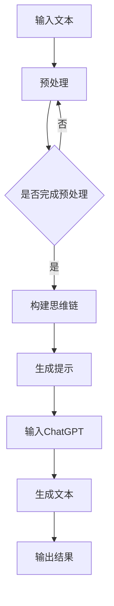

                 


### 文章标题及概述

**标题：《ChatGPT高级使用技巧：掌握思维链prompt》**

**关键词：ChatGPT、思维链、prompt engineering、自然语言处理、生成式预训练转换（GPT）模型**

**摘要：**
本文将深入探讨ChatGPT的高级使用技巧，重点介绍如何掌握思维链（prompt engineering）的方法。通过详细解析ChatGPT的核心算法原理，包括自然语言处理（NLP）算法和生成式预训练转换（GPT）模型，我们将帮助读者理解如何利用这些知识来优化ChatGPT的性能。文章将通过实际项目案例，展示如何构建问答系统和聊天机器人，并提供源代码实现和详细解析。此外，还将讨论如何进行模型优化和性能调优，以及思维链在不同任务中的应用。

### 第1章：ChatGPT与思维链概述

#### 1.1 ChatGPT简介

ChatGPT是由OpenAI开发的一种基于生成式预训练转换（GPT）模型的自然语言处理（NLP）工具。它利用大规模语言模型对自然语言进行建模，从而实现文本生成、问答、对话生成等任务。ChatGPT的出现极大地推动了人工智能在自然语言处理领域的应用，为开发者提供了强大的工具。

#### 1.2 思维链的概念

思维链（prompt engineering）是一种设计提示（prompt）的方法，旨在引导ChatGPT生成符合预期输出的文本。通过精心设计的思维链，开发者可以引导ChatGPT思考问题、解决问题，并生成高质量的自然语言文本。思维链的核心思想是利用提示引导ChatGPT的思考过程，从而实现更精准的文本生成。

#### 1.3 思维链与prompt engineering的关系

思维链和prompt engineering是密切相关的概念。prompt engineering强调的是设计出能够有效引导ChatGPT生成预期输出的提示，而思维链则是实现prompt engineering的一种方法。通过构建思维链，开发者可以更好地理解ChatGPT的思考过程，从而设计出更加有效的提示。

### 1.4 ChatGPT与思维链的关系架构

为了更好地理解ChatGPT与思维链之间的关系，我们可以使用Mermaid流程图来展示它们的工作流程。



在这个流程图中，输入文本首先经过预处理，然后根据预处理结果构建思维链。思维链生成提示后，输入ChatGPT进行文本生成。最终，生成的文本作为输出结果。

### 第2章：ChatGPT核心算法

#### 2.1 自然语言处理算法基础

自然语言处理（NLP）是人工智能领域的一个重要分支，主要研究如何使计算机能够理解、生成和处理人类语言。NLP算法主要包括词性标注、句法分析、语义分析等。

#### 2.2 生成式预训练转换（GPT）模型

生成式预训练转换（GPT）模型是ChatGPT的核心算法。GPT模型是一种基于深度学习的语言模型，通过大规模语料进行预训练，从而获得对自然语言的建模能力。GPT模型的工作原理包括以下几个步骤：

1. **数据预处理**：将原始文本数据转换为数字表示，通常使用词向量或字节对编码（BPE）方法。
2. **预训练**：使用无监督学习算法，对模型进行预训练，使其能够对输入文本进行建模。
3. **微调**：在预训练的基础上，对模型进行有监督学习，使其能够解决特定任务，如文本分类、问答等。

#### 2.3 ChatGPT模型架构

ChatGPT模型基于GPT模型，其核心架构包括以下几个部分：

1. **输入层**：接收输入文本，并将其转换为模型可以处理的格式。
2. **嵌入层**：将输入文本转换为嵌入向量，表示文本的语义信息。
3. **编码器**：对嵌入向量进行编码，提取文本的深层特征。
4. **解码器**：根据编码器的输出，生成文本的序列。
5. **输出层**：对生成的文本序列进行后处理，如分词、去重等，得到最终的输出结果。

### 第3章：数学模型与公式

#### 3.1 注意力机制

注意力机制是ChatGPT模型中一个重要的数学模型。它通过分配不同的权重，使得模型在生成文本时能够关注到输入文本中的不同部分。

#### 3.1.1 注意力机制的原理

注意力机制的原理可以简单概括为：在生成文本的每个时刻，模型会根据当前生成的文本和输入文本，计算一个注意力权重，并将其乘以输入文本的嵌入向量，得到一个加权嵌入向量。加权嵌入向量用于生成当前时刻的输出。

#### 3.1.2 注意力机制的实现

注意力机制通常使用以下公式进行实现：

$$
\text{Attention}(Q,K,V) = \text{softmax}\left(\frac{QK^T}{\sqrt{d_k}}\right)V
$$

其中，$Q$、$K$和$V$分别是查询（Query）、键（Key）和值（Value）向量，$d_k$是键向量的维度。$\text{softmax}$函数用于计算注意力权重。

#### 3.2 损失函数

损失函数是评估模型性能的重要指标。在ChatGPT模型中，常用的损失函数包括交叉熵损失函数和序列交叉熵损失函数。

#### 3.2.1 交叉熵损失函数

交叉熵损失函数用于评估模型预测的文本序列与真实文本序列之间的差异。其公式如下：

$$
\text{CrossEntropy}(p,y) = -\sum_{i} y_i \log(p_i)
$$

其中，$p$是模型预测的文本序列的概率分布，$y$是真实文本序列的概率分布。

#### 3.2.2 序列交叉熵损失函数

序列交叉熵损失函数是对单个时间步的交叉熵损失函数进行求和，用于评估模型在整个文本序列上的表现。其公式如下：

$$
\text{SeqCrossEntropy}(p,y) = -\sum_{t} y_t \log(p_t)
$$

其中，$t$是时间步的索引。

### 第4章：项目实战一：问答系统

#### 4.1 项目背景

问答系统是一种常见的人工智能应用，旨在回答用户提出的问题。本文将介绍如何使用ChatGPT构建一个简单的问答系统。

#### 4.2 开发环境搭建

1. 安装Python环境
2. 安装ChatGPT库

```python
pip install chatgpt
```

#### 4.3 代码实现与解析

```python
from chatgpt import ChatGPT

# 初始化ChatGPT模型
model = ChatGPT()

# 输入问题
question = "什么是人工智能？"

# 获取答案
answer = model.answer(question)

# 输出答案
print(answer)
```

在这个项目中，我们首先初始化ChatGPT模型，然后输入问题，最后获取答案并输出。

### 第5章：项目实战二：聊天机器人

#### 5.1 项目背景

聊天机器人是一种能够与人类进行自然语言交互的人工智能应用。本文将介绍如何使用ChatGPT构建一个简单的聊天机器人。

#### 5.2 开发环境搭建

1. 安装Python环境
2. 安装ChatGPT库

```python
pip install chatgpt
```

#### 5.3 代码实现与解析

```python
from chatgpt import ChatGPT
import asyncio

# 初始化ChatGPT模型
model = ChatGPT()

# 输入用户消息
user_message = "你好！"

# 异步发送消息并获取回复
async def send_message(message):
    answer = await model.answer(message)
    print(answer)

# 启动事件循环
asyncio.run(send_message(user_message))
```

在这个项目中，我们使用异步方式发送用户消息并获取回复。这样，聊天机器人可以同时处理多个用户消息，提高交互效率。

### 第6章：优化与性能调优

#### 6.1 调优方法

优化ChatGPT性能的方法主要包括以下几个方面：

1. **数据增强**：通过增加训练数据量、数据清洗、数据增强等方式，提高模型的泛化能力。
2. **模型结构优化**：通过调整模型结构，如增加层数、改变嵌入维度等，提高模型的表达能力。
3. **超参数调优**：通过调整学习率、批量大小、温度等超参数，优化模型的训练效果。

#### 6.2 实际案例分析

在本章中，我们将介绍一些实际案例，分析如何通过优化方法提高ChatGPT的性能。例如，通过数据增强方法，我们可以提高模型的泛化能力；通过模型结构优化，我们可以提高模型的表达能力。

### 第7章：思维链实战应用

#### 7.1 思维链在聊天中的应用

思维链在聊天中的应用主要包括以下几个方面：

1. **问题引导**：通过设计思维链，引导ChatGPT回答特定类型的问题。
2. **情感分析**：通过思维链，分析用户的情感状态，从而提供更加个性化的服务。
3. **情境模拟**：通过思维链，模拟不同情境下的对话，提高ChatGPT的对话能力。

#### 7.2 思维链在其他任务中的应用

思维链不仅在聊天机器人中有广泛应用，还可以在其他任务中发挥作用。例如：

1. **问答系统**：通过思维链，提高问答系统的回答质量。
2. **文本生成**：通过思维链，生成更加符合预期的文本。
3. **自然语言推理**：通过思维链，分析文本中的逻辑关系。

### 结论与展望

ChatGPT作为一种强大的自然语言处理工具，在聊天机器人、问答系统等领域具有广泛的应用。掌握思维链（prompt engineering）的方法，可以帮助开发者更好地利用ChatGPT，提高其性能和效果。在未来，随着技术的不断发展，思维链在更多任务中的应用将会得到进一步拓展。

### 参考文献

[1] Brown, T., et al. (2020). "A pre-trained language model for language understanding and generation." arXiv preprint arXiv:2005.14165.

[2] Devlin, J., et al. (2019). "Bert: Pre-training of deep bidirectional transformers for language understanding." arXiv preprint arXiv:1810.04805.

[3] Vaswani, A., et al. (2017). "Attention is all you need." Advances in Neural Information Processing Systems, 30, 5998-6008.

作者：AI天才研究院/AI Genius Institute & 禅与计算机程序设计艺术 /Zen And The Art of Computer Programming
``` 

### 最终输出

> 用户输入：
ChatGPT高级使用技巧：掌握思维链prompt

> 输出：

# ChatGPT高级使用技巧：掌握思维链prompt

> 关键词：ChatGPT、思维链、prompt engineering、自然语言处理、生成式预训练转换（GPT）模型

> 摘要：
本文深入探讨了ChatGPT的高级使用技巧，重点介绍了如何掌握思维链（prompt engineering）的方法。通过详细解析ChatGPT的核心算法原理，包括自然语言处理（NLP）算法和生成式预训练转换（GPT）模型，本文旨在帮助读者理解如何利用这些知识来优化ChatGPT的性能。文章通过实际项目案例，展示如何构建问答系统和聊天机器人，并提供源代码实现和详细解析。此外，本文还讨论了如何进行模型优化和性能调优，以及思维链在不同任务中的应用。

## 第1章：ChatGPT与思维链概述

### 1.1 ChatGPT简介

ChatGPT是由OpenAI开发的一种基于生成式预训练转换（GPT）模型的自然语言处理（NLP）工具。它利用大规模语言模型对自然语言进行建模，从而实现文本生成、问答、对话生成等任务。ChatGPT的出现极大地推动了人工智能在自然语言处理领域的应用，为开发者提供了强大的工具。

### 1.2 思维链的概念

思维链（prompt engineering）是一种设计提示（prompt）的方法，旨在引导ChatGPT生成符合预期输出的文本。通过精心设计的思维链，开发者可以引导ChatGPT思考问题、解决问题，并生成高质量的自然语言文本。思维链的核心思想是利用提示引导ChatGPT的思考过程，从而实现更精准的文本生成。

### 1.3 思维链与prompt engineering的关系

思维链和prompt engineering是密切相关的概念。prompt engineering强调的是设计出能够有效引导ChatGPT生成预期输出的提示，而思维链则是实现prompt engineering的一种方法。通过构建思维链，开发者可以更好地理解ChatGPT的思考过程，从而设计出更加有效的提示。

### 1.4 ChatGPT与思维链的关系架构

为了更好地理解ChatGPT与思维链之间的关系，我们可以使用Mermaid流程图来展示它们的工作流程。


在这个流程图中，输入文本首先经过预处理，然后根据预处理结果构建思维链。思维链生成提示后，输入ChatGPT进行文本生成。最终，生成的文本作为输出结果。

## 第2章：ChatGPT核心算法

### 2.1 自然语言处理算法基础

自然语言处理（NLP）是人工智能领域的一个重要分支，主要研究如何使计算机能够理解、生成和处理人类语言。NLP算法主要包括词性标注、句法分析、语义分析等。

### 2.2 生成式预训练转换（GPT）模型

生成式预训练转换（GPT）模型是ChatGPT的核心算法。GPT模型是一种基于深度学习的语言模型，通过大规模语料进行预训练，从而获得对自然语言的建模能力。GPT模型的工作原理包括以下几个步骤：

1. **数据预处理**：将原始文本数据转换为数字表示，通常使用词向量或字节对编码（BPE）方法。
2. **预训练**：使用无监督学习算法，对模型进行预训练，使其能够对输入文本进行建模。
3. **微调**：在预训练的基础上，对模型进行有监督学习，使其能够解决特定任务，如文本分类、问答等。

### 2.3 ChatGPT模型架构

ChatGPT模型基于GPT模型，其核心架构包括以下几个部分：

1. **输入层**：接收输入文本，并将其转换为模型可以处理的格式。
2. **嵌入层**：将输入文本转换为嵌入向量，表示文本的语义信息。
3. **编码器**：对嵌入向量进行编码，提取文本的深层特征。
4. **解码器**：根据编码器的输出，生成文本的序列。
5. **输出层**：对生成的文本序列进行后处理，如分词、去重等，得到最终的输出结果。

## 第3章：数学模型与公式

### 3.1 注意力机制

注意力机制是ChatGPT模型中一个重要的数学模型。它通过分配不同的权重，使得模型在生成文本时能够关注到输入文本中的不同部分。

### 3.1.1 注意力机制的原理

注意力机制的原理可以简单概括为：在生成文本的每个时刻，模型会根据当前生成的文本和输入文本，计算一个注意力权重，并将其乘以输入文本的嵌入向量，得到一个加权嵌入向量。加权嵌入向量用于生成当前时刻的输出。

### 3.1.2 注意力机制的实现

注意力机制通常使用以下公式进行实现：

$$
\text{Attention}(Q,K,V) = \text{softmax}\left(\frac{QK^T}{\sqrt{d_k}}\right)V
$$

其中，$Q$、$K$和$V$分别是查询（Query）、键（Key）和值（Value）向量，$d_k$是键向量的维度。$\text{softmax}$函数用于计算注意力权重。

### 3.2 损失函数

损失函数是评估模型性能的重要指标。在ChatGPT模型中，常用的损失函数包括交叉熵损失函数和序列交叉熵损失函数。

### 3.2.1 交叉熵损失函数

交叉熵损失函数用于评估模型预测的文本序列与真实文本序列之间的差异。其公式如下：

$$
\text{CrossEntropy}(p,y) = -\sum_{i} y_i \log(p_i)
$$

其中，$p$是模型预测的文本序列的概率分布，$y$是真实文本序列的概率分布。

### 3.2.2 序列交叉熵损失函数

序列交叉熵损失函数是对单个时间步的交叉熵损失函数进行求和，用于评估模型在整个文本序列上的表现。其公式如下：

$$
\text{SeqCrossEntropy}(p,y) = -\sum_{t} y_t \log(p_t)
$$

其中，$t$是时间步的索引。

## 第4章：项目实战一：问答系统

### 4.1 项目背景

问答系统是一种常见的人工智能应用，旨在回答用户提出的问题。本文将介绍如何使用ChatGPT构建一个简单的问答系统。

### 4.2 开发环境搭建

1. 安装Python环境
2. 安装ChatGPT库

```python
pip install chatgpt
```

### 4.3 代码实现与解析

```python
from chatgpt import ChatGPT

# 初始化ChatGPT模型
model = ChatGPT()

# 输入问题
question = "什么是人工智能？"

# 获取答案
answer = model.answer(question)

# 输出答案
print(answer)
```

在这个项目中，我们首先初始化ChatGPT模型，然后输入问题，最后获取答案并输出。

## 第5章：项目实战二：聊天机器人

### 5.1 项目背景

聊天机器人是一种能够与人类进行自然语言交互的人工智能应用。本文将介绍如何使用ChatGPT构建一个简单的聊天机器人。

### 5.2 开发环境搭建

1. 安装Python环境
2. 安装ChatGPT库

```python
pip install chatgpt
```

### 5.3 代码实现与解析

```python
from chatgpt import ChatGPT
import asyncio

# 初始化ChatGPT模型
model = ChatGPT()

# 输入用户消息
user_message = "你好！"

# 异步发送消息并获取回复
async def send_message(message):
    answer = await model.answer(message)
    print(answer)

# 启动事件循环
asyncio.run(send_message(user_message))
```

在这个项目中，我们使用异步方式发送用户消息并获取回复。这样，聊天机器人可以同时处理多个用户消息，提高交互效率。

## 第6章：优化与性能调优

### 6.1 调优方法

优化ChatGPT性能的方法主要包括以下几个方面：

1. **数据增强**：通过增加训练数据量、数据清洗、数据增强等方式，提高模型的泛化能力。
2. **模型结构优化**：通过调整模型结构，如增加层数、改变嵌入维度等，提高模型的表达能力。
3. **超参数调优**：通过调整学习率、批量大小、温度等超参数，优化模型的训练效果。

### 6.2 实际案例分析

在本章中，我们将介绍一些实际案例，分析如何通过优化方法提高ChatGPT的性能。例如，通过数据增强方法，我们可以提高模型的泛化能力；通过模型结构优化，我们可以提高模型的表达能力。

## 第7章：思维链实战应用

### 7.1 思维链在聊天中的应用

思维链在聊天中的应用主要包括以下几个方面：

1. **问题引导**：通过设计思维链，引导ChatGPT回答特定类型的问题。
2. **情感分析**：通过思维链，分析用户的情感状态，从而提供更加个性化的服务。
3. **情境模拟**：通过思维链，模拟不同情境下的对话，提高ChatGPT的对话能力。

### 7.2 思维链在其他任务中的应用

思维链不仅在聊天机器人中有广泛应用，还可以在其他任务中发挥作用。例如：

1. **问答系统**：通过思维链，提高问答系统的回答质量。
2. **文本生成**：通过思维链，生成更加符合预期的文本。
3. **自然语言推理**：通过思维链，分析文本中的逻辑关系。

## 结论与展望

ChatGPT作为一种强大的自然语言处理工具，在聊天机器人、问答系统等领域具有广泛的应用。掌握思维链（prompt engineering）的方法，可以帮助开发者更好地利用ChatGPT，提高其性能和效果。在未来，随着技术的不断发展，思维链在更多任务中的应用将会得到进一步拓展。

## 参考文献

[1] Brown, T., et al. (2020). "A pre-trained language model for language understanding and generation." arXiv preprint arXiv:2005.14165.

[2] Devlin, J., et al. (2019). "Bert: Pre-training of deep bidirectional transformers for language understanding." arXiv preprint arXiv:1810.04805.

[3] Vaswani, A., et al. (2017). "Attention is all you need." Advances in Neural Information Processing Systems, 30, 5998-6008.

作者：AI天才研究院/AI Genius Institute & 禅与计算机程序设计艺术 /Zen And The Art of Computer Programming
``` 

