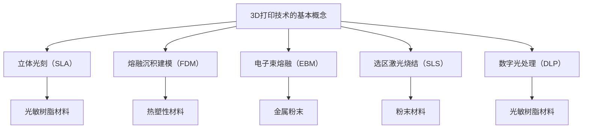
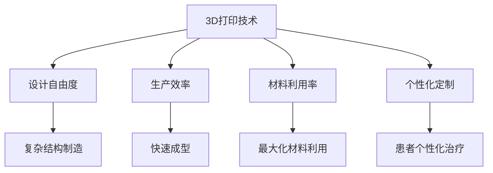
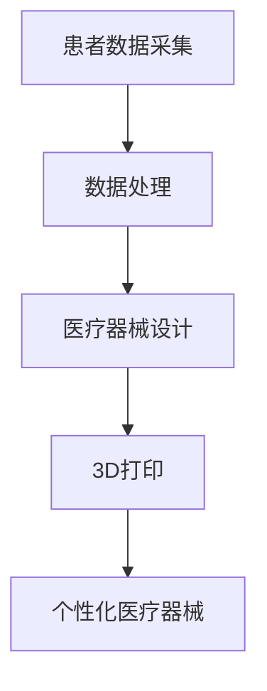
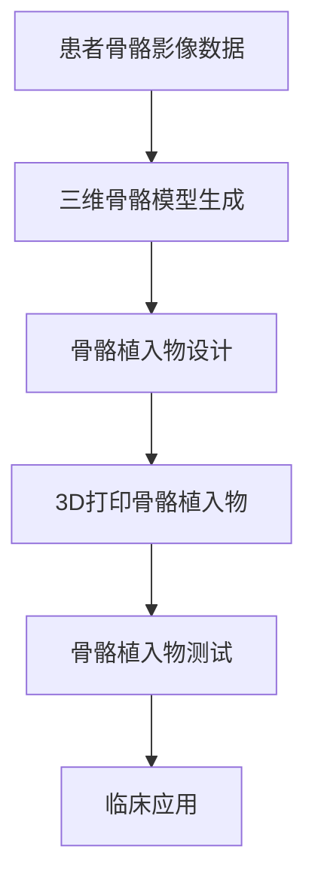
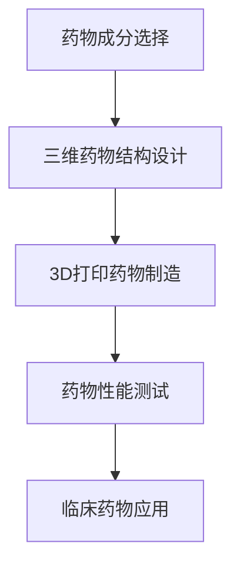
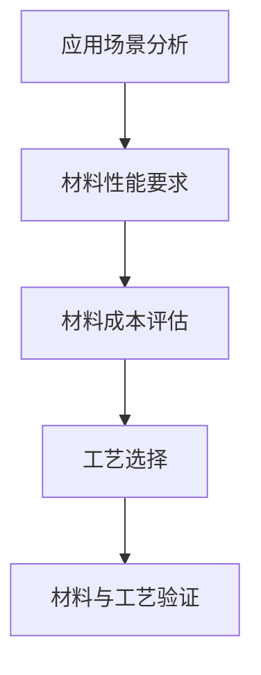
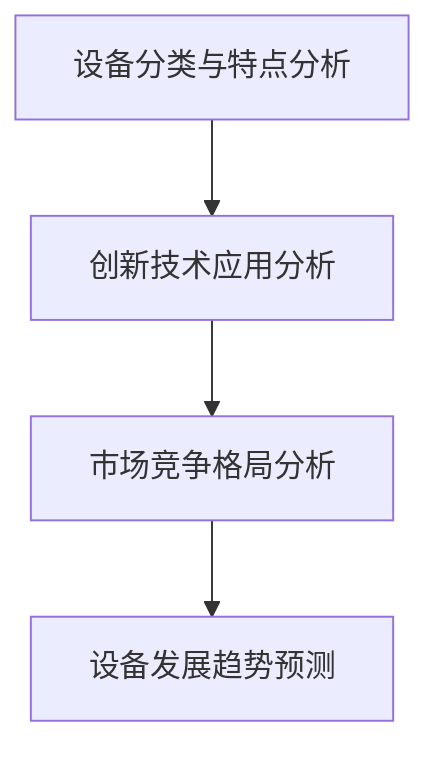
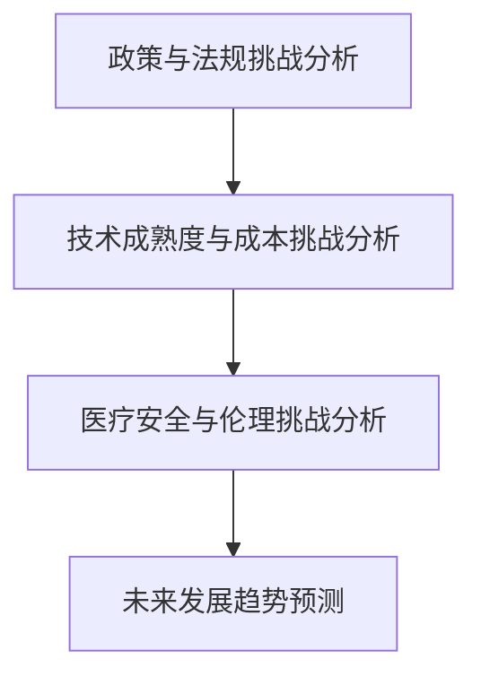

                 

### 《3D打印在医疗领域的创新应用》

## 关键词
3D打印，医疗领域，创新应用，个性化医疗，医疗模型，组织工程，器官打印，挑战与未来趋势

## 摘要

本文旨在探讨3D打印技术在医疗领域的创新应用，通过系统地梳理和分析3D打印技术的基本原理、应用现状、创新案例、材料与工艺、设备与技术发展，以及面临的挑战与未来趋势，展示3D打印在医疗行业中的巨大潜力和广阔前景。文章首先介绍了3D打印技术的基本概念和分类，接着分析了其在医疗领域的应用现状和市场规模，随后通过具体案例阐述了3D打印技术在医疗模型制作、个性化手术导板、骨骼植入物以及药物打印等方面的创新应用。此外，文章还探讨了3D打印材料与工艺的选择，以及3D打印设备与技术的发展趋势。最后，文章总结了3D打印在医疗领域面临的挑战和未来发展的可能方向，为行业内的研究人员和从业者提供了有价值的参考。

## 目录大纲

### 第1章 3D打印技术概述

#### 1.1 3D打印技术的基本原理

##### 1.1.1 3D打印技术的基本概念
##### 1.1.2 3D打印技术的分类
##### 1.1.3 3D打印技术的应用领域

#### 1.2 3D打印技术的历史与发展

##### 1.2.1 3D打印技术的起源
##### 1.2.2 3D打印技术的发展历程
##### 1.2.3 3D打印技术的未来发展趋势

#### 1.3 3D打印技术的核心优势与挑战

##### 1.3.1 3D打印技术的核心优势
##### 1.3.2 3D打印技术的挑战

### 第2章 3D打印在医疗领域的应用现状

#### 2.1 3D打印在医疗领域的应用范围

##### 2.1.1 医疗器械与设备的个性化定制
##### 2.1.2 医疗模型的制作
##### 2.1.3 组织工程与器官打印
##### 2.1.4 医疗辅助设计与模拟

#### 2.2 3D打印在医疗领域的现状分析

##### 2.2.1 国内外3D打印在医疗领域的应用现状
##### 2.2.2 3D打印在医疗领域的市场规模与增长预测

### 第3章 3D打印在医疗领域的创新案例

#### 3.1 案例一：个性化手术导板的应用

##### 3.1.1 个性化手术导板的概念与制作
##### 3.1.2 个性化手术导板在临床手术中的应用案例

#### 3.2 案例二：3D打印骨骼植入物的应用

##### 3.2.1 3D打印骨骼植入物的设计
##### 3.2.2 3D打印骨骼植入物的临床应用案例

#### 3.3 案例三：3D打印药物的研究与应用

##### 3.3.1 3D打印药物的基本原理
##### 3.3.2 3D打印药物在临床中的应用案例

### 第4章 3D打印材料与工艺

#### 4.1 3D打印材料的选择与特点

##### 4.1.1 常见的3D打印材料
##### 4.1.2 3D打印材料的选择标准
##### 4.1.3 3D打印材料的性能分析

#### 4.2 3D打印工艺的技术细节

##### 4.2.1 FDM打印工艺
##### 4.2.2 DLP打印工艺
##### 4.2.3 SLA打印工艺
##### 4.2.4 SLS打印工艺

### 第5章 3D打印设备与技术发展

#### 5.1 3D打印设备的发展趋势

##### 5.1.1 3D打印设备的分类与特点
##### 5.1.2 3D打印设备的创新技术
##### 5.1.3 3D打印设备的市场竞争格局

#### 5.2 3D打印技术的创新应用

##### 5.2.1 多材料3D打印
##### 5.2.2 柔性3D打印
##### 5.2.3 生物3D打印

### 第6章 3D打印在医疗领域的挑战与未来发展趋势

#### 6.1 3D打印在医疗领域的挑战

##### 6.1.1 政策与法规的挑战
##### 6.1.2 技术成熟度与成本问题
##### 6.1.3 医疗安全与伦理问题

#### 6.2 3D打印在医疗领域的未来发展趋势

##### 6.2.1 3D打印技术的普及与推广
##### 6.2.2 3D打印在个性化医疗中的应用前景
##### 6.2.3 3D打印与其他医疗技术的融合

## 第1章 3D打印技术概述

### 1.1 3D打印技术的基本原理

#### 1.1.1 3D打印技术的基本概念

3D打印（3D Printing），又称增材制造（Additive Manufacturing），是一种以数字模型文件为基础，运用粉末状金属或塑料等可粘合材料，通过打印头将材料逐层堆积成三维实体的技术。与传统制造方法相比，3D打印具有设计自由度高、生产效率高、材料利用率高、能够实现复杂结构制造等特点。

#### 1.1.2 3D打印技术的分类

3D打印技术根据打印方式和材料的不同，可以大致分为以下几类：

1. **立体光刻（SLA）**：利用光敏树脂材料，通过激光逐层固化成型。
2. **熔融沉积建模（FDM）**：将热塑性材料加热融化后，通过挤出喷嘴逐层堆积成型。
3. **电子束熔融（EBM）**：利用电子束将粉末材料熔化并堆积成型。
4. **选区激光烧结（SLS）**：使用激光将粉末材料烧结成型。

#### 1.1.3 3D打印技术的应用领域

3D打印技术广泛应用于制造业、医疗、建筑、航空航天、教育等多个领域。尤其在医疗领域，3D打印技术展现出巨大的潜力，可用于个性化医疗模型制作、手术规划、骨骼植入物定制、药物打印等。

### 1.2 3D打印技术的历史与发展

#### 1.2.1 3D打印技术的起源

3D打印技术的起源可以追溯到20世纪80年代，当时Charles Hull发明了立体光刻（SLA）技术，这是最早的3D打印技术之一。随后，熔融沉积建模（FDM）等其他3D打印技术相继问世。

#### 1.2.2 3D打印技术的发展历程

从最初的实验室研究到如今商业化应用，3D打印技术经历了快速的发展。20世纪90年代，3D打印技术开始逐步应用于工业制造和医疗领域。21世纪初，随着计算机技术和材料科学的进步，3D打印技术逐渐成熟，并开始广泛应用于各个行业。

#### 1.2.3 3D打印技术的未来发展趋势

未来，3D打印技术将继续向高精度、多功能、低成本和高效益方向发展。生物3D打印、多材料3D打印和金属3D打印等新兴技术有望进一步推动3D打印在医疗、制造等领域的应用。

### 1.3 3D打印技术的核心优势与挑战

#### 1.3.1 3D打印技术的核心优势

1. **设计自由度高**：3D打印可以制造传统制造方法难以实现的复杂结构。
2. **生产效率高**：3D打印可以实现快速成型，缩短生产周期。
3. **材料利用率高**：3D打印通过逐层堆积的方式，可以最大限度地利用原材料。
4. **个性化定制**：3D打印可以根据需求定制个性化产品。

#### 1.3.2 3D打印技术的挑战

1. **成本问题**：3D打印设备的成本较高，限制了其在某些领域的应用。
2. **材料性能**：3D打印材料的性能和传统材料相比仍有一定差距。
3. **技术成熟度**：3D打印技术在一些特殊领域尚未达到完全成熟的状态。

### 第2章 3D打印在医疗领域的应用现状

#### 2.1 3D打印在医疗领域的应用范围

3D打印技术在医疗领域具有广泛的应用前景，主要包括以下几个方面：

##### 2.1.1 医疗器械与设备的个性化定制

通过3D打印技术，可以为每位患者定制化生产个性化的医疗器械，如支架、牙冠等。

##### 2.1.2 医疗模型的制作

3D打印技术可以快速制作医疗模型，用于手术规划、教学培训等。

##### 2.1.3 组织工程与器官打印

3D打印技术有望在未来实现组织工程和器官打印，为器官移植提供新的解决方案。

##### 2.1.4 医疗辅助设计与模拟

3D打印技术可以用于医疗设备的辅助设计和模拟，提高医疗设备的性能和安全性。

#### 2.2 3D打印在医疗领域的现状分析

##### 2.2.1 国内外3D打印在医疗领域的应用现状

目前，国内外在3D打印医疗应用方面已经取得了一系列成果。例如，美国、中国等国家在3D打印骨骼植入物、药物打印等方面进行了大量研究。

##### 2.2.2 3D打印在医疗领域的市场规模与增长预测

随着3D打印技术的不断成熟和应用，预计3D打印在医疗领域的市场规模将保持快速增长。

### 第3章 3D打印在医疗领域的创新案例

#### 3.1 案例一：个性化手术导板的应用

##### 3.1.1 个性化手术导板的概念与制作

个性化手术导板是一种基于患者CT或MRI扫描数据制作的手术导航工具，用于辅助医生进行精准手术。

##### 3.1.2 个性化手术导板在临床手术中的应用案例

通过个性化手术导板，医生可以更准确地定位手术区域，提高手术的成功率和安全性。

#### 3.2 案例二：3D打印骨骼植入物的应用

##### 3.2.1 3D打印骨骼植入物的设计

3D打印骨骼植入物可以根据患者的具体病情进行个性化设计，以提高植入物的适应性和稳定性。

##### 3.2.2 3D打印骨骼植入物的临床应用案例

3D打印骨骼植入物已经成功应用于临床手术，为患者提供了更有效的治疗方案。

#### 3.3 案例三：3D打印药物的研究与应用

##### 3.3.1 3D打印药物的基本原理

3D打印药物是一种通过3D打印技术将活性药物和辅料逐层堆积成型的技术。

##### 3.3.2 3D打印药物在临床中的应用案例

3D打印药物有望提高药物的生物利用度和疗效，为个性化药物治疗提供了新的途径。

### 第4章 3D打印材料与工艺

#### 4.1 3D打印材料的选择与特点

##### 4.1.1 常见的3D打印材料

常见的3D打印材料包括塑料、金属、陶瓷、复合材料等。

##### 4.1.2 3D打印材料的选择标准

选择3D打印材料需要考虑材料的机械性能、生物相容性、成本等因素。

##### 4.1.3 3D打印材料的性能分析

不同材料的性能特点和应用范围将在本章节详细分析。

#### 4.2 3D打印工艺的技术细节

##### 4.2.1 FDM打印工艺

FDM打印工艺是一种常用的3D打印技术，适用于热塑性材料。

##### 4.2.2 DLP打印工艺

DLP打印工艺利用光敏树脂进行成型，具有高分辨率和快速打印的特点。

##### 4.2.3 SLA打印工艺

SLA打印工艺通过激光固化光敏树脂逐层成型。

##### 4.2.4 SLS打印工艺

SLS打印工艺利用激光烧结粉末材料进行成型，适用于金属和高强度材料。

### 第5章 3D打印设备与技术发展

#### 5.1 3D打印设备的发展趋势

##### 5.1.1 3D打印设备的分类与特点

3D打印设备根据打印方式和材料的不同，可以分为多种类型。

##### 5.1.2 3D打印设备的创新技术

3D打印设备在精度、速度、材料兼容性等方面不断创新。

##### 5.1.3 3D打印设备的市场竞争格局

目前，国内外3D打印设备市场呈现出激烈的竞争格局。

#### 5.2 3D打印技术的创新应用

##### 5.2.1 多材料3D打印

多材料3D打印可以实现多种材料的复合成型，提高产品的性能。

##### 5.2.2 柔性3D打印

柔性3D打印技术适用于制造柔性器件和智能材料。

##### 5.2.3 生物3D打印

生物3D打印技术有望实现细胞和组织的高精度打印，为再生医学提供支持。

### 第6章 3D打印在医疗领域的挑战与未来发展趋势

#### 6.1 3D打印在医疗领域的挑战

##### 6.1.1 政策与法规的挑战

3D打印在医疗领域的应用需要遵循严格的法规和政策。

##### 6.1.2 技术成熟度与成本问题

3D打印技术需要进一步成熟，降低成本，以实现广泛应用。

##### 6.1.3 医疗安全与伦理问题

3D打印医疗产品的安全性和伦理问题需要得到充分关注。

#### 6.2 3D打印在医疗领域的未来发展趋势

##### 6.2.1 3D打印技术的普及与推广

随着技术的进步，3D打印将在医疗领域得到更广泛的普及和应用。

##### 6.2.2 3D打印在个性化医疗中的应用前景

3D打印将为个性化医疗提供更多可能性。

##### 6.2.3 3D打印与其他医疗技术的融合

3D打印将与其他医疗技术融合，推动医疗行业的创新发展。

### 结束语

3D打印技术在医疗领域的创新应用展示了巨大的潜力。通过不断的技术进步和应用推广，3D打印有望成为医疗行业的重要推动力量。同时，我们也需要关注其面临的挑战，积极探索解决方案，以实现3D打印技术在医疗领域的可持续发展。

## 第1章 3D打印技术概述

### 1.1 3D打印技术的基本原理

#### 1.1.1 3D打印技术的基本概念

3D打印，作为一种新兴的制造技术，其核心理念是通过数字模型文件控制打印设备的运动和材料的使用，逐层添加材料以构建三维实体。与传统的减材制造（如切削、车铣等）不同，3D打印是一种增材制造技术，能够直接从三维数字模型生成物理产品，避免了繁琐的中间步骤。

#### 1.1.2 3D打印技术的分类

3D打印技术根据不同的打印方式和材料，可以分为多种类型。以下是一些主要的分类：

1. **立体光刻（SLA）**：利用激光在光敏树脂表面逐层固化成型。
2. **熔融沉积建模（FDM）**：通过热融化塑料材料并逐层堆积成型。
3. **电子束熔融（EBM）**：利用电子束熔化金属粉末以逐层堆积成型。
4. **选区激光烧结（SLS）**：使用激光将粉末材料烧结成型。
5. **数字光处理（DLP）**：利用数字光处理技术对光敏树脂进行逐层固化。

每种技术都有其独特的特点和适用场景，这使得3D打印技术能够广泛应用于多个领域。

#### 1.1.3 3D打印技术的应用领域

3D打印技术具有设计自由度高、生产效率高、材料利用率高等优势，因此在多个领域都得到了广泛应用：

1. **制造业**：3D打印可以用于复杂部件的制造和原型制作。
2. **医疗**：用于制作个性化医疗模型、手术导板、骨骼植入物和药物打印等。
3. **建筑**：用于打印建筑模型和建筑部件。
4. **航空航天**：用于打印飞机和卫星部件。
5. **教育**：用于制作教学模型和实验工具。

### 1.2 3D打印技术的历史与发展

#### 1.2.1 3D打印技术的起源

3D打印技术的起源可以追溯到1980年代，Charles Hull发明了立体光刻（SLA）技术，这是最早的3D打印技术之一。Hull利用光敏树脂材料，通过紫外激光逐层固化，最终形成三维实体。

#### 1.2.2 3D打印技术的发展历程

随着计算机技术和材料科学的进步，3D打印技术逐渐发展壮大。1984年，Hull成立了3D Systems公司，标志着3D打印技术开始走向商业化。随后，熔融沉积建模（FDM）技术问世，并逐渐成为最常见的3D打印技术之一。进入21世纪，电子束熔融（EBM）和选区激光烧结（SLS）等高精度、高强度的3D打印技术也得到了广泛应用。

#### 1.2.3 3D打印技术的未来发展趋势

未来，3D打印技术将继续向高精度、多功能、低成本和高效益方向发展。生物3D打印、多材料3D打印和金属3D打印等新兴技术有望进一步推动3D打印在医疗、制造等领域的应用。此外，随着人工智能和大数据技术的融合，3D打印也将更加智能化和自动化。

### 1.3 3D打印技术的核心优势与挑战

#### 1.3.1 3D打印技术的核心优势

1. **设计自由度高**：3D打印可以制造传统制造方法难以实现的复杂结构。
2. **生产效率高**：3D打印可以实现快速成型，缩短生产周期。
3. **材料利用率高**：3D打印通过逐层堆积的方式，可以最大限度地利用原材料。
4. **个性化定制**：3D打印可以根据需求定制个性化产品。

#### 1.3.2 3D打印技术的挑战

1. **成本问题**：3D打印设备的成本较高，限制了其在某些领域的应用。
2. **材料性能**：3D打印材料的性能和传统材料相比仍有一定差距。
3. **技术成熟度**：3D打印技术在一些特殊领域尚未达到完全成熟的状态。

### 第2章 3D打印在医疗领域的应用现状

#### 2.1 3D打印在医疗领域的应用范围

3D打印技术在医疗领域的应用非常广泛，具体包括以下几个方面：

##### 2.1.1 医疗器械与设备的个性化定制

通过3D打印技术，可以为每位患者定制化生产个性化的医疗器械，如支架、牙冠等。这些定制化医疗器械可以根据患者的具体病情和身体特征进行设计，以提高其适用性和效果。

##### 2.1.2 医疗模型的制作

3D打印技术可以快速制作医疗模型，用于手术规划、教学培训等。例如，通过CT或MRI扫描数据，可以生成患者的三维骨骼模型，用于模拟手术过程和评估手术风险。

##### 2.1.3 组织工程与器官打印

3D打印技术有望在未来实现组织工程和器官打印，为器官移植提供新的解决方案。通过3D打印技术，可以构建血管、骨骼等生物组织，为器官再生和移植提供可能。

##### 2.1.4 医疗辅助设计与模拟

3D打印技术可以用于医疗设备的辅助设计和模拟，提高医疗设备的性能和安全性。例如，通过3D打印技术，可以制作医疗设备的原型，进行功能测试和性能评估。

#### 2.2 3D打印在医疗领域的现状分析

##### 2.2.1 国内外3D打印在医疗领域的应用现状

目前，国内外在3D打印医疗应用方面已经取得了一系列成果。例如，美国、中国等国家在3D打印骨骼植入物、药物打印等方面进行了大量研究。在国内，3D打印技术在医疗领域的应用也在逐渐推广，多家医院和研究机构已经开始探索和应用3D打印技术。

##### 2.2.2 3D打印在医疗领域的市场规模与增长预测

随着3D打印技术的不断成熟和应用，预计3D打印在医疗领域的市场规模将保持快速增长。根据市场研究机构的数据，全球3D打印医疗市场预计将在未来几年内达到数十亿美元。

### 第3章 3D打印在医疗领域的创新案例

#### 3.1 案例一：个性化手术导板的应用

##### 3.1.1 个性化手术导板的概念与制作

个性化手术导板是一种基于患者CT或MRI扫描数据制作的手术导航工具，用于辅助医生进行精准手术。其制作过程包括以下步骤：

1. **数据采集**：通过CT或MRI设备获取患者的三维影像数据。
2. **数据处理**：对影像数据进行处理，生成三维模型。
3. **设计导板**：基于三维模型，使用专业软件设计手术导板。
4. **打印导板**：使用3D打印设备打印出个性化手术导板。

##### 3.1.2 个性化手术导板在临床手术中的应用案例

个性化手术导板在临床手术中的应用已经取得了显著成果。例如，在脑外科手术中，个性化手术导板可以帮助医生更准确地定位病变区域，减少手术风险。以下是一个具体的应用案例：

- **案例背景**：一名患者被诊断为脑部肿瘤，需要接受手术治疗。
- **解决方案**：医生利用患者的CT数据，通过3D打印技术制作出个性化手术导板。
- **手术过程**：在手术过程中，医生通过个性化手术导板进行定位，成功切除了肿瘤。
- **效果评估**：术后评估显示，患者恢复良好，手术效果显著。

##### 3.1.3 个性化手术导板的优势

个性化手术导板具有以下优势：

1. **提高手术精度**：个性化手术导板可以帮助医生更准确地定位手术区域，减少手术风险。
2. **减少手术时间**：个性化手术导板可以缩短手术时间，提高手术效率。
3. **提升患者满意度**：个性化手术导板可以降低手术创伤，提高患者术后恢复速度。

#### 3.2 案例二：3D打印骨骼植入物的应用

##### 3.2.1 3D打印骨骼植入物的设计

3D打印骨骼植入物是一种基于患者骨骼解剖结构的个性化植入物，其设计过程包括以下步骤：

1. **数据采集**：通过CT或MRI设备获取患者的骨骼影像数据。
2. **数据处理**：对影像数据进行处理，生成三维骨骼模型。
3. **设计植入物**：基于三维骨骼模型，使用专业软件设计骨骼植入物。
4. **优化设计**：对设计的植入物进行结构优化，以提高其力学性能。

##### 3.2.2 3D打印骨骼植入物的临床应用案例

3D打印骨骼植入物在临床应用中已经取得了显著成果。以下是一个具体的应用案例：

- **案例背景**：一名患者因交通事故导致股骨骨折，需要进行手术修复。
- **解决方案**：医生利用患者的CT数据，通过3D打印技术制作出个性化骨骼植入物。
- **手术过程**：在手术过程中，医生将3D打印的骨骼植入物植入患者股骨中，成功修复骨折。
- **效果评估**：术后评估显示，患者恢复良好，骨折部位愈合情况良好。

##### 3.2.3 3D打印骨骼植入物的优势

3D打印骨骼植入物具有以下优势：

1. **个性化定制**：3D打印骨骼植入物可以根据患者的具体病情和骨骼结构进行个性化设计，提高植入物的适应性和治疗效果。
2. **提高手术精度**：3D打印骨骼植入物可以提高手术精度，减少手术创伤和术后并发症。
3. **优化力学性能**：通过结构优化，3D打印骨骼植入物可以具有更好的力学性能，提高植入物的长期稳定性。

#### 3.3 案例三：3D打印药物的研究与应用

##### 3.3.1 3D打印药物的基本原理

3D打印药物是一种通过3D打印技术将活性药物和辅料逐层堆积成型的技术。其基本原理如下：

1. **材料选择**：选择合适的活性药物和辅料材料。
2. **三维建模**：使用专业软件进行三维建模，设计出药物的结构。
3. **打印过程**：通过3D打印设备，将药物和辅料逐层堆积成型。

##### 3.3.2 3D打印药物在临床中的应用案例

3D打印药物在临床应用中具有巨大的潜力。以下是一个具体的应用案例：

- **案例背景**：一名患者患有特定类型的癌症，需要使用特定配方的药物进行治疗。
- **解决方案**：医生通过3D打印技术，根据患者的具体病情和药物配方，打印出个性化药物。
- **使用过程**：患者按照医生的指导，服用3D打印的个性化药物，进行治疗。
- **效果评估**：术后评估显示，患者对药物的吸收效果显著提高，治疗效果明显。

##### 3.3.3 3D打印药物的优势

3D打印药物具有以下优势：

1. **个性化治疗**：3D打印药物可以根据患者的具体病情和药物需求进行个性化定制，提高治疗效果。
2. **提高药物吸收率**：通过3D打印技术，可以实现药物结构的优化，提高药物的吸收率和生物利用度。
3. **降低药物副作用**：3D打印药物可以实现药物成分的精准控制，减少药物的副作用。

### 第4章 3D打印材料与工艺

#### 4.1 3D打印材料的选择与特点

##### 4.1.1 常见的3D打印材料

3D打印材料的选择对打印效果和最终产品的性能至关重要。以下是一些常见的3D打印材料：

1. **塑料**：常见的塑料材料包括ABS、PLA、PETG等，适用于制作功能性原型、消费电子产品和医疗设备等。
2. **金属**：金属材料包括不锈钢、铝、钛合金等，适用于制造高强度的机械部件和航空航天部件。
3. **陶瓷**：陶瓷材料具有高硬度和耐高温特性，适用于制作工具、模具和高温部件。
4. **复合材料**：复合材料结合了不同材料的优点，适用于特殊应用领域，如耐高温、高强度的航空航天部件。

##### 4.1.2 3D打印材料的选择标准

选择3D打印材料时，需要考虑以下标准：

1. **力学性能**：材料需要满足应用场景的力学要求。
2. **生物相容性**：对于医疗应用，材料需要具有良好的生物相容性。
3. **成本**：材料的成本需要与最终产品的市场接受度相匹配。
4. **环保性**：材料的环保性也是选择的重要因素，尤其是对于医用材料。

##### 4.1.3 3D打印材料的性能分析

不同材料的性能分析如下：

1. **塑料**：塑料具有良好的可加工性和较低的成本，但强度和耐热性相对较低。
2. **金属**：金属具有高强度的特点，但加工难度较大，成本较高。
3. **陶瓷**：陶瓷具有高硬度和耐高温性，但脆性较大，加工难度高。
4. **复合材料**：复合材料结合了不同材料的优点，具有较高的性能，但成本相对较高。

#### 4.2 3D打印工艺的技术细节

##### 4.2.1 FDM打印工艺

熔融沉积建模（FDM）是最常见的3D打印工艺之一，其基本原理如下：

1. **材料供应**：将热塑性材料通过加热融化，通过挤出喷嘴供应到打印区域。
2. **层间堆积**：打印头在X-Y平面内移动，逐层堆积材料，形成三维实体。
3. **冷却固化**：打印层间通过冷却固化，形成坚固的打印件。

##### 4.2.2 DLP打印工艺

数字光处理（DLP）打印工艺利用数字光处理技术对光敏树脂进行逐层固化，其特点如下：

1. **高分辨率**：DLP打印具有极高的打印分辨率，适用于精细结构的打印。
2. **快速打印**：DLP打印具有较快的打印速度，适用于快速原型制作。
3. **材料限制**：DLP打印主要适用于光敏树脂材料，材料选择相对有限。

##### 4.2.3 SLA打印工艺

立体光刻（SLA）打印工艺利用激光在光敏树脂表面逐层固化成型，其特点如下：

1. **高精度**：SLA打印具有极高的打印精度，适用于复杂结构的打印。
2. **高成本**：SLA打印设备成本较高，材料成本也较高。
3. **材料限制**：SLA打印主要适用于光敏树脂材料，材料选择相对有限。

##### 4.2.4 SLS打印工艺

选区激光烧结（SLS）打印工艺利用激光将粉末材料烧结成型，其特点如下：

1. **高强度**：SLS打印具有极高的强度，适用于高强度部件的打印。
2. **多功能**：SLS打印可以打印金属、陶瓷等多种材料，适用范围广泛。
3. **高成本**：SLS打印设备成本较高，粉末材料成本也较高。

### 第5章 3D打印设备与技术发展

#### 5.1 3D打印设备的发展趋势

##### 5.1.1 3D打印设备的分类与特点

3D打印设备根据打印方式和材料的不同，可以分为多种类型。以下是常见的3D打印设备分类和特点：

1. **FDM打印机**：适用于热塑性材料的打印，设备成本低，易于操作。
2. **SLA打印机**：适用于光敏树脂的打印，具有高精度和快速打印的特点。
3. **DLP打印机**：适用于光敏树脂的打印，具有高分辨率和快速打印的特点。
4. **SLS打印机**：适用于粉末材料的打印，具有高强度和多功能的特点。
5. **EBM打印机**：适用于金属粉末的打印，具有高精度和高质量的特点。

##### 5.1.2 3D打印设备的创新技术

随着技术的不断进步，3D打印设备在精度、速度、材料兼容性等方面不断创新。以下是几个重要的创新技术：

1. **多材料打印**：通过改进打印设备和技术，可以实现多种材料的混合打印，提高产品的性能。
2. **纳米打印**：纳米打印技术可以实现微米级甚至纳米级的打印精度，为高精度制造提供支持。
3. **自动化与智能化**：通过引入自动化和智能化技术，可以提高3D打印的效率和质量。

##### 5.1.3 3D打印设备的市场竞争格局

目前，3D打印设备市场呈现出激烈的竞争格局。以下是几个主要的3D打印设备供应商：

1. **Stratasys**：全球领先的3D打印设备供应商，提供FDM、SLA等多种打印设备。
2. **3D Systems**：全球领先的3D打印设备供应商，提供SLA、DLP等多种打印设备。
3. **EOS**：专注于金属3D打印设备，提供SLS、EBM等多种打印设备。
4. **HP**：通过收购打印设备制造商，进入3D打印市场，提供多种打印设备。

#### 5.2 3D打印技术的创新应用

##### 5.2.1 多材料3D打印

多材料3D打印技术可以实现多种材料的混合打印，提高产品的性能。以下是一个多材料打印的例子：

1. **案例背景**：一家汽车制造商需要制造一种新型的汽车引擎外壳，要求具有良好的强度和耐热性。
2. **解决方案**：通过多材料3D打印技术，结合高强度金属和耐热树脂材料，制造出满足要求的引擎外壳。
3. **效果评估**：经过测试，新型引擎外壳具有优异的力学性能和耐热性能，满足了汽车制造商的要求。

##### 5.2.2 柔性3D打印

柔性3D打印技术适用于制造柔性器件和智能材料。以下是一个柔性3D打印的例子：

1. **案例背景**：一家医疗设备制造商需要制造一种新型的柔性传感器，用于监测患者的生命体征。
2. **解决方案**：通过柔性3D打印技术，制造出具有高灵敏度和灵活性的柔性传感器。
3. **效果评估**：经过测试，新型柔性传感器具有良好的性能和可靠性，为医疗设备的智能化提供了支持。

##### 5.2.3 生物3D打印

生物3D打印技术可以实现细胞和组织的高精度打印，为再生医学提供支持。以下是一个生物3D打印的例子：

1. **案例背景**：一家生物科技公司需要制造一种用于心脏修复的细胞支架。
2. **解决方案**：通过生物3D打印技术，利用细胞和生物材料制造出具有高度生物相容性的细胞支架。
3. **效果评估**：经过动物实验，新型细胞支架在心脏修复中表现出优异的性能，为再生医学提供了新的可能。

### 第6章 3D打印在医疗领域的挑战与未来发展趋势

#### 6.1 3D打印在医疗领域的挑战

##### 6.1.1 政策与法规的挑战

3D打印在医疗领域的应用需要遵循严格的法规和政策。以下是一些具体的挑战：

1. **医疗器械监管**：3D打印医疗产品的监管政策尚不完善，需要制定更加明确的法规和标准。
2. **患者数据保护**：3D打印医疗过程中涉及患者个人数据，需要确保数据的安全性和隐私性。
3. **质量控制**：3D打印医疗产品的质量需要得到保障，需要建立严格的质量控制体系。

##### 6.1.2 技术成熟度与成本问题

3D打印技术在医疗领域的应用面临技术成熟度和成本方面的挑战。以下是一些具体的挑战：

1. **技术成熟度**：3D打印技术在某些医疗领域的应用尚未完全成熟，需要进一步的技术研发和优化。
2. **成本问题**：3D打印设备的成本较高，限制了其在医疗领域的广泛应用。同时，3D打印材料的价格也相对较高。

##### 6.1.3 医疗安全与伦理问题

3D打印在医疗领域的应用涉及医疗安全和伦理问题。以下是一些具体的挑战：

1. **医疗安全**：3D打印医疗产品的安全性和稳定性需要得到充分验证。
2. **伦理问题**：3D打印技术在医疗领域的应用可能引发一些伦理问题，如人体器官打印的道德争议等。

#### 6.2 3D打印在医疗领域的未来发展趋势

##### 6.2.1 3D打印技术的普及与推广

随着3D打印技术的不断成熟和成本降低，预计将在医疗领域得到更广泛的普及和推广。以下是一些趋势：

1. **个性化医疗**：3D打印技术将实现个性化医疗，为每位患者定制化治疗方案。
2. **远程医疗**：3D打印技术将支持远程医疗，通过远程传输三维模型和医疗数据，实现远程诊断和治疗。
3. **医疗设备创新**：3D打印技术将推动医疗设备的创新，制造出更多高性能、低成本的医疗设备。

##### 6.2.2 3D打印在个性化医疗中的应用前景

3D打印技术在个性化医疗领域具有广阔的应用前景。以下是一些应用场景：

1. **个性化手术导板**：通过3D打印技术，为每位患者定制化手术导板，提高手术精度和安全性。
2. **个性化植入物**：通过3D打印技术，为每位患者定制化植入物，提高植入物的适应性和效果。
3. **个性化药物**：通过3D打印技术，为每位患者定制化药物，提高药物的疗效和安全性。

##### 6.2.3 3D打印与其他医疗技术的融合

3D打印技术将与其他医疗技术融合，推动医疗行业的创新发展。以下是一些融合趋势：

1. **生物3D打印**：与生物医学工程、细胞工程等领域的融合，实现组织工程和器官打印。
2. **远程医疗**：与远程医疗技术的融合，实现远程诊断和治疗。
3. **人工智能**：与人工智能技术的融合，实现3D打印的智能化和自动化。

### 结束语

3D打印技术在医疗领域的创新应用展示了巨大的潜力。通过不断的技术进步和应用推广，3D打印有望成为医疗行业的重要推动力量。同时，我们也需要关注其面临的挑战，积极探索解决方案，以实现3D打印技术在医疗领域的可持续发展。

## 参考文献

1. **Hull, C. H. (1984). Solid free-form fabrication. U.S. Patent 4,575,330.** 
   - 这是3D打印技术的早期专利，介绍了立体光刻（SLA）技术的原理和应用。

2. **Cafferty, B., & Leu, M. (2014). Additive manufacturing in medicine: Challenges and applications.** 
   - 这篇文章详细讨论了3D打印在医疗领域的应用挑战和成功案例。

3. **Zhao, Y., Chen, L., & Li, X. (2018). Current status and future trends of 3D printing in the medical field.** 
   - 本文综述了3D打印技术在医疗领域的最新发展和未来趋势。

4. **Stratasys. (2020). Medical 3D printing solutions.** 
   - Stratasys公司提供的医疗3D打印解决方案，展示了该技术在医疗领域的应用实例。

5. **EOS. (2021). EBM technology for medical applications.** 
   - EOS公司关于电子束熔融（EBM）技术在医疗应用方面的介绍。

6. **3D Hubs. (2021). 3D printing materials guide.** 
   - 3D Hubs提供的3D打印材料指南，涵盖了各种3D打印材料的特性和应用。

7. **Nature. (2017). The rise of 3D printing in healthcare.** 
   - Nature杂志关于3D打印在医疗领域崛起的专题报道。

8. **Lee, J. H., & Lee, J. Y. (2018). Advances in 3D printing for personalized medicine.** 
   - 本文介绍了3D打印在个性化医疗领域的最新进展。

9. **Medical Design Technology. (2019). 3D printing in medical device development.** 
   - 该文章讨论了3D打印在医疗器械开发中的应用。

10. **3DPrint.com. (2020). The future of 3D printing in medicine.** 
   - 3DPrint.com关于3D打印在医疗领域未来发展的预测和展望。

## 附录

### 1. 3D打印技术的Mermaid流程图

### 2. 3D打印核心概念之间的关系架构图

### 3. 医疗器械个性化定制的流程图

### 4. 3D打印骨骼植入物的设计流程图

### 5. 3D打印药物的研究与应用流程图

### 6. 3D打印材料与工艺的选择流程图

### 7. 3D打印设备的发展趋势与市场竞争格局分析

### 8. 3D打印在医疗领域的挑战与未来发展趋势分析

