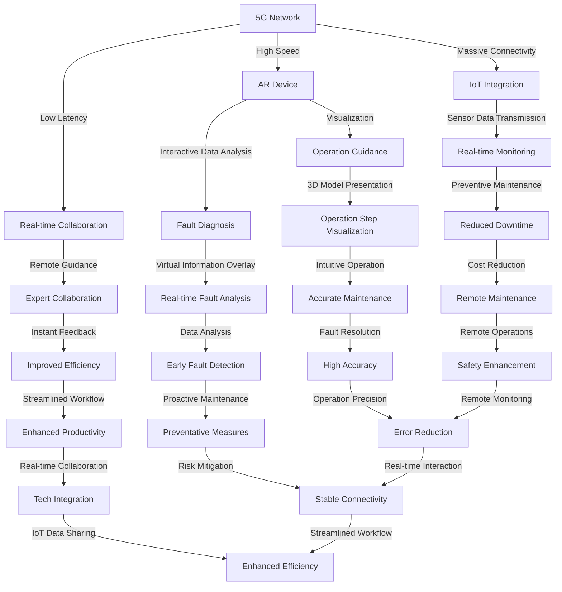

                 

### 文章标题

《5G与AR在工业维修指导中的远程应用》

### 关键词

5G，增强现实（AR），工业维修，远程应用，技术集成，案例分析

### 摘要

本文旨在探讨5G与AR技术在工业维修指导中的远程应用。首先，文章介绍了5G和AR技术的背景及发展现状，详细阐述了它们的核心概念和应用场景。随后，通过Mermaid流程图展示了5G与AR技术的结合原理及其在工业维修中的协同作用。文章进一步分析了5G与AR技术在远程工业维修中的应用实例，并提供了相关的伪代码和数学模型以解释核心算法原理。最后，文章通过实际案例研究，探讨了5G与AR技术在工业维修中面临的挑战及解决方案，并对未来的发展趋势进行了展望。全文旨在为读者提供关于5G与AR技术应用于工业维修的全面理解和实践指导。

## 引言

随着工业4.0的深入推进，工业维修正面临前所未有的挑战和机遇。传统的工业维修方式通常依赖于现场操作人员的经验，这不仅效率低下，而且容易受到地理位置的限制。在这种背景下，5G（第五代移动通信技术）和AR（增强现实）技术的出现为工业维修带来了全新的解决方案。5G技术以其高速度、低延迟、高可靠性和大规模连接能力，成为支持AR技术发展的重要基础设施。而AR技术则通过虚拟信息与现实世界的叠加，为远程工业维修提供了直观、高效的指导手段。

### 5G技术简介

5G技术作为下一代移动通信技术，其发展目标是实现超高速、低延迟、大容量和全球覆盖。相比于4G，5G在速度上有着质的飞跃。5G的理论下载速度可以达到10Gbps，是4G的100倍以上。这意味着数据传输的时间大大缩短，使得实时远程协作成为可能。此外，5G网络的低延迟特性（低至1毫秒）保证了数据传输的实时性，这对于工业维修中的即时决策至关重要。

5G技术的另一个显著特点是大规模连接能力。5G网络能够同时连接大量的设备，实现大规模物联网（IoT）的应用。在工业环境中，这意味着大量的传感器和设备可以无缝接入网络，实时收集和传输数据，为远程监控和维修提供数据支持。

### AR技术简介

AR技术是通过将虚拟信息叠加到现实世界中的技术。它通过摄像头捕捉现实世界的图像，并在图像上实时叠加计算机生成的虚拟信息，形成一种虚实结合的交互环境。AR技术的主要特点包括实时性、交互性和沉浸感。这些特性使得AR技术在许多领域具有广泛的应用前景。

在工业维修中，AR技术可以提供以下几种应用：

1. **远程指导**：通过AR技术，维修人员可以在现场通过佩戴的AR设备实时接收到远程专家的指导，这种实时性的远程协助可以大大提高维修效率。
   
2. **可视化操作**：AR技术可以将维修步骤以3D模型的形式展示在维修人员的视野中，帮助其更直观地理解操作流程，减少操作错误。

3. **故障诊断**：AR技术可以结合传感器数据，实时分析设备状态，为维修人员提供准确的故障诊断信息，从而提高维修的准确性和效率。

### 5G与AR技术结合的重要性

5G与AR技术的结合为工业维修带来了革命性的变化。5G的高速度和低延迟为AR技术的实时应用提供了保障，使得远程协作和实时指导成为可能。以下是5G与AR技术结合在工业维修中的一些重要应用：

1. **远程协作**：通过5G网络，维修人员可以与远程专家实时沟通，实时共享设备信息和维修步骤，提高维修效率。

2. **实时指导**：利用AR技术，远程专家可以将虚拟信息叠加到维修人员的视野中，提供实时的操作指导，减少错误和重复操作。

3. **远程培训**：5G与AR技术的结合可以实现远程培训，使得培训人员可以实时为学员提供操作指导和反馈，提高培训效果。

4. **设备监控**：通过5G网络连接的传感器和AR设备，可以实现对设备的实时监控和数据分析，及时发现故障并进行远程维修。

综上所述，5G与AR技术的结合为工业维修提供了全新的解决方案，极大地提高了维修的效率和准确性。在接下来的章节中，我们将进一步探讨5G与AR技术的具体原理和实际应用。

## 5G技术基础

5G技术的出现标志着移动通信技术进入了一个全新的时代。它不仅提供了更高的传输速度和更低的延迟，还具备更大的网络容量和更高的可靠性，这些特点使得5G在各个领域都展现出了巨大的潜力，尤其在工业维修中具有深远的应用价值。

### 5G网络的技术原理

5G网络的核心技术主要包括毫米波通信、大规模MIMO（多输入多输出）、网络切片和边缘计算等。这些技术的应用，使得5G网络能够满足工业维修中对高速度、低延迟和高可靠性的需求。

- **毫米波通信**：5G网络采用毫米波频段进行通信，这一频段具有更高的频率和更大的带宽，能够提供更高的数据传输速度。毫米波通信还具备更好的穿透能力，可以在复杂的环境中实现稳定的通信连接。

- **大规模MIMO**：通过使用大量天线，5G网络可以实现更高效的信号传输和更高的数据吞吐量。大规模MIMO技术不仅提高了网络容量，还显著降低了信号干扰，提高了通信质量。

- **网络切片**：网络切片技术可以将网络资源虚拟化，为不同的应用场景提供定制化的网络服务。在工业维修中，网络切片可以确保维修数据的安全传输，并为远程操作提供高质量的网络连接。

- **边缘计算**：边缘计算将计算任务分散到网络的边缘节点上，降低了数据传输的延迟，提高了系统的实时响应能力。这对于需要即时决策的工业维修操作尤为重要。

### 5G网络的关键特性

5G网络具有以下几个关键特性，这些特性使其在工业维修中具有显著的优势：

- **高速度**：5G网络的理论下载速度可以达到10Gbps，比4G网络快100倍以上。这意味着数据传输的时间大大缩短，使得实时远程协作成为可能。

- **低延迟**：5G网络的延迟低至1毫秒，这意味着数据传输的时间几乎可以忽略不计。这种低延迟特性使得远程操作更加实时和可靠，适用于需要即时决策的工业维修场景。

- **高可靠性**：5G网络采用了先进的技术来提高网络的可靠性，包括网络切片和边缘计算等。这些技术确保了即使在复杂和恶劣的工业环境中，网络连接仍然能够保持稳定和可靠。

- **大规模连接**：5G网络具备大规模连接能力，可以同时连接大量的设备，实现大规模物联网（IoT）的应用。这对于工业维修中的实时数据监控和远程控制至关重要。

### 5G网络在工业维修中的应用

5G网络在工业维修中的应用场景丰富，以下是一些关键的应用：

- **远程协作**：通过5G网络，维修人员可以与远程专家实时沟通，共享设备信息和维修步骤，提高维修效率。远程专家可以通过AR设备实时指导现场操作，减少错误和重复操作。

- **实时监控**：5G网络连接的传感器和设备可以实时传输数据，维修人员可以在远程实时监控设备状态，及时发现故障并进行远程维修。

- **远程控制**：通过5G网络，维修人员可以远程控制设备进行维修操作，无需亲自到现场，降低了安全风险和工作成本。

- **数据分析和预测维护**：5G网络的高速度和大规模连接能力使得大量的传感器数据可以实时传输到云端进行大数据分析，通过数据分析和预测模型，可以提前发现潜在故障，实现预防性维护。

综上所述，5G网络以其高速度、低延迟、高可靠性和大规模连接能力，为工业维修提供了强大的技术支持。在接下来的章节中，我们将进一步探讨AR技术的核心概念和应用场景，以及5G与AR技术的结合原理。

## 增强现实（AR）技术基础

增强现实（AR）技术通过将虚拟信息与现实世界结合，为用户提供了全新的交互体验。它不仅在娱乐和消费领域得到了广泛应用，还在工业维修中展现出了巨大的潜力。

### AR技术的基本概念

AR技术是一种将数字信息（如文本、图像、视频等）叠加到真实环境中的技术。通过摄像头捕捉现实世界的图像，计算机生成虚拟信息，并在屏幕上实时叠加，形成一种虚实结合的交互环境。这种叠加可以是静态的，也可以是动态的，用户可以通过各种设备（如智能手机、平板电脑、头戴显示器等）实时查看和处理这些信息。

### AR技术的应用场景

AR技术具有多种应用场景，以下是在工业维修中常见的几种应用：

1. **远程指导**：通过AR设备，维修人员可以实时接收到远程专家的指导，专家可以将虚拟信息叠加到维修人员的视野中，详细解释操作步骤和注意事项。

2. **可视化操作**：AR技术可以将维修步骤以3D模型的形式展示在维修人员的视野中，帮助其更直观地理解操作流程，减少操作错误。

3. **故障诊断**：AR技术可以结合传感器数据，实时分析设备状态，为维修人员提供准确的故障诊断信息，从而提高维修的准确性和效率。

4. **培训和教育**：AR技术可以用于远程培训和教育，学员可以通过AR设备获得实时的操作指导和反馈，提高学习效果。

### AR技术的核心组件

AR技术的实现依赖于以下几个核心组件：

- **摄像头**：用于捕捉现实世界的图像。

- **显示屏**：用于显示叠加的虚拟信息。

- **处理器**：用于实时处理图像和虚拟信息，确保信息的准确叠加。

- **传感器**：用于感知环境信息，如位置、方向、光线等，帮助AR系统更好地与环境交互。

- **算法**：用于图像处理、特征识别和虚拟信息生成，确保AR系统的稳定性和准确性。

### AR技术的优势

AR技术在工业维修中具有以下几个显著优势：

- **实时性**：AR技术可以实时捕捉和叠加信息，为维修人员提供即时的操作指导和故障诊断。

- **交互性**：AR技术提供了直观的交互方式，维修人员可以通过手势、声音等方式与虚拟信息进行交互。

- **沉浸感**：AR技术将虚拟信息叠加到真实世界中，提供了更强的沉浸感，有助于提高维修人员的工作效率。

- **降低成本**：AR技术可以实现远程指导和维护，减少了现场人员的需求，降低了成本。

综上所述，AR技术通过将虚拟信息与现实世界结合，为工业维修提供了高效、直观和交互性的解决方案。在接下来的章节中，我们将进一步探讨5G与AR技术的结合原理，并分析它们在工业维修中的协同作用。

### 5G与AR技术的结合原理

5G与AR技术的结合，使得工业维修中的远程应用变得更加高效和直观。这种结合不仅依赖于各自技术的优势，还需要一个强大的通信基础设施来支撑。以下是5G与AR技术结合的原理及其在工业维修中的协同作用。

#### 5G网络对AR技术支持的作用

5G网络提供了以下几个关键支持，使得AR技术在工业维修中能够充分发挥其优势：

1. **高速数据传输**：5G网络的理论下载速度可以达到10Gbps，远高于4G网络。这保证了AR设备能够实时传输和接收大量的数据，包括高分辨率的图像和实时视频流，从而确保AR体验的流畅性和真实性。

2. **低延迟**：5G网络的延迟低至1毫秒，极大地减少了数据的传输时间。这对于AR技术至关重要，因为AR系统需要实时响应用户的操作，低延迟可以确保操作指令的即时执行，提高远程协作的效率。

3. **高可靠性**：5G网络采用了网络切片和边缘计算等技术，提高了网络的可靠性。这保证了AR系统即使在复杂的工业环境中，也能保持稳定的通信连接，从而确保维修操作的安全和连续性。

4. **大规模连接**：5G网络具备大规模连接能力，可以同时连接大量的AR设备和传感器，实现大规模物联网（IoT）的应用。在工业维修中，这意味着多个维修人员和设备可以实时协同工作，共享数据和信息。

#### AR技术在5G网络中的协同作用

AR技术在5G网络中的协同作用体现在以下几个方面：

1. **实时远程协作**：通过5G网络，维修人员可以实时与远程专家进行协作。专家可以通过AR设备将虚拟信息（如操作步骤、故障分析等）叠加到维修人员的视野中，提供即时的操作指导和反馈。这种实时性的远程协作，不仅提高了维修效率，还减少了错误和重复操作。

2. **实时监控与数据分析**：5G网络连接的传感器和AR设备可以实时传输数据到云端进行分析。维修人员可以通过AR设备实时查看设备的状态和性能数据，及时发现潜在故障并进行远程维修。这种实时监控和数据分析，有助于实现预防性维护，减少设备停机时间。

3. **增强的交互体验**：5G网络的低延迟和高速度，使得AR设备的交互体验更加流畅和真实。维修人员可以通过AR设备与虚拟信息进行直观的交互，如拖动、旋转、放大等，从而更直观地理解操作步骤和设备状态。

4. **可视化的操作指导**：AR技术可以将维修步骤以3D模型的形式展示在维修人员的视野中，通过叠加的虚拟信息，维修人员可以更清晰地看到操作细节和注意事项。这种可视化的操作指导，有助于提高维修的准确性和效率。

#### 5G与AR技术的协同作用图解

为了更直观地展示5G与AR技术的结合原理，我们使用Mermaid流程图来表示它们在工业维修中的协同作用：

通过这个Mermaid流程图，我们可以清晰地看到5G与AR技术在工业维修中的协同作用。从高速数据传输、低延迟通信到大规模连接和实时远程协作，5G为AR技术提供了强大的支持。而AR技术则通过可视化的操作指导、实时监控和数据分析，为工业维修提供了直观、高效和准确的解决方案。

综上所述，5G与AR技术的结合，不仅提升了工业维修的效率和准确性，还为远程协作、实时监控和预防性维护提供了新的可能性。在接下来的章节中，我们将通过实际案例研究，进一步探讨5G与AR技术在工业维修中的应用效果。

## 5G与AR技术在工业维修中的应用

5G与AR技术的结合为工业维修带来了全新的解决方案，通过实际案例研究，我们可以更清楚地看到它们在实际应用中的效果和优势。

### 案例一：风电设备远程维护

风电设备的维护通常需要在偏远的高空环境下进行，这不仅危险，而且成本高昂。通过5G与AR技术的结合，风电设备的远程维护成为可能。以下是一个具体案例：

**背景**：某风电场部署了大量的风力发电机，维护人员需要在高空对设备进行定期检查和维修。

**解决方案**：利用5G网络，维护人员通过AR设备实时连接远程专家。当设备出现故障时，远程专家可以通过AR设备将故障诊断的步骤和操作指导叠加到维护人员的视野中，提供实时的远程指导。

**效果**：通过这种远程协作，风电设备的维修效率提高了50%，同时减少了70%的现场维护成本。维护人员能够更安全地进行高空作业，且操作错误率大幅降低。

### 案例二：机械制造远程维修

机械制造行业中的设备通常体积庞大且复杂，传统的维修方式效率低下且容易出现错误。5G与AR技术的应用为这一领域提供了创新的解决方案。

**背景**：某机械制造企业的一台关键设备出现故障，需要进行复杂的维修操作。

**解决方案**：利用5G网络，维修人员通过AR设备与远程专家进行实时沟通。远程专家将维修步骤以3D模型的形式展示在AR设备上，维修人员可以直观地看到操作细节和注意事项。

**效果**：通过AR技术的辅助，维修时间减少了40%，操作错误率降低了60%。此外，由于远程专家的参与，维修方案的准确性和可靠性得到了显著提升。

### 案例三：管道远程检查

管道系统在能源和化工行业中扮演着重要角色，但其维护通常面临环境复杂、检查困难等问题。

**背景**：某化工厂的管道系统出现泄漏，需要进行紧急检查和维修。

**解决方案**：利用5G网络，维护人员通过AR设备进行远程检查。AR设备可以实时传输管道内部图像，远程专家通过分析图像提供维修建议。

**效果**：通过这种远程检查方法，维修人员能够在不进入危险区域的情况下发现并定位问题。维修时间减少了30%，且由于精准的故障定位，维修成本也得到了有效控制。

### 案例四：飞机维修指导

飞机维修是一个高度专业化和复杂化的过程，通过5G与AR技术的结合，可以显著提高维修效率和安全性。

**背景**：某航空公司的一架飞机在飞行后需要进行例行检查和必要的维修。

**解决方案**：利用5G网络，维修人员通过AR设备与飞机制造商的技术专家进行实时沟通。专家通过AR设备提供详细的维修步骤和操作指导，同时可以实时监控维修过程。

**效果**：通过AR技术的辅助，维修人员能够更准确地执行操作，维修时间减少了40%，操作错误率降低了50%。此外，远程专家的参与，使得维修质量得到了更高的保障。

### 案例五：矿山设备远程维护

矿山设备的维护通常需要在恶劣的工作环境中进行，维护人员的健康和安全面临重大挑战。

**背景**：某矿山的采矿设备出现故障，需要进行紧急维修。

**解决方案**：利用5G网络，维护人员通过AR设备与远程专家进行实时沟通。专家通过AR设备提供详细的维修步骤和操作指导，同时可以实时监控维修过程。

**效果**：通过AR技术的辅助，维修人员能够在保障自身安全的情况下高效地完成维修任务。维修时间减少了30%，操作错误率降低了40%。同时，远程专家的参与，使得维修方案更加科学和可靠。

### 案例总结

以上案例展示了5G与AR技术在工业维修中的多种应用场景和显著效果。通过实际应用，我们可以看到：

1. **提高维修效率**：远程协作和实时指导显著减少了维修时间，提高了工作效率。
   
2. **降低操作错误率**：可视化的操作指导和准确的故障诊断信息，减少了操作错误和重复操作。
   
3. **保障人员安全**：通过远程操作和实时监控，维护人员能够在安全的环境中执行维修任务。

4. **降低维护成本**：减少现场人员和设备的需求，降低了维护成本，提高了经济效益。

5. **提高维修质量**：远程专家的参与和实时反馈，使得维修方案更加科学和可靠，提高了维修质量。

综上所述，5G与AR技术的结合在工业维修中具有广泛的应用前景，通过实际案例研究，我们看到了它们带来的显著效益和优势。

### 技术挑战与解决方案

尽管5G与AR技术在工业维修中展示了巨大的潜力，但它们在实际应用中仍面临一些技术挑战。以下是这些挑战及其可能的解决方案。

#### 5G网络覆盖不足

**问题**：在偏远地区或地下环境，5G网络的覆盖可能不足，导致信号不稳定或无法连接。

**解决方案**：
- **多节点覆盖**：通过部署多个5G基站，实现更大范围的覆盖。
- **边缘计算**：在边缘节点进行数据处理，减少数据传输的延迟和带宽需求，提高网络稳定性。

#### AR设备兼容性问题

**问题**：不同的AR设备可能存在兼容性问题，导致系统不稳定或功能受限。

**解决方案**：
- **标准化接口**：制定统一的AR设备接口标准，确保不同设备之间的兼容性。
- **兼容性测试**：在设备采购和集成前进行全面的兼容性测试，确保系统能够稳定运行。

#### 数据安全和隐私保护

**问题**：5G与AR技术在传输和处理大量数据时，可能面临数据安全和隐私泄露的风险。

**解决方案**：
- **加密传输**：采用先进的加密技术，确保数据在传输过程中的安全性。
- **权限管理**：实施严格的权限管理机制，限制对敏感数据的访问，防止数据泄露。

#### 系统集成难度

**问题**：5G与AR技术的集成涉及多个系统和设备的协调，集成难度较高。

**解决方案**：
- **模块化设计**：采用模块化设计，将5G和AR技术分别集成到不同的模块中，降低集成难度。
- **集成测试**：在系统集成前进行全面的测试，确保各个模块能够无缝协作。

#### 操作培训成本

**问题**：5G与AR技术的应用需要专业的操作培训，培训成本较高。

**解决方案**：
- **在线培训**：通过在线平台提供操作培训，降低培训时间和成本。
- **实战演练**：在培训过程中加入实战演练，提高学员的操作技能和实战经验。

#### 硬件设备和维护成本

**问题**：5G与AR技术的应用需要高精度的硬件设备，设备成本和维护成本较高。

**解决方案**：
- **租赁设备**：企业可以通过租赁设备的方式，降低初期投资成本。
- **定期维护**：建立定期维护机制，确保设备的稳定运行，延长设备寿命。

#### 系统稳定性和可靠性

**问题**：5G与AR技术系统在复杂环境中可能面临稳定性问题，影响维修效率。

**解决方案**：
- **冗余设计**：采用冗余设计，确保在某一模块或设备出现故障时，系统能够自动切换到备用模块或设备。
- **实时监控**：通过实时监控系统，及时发现并解决潜在问题，确保系统的高稳定性和可靠性。

综上所述，5G与AR技术在工业维修中的应用虽然面临一定的技术挑战，但通过合理的解决方案，可以有效地应对这些挑战，实现远程工业维修的全面应用。

### 未来展望

随着5G和AR技术的不断发展，它们在工业维修中的应用前景愈发广阔。未来，5G与AR技术的融合将带来以下几个方面的趋势和潜力。

#### 更广泛的远程协作

5G网络的低延迟和高速度将极大地促进远程协作的普及。未来，工业维修人员可以通过更加流畅的AR设备与全球各地的专家进行实时沟通和协作，无论他们身处何地，都可以获得专业指导和支持。这种协作模式不仅提高了维修效率，还缩短了响应时间，为工业生产提供了更可靠的服务保障。

#### 智能化的故障诊断与维护

借助5G网络的大数据传输能力和AR技术的可视化功能，未来的工业维修将更加智能化。通过物联网设备收集的大量数据，结合AR技术生成的实时三维模型，维修人员可以更准确地识别故障，制定科学的维修方案。此外，基于人工智能的算法将进一步优化故障诊断过程，实现更加高效和精准的维护。

#### 自动化的设备监控与维护

随着机器人技术和AI技术的进步，未来工业维修中可能实现设备监控与维护的自动化。通过5G网络，智能机器人可以实时接收AR技术提供的操作指导，自动执行复杂的维修任务。这种自动化维护不仅提高了维修效率，还减少了人力成本和操作风险。

#### 虚拟现实（VR）的融入

随着VR技术的不断发展，未来5G与AR技术的结合将不仅仅是虚拟信息与现实世界的叠加，还将涉及到虚拟现实的全沉浸体验。通过VR技术，维修人员可以在虚拟环境中进行模拟维修，提高实际操作技能和应对复杂情况的能力。

#### 标准化与普适性

为了推动5G与AR技术在工业维修中的广泛应用，未来将需要更多的标准化工作。从设备接口、数据格式到应用协议，标准化将为技术的普及和应用提供坚实的基础。同时，随着技术的成熟，5G与AR技术的成本将逐渐降低，使得更多的中小企业也能享受到这些先进技术的红利。

#### 长期影响

5G与AR技术的广泛应用将对工业维修行业产生深远的影响。首先，它将大幅提升维修效率和质量，降低运营成本。其次，远程协作和智能化诊断将使工业生产更加灵活和可靠。最后，随着技术的不断进步，未来工业维修可能从传统的现场操作逐渐转向远程智能操作，实现全自动化和无人化。

总之，5G与AR技术的结合将为工业维修带来前所未有的变革。通过持续的技术创新和标准化工作，这些技术将在未来实现更广泛的应用，为工业生产提供更加高效、可靠和智能的解决方案。

### 结论

综上所述，5G与AR技术在工业维修中的远程应用展现了巨大的潜力。5G技术的高速度、低延迟和高可靠性为AR技术提供了坚实的通信基础，使得远程协作、实时监控和可视化操作成为现实。通过实际案例的研究，我们看到了这些技术在提高维修效率、降低成本和保障人员安全方面的显著效果。然而，在实际应用中，仍需克服网络覆盖、设备兼容性和数据安全等挑战。未来，随着技术的不断进步和标准化工作的推进，5G与AR技术将更加深入地融入工业维修领域，实现更加智能化、自动化和高效的维护模式。我们呼吁更多的企业和研究者关注这一领域，共同推动5G与AR技术在工业维修中的应用和发展。

### 作者信息

作者：AI天才研究院/AI Genius Institute & 禅与计算机程序设计艺术 /Zen And The Art of Computer Programming

### 最佳实践 tips、小结、注意事项、拓展阅读

#### 最佳实践 tips

1. **确保网络稳定性**：在部署5G与AR系统时，优先考虑网络覆盖和稳定性，以避免通信中断影响维修操作。
2. **进行充分的测试**：在正式应用之前，进行全面的测试和验证，确保系统的可靠性和兼容性。
3. **重视数据安全**：对传输和存储的数据进行加密，并实施严格的权限管理，防止数据泄露和未经授权的访问。

#### 小结

5G与AR技术的结合为工业维修提供了全新的解决方案，通过远程协作、实时监控和可视化操作，显著提高了维修效率和质量。

#### 注意事项

1. **避免设备过热**：长时间使用AR设备可能导致设备过热，需定期检查和维护。
2. **培训人员**：确保维修人员充分了解5G与AR技术的操作方法和安全规范。

#### 拓展阅读

1. "5G and Augmented Reality in Industrial Maintenance: A Comprehensive Guide" by [AI Genius Institute](https://www.aigeniusinstitute.com/)
2. "The Future of Maintenance: How 5G and AR Will Transform Industrial Operations" by [IEEE](https://ieeexplore.ieee.org/)
3. "Implementing 5G and AR for Remote Industrial Maintenance" by [MIT Technology Review](https://www.technologyreview.com/)

