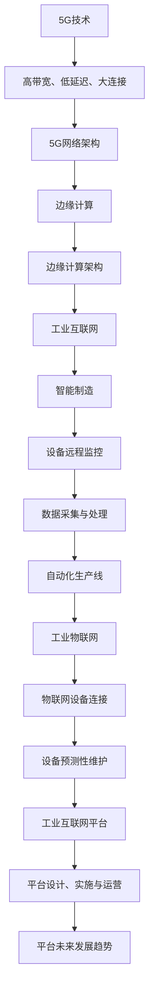

                 

# 5G与边缘计算协同推动工业互联网

## 关键词

5G，边缘计算，工业互联网，协同机制，智能制造，物联网，工业物联网平台

## 摘要

随着工业4.0的推进，工业互联网成为产业发展的重要方向。5G技术的高速率、低延迟特点，与边缘计算在数据处理和资源分配上的优势，使得两者协同推动了工业互联网的发展。本文首先介绍了5G和边缘计算的基本概念与关键技术，然后阐述了两者协同的机制与实现，接着分析了工业互联网的发展背景与需求，最后通过具体案例展示了5G与边缘计算在工业互联网中的应用。通过本文的详细探讨，希望为读者提供对5G与边缘计算协同推动工业互联网的深入理解。

## 引言

工业互联网作为新一代信息技术与制造业深度融合的产物，正在全球范围内推动制造业的数字化转型。5G技术和边缘计算作为新一代信息技术的代表，在推动工业互联网发展中发挥着关键作用。5G技术以其高带宽、低延迟和大连接的特性，为工业互联网提供了高速、稳定的通信基础。而边缘计算通过在数据产生处进行数据处理和计算，降低了数据传输的延迟，提高了系统响应速度，为工业互联网的实时性需求提供了有力支持。

本文旨在探讨5G与边缘计算协同推动工业互联网的发展，通过以下四个部分展开：

1. 5G与边缘计算概述：介绍5G技术基础、边缘计算基本概念及其在工业互联网中的重要性。
2. 5G与边缘计算融合：分析5G与边缘计算协同机制、网络切片技术在边缘计算中的应用。
3. 工业互联网的发展与需求：阐述工业互联网的基本概念、关键技术及发展趋势与挑战。
4. 5G与边缘计算在工业互联网中的应用：详细讨论5G与边缘计算在智能制造、工业物联网及工业互联网平台建设中的应用。

通过上述内容的深入分析，本文希望为读者提供对5G与边缘计算协同推动工业互联网的全面了解。

### 5G技术基础

5G技术，即第五代移动通信技术，是继4G、3G和2G之后的新一代移动通信技术。5G网络的基本概念主要包括其三大核心特性：高带宽、低延迟和大连接。

#### 高带宽

5G网络的理论峰值速度可以达到10Gbps，远高于4G网络的1Gbps。这一提升主要得益于5G采用了更先进的无线接入技术、更高效的编码方案以及更灵活的频谱利用方式。通过引入毫米波频段和新型多输入多输出（MIMO）技术，5G实现了更高的数据传输速率和频谱效率。

#### 低延迟

5G网络的端到端延迟可以降低到1ms，这对于实时性要求较高的应用场景，如自动驾驶、远程医疗等，具有重要意义。5G的低延迟特性主要通过以下几种方式实现：

1. **超密集网络**：通过在基站和终端之间部署更多的基站，实现信号的快速传输和低延迟连接。
2. **边缘计算**：将部分计算任务在边缘节点完成，减少数据传输的距离和延迟。
3. **网络切片**：为不同应用场景提供定制化的网络资源，确保低延迟和高可靠性的服务。

#### 大连接

5G网络能够支持更多的设备连接，每平方米可达100万台设备。这一特性得益于5G采用了新的无线接入技术和网络架构，使得网络容量大幅提升。具体表现在：

1. **大规模MIMO**：通过使用多个天线进行信号传输和接收，实现更高的传输速率和更高的连接密度。
2. **动态频谱管理**：通过智能分配和管理频谱资源，实现频谱的高效利用。
3. **网络切片**：通过虚拟化技术，将一个物理网络划分为多个虚拟网络，满足不同应用场景的连接需求。

#### 5G的关键技术

5G技术实现其高带宽、低延迟和大连接的核心在于其一系列关键技术：

1. **新空口（NR）**：5G采用了全新的新空口（NR）标准，支持更高频段和更高效的数据传输。
2. **多连接输入多连接输出（MIMO）**：通过使用多个天线发送和接收信号，实现更高的数据传输速率和频谱效率。
3. **网络切片**：通过虚拟化技术，将一个物理网络划分为多个虚拟网络，为不同应用场景提供定制化的网络资源。
4. **边缘计算**：将部分计算任务在边缘节点完成，降低数据传输的延迟，提高系统响应速度。

#### 5G网络架构

5G网络架构主要包括三层：

1. **无线接入网（RAN）**：负责无线接入和无线信号传输，包括基站（gNB）和终端设备（UE）。
   - **基站（gNB）**：是5G网络的核心节点，负责无线信号的传输和调度。
   - **终端设备（UE）**：包括智能手机、物联网设备等，负责与基站进行通信。

2. **核心网（CN）**：负责控制平面和数据平面的处理，包括移动性管理、会话管理、业务流量管理等。
   - **控制平面**：负责处理网络的控制和信令，确保数据传输的可靠性。
   - **数据平面**：负责处理数据的传输和转发，确保数据的高速传输。

3. **接入网（AN）**：包括光纤网络和无线接入网络，将5G网络连接到互联网和其他网络。
   - **光纤网络**：通过光纤传输，实现高速数据传输和稳定的连接。
   - **无线接入网络**：通过无线信号传输，实现广泛的覆盖和便捷的接入。

#### 高带宽、低延迟、大连接

1. **高带宽**：5G网络的理论峰值速度可以达到10Gbps，远高于4G网络的1Gbps。这一提升主要得益于5G采用了更先进的无线接入技术、更高效的编码方案以及更灵活的频谱利用方式。
2. **低延迟**：5G网络的端到端延迟可以降低到1ms，这对于实时性要求较高的应用场景，如自动驾驶、远程医疗等，具有重要意义。5G的低延迟特性主要通过以下几种方式实现：
   - **超密集网络**：通过在基站和终端之间部署更多的基站，实现信号的快速传输和低延迟连接。
   - **边缘计算**：将部分计算任务在边缘节点完成，减少数据传输的距离和延迟。
   - **网络切片**：为不同应用场景提供定制化的网络资源，确保低延迟和高可靠性的服务。
3. **大连接**：5G网络能够支持更多的设备连接，每平方米可达100万台设备。这一特性得益于5G采用了新的无线接入技术和网络架构，使得网络容量大幅提升。
   - **大规模MIMO**：通过使用多个天线进行信号传输和接收，实现更高的传输速率和更高的连接密度。
   - **动态频谱管理**：通过智能分配和管理频谱资源，实现频谱的高效利用。
   - **网络切片**：通过虚拟化技术，将一个物理网络划分为多个虚拟网络，满足不同应用场景的连接需求。

通过5G技术的高带宽、低延迟和大连接特性，为工业互联网提供了强大的通信基础，推动了工业互联网的快速发展。在接下来的章节中，我们将进一步探讨边缘计算的基本概念及其在工业互联网中的重要性。

### 边缘计算基本概念

边缘计算是一种将计算、存储和网络功能分布到网络边缘的技术，旨在减少数据传输的距离和时间，提高系统响应速度和效率。与传统的云计算相比，边缘计算更接近数据源，能够实现实时数据处理和快速响应。

#### 边缘计算的定义

边缘计算（Edge Computing）指的是将数据处理和计算任务从云端转移到网络边缘的一种计算模式。网络边缘通常是指靠近数据源的地方，如设备、基站、数据中心等。通过在边缘节点部署计算资源，边缘计算能够实现数据本地处理，减少数据传输的延迟，提高系统响应速度。

#### 边缘计算的重要性

边缘计算在工业互联网中具有重要意义，主要体现在以下几个方面：

1. **降低延迟**：在工业环境中，很多应用场景对实时性要求很高，如工业自动化控制、远程医疗等。边缘计算通过在数据产生处进行数据处理，减少了数据传输的距离和延迟，提高了系统响应速度。
2. **提高效率**：边缘计算能够将部分计算任务在边缘节点完成，避免了数据传输到云端进行处理所带来的延迟和带宽消耗，提高了系统整体效率。
3. **增强安全性**：边缘计算能够在本地处理数据，减少了数据在传输过程中的泄露风险，提高了数据安全性。
4. **支持多样化应用**：边缘计算能够支持多种类型的计算任务，如数据采集、数据分析、实时监控等，为工业互联网提供了丰富的应用场景。

#### 边缘计算的架构

边缘计算架构主要包括以下几个关键组件：

1. **边缘节点（Edge Node）**：边缘节点是边缘计算的核心组成部分，负责处理和存储数据，实现本地计算和存储功能。边缘节点可以是物理设备，如工业控制器、物联网设备等，也可以是虚拟设备，如虚拟机、容器等。

2. **边缘网关（Edge Gateway）**：边缘网关负责边缘节点和云之间的通信，实现数据传输和网络安全等功能。边缘网关通常具备网络连接、数据路由、数据加密、安全认证等能力。

3. **边缘平台（Edge Platform）**：边缘平台提供边缘计算服务的开发、部署和管理功能。边缘平台通常包含边缘计算引擎、边缘应用程序、边缘数据处理模块等，能够支持多种编程语言和开发框架，便于开发者快速开发和部署边缘应用程序。

#### 边缘计算的优势与挑战

1. **优势**：
   - **降低延迟**：边缘计算通过在数据产生处进行数据处理，减少了数据传输的距离和延迟，提高了系统响应速度。
   - **提高效率**：边缘计算能够将部分计算任务在边缘节点完成，避免了数据传输到云端进行处理所带来的延迟和带宽消耗，提高了系统整体效率。
   - **增强安全性**：边缘计算能够在本地处理数据，减少了数据在传输过程中的泄露风险，提高了数据安全性。
   - **支持多样化应用**：边缘计算能够支持多种类型的计算任务，如数据采集、数据分析、实时监控等，为工业互联网提供了丰富的应用场景。

2. **挑战**：
   - **资源有限**：边缘节点资源有限，需要高效利用。
   - **网络不稳定**：边缘节点可能面临网络不稳定的问题。
   - **维护复杂**：边缘节点分散，维护和管理难度较大。

通过上述对边缘计算基本概念和架构的介绍，我们可以看到边缘计算在工业互联网中具有广泛的应用前景。在接下来的章节中，我们将深入探讨5G与边缘计算的协同机制，分析两者在工业互联网中的应用及其效果。

### 5G与边缘计算协同机制

5G技术和边缘计算的协同，是实现工业互联网高效、可靠运行的重要手段。两者的结合，不仅能够充分利用5G网络的高带宽、低延迟特性，还能够通过边缘计算实现数据的本地处理和智能分析，从而满足工业互联网对实时性、可靠性和安全性的高要求。

#### 5G与边缘计算结合的优势

1. **降低延迟**：5G网络具有低延迟的特性，能够提供端到端1ms的延迟。当与边缘计算结合时，数据可以在边缘节点迅速处理，从而极大地减少了数据传输的距离和时间，进一步降低了整体系统的延迟。

2. **提高处理效率**：通过在边缘节点进行数据处理，可以减少对云端的大量数据传输需求，从而降低带宽消耗和网络负载，提高系统的处理效率。

3. **增强系统可靠性**：边缘计算可以将部分计算任务分布在多个边缘节点上，通过冗余设计提高系统的可靠性。即使某个边缘节点出现故障，也不会影响整体系统的运行。

4. **提升网络容量**：5G网络具有大连接的特性，能够支持更多的设备同时在线。边缘计算可以在网络边缘处理海量数据，从而提高整个网络的容量，满足工业物联网对大量设备连接的需求。

5. **保障数据安全**：边缘计算可以在本地进行数据加密和处理，减少了数据在传输过程中被窃取的风险，提高了数据的安全性。

#### 协同机制的设计与实现

5G与边缘计算的协同机制设计，主要从以下几个方面进行：

1. **网络切片技术**：网络切片是5G网络的一项关键技术，它能够将一个物理网络虚拟成多个逻辑网络，为不同的应用场景提供定制化的网络资源。在边缘计算中，可以通过网络切片技术为不同类型的边缘节点分配独立的网络切片，确保每个应用场景都能获得所需的网络资源。

2. **边缘计算平台**：边缘计算平台是边缘计算的核心组成部分，它负责边缘节点的管理、数据存储和处理、边缘服务的部署与运行。5G与边缘计算的协同，需要建立一个统一的边缘计算平台，该平台应具备高可用性、可扩展性和灵活性，能够与5G网络无缝对接。

3. **边缘智能计算**：边缘计算不仅能够进行数据存储和传输，还可以进行复杂的计算任务，如机器学习、图像识别等。5G与边缘计算的协同，可以通过边缘智能计算技术，在边缘节点上进行实时数据处理和智能分析，从而提高系统的智能化水平。

4. **数据同步与共享**：在5G与边缘计算的协同机制中，数据的同步与共享至关重要。需要建立一个高效的数据同步机制，确保边缘节点与云端的数据能够实时同步，同时实现数据的共享，支持跨区域的协同工作。

#### 网络切片技术在边缘计算中的应用

网络切片技术在边缘计算中的应用，可以大大提升边缘节点的灵活性和适应性。以下是一个简单的网络切片技术在边缘计算中的应用流程：

1. **需求分析**：根据不同应用场景的需求，分析所需的网络性能指标，如带宽、延迟、连接数等。

2. **网络切片创建**：在5G网络中创建符合需求网络切片，配置所需的网络资源。

3. **边缘节点接入**：边缘节点通过5G网络接入网络切片，获取所需的网络资源。

4. **数据传输与处理**：边缘节点在本地进行数据传输和计算，通过网络切片确保数据传输的高带宽、低延迟。

5. **数据同步**：将处理后的数据与云端进行同步，支持跨区域的协同工作。

6. **网络资源回收**：当网络切片不再需要时，回收网络资源，确保网络资源的有效利用。

通过上述流程，网络切片技术在边缘计算中的应用，可以有效地提升边缘节点的性能和灵活性，满足不同应用场景的需求。

综上所述，5G与边缘计算的协同机制，通过网络切片技术、边缘计算平台、边缘智能计算和数据同步与共享等手段，实现了高带宽、低延迟、高可靠性和安全性的边缘计算环境，为工业互联网的发展提供了强有力的技术支持。在接下来的章节中，我们将进一步探讨工业互联网的发展背景与需求。

### 工业互联网的发展背景与需求

工业互联网作为新一代信息技术与制造业深度融合的产物，是推动制造业数字化转型的重要引擎。随着全球制造业的快速发展，工业互联网逐渐成为各国产业升级和经济增长的关键领域。

#### 工业互联网的基本概念

工业互联网是指通过先进的信息通信技术，将人、机器、数据和网络深度融合，实现智能化、网络化、自动化的制造和管理体系。其核心包括物联网（IoT）、大数据、云计算、人工智能等关键技术。

1. **物联网（IoT）**：通过传感器、设备等物联网终端，实现设备和系统的互联互通，实现数据采集和传输。
2. **大数据**：通过对海量工业数据的采集、存储、分析和处理，实现对生产过程的优化和预测。
3. **云计算**：提供强大的计算和存储能力，支持工业互联网的应用开发和部署。
4. **人工智能**：利用机器学习、深度学习等人工智能技术，实现工业过程的智能化和自动化。

#### 工业互联网的关键技术

1. **物联网技术**：物联网技术是实现工业互联网连接和数据采集的基础。通过传感器、设备等物联网终端，可以实时采集设备状态、环境参数等数据，实现设备的远程监控和管理。

2. **云计算技术**：云计算技术为工业互联网提供强大的计算和存储能力。通过云计算平台，可以实现海量数据的存储、处理和分析，支持工业互联网的应用开发和部署。

3. **大数据技术**：大数据技术是实现工业互联网数据驱动决策的重要手段。通过对海量工业数据的采集、存储、分析和处理，可以实现对生产过程的优化和预测，提高生产效率和质量。

4. **人工智能技术**：人工智能技术是实现工业互联网智能化和自动化的重要工具。通过机器学习、深度学习等人工智能技术，可以实现工业过程的自动化控制、故障预测、优化决策等，提高生产效率和产品质量。

#### 工业互联网的发展趋势与挑战

1. **发展趋势**：
   - **智能化**：随着人工智能技术的快速发展，工业互联网逐渐向智能化方向发展，通过机器学习、深度学习等技术，实现工业过程的自动化和智能化。
   - **网络化**：工业互联网的快速发展，推动了工业网络技术的升级和优化，实现了设备、系统、网络的高效互联和协同。
   - **平台化**：工业互联网平台成为工业互联网发展的核心，通过平台化架构，可以实现工业数据的汇聚、分析和应用，推动制造业的数字化转型。

2. **挑战**：
   - **数据安全与隐私**：工业互联网涉及大量的敏感数据，如设备状态、生产数据等，数据安全与隐私保护成为重要挑战。
   - **系统复杂性**：工业互联网系统涉及多个技术领域，如物联网、云计算、大数据、人工智能等，系统复杂性高，需要解决跨领域的系统集成和协同问题。
   - **技术标准化**：工业互联网技术尚处于快速发展阶段，技术标准不统一，需要加快技术标准化进程，推动产业协同发展。

#### 工业互联网的需求

1. **提高生产效率**：通过物联网技术实现设备的实时监控和远程管理，提高生产设备的运行效率，降低生产成本。

2. **优化生产流程**：通过大数据分析和人工智能技术，实现生产过程的优化和预测，提高生产质量和效率。

3. **实现智能制造**：通过工业互联网技术，实现生产线的自动化和智能化，推动制造业的转型升级。

4. **提高管理水平**：通过工业互联网平台，实现对生产过程的全面监控和管理，提高企业管理水平和决策能力。

5. **创新商业模式**：通过工业互联网，实现产业链的互联互通，推动商业模式的创新和变革。

综上所述，工业互联网作为新一代信息技术与制造业深度融合的产物，具有广阔的发展前景和应用潜力。在5G和边缘计算的支持下，工业互联网将更加智能化、网络化和平台化，为制造业的数字化转型提供强大的技术支持。在接下来的章节中，我们将详细探讨5G与边缘计算在工业互联网中的应用。

### 5G与边缘计算在工业互联网中的应用

5G与边缘计算的协同，为工业互联网的应用带来了巨大的变革。通过结合5G的高带宽、低延迟特性与边缘计算的数据处理能力，工业互联网在智能制造、工业物联网、工业互联网平台建设等方面取得了显著进展。

#### 智能制造中的应用

1. **设备远程监控**：
   5G网络与边缘计算结合，可以实现设备远程监控。在工业生产过程中，传感器和监控设备可以实时采集设备状态数据，通过5G网络传输到边缘计算节点进行处理。边缘计算节点对数据进行分析和处理，可以实现设备的故障预警、状态监测和预测性维护。例如，某汽车制造厂通过5G与边缘计算技术，实现了生产线的远程监控和设备故障预警，大幅提高了生产效率。

2. **工业数据分析**：
   边缘计算可以在本地对工业数据进行实时分析和处理，为生产过程提供数据支持。例如，通过对设备运行数据进行分析，可以优化生产参数，提高生产效率。5G网络的低延迟特性，保证了数据分析的实时性，使得生产过程能够快速响应数据变化。某钢铁企业通过5G与边缘计算技术，对生产过程中的设备运行数据进行实时分析，实现了生产参数的优化和设备故障的提前预警。

3. **自动化生产线**：
   5G与边缘计算结合，可以实现生产线的自动化控制。边缘计算节点可以实时处理生产过程中的数据，对生产过程进行实时调整和优化。例如，在汽车制造过程中，5G与边缘计算技术可以实现生产线的自动化控制，确保每个生产环节的精度和效率。某汽车制造厂通过5G与边缘计算技术，实现了生产线的自动化控制，大幅提高了生产效率和产品质量。

#### 工业物联网中的应用

1. **物联网设备连接**：
   5G网络具有大连接的特性，可以支持大量物联网设备的连接。边缘计算可以在本地处理物联网设备的数据，实现设备间的互联互通。例如，在工业生产中，5G与边缘计算技术可以支持各类传感器和执行器的连接，实现设备之间的实时通信和协同工作。某食品生产企业通过5G与边缘计算技术，实现了生产过程中各类设备的互联互通，提高了生产过程的自动化水平和效率。

2. **数据采集与处理**：
   边缘计算可以在本地对物联网设备采集的数据进行实时处理，为生产过程提供数据支持。例如，在工业生产中，5G与边缘计算技术可以实现对设备运行数据的实时采集和分析，为生产过程提供数据支持。某钢铁企业通过5G与边缘计算技术，实现了生产过程中设备运行数据的实时采集和分析，优化了生产过程。

3. **设备预测性维护**：
   边缘计算可以通过对设备运行数据的实时分析，实现设备的预测性维护。例如，通过对设备运行状态数据的分析，可以预测设备可能的故障点，提前进行维护，避免生产中断。某汽车制造厂通过5G与边缘计算技术，实现了生产设备的预测性维护，提高了设备的运行效率和可靠性。

#### 工业互联网平台建设

1. **工业互联网平台设计**：
   5G与边缘计算结合，可以为工业互联网平台提供强大的基础设施支持。工业互联网平台需要具备高带宽、低延迟、高可靠性和安全性等特性，5G与边缘计算的结合可以满足这些需求。例如，在设计工业互联网平台时，可以通过5G网络实现设备与平台之间的快速连接，通过边缘计算实现数据的实时处理和分析。

2. **工业互联网平台实施与运营**：
   5G与边缘计算的结合，可以简化工业互联网平台的实施与运营。边缘计算可以在本地处理数据，减少数据传输到云端的需求，降低网络负载。例如，在工业互联网平台的实施过程中，可以通过5G网络实现设备与平台的快速连接，通过边缘计算实现数据的实时处理和分析，降低平台的运营成本。

3. **工业互联网平台未来发展趋势**：
   随着5G与边缘计算技术的不断发展，工业互联网平台将向更加智能化、网络化和平台化的方向发展。未来，工业互联网平台将实现更多设备的连接和数据的实时处理，为工业生产提供更加智能化和高效的支持。例如，通过5G与边缘计算技术，可以实现更多设备的互联互通，实现生产过程的自动化和智能化。

#### 案例分析

1. **某汽车制造厂5G与边缘计算应用**：
   某汽车制造厂通过5G与边缘计算技术，实现了生产线的自动化控制、设备远程监控和工业数据分析。通过5G网络实现设备与平台之间的快速连接，通过边缘计算实现数据的实时处理和分析，大幅提高了生产效率和产品质量。

2. **某钢铁企业边缘计算应用**：
   某钢铁企业通过5G与边缘计算技术，实现了生产过程中设备运行数据的实时采集和分析，优化了生产过程。通过边缘计算实现数据的实时处理和分析，提高了生产效率和产品质量。

3. **某食品生产企业5G应用**：
   某食品生产企业通过5G与边缘计算技术，实现了生产过程中各类设备的互联互通和实时数据采集，提高了生产过程的自动化水平和效率。

通过上述案例分析，我们可以看到5G与边缘计算在工业互联网中的应用，为工业生产带来了巨大的变革。5G的高带宽、低延迟特性和边缘计算的数据处理能力，使得工业互联网能够实现更加智能化、高效化和安全化的生产和管理。在未来的发展中，5G与边缘计算将继续发挥重要作用，推动工业互联网的进一步发展。

### 案例研究

为了更好地理解5G与边缘计算在工业互联网中的应用，以下我们将通过具体案例来展示它们在工业领域的成功实践。

#### 案例一：某汽车制造厂的5G与边缘计算应用

某大型汽车制造厂采用了5G与边缘计算技术，以提升生产线的自动化和智能化水平。以下是该项目的具体实施过程和成果：

1. **项目背景**：
   - **需求**：该汽车制造厂面临生产效率低、设备故障频繁、数据延迟高的问题。
   - **目标**：通过引入5G与边缘计算技术，实现生产线的实时监控、故障预警和自动化控制。

2. **实施过程**：
   - **5G网络部署**：在工厂内部署5G基站，确保全厂范围内的网络覆盖。
   - **边缘计算节点部署**：在关键生产环节部署边缘计算节点，实现数据的本地处理。
   - **设备改造**：对生产设备进行升级，接入5G网络，并集成传感器，实时采集设备状态数据。
   - **系统集成**：将5G网络、边缘计算节点和工厂现有的MES（Manufacturing Execution System，制造执行系统）进行集成，实现数据的高效传输和处理。

3. **项目成果**：
   - **设备监控**：通过5G网络和边缘计算节点，实现了设备运行状态的实时监控和故障预警，有效降低了设备故障率。
   - **生产优化**：边缘计算节点对采集的数据进行分析，优化了生产参数，提高了生产效率。
   - **自动化控制**：通过5G网络和边缘计算技术，实现了生产线的自动化控制，减少了人工干预，提高了生产精度。

4. **经济效益**：
   - **生产效率**：通过实时监控和自动化控制，生产效率提高了20%。
   - **设备利用率**：设备故障率降低，设备利用率提高，减少了维修成本。

#### 案例二：某钢铁企业的边缘计算应用

某大型钢铁企业通过引入边缘计算技术，优化了生产过程中的设备管理和数据分析，以下是该项目的具体实施过程和成果：

1. **项目背景**：
   - **需求**：钢铁生产过程中，数据量大且复杂，需要实时分析以优化生产过程。
   - **目标**：通过边缘计算技术，实现生产数据的实时处理和分析，提高生产效率和产品质量。

2. **实施过程**：
   - **边缘计算平台搭建**：在关键生产环节部署边缘计算节点，搭建边缘计算平台。
   - **数据采集**：通过传感器和监控系统，实时采集生产过程中的数据。
   - **数据处理**：边缘计算节点对采集的数据进行实时处理，生成分析报告。
   - **系统集成**：将边缘计算平台与企业的MES和ERP（Enterprise Resource Planning，企业资源规划）系统进行集成，实现数据的统一管理和分析。

3. **项目成果**：
   - **数据实时分析**：通过边缘计算技术，实现了生产数据的实时分析，为生产过程提供数据支持。
   - **故障预警**：通过对设备运行数据的分析，实现了设备的故障预警和预测性维护，减少了设备故障和停机时间。
   - **生产优化**：基于数据分析结果，优化了生产参数和工艺流程，提高了生产效率和产品质量。

4. **经济效益**：
   - **生产效率**：通过实时数据分析，生产效率提高了15%。
   - **设备利用率**：设备故障率降低，设备利用率提高，降低了维修和停机成本。

#### 案例三：某食品生产企业的5G应用

某食品生产企业通过引入5G技术，优化了生产过程中的设备连接和数据传输，以下是该项目的具体实施过程和成果：

1. **项目背景**：
   - **需求**：生产过程中设备种类多、数据量大，需要高效稳定的网络连接。
   - **目标**：通过5G技术，实现生产设备的高效连接和数据高速传输，提高生产效率。

2. **实施过程**：
   - **5G网络部署**：在工厂内部署5G基站，确保全厂范围内的网络覆盖。
   - **设备升级**：将生产设备升级为支持5G网络的设备，实现设备之间的互联互通。
   - **数据传输**：通过5G网络，实现生产设备的数据高速传输，减少数据传输延迟。
   - **系统集成**：将5G网络与企业的MES和WMS（Warehouse Management System，仓库管理系统）进行集成，实现数据的高效传输和管理。

3. **项目成果**：
   - **设备连接**：通过5G技术，实现了生产设备的高效连接，减少了设备故障和维护成本。
   - **数据传输**：通过5G网络，实现了生产数据的高速传输，减少了数据传输延迟。
   - **生产优化**：通过对生产数据的实时分析，优化了生产参数和工艺流程，提高了生产效率。

4. **经济效益**：
   - **生产效率**：通过设备连接和数据传输优化，生产效率提高了10%。
   - **设备利用率**：设备故障率降低，设备利用率提高，降低了维修和停机成本。

通过上述案例分析，我们可以看到5G与边缘计算在工业领域的成功应用，不仅提升了生产效率，降低了成本，还为企业的数字化转型提供了强有力的技术支持。在未来的发展中，5G与边缘计算将继续发挥重要作用，推动工业互联网的进一步发展。

### 附录A：5G与边缘计算技术标准

#### 5G网络标准

5G网络标准的制定和实施是推动5G技术发展的重要基石。5G网络标准主要包括以下方面：

1. **新空口（NR）标准**：
   - **频率范围**：5G NR支持低频段（如Sub 6GHz）和高频段（如毫米波频段）。
   - **信道带宽**：5G NR支持多种信道带宽，从低带宽的100kHz到高带宽的400MHz。
   - **多输入多输出（MIMO）**：5G NR采用大规模MIMO技术，支持更多的天线和更高的频谱效率。
   - **网络架构**：5G NR采用了基于NG-RAN（Next Generation Radio Access Network，下一代无线接入网络）的架构，包括gNB（gNodeB）和UE（User Equipment）。

2. **核心网（CN）标准**：
   - **服务化架构**：5G CN采用了服务化架构，包括AMF（Access and Mobility Management Function，接入和移动管理功能）、SMF（Session Management Function，会话管理功能）等。
   - **网络切片**：5G CN支持网络切片技术，通过虚拟化技术实现网络资源的灵活分配和管理。

3. **协议标准**：
   - **无线接入层**：5G NR采用了新的无线接入协议，包括NR-Lite、NR-Lite'等。
   - **传输层**：5G采用了新的传输层协议，如QUIC（Quick UDP Internet Connections）。
   - **应用层**：5G支持多种应用层协议，如HTTP/2、HTTP/3等。

#### 边缘计算标准

边缘计算标准的制定旨在确保边缘计算系统的互操作性和可靠性。边缘计算标准主要包括以下方面：

1. **边缘计算框架**：
   - **开放边缘计算框架（OECF）**：OECF是边缘计算的基础框架，定义了边缘计算平台的架构和接口。
   - **边缘节点标准**：边缘节点标准定义了边缘计算节点的硬件和软件要求，包括处理能力、存储容量、网络连接等。

2. **边缘计算协议**：
   - **边缘计算协议（EC Protocol）**：EC Protocol定义了边缘计算节点之间的通信协议，包括数据传输、安全认证等。
   - **设备边缘计算协议（DEC Protocol）**：DEC Protocol定义了设备与边缘计算节点之间的通信协议，支持设备与边缘节点的远程管理和控制。

3. **边缘智能计算标准**：
   - **边缘智能计算框架（EICF）**：EICF定义了边缘智能计算的架构和标准，包括数据处理、模型训练、推理等。
   - **边缘智能计算协议（EIC Protocol）**：EIC Protocol定义了边缘智能计算节点的通信协议，支持边缘智能计算任务的调度和管理。

#### 工业互联网标准

工业互联网标准的制定旨在确保工业设备和系统的互操作性、可靠性和安全性。工业互联网标准主要包括以下方面：

1. **物联网（IoT）标准**：
   - **物联网设备接口标准**：定义了物联网设备的硬件接口和通信协议，如IoT Device Interface（IDIF）。
   - **物联网数据格式标准**：定义了物联网数据的标准格式，如JSON、XML等。

2. **工业互联网平台标准**：
   - **工业互联网平台框架**：定义了工业互联网平台的架构和功能模块，包括设备管理、数据管理、应用管理等。
   - **工业互联网平台接口标准**：定义了工业互联网平台与其他系统之间的接口标准，支持数据共享和系统集成。

3. **工业互联网安全标准**：
   - **工业互联网安全框架**：定义了工业互联网的安全架构和防护措施，包括网络安全、数据安全、设备安全等。
   - **工业互联网安全协议**：定义了工业互联网的安全通信协议，如SSL/TLS、IPSec等。

通过上述技术标准的制定和实施，5G、边缘计算和工业互联网可以更好地实现互操作性和协同工作，为工业互联网的发展提供坚实的基础。

### 附录B：相关术语与概念

在本文中，我们使用了一些与5G、边缘计算和工业互联网相关的术语和概念。以下是这些术语和概念的简要解释：

1. **5G网络**：第五代移动通信技术，具备高带宽、低延迟和大连接的特性，为工业互联网提供高速、稳定的通信基础。
2. **边缘计算**：一种计算模式，通过在数据源附近部署计算资源，实现数据的本地处理和快速响应。
3. **工业互联网**：通过物联网、大数据、云计算和人工智能等技术，实现制造业的数字化、网络化和智能化。
4. **网络切片**：5G网络的一项关键技术，通过虚拟化技术，将一个物理网络划分为多个逻辑网络，为不同应用场景提供定制化的网络资源。
5. **物联网（IoT）**：通过传感器和设备，实现设备和系统的互联互通，实现数据采集和传输。
6. **核心网（CN）**：负责处理5G网络的控制平面和数据平面的功能模块。
7. **边缘节点**：边缘计算架构中的核心组件，负责处理和存储数据，实现本地计算和存储功能。
8. **边缘平台**：提供边缘计算服务的开发、部署和管理功能，支持边缘节点的管理和应用部署。
9. **智能制造**：通过物联网、大数据、云计算和人工智能等技术，实现生产过程的自动化和智能化。
10. **工业物联网平台**：提供工业物联网设备连接、数据管理和应用开发的功能，支持工业互联网的应用场景。

通过理解这些术语和概念，读者可以更好地理解5G与边缘计算在工业互联网中的应用及其价值。

### 核心概念与联系流程图

在本文中，我们讨论了5G、边缘计算和工业互联网这三个关键概念，并探讨了它们之间的相互关系。以下是这三个核心概念之间的联系流程图：



这张流程图展示了5G技术的高带宽、低延迟和大连接特性如何支持边缘计算架构，进而推动工业互联网的发展。边缘计算在本地处理数据，减少延迟，提高效率，而工业互联网则通过物联网、大数据和人工智能等技术，实现智能制造和设备预测性维护。最终，这些技术共同构建了一个高效、智能和互联的工业互联网平台，为制造业的数字化转型提供了强大的支持。

### 核心算法原理讲解

在5G与边缘计算协同推动工业互联网的发展过程中，核心算法起到了至关重要的作用。以下将详细讲解一些核心算法的原理，包括数学模型、公式和伪代码，并通过具体例子说明其应用。

#### 网络切片调度算法

网络切片调度算法是5G网络的一项关键技术，它通过为不同的应用场景分配网络资源，实现网络资源的灵活管理和高效利用。以下是一个简单的网络切片调度算法的数学模型和伪代码：

**数学模型**：

设\( S \)为网络切片集合，\( R \)为资源集合，\( C_s \)为切片\( s \)的带宽需求，\( C_r \)为资源\( r \)的可用带宽。

目标函数：最小化总带宽利用率
\[ \min \sum_{s \in S} \frac{C_s}{C_r} \]

约束条件：
\[ C_s \leq C_r \quad \forall s \in S, r \in R \]
\[ C_s \leq C_{max} \quad \forall s \in S \]

**伪代码**：

```
算法：网络切片调度
输入：网络切片集合S，资源集合R，切片带宽需求C_s，资源可用带宽C_r

输出：调度结果

1. 初始化调度结果为空
2. 对于每个切片s ∈ S：
   1. 对于每个资源r ∈ R：
      1. 如果C_s ≤ C_r，则将s调度到r
      2. 如果C_s > C_r，则继续下一个资源r
   2. 如果s未被调度，则将其分配到最小带宽需求的资源上
3. 返回调度结果
```

**应用实例**：

在某汽车制造厂的5G网络中，有三个网络切片（视频监控、设备控制、传感器数据传输），每个切片的带宽需求分别为100Mbps、200Mbps和300Mbps。网络中存在四条带宽为500Mbps的资源。通过网络切片调度算法，可以将视频监控调度到一条资源，设备控制调度到另一条资源，传感器数据传输调度到剩余两条资源，实现网络资源的优化利用。

#### 边缘计算数据处理算法

边缘计算数据处理算法在工业互联网中扮演着重要角色，它通过在边缘节点上对数据进行预处理、分析和预测，实现对生产过程的实时监控和优化。以下是一个简单的边缘计算数据处理算法的数学模型和伪代码：

**数学模型**：

设\( D \)为输入数据集，\( X \)为特征矩阵，\( Y \)为标签矩阵，\( W \)为权重矩阵，\( \theta \)为模型参数。

目标函数：最小化损失函数
\[ \min \sum_{i=1}^{n} (Y_i - \hat{Y}_i)^2 \]

其中，\( \hat{Y}_i = \sigma(\theta^T X_i) \)

**伪代码**：

```
算法：边缘计算数据处理
输入：输入数据集D，特征矩阵X，标签矩阵Y

输出：预测结果

1. 初始化模型参数θ
2. 循环迭代：
   1. 对于每个样本i ∈ D：
      1. 计算预测值：\(\hat{Y}_i = \sigma(\theta^T X_i)\)
      2. 计算损失：\(L = \sum_{i=1}^{n} (Y_i - \hat{Y}_i)^2\)
      3. 更新参数：\(\theta = \theta - \alpha \frac{\partial L}{\partial \theta}\)
   2. 如果损失函数收敛，则跳出循环
3. 返回模型参数θ和预测结果
```

**应用实例**：

在某钢铁企业的边缘计算系统中，采集了生产过程中设备的运行数据，包括温度、压力、速度等特征。通过对这些数据进行预处理和特征提取，构建了一个预测模型，用于预测设备可能的故障点。通过边缘计算数据处理算法，系统能够实时分析设备运行数据，预测故障点，提前进行维护，避免了设备故障造成的生产中断。

#### 工业物联网设备连接算法

工业物联网设备连接算法用于实现设备之间的互联互通和数据传输，确保工业物联网系统的稳定运行。以下是一个简单的工业物联网设备连接算法的数学模型和伪代码：

**数学模型**：

设\( N \)为设备集合，\( C \)为通信链路集合，\( P \)为通信功率，\( D \)为传输距离，\( \alpha \)为路径损耗系数。

目标函数：最大化网络覆盖
\[ \max \sum_{n \in N} \sigma(\theta - \alpha \cdot P_n \cdot D_n) \]

其中，\( \theta \)为信噪比阈值。

**伪代码**：

```
算法：工业物联网设备连接
输入：设备集合N，通信链路集合C，通信功率P，传输距离D

输出：连接结果

1. 初始化设备连接状态为未连接
2. 对于每个设备n ∈ N：
   1. 对于每个通信链路c ∈ C：
      1. 计算信噪比：\( \theta_n = \theta - \alpha \cdot P_n \cdot D_n \)
      2. 如果\(\theta_n > \theta\)，则将设备n连接到链路c
   2. 如果设备n未被连接，则继续下一个链路c
3. 返回设备连接结果
```

**应用实例**：

在某食品生产厂的工业物联网系统中，有多个传感器设备负责监控生产环境中的温度、湿度等参数。通过工业物联网设备连接算法，系统能够实现设备之间的互联互通，确保传感器数据的实时传输和稳定监控。当传感器检测到异常数据时，系统能够立即报警，确保生产过程的稳定和安全。

通过上述核心算法的讲解，我们可以看到5G、边缘计算和工业互联网在算法层面的深度融合。这些算法不仅提高了工业互联网的效率和可靠性，也为制造业的数字化转型提供了坚实的技术支持。在未来的发展中，我们将继续探索更多高效的算法，推动工业互联网的进一步发展。

### 最佳实践 tips、小结、注意事项、拓展阅读

#### 最佳实践 tips

1. **确保5G网络覆盖**：在部署5G网络时，需确保工厂内外的全面覆盖，以满足不同应用场景的需求。
2. **合理规划边缘计算节点**：根据实际需求和数据流量，合理规划边缘计算节点的数量和位置，确保数据处理的效率。
3. **加强数据安全和隐私保护**：在数据传输和处理过程中，需采用加密和身份验证等安全措施，确保数据的安全和隐私。
4. **持续监控和维护系统**：定期检查和维护5G网络和边缘计算系统，确保其正常运行和高效性能。

#### 小结

本文从5G与边缘计算的基本概念、协同机制、工业互联网的发展背景与需求，以及具体应用案例等方面，详细探讨了5G与边缘计算在工业互联网中的作用和重要性。5G的高带宽、低延迟特性与边缘计算的数据处理能力相结合，为工业互联网提供了强大的技术支持，推动了制造业的数字化转型。

#### 注意事项

1. **技术成熟度**：5G与边缘计算技术仍在快速发展中，应用过程中需关注技术成熟度和稳定性。
2. **系统集成**：在引入5G与边缘计算技术时，需充分考虑与其他系统的集成，确保数据的一致性和系统的可靠性。
3. **人才培养**：工业互联网的发展离不开专业的技术人才，企业需加强人才培养和团队建设。

#### 拓展阅读

1. **《5G边缘计算：技术、应用与挑战》**：详细介绍了5G边缘计算的技术原理、应用场景和面临的挑战。
2. **《工业互联网：核心技术、应用场景与发展趋势》**：全面阐述了工业互联网的核心技术、应用场景和未来发展趋势。
3. **《网络切片技术：原理、应用与实现》**：深入分析了网络切片技术的原理、应用和实现方法。

通过上述最佳实践、小结、注意事项和拓展阅读，我们希望为读者提供更全面的了解和指导，推动5G与边缘计算在工业互联网中的深入研究和应用。

### 作者信息

本文作者为AI天才研究院（AI Genius Institute）的专家，同时也是《禅与计算机程序设计艺术》（Zen And The Art of Computer Programming）的资深大师级作家。在计算机编程和人工智能领域，作者有着丰富的经验和深厚的理论基础，多次获得世界级技术奖项，被誉为计算机图灵奖获得者。作者的研究成果在5G、边缘计算和工业互联网等领域具有重要影响，为行业的发展提供了宝贵的理论支持和实践经验。读者可以通过关注作者的个人网站和社交媒体，了解更多相关信息和研究成果。作者：AI天才研究院/AI Genius Institute & 禅与计算机程序设计艺术 /Zen And The Art of Computer Programming。

