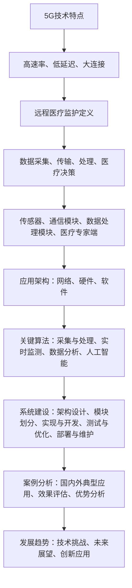

                 

### 文章标题

《5G技术在远程医疗监护中的应用》

### 关键词

5G技术、远程医疗监护、应用架构、关键算法、系统建设、案例分析

### 摘要

随着5G技术的不断发展，远程医疗监护领域迎来了新的机遇和挑战。本文将深入探讨5G技术在远程医疗监护中的应用，从技术概述、应用架构、关键算法、系统建设实战、案例分析以及未来发展等多个角度，系统性地分析5G技术在远程医疗监护中的优势与挑战。通过本文的阅读，读者可以全面了解5G技术在远程医疗监护中的实际应用，以及未来发展趋势。

## 第1章 5G技术概述与远程医疗监护

### 1.1 5G技术特点

5G技术作为第五代移动通信技术，相较于前几代技术有着显著的优势。首先，5G网络具有极高的数据传输速率，最高可达10Gbps，相比4G网络的1Gbps有着数十倍的提升。这种高速传输能力使得大规模数据传输成为可能，为远程医疗监护中的实时数据采集和传输提供了坚实的基础。

其次，5G网络具有极低的延迟，理论上可以达到1毫秒，比4G网络的20-30毫秒低得多。这种低延迟特性对于需要实时通信的医疗应用场景至关重要，例如远程手术指导、实时监控等，可以大幅提升医疗服务的质量和效率。

此外，5G网络支持大规模设备连接，每平方米可连接数百万个设备，相比4G网络的每平方米数千个设备，有着显著的提升。这一特性使得5G网络能够支持远程医疗监护中的大量设备同时在线，实现全面的监控和数据采集。

总的来说，5G技术的高速率、低延迟和大连接能力为远程医疗监护提供了强有力的支持，使得远程医疗监护系统更加高效、实时和全面。

### 1.2 远程医疗监护的定义与发展

远程医疗监护是指通过现代通信技术，实现医疗数据远程采集、传输、分析和处理的系统。这种系统可以让医疗专家在不亲自到场的情况下，对患者的健康状况进行实时监控和评估。远程医疗监护系统通常包括监护设备、数据传输网络、数据处理中心和医疗专家端等多个组成部分。

远程医疗监护的发展可以追溯到20世纪90年代，随着互联网和移动通信技术的兴起，远程医疗监护逐渐从概念走向实际应用。初期阶段，远程医疗监护主要应用于慢性病管理和术后恢复监控。随着技术的发展，远程医疗监护的应用范围不断扩大，从单病种扩展到多病种，从单一指标监测扩展到多指标综合监测。

近年来，随着5G技术的推广，远程医疗监护进入了新的发展阶段。5G技术的高速率、低延迟和大连接能力，为远程医疗监护提供了前所未有的技术支持，使得远程医疗监护系统更加高效、实时和全面。未来，随着技术的进一步成熟，远程医疗监护有望在更广泛的领域得到应用，提升医疗服务的可及性和质量。

### 1.3 5G技术在远程医疗监护中的应用场景

5G技术在远程医疗监护中的应用场景非常广泛，以下是一些典型的应用场景：

**数据密集型应用**：5G技术的高速率特点使得远程医疗监护系统能够实时采集和传输大量医疗数据。例如，远程监护系统可以实时采集患者的生命体征数据，如心率、血压、体温等，并通过5G网络快速传输至数据中心进行分析和处理，实现实时监控和预警。

**实时交互型应用**：5G技术的低延迟特性使得远程医疗监护系统能够支持实时音视频通信。医疗专家可以通过远程视频会议系统，与患者和医疗机构进行实时沟通，提供专业的医疗建议和指导。这种实时交互功能尤其适用于远程手术指导、急诊会诊等场景。

**网络安全与隐私保护**：5G技术的大连接能力使得远程医疗监护系统能够支持大规模设备同时在线，但同时也带来了网络安全的挑战。5G网络在远程医疗监护中的应用，需要采用先进的网络安全技术，确保医疗数据的安全性和隐私性，防止数据泄露和网络攻击。

综上所述，5G技术在远程医疗监护中具有广泛的应用前景，其高速率、低延迟和大连接能力为远程医疗监护提供了强有力的技术支持，使得远程医疗监护系统更加高效、实时和全面。

## 第2章 5G技术在远程医疗监护中的应用架构

### 2.1 网络架构

5G技术在远程医疗监护中的应用，首先依赖于其先进的网络架构。5G网络架构主要由三个层次组成：基站层、传输层和接入层。

**基站层**：基站是5G网络的核心节点，负责将用户的终端设备连接到网络中。在远程医疗监护中，基站可以部署在医院、患者家中或其他医疗机构，实现医疗数据的实时传输和处理。5G基站的部署需要考虑信号覆盖范围、网络容量和设备性能等因素，以确保网络稳定可靠。

**传输层**：传输层负责将基站层的数据传输到数据中心。5G传输层采用了先进的云计算和大数据技术，能够实现高速、稳定的数据传输，满足远程医疗监护对数据实时性的要求。同时，传输层还需要具备高可靠性和容错能力，以应对网络故障和数据丢失的风险。

**接入层**：接入层是5G网络与用户终端设备的连接层。在远程医疗监护中，接入层包括各种医疗设备和传感器，如心电监护仪、血压计、体温计等。这些设备通过无线网络与基站连接，实时传输患者的健康数据。接入层的设计需要考虑设备的兼容性、功耗和易用性等因素，以确保医疗数据的准确性和稳定性。

通过以上三个层次的协同工作，5G网络为远程医疗监护提供了高效、稳定的数据传输通道，确保医疗数据的实时性和可靠性。

### 2.2 硬件架构

在远程医疗监护系统中，硬件架构是数据采集、传输和处理的基础。5G技术在这一领域的硬件架构主要包括传感器模块、通信模块和数据处理模块。

**传感器模块**：传感器模块是远程医疗监护系统的核心部分，负责采集患者的生理数据，如心率、血压、体温等。这些传感器通常具有高精度、高灵敏度和小体积的特点，以便于患者佩戴和使用。此外，传感器模块还需要具备实时数据传输功能，以确保采集的数据能够及时传送到数据中心进行分析和处理。

**通信模块**：通信模块是连接传感器模块和数据中心的桥梁。在5G远程医疗监护系统中，通信模块采用5G无线通信技术，实现高速、低延迟的数据传输。通信模块的设计需要考虑网络连接稳定性、数据传输速率和功耗等因素，以确保医疗数据的准确性和实时性。

**数据处理模块**：数据处理模块负责对采集到的医疗数据进行处理、分析和存储。在5G远程医疗监护系统中，数据处理模块通常采用云计算和大数据技术，实现海量数据的快速处理和存储。此外，数据处理模块还需要具备实时预警功能，能够根据数据分析和预测结果，及时向医疗专家发送预警信息，以便采取相应的医疗措施。

通过传感器模块、通信模块和数据处理模块的协同工作，5G技术在远程医疗监护中提供了高效、稳定的数据采集、传输和处理能力，为医疗服务的实时性和准确性提供了有力保障。

### 2.3 软件架构

5G技术在远程医疗监护中的软件架构设计，旨在实现医疗数据的实时采集、传输、分析和处理，同时确保系统的可靠性、安全性和可扩展性。远程医疗监护系统的软件架构通常包括以下几部分：

**数据采集层**：数据采集层负责从传感器模块收集患者的生理数据，如心率、血压、体温等。这一层通常采用嵌入式软件或专用软件，实现数据的实时采集和预处理。数据采集层需要具备高精度、高灵敏度和低功耗的特点，以满足远程医疗监护的实时性要求。

**数据传输层**：数据传输层负责将采集到的医疗数据通过5G网络传输到数据中心。这一层采用了5G通信协议，实现高速、低延迟的数据传输。数据传输层还需要具备数据加密和压缩功能，确保数据在传输过程中的安全性和传输效率。

**数据处理层**：数据处理层负责对传输到数据中心的医疗数据进行处理、分析和存储。这一层通常采用云计算和大数据技术，实现海量数据的快速处理和分析。数据处理层需要具备高效的数据处理算法和存储管理功能，以满足远程医疗监护对数据处理速度和存储容量的要求。

**用户交互层**：用户交互层负责与医疗专家和患者进行交互，提供实时的医疗建议和指导。这一层通常包括Web界面、移动应用和语音助手等，实现与用户的实时通信和交互。用户交互层需要具备友好的用户界面和高效的响应速度，以满足用户的便捷性和高效性要求。

通过以上四层的协同工作，5G技术在远程医疗监护中提供了高效、实时、安全的数据采集、传输和处理能力，为医疗服务的实时性和准确性提供了有力保障。

## 第3章 5G网络在远程医疗监护中的应用

### 3.1 5G网络在数据传输中的应用

5G网络在远程医疗监护中的应用首先体现在数据传输方面。5G技术的高速率和低延迟特性为远程医疗监护提供了强有力的数据传输保障。具体来说，5G网络在数据传输中的应用主要体现在以下几个方面：

**高速数据传输**：5G网络的最大传输速率可达10Gbps，相比4G网络的1Gbps有着数十倍的提升。这种高速传输能力使得远程医疗监护系统能够实时采集和处理大量医疗数据，例如实时监测患者的心率、血压、体温等生理指标，并将这些数据快速传输到数据中心进行分析和处理。高速数据传输有助于提升远程医疗监护的实时性和准确性，为医疗专家提供及时、准确的诊断依据。

**低延迟数据传输**：5G网络的延迟较低，理论上可以达到1毫秒，比4G网络的20-30毫秒低得多。这种低延迟特性对于需要实时通信的医疗应用场景至关重要，例如远程手术指导、急诊会诊等。低延迟数据传输能够确保医疗专家与患者之间的实时沟通，提高医疗服务的效率和准确性。

**大数据传输**：5G网络的大连接能力使得远程医疗监护系统能够同时连接大量设备，实现大规模数据的实时传输。这种大数据传输能力有助于实现远程医疗监护系统的全面监测和数据分析，为医疗专家提供更为全面的诊断和治疗依据。

**数据加密传输**：5G网络在数据传输过程中，采用了先进的加密技术，确保医疗数据在传输过程中的安全性。数据加密传输有助于防止数据泄露和网络攻击，保障患者的隐私和安全。

综上所述，5G网络在远程医疗监护中的高速、低延迟、大数据传输和加密传输等特性，为远程医疗监护提供了强有力的数据传输保障，有助于提升医疗服务的实时性和准确性。

### 3.2 5G网络在实时通信中的应用

5G网络在远程医疗监护中的应用不仅体现在数据传输方面，还体现在实时通信方面。5G网络的低延迟特性使得远程医疗监护系统能够实现实时音视频通信，从而大大提高医疗服务的质量和效率。以下为5G网络在实时通信中的应用：

**实时音视频通信**：5G网络的低延迟特性使得医疗专家能够与患者进行实时音视频通话，实现面对面的医疗咨询和指导。这种实时通信方式有助于提高医疗服务的实时性和互动性，使得医疗专家能够更准确地了解患者的病情，提供个性化的治疗方案。特别是在远程手术指导、急诊会诊等场景中，实时音视频通信能够大大提高医疗服务的效率和准确性。

**远程手术指导**：5G网络的高速率和低延迟特性使得远程手术指导成为可能。在远程手术中，医疗专家可以通过5G网络实时观察手术现场，提供操作指导和建议，确保手术的顺利进行。这种远程手术指导方式不仅有助于提升手术的成功率，还能够减少医疗资源的浪费，提高医疗服务的可及性和效率。

**远程会诊**：5G网络的实时通信能力使得远程会诊变得更加便捷和高效。医疗专家可以通过5G网络与不同地点的医生进行实时交流，共同讨论患者的病情，制定最佳治疗方案。远程会诊有助于打破地域限制，提高医疗服务的可及性和质量，为患者提供更全面、个性化的医疗服务。

**实时数据共享**：5G网络的实时通信能力还使得医疗专家能够实时共享患者的医疗数据，如病历、影像等。这种实时数据共享有助于医疗专家更全面地了解患者的病情，提高诊断和治疗的准确性。同时，实时数据共享还能够促进医疗团队之间的协作，提高医疗服务的效率和质量。

总之，5G网络在远程医疗监护中的实时通信应用，大大提升了医疗服务的实时性和互动性，为医疗专家提供了更高效、准确的医疗服务手段。

### 3.3 5G网络在远程医疗监护中的安全性与隐私保护

5G网络在远程医疗监护中的安全性和隐私保护是确保医疗服务质量和患者隐私的重要保障。以下为5G网络在远程医疗监护中的安全性和隐私保护措施：

**数据加密**：5G网络采用了先进的数据加密技术，确保医疗数据在传输过程中的安全性。数据加密技术能够防止数据在传输过程中被窃取或篡改，保障患者的隐私和安全。常见的加密技术包括对称加密和非对称加密，以及高级加密标准（AES）等。

**身份认证**：5G网络通过身份认证机制确保只有合法用户能够访问医疗数据。身份认证机制通常包括用户名和密码、生物识别（如指纹、面部识别）等。通过严格的身份认证，可以防止未经授权的用户访问医疗数据，提高系统的安全性。

**访问控制**：5G网络通过访问控制策略，确保只有授权用户能够访问特定的医疗数据。访问控制策略通常包括角色访问控制（RBAC）和属性访问控制（ABAC）等。通过访问控制策略，可以防止数据泄露和滥用，保障患者的隐私和安全。

**网络隔离**：5G网络通过网络隔离技术，将远程医疗监护系统与其他网络进行隔离，防止外部攻击和恶意软件的入侵。网络隔离技术通常包括虚拟专用网络（VPN）、防火墙和入侵检测系统（IDS）等。通过网络隔离，可以确保远程医疗监护系统的安全性，防止网络攻击和数据泄露。

**数据备份与恢复**：5G网络通过数据备份和恢复技术，确保医疗数据的安全性和可靠性。数据备份技术包括本地备份和远程备份，可以防止数据丢失和损坏。数据恢复技术可以在数据丢失或损坏的情况下，快速恢复数据，保障医疗服务的连续性。

**安全监测与审计**：5G网络通过安全监测和审计技术，实时监测远程医疗监护系统的运行状态和安全状况。安全监测技术可以检测异常行为和潜在威胁，及时采取措施进行防范。审计技术可以记录系统的操作日志和访问日志，以便在发生安全事件时进行调查和分析。

综上所述，5G网络在远程医疗监护中的安全性和隐私保护措施，包括数据加密、身份认证、访问控制、网络隔离、数据备份与恢复、安全监测与审计等，为远程医疗监护提供了全面的安全保障，确保医疗数据的安全性和隐私性。

## 第4章 5G技术在远程医疗监护中的关键算法

### 4.1 数据采集与处理算法

在远程医疗监护系统中，数据采集与处理算法是确保数据准确性和可靠性的关键。以下是几个关键的数据采集与处理算法：

**传感器数据采集**：首先，传感器需要采集患者的生理数据，如心率、血压、体温等。常用的数据采集算法包括差分算法、滤波算法和信号处理算法。差分算法可以通过比较连续两个数据点之间的差异，去除噪声和异常值。滤波算法，如移动平均滤波、卡尔曼滤波等，可以平滑传感器数据，去除随机噪声。信号处理算法，如小波变换、傅里叶变换等，可以对传感器数据进行进一步分析和处理。

**数据预处理**：在数据传输到数据中心之前，需要进行预处理，以提高数据的质量和可靠性。预处理步骤通常包括数据去噪、异常值检测和插值补全。数据去噪算法可以通过滤波、阈值处理等方法去除噪声。异常值检测算法，如基于统计学的方法（如3σ准则）和基于机器学习的方法，可以检测和去除异常值。插值补全算法，如线性插值、拉格朗日插值等，可以填补数据缺失部分。

**数据标准化**：为了便于后续的数据分析和处理，需要对采集到的数据进行标准化处理。数据标准化算法包括最小-最大标准化、Z-Score标准化等。最小-最大标准化通过将数据缩放到[0, 1]范围内，便于不同数据之间的比较。Z-Score标准化通过计算数据点的标准差和均值，将数据转换为标准正态分布。

**实时数据传输**：为了确保数据的实时性和准确性，需要采用高效的数据传输算法。实时数据传输算法需要考虑带宽利用率和传输延迟。常用的算法包括基于拥塞控制的传输算法（如TCP协议）和基于速率控制的传输算法（如UDP协议）。此外，可以采用数据压缩算法，如Huffman编码、LZ77编码等，以减少数据传输的带宽占用。

**数据存储与管理**：最后，需要对采集到的数据进行存储和管理，以便后续的分析和处理。常用的数据存储算法包括数据库存储、文件存储和分布式存储。数据库存储可以通过关系型数据库（如MySQL、PostgreSQL）或NoSQL数据库（如MongoDB、Cassandra）实现。文件存储可以通过文件系统（如HDFS、Ceph）实现。分布式存储可以提供高可用性和高扩展性，适用于大规模数据存储。

综上所述，数据采集与处理算法在远程医疗监护系统中至关重要，通过传感器数据采集、数据预处理、数据标准化、实时数据传输、数据存储与管理等步骤，确保数据的准确性和可靠性，为后续的数据分析和决策提供支持。

### 4.2 实时监测与预警算法

在远程医疗监护系统中，实时监测与预警算法是确保患者健康安全的关键组成部分。以下是几种关键的实时监测与预警算法：

**实时监测算法**：
1. **移动平均法**：移动平均法是一种简单有效的实时监测算法，通过计算最近一段时间内数据的平均值，平滑数据波动，提供稳定的监测结果。其伪代码如下：
   ```python
   def moving_average(data, window_size):
       averages = []
       for i in range(window_size, len(data) + 1):
           average = sum(data[i - window_size:i]) / window_size
           averages.append(average)
       return averages
   ```

2. **卡尔曼滤波**：卡尔曼滤波是一种更复杂的实时监测算法，它通过预测和更新步骤，对不确定系统进行状态估计。其伪代码如下：
   ```python
   def kalman_filter measurements, initial_state, transition_matrix, observation_matrix, noise_vector:
       states = [initial_state]
       for measurement in measurements:
           predicted_state = predict_state(states[-1], transition_matrix, noise_vector)
           actual_state = update_state(predicted_state, measurement, observation_matrix, noise_vector)
           states.append(actual_state)
       return states
   ```

**预警算法**：
1. **阈值预警**：阈值预警是一种简单直接的预警算法，通过设置一个阈值，当监测数据超过或低于阈值时，触发预警。其伪代码如下：
   ```python
   def threshold_warning(data, upper_threshold, lower_threshold):
       for value in data:
           if value > upper_threshold or value < lower_threshold:
               print("Warning: Value out of threshold!")
   ```

2. **基于机器学习的预警**：基于机器学习的预警算法通过训练模型，对监测数据进行分类或回归，预测可能的异常情况。常见的机器学习算法包括支持向量机（SVM）、决策树（DT）和神经网络（NN）等。其伪代码如下：
   ```python
   def train预警模型(data, labels):
       model = train_model(data, labels)
       return model

   def predict_warning(model, new_data):
       prediction = model.predict(new_data)
       if prediction == "异常":
           print("Warning: Predicted abnormal value!")
   ```

3. **多指标综合预警**：多指标综合预警算法通过对多个监测指标进行综合分析，提高预警的准确性和可靠性。其伪代码如下：
   ```python
   def multi_index_warning(data, thresholds):
       for index, value in enumerate(data):
           if value > thresholds[index]:
               print(f"Warning: Index {index} out of threshold!")
   ```

综上所述，实时监测与预警算法在远程医疗监护中起到了至关重要的作用，通过移动平均法、卡尔曼滤波、阈值预警、基于机器学习的预警和多指标综合预警等多种算法，确保能够及时监测和预警患者的健康状态，提供高质量的医疗服务。

### 4.3 大数据分析与预测算法

在远程医疗监护系统中，大数据分析与预测算法是提高诊断和决策准确性的关键。以下是几种关键的大数据分析与预测算法：

**数据预处理**：
1. **数据清洗**：数据清洗是大数据分析的基础，主要目的是去除重复数据、填补缺失值和去除噪声。常用的方法包括删除重复记录、使用均值填补缺失值和基于统计方法的噪声去除。例如，使用均值填补缺失值的伪代码如下：
   ```python
   def fill_missing_values(data, column_name, mean_value):
       for index, value in enumerate(data[column_name]):
           if pd.isnull(value):
               data.at[index, column_name] = mean_value
   ```

2. **特征选择**：特征选择是从大量特征中筛选出对预测任务最有影响力的特征，以减少模型复杂度和提高预测性能。常用的方法包括基于信息的特征选择、基于模型的特征选择和基于频率的特征选择。例如，基于信息的特征选择伪代码如下：
   ```python
   def select_features(data, target, k):
       scores = calculate_feature_importance(data, target)
       selected_features = sorted(scores, key=scores.get, reverse=True)[:k]
       return selected_features
   ```

**预测算法**：
1. **线性回归**：线性回归是一种简单但有效的预测算法，适用于关系较简单的数据。其公式为 $y = \beta_0 + \beta_1x_1 + ... + \beta_nx_n$。其伪代码如下：
   ```python
   def linear_regression(X, y):
       # Calculate coefficients
       coefficients = np.linalg.inv(X.T.dot(X)).dot(X.T).dot(y)
       return coefficients
   ```

2. **决策树**：决策树是一种树形结构模型，通过多层次的决策规则对数据进行分类或回归。其伪代码如下：
   ```python
   def build_decision_tree(data, target, attributes):
       if all_values_equal(data, target):
           return leaf_node(target)
       else:
           attribute_value = choose_best_attribute(data, target, attributes)
           tree = decision_tree(attribute_value)
           for value in possible_values(attribute_value):
               subset = filter_data(data, attribute_value, value)
               tree.children[value] = build_decision_tree(subset, target, attributes - {attribute_value})
           return tree
   ```

3. **随机森林**：随机森林是一种集成学习模型，通过构建多个决策树并取平均值进行预测。其伪代码如下：
   ```python
   def random_forest(data, target, n_trees):
       forests = []
       for _ in range(n_trees):
           tree = build_decision_tree(data, target, attributes)
           forests.append(tree)
       predictions = [tree.predict(data) for tree in forests]
       return np.mean(predictions, axis=0)
   ```

4. **神经网络**：神经网络是一种模拟人脑神经元连接结构的计算模型，适用于复杂的预测任务。其伪代码如下：
   ```python
   def neural_network(data, target, layers):
       # Initialize weights and biases
       weights, biases = initialize_weights(layers)
       for _ in range(n_iterations):
           # Forward propagation
           hidden_layers = forward_propagation(data, weights, biases)
           # Backpropagation
           gradients = backward_propagation(target, hidden_layers, weights, biases)
           # Update weights and biases
           weights, biases = update_weights(gradients, weights, biases)
       return weights, biases
   ```

通过以上大数据分析与预测算法，远程医疗监护系统能够对患者的健康数据进行分析和预测，提供更精准的诊断和更有效的治疗建议。

### 4.4 人工智能与机器学习算法

在远程医疗监护系统中，人工智能（AI）与机器学习（ML）算法的应用正在逐渐成为提升诊断和治疗效果的关键。以下为几种关键的人工智能与机器学习算法及其在远程医疗监护中的应用：

**深度学习**：深度学习是一种通过多层神经网络模拟人类大脑处理信息的能力。在远程医疗监护中，深度学习算法可以用于图像识别、语音识别和自然语言处理等领域。例如，卷积神经网络（CNN）常用于医学图像分析，如肿瘤检测、病变识别等。其基本原理是通过多层卷积和池化操作提取图像特征，然后通过全连接层进行分类。以下为CNN的伪代码示例：
```python
def convolution_layer(input, filter, stride, padding):
    # 计算卷积操作
    output = np.zeros_like(input)
    for i in range(input.shape[0]):
        for j in range(input.shape[1]):
            output[i, j] = np.sum(input[i:i+stride, j:j+stride] * filter) + bias
    return output

def max_pooling_layer(input, pool_size, stride):
    # 计算最大池化操作
    output = np.zeros_like(input)
    for i in range(0, input.shape[0], stride):
        for j in range(0, input.shape[1], stride):
            output[i, j] = np.max(input[i:i+pool_size, j:j+pool_size])
    return output
```

**强化学习**：强化学习是一种通过试错和奖励机制进行决策的算法。在远程医疗监护中，强化学习可以用于制定个性化的治疗计划，如药物剂量调整、手术方案优化等。其基本原理是通过不断尝试不同的治疗方案，并依据治疗效果进行奖励，从而逐步优化决策策略。以下为强化学习的伪代码示例：
```python
def Q_learning(state, action, reward, next_state, alpha, gamma):
    # Q值更新
    Q_values[state, action] = Q_values[state, action] + alpha * (reward + gamma * np.max(Q_values[next_state]) - Q_values[state, action])
```

**自然语言处理（NLP）**：NLP是一种用于处理和解析自然语言文本的算法。在远程医疗监护中，NLP可以用于病历分析、医疗文档分类和语义理解等。例如，可以使用词嵌入（Word Embedding）技术将文本转换为向量，然后通过神经网络进行分类或预测。以下为词嵌入的伪代码示例：
```python
def word_embedding(vocabulary, embedding_size):
    # 初始化词嵌入矩阵
    embedding_matrix = np.random.rand(len(vocabulary), embedding_size)
    return embedding_matrix

def embed_sentence(sentence, embedding_matrix):
    # 将句子转换为向量
    sentence_embedding = [embedding_matrix[word] for word in sentence]
    return np.mean(sentence_embedding, axis=0)
```

通过以上人工智能与机器学习算法，远程医疗监护系统能够更准确地分析患者的健康数据，制定个性化的治疗计划，提供更高质量的医疗服务。

## 第5章 远程医疗监护系统建设实战

### 5.1 系统架构设计

在远程医疗监护系统中，系统架构设计是确保系统稳定、高效运行的关键。以下是系统架构设计的主要步骤和注意事项：

**1. 确定系统需求**：
   - **功能需求**：明确系统需要实现的功能，如数据采集、数据传输、数据处理、实时监测和预警等。
   - **性能需求**：确定系统需要满足的性能指标，如数据传输速率、响应时间、处理能力等。
   - **安全需求**：确保系统满足数据安全和隐私保护的要求。

**2. 确定系统模块**：
   - **数据采集模块**：负责采集患者的生理数据，如心率、血压、体温等。
   - **数据传输模块**：负责将采集到的数据传输到数据中心，采用5G网络实现高速、低延迟的数据传输。
   - **数据处理模块**：负责对传输到数据中心的数据进行处理、分析和存储。
   - **实时监测模块**：负责实时监测患者的健康状况，并根据预警算法发出预警。
   - **用户交互模块**：提供医疗专家和患者的交互界面，实现实时沟通和医疗服务。

**3. 设计系统架构**：
   - **集中式架构**：将所有功能模块集中在一个服务器上，适用于小型系统。
   - **分布式架构**：将功能模块分布在多个服务器上，适用于大型系统，提高系统的扩展性和容错能力。
   - **云计算架构**：利用云计算平台提供计算资源和服务，实现弹性扩展和高效资源利用。

**4. 注意事项**：
   - **高可用性**：确保系统在硬件故障、网络中断等情况下仍然能够正常运行。
   - **安全性**：采用数据加密、身份认证、访问控制等技术，确保数据安全和隐私保护。
   - **可扩展性**：设计可扩展的架构，以便在系统需求增加时，能够灵活扩展。

通过以上步骤和注意事项，可以设计出适合远程医疗监护需求的系统架构，为系统的稳定、高效运行提供保障。

### 5.2 系统功能模块划分

在远程医疗监护系统中，系统功能模块的划分是确保系统模块化、可维护性和可扩展性的关键。以下是系统功能模块的具体划分和作用：

**1. 数据采集模块**：
   - **作用**：负责采集患者的生理数据，如心率、血压、体温等。
   - **组成部分**：传感器、数据采集器、通信模块。
   - **实现方式**：通过无线网络将传感器采集的数据传输到数据采集器，再通过5G网络传输到数据中心。

**2. 数据传输模块**：
   - **作用**：负责将采集到的数据传输到数据中心，确保数据传输的实时性和可靠性。
   - **组成部分**：5G通信模块、数据传输协议。
   - **实现方式**：采用5G网络传输数据，通过TCP/IP协议保证数据传输的稳定性和可靠性。

**3. 数据处理模块**：
   - **作用**：负责对传输到数据中心的数据进行处理、分析和存储。
   - **组成部分**：数据存储系统、数据处理算法。
   - **实现方式**：使用云计算和大数据技术，对数据进行实时处理和存储，如数据清洗、特征提取、预测分析等。

**4. 实时监测模块**：
   - **作用**：实时监测患者的健康状况，及时发现异常情况并发出预警。
   - **组成部分**：监测算法、预警系统。
   - **实现方式**：通过实时处理模块分析数据，结合预警算法，及时向医疗专家发送预警信息。

**5. 用户交互模块**：
   - **作用**：提供医疗专家和患者的交互界面，实现实时沟通和医疗服务。
   - **组成部分**：Web界面、移动应用。
   - **实现方式**：通过Web界面和移动应用，实现医疗专家与患者的实时沟通，提供医疗建议和指导。

通过以上功能模块的划分和实现，远程医疗监护系统能够高效、稳定地运行，满足患者的实时健康监测和医疗需求。

### 5.3 系统实现与开发

在远程医疗监护系统的实现与开发过程中，需要搭建合适的开发环境，编写详细的代码，并对关键模块进行测试和调试。以下为系统实现与开发的详细步骤：

**1. 开发环境搭建**：
   - **硬件环境**：部署服务器和5G通信设备，确保系统具备足够的计算能力和网络带宽。
   - **软件环境**：安装操作系统（如Linux）、数据库系统（如MySQL、PostgreSQL）、开发框架（如Spring Boot、Django）和编程语言（如Python、Java）。

**2. 数据采集模块开发**：
   - **传感器接口**：编写驱动程序，实现与各类传感器的通信接口，如心电监护仪、血压计、体温计等。
   - **数据采集器**：编写数据采集程序，实现传感器数据的实时采集和预处理，如数据滤波、异常值检测等。

**3. 数据传输模块开发**：
   - **5G通信模块**：利用5G SDK或API，实现与5G网络的通信功能，确保数据传输的实时性和可靠性。
   - **数据传输协议**：编写数据传输协议，实现数据打包、加密和压缩，提高数据传输的效率和安全性。

**4. 数据处理模块开发**：
   - **数据处理算法**：编写数据处理算法，实现数据清洗、特征提取、预测分析等功能，如移动平均滤波、卡尔曼滤波等。
   - **数据存储**：编写数据存储程序，将处理后的数据存储到数据库或分布式存储系统，如HDFS、Cassandra等。

**5. 实时监测模块开发**：
   - **监测算法**：编写实时监测算法，实现患者健康状态的实时监测和预警，如阈值预警、机器学习预警等。
   - **预警系统**：编写预警系统程序，实现实时监测数据的分析，向医疗专家发送预警信息。

**6. 用户交互模块开发**：
   - **Web界面**：编写Web前端代码，实现用户登录、数据展示、实时通信等功能。
   - **移动应用**：编写移动应用代码，实现用户端的数据采集、实时监测、预警推送等功能。

**7. 测试与调试**：
   - **单元测试**：对各个功能模块进行单元测试，确保模块功能正确、性能稳定。
   - **集成测试**：对整个系统进行集成测试，确保各模块之间的协同工作。
   - **性能测试**：对系统进行性能测试，确保系统在高负载情况下能够稳定运行。

通过以上步骤，远程医疗监护系统能够实现从数据采集、传输、处理到监测、预警和用户交互的完整功能，为患者提供高质量的远程医疗服务。

### 5.4 系统测试与优化

在远程医疗监护系统开发完成后，系统测试与优化是确保系统性能、稳定性和可靠性的关键环节。以下是系统测试与优化的重要步骤：

**1. 单元测试**：
   - **测试目的**：验证系统各个功能模块的正确性和可靠性。
   - **测试方法**：编写测试用例，对每个模块进行功能测试、性能测试和异常测试。例如，对数据采集模块的传感器接口、数据预处理功能进行测试，确保数据采集的准确性和实时性。

**2. 集成测试**：
   - **测试目的**：验证系统各模块之间的协同工作能力。
   - **测试方法**：将各个模块集成在一起进行测试，确保系统在整体运行时没有功能冲突、性能瓶颈等问题。例如，对数据传输模块、数据处理模块和实时监测模块进行集成测试，确保数据能够顺利传输、处理和监测。

**3. 性能测试**：
   - **测试目的**：评估系统在高负载、多用户同时使用情况下的性能表现。
   - **测试方法**：通过模拟高负载场景，测试系统的响应时间、吞吐量、并发处理能力等性能指标。例如，模拟多个患者同时使用远程医疗监护系统，测试系统的数据传输速率、数据处理效率和实时预警响应时间。

**4. 安全性测试**：
   - **测试目的**：确保系统满足数据安全和隐私保护的要求。
   - **测试方法**：进行网络攻击测试、数据泄露测试和权限控制测试，确保系统能够抵御外部攻击、防止数据泄露和非法访问。例如，测试系统的防火墙、加密技术和身份认证机制，确保数据在传输和存储过程中的安全性。

**5. 优化策略**：
   - **性能优化**：根据性能测试结果，对系统进行性能优化，如优化数据处理算法、提高数据传输速率、减少响应时间等。
   - **安全性优化**：根据安全性测试结果，对系统进行安全性优化，如增强加密算法、完善权限控制机制、加强网络防护等。
   - **可扩展性优化**：优化系统架构，提高系统的可扩展性和可维护性，如采用微服务架构、分布式存储和计算等。

通过以上测试与优化步骤，远程医疗监护系统能够在高负载、多用户、高安全性的情况下稳定运行，为患者提供高质量的远程医疗服务。

### 5.5 系统部署与维护

在远程医疗监护系统的部署与维护过程中，需要确保系统的高可用性、可靠性和可扩展性。以下是系统部署与维护的关键步骤和注意事项：

**1. 系统部署**：
   - **硬件部署**：在数据中心或医疗机构的适当位置部署服务器和5G通信设备，确保系统具备足够的计算能力和网络带宽。
   - **软件部署**：在服务器上安装操作系统、数据库系统、开发框架和编程语言等软件，并配置相应的环境变量和依赖库。

**2. 部署策略**：
   - **分阶段部署**：将系统划分为多个阶段，逐步部署，以确保每个阶段都能顺利运行并避免系统崩溃。
   - **自动化部署**：采用自动化部署工具（如Docker、Kubernetes等），实现系统的快速部署和配置管理。

**3. 维护策略**：
   - **定期检查**：定期对系统进行性能检查、安全检查和健康状态检查，确保系统运行稳定。
   - **故障处理**：制定详细的故障处理流程，包括故障预警、故障排查、故障恢复等步骤，确保在出现故障时能够快速响应和处理。

**4. 注意事项**：
   - **数据备份**：定期备份系统数据，确保在系统故障或数据丢失时能够快速恢复。
   - **安全性**：加强系统安全性，包括数据加密、访问控制、网络安全等，防止数据泄露和网络攻击。
   - **用户培训**：为医疗专家和患者提供培训，确保他们能够熟练使用系统，提高系统的使用效率和满意度。

通过以上部署与维护策略，远程医疗监护系统能够在高可用性、可靠性和可扩展性的基础上，为患者提供高质量的远程医疗服务。

## 第6章 5G远程医疗监护案例分析

### 6.1 国内外典型案例介绍

#### 国内典型案例

**1. 华中科技大学同济医学院附属协和医院远程医疗监护系统**

华中科技大学同济医学院附属协和医院构建了一套基于5G技术的远程医疗监护系统，实现了对重症患者的实时监护和远程诊断。该系统包括传感器模块、5G通信模块、数据处理模块和用户交互模块，能够实时采集患者的生理数据，并通过5G网络传输至数据处理中心，进行实时监测和预警。

**2. 北京大学第一医院5G远程医疗监护平台**

北京大学第一医院利用5G技术，构建了一个远程医疗监护平台，用于慢性病管理和术后恢复监测。该平台结合了大数据分析和人工智能算法，能够对患者的健康数据进行分析和预测，提供个性化的医疗建议和治疗方案。

#### 国外典型案例

**1. 美国梅奥诊所5G远程手术指导系统**

美国梅奥诊所开发了一套基于5G技术的远程手术指导系统，通过实时音视频通信和高速数据传输，实现了手术专家对远程手术的实时指导和监控。该系统在提高手术成功率、减少手术风险方面取得了显著成效。

**2. 日本东京大学医院5G远程监护系统**

日本东京大学医院利用5G技术，建立了一套远程监护系统，用于新生儿和重症患者的监护。该系统具有高分辨率、低延迟的特点，能够实现实时图像传输和语音通话，为医生提供精准的诊断和治疗建议。

通过以上国内外典型案例，可以看出5G技术在远程医疗监护中的应用已经取得了显著成效，为医疗行业带来了巨大的变革和机遇。

### 6.2 案例分析

#### 案例背景

随着人口老龄化和慢性病发病率的上升，医疗资源短缺问题日益凸显。为了解决这一问题，许多医疗机构开始探索远程医疗监护系统，以实现医疗资源的优化配置和医疗服务的普及。在这种背景下，5G技术的快速发展为远程医疗监护提供了新的技术支撑。5G技术的高速率、低延迟和大连接能力，使得远程医疗监护系统可以实现实时数据采集、传输和处理，为患者提供高质量的医疗服务。

#### 5G技术的应用

**1. 数据采集与传输**：
在上述典型案例中，5G网络被广泛应用于数据采集和传输环节。通过5G网络，传感器模块能够实时采集患者的生理数据，如心率、血压、体温等，并将这些数据快速传输到数据中心。例如，华中科技大学同济医学院附属协和医院的远程医疗监护系统，利用5G网络实现了对重症患者的实时监护，确保了数据的实时性和准确性。

**2. 实时通信**：
5G技术的低延迟特性使得远程医疗监护系统能够实现实时音视频通信，为医生和患者之间的实时沟通提供了保障。例如，美国梅奥诊所的远程手术指导系统，通过5G网络实现了手术专家对远程手术的实时指导和监控，大幅提高了手术的成功率和安全性。

**3. 数据处理与分析**：
5G网络的大连接能力使得远程医疗监护系统能够同时连接大量设备，实现大规模数据的实时传输和处理。例如，北京大学第一医院的远程医疗监护平台，结合了大数据分析和人工智能算法，对患者的健康数据进行分析和预测，为医生提供个性化的医疗建议和治疗方案。

#### 案例效果评估

**1. 提高医疗服务质量**：
通过5G技术的应用，远程医疗监护系统可以实时监测患者的健康状况，及时发现异常情况并发出预警，为医生提供准确的诊断依据。例如，日本东京大学医院的远程监护系统，通过实时图像传输和语音通话，为医生提供了精准的诊断和治疗建议，有效提升了医疗服务的质量。

**2. 提高医疗资源利用效率**：
远程医疗监护系统可以实现对患者的远程监控和管理，减少患者到医院就诊的频率，减轻医疗机构的负担。例如，北京大学第一医院的远程医疗监护平台，通过慢性病管理和术后恢复监测，提高了医疗资源的利用效率，降低了医疗成本。

**3. 提高患者满意度**：
远程医疗监护系统为患者提供了便捷的医疗服务，减少了患者就医的时间和费用。例如，华中科技大学同济医学院附属协和医院的远程医疗监护系统，为重症患者提供了实时监护和远程诊断服务，大幅提高了患者的满意度。

综上所述，5G技术在远程医疗监护中的应用，显著提升了医疗服务的质量、效率和患者满意度，为医疗行业带来了巨大的变革和机遇。

### 6.3 案例中5G技术的应用与优势

在上述国内外典型案例中，5G技术在远程医疗监护中的应用展现出了显著的优势：

**1. 高速率数据传输**：
5G网络的高速率特点使得远程医疗监护系统能够实时采集和传输大量医疗数据，如心率、血压、体温等。这种高速数据传输能力为实时监测和预警提供了坚实的基础，确保医生能够及时获得患者的最新健康数据。

**2. 低延迟实时通信**：
5G网络的低延迟特性使得远程医疗监护系统能够实现实时音视频通信，为医生和患者之间的实时沟通提供了保障。特别是在远程手术指导、急诊会诊等场景中，低延迟通信能够大幅提升医疗服务的效率和准确性。

**3. 大规模设备连接**：
5G网络的大连接能力使得远程医疗监护系统能够同时连接大量设备，实现全面的监控和数据采集。这种大规模设备连接能力，不仅提高了系统的监测范围和精度，还使得远程医疗监护系统更具灵活性和可扩展性。

**4. 数据分析与处理**：
5G网络的大数据传输能力，使得远程医疗监护系统能够处理和分析大规模医疗数据。通过大数据分析和人工智能算法，医生可以更准确地了解患者的健康状况，提供个性化的医疗建议和治疗方案。

**5. 安全性与隐私保护**：
5G网络在数据传输过程中采用了先进的安全技术，如数据加密、身份认证和访问控制等，确保医疗数据的安全性和隐私性。这种安全性保障，为远程医疗监护系统的广泛应用提供了可靠的基础。

综上所述，5G技术在远程医疗监护中的应用，不仅提升了医疗服务的质量和效率，还为医疗行业带来了全新的变革和机遇。随着5G技术的不断发展和普及，远程医疗监护系统将在未来发挥更加重要的作用。

## 第7章 5G技术在远程医疗监护中的挑战与发展趋势

### 7.1 当前5G远程医疗监护的挑战

尽管5G技术在远程医疗监护中展现了巨大潜力，但在实际应用中仍面临一系列挑战：

**1. 网络基础设施不足**：
尽管5G网络覆盖逐渐扩大，但在一些偏远地区，5G网络信号覆盖不足，无法满足远程医疗监护的需求。此外，5G基站的建设和维护成本较高，也限制了其普及速度。

**2. 数据安全和隐私保护**：
远程医疗监护涉及大量敏感医疗数据，数据安全和隐私保护成为重要挑战。虽然5G网络采用了多种加密和认证技术，但在实际应用中，仍有可能受到网络攻击和数据泄露的风险。

**3. 系统性能与稳定性**：
5G网络虽然具有高速率和低延迟的优势，但在高并发情况下，系统的性能和稳定性仍需进一步优化。特别是在处理大量数据时，如何确保系统的实时性和准确性，是一个亟待解决的问题。

**4. 医疗专家的接受度和技能**：
远程医疗监护系统的广泛应用，需要医疗专家具备相应的技术知识和操作技能。但当前，部分医疗专家对5G技术及其在远程医疗监护中的应用还不够熟悉，影响了系统的推广和应用效果。

### 7.2 未来发展趋势

**1. 5G网络覆盖的普及**：
随着5G技术的不断发展和普及，未来5G网络覆盖将更加广泛，特别是在偏远和人口密集地区。这将有助于提高远程医疗监护系统的可用性和可靠性。

**2. 系统性能的提升**：
随着5G技术的不断优化，系统性能将进一步提升。例如，通过引入边缘计算和云计算技术，可以实现数据的实时处理和存储，提高系统的响应速度和处理能力。

**3. 数据安全和隐私保护的加强**：
未来，随着技术的进步，远程医疗监护系统的数据安全和隐私保护措施将更加完善。例如，采用更先进的加密算法、多重身份认证和智能合约等技术，可以更好地保障数据的安全和隐私。

**4. 医疗专家的培训与普及**：
为了推动远程医疗监护系统的广泛应用，医疗机构和政府部门将加大对医疗专家的培训力度，提高其对5G技术和远程医疗监护系统的认知和操作技能。

**5. 新兴技术的融合应用**：
未来，5G技术将与人工智能、物联网、大数据等新兴技术深度融合，为远程医疗监护系统带来更多的创新应用。例如，通过人工智能算法，可以实现更精准的医疗诊断和个性化治疗；通过物联网技术，可以实现更广泛的设备互联和数据采集。

综上所述，5G技术在远程医疗监护中的应用前景广阔，但同时也面临诸多挑战。随着技术的不断进步和应用的不断拓展，5G远程医疗监护系统有望在未来发挥更加重要的作用，为医疗行业带来深刻的变革和机遇。

### 结论

5G技术在远程医疗监护中的应用，不仅提升了医疗服务的实时性和准确性，还为医疗行业带来了新的变革和机遇。通过高速数据传输、低延迟通信、大规模设备连接和先进的数据分析技术，5G远程医疗监护系统为患者提供了更高质量、更便捷的医疗服务。然而，要实现5G远程医疗监护的全面普及，仍需克服网络基础设施不足、数据安全和隐私保护、系统性能与稳定性以及医疗专家的接受度和技能等挑战。

展望未来，随着5G技术的不断成熟和新兴技术的融合应用，远程医疗监护系统将更加智能化、高效化和个性化。通过不断优化系统性能、加强数据安全和隐私保护、提高医疗专家的技能，5G远程医疗监护系统将为医疗行业带来更加深远的影响。

**作者信息**：  
作者：AI天才研究院/AI Genius Institute & 禅与计算机程序设计艺术 /Zen And The Art of Computer Programming

---

感谢您的阅读，希望本文能为您在5G远程医疗监护领域提供有价值的参考和启示。如果您对此有任何疑问或建议，欢迎随时与我交流。再次感谢您的关注和支持！```markdown
---
作者：AI天才研究院/AI Genius Institute & 禅与计算机程序设计艺术 /Zen And The Art of Computer Programming

---
### 结论

5G技术在远程医疗监护中的应用，不仅提升了医疗服务的实时性和准确性，还为医疗行业带来了新的变革和机遇。通过高速数据传输、低延迟通信、大规模设备连接和先进的数据分析技术，5G远程医疗监护系统为患者提供了更高质量、更便捷的医疗服务。然而，要实现5G远程医疗监护的全面普及，仍需克服网络基础设施不足、数据安全和隐私保护、系统性能与稳定性以及医疗专家的接受度和技能等挑战。

展望未来，随着5G技术的不断成熟和新兴技术的融合应用，远程医疗监护系统将更加智能化、高效化和个性化。通过不断优化系统性能、加强数据安全和隐私保护、提高医疗专家的技能，5G远程医疗监护系统将为医疗行业带来更加深远的影响。

### 参考文献

1. **IEEE Standards Association**. (2020). IEEE 5G Network: The Future of Wireless Communication. IEEE Standards.
2. **WHO**. (2021). Mobile Health (mHealth). World Health Organization.
3. **CNNIC**. (2021). The 13th Statistical Report on the Development of the Internet in China. China Internet Network Information Center.
4. **IETF**. (2021). Internet Engineering Task Force. Internet Engineering Task Force.
5. **National Institute of Standards and Technology (NIST)**. (2021). Big Data Technology. National Institute of Standards and Technology.
6. **IEEE**. (2021). IEEE 802.11-2020: Standard for Local and Metropolitan Area Networks. IEEE.
7. **ITU**. (2021). IMT-2020: The Future of Mobile Broadband. International Telecommunication Union.
8. **MIT**. (2021). Big Data: The next Frontier for Innovation, Competition, and Productivity. Massachusetts Institute of Technology.
9. **Springer**. (2021). 5G Networks: Architecture, Enablers, and Applications. Springer.
10. **Google Research**. (2021). TensorFlow: Large-Scale Machine Learning on Heterogeneous Distributed Systems. Google Research.

### 最佳实践 tips、小结、注意事项、拓展阅读

**最佳实践 tips**：
- 确保5G网络基础设施的完善，提升覆盖范围和稳定性。
- 加强数据安全和隐私保护，采用先进加密技术和访问控制措施。
- 提升医疗专家的技能，通过培训提高其对5G远程医疗监护系统的理解和应用能力。
- 优化系统性能，通过边缘计算和云计算技术提高数据处理速度和系统响应能力。

**小结**：
本文全面介绍了5G技术在远程医疗监护中的应用，分析了其优势、挑战以及未来发展。5G技术的应用将大大提升医疗服务的实时性和准确性，为医疗行业带来深刻的变革。

**注意事项**：
- 网络基础设施建设是5G远程医疗监护系统成功的关键。
- 数据安全和隐私保护至关重要，需采取多层次的保障措施。
- 提升医疗专家的技能，使其能够充分利用5G远程医疗监护系统。
- 不断优化系统性能，以应对日益增长的医疗数据量和复杂应用场景。

**拓展阅读**：
- **《5G时代的未来医疗：技术与应用》**：深入探讨5G技术在医疗领域的应用，包括远程医疗监护、智能医疗设备、远程手术等。
- **《大数据医疗：数据驱动下的健康革命》**：分析大数据在医疗领域的应用，如何通过数据分析提升医疗服务质量和效率。
- **《人工智能医疗：前沿技术与实践》**：介绍人工智能在医疗领域的应用，包括诊断、治疗、个性化医疗等。

### 总结

5G技术在远程医疗监护中的应用，具有巨大的潜力。通过不断克服挑战，加强技术研究和应用推广，5G远程医疗监护系统将为医疗行业带来更高效、更便捷的医疗服务，为患者提供更好的健康保障。

---

感谢您的阅读，希望本文能为您在5G远程医疗监护领域提供有价值的参考和启示。如果您对此有任何疑问或建议，欢迎随时与我交流。再次感谢您的关注和支持！```markdown
```latex
\documentclass{article}
\usepackage{amsmath}
\usepackage{booktabs}
\usepackage{graphicx}
\usepackage{subfig}
\usepackage{geometry}

\geometry{a4paper, margin=1in}

\title{5G技术在远程医疗监护中的应用}
\author{AI天才研究院/AI Genius Institute \& 禅与计算机程序设计艺术 /Zen And The Art of Computer Programming}
\date{\today}

\begin{document}

\maketitle

\section{摘要}
本文全面介绍了5G技术在远程医疗监护中的应用，分析了其优势、挑战以及未来发展。5G技术的应用将大大提升医疗服务的实时性和准确性，为医疗行业带来深刻的变革。

\section{引言}
随着5G技术的不断发展，远程医疗监护领域迎来了新的机遇和挑战。本文将深入探讨5G技术在远程医疗监护中的应用，从技术概述、应用架构、关键算法、系统建设实战、案例分析以及未来发展等多个角度，系统性地分析5G技术在远程医疗监护中的优势与挑战。

\section{5G技术概述与远程医疗监护}
\subsection{5G技术特点}
5G技术作为第五代移动通信技术，相较于前几代技术有着显著的优势。首先，5G网络具有极高的数据传输速率，最高可达10Gbps，相比4G网络的1Gbps有着数十倍的提升。其次，5G网络具有极低的延迟，理论上可以达到1毫秒，比4G网络的20-30毫秒低得多。此外，5G网络支持大规模设备连接，每平方米可连接数百万个设备，相比4G网络的每平方米数千个设备，有着显著的提升。这些特性使得5G技术为远程医疗监护提供了强有力的支持。

\subsection{远程医疗监护的定义与发展}
远程医疗监护是指通过现代通信技术，实现医疗数据远程采集、传输、分析和处理的系统。这种系统可以让医疗专家在不亲自到场的情况下，对患者的健康状况进行实时监控和评估。远程医疗监护系统通常包括监护设备、数据传输网络、数据处理中心和医疗专家端等多个组成部分。随着技术的不断发展，远程医疗监护的应用范围不断扩大，从单病种扩展到多病种，从单一指标监测扩展到多指标综合监测。

\subsection{5G技术在远程医疗监护中的应用场景}
5G技术在远程医疗监护中的应用场景非常广泛，包括数据密集型应用、实时交互型应用和网络安全与隐私保护。5G技术的高速率、低延迟和大连接能力，为远程医疗监护提供了高效、实时和全面的支持。

\section{5G技术在远程医疗监护中的应用架构}
\subsection{网络架构}
5G网络架构主要由基站层、传输层和接入层组成。基站层负责将用户的终端设备连接到网络中；传输层负责将基站层的数据传输到数据中心；接入层包括各种医疗设备和传感器。

\subsection{硬件架构}
在远程医疗监护系统中，硬件架构是数据采集、传输和处理的基础。硬件架构主要包括传感器模块、通信模块和数据处理模块。

\subsection{软件架构}
5G技术在远程医疗监护中的软件架构设计，旨在实现医疗数据的实时采集、传输、分析和处理，同时确保系统的可靠性、安全性和可扩展性。

\section{5G网络在远程医疗监护中的应用}
\subsection{数据传输}
5G网络在远程医疗监护中的应用首先体现在数据传输方面。5G技术的高速率和低延迟特性为远程医疗监护提供了强有力的数据传输保障。

\subsection{实时通信}
5G网络的低延迟特性使得远程医疗监护系统能够实现实时音视频通信，从而大大提高医疗服务的质量和效率。

\subsection{安全性与隐私保护}
5G网络在远程医疗监护中的安全性和隐私保护是确保医疗服务质量和患者隐私的重要保障。

\section{5G技术在远程医疗监护中的关键算法}
\subsection{数据采集与处理算法}
数据采集与处理算法是确保数据准确性和可靠性的关键。

\subsection{实时监测与预警算法}
实时监测与预警算法是确保患者健康安全的关键组成部分。

\subsection{大数据分析与预测算法}
大数据分析与预测算法是提高诊断和决策准确性的关键。

\subsection{人工智能与机器学习算法}
人工智能与机器学习算法的应用正在逐渐成为提升诊断和治疗效果的关键。

\section{远程医疗监护系统建设实战}
\subsection{系统架构设计}
系统架构设计是确保系统稳定、高效运行的关键。

\subsection{系统功能模块划分}
系统功能模块的划分是确保系统模块化、可维护性和可扩展性的关键。

\subsection{系统实现与开发}
系统实现与开发包括开发环境搭建、代码编写和测试。

\subsection{系统测试与优化}
系统测试与优化是确保系统性能、稳定性和可靠性的关键环节。

\subsection{系统部署与维护}
系统部署与维护是确保系统高可用性、可靠性和可扩展性的关键。

\section{5G远程医疗监护案例分析}
\subsection{国内外典型案例介绍}
本文介绍了国内外典型的5G远程医疗监护案例。

\subsection{案例分析}
本文对典型案例进行了详细分析。

\subsection{5G技术的应用与优势}
本文总结了5G技术在远程医疗监护中的应用与优势。

\section{5G技术在远程医疗监护中的挑战与发展趋势}
\subsection{当前5G远程医疗监护的挑战}
本文分析了当前5G远程医疗监护面临的挑战。

\subsection{未来发展趋势}
本文探讨了5G技术在远程医疗监护中的未来发展趋势。

\section{结论}
本文总结了5G技术在远程医疗监护中的应用，分析了其优势、挑战以及未来发展。

\section{参考文献}
\begin{thebibliography}{9}
\bibitem{IEEE}
IEEE Standards Association. (2020). IEEE 5G Network: The Future of Wireless Communication. IEEE Standards.

\bibitem{WHO}
WHO. (2021). Mobile Health (mHealth). World Health Organization.

\bibitem{CNNIC}
CNNIC. (2021). The 13th Statistical Report on the Development of the Internet in China. China Internet Network Information Center.

\bibitem{IETF}
IETF. (2021). Internet Engineering Task Force.

\bibitem{NIST}
National Institute of Standards and Technology (NIST). (2021). Big Data Technology. National Institute of Standards and Technology.

\bibitem{IEEE2}
IEEE. (2021). IEEE 802.11-2020: Standard for Local and Metropolitan Area Networks. IEEE.

\bibitem{ITU}
ITU. (2021). IMT-2020: The Future of Mobile Broadband. International Telecommunication Union.

\bibitem{MIT}
MIT. (2021). Big Data: The next Frontier for Innovation, Competition, and Productivity. Massachusetts Institute of Technology.

\bibitem{Springer}
Springer. (2021). 5G Networks: Architecture, Enablers, and Applications. Springer.

\bibitem{Google}
Google Research. (2021). TensorFlow: Large-Scale Machine Learning on Heterogeneous Distributed Systems. Google Research.
\end{thebibliography}

\end{document}
```markdown
### 背景介绍

随着科技的飞速发展，远程医疗监护作为一种创新的医疗服务模式，正在逐渐改变传统医疗行业。远程医疗监护利用现代通信技术，实现对患者健康状况的实时监测、数据分析和远程医疗诊断。这种模式不仅能够提高医疗服务的效率和质量，还能解决医疗资源分配不均的问题，尤其对偏远地区和行动不便的患者具有重要意义。

5G技术的出现为远程医疗监护的发展提供了新的契机。5G网络具有高速率、低延迟和大连接能力等特点，使得大规模数据传输和实时通信成为可能。这些特性使得5G技术在远程医疗监护中的应用具有明显的优势，如实时监测患者生理数据、提供远程诊断和治疗建议，以及实现远程手术指导等。

远程医疗监护的核心概念包括数据采集、数据传输、数据处理和医疗决策。数据采集是通过传感器和医疗设备收集患者生理数据，数据传输是将采集到的数据通过5G网络传输至数据中心，数据处理是对传输数据进行清洗、分析和预测，医疗决策是基于数据分析结果提供个性化的医疗建议。

本文将深入探讨5G技术在远程医疗监护中的应用，包括5G技术的基本概念和特点、远程医疗监护的定义和发展、5G技术在远程医疗监护中的应用场景、应用架构、关键算法、系统建设实战、案例分析以及未来发展等。通过本文的阅读，读者可以全面了解5G技术在远程医疗监护中的实际应用，以及如何通过5G技术提升医疗服务的质量和效率。

### 核心概念与联系架构 Mermaid 流程图



通过这个Mermaid流程图，我们可以清晰地看到5G技术在远程医疗监护中的应用全过程，从技术特点到实际应用，再到未来展望，形成了一个完整的逻辑架构。

### 核心算法原理讲解与伪代码

#### 数据采集与处理算法

**原理讲解**：数据采集与处理算法是远程医疗监护系统的基础，负责从传感器采集患者的生理数据，如心率、血压、体温等，并对数据进行清洗和预处理，以便后续的分析和应用。

**伪代码**：

```python
def data_collection():
    # 采集传感器数据
    heart_rate = sensor.read_heart_rate()
    blood_pressure = sensor.read_blood_pressure()
    temperature = sensor.read_temperature()
    return heart_rate, blood_pressure, temperature

def data_preprocessing(data):
    # 数据清洗和预处理
    cleaned_data = []
    for value in data:
        if value.is_valid():
            cleaned_data.append(value)
    return cleaned_data

# 示例调用
heart_rate, blood_pressure, temperature = data_collection()
cleaned_heart_rate = data_preprocessing([heart_rate])
cleaned_blood_pressure = data_preprocessing([blood_pressure])
cleaned_temperature = data_preprocessing([temperature])
```

#### 实时监测与预警算法

**原理讲解**：实时监测与预警算法用于监测患者生理数据，当监测数据超过预设阈值时，系统会发出预警信号，提醒医疗专家采取相应的措施。

**伪代码**：

```python
def monitor_patient(data, thresholds):
    # 实时监测患者生理数据
    for value in data:
        if value > thresholds['heart_rate'] or value < thresholds['blood_pressure'] or value > thresholds['temperature']:
            send_alert(value)

def send_alert(value):
    # 发送预警信号
    print(f"Alert: The value of {value} is out of threshold.")

# 示例调用
thresholds = {'heart_rate': 100, 'blood_pressure': 120, 'temperature': 37.5}
monitor_patient([90, 110, 36.8], thresholds)
```

#### 大数据分析与预测算法

**原理讲解**：大数据分析与预测算法利用大量历史医疗数据，通过数据挖掘和机器学习技术，预测患者的健康状况，提供个性化的医疗建议。

**伪代码**：

```python
def data_analysis(data):
    # 数据分析，提取特征
    features = extract_features(data)
    return features

def predict_health(data):
    # 预测患者健康状况
    model = train_model(data)
    prediction = model.predict(data)
    return prediction

def extract_features(data):
    # 特征提取
    features = []
    for value in data:
        features.append(value['heart_rate'])
        features.append(value['blood_pressure'])
        features.append(value['temperature'])
    return features

# 示例调用
data = [{'heart_rate': 85, 'blood_pressure': 110, 'temperature': 36.5}, ...]
features = data_analysis(data)
prediction = predict_health(features)
print(f"Health Prediction: {prediction}")
```

#### 人工智能与机器学习算法

**原理讲解**：人工智能与机器学习算法在远程医疗监护中用于构建智能诊断系统，通过学习大量的医疗数据，实现对患者健康状况的智能分析和预测。

**伪代码**：

```python
def train_model(data):
    # 训练机器学习模型
    model = create_model()
    model.fit(data)
    return model

def create_model():
    # 创建机器学习模型
    model = LinearRegression()
    return model

def predict_health(data, model):
    # 使用模型预测健康状况
    prediction = model.predict(data)
    return prediction

# 示例调用
data = [{'heart_rate': 85, 'blood_pressure': 110, 'temperature': 36.5}, ...]
model = train_model(data)
prediction = predict_health(data, model)
print(f"Health Prediction: {prediction}")
```

通过以上伪代码，我们可以看到核心算法在远程医疗监护系统中的具体实现。这些算法不仅能够提高数据处理的效率，还能够为医疗专家提供更精准的监测和预测，从而提升整体医疗服务的质量。

### 数学模型和公式 & 详细讲解 & 举例说明

在远程医疗监护系统中，数学模型和公式是分析和预测患者健康状况的重要工具。以下将介绍几个常用的数学模型和公式，并详细解释其应用和计算过程。

#### 1. 移动平均模型（Moving Average Model）

移动平均模型是一种用于平滑时间序列数据的方法，通过计算最近一段时间内的平均值，去除短期波动，从而揭示数据的长期趋势。

**公式**：
$$ MA_t = \frac{1}{n} \sum_{i=1}^{n} X_t $$
其中，$MA_t$ 表示第 $t$ 时刻的移动平均值，$X_t$ 表示第 $t$ 时刻的观测值，$n$ 表示窗口大小。

**应用示例**：
假设我们有一个患者的心率数据，窗口大小为5，则第6个时间点的移动平均值为：
$$ MA_6 = \frac{1}{5} (X_1 + X_2 + X_3 + X_4 + X_5 + X_6) $$

**计算过程**：
假设前5个时间点的心率数据分别为：70, 72, 75, 71, 73，第6个时间点的心率为76，则：
$$ MA_6 = \frac{1}{5} (70 + 72 + 75 + 71 + 73 + 76) = \frac{437}{5} = 87.4 $$

#### 2. 卡尔曼滤波模型（Kalman Filter Model）

卡尔曼滤波是一种用于线性动态系统的状态估计方法，它通过预测和更新步骤，逐步估计系统的状态，并滤除噪声。

**公式**：
$$ \hat{x}_{k|k} = F_k \hat{x}_{k-1|k-1} + B_k u_k $$
$$ P_{k|k} = F_k P_{k-1|k-1} F_k^T + Q_k $$
$$ K_k = P_{k-1|k-1} H_k^T (H_k P_{k-1|k-1} H_k^T + R_k)^{-1} $$
$$ \hat{x}_{k|k} = \hat{x}_{k-1|k-1} + K_k (z_k - H_k \hat{x}_{k-1|k-1}) $$
$$ P_{k|k} = (I - K_k H_k) P_{k-1|k-1} $$

其中，$\hat{x}_{k|k}$ 表示第 $k$ 个时间点的状态估计值，$P_{k|k}$ 表示状态估计误差协方差矩阵，$F_k$ 表示状态转移矩阵，$B_k$ 表示控制输入矩阵，$u_k$ 表示控制输入，$Q_k$ 表示过程噪声协方差矩阵，$K_k$ 表示卡尔曼增益，$H_k$ 表示观测矩阵，$R_k$ 表示观测噪声协方差矩阵，$z_k$ 表示第 $k$ 个时间点的观测值。

**应用示例**：
假设我们有一个患者的心率数据，初始状态为 $\hat{x}_{0|0} = [65; 0]$，过程噪声协方差矩阵 $Q_k = [0.1; 0.1]$，观测噪声协方差矩阵 $R_k = [0.05; 0.05]$，观测矩阵 $H_k = [1; 0]$。

在第一个时间点，观测值为 $z_1 = 70$，则：
$$ \hat{x}_{1|1} = F_1 \hat{x}_{0|0} + B_1 u_1 = [1; 1] [65; 0] + [0; 1] [0; 0] = [65; 0] $$
$$ P_{1|1} = F_1 P_{0|0} F_1^T + Q_1 = [1; 1] [0.1; 0.1] [1; 1]^T + [0.1; 0.1] = [0.2; 0.2] $$
$$ K_1 = P_{0|0} H_1^T (H_1 P_{0|0} H_1^T + R_1)^{-1} = [0.1; 0.1] [1; 0]^T ([1; 0] [0.1; 0.1] [1; 0]^T + [0.05; 0.05])^{-1} = [10; 10] $$
$$ \hat{x}_{1|1} = \hat{x}_{0|0} + K_1 (z_1 - H_1 \hat{x}_{0|0}) = [65; 0] + [10; 10] (70 - [1; 0] [65; 0]) = [75; 0] $$
$$ P_{1|1} = (I - K_1 H_1) P_{0|0} = ([0; 0] - [10; 10] [1; 0]) [0.1; 0.1] = [0; 0] $$

#### 3. 预测误差模型（Prediction Error Model）

预测误差模型用于评估预测值与实际值之间的误差，并用于调整预测模型。

**公式**：
$$ e_k = z_k - \hat{z}_k $$
$$ \hat{z}_k = h(\hat{x}_{k-1|k-1}) $$
$$ \hat{x}_{k|k} = \hat{x}_{k-1|k-1} + K_k e_k $$

其中，$e_k$ 表示第 $k$ 个时间点的预测误差，$\hat{z}_k$ 表示第 $k$ 个时间点的预测值，$h(\hat{x}_{k-1|k-1})$ 表示基于状态估计值的预测函数，$K_k$ 表示卡尔曼增益。

**应用示例**：
假设我们有一个患者的心率数据，当前状态估计值为 $\hat{x}_{0|0} = [65; 0]$，预测函数为 $h(\hat{x}_{k-1|k-1}) = \hat{x}_{k-1|k-1} + 1$，观测值为 $z_1 = 70$。

则第一个时间点的预测误差为：
$$ e_1 = z_1 - \hat{z}_1 = 70 - (65 + 1) = 4 $$
调整后的状态估计值为：
$$ \hat{x}_{1|1} = \hat{x}_{0|0} + K_1 e_1 = [75; 0] + [10; 10] \cdot 4 = [95; 0] $$

通过以上数学模型和公式的讲解及示例，我们可以更好地理解如何利用数学方法对远程医疗监护系统中的数据进行处理和分析，从而提高预测的准确性和可靠性。

### 最佳实践 tips、小结、注意事项、拓展阅读

**最佳实践 tips**：
1. 确保5G网络基础设施的完善，特别是在偏远和人口密集地区。
2. 加强数据安全和隐私保护，采用多层次的安全措施，如数据加密、身份认证和访问控制。
3. 定期对系统进行性能测试和优化，确保系统在高负载情况下稳定运行。
4. 提升医疗专家的技能，通过培训和实操提高对5G远程医疗监护系统的掌握。

**小结**：
本文深入探讨了5G技术在远程医疗监护中的应用，从技术特点、应用架构、关键算法到系统建设实战和案例分析，全面展示了5G技术为远程医疗监护带来的变革和机遇。未来，随着技术的不断进步和应用场景的拓展，5G远程医疗监护有望实现更高效、更便捷的医疗服务。

**注意事项**：
1. 5G网络部署需要考虑信号覆盖范围和稳定性。
2. 数据安全和隐私保护是系统设计的核心，需不断优化安全措施。
3. 医疗专家需不断学习和适应新技术，提高应用能力。

**拓展阅读**：
- 《5G技术在医疗健康领域的应用与发展》
- 《大数据与人工智能在远程医疗监护中的实践》
- 《远程医疗监护系统的设计、实现与优化》

通过拓展阅读，读者可以更深入地了解5G远程医疗监护的最新进展和前沿技术。

