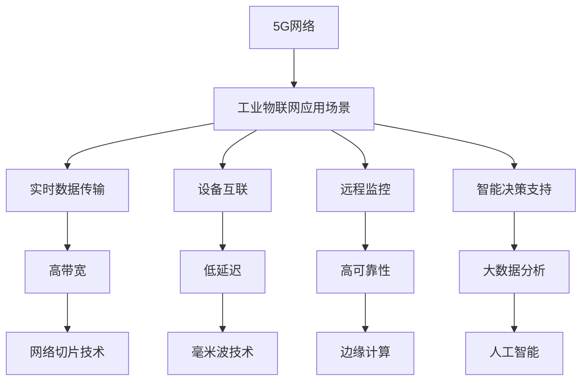

                 

## 文章标题: 5G网络在工业物联网中的实践与挑战

### 关键词：5G网络、工业物联网、实践、挑战、射频技术、毫米波技术、网络切片技术

#### 摘要：

本文将探讨5G网络在工业物联网（IIoT）中的实践与挑战。随着工业物联网的快速发展，对高速、低延迟和高可靠性的通信需求日益增长，5G网络凭借其独特的优势，成为工业物联网的关键支撑技术。本文首先概述了5G网络与工业物联网的关联，详细分析了5G网络的关键技术，如射频技术、毫米波技术和网络切片技术，然后深入探讨了工业物联网的现状与需求，最后通过Mermaid流程图展示了5G网络在工业物联网中的应用。本文旨在为读者提供一份全面、深入的5G网络在工业物联网领域的实践与挑战指南。

### 第一部分: 5G网络在工业物联网中的实践与挑战概述

#### 第1章: 5G网络在工业物联网中的概述

随着工业4.0的推进，工业物联网（IIoT）在全球范围内迅速发展，成为推动制造业数字化、网络化、智能化的重要力量。然而，传统的通信网络难以满足工业物联网对于高速率、低延迟和高可靠性的通信需求。5G网络的到来，为工业物联网带来了新的契机。

#### 1.1 5G网络与工业物联网的关联

5G网络，即第五代移动通信网络，相比于前几代移动通信网络，在速度、延迟和连接数等方面有了显著的提升。这些优势使得5G网络能够更好地满足工业物联网的需求。

##### 1.1.1 5G网络的优势

1. **高速率**：5G网络的峰值下载速度可达10Gbps，是4G网络的100倍以上。这意味着工业物联网中的大量数据可以在短时间内传输完毕，为实时数据处理提供了可能。

2. **低延迟**：5G网络的延迟仅为1毫秒，比4G网络减少了90%。这对于工业物联网中的实时控制和自动化系统至关重要，低延迟可以确保系统响应的及时性和准确性。

3. **高连接数**：5G网络能够支持每平方公里内连接数超过100万。这对于工业物联网中的大量设备互联，如传感器、机器人等，提供了充足的连接能力。

##### 1.1.2 工业物联网的挑战

尽管5G网络具有诸多优势，但在实际应用中，工业物联网仍面临着一系列挑战。

1. **安全性**：工业物联网涉及大量敏感数据，如生产计划、工艺参数等。5G网络的开放性使其更容易受到网络攻击，如何保障数据安全成为一大挑战。

2. **可靠性**：工业物联网要求通信网络的可靠性极高，一旦通信中断，可能导致生产事故。5G网络的稳定性需要得到进一步验证。

3. **兼容性**：工业物联网设备众多，如何确保5G网络与现有设备的兼容性，以及如何实现不同设备的无缝连接，是另一个挑战。

##### 1.1.3 5G网络如何赋能工业物联网

5G网络为工业物联网带来了前所未有的机遇。通过5G网络，可以实现以下几个方面的赋能：

1. **实时数据传输**：5G网络的高速率和低延迟，使得工业物联网中的大量数据可以实时传输，为实时监控和决策提供了基础。

2. **设备互联**：5G网络的高连接数，使得工业物联网中的大量设备可以无缝连接，实现设备的互联互通。

3. **远程监控**：5G网络的高速率和低延迟，使得远程监控成为可能。通过5G网络，可以实现对工业物联网中设备的远程监控和管理。

4. **智能决策支持**：5G网络的大数据分析能力，使得工业物联网中的海量数据可以得到有效的分析和利用，为智能决策提供了支持。

#### 1.2 5G网络的关键技术

5G网络的关键技术包括射频技术、毫米波技术和网络切片技术。这些技术为5G网络的高速率、低延迟和高可靠性提供了保障。

##### 1.2.1 射频技术

射频技术是5G网络的基础，用于信号的传输和接收。5G网络的射频信号频率范围从低频的600MHz到高频的26GHz。通过合理的射频信号调制与解调，可以实现高效的信号传输。

##### 1.2.2 毫米波技术

毫米波技术是5G网络的一项重要技术，利用高频段的信号进行传输。毫米波具有频带宽、传输速度快的特点，能够满足工业物联网对于高速数据传输的需求。

##### 1.2.3 网络切片技术

网络切片技术是5G网络的一项创新技术，通过将网络资源划分为多个虚拟网络，为不同应用场景提供定制化的网络服务。网络切片技术能够满足工业物联网中多样化的通信需求，提高网络资源的利用率。

#### 1.3 工业物联网的现状与需求

工业物联网在全球范围内得到了广泛的应用，主要应用领域包括智能制造、智能交通、智能电网等。工业物联网对通信网络的关键需求包括：

1. **高速率**：工业物联网需要传输大量数据，如传感器数据、视频监控数据等，高速率传输是基础。

2. **低延迟**：工业物联网中的实时控制和自动化系统，对延迟要求极高，低延迟是确保系统响应及时性的关键。

3. **高可靠性**：工业物联网的可靠性直接关系到生产的稳定性，高可靠性是保障生产正常进行的必要条件。

4. **安全性**：工业物联网涉及大量敏感数据，数据安全是保障生产安全和信息安全的关键。

#### 1.3.1 工业物联网的主要应用领域

工业物联网的主要应用领域包括：

1. **智能制造**：通过工业物联网技术，实现生产设备的互联互通，实现生产过程的数字化和智能化。

2. **智能交通**：通过工业物联网技术，实现交通系统的实时监控和管理，提高交通效率和安全性。

3. **智能电网**：通过工业物联网技术，实现电网的智能监控和调度，提高电网的运行效率和安全性。

#### 1.3.2 工业物联网的关键需求

工业物联网的关键需求包括：

1. **高速率**：工业物联网需要传输大量数据，如传感器数据、视频监控数据等，高速率传输是基础。

2. **低延迟**：工业物联网中的实时控制和自动化系统，对延迟要求极高，低延迟是确保系统响应及时性的关键。

3. **高可靠性**：工业物联网的可靠性直接关系到生产的稳定性，高可靠性是保障生产正常进行的必要条件。

4. **安全性**：工业物联网涉及大量敏感数据，数据安全是保障生产安全和信息安全的关键。

#### 1.3.3 工业物联网的未来发展趋势

随着5G网络的普及和应用，工业物联网将进入一个全新的发展阶段。未来，工业物联网的发展趋势包括：

1. **智能化**：通过引入人工智能技术，实现工业物联网的智能化，提高生产效率和智能化水平。

2. **集成化**：通过集成多种传感器和设备，实现工业物联网的集成化，提高系统的协同效应。

3. **绿色化**：通过优化生产流程和能源管理，实现工业物联网的绿色化，降低生产成本和环境影响。

### Mermaid流程图（5G网络在工业物联网中的应用）



### 第一部分总结：本章主要介绍了5G网络在工业物联网中的重要性，详细讲解了5G网络的关键技术及其在工业物联网中的应用场景和优势，为后续章节的深入讨论奠定了基础。

### 第二部分: 5G网络的关键技术解析

在第一部分中，我们概述了5G网络在工业物联网中的重要性。接下来，我们将深入探讨5G网络的关键技术，包括射频技术、毫米波技术和网络切片技术。这些关键技术为5G网络提供了高速率、低延迟和高可靠性的保障，为工业物联网的应用提供了坚实的基础。

#### 第2章: 5G网络的关键技术

#### 2.1 射频技术

射频技术是5G网络的基础，用于信号的传输和接收。射频信号是通过电磁波进行传播的，其频率范围通常在300Hz到300GHz之间。在5G网络中，射频技术主要涉及以下几个方面：

##### 2.1.1 射频信号传输原理

射频信号传输原理主要包括信号发射、信号传播和信号接收三个过程。首先，信号发射器将数字信号调制到射频载波上，通过天线发射出去。射频信号在空气中传播，遇到接收器天线后被接收，并通过解调过程将数字信号还原出来。

##### 2.1.2 射频信号调制与解调

调制是将数字信号转换为射频信号的过程，包括幅度调制（AM）、频率调制（FM）和相位调制（PM）等类型。解调则是将射频信号还原为数字信号的过程，通常与调制过程相对应。

##### 2.1.3 射频信号的频谱分配与管理

射频信号的频谱分配与管理是5G网络设计的关键。5G网络使用了低频、中频和高频多个频段，包括Sub-6GHz频段和毫米波频段。不同频段的射频信号具有不同的传播特性，如低频信号传播距离远，但带宽较小；高频信号带宽大，但传播距离短。因此，需要根据具体应用场景进行频谱分配和管理，以实现最优的网络性能。

#### 2.2 毫米波技术

毫米波技术是5G网络的一项重要技术，利用高频段的信号进行传输。毫米波频段的频率范围通常在30GHz到300GHz之间。毫米波技术在5G网络中具有以下优势：

##### 2.2.1 毫米波的基本概念

毫米波是指频率在30GHz到300GHz之间的电磁波。毫米波具有频带宽、传输速度快的特点，能够满足工业物联网对于高速数据传输的需求。

##### 2.2.2 毫米波在5G网络中的应用

毫米波技术在5G网络中的应用主要体现在以下几个方面：

1. **高带宽传输**：毫米波频段带宽较大，能够提供更高的数据传输速率，满足工业物联网中大量数据的传输需求。

2. **低延迟传输**：毫米波信号在空气中传播速度接近光速，能够实现低延迟传输，满足工业物联网中实时数据传输的需求。

3. **高分辨率成像**：毫米波具有较好的穿透能力，可以用于高分辨率成像，如雷达、无线通信等。

##### 2.2.3 毫米波技术的挑战与优化策略

尽管毫米波技术在5G网络中具有诸多优势，但同时也面临一些挑战：

1. **信号衰减**：毫米波信号在空气中传播时，信号衰减较快，需要采用高增益天线进行传输。

2. **频谱资源限制**：毫米波频段的频谱资源相对有限，需要合理分配和管理，避免频谱资源的浪费。

针对以上挑战，可以采用以下优化策略：

1. **多输入多输出（MIMO）技术**：通过使用多个发射和接收天线，可以提高信号传输的稳定性和可靠性。

2. **波束成形技术**：通过调整天线波束的方向和角度，可以提高信号传输的效率。

3. **频谱资源管理**：采用动态频谱分配和频谱共享技术，优化毫米波频谱资源的利用。

#### 2.3 网络切片技术

网络切片技术是5G网络的一项创新技术，通过将网络资源划分为多个虚拟网络，为不同应用场景提供定制化的网络服务。网络切片技术在工业物联网中具有广泛的应用，可以实现以下功能：

##### 2.3.1 网络切片的概念与原理

网络切片是将一个物理网络划分为多个虚拟网络，每个虚拟网络具有独立的网络资源和服务质量（QoS）保证。网络切片通过虚拟化技术实现，包括虚拟化网络功能（VNF）、虚拟化网络接口（VNI）和虚拟化路由器（VR）等组件。

##### 2.3.2 网络切片的应用场景

网络切片技术适用于多种应用场景，尤其在工业物联网中具有广泛的应用：

1. **工业自动化**：通过网络切片，可以为工业自动化系统提供低延迟、高带宽的网络服务，满足实时数据传输和远程控制的需求。

2. **智能交通**：网络切片技术可以实现不同类型的交通数据，如车辆监控、路况监测等，提供定制化的网络服务，提高交通管理的效率和安全性。

3. **智能制造**：网络切片技术可以为智能制造中的不同设备提供定制化的网络服务，如传感器数据传输、设备远程监控等，提高生产效率和产品质量。

##### 2.3.3 网络切片的实现机制

网络切片的实现机制主要包括以下几个步骤：

1. **切片规划**：根据应用需求，规划不同网络切片的资源配置和服务质量要求。

2. **切片创建**：通过虚拟化技术，创建不同网络切片，包括虚拟化网络功能（VNF）、虚拟化网络接口（VNI）和虚拟化路由器（VR）等。

3. **切片分配**：根据用户需求，将网络切片分配给不同设备和服务。

4. **切片监控**：对网络切片的运行状态进行监控，确保网络切片的服务质量。

#### 伪代码示例（网络切片的实现机制）

```python
# 定义网络切片参数
network_slice_params = {
    "slice_id": 1,
    "resources": ["bandwidth", "latency", "throughput"],
    "requirements": {"bandwidth": 100, "latency": 1, "throughput": 10}
}

# 网络切片分配函数
def allocate_network_slice(params):
    """
    分配网络切片资源
    :param params: 网络切片参数
    :return: 网络切片分配结果
    """
    # 检查资源是否满足要求
    if check_resources_availability(params["resources"], params["requirements"]):
        # 分配资源
        allocate_resources(params["resources"])
        return "Network slice allocated successfully"
    else:
        return "Insufficient resources for network slice allocation"

# 检查资源是否满足要求
def check_resources_availability(resources, requirements):
    """
    检查资源是否满足要求
    :param resources: 可用资源
    :param requirements: 要求的资源
    :return: 是否满足要求
    """
    for resource in requirements:
        if resource not in resources or resources[resource] < requirements[resource]:
            return False
    return True

# 调用函数
result = allocate_network_slice(network_slice_params)
print(result)
```

#### 第二部分总结：本章详细解析了5G网络的关键技术，包括射频技术、毫米波技术和网络切片技术。这些技术为5G网络提供了高速率、低延迟和高可靠性的保障，为工业物联网的应用提供了坚实的基础。在下一章中，我们将继续探讨工业物联网的现状与需求，以及5G网络在工业物联网中的应用与实践。

