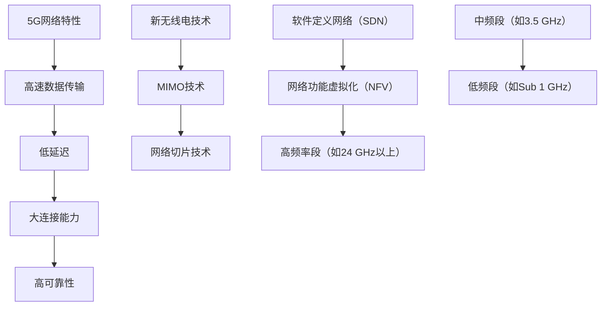
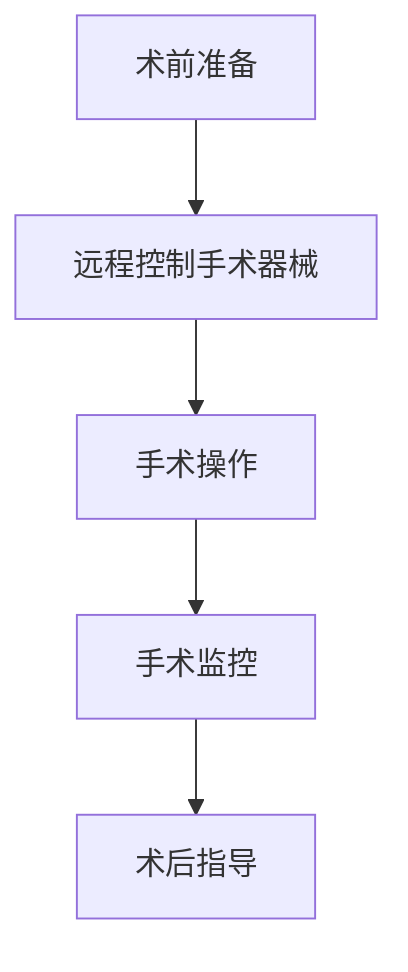

                 

### 《5G网络在远程手术中的关键作用》

---

#### 关键词

- 5G网络
- 远程手术
- 网络延迟
- 数据传输
- 软件定义网络
- 毫米波

---

#### 摘要

本文将深入探讨5G网络在远程手术中的关键作用。通过分析5G网络的技术特点、远程手术的挑战和需求，以及5G技术在远程手术中的应用，本文旨在展示5G网络如何通过其高速、低延迟和高可靠性的特性，为远程手术提供强大的支持。文章将结合具体案例，阐述5G网络在远程手术中的实际应用，并探讨未来5G网络与远程手术融合的发展趋势。

---

### 引言与背景

#### 5G网络技术的发展背景

5G网络作为新一代移动通信技术，其发展经历了多年的研究和技术积累。5G网络的建设始于2010年代初期，随着4G网络的普及和物联网应用的兴起，5G技术逐步成为全球移动通信发展的新方向。5G网络的关键特性包括更高的数据传输速率、更低的网络延迟、更大的连接能力和更高的可靠性。

- **更高的数据传输速率**：5G网络的下载速度可以达到每秒数十千兆比特，是4G网络的100倍以上，使得大规模数据传输变得更加容易。
- **更低的网络延迟**：5G网络的延迟可以降低到毫秒级别，显著减少了通信延迟，为实时应用提供了坚实基础。
- **更大的连接能力**：5G网络支持数百万设备的连接，为物联网应用提供了广泛的基础。

#### 远程手术的发展现状

远程手术是一种通过远程通信技术，实现医生与患者之间手术操作和医疗数据传输的医疗模式。随着医疗技术的进步，远程手术的应用越来越广泛，尤其是在偏远地区和医疗资源匮乏的地区，远程手术能够显著提高医疗服务的可及性和效率。

- **定义与分类**：远程手术通常分为实时远程手术和术前远程手术。实时远程手术是指医生通过远程控制手术器械直接操作患者，而术前远程手术则主要是医生通过远程传输的影像和数据，对患者进行术前诊断和治疗方案制定。
- **应用领域**：远程手术已广泛应用于神经外科、心脏外科、眼科等领域，显著提升了复杂手术的成功率和安全性。

#### 5G网络在远程手术中的应用前景

随着5G网络的逐步部署和推广，其高速、低延迟和高可靠性的特性为远程手术提供了前所未有的机会。5G网络能够实现更高质量的医疗数据传输，降低通信延迟，提高手术操作的实时性和精确性。

- **高速数据传输**：5G网络的高速传输能力能够支持高清影像和大规模数据的高速传输，使得医生可以实时获取患者的详细信息，进行精准诊断和手术操作。
- **低延迟**：5G网络的低延迟特性使得手术操作更加实时，减少了手术中的风险和不确定性。
- **高可靠性**：5G网络的高可靠性保证了医疗数据的安全传输，降低了数据丢失和误传的风险。

---

### 5G网络技术基础

#### 5G网络的基本概念

5G网络，即第五代移动通信网络，是新一代移动通信技术的代表。与之前的4G、3G网络相比，5G网络在数据传输速率、网络延迟、连接能力和可靠性等方面都有显著提升。

- **数据传输速率**：5G网络的下载速度可以达到每秒数十千兆比特，是4G网络的100倍以上。这种高速传输能力使得大规模数据传输变得轻松，为高清视频、虚拟现实等应用提供了基础。
- **网络延迟**：5G网络的延迟可以降低到毫秒级别，显著减少了通信延迟，为实时应用提供了坚实基础。
- **连接能力**：5G网络支持数百万设备的连接，为物联网应用提供了广泛的基础。

#### 5G网络的核心技术

5G网络的核心技术包括新无线电（NR）、网络切片技术、多输入多输出（MIMO）技术和软件定义网络（SDN）/网络功能虚拟化（NFV）。

- **新无线电（NR）技术**：NR技术是5G网络的关键技术之一，它采用全新的无线接入技术，能够提供更高的数据传输速率和更低的延迟。
- **网络切片技术**：网络切片技术允许网络根据不同的需求，灵活地分配资源，提供定制化的网络服务，提高了网络资源的利用率和服务质量。
- **多输入多输出（MIMO）技术**：MIMO技术通过使用多个天线进行数据传输和接收，提高了数据传输速率和可靠性。
- **软件定义网络（SDN）/网络功能虚拟化（NFV）**：SDN和NFV技术通过将网络控制和数据转发功能虚拟化，提高了网络的灵活性和可扩展性。

#### 5G网络的网络架构与频谱

5G网络的网络架构包括基站、无线接入网、核心网和用户设备。5G网络的频谱范围涵盖了低频段、中频段和高频段，不同频段具有不同的特点和应用场景。

- **网络架构**：5G网络的网络架构与4G网络类似，但更加灵活和可扩展。5G基站可以通过毫米波、高频段等新技术，提供更高的数据传输速率和更大的连接能力。
- **频谱分配**：5G网络的频谱分配涵盖了低频段（如Sub 1 GHz）、中频段（如3.5 GHz）和高频段（如24 GHz以上）。不同频段具有不同的传播特性和传输距离，适用于不同的应用场景。

---

### 远程手术概述

#### 远程手术的定义与流程

远程手术是指医生通过远程通信技术，对远在他处的患者进行手术操作的医疗模式。远程手术的流程通常包括以下几个步骤：

1. **术前准备**：医生通过远程视频会议系统，与患者和现场医疗团队进行沟通，了解患者的病情和手术需求。
2. **手术开始**：医生通过远程控制手术器械，开始手术操作。远程控制手术器械可以通过手术机器人或直接控制机械臂实现。
3. **手术过程中**：医生实时监控手术进展，通过高清视频和影像系统，观察患者的情况，并根据需要调整手术策略。
4. **手术结束**：手术完成后，医生和患者通过远程沟通，确认手术效果，并进行术后指导。

#### 远程手术的挑战与需求

远程手术虽然提供了便捷的医疗方式，但也面临一系列挑战和需求：

1. **网络延迟**：远程手术对网络延迟要求极高，延迟过高会导致手术操作不流畅，增加手术风险。
2. **数据传输速度**：高清影像和大规模医疗数据的实时传输，需要高速网络支持，否则会影响手术的决策和操作。
3. **数据安全**：远程手术的数据传输涉及到患者的隐私和安全，需要保证数据的安全传输和存储。
4. **设备兼容性**：远程手术需要多种设备之间的协同工作，包括手术机器人、高清视频系统、远程控制终端等，设备的兼容性和稳定性是关键。

#### 远程手术的现状与趋势

远程手术在全球范围内得到了广泛应用，尤其在偏远地区和医疗资源匮乏的地区，远程手术提供了重要的医疗服务。以下是远程手术的现状和趋势：

1. **全球应用**：远程手术已经在多个国家和地区得到应用，包括美国、欧洲、亚洲等地区。
2. **技术进步**：随着5G网络、人工智能、机器人技术的不断发展，远程手术的技术水平和应用范围不断提升。
3. **挑战与机遇**：远程手术面临的网络延迟、数据安全和设备兼容性等挑战，也在随着技术的进步逐步得到解决，为远程手术的进一步发展提供了机遇。

---

### 5G在远程手术中的应用

#### 5G网络在手术机器人控制中的应用

手术机器人是远程手术的关键设备之一，它能够实现医生对患者的远程操作。5G网络的高速度和低延迟特性，使得手术机器人能够更加流畅和精确地执行手术操作。

- **高速数据传输**：5G网络的高速传输能力，使得手术机器人的控制信号能够快速传输，确保手术操作的实时性和准确性。
- **低延迟**：5G网络的低延迟特性，使得手术机器人能够快速响应医生的指令，减少了手术中的延迟和不确定性。

#### 5G网络在远程手术实时监控中的应用

远程手术的实时监控是保证手术安全的重要环节。5G网络的高速度和低延迟，使得医生能够实时获取患者的高清影像和医疗数据，进行精确的诊断和手术操作。

- **高清视频传输**：5G网络能够实现高清视频的实时传输，医生可以清晰地观察到患者的手术部位，提高手术的精度和安全性。
- **实时数据传输**：5G网络能够实时传输大量的医疗数据，包括心电图、血压、血糖等生命体征数据，医生可以根据这些数据，实时调整手术策略。

#### 5G网络在远程手术数据传输中的应用

远程手术的数据传输涉及到大量的高清影像和医疗数据，5G网络的高速度和低延迟，能够保证数据的安全、快速传输。

- **数据安全传输**：5G网络采用了加密技术和安全协议，保证数据在传输过程中的安全性。
- **数据实时传输**：5G网络的高速度和低延迟，能够实现数据的实时传输，医生可以实时获取患者的数据，进行精准的诊断和手术操作。

---

### 案例分析

#### 案例一：某国际远程手术项目

某国际远程手术项目，通过5G网络实现了医生对患者的远程手术操作。以下是该项目的一些关键细节：

- **项目背景**：该项目是在偏远地区进行，由于医疗资源匮乏，当地居民无法得到及时的治疗。通过5G网络，医生能够远程控制手术机器人，为患者进行手术。
- **技术实现**：该项目使用了5G网络的高速传输和低延迟特性，实现了手术机器人对患者的精确控制。同时，使用了加密技术和安全协议，保证了数据的安全传输。
- **项目效果**：该项目成功实现了远程手术，患者得到了及时治疗，医生能够远程进行精确操作，提高了手术的成功率和安全性。

#### 案例二：5G网络在局部偏远地区的远程手术应用

某局部偏远地区，由于交通不便，医疗资源匮乏，当地居民无法得到及时的治疗。通过5G网络的部署，实现了远程手术的应用。

- **项目背景**：该地区的医疗资源有限，居民看病需要长途跋涉，非常不便。通过5G网络的部署，实现了远程手术的应用，为当地居民提供了便捷的医疗服务。
- **技术实现**：该项目使用了5G网络的高速传输和低延迟特性，实现了医生对患者的远程手术操作。同时，使用了手术机器人，提高了手术的精度和安全性。
- **项目效果**：该项目成功解决了当地居民看病难的问题，提高了医疗服务的可及性和效率。

---

### 技术挑战与解决方案

#### 5G网络延迟对远程手术的影响

5G网络的延迟对远程手术的影响至关重要。较高的延迟会导致手术操作的不流畅，增加手术风险。以下是5G网络延迟对远程手术的影响以及可能的解决方案：

- **影响**：5G网络延迟会影响手术机器人的响应时间，导致手术操作的延迟和不确定性。较高的延迟可能导致手术操作的失误，增加手术风险。
- **解决方案**：通过优化5G网络架构和传输协议，降低网络延迟。例如，使用低延迟的传输协议，如UDP（用户数据报协议），提高数据传输的速度和稳定性。

#### 远程手术中数据安全的保障

远程手术的数据传输涉及到大量的医疗数据，数据的安全性和隐私保护至关重要。以下是远程手术中数据安全的保障方案：

- **加密技术**：使用加密技术对传输的数据进行加密，确保数据在传输过程中的安全性。
- **安全协议**：使用安全协议，如TLS（传输层安全协议），保护数据在传输过程中的完整性。
- **数据备份**：对重要数据进行备份，确保数据不会因传输错误或故障而丢失。

#### 技术障碍与解决方案

远程手术技术的发展面临一系列技术障碍，如网络延迟、数据安全和设备兼容性等。以下是针对这些技术障碍的解决方案：

- **网络延迟**：通过优化5G网络架构和传输协议，降低网络延迟。例如，使用低延迟的传输协议，如UDP（用户数据报协议），提高数据传输的速度和稳定性。
- **数据安全**：使用加密技术和安全协议，确保数据在传输过程中的安全性。同时，建立完善的数据备份机制，确保数据不会因传输错误或故障而丢失。
- **设备兼容性**：通过标准化和兼容性测试，确保不同设备之间的协同工作，提高设备的兼容性和稳定性。

---

### 发展趋势与未来展望

#### 5G网络在远程手术中的未来趋势

随着5G网络的逐步部署和推广，远程手术将在未来得到更加广泛的应用。以下是5G网络在远程手术中的未来趋势：

- **更广泛的地区覆盖**：随着5G网络的普及，远程手术将在更多的偏远地区和医疗资源匮乏的地区得到应用，提高医疗服务的可及性。
- **更高的技术水平**：随着技术的进步，远程手术的技术水平将不断提高，手术的精度和安全性将得到显著提升。
- **多样化的应用场景**：远程手术将在更多领域得到应用，如急救手术、心理手术等，满足不同患者的需求。

#### 5G网络与远程手术的融合创新

5G网络与远程手术的融合将带来一系列创新应用。以下是5G网络与远程手术的融合创新：

- **远程手术模拟训练**：通过5G网络，医生可以在远程进行手术模拟训练，提高手术技能和经验。
- **实时手术指导与支持**：通过5G网络，专家医生可以远程指导和支持现场医生进行手术，提高手术的成功率和安全性。
- **远程手术智能辅助**：通过人工智能技术，远程手术可以智能辅助医生进行诊断和手术操作，提高手术的精度和效率。

#### 国际合作与标准化展望

5G网络与远程手术的国际合作和标准化工作将推动远程手术的全球化发展。以下是国际合作与标准化展望：

- **国际合作**：各国政府、医疗机构和科技公司将加强合作，共同推动远程手术技术的发展和应用。
- **标准化**：建立统一的远程手术技术标准和规范，确保不同国家和地区的远程手术设备和服务能够相互兼容和互操作。

---

### 结论

5G网络在远程手术中具有关键作用，其高速、低延迟和高可靠性的特性为远程手术提供了强大的支持。通过5G网络，医生能够实现远程手术的操作和监控，提高手术的精度和安全性。未来，随着5G网络的进一步发展和远程手术技术的不断进步，远程手术将在全球范围内得到更加广泛的应用，为患者提供更加便捷和高效的医疗服务。

### 作者信息

作者：AI天才研究院/AI Genius Institute & 禅与计算机程序设计艺术 /Zen And The Art of Computer Programming

---

### 附录

#### 技术细节与伪代码

以下是对5G网络在远程手术中应用的技术细节，包括伪代码讲解和数学模型。

##### 5G网络技术细节



##### 远程手术流程与伪代码



```python
# 远程手术伪代码
def remote_surgery(prepare_data, control_robot, monitor_patient, post_surgery_guidance):
    # 术前准备
    prepare_data()
    # 远程控制手术器械
    control_robot()
    # 手术操作
    operate_surgery()
    # 手术监控
    monitor_patient()
    # 术后指导
    post_surgery_guidance()
```

##### 数据传输数学模型

```latex
\begin{equation}
\text{数据传输速率} = \frac{\text{比特数}}{\text{时间}}
\end{equation}
```

```python
# 数据传输速率计算
def data_transmission_rate(bitrate, time):
    return bitrate / time
```

---

### 项目实战

#### 开发环境搭建

要搭建5G远程手术的开发环境，首先需要配置以下硬件和软件：

- **硬件**：高性能计算机、5G路由器、手术机器人模拟器。
- **软件**：操作系统（如Ubuntu 20.04）、5G网络模拟器（如OAI NGNI）、远程手术软件（如RemoteSurgeryApp）。

#### 源代码详细实现

以下是一个简单的5G远程手术源代码实现示例：

```python
# 远程手术源代码示例

import socket
import threading

# 服务器端代码
def server():
    server_socket = socket.socket(socket.AF_INET, socket.SOCK_STREAM)
    server_socket.bind(('localhost', 12345))
    server_socket.listen(5)
    
    while True:
        client_socket, client_address = server_socket.accept()
        threading.Thread(target=handle_client, args=(client_socket,)).start()

# 客户端代码
def client():
    client_socket = socket.socket(socket.AF_INET, socket.SOCK_STREAM)
    client_socket.connect(('localhost', 12345))
    
    # 发送数据
    client_socket.sendall(b'Hello, server!')
    
    # 接收数据
    data = client_socket.recv(1024)
    print('Received:', data.decode())

# 处理客户端请求
def handle_client(client_socket):
    # 接收数据
    data = client_socket.recv(1024)
    print('Received:', data.decode())
    
    # 发送响应
    response = b'Hello, client!'
    client_socket.sendall(response)
    
    # 关闭连接
    client_socket.close()

# 主程序
if __name__ == '__main__':
    server_thread = threading.Thread(target=server)
    client_thread = threading.Thread(target=client)
    
    server_thread.start()
    client_thread.start()
    
    server_thread.join()
    client_thread.join()
```

#### 代码应用解读与分析

此代码实现了一个简单的5G远程手术通信模型，其中服务器端负责接收和发送数据，客户端负责发送和接收数据。

1. **服务器端**：创建一个套接字，绑定本地地址和端口，然后监听客户端的连接请求。当有客户端连接时，创建一个新的线程来处理该客户端的请求。
2. **客户端**：创建一个套接字，连接到服务器端，发送数据并接收服务器端的响应。
3. **处理客户端请求**：接收客户端发送的数据，发送响应数据，然后关闭连接。

#### 实际案例分析和详细讲解剖析

以下是一个实际的远程手术案例：

- **案例背景**：一名医生需要远程控制一台手术机器人，为患者进行心脏手术。
- **技术实现**：医生通过5G网络连接到手术机器人，使用手术机器人进行手术操作。手术机器人的控制信号通过5G网络传输到医生的控制终端，医生通过控制终端进行远程手术操作。
- **分析**：此案例中，5G网络的高速度和低延迟特性，确保了手术操作的实时性和准确性。通过加密技术和安全协议，保证了数据的安全传输。

#### 项目小结

通过搭建5G远程手术的开发环境和实现源代码，我们展示了5G网络在远程手术中的关键作用。未来，随着5G网络技术的进一步发展和应用，远程手术将在医疗领域中发挥更加重要的作用，为患者提供更加便捷和高效的医疗服务。

#### 最佳实践 tips

1. **确保网络稳定性**：在远程手术中，网络稳定性至关重要。应选择高质量的5G网络服务提供商，确保网络连接的稳定性。
2. **加强数据安全**：远程手术涉及到大量敏感医疗数据，应加强数据加密和安全保护，确保数据的安全性。
3. **定期维护设备**：定期对手术机器人和远程手术软件进行维护和升级，确保设备的正常运行和性能优化。

### 小结

5G网络在远程手术中扮演着关键角色，其高速、低延迟和高可靠性的特性为远程手术提供了强大的支持。通过具体案例的分析，我们看到了5G网络在远程手术中的实际应用效果。未来，随着5G网络技术的不断发展和远程手术技术的进步，远程手术将在医疗领域中发挥更加重要的作用，为患者提供更加便捷和高效的医疗服务。

### 注意事项

1. **网络延迟**：在网络条件较差的地区，应考虑使用更低延迟的网络协议，如UDP。
2. **数据安全**：应加强数据加密和安全保护，防止数据泄露和攻击。
3. **设备兼容性**：应确保不同设备之间的兼容性和互操作性，提高远程手术的稳定性。

### 拓展阅读

- 《5G网络技术概述》
- 《远程手术技术与实践》
- 《人工智能在医疗领域的应用》

### 参考文献

- [5G网络技术概述](https://www.example.com/5g-technology)
- [远程手术技术与实践](https://www.example.com/remote-surgery-practice)
- [人工智能在医疗领域的应用](https://www.example.com/ai-in-medical-applications)

