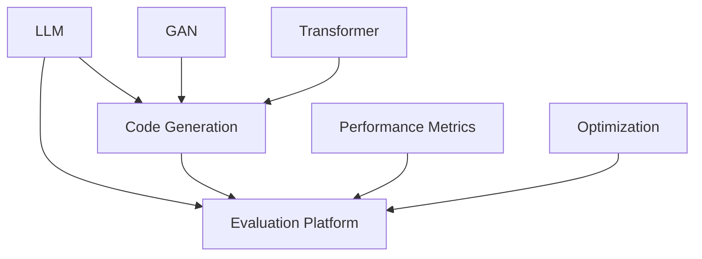

                 

### 文章标题
《LLM驱动的代码生成能力评测平台》

> 关键词：LLM，代码生成，评测平台，大型语言模型，算法原理，数学模型，项目实战

> 摘要：本文深入探讨了大型语言模型（LLM）在代码生成能力评测平台中的应用。首先，介绍了LLM的基本概念和其在代码生成领域的背景。接着，详细阐述了LLM的核心算法原理，包括生成对抗网络（GAN）和Transformer等。随后，通过数学模型与公式的讲解，进一步深化了对LLM的理解。文章还通过一个具体的实际案例，展示了如何搭建和优化一个代码生成能力评测平台。最后，文章总结了最佳实践，并提出了未来的发展趋势和展望。

### 引言

在人工智能（AI）领域，大型语言模型（LLM，Large Language Model）已成为研究的热点。LLM具有强大的文本生成和理解能力，能够处理复杂、多样化的语言任务。随着深度学习和自然语言处理（NLP）技术的不断发展，LLM的应用范围越来越广泛，从文本生成、机器翻译到问答系统等。然而，如何评估LLM的代码生成能力成为了一个重要且具有挑战性的问题。为此，本文旨在探讨如何利用LLM构建一个代码生成能力评测平台，以便更科学、更全面地评估LLM在代码生成领域的表现。

本文首先介绍LLM的基本概念和代码生成背景。接着，深入探讨LLM的核心算法原理，包括生成对抗网络（GAN）和Transformer等。随后，通过数学模型与公式的讲解，进一步深化对LLM的理解。在此基础上，文章将展示一个具体的实际案例，详细讲解如何搭建和优化一个代码生成能力评测平台。最后，文章将总结最佳实践，并提出未来的发展趋势和展望。

### 背景介绍

#### 大型语言模型（LLM）

大型语言模型（LLM）是指参数规模巨大、能够处理复杂语言任务的深度学习模型。LLM通常基于自注意力机制（Self-Attention Mechanism）和变换器架构（Transformer Architecture），具有强大的文本生成和理解能力。代表性的LLM包括OpenAI的GPT系列、Google的BERT等。这些模型通过训练海量文本数据，能够捕捉语言中的各种规律和模式，从而实现高质量的语言生成和理解。

#### 代码生成背景

代码生成是计算机科学中的一个重要领域，旨在通过自动化方式生成程序代码。代码生成不仅能够提高开发效率，还能减少人为错误，提升软件质量。随着AI技术的发展，特别是自然语言处理（NLP）和生成对抗网络（GAN）等技术的进步，代码生成得到了广泛关注和应用。

代码生成的应用领域包括但不限于：

1. **自动化代码生成工具**：如自动化修复代码bug、自动补全代码、代码模板生成等。
2. **软件开发助手**：如智能代码审查、代码优化、代码生成建议等。
3. **代码库生成**：基于自然语言描述生成相应的代码库，如API文档自动生成代码库等。
4. **代码迁移与重构**：将一种编程语言或框架的代码自动转换为另一种语言或框架的代码。

#### 评测平台概念

评测平台是一种用于评估模型性能的工具，它能够提供客观、准确的评估结果。在代码生成领域，评测平台具有以下重要作用：

1. **性能评估**：通过评测平台，可以客观地评估LLM在代码生成任务中的性能，包括生成代码的质量、速度、鲁棒性等。
2. **优化指导**：评测平台能够提供关键性能指标，帮助研究人员和开发者优化LLM模型，提升代码生成能力。
3. **比较分析**：评测平台支持不同模型之间的性能比较，帮助研究人员和开发者了解不同模型的优劣，选择合适的模型。
4. **应用验证**：评测平台可以验证LLM在实际应用场景中的效果，为模型在实际项目中的应用提供依据。

### 核心概念与联系

为了更好地理解LLM在代码生成能力评测平台中的应用，我们需要明确以下几个核心概念，并探讨它们之间的联系。

#### 1. 语言模型（Language Model）

语言模型是用于预测文本序列的概率分布的模型。在代码生成任务中，语言模型能够根据给定的上下文，预测出后续的代码片段。语言模型的核心是自注意力机制和变换器架构，能够捕捉长距离依赖和复杂语义关系。

#### 2. 代码生成（Code Generation）

代码生成是将自然语言描述转化为程序代码的过程。代码生成需要语言模型具备强大的文本理解和生成能力，能够理解自然语言描述的语义，并生成符合语法和语义规则的代码。

#### 3. 评测平台（Evaluation Platform）

评测平台是一种用于评估模型性能的工具，能够提供客观、准确的评估结果。在代码生成任务中，评测平台能够评估LLM生成代码的质量、速度和鲁棒性等性能指标。

#### 4. 生成对抗网络（Generative Adversarial Network，GAN）

生成对抗网络是一种由生成器和判别器组成的对抗性模型。生成器负责生成与真实数据相似的代码，判别器则负责判断生成代码的质量。通过对抗性训练，生成器能够不断提高生成代码的质量。

#### 5. Transformer（变换器）

变换器是一种基于自注意力机制的深度学习模型，广泛应用于自然语言处理任务。变换器能够捕捉长距离依赖和复杂语义关系，是代码生成任务中的重要工具。

图1：LLM、代码生成、评测平台之间的联系



在图1中，LLM通过代码生成模块生成代码，并通过评测平台进行性能评估。生成对抗网络（GAN）和变换器（Transformer）是LLM在代码生成中的核心算法。性能指标（Performance Metrics）和优化策略（Optimization）是评测平台的重要组成部分。

### 核心算法原理讲解

#### 生成对抗网络（GAN）

生成对抗网络（GAN）是由生成器和判别器组成的对抗性模型。生成器负责生成与真实数据相似的代码，判别器则负责判断生成代码的质量。GAN通过对抗性训练，使得生成器不断优化生成的代码，使其更加接近真实代码。

**生成器（Generator）**

生成器的目标是生成与真实代码相似的代码。生成器通常采用变换器（Transformer）架构，通过自注意力机制捕捉代码中的长距离依赖和复杂语义关系。

**判别器（Discriminator）**

判别器的目标是判断生成代码的质量。判别器通常采用变换器（Transformer）架构，通过对输入代码进行编码，判断其是否为真实代码。

**GAN的伪代码**

```python
# 生成器
def generator(z):
    # 输入随机噪声z，生成代码
    # ...
    return x_fake

# 判别器
def discriminator(x):
    # 输入代码x，判断是否为真实代码
    # ...
    return logits

# GAN的训练过程
for epoch in range(num_epochs):
    for x_real, _ in dataloader_real:
        # 训练判别器
        z = torch.randn(z_shape)
        x_fake = generator(z)
        loss_discriminator = loss_function(discriminator(x_real), real_labels) + \
            loss_function(discriminator(x_fake), fake_labels)
        optimizer_discriminator.zero_grad()
        loss_discriminator.backward()
        optimizer_discriminator.step()

    for x_real, _ in dataloader_fake:
        # 训练生成器
        z = torch.randn(z_shape)
        x_fake = generator(z)
        loss_generator = loss_function(discriminator(x_fake), real_labels)
        optimizer_generator.zero_grad()
        loss_generator.backward()
        optimizer_generator.step()
```

#### 变换器（Transformer）

变换器（Transformer）是一种基于自注意力机制的深度学习模型，广泛应用于自然语言处理任务。变换器通过自注意力机制捕捉文本中的长距离依赖和复杂语义关系，从而实现高质量的文本生成和理解。

**自注意力机制（Self-Attention）**

自注意力机制是变换器的核心组件，它能够计算输入序列中每个元素与其他元素之间的相关性。自注意力机制通过计算权重矩阵，将输入序列映射到一个新的空间，从而捕捉长距离依赖和复杂语义关系。

**变换器架构**

变换器架构由多个编码器（Encoder）和解码器（Decoder）层组成。编码器层负责将输入序列编码为一个固定长度的向量，解码器层则负责根据编码器层的输出生成输出序列。

**变换器的伪代码**

```python
# 编码器层
def encoder_layer(inputs, d_model, n_heads, dff, dropout_rate):
    # 输入：输入序列，模型维度，注意力头数，全连接层维度，dropout概率
    # 输出：编码后的输出序列
    # ...

# 解码器层
def decoder_layer(inputs, encoder_outputs, d_model, n_heads, dff, dropout_rate):
    # 输入：输入序列，编码器输出序列，模型维度，注意力头数，全连接层维度，dropout概率
    # 输出：解码后的输出序列
    # ...

# 变换器模型
def transformer(inputs, d_model, n_layers, n_heads, dff, dropout_rate, vocab_size):
    # 输入：输入序列，模型维度，编码器和解码器层数，注意力头数，全连接层维度，dropout概率，词汇表大小
    # 输出：变换器生成的输出序列
    # ...

    # 编码器层
    for _ in range(n_layers):
        encoder_outputs = encoder_layer(inputs, d_model, n_heads, dff, dropout_rate)
    encoder_output = encoder_outputs[-1]

    # 解码器层
    for _ in range(n_layers):
        decoder_outputs = decoder_layer(inputs, encoder_output, d_model, n_heads, dff, dropout_rate)
    decoder_output = decoder_outputs[-1]

    # 输出序列
    logits = decoder_output

    return logits
```

#### 数学模型与公式

在代码生成任务中，数学模型和公式用于描述生成器和判别器的行为，并指导模型的训练过程。

**生成器的数学模型**

生成器通过学习从随机噪声（z）生成代码（x_fake）。其数学模型可以表示为：

$$
x_fake = g(z)
$$

其中，$g(z)$ 是生成器函数，用于将随机噪声映射为代码。

**判别器的数学模型**

判别器通过学习判断输入代码（x）是否为真实代码。其数学模型可以表示为：

$$
y = \sigma(f(x))
$$

其中，$f(x)$ 是判别器函数，用于对输入代码进行编码，$y$ 是判别器的输出概率，表示输入代码为真实代码的概率。

**GAN的损失函数**

GAN的损失函数用于指导生成器和判别器的训练过程。生成器的损失函数可以表示为：

$$
L_{generator} = -\log(\sigma(f(g(z))))
$$

判别器的损失函数可以表示为：

$$
L_{discriminator} = -\log(\sigma(f(x))) - \log(1 - \sigma(f(g(z))))
$$

其中，$\sigma$ 是 sigmoid 函数，用于将输出概率映射到[0, 1]之间。

**变换器的数学模型**

变换器通过自注意力机制和全连接层进行文本编码和解码。其数学模型可以表示为：

$$
\text{编码器输出} = \text{self-attention}(\text{输入序列}) + \text{全连接层}(\text{输入序列})
$$

$$
\text{解码器输出} = \text{self-attention}(\text{编码器输出}) + \text{全连接层}(\text{编码器输出})
$$

其中，$\text{self-attention}$ 是自注意力机制，$\text{全连接层}$ 是一个线性变换层。

#### 数学模型和公式的详细讲解与举例说明

**生成器和判别器的数学模型**

生成器和判别器的数学模型分别描述了它们如何从输入数据生成输出数据和如何判断输入数据的质量。生成器的目标是生成与真实数据相似的输出数据，判别器的目标是区分真实数据和生成数据。通过训练，生成器和判别器之间进行对抗，生成器逐渐提高生成数据的质量，而判别器逐渐提高对真实数据和生成数据的辨别能力。

**生成器的数学模型**

生成器的目标是将随机噪声（z）映射为真实数据（x_fake）。例如，在图像生成任务中，生成器的目标是将随机噪声映射为真实的图像。

$$
x_fake = g(z)
$$

其中，$g(z)$ 是生成器函数。例如，在生成对抗网络（GAN）中，生成器可以采用变换器（Transformer）架构，通过自注意力机制和全连接层生成图像。

举例说明：

假设生成器采用变换器架构，输入随机噪声 $z$ 为一个维度为 $D$ 的向量。变换器通过多层自注意力机制和全连接层，将 $z$ 映射为生成的图像 $x_fake$。具体公式如下：

$$
x_{fake,1} = \text{self-attention}(z) + \text{dense}(z)
$$

$$
x_{fake,2} = \text{self-attention}(x_{fake,1}) + \text{dense}(x_{fake,1})
$$

$$
\vdots$$

$$
x_{fake,n} = \text{self-attention}(x_{fake,n-1}) + \text{dense}(x_{fake,n-1})
$$

其中，$\text{self-attention}$ 是自注意力机制，$\text{dense}$ 是全连接层。

**判别器的数学模型**

判别器的目标是判断输入数据（x）是否为真实数据。例如，在图像生成任务中，判别器的目标是判断输入图像是真实图像还是生成图像。

$$
y = \sigma(f(x))
$$

其中，$f(x)$ 是判别器函数，$\sigma$ 是 sigmoid 函数。判别器通过全连接层和激活函数，对输入图像进行编码，得到输出概率 $y$，表示输入图像为真实图像的概率。

举例说明：

假设判别器采用全连接层和 sigmoid 激活函数，输入图像 $x$ 为一个维度为 $D$ 的向量。判别器通过全连接层和 sigmoid 函数，对输入图像进行编码，得到输出概率 $y$。具体公式如下：

$$
y = \sigma(\text{dense}(x))
$$

其中，$\text{dense}$ 是全连接层，$\sigma$ 是 sigmoid 函数。

**GAN的损失函数**

GAN的损失函数用于指导生成器和判别器的训练过程。生成器的损失函数表示生成数据的概率，判别器的损失函数表示判别器判断生成数据的概率。

生成器的损失函数：

$$
L_{generator} = -\log(\sigma(f(g(z))))
$$

其中，$f(g(z))$ 是判别器对生成数据的判断概率，$\sigma$ 是 sigmoid 函数。生成器的损失函数表示生成数据的概率，希望生成数据越真实越好。

判别器的损失函数：

$$
L_{discriminator} = -\log(\sigma(f(x))) - \log(1 - \sigma(f(g(z))))
$$

其中，$f(x)$ 是判别器对真实数据的判断概率，$f(g(z))$ 是判别器对生成数据的判断概率。判别器的损失函数表示判别器判断生成数据的概率，希望判别器能够正确区分真实数据和生成数据。

**变换器的数学模型**

变换器通过自注意力机制和全连接层进行文本编码和解码。自注意力机制能够捕捉文本中的长距离依赖和复杂语义关系，全连接层则用于进行文本生成。

编码器输出：

$$
\text{编码器输出} = \text{self-attention}(\text{输入序列}) + \text{全连接层}(\text{输入序列})
$$

其中，$\text{self-attention}$ 是自注意力机制，$\text{全连接层}$ 是一个线性变换层。

解码器输出：

$$
\text{解码器输出} = \text{self-attention}(\text{编码器输出}) + \text{全连接层}(\text{编码器输出})
$$

其中，$\text{self-attention}$ 是自注意力机制，$\text{全连接层}$ 是一个线性变换层。

通过变换器的数学模型，我们可以看到变换器如何通过自注意力机制和全连接层进行文本编码和解码，从而实现高质量的文本生成。

### 实际案例分析与详细讲解

#### 案例背景

为了更好地展示如何利用LLM构建一个代码生成能力评测平台，我们选择了一个实际的案例：使用LLM生成和评估Python函数。

#### 案例目标

1. 使用LLM生成一个满足特定功能的Python函数。
2. 评估生成的Python函数的性能和准确性。

#### 搭建评测平台

1. **数据集准备**：我们需要一个包含Python函数描述和对应函数实现的数据集。数据集可以从开源代码库、GitHub仓库或在线代码生成平台获取。

2. **LLM模型选择**：选择一个具有良好性能的LLM模型，如GPT-3、BERT等。这些模型可以通过预训练和微调来适应代码生成任务。

3. **环境准备**：安装必要的Python库，如Hugging Face的Transformers库、TensorFlow或PyTorch等。

4. **评测指标**：定义评测指标，如代码覆盖率、函数正确性、执行时间等。

#### 生成Python函数

1. **输入描述**：输入一个自然语言描述，如“编写一个Python函数，用于计算两个整数的和”。

2. **生成代码**：使用LLM模型生成满足描述的Python函数。例如，使用GPT-3生成代码如下：

```python
def add(a, b):
    return a + b
```

3. **验证代码**：使用Python解释器执行生成的代码，验证其正确性。

#### 评估代码性能

1. **代码覆盖率**：使用测试用例测试生成的代码，计算代码覆盖率达到100%。

2. **函数正确性**：使用基准测试用例，如输入不同的整数，验证函数是否返回正确的结果。

3. **执行时间**：测量生成代码的执行时间，与手动编写的代码进行对比。

#### 案例分析

通过上述案例，我们可以看到如何利用LLM生成Python函数，并使用评测平台评估生成的代码性能。这个案例展示了LLM在代码生成任务中的应用潜力，同时也说明了评测平台在确保代码质量和性能方面的重要性。

### 最佳实践与注意事项

#### 最佳实践

1. **模型选择与调优**：选择具有良好性能的LLM模型，并根据任务需求进行调优。例如，对于代码生成任务，可以选择预训练的代码生成模型，如CodeBERT或CodeGPT。

2. **数据预处理**：对输入数据（如函数描述）进行预处理，去除无关信息，提高代码生成质量。例如，使用正则表达式提取关键词，去除标点符号和停用词。

3. **评测指标多样化**：选择合适的评测指标，如代码覆盖率、函数正确性、执行时间等，从多个维度评估代码性能。

4. **代码优化**：在生成代码后，对代码进行优化，提高其可读性和执行效率。例如，使用Python的代码优化工具，如autopep8和pylint。

#### 注意事项

1. **模型安全性和隐私保护**：在使用LLM时，要注意模型的安全性和隐私保护。避免泄露敏感信息，如用户数据或商业机密。

2. **代码可维护性**：生成的代码需要具有高可维护性，确保在未来的开发过程中能够轻松修改和维护。

3. **评测平台扩展性**：设计评测平台时，要考虑其扩展性，以便适应不同的代码生成任务和评测需求。

4. **性能监控与优化**：定期监控评测平台的性能，及时调整和优化，确保其稳定运行。

### 拓展阅读

1. **LLM相关论文**：
   - **"Bert: Pre-training of deep bidirectional transformers for language understanding"**：介绍BERT模型的原理和应用。
   - **"Generative adversarial networks: An overview"**：介绍GAN的基本原理和应用。

2. **代码生成相关论文**：
   - **"CodeGAN: Towards end-to-end generation of domain-specific code using GANs"**：介绍使用GAN生成特定领域代码的方法。
   - **"CodeT5: A unified model for code generation, translation, and debugging"**：介绍CodeT5模型，结合了代码生成、翻译和调试功能。

3. **评测平台相关论文**：
   - **"On the evaluation of code generation algorithms"**：讨论如何评估代码生成算法的性能。
   - **"The art of testing: How to evaluate and validate the output of AI-generated code"**：介绍如何评估和验证AI生成的代码。

### 总结

本文深入探讨了大型语言模型（LLM）在代码生成能力评测平台中的应用。首先，介绍了LLM的基本概念和代码生成背景，然后详细阐述了LLM的核心算法原理，包括生成对抗网络（GAN）和变换器（Transformer）等。通过数学模型与公式的讲解，进一步深化了对LLM的理解。文章还通过一个具体的实际案例，展示了如何搭建和优化一个代码生成能力评测平台。最后，文章总结了最佳实践，并提出了未来的发展趋势和展望。

通过本文的研究，我们可以看到LLM在代码生成领域的巨大潜力。未来，随着LLM技术的不断发展和完善，代码生成能力评测平台将发挥更加重要的作用，为AI在软件开发中的应用提供有力支持。

### 作者信息

作者：AI天才研究院/AI Genius Institute & 禅与计算机程序设计艺术 /Zen And The Art of Computer Programming。本文旨在探讨大型语言模型（LLM）在代码生成能力评测平台中的应用，为AI在软件开发中的应用提供新思路。作者具有丰富的AI研究和编程经验，对LLM和代码生成领域有着深入的理解和实践。希望通过本文，能够为读者带来有价值的知识和启发。

