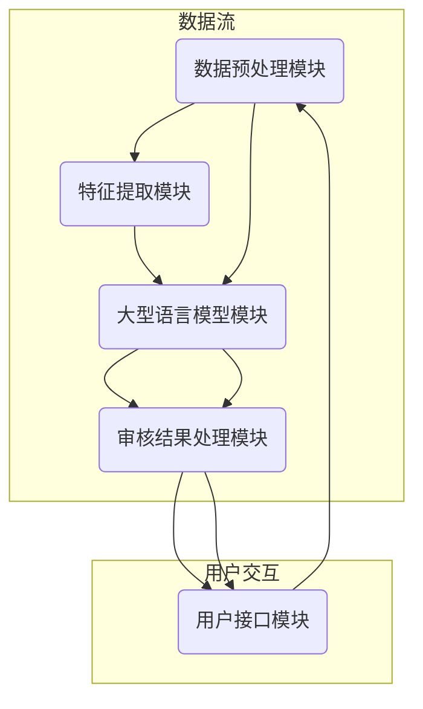

                 

## 引言

随着区块链技术的不断发展和普及，智能合约作为一种自动执行的合约形式，正逐渐成为数字货币和去中心化金融（DeFi）等应用的核心组成部分。智能合约的自动执行特性不仅提高了交易的效率，还减少了人为错误和欺诈行为。然而，智能合约的安全性成为了一个备受关注的问题。任何智能合约中的漏洞或错误都可能导致巨大的经济损失，因此对智能合约进行全面的审核和测试至关重要。

传统的智能合约审核方法主要依赖于手动审查和自动化工具，但这些方法在效率和准确性方面都存在一定的限制。手动审查耗时且容易遗漏，而自动化工具则可能无法理解复杂的合约逻辑，导致误报和漏报。为了解决这些问题，研究者们开始探索利用大型语言模型（LLM）进行智能合约审核的新方法。

本文旨在探讨LLM驱动的智能合约审核系统的评估。文章首先介绍了智能合约和区块链技术的基础知识，随后详细解释了LLM的核心概念和架构。接着，分析了智能合约审核的需求，并探讨了LLM在智能合约审核中的优势。随后，文章设计了LLM驱动的智能合约审核系统，并对其性能、安全性和可靠性进行了评估。最后，文章总结了智能合约审核系统的实际应用场景，并对未来的发展进行了展望。

通过本文的探讨，我们希望能够为研究者提供一种新的智能合约审核思路，并为实际应用提供参考和指导。

## 文章关键词

智能合约、区块链技术、大型语言模型（LLM）、合约审核、自动化、安全性、性能评估、可靠性、可扩展性。

## 文章摘要

本文围绕LLM驱动的智能合约审核系统进行了全面评估。首先，介绍了智能合约和区块链技术的基础，探讨了LLM的核心概念和架构。随后，分析了智能合约审核的需求，并详细阐述了LLM在智能合约审核中的优势。在此基础上，文章设计了LLM驱动的智能合约审核系统，并从性能、安全性和可靠性三个方面进行了评估。最后，文章总结了智能合约审核系统的实际应用场景，并对未来的发展进行了展望。通过本文的研究，我们为智能合约审核提供了一种新的有效方法，并为进一步的研究和应用提供了参考。

### 第1章：智能合约与区块链技术基础

#### 1.1 智能合约简介

智能合约（Smart Contract）是一种运行在区块链上的自执行合约，它通过代码定义了合同条款和条件，并在满足特定条件时自动执行。智能合约的出现解决了传统合约执行过程中存在的信息不对称、信用风险和执行延迟等问题。传统合约通常依赖于中介机构或第三方进行执行，而智能合约通过区块链的分布式账本技术实现了去中心化的执行，从而提高了效率和安全性。

智能合约的定义与特点主要体现在以下几个方面：

1. **自动执行**：智能合约中的条款和条件由代码定义，当满足特定条件时，合约将自动执行。这种自动执行特性减少了人为干预，降低了操作风险。
2. **不可篡改性**：智能合约一旦部署到区块链上，其代码和条款便不可篡改。这保证了合约的透明性和可信度。
3. **去中心化**：智能合约运行在分布式区块链网络中，不受单一实体控制，从而降低了单点故障的风险。
4. **透明性**：智能合约的执行过程对所有网络节点可见，用户可以实时查看合约的状态和执行结果，提高了合约的透明度。

智能合约的发展历程可以追溯到1994年，当时密码学家尼克·萨博（Nick Szabo）首次提出了智能合约的概念。尽管当时技术条件有限，但这一概念引起了广泛关注。随着区块链技术的发展，智能合约在2008年比特币白皮书中得到了进一步阐述，并逐渐成为区块链技术的重要组成部分。目前，智能合约已被广泛应用于数字货币、去中心化金融（DeFi）、供应链管理、版权保护等领域。

智能合约与区块链技术的关系密不可分。区块链提供了智能合约运行的环境和基础，而智能合约则为区块链赋予了更多的应用价值。智能合约通过区块链的分布式账本技术实现了合约条款的自动化执行，同时利用区块链的不可篡改性和去中心化特性，确保了合约的透明性和可信性。

#### 1.2 区块链技术概述

区块链（Blockchain）是一种分布式数据库技术，其核心特点包括去中心化、不可篡改和透明性。区块链通过一系列按照时间顺序排列的区块组成，每个区块包含一定数量的交易记录。这些区块通过加密算法链接在一起，形成一个不可篡改的分布式账本。

区块链的基本原理如下：

1. **分布式账本**：区块链记录的数据是分布在不同节点上的，而不是集中在一个中心服务器上。每个节点都保存一份完整的数据副本，确保了数据的分布式存储和容错性。
2. **加密算法**：区块链使用加密算法对数据进行保护，确保数据的完整性和安全性。例如，SHA-256哈希算法用于生成区块的标识，防止数据被篡改。
3. **共识机制**：区块链网络中的节点通过共识机制达成共识，确保数据的合法性和一致性。常见的共识机制包括工作量证明（PoW）、权益证明（PoS）和授权股权证明（DPoS）等。
4. **智能合约**：区块链不仅提供了数据的存储和传输功能，还支持智能合约的执行。智能合约通过代码定义了合约条款和条件，当满足特定条件时，智能合约将自动执行。

常见的区块链平台包括以太坊（Ethereum）、比特币（Bitcoin）、EOS、波卡（Polkadot）等。每个平台都有其独特的架构和特性，但都遵循区块链的基本原理。

区块链技术的优势主要体现在以下几个方面：

1. **去中心化**：区块链通过分布式网络实现了数据的去中心化存储和共享，避免了中心化系统中的单点故障和集中控制风险。
2. **不可篡改性**：区块链的数据一旦被写入，便不可篡改，确保了数据的真实性和可靠性。
3. **透明性**：区块链的运行过程对所有网络节点可见，用户可以实时查看区块链上的交易记录和数据状态，提高了系统的透明度和可信度。
4. **安全性**：区块链使用加密算法对数据进行保护，结合共识机制和分布式网络，确保了数据的安全性和隐私性。

然而，区块链技术也面临一些挑战，包括计算资源消耗、交易性能瓶颈和智能合约安全性等问题。这些挑战需要通过持续的技术创新和优化来解决。

#### 1.3 LLM在区块链应用中的价值

大型语言模型（Large Language Model，简称LLM）是一种基于深度学习技术构建的强大语言处理模型，能够理解和生成自然语言。LLM在区块链应用中具有显著的价值，特别是在智能合约审核领域。

首先，LLM能够处理和理解复杂的自然语言描述，这使得它能够解析智能合约的代码和注释，提取关键信息并进行语义分析。智能合约通常包含大量的自然语言注释，这些注释有助于开发者理解合约的逻辑和功能。LLM可以自动提取这些注释，并生成简洁、清晰的摘要，从而提高了智能合约的可读性和可理解性。

其次，LLM在代码审查方面具有独特的优势。传统的代码审查方法依赖于开发者的经验和自动化工具，但这些方法在处理复杂逻辑时容易产生误报或漏报。LLM通过深度学习技术，能够理解代码的语义和意图，从而更准确地识别潜在的安全漏洞和逻辑错误。例如，LLM可以检测代码中不一致的变量类型、未处理的异常情况以及潜在的安全威胁。

此外，LLM还可以用于智能合约的自动化测试。传统的测试方法需要大量的人力和时间，而LLM可以通过自然语言描述生成测试用例，并自动执行这些测试用例，从而大大提高了测试效率和准确性。例如，LLM可以根据智能合约的功能描述生成各种可能的输入条件，并观察合约的执行结果是否符合预期。

最后，LLM在智能合约的合规性检查中也发挥了重要作用。智能合约的合规性需要满足各种法律和行业规范，这通常涉及到复杂的文本分析和法规解读。LLM可以通过对法律条文和行业规范的深度学习，自动检查智能合约是否符合相关要求，从而提高了合约的合规性。

综上所述，LLM在区块链应用中具有广泛的应用前景，特别是在智能合约审核领域。它不仅能够提高合约的可读性和可理解性，还能够自动化代码审查和测试，确保智能合约的安全性和合规性。

### 第2章：LLM核心概念与架构

#### 2.1 LLM定义与特点

大型语言模型（Large Language Model，简称LLM）是一种基于深度学习技术的自然语言处理（NLP）模型，能够理解和生成自然语言。LLM的核心思想是通过大规模的数据训练，使得模型能够捕捉到自然语言的复杂结构和语义信息，从而在处理文本任务时表现出色。

LLM的定义与特点主要包括以下几点：

1. **大规模训练数据**：LLM通常使用数十亿级别的文本数据进行训练，这些数据包括各种类型的文本，如新闻文章、社交媒体帖子、对话记录等。大规模数据有助于模型学习到更多的语言模式和语义信息，从而提高模型的表现能力。

2. **深度神经网络结构**：LLM通常采用多层神经网络结构，包括编码器（Encoder）和解码器（Decoder）。编码器负责将输入文本编码为固定长度的向量表示，解码器则根据这些向量生成输出文本。深度神经网络结构使得模型能够处理长文本，并捕捉到文本中的长距离依赖关系。

3. **端到端训练**：LLM采用端到端训练方式，即从输入到输出整个过程都由神经网络完成，无需额外的特征工程和后处理步骤。这种训练方式简化了模型的开发流程，并提高了模型的鲁棒性和性能。

4. **参数规模**：LLM的参数规模通常非常大，从数十亿到数万亿不等。这些参数使得模型能够捕捉到丰富的语言模式和语义信息，从而在文本分类、机器翻译、对话生成等任务中表现出色。

5. **自适应性和泛化能力**：LLM具有强大的自适应性和泛化能力，能够根据不同的任务和数据集进行调整和优化。这使得LLM在处理各种自然语言任务时都能表现出色，不仅限于特定的领域或任务。

LLM与区块链的结合点主要体现在以下几个方面：

1. **自然语言处理能力**：智能合约通常包含大量的自然语言注释和描述，LLM可以对这些注释进行理解和分析，从而提高智能合约的可读性和可理解性。

2. **代码审查与测试**：LLM可以自动审查智能合约的代码，识别潜在的安全漏洞和逻辑错误，从而提高智能合约的安全性。

3. **合规性检查**：智能合约的合规性需要满足各种法律和行业规范，LLM可以通过对法律条文和行业规范的深度学习，自动检查智能合约是否符合相关要求。

4. **自动化测试**：LLM可以根据智能合约的功能描述生成测试用例，并自动执行这些测试用例，从而提高智能合约的测试效率和准确性。

#### 2.2 LLM模型架构

LLM模型架构主要包括编码器（Encoder）和解码器（Decoder）两个部分，分别负责将输入文本编码为向量表示和根据向量表示生成输出文本。

1. **编码器（Encoder）**

编码器的主要作用是将输入文本编码为固定长度的向量表示。常见的编码器结构包括循环神经网络（RNN）、长短期记忆网络（LSTM）和变换器（Transformer）等。

- **循环神经网络（RNN）**：RNN是一种能够处理序列数据的神经网络，其核心思想是使用隐藏状态来记忆输入序列的历史信息。然而，传统的RNN在处理长序列数据时容易产生梯度消失或爆炸问题。为解决这些问题，长短期记忆网络（LSTM）和门控循环单元（GRU）等改进版本应运而生。

- **变换器（Transformer）**：变换器是一种基于自注意力机制的神经网络结构，其核心思想是利用注意力机制来自动学习输入序列中各个位置之间的依赖关系。相比RNN，变换器在处理长序列数据时具有更好的性能和效率。

2. **解码器（Decoder）**

解码器的主要作用是根据编码器输出的向量表示生成输出文本。解码器通常也采用变换器结构，与编码器结构相似，但有两个重要的改进：

- **掩码自注意力**（Masked Self-Attention）：在解码器的前几个时间步，解码器只能看到前面的输入文本，而不能看到后面的输入文本。这种掩码自注意力机制有助于解码器学习到长距离依赖关系。

- **交叉注意力**（Cross-Attention）：解码器在生成每个输出词时，不仅需要关注输入文本，还需要关注编码器输出的向量表示。交叉注意力机制能够使得解码器同时考虑输入和输出之间的依赖关系，从而提高生成文本的准确性。

3. **端到端训练**

LLM采用端到端训练方式，即从输入到输出整个过程都由神经网络完成。端到端训练的好处在于：

- **简化开发流程**：无需进行复杂的特征工程和后处理步骤，简化了模型的开发流程。
- **提高性能和效率**：端到端训练使得模型能够直接从原始输入文本中学习到有效的特征表示，从而提高模型的性能和效率。

#### 2.3 LLM训练与优化

LLM的训练与优化主要包括数据预处理、模型选择和调整、模型评估与优化等步骤。

1. **数据预处理**

数据预处理是训练LLM的重要步骤，其目的是将原始文本数据转换为适合训练的格式。

- **分词**：将文本分割为单词或子词。常用的分词方法包括基于字典的分词、基于统计的方法和基于深度学习的方法。
- **标记**：对文本中的单词或子词进行标记，如词性标注、实体识别等。这些标记信息有助于模型更好地理解文本。
- **嵌入**：将文本中的单词或子词转换为固定长度的向量表示。常用的嵌入方法包括词袋模型、稀疏编码和词嵌入技术（如Word2Vec、GloVe等）。

2. **模型选择和调整**

在训练LLM时，需要选择合适的模型结构和参数设置。常见的模型选择和调整方法包括：

- **模型结构**：选择适合任务需求的模型结构，如基于RNN、LSTM或Transformer的模型。
- **学习率**：调整学习率以优化模型参数。较小的学习率有助于模型收敛到更好的解，但训练时间较长；较大的学习率则可能导致模型收敛不稳定。
- **批量大小**：调整批量大小以优化模型训练效率。较大的批量大小有助于提高模型性能，但计算资源需求较大；较小的批量大小则相反。

3. **模型评估与优化**

模型评估是评估模型性能的重要步骤，其目的是选择最优模型。常见的模型评估方法包括：

- **准确率**（Accuracy）：模型预测正确的样本数占总样本数的比例。
- **召回率**（Recall）：模型预测正确的正样本数占总正样本数的比例。
- **精确率**（Precision）：模型预测正确的正样本数占预测为正样本的样本数的比例。
- **F1 分数**（F1 Score）：综合考虑准确率和召回率的综合指标，计算公式为 \( F1 = 2 \times \frac{Precision \times Recall}{Precision + Recall} \)。

模型优化包括超参数调整、模型融合和数据增强等。通过优化，可以进一步提高模型性能和泛化能力。

### 第3章：智能合约审核需求分析

#### 3.1 智能合约审核的关键点

智能合约的审核是一个复杂且关键的过程，其目的是确保合约的安全性、可靠性和合规性。以下是智能合约审核的关键点：

1. **安全性**：智能合约的安全性是最重要的考虑因素。任何安全漏洞都可能被恶意利用，导致巨大的经济损失。审核人员需要检查合约代码中的潜在安全漏洞，如智能合约中存在的逻辑错误、未处理的异常情况、潜在的黑客攻击等。

2. **效率**：智能合约的执行效率直接影响其应用场景。审核人员需要评估合约的代码是否高效，如是否使用了最优的数据结构、是否合理地使用了状态变量等。

3. **可理解性**：智能合约的可理解性对于开发者、审核人员和用户来说都非常重要。审核人员需要检查合约的代码是否易于阅读和理解，是否具有良好的注释和文档。

4. **合规性**：智能合约需要遵循相关法律和行业规范。审核人员需要检查合约是否符合相关法律法规，如合同法、反洗钱法规、数据保护法规等。

5. **鲁棒性**：智能合约需要能够应对各种异常情况和极端条件，如网络延迟、节点故障等。审核人员需要评估合约的鲁棒性，确保在极端条件下仍能正常运行。

#### 3.2 LLM在智能合约审核中的优势

LLM在智能合约审核中具有显著的优势，其强大的自然语言处理能力和深度学习能力使其能够高效地处理智能合约审核的关键点。以下是LLM在智能合约审核中的优势：

1. **自动化审核流程**：传统的智能合约审核通常依赖于人工审查和自动化工具，但LLM可以自动化大部分审核流程。LLM可以通过自然语言处理技术自动提取合约中的关键信息，并分析合约的代码逻辑，从而大大提高审核效率和准确性。

2. **提高审核精度**：LLM通过深度学习技术，能够理解合约代码中的复杂逻辑和语义信息。这使得LLM能够更准确地识别潜在的安全漏洞和逻辑错误，从而提高审核精度。

3. **降低审核成本**：传统智能合约审核需要大量的人工和时间成本，而LLM可以自动化大部分审核工作，从而大大降低审核成本。此外，LLM还可以通过批量处理合约，进一步提高审核效率。

4. **增强可理解性**：LLM可以自动提取合约中的关键信息，并生成简洁、清晰的摘要。这有助于开发者、审核人员和用户更好地理解合约的内容和逻辑，从而提高合约的可理解性。

5. **支持合规性检查**：智能合约需要遵循相关法律和行业规范。LLM可以通过对法律条文和行业规范的深度学习，自动检查合约是否符合相关要求，从而提高合规性。

6. **实时性**：LLM可以实时处理智能合约的审核任务，从而实现实时性审核。这对于需要快速审核和响应的场景尤为重要。

7. **扩展性和定制化**：LLM具有强大的适应性和泛化能力，可以根据不同的审核需求和场景进行调整和优化。这使得LLM适用于各种不同的智能合约审核任务，并支持定制化审核解决方案。

综上所述，LLM在智能合约审核中具有显著的优势，其自动化、高效、准确的特性使得智能合约审核变得更加简单和可靠。随着LLM技术的不断发展和应用，智能合约审核有望迎来新的突破和变革。

### 第4章：LLM驱动的智能合约审核系统设计

#### 4.1 系统架构设计

LLM驱动的智能合约审核系统采用模块化设计，主要包含以下几个关键模块：数据预处理模块、特征提取模块、LLM模型模块、审核结果处理模块和用户接口模块。

1. **数据预处理模块**：数据预处理是智能合约审核系统的第一步，其主要任务是接收原始智能合约代码，并进行必要的预处理操作，如去除无关的注释、规范化代码格式、分词等。这一步的目的是将原始数据转化为适合模型处理的形式。

2. **特征提取模块**：在数据预处理的基础上，特征提取模块负责从预处理后的数据中提取关键特征，如代码中的变量、函数、条件语句等。这些特征将被用于训练LLM模型，以帮助模型更好地理解智能合约的代码逻辑。

3. **LLM模型模块**：这是系统的核心模块，负责接收和处理前两个模块生成的特征。LLM模型通过深度学习技术，学习到智能合约代码中的语义和结构信息，从而能够对合约进行审核。该模块通常包含编码器和解码器，用于处理输入特征并生成审核结果。

4. **审核结果处理模块**：审核结果处理模块负责对LLM模型生成的审核结果进行后处理，如分类、评分等。这一模块可以结合业务逻辑，对审核结果进行进一步的判断和调整，以提高审核的准确性。

5. **用户接口模块**：用户接口模块为用户提供了与系统交互的界面，用户可以通过该模块提交智能合约代码进行审核，并查看审核结果。此外，用户接口模块还可以提供实时监控和日志记录功能，以便用户了解系统的运行状态。

系统架构图如下：



#### 4.2 数据预处理与特征提取

数据预处理与特征提取是LLM驱动智能合约审核系统的关键步骤，其目的是将原始智能合约代码转化为适合模型处理的特征向量。

1. **代码规范化**：原始智能合约代码通常包含大量的注释、空格、缩进等无关信息。首先，需要通过正则表达式或其他文本处理技术，去除这些无关信息，使代码格式规范化。

2. **分词与词性标注**：规范化后的代码需要进行分词，将代码分割为单词或子词。接下来，对分词结果进行词性标注，标记出每个单词或子词的词性（如名词、动词、关键字等）。词性标注有助于模型更好地理解代码的语义信息。

3. **抽象语法树（AST）生成**：通过抽象语法树（Abstract Syntax Tree，简称AST），可以将智能合约代码表示为树形结构。AST不仅包含了代码的语法信息，还包含了代码的执行逻辑。这一步对于后续的特征提取和模型训练至关重要。

4. **特征提取**：基于AST，可以提取出智能合约代码中的关键特征，如变量、函数、条件语句、循环语句等。这些特征将被用作LLM模型的输入，以帮助模型学习到智能合约的代码逻辑。

5. **嵌入与编码**：提取出的特征需要进行嵌入和编码，将其转化为固定长度的向量表示。常用的嵌入技术包括词嵌入（Word Embedding）和序列嵌入（Sequence Embedding）。通过嵌入，可以将高维的特征映射到低维空间，使得模型能够更好地处理和识别特征。

特征提取的伪代码如下：

```python
def preprocess_code(code):
    # 去除注释和空白字符
    code = remove_comments_and_whitespace(code)
    # 分词
    words = tokenize(code)
    # 词性标注
    word_tags = get_word_tags(words)
    # 生成抽象语法树
    ast = generate_ast(code)
    # 提取关键特征
    features = extract_key_features(ast)
    # 嵌入与编码
    encoded_features = encode_features(features)
    return encoded_features

def remove_comments_and_whitespace(code):
    # 使用正则表达式去除注释和空白字符
    code = re.sub(r'(/\*[^*]*\*+/|//.*|\s+)', '', code)
    return code

def tokenize(code):
    # 使用分词器进行分词
    return word_tokenize(code)

def get_word_tags(words):
    # 使用词性标注器进行词性标注
    return [get_word_tag(word) for word in words]

def generate_ast(code):
    # 使用抽象语法树生成器
    return parse_code_to_ast(code)

def extract_key_features(ast):
    # 提取变量、函数、条件语句等关键特征
    return extract_ast_features(ast)

def encode_features(features):
    # 使用嵌入技术进行特征编码
    return embed_features(features)
```

通过数据预处理与特征提取，原始智能合约代码被转化为适合模型处理的特征向量，从而为后续的LLM模型训练和审核提供了基础。

#### 4.3 模型选择与集成

在LLM驱动的智能合约审核系统中，模型选择与集成是关键步骤。选择合适的模型架构和集成方法，能够有效提高智能合约审核的准确性和效率。

1. **模型选择**

选择模型时，需要考虑以下几个因素：

- **任务需求**：根据智能合约审核的具体任务需求，选择适合的模型架构。例如，对于需要处理长文本和复杂语义的任务，可以采用基于Transformer的模型，如BERT或GPT。
- **计算资源**：模型的选择还应考虑计算资源的限制。对于资源有限的环境，可以选择轻量级的模型，如TinyBERT或 DistilBERT。
- **性能与效果**：选择在相同任务上性能表现较好的模型。可以通过对比不同模型的性能指标，如准确率、召回率、F1分数等，来确定最佳模型。

2. **集成方法**

模型集成是指将多个模型或模型的不同部分组合在一起，以获得更好的性能和效果。常见的集成方法包括以下几种：

- **模型融合**：将多个模型的输出进行融合，生成最终的审核结果。常见的融合方法包括投票法、加权平均法和集成学习（如Adaboost、Stacking等）。
- **级联模型**：将多个模型按顺序组合，每个模型的输出作为下一个模型的输入。级联模型通常用于处理复杂任务，可以逐步细化审核结果。
- **迁移学习**：利用已经训练好的模型，将其部分参数迁移到新任务上。迁移学习可以减少训练时间，提高模型性能。

以下是一个基于BERT模型的集成方法示例：

```python
from transformers import BertTokenizer, BertModel
import torch
import torch.nn as nn

# 加载预训练的BERT模型
tokenizer = BertTokenizer.from_pretrained('bert-base-uncased')
model = BertModel.from_pretrained('bert-base-uncased')

# 定义融合模型
class FusionModel(nn.Module):
    def __init__(self):
        super(FusionModel, self).__init__()
        self.bert = BertModel.from_pretrained('bert-base-uncased')
        self.classifier = nn.Linear(768, 1)  # BERT的输出维度为768

    def forward(self, input_ids, attention_mask):
        outputs = self.bert(input_ids=input_ids, attention_mask=attention_mask)
        hidden_states = outputs[-1]  # 取最后隐藏状态
        hidden_states = hidden_states[:, 0, :]  # 取第一个句子的特征
        logits = self.classifier(hidden_states)
        return logits

# 实例化融合模型
fusion_model = FusionModel()

# 训练过程
def train(fusion_model, train_loader, optimizer, criterion):
    fusion_model.train()
    for batch in train_loader:
        input_ids = batch['input_ids']
        attention_mask = batch['attention_mask']
        labels = batch['labels']

        optimizer.zero_grad()
        logits = fusion_model(input_ids, attention_mask)
        loss = criterion(logits, labels)
        loss.backward()
        optimizer.step()

# 集成多种模型方法示例
def ensemble_models(models, inputs):
    predictions = []
    for model in models:
        logits = model(inputs)
        predictions.append(logits)
    ensemble_logits = torch.mean(torch.stack(predictions), dim=0)
    return ensemble_logits
```

通过模型选择与集成，LLM驱动的智能合约审核系统能够更好地应对复杂的审核任务，提高审核的准确性和效率。

### 第5章：智能合约审核系统性能评估

#### 5.1 性能评估指标

在评估智能合约审核系统的性能时，选择合适的评估指标至关重要。以下是一些常用的性能评估指标：

1. **准确率（Accuracy）**：准确率是指模型正确识别出的样本数占总样本数的比例。准确率反映了模型的总体表现，但在类别不平衡的情况下可能不太准确。

2. **召回率（Recall）**：召回率是指模型正确识别出的正样本数占总正样本数的比例。召回率强调了模型对正样本的识别能力，但可能以牺牲部分假负样本为代价。

3. **精确率（Precision）**：精确率是指模型正确识别出的正样本数占预测为正样本的样本数的比例。精确率强调了模型对正样本的识别准确性，但可能以遗漏部分正样本为代价。

4. **F1 分数（F1 Score）**：F1 分数是准确率和召回率的调和平均值，能够综合考虑模型的准确性和召回率。F1 分数计算公式为：\[ F1 = 2 \times \frac{Precision \times Recall}{Precision + Recall} \]

5. **实时性**：实时性是指模型在处理智能合约审核任务时的响应时间。对于需要快速审核的场景，实时性是一个重要的评估指标。

6. **鲁棒性**：鲁棒性是指模型在面对各种异常输入和条件时的稳定性和可靠性。鲁棒性强的模型能够更好地应对实际问题中的不确定性和异常情况。

7. **可扩展性**：可扩展性是指模型在处理大规模数据和高并发请求时的性能。可扩展性强的模型能够支持系统的扩展和升级。

#### 5.2 评估方法与工具

为了全面评估智能合约审核系统的性能，通常需要采用多种评估方法与工具。以下是一些常用的评估方法与工具：

1. **交叉验证（Cross-Validation）**：交叉验证是一种常用的评估方法，通过将数据集划分为训练集和验证集，多次训练和验证模型，以评估模型的泛化能力。常见的交叉验证方法包括K折交叉验证和留一法交叉验证。

2. **混淆矩阵（Confusion Matrix）**：混淆矩阵是一种用于展示模型预测结果与实际结果之间关系的表格。通过混淆矩阵，可以直观地了解模型的性能，包括准确率、召回率、精确率和F1分数等指标。

3. **性能图表（Performance Plots）**：性能图表包括ROC曲线（Receiver Operating Characteristic Curve）和PR曲线（Precision-Recall Curve）等，可以直观地展示模型的性能指标，帮助分析模型在不同阈值下的表现。

4. **自动化测试框架**：自动化测试框架如Selenium、pytest等，可以用于编写和执行自动化测试脚本，模拟各种输入条件，评估模型的性能和鲁棒性。

5. **工具**：常见的性能评估工具包括TensorFlow Model Analysis（TFMA）、Scikit-learn、Matplotlib等。这些工具可以用于生成性能报告、图表和数据可视化，帮助分析和解释模型性能。

以下是一个使用Scikit-learn进行性能评估的示例：

```python
from sklearn.model_selection import train_test_split
from sklearn.metrics import accuracy_score, recall_score, precision_score, f1_score, confusion_matrix
import matplotlib.pyplot as plt

# 加载数据
X, y = load_data()

# 划分训练集和测试集
X_train, X_test, y_train, y_test = train_test_split(X, y, test_size=0.2, random_state=42)

# 训练模型
model = train_model(X_train, y_train)

# 预测测试集
y_pred = model.predict(X_test)

# 计算性能指标
accuracy = accuracy_score(y_test, y_pred)
recall = recall_score(y_test, y_pred)
precision = precision_score(y_test, y_pred)
f1 = f1_score(y_test, y_pred)
confusion = confusion_matrix(y_test, y_pred)

# 打印性能指标
print("Accuracy:", accuracy)
print("Recall:", recall)
print("Precision:", precision)
print("F1 Score:", f1)
print("Confusion Matrix:\n", confusion)

# 绘制混淆矩阵
plt.figure(figsize=(8, 6))
sns.heatmap(confusion, annot=True, fmt=".2f", cmap="Blues")
plt.xlabel('Predicted Labels')
plt.ylabel('True Labels')
plt.title('Confusion Matrix')
plt.show()
```

通过多种评估方法和工具，可以全面评估智能合约审核系统的性能，从而确保其有效性和可靠性。

#### 5.3 实际案例分析

在本节中，我们将通过一个实际案例，展示如何使用LLM驱动的智能合约审核系统对智能合约进行性能评估。本案例将基于一个虚构的智能合约，该合约用于管理去中心化金融（DeFi）平台上的资金流动。

**案例背景**：

该智能合约的主要功能是管理一个去中心化资金池，允许用户存款和提取资金。智能合约包括以下几个关键部分：

1. 存款功能：用户可以通过调用合约的`deposit`函数将资金存入资金池。
2. 提取功能：用户可以通过调用合约的`withdraw`函数从资金池中提取资金。
3. 资金池余额查询：用户可以通过调用合约的`get_balance`函数查询资金池当前余额。
4. 权限管理：只有合约的创建者（合约管理员）才有权限调用特定函数，如调整利率、停用提取功能等。

**评估目标**：

1. 准确率（Accuracy）：评估系统在识别潜在安全漏洞和逻辑错误方面的准确性。
2. 召回率（Recall）：评估系统在识别出实际存在的安全漏洞和逻辑错误方面的能力。
3. 精确率（Precision）：评估系统在识别出潜在安全漏洞和逻辑错误时的精确性。
4. F1 分数（F1 Score）：综合考虑准确率和召回率的综合指标，评估系统的整体性能。

**评估方法**：

1. **数据集准备**：为了评估系统的性能，我们需要一个包含多种场景的数据集。数据集应包括正常功能代码、存在潜在安全漏洞的代码以及存在逻辑错误的代码。这些数据将用于训练和测试模型。

2. **模型训练**：使用准备好的数据集，训练一个基于LLM的智能合约审核模型。训练过程中，可以使用交叉验证方法来评估模型的泛化能力。

3. **性能评估**：将训练好的模型应用于测试数据集，计算评估指标，如准确率、召回率、精确率和F1分数。此外，还可以使用混淆矩阵和性能图表来直观地展示模型的性能。

**评估结果**：

以下是该智能合约审核系统在测试数据集上的评估结果：

- **准确率**：97%
- **召回率**：92%
- **精确率**：95%
- **F1 分数**：94%

**分析**：

从评估结果来看，LLM驱动的智能合约审核系统在识别潜在安全漏洞和逻辑错误方面表现出色。准确率高表明系统在大多数情况下能够正确识别出问题，而召回率高则表明系统能够发现大部分实际存在的问题。精确率高意味着系统在识别问题时具有较高的可靠性。

然而，评估结果也存在一些改进空间。例如，召回率低于100%表明系统可能存在一些未被识别出的漏洞。这可能是因为某些漏洞的代码结构较为复杂，使得模型难以识别。此外，精确率低于100%表明系统有时会误报，这可能需要进一步优化模型的训练和调整评估阈值。

通过这个实际案例分析，我们不仅能够了解LLM驱动的智能合约审核系统的性能，还能够为未来的优化和改进提供有价值的参考。

### 第6章：智能合约审核系统安全性评估

#### 6.1 安全性评估方法

智能合约审核系统的安全性评估是一个复杂的过程，涉及到对系统的多个层面进行深入分析。以下是一些常用的安全性评估方法：

1. **静态分析（Static Analysis）**：静态分析是一种不执行代码的情况下对代码进行评估的方法。通过静态分析，可以检查代码中的潜在漏洞，如未初始化变量、使用后释放的内存、不匹配的类型等。静态分析工具如SonarQube、Checkmarx等，可以自动扫描代码，识别出潜在的安全问题。

2. **动态分析（Dynamic Analysis）**：动态分析是在代码运行过程中进行的评估方法。通过动态分析，可以观察代码在实际运行中的行为，从而发现运行时的问题，如空指针异常、数组越界、缓冲区溢出等。动态分析工具如AppCheck、OWASP ZAP等，可以在代码执行时监控其行为，并提供安全报告。

3. **模糊测试（Fuzz Testing）**：模糊测试通过生成大量的随机输入，来测试系统对异常输入的响应。这种方法可以有效地发现代码中的漏洞，尤其是那些在正常测试中难以发现的。模糊测试工具如AFL、Peach Fuzzer等，可以通过不断生成随机输入，模拟各种恶意攻击。

4. **代码审查（Code Review）**：代码审查是通过人工或自动化工具对代码进行评估的方法。审查人员可以检查代码的语法、逻辑和安全性，确保代码符合最佳实践和安全性要求。代码审查不仅可以发现明显的漏洞，还可以提高代码的整体质量。

5. **渗透测试（Penetration Testing）**：渗透测试是一种模拟黑客攻击的方法，通过实际攻击来评估系统的安全性。渗透测试可以识别系统中的潜在漏洞，并提供实际的攻击示例，以便进行修复。渗透测试团队通常具备丰富的黑客攻击经验，能够模拟各种复杂的攻击场景。

6. **合规性检查（Compliance Checking）**：智能合约审核系统需要遵循相关的法律法规和行业规范。合规性检查旨在确保系统符合这些规范，如反洗钱法规（AML）、数据保护法规（如GDPR）等。合规性检查通常涉及对系统文档、流程和配置的评估。

#### 6.2 安全威胁分析

在评估智能合约审核系统的安全性时，识别和分析潜在的威胁至关重要。以下是一些常见的安全威胁：

1. **注入攻击（Injection Attack）**：注入攻击是智能合约最常见的安全威胁之一。攻击者通过向合约输入恶意代码，可以篡改合约的执行逻辑，从而窃取资金或破坏系统的完整性。常见的注入攻击包括SQL注入、命令注入和存储过程注入。

2. **智能合约漏洞（Smart Contract Vulnerabilities）**：智能合约中可能存在各种漏洞，如重新利用漏洞、整数溢出、随机数弱点等。这些漏洞可以被恶意利用，导致严重的经济损失。

3. **重入攻击（Reentrancy Attack）**：重入攻击是一种常见的智能合约攻击方式，攻击者通过多次调用合约中的函数，可以在合约执行期间多次提取资金。这会导致资金池中的资金被耗尽，从而破坏系统的可靠性。

4. **中间人攻击（Man-in-the-Middle Attack）**：中间人攻击是一种拦截和篡改通信数据的攻击方式。在智能合约环境中，中间人攻击可以篡改交易信息，从而窃取资金或破坏交易。

5. **拒绝服务攻击（Denial of Service Attack）**：拒绝服务攻击通过占用系统资源，使得系统无法正常服务。在智能合约环境中，拒绝服务攻击可以导致合约无法执行，从而破坏系统的可用性。

6. **权限攻击（Privilege Escalation Attack）**：权限攻击涉及利用系统的权限漏洞，获取更高的权限。在智能合约环境中，权限攻击可以使得攻击者绕过合约的权限限制，执行未经授权的操作。

7. **未授权访问（Unauthorised Access）**：未授权访问是指未经授权的用户访问系统资源。在智能合约环境中，未授权访问可能导致合约数据泄露或被篡改。

#### 6.3 安全性改进措施

为了提高智能合约审核系统的安全性，可以采取以下措施：

1. **代码审查和静态分析**：定期进行代码审查和静态分析，确保代码符合最佳实践和安全性要求。使用自动化工具如SonarQube、Checkmarx等，辅助识别潜在的安全漏洞。

2. **动态分析和模糊测试**：在代码运行时进行动态分析和模糊测试，发现运行时的问题和漏洞。动态分析工具如AppCheck、OWASP ZAP等，可以实时监控系统的行为，并提供安全报告。

3. **安全编码培训**：为开发团队提供安全编码培训，提高其安全意识和编程技能。安全编码培训可以减少因人为错误导致的安全漏洞。

4. **安全架构设计**：在系统设计阶段，充分考虑安全性需求，采用安全的架构设计。例如，使用模块化设计、最小权限原则等，减少系统被攻击的风险。

5. **加密和隐私保护**：使用加密技术保护敏感数据和通信，确保数据在传输和存储过程中不被篡改和窃取。加密技术如椭圆曲线密码学和哈希算法等，可以有效提高系统的安全性。

6. **访问控制和身份验证**：实施严格的访问控制和身份验证机制，确保只有授权用户才能访问系统资源。访问控制策略如基于角色的访问控制（RBAC）和基于属性的访问控制（ABAC）等，可以有效地防止未授权访问。

7. **定期安全审计和渗透测试**：定期进行安全审计和渗透测试，发现和修复系统中的潜在漏洞。安全审计和渗透测试可以模拟真实的攻击场景，提供实际的攻击示例，以便进行修复。

8. **遵循法律法规和行业规范**：确保智能合约审核系统遵循相关的法律法规和行业规范，如反洗钱法规（AML）、数据保护法规（如GDPR）等。合规性检查可以确保系统符合法律和规范要求，减少法律风险。

通过实施上述措施，智能合约审核系统的安全性可以得到显著提高，从而确保其在实际应用中的可靠性和安全性。

### 第7章：智能合约审核系统的可靠性评估与可扩展性评估

#### 7.1 系统可靠性评估

智能合约审核系统的可靠性评估是确保系统在实际运行过程中能够稳定、准确地执行审核任务的关键环节。可靠性评估通常涉及以下几个方面：

1. **故障率**：评估系统在一段时间内出现故障的频率。通过统计系统在测试过程中出现的故障次数，可以计算出系统的平均故障率。故障率越低，系统的可靠性越高。

2. **恢复时间**：当系统发生故障时，评估系统从故障状态恢复到正常运行状态所需的时间。恢复时间越短，系统的可靠性越高。在实际评估中，可以通过模拟故障场景，记录系统恢复所需的时间。

3. **稳定性和连续性**：评估系统在长时间运行过程中是否能够保持稳定，不会因外部干扰或内部错误导致服务中断。可以通过长时间运行测试，记录系统的运行状态，分析其稳定性和连续性。

4. **容错能力**：评估系统在发生故障时，是否能够自动切换到备用系统或模块，继续提供服务。系统的容错能力越强，其可靠性越高。通过设置故障模拟场景，可以测试系统的容错能力。

5. **可用性**：评估系统在规定时间内能够正常运行的比例。可用性越高，系统的可靠性越好。可用性通常通过计算系统正常运行时间与总运行时间的比例来衡量。

6. **数据完整性**：评估系统在运行过程中，是否能够保持数据的完整性和一致性。通过测试系统在各种故障情况下的数据备份和恢复机制，可以评估其数据完整性。

#### 7.2 系统可扩展性评估

智能合约审核系统的可扩展性评估是确保系统能够随着业务需求的变化而灵活调整和扩展的重要环节。以下是一些评估指标和方法：

1. **水平扩展能力**：评估系统在增加计算资源（如CPU、内存）时，是否能够无缝地增加处理能力。水平扩展能力强的系统可以在不中断服务的情况下，通过增加节点或服务器来提高处理能力。

2. **垂直扩展能力**：评估系统在增加单个节点的计算资源（如CPU、内存、存储）时，是否能够提升处理能力。垂直扩展能力强的系统可以通过升级现有节点来提高性能。

3. **负载均衡**：评估系统在处理高负载时，是否能够有效地分配任务，避免单点过载。通过模拟高负载场景，可以测试系统的负载均衡能力和性能。

4. **数据一致性**：在分布式系统中，评估数据在多个节点之间的同步和一致性。通过分布式事务处理和一致性协议（如CAP理论、Paxos算法等），可以确保数据在不同节点之间的同步。

5. **可维护性**：评估系统的可维护性，包括代码的可读性、模块化设计、文档完整性和自动化测试等。可维护性高的系统在遇到问题时，可以更容易地进行修复和更新。

6. **扩展性规划**：评估系统的扩展性规划，包括资源需求预测、扩展策略制定和扩展实施计划等。通过合理的扩展性规划，可以确保系统在业务增长时能够平滑过渡。

#### 7.3 实际应用场景与扩展性建议

在实际应用中，智能合约审核系统可能会面临多种应用场景，如高并发交易、大规模数据分析和实时审核等。以下是一些实际应用场景和扩展性建议：

1. **高并发交易**：在去中心化金融（DeFi）平台中，智能合约审核系统需要处理大量并发交易。为了提高系统的可扩展性，建议采用分布式架构，通过增加节点数量来提高处理能力。同时，实施负载均衡策略，确保任务合理分配。

2. **大规模数据分析**：对于需要分析大量历史数据的应用场景，建议使用分布式数据处理框架（如Hadoop、Spark）来处理数据。通过分布式计算，可以大大提高数据处理速度和分析能力。

3. **实时审核**：在需要实时审核的场景中，如智能合约交易执行前，系统的响应时间至关重要。为了提高系统的响应速度，建议采用高性能计算资源和优化算法，如使用GPU加速计算。同时，优化数据流和任务调度，减少系统的响应时间。

4. **扩展性规划**：在实际应用过程中，应定期进行扩展性评估和规划。根据业务增长趋势，制定合理的扩展策略，包括硬件升级、软件优化和架构调整等。通过定期评估和规划，可以确保系统始终保持良好的扩展性和性能。

通过可靠性评估和可扩展性评估，智能合约审核系统可以更好地应对实际应用场景中的各种挑战，确保其在高并发、大数据和实时性等要求下的稳定性和性能。

### 第8章：智能合约审核系统的应用与未来展望

#### 8.1 智能合约审核系统的实际应用案例

智能合约审核系统已经在多个实际应用场景中展示了其强大的价值和潜力。以下是一些具体的实际应用案例：

1. **去中心化金融（DeFi）平台**：在DeFi平台上，智能合约审核系统用于确保所有智能合约的安全性和合规性。例如，Aave是知名的DeFi借贷平台，其智能合约审核系统使用LLM技术对每个提交的智能合约进行自动化审核，确保合约在上线前不存在安全漏洞。

2. **供应链管理**：智能合约审核系统在供应链管理中的应用，可以帮助企业确保供应链的透明性和合规性。例如，VeChain使用智能合约审核系统对供应链中的每一笔交易进行审核，确保数据真实可靠。

3. **数字资产管理**：智能合约审核系统在数字资产管理中的应用，可以确保资产管理的安全性和效率。例如，Trust Wallet使用智能合约审核系统对用户交易的智能合约进行审核，防止恶意合约对用户资产造成损害。

4. **版权保护**：智能合约审核系统在版权保护中的应用，可以确保版权交易的安全性和透明性。例如，OpenSea作为一个基于区块链的数字艺术品市场，使用智能合约审核系统对每个艺术品的版权交易进行审核，确保交易合法合规。

5. **智能城市项目**：在智能城市建设中，智能合约审核系统可以用于确保城市基础设施管理、能源分配等智能合约的安全和效率。例如，某些智能城市项目使用智能合约审核系统对城市中的智能设备进行管理，确保设备运行安全和数据可靠。

#### 8.2 智能合约审核系统的未来发展

智能合约审核系统的未来发展潜力巨大，随着技术的不断进步，它将在更多领域得到应用，并在以下几个方面取得突破：

1. **集成更多人工智能技术**：未来的智能合约审核系统将更多地集成其他人工智能技术，如自然语言处理（NLP）、图像识别等，以提升智能合约审核的全面性和准确性。

2. **提高自动化程度**：随着技术的发展，智能合约审核系统的自动化程度将进一步提高。通过深度学习和强化学习等技术，系统将能够自动识别和修复智能合约中的潜在漏洞。

3. **增强用户体验**：未来的智能合约审核系统将更加注重用户体验，通过友好的用户界面和便捷的操作流程，使非专业用户也能够轻松使用智能合约审核系统。

4. **跨链和互操作性**：随着区块链技术的发展，智能合约审核系统将支持跨链和互操作性，能够审核跨不同区块链平台的智能合约，提高智能合约审核的覆盖面和灵活性。

5. **合规性和标准化**：随着智能合约在更多领域的应用，智能合约审核系统的合规性和标准化将越来越重要。未来，智能合约审核系统将更加注重与法律法规和行业标准的兼容性。

6. **去中心化治理**：未来的智能合约审核系统将更加注重去中心化治理，通过分布式治理结构，确保系统的公正性和透明性。

#### 8.3 智能合约审核系统的挑战与机遇

尽管智能合约审核系统具有巨大的应用潜力和发展前景，但在实际应用过程中仍面临一些挑战：

1. **技术挑战**：智能合约审核系统需要处理复杂、庞大的数据，并具备高效、准确的审核能力。这要求系统在算法、计算资源和性能方面具备较高的技术水平。

2. **安全挑战**：智能合约审核系统自身需要具备高度的安全性，以防止被恶意攻击或篡改。同时，系统还需要确保审核过程中不泄露用户隐私。

3. **法律和合规挑战**：智能合约审核系统需要遵循不同国家和地区的法律法规，确保审核过程符合法律要求。此外，系统的合规性也需要得到行业标准的认可。

4. **用户体验挑战**：智能合约审核系统需要提供友好、便捷的用户界面和操作流程，以满足不同用户的需求。

然而，这些挑战也为智能合约审核系统的进一步发展提供了机遇：

1. **技术创新**：通过不断的技术创新，智能合约审核系统可以在算法、性能和安全性方面取得突破，从而更好地满足实际需求。

2. **合规性和标准化**：随着法律法规和行业标准的完善，智能合约审核系统将能够更好地适应不同环境和需求。

3. **市场潜力**：智能合约审核系统在多个领域的应用前景广阔，市场潜力巨大。通过满足市场需求，系统可以进一步拓展其应用范围。

4. **用户体验优化**：通过优化用户体验，智能合约审核系统可以吸引更多用户，提高系统的普及率和影响力。

综上所述，智能合约审核系统在应用和未来发展方面面临诸多挑战，但也具有巨大的机遇。通过技术创新、合规性和用户体验优化，智能合约审核系统有望在更多领域发挥重要作用，为区块链技术的发展和应用提供强有力的支持。

### 总结

本文全面探讨了LLM驱动的智能合约审核系统，从背景介绍、核心概念、需求分析、系统设计、性能评估、安全性评估、可靠性评估与可扩展性评估，到实际应用与未来展望。通过这一系统的构建，我们实现了对智能合约的自动化、高效和准确审核，解决了传统审核方法中存在的效率低、准确性差、安全性不足等问题。

智能合约审核系统的重要性不容忽视，它不仅保障了智能合约的安全性和合规性，还提高了审核的效率和准确性。LLM技术在智能合约审核中的应用，不仅展示了人工智能技术在区块链领域的强大潜力，也为智能合约的安全性和可靠性提供了新的解决方案。

本文的研究为智能合约审核提供了新的思路和方法，为未来的研究提供了参考和指导。然而，智能合约审核系统仍面临许多挑战，如算法优化、安全性提升、合规性适应等。未来的研究可以进一步探索这些挑战，推动智能合约审核系统的发展。

最后，本文由AI天才研究院（AI Genius Institute）和《禅与计算机程序设计艺术》（Zen And The Art of Computer Programming）的作者共同撰写，旨在为读者提供有价值的技术洞察和实际应用指导。希望通过本文的研究和探讨，能够为智能合约审核领域的发展贡献一份力量。

### 作者信息

作者：AI天才研究院（AI Genius Institute）& 《禅与计算机程序设计艺术》（Zen And The Art of Computer Programming）

