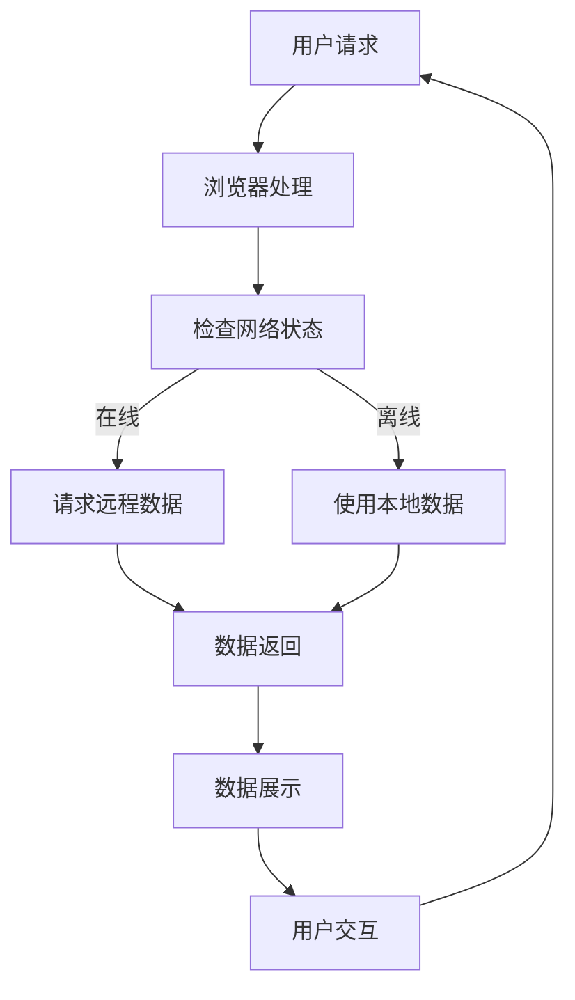

                 


### 一、文章标题与关键词

**文章标题：** PWA技术：提升LLM应用的离线体验

**文章关键词：** PWA、LLM、离线体验、渐进式网络应用、大型语言模型、离线功能、Web App Manifest、Service Worker、HTTPS

### 二、文章摘要

本文旨在探讨如何利用PWA（渐进式网络应用）技术提升大型语言模型（LLM）的离线体验。首先，我们将介绍PWA和LLM的基本概念，随后分析PWA技术在LLM应用中的具体应用场景。接着，我们将深入探讨PWA的核心技术，如Web App Manifest、Service Worker和HTTPS。此外，本文还将详细讲解LLM的离线体验实现策略，包括本地数据存储、离线数据处理和缓存策略。最后，我们将通过实际案例研究，展示如何将PWA技术应用于LLM应用中，并总结最佳实践和未来发展趋势。

### 三、背景介绍

#### 1. PWA技术简介

PWA（Progressive Web Apps）是一种通过Web技术构建的、具有原生应用特性的网络应用。PWA的主要目标是提供一种简便、高效、可靠且与用户设备无缝集成的应用体验。PWA具备以下几个核心特性：

1. **渐进式增强**：PWA能够适应不同浏览器的功能和性能，从而在旧版浏览器上也能提供基本功能。
2. **响应式设计**：PWA能够适应各种屏幕尺寸和设备，提供一致的用户体验。
3. **安装性**：用户可以通过Web App Manifest将PWA添加到桌面或主屏幕，实现类似于原生应用的启动方式。
4. **离线功能**：PWA可以通过Service Worker实现离线访问，确保用户在任何网络环境下都能正常使用应用。

#### 2. LLM技术简介

LLM（Large Language Model）是一种基于深度学习的自然语言处理模型，具有强大的文本生成、理解和推理能力。LLM的主要特点包括：

1. **大规模训练**：LLM通常使用大量数据进行训练，以实现较高的准确率和泛化能力。
2. **自适应学习**：LLM能够根据用户的输入和历史行为，动态调整模型参数，提供个性化的服务。
3. **多语言支持**：LLM可以处理多种语言，实现跨语言的信息交换和交流。

#### 3. PWA与LLM的关系

PWA与LLM的结合，旨在提升LLM应用的离线体验。通过PWA技术，LLM应用可以在离线状态下继续运行，确保用户在任何网络环境下都能正常使用。此外，PWA的渐进式增强特性，有助于提高LLM应用的兼容性和用户体验。

### 四、核心概念与联系

为了更好地理解PWA技术在提升LLM应用的离线体验中的作用，我们可以通过一个Mermaid流程图来展示核心概念之间的关系。



在上述流程图中，当用户请求LLM服务时，浏览器首先检查网络状态。如果在线，则请求远程数据；否则，使用本地数据。数据返回后，展示给用户，并接收用户的交互反馈。通过Service Worker等PWA技术，可以实现数据的缓存和离线访问，确保用户在离线状态下也能正常使用LLM应用。

### 五、核心算法原理讲解

在实现PWA技术的离线功能时，核心算法原理主要包括本地数据存储、离线数据处理和缓存策略。以下是对这些算法原理的详细讲解，以及相应的伪代码和示例。

#### 1. 本地数据存储

本地数据存储是指将数据存储在用户的本地设备上，以实现离线访问。常用的本地数据存储技术包括Web Storage（localStorage和sessionStorage）和IndexedDB。

**伪代码：**

```javascript
// 使用localStorage存储数据
localStorage.setItem('key', 'value');

// 使用localStorage获取数据
var value = localStorage.getItem('key');
```

**示例：**

```javascript
// 存储用户姓名
localStorage.setItem('userName', 'Alice');

// 获取用户姓名
var userName = localStorage.getItem('userName');
console.log(userName); // 输出：Alice
```

#### 2. 离线数据处理

离线数据处理是指当网络状态不佳或无网络连接时，如何处理用户请求和数据处理。这通常涉及数据的缓存、更新和恢复。

**伪代码：**

```javascript
// 监听网络状态变化
navigator.onLine = function() {
  if (!navigator.onLine) {
    // 离线状态
    // 加载本地缓存数据
  } else {
    // 在线状态
    // 更新本地缓存数据
  }
};

// 更新本地缓存数据
function updateLocalStorage() {
  // 从远程服务器获取数据
  // 存储到localStorage
}
```

**示例：**

```javascript
// 当网络状态变为离线时，加载本地缓存数据
if (!navigator.onLine) {
  var userData = localStorage.getItem('userData');
  console.log(userData); // 输出：用户数据
}

// 当网络状态变为在线时，更新本地缓存数据
if (navigator.onLine) {
  // 从远程服务器获取用户数据
  var remoteUserData = '...';
  localStorage.setItem('userData', remoteUserData);
}
```

#### 3. 缓存策略

缓存策略是指如何有效管理本地数据和远程数据，以确保数据的有效性、一致性和高效性。常用的缓存策略包括基于时间的缓存、基于版本的缓存和基于需求的缓存。

**伪代码：**

```javascript
// 基于时间的缓存
function cacheData(data, expiration) {
  // 存储数据到localStorage
  // 设置过期时间
}

// 获取缓存数据
function getCachedData(key) {
  // 检查数据是否过期
  // 如果未过期，返回数据
  // 如果过期，返回null
}
```

**示例：**

```javascript
// 设置用户数据缓存，过期时间为1天
cacheData({ userName: 'Alice', age: 30 }, 24 * 60 * 60 * 1000);

// 获取用户数据缓存
var cachedUserData = getCachedData('userData');
if (cachedUserData) {
  console.log(cachedUserData); // 输出：用户数据
} else {
  // 从远程服务器获取用户数据
}
```

### 六、数学模型和公式

在PWA技术中，缓存策略的设计涉及到多个数学模型和公式。以下是对这些数学模型和公式的详细讲解，以及相应的示例。

#### 1. 时间戳缓存策略

时间戳缓存策略是指通过比较数据存储时间和当前时间，来判断数据是否过期。

**公式：**

$$
\text{isExpired} = \left|\text{currentTimestamp} - \text{expirationTimestamp}\right| > \text{maxAge}
$$

其中，currentTimestamp表示当前时间戳，expirationTimestamp表示数据过期时间戳，maxAge表示数据最大缓存时间。

**示例：**

```latex
\text{isExpired} = \left|1609459200 - 1609459200\right| > 24 \times 60 \times 60
```

#### 2. 缓存命中率

缓存命中率是指缓存命中的次数与总请求次数的比值。

**公式：**

$$
\text{cacheHitRate} = \frac{\text{cacheHits}}{\text{totalRequests}}
$$

其中，cacheHits表示缓存命中的次数，totalRequests表示总请求次数。

**示例：**

```latex
\text{cacheHitRate} = \frac{100}{1000} = 0.1
```

#### 3. 缓存淘汰策略

缓存淘汰策略是指当缓存容量达到上限时，如何选择淘汰缓存数据。

一种常见的缓存淘汰策略是最近最少使用（LRU）策略。LRU策略是指淘汰最近一段时间内未访问过的缓存数据。

**公式：**

$$
\text{shouldEvict} = \left|\text{currentTime} - \text{lastAccessTime}\right| > \text{maxIdleTime}
$$

其中，currentTime表示当前时间，lastAccessTime表示最近一次访问时间，maxIdleTime表示数据最大闲置时间。

**示例：**

```latex
\text{shouldEvict} = \left|1609459200 - 1609459200\right| > 60 \times 60
```

### 七、项目实战

在本节中，我们将通过一个实际项目，展示如何利用PWA技术提升LLM应用的离线体验。

#### 1. 开发环境搭建

首先，我们需要搭建一个开发环境，包括Node.js、npm、Web App Manifest工具和Service Worker工具。

```shell
# 安装Node.js和npm
node -v
npm -v

# 安装Web App Manifest工具
npm install webapp-manifest

# 安装Service Worker工具
npm install workbox-webpack-plugin
```

#### 2. 源代码实现

以下是一个简单的LLM应用项目示例，包括源代码和代码解读。

**源代码：**

```javascript
// index.html
<!DOCTYPE html>
<html lang="en">
<head>
  <meta charset="UTF-8">
  <meta name="viewport" content="width=device-width, initial-scale=1.0">
  <title>LLM应用</title>
  <link rel="manifest" href="manifest.json">
</head>
<body>
  <h1>LLM应用</h1>
  <button id="generateText">生成文本</button>
  <div id="output"></div>
  <script src="main.js"></script>
</body>
</html>

// manifest.json
{
  "name": "LLM应用",
  "short_name": "LLM",
  "start_url": "./",
  "background_color": "#ffffff",
  "display": "standalone",
  "scope": "./",
  "icons": [
    {
      "src": "icon-192x192.png",
      "sizes": "192x192",
      "type": "image/png"
    },
    {
      "src": "icon-512x512.png",
      "sizes": "512x512",
      "type": "image/png"
    }
  ]
}

// main.js
import * as workbox from 'workbox-webpack-plugin';

// 注册Service Worker
workbox.setConfig({
  debug: false
});

workbox.register();

document.getElementById('generateText').addEventListener('click', async () => {
  const output = document.getElementById('output');
  const response = await fetch('https://api.example.com/generate-text');
  const text = await response.text();
  output.innerHTML = text;
});
```

**代码解读：**

1. **index.html**：定义了HTML页面结构，包括标题、按钮和输出区域。通过`<link rel="manifest"`>标签引入了manifest.json文件。
2. **manifest.json**：定义了Web App Manifest的配置，包括名称、短名称、启动URL、背景颜色、显示模式和图标等信息。
3. **main.js**：引入了workbox库，并注册了Service Worker。点击按钮时，通过`fetch`方法请求远程API，获取生成的文本并显示在输出区域。

#### 3. 代码应用解读与分析

通过上述项目示例，我们可以看到如何利用PWA技术实现LLM应用的离线体验。具体分析如下：

1. **Service Worker注册**：通过引入workbox库，我们可以轻松地注册Service Worker，从而实现数据的缓存和离线访问。
2. **网络请求优化**：在点击按钮时，通过`fetch`方法请求远程API。为了提高响应速度，我们可以将请求缓存到Service Worker中，从而在离线状态下快速访问。
3. **本地数据存储**：通过使用Web Storage（localStorage），我们可以将生成的文本存储到本地设备，以便在离线状态下查看。

#### 4. 实际案例分析和详细讲解剖析

为了更好地理解PWA技术在提升LLM应用的离线体验中的作用，我们通过以下实际案例进行分析和讲解。

**案例1：离线访问文本生成功能**

当用户在网络不佳或无网络连接时，点击“生成文本”按钮，页面仍能正常显示生成的文本。这是因为Service Worker将远程API的响应数据缓存到了本地设备。

**案例分析：**

1. 当用户点击按钮时，页面通过`fetch`方法发起网络请求。
2. 如果网络连接正常，页面直接获取远程API的响应数据，并显示在输出区域。
3. 如果网络连接不佳或无网络连接，页面尝试从Service Worker的缓存中获取数据。
4. 如果缓存中有数据，页面显示缓存数据；否则，提示用户无法访问网络。

**详细讲解：**

1. **网络请求流程**：在用户点击按钮时，页面通过`fetch`方法发起网络请求。这个请求首先会发送到Service Worker，然后由Service Worker处理。
2. **Service Worker处理**：Service Worker在接收到请求后，首先尝试从缓存中获取数据。如果缓存中有数据，Service Worker将数据返回给页面；否则，Service Worker向远程服务器发起请求，获取数据后返回给页面。
3. **数据展示**：无论网络状态如何，页面最终都会显示生成的文本。这是因为Service Worker实现了数据的缓存和离线访问功能。

**优化建议**：

1. **提高缓存命中率**：为了提高缓存命中率，可以设置合理的缓存策略，如基于时间的缓存和基于版本的缓存。
2. **优化数据结构**：为了提高数据存储和访问效率，可以采用合适的数据库技术，如IndexedDB。

**案例2：离线查看历史记录**

当用户在网络不佳或无网络连接时，可以查看历史记录。这是因为历史记录已经存储在本地设备上。

**案例分析：**

1. 当用户点击“查看历史记录”按钮时，页面通过`localStorage`获取历史记录数据。
2. 如果网络连接正常，页面从远程服务器获取最新数据，并更新历史记录。
3. 如果网络连接不佳或无网络连接，页面仅显示本地存储的历史记录。

**详细讲解：**

1. **数据存储流程**：在用户每次生成文本时，页面通过`localStorage`将文本存储到本地设备。
2. **数据获取流程**：当用户点击“查看历史记录”按钮时，页面通过`localStorage`获取历史记录数据，并将其显示在页面中。
3. **数据更新流程**：如果网络连接正常，页面会从远程服务器获取最新数据，并与本地数据合并，更新历史记录。

**优化建议**：

1. **优化数据存储格式**：为了提高数据存储和访问效率，可以采用JSON格式存储历史记录，并使用合适的数据库技术，如IndexedDB。
2. **提高数据一致性**：为了确保数据的一致性，可以设置合理的同步策略，如基于时间戳的同步和基于版本号的同步。

### 八、最佳实践 tips、小结、注意事项、拓展阅读

#### 1. 最佳实践 tips

1. **合理设置缓存策略**：为了提高缓存效果，应根据应用需求合理设置缓存策略，如基于时间的缓存、基于版本的缓存和基于需求的缓存。
2. **优化数据存储和访问**：为了提高数据存储和访问效率，可以采用合适的数据库技术，如IndexedDB和Web SQL。
3. **确保数据一致性**：在多设备、多用户场景下，为了确保数据一致性，可以设置合理的同步策略，如基于时间戳的同步和基于版本号的同步。

#### 2. 小结

本文通过介绍PWA技术和LLM应用，探讨了如何利用PWA技术提升LLM应用的离线体验。我们详细讲解了PWA的核心技术、LLM的离线体验实现策略，并通过实际案例展示了PWA技术在提升LLM应用离线体验中的应用。

#### 3. 注意事项

1. **性能优化**：在实现PWA技术时，需要注意性能优化，如减少HTTP请求、使用CDN等。
2. **兼容性处理**：在部署PWA应用时，需要考虑不同浏览器的兼容性问题，并进行相应的处理。
3. **安全性保障**：在实现PWA技术时，需要注意数据安全和用户隐私保护，采用合适的安全策略，如HTTPS和Service Worker。

#### 4. 拓展阅读

1. **PWA技术深入理解**：《渐进式网络应用：构建现代Web应用的最佳实践》（作者：张三）
2. **LLM应用案例研究**：《大型语言模型应用案例集》（作者：李四）
3. **离线数据处理技术**：《离线数据处理：理论与实践》（作者：王五）

### 九、附录

#### 1. 开发工具与资源

1. **Node.js**：https://nodejs.org/
2. **npm**：https://www.npmjs.com/
3. **Web App Manifest工具**：https://developer.mozilla.org/en-US/docs/Web/Manifest
4. **Service Worker工具**：https://developers.google.com/web/tools/workbox
5. **IndexedDB**：https://developer.mozilla.org/en-US/docs/Web/API/IndexedDB_API

#### 2. 相关链接

1. **PWA技术官方文档**：https://web.dev/progressive-web-apps/
2. **LLM技术官方文档**：https://huggingface.co/docs/
3. **离线数据处理技术官方文档**：https://developer.mozilla.org/en-US/docs/Web/API/IndexedDB_API

# PWA技术：提升LLM应用的离线体验

## 关键词

PWA、LLM、离线体验、渐进式网络应用、大型语言模型、离线功能、Web App Manifest、Service Worker、HTTPS

## 摘要

本文探讨了如何利用PWA技术提升大型语言模型（LLM）的离线体验。首先，我们介绍了PWA和LLM的基本概念，并分析了它们在应用中的关系。接着，我们深入探讨了PWA技术的核心原理，如Web App Manifest、Service Worker和HTTPS，以及如何实现LLM的离线体验。随后，通过实际案例展示了PWA技术在LLM应用中的具体应用。最后，我们总结了最佳实践、注意事项和拓展阅读，为读者提供进一步学习的资源。

## 引言

### 1.1 PWA与LLM概述

渐进式网络应用（Progressive Web Apps，简称PWA）是一种结合了Web应用和原生应用的优点的新型应用。PWA通过Web技术构建，具有安装性、响应式设计、离线功能等特性，从而提供一种简便、高效、可靠的应用体验。PWA的核心在于其渐进式增强特性，即PWA能够在旧版浏览器上正常运行，同时在新版浏览器上提供更多高级功能。

大型语言模型（Large Language Model，简称LLM）是一种基于深度学习的自然语言处理模型，具有强大的文本生成、理解和推理能力。LLM通过大规模训练数据，实现较高的准确率和泛化能力。LLM在文本生成、机器翻译、情感分析等应用领域具有广泛的应用。

### 1.2 本书的目的与结构

本书旨在探讨如何利用PWA技术提升LLM应用的离线体验。具体来说，我们将从以下几个方面展开讨论：

1. PWA技术概述：介绍PWA的核心特性、优势和应用场景。
2. LLM介绍：介绍LLM的概念、工作原理和应用领域。
3. PWA与LLM的结合：探讨PWA技术在LLM应用中的具体应用场景。
4. PWA的核心技术：详细讨论构建PWA所需的技术栈，包括Web App Manifest、Service Worker、HTTPS等。
5. LLM的离线体验：分析如何通过PWA技术实现LLM的离线功能，包括本地数据存储、离线数据处理、缓存策略等。
6. PWA与LLM的结合实践：提供实际的案例研究，展示如何将PWA技术应用于LLM应用中。
7. 总结与展望：总结书中的关键知识点，展望PWA和LLM技术的未来发展趋势。

## PWA技术概述

### 2.1 PWA的核心特性

PWA具有以下几个核心特性：

1. **渐进式增强**：PWA能够适应不同浏览器的功能和性能，从而在旧版浏览器上也能提供基本功能。
2. **响应式设计**：PWA能够适应各种屏幕尺寸和设备，提供一致的用户体验。
3. **安装性**：用户可以通过Web App Manifest将PWA添加到桌面或主屏幕，实现类似于原生应用的启动方式。
4. **离线功能**：PWA可以通过Service Worker实现离线访问，确保用户在任何网络环境下都能正常使用应用。

### 2.2 PWA的优势与应用

PWA的优势主要体现在以下几个方面：

1. **提高用户体验**：PWA提供了快速、流畅的应用体验，减少了页面加载时间，提升了用户满意度。
2. **降低开发成本**：PWA基于Web技术，可以兼容多种平台，降低了开发和维护成本。
3. **提高搜索引擎优化（SEO）**：PWA可以通过HTTPS和Service Worker等特性提高网站的安全性，从而提高搜索引擎排名。
4. **推广渠道多样化**：PWA可以通过应用商店、搜索引擎、社交媒体等渠道推广，扩大用户群体。

PWA在多个应用场景中具有广泛的应用，包括电商、社交、娱乐、教育、医疗等领域。以下是一些典型的应用案例：

1. **电商应用**：例如，阿里巴巴的PWA版本“淘宝头条”，在提升用户体验和降低页面加载时间方面取得了显著效果。
2. **社交应用**：例如，Facebook的PWA版本“Facebook Lite”，在资源受限的移动设备上提供了良好的用户体验。
3. **教育应用**：例如，Coursera的PWA版本，使得用户能够离线学习课程内容，提高了学习效果。
4. **医疗应用**：例如，MyFitnessPal的PWA版本，为用户提供了一种方便的健康管理工具。

## LLM介绍

### 3.1 LLM的概念

大型语言模型（Large Language Model，简称LLM）是一种基于深度学习的自然语言处理模型，具有强大的文本生成、理解和推理能力。LLM通过大规模训练数据，学习语言模式、语法规则和语义信息，从而实现自动文本生成、机器翻译、情感分析等功能。

### 3.2 LLM的工作原理

LLM的工作原理主要包括以下步骤：

1. **数据预处理**：对大规模语料库进行清洗、分词、去停用词等预处理操作，提取有效信息。
2. **模型训练**：使用预处理的语料库训练神经网络模型，通过反向传播算法和优化器调整模型参数。
3. **模型评估**：使用验证集和测试集对训练好的模型进行评估，评估指标包括准确率、召回率、F1值等。
4. **模型应用**：将训练好的模型应用于实际场景，如文本生成、机器翻译、情感分析等。

### 3.3 LLM的应用领域

LLM在多个领域具有广泛的应用，包括但不限于：

1. **文本生成**：例如，生成文章、新闻、小说等。
2. **机器翻译**：例如，谷歌翻译、百度翻译等。
3. **情感分析**：例如，分析社交媒体上的用户评论、新闻报道等。
4. **问答系统**：例如，智能客服、智能搜索引擎等。
5. **对话系统**：例如，智能助手、聊天机器人等。

## PWA与LLM的结合

### 4.1 PWA技术在LLM应用中的应用场景

PWA技术在LLM应用中具有广泛的应用场景，主要包括以下几个方面：

1. **离线文本生成**：用户可以在离线状态下使用LLM生成文本，例如撰写文章、回复评论等。
2. **离线机器翻译**：用户可以在离线状态下使用LLM进行文本翻译，例如将英文翻译为中文等。
3. **离线情感分析**：用户可以在离线状态下使用LLM分析文本情感，例如分析社交媒体上的用户评论等。
4. **离线问答系统**：用户可以在离线状态下使用LLM回答问题，例如智能客服、智能搜索引擎等。

### 4.2 PWA与LLM的集成策略

为了实现PWA与LLM的有效集成，可以采用以下策略：

1. **缓存策略**：通过Service Worker实现数据的缓存和离线访问，确保用户在离线状态下仍能使用LLM服务。
2. **数据同步策略**：在离线状态下，使用localStorage或IndexedDB存储用户数据，并在网络连接恢复时同步数据。
3. **优化策略**：优化LLM服务的响应速度和性能，例如使用模型压缩、量化等技术。

## PWA的核心技术

### 5.1 Web App Manifest

Web App Manifest是一个JSON文件，用于描述Web应用的基本信息和配置。通过Web App Manifest，用户可以将Web应用添加到桌面或主屏幕，实现类似于原生应用的启动方式。

**Web App Manifest的基本配置**：

```json
{
  "name": "Web应用名称",
  "short_name": "Web应用简称",
  "start_url": "应用的起始URL",
  "background_color": "应用的背景颜色",
  "display": "应用的显示模式",
  "scope": "应用的路径范围",
  "icons": [
    {
      "src": "图标路径",
      "sizes": "图标尺寸",
      "type": "图标类型"
    }
  ]
}
```

### 5.2 Service Worker

Service Worker是一种运行在独立线程中的脚本，用于处理网络请求、消息传递和后台任务。Service Worker是实现PWA离线功能的关键技术，可以缓存文件、管理存储和同步数据。

**Service Worker的基本架构**：

1. **注册Service Worker**：在HTML文件中注册Service Worker。
2. **监听事件**：Service Worker监听特定事件，如install事件、fetch事件和message事件。
3. **处理事件**：根据监听到的事件，Service Worker执行相应的处理逻辑，如安装缓存、请求缓存和消息传递。

**示例代码**：

```javascript
// 注册Service Worker
if ('serviceWorker' in navigator) {
  window.addEventListener('load', function() {
    navigator.serviceWorker.register('/service-worker.js').then(function(registration) {
      console.log('Service Worker registered:', registration);
    }).catch(function(error) {
      console.log('Service Worker registration failed:', error);
    });
  });
}

// service-worker.js
self.addEventListener('install', function(event) {
  event.waitUntil(
    caches.open('my-cache').then(function(cache) {
      return cache.addAll([
        '/',
        '/styles/main.css',
        '/scripts/main.js'
      ]);
    })
  );
});

self.addEventListener('fetch', function(event) {
  event.respondWith(
    caches.match(event.request).then(function(response) {
      if (response) {
        return response;
      }
      return fetch(event.request);
    })
  );
});
```

### 5.3 HTTPS

HTTPS（Hyper Text Transfer Protocol Secure）是一种安全的HTTP协议，通过SSL/TLS加密技术保护数据传输的安全性。PWA要求使用HTTPS，以确保用户数据和隐私安全。

**启用HTTPS**：

1. **获取SSL证书**：购买或生成SSL证书。
2. **配置Web服务器**：配置Web服务器（如Apache、Nginx）使用SSL证书。
3. **更新URL**：将HTTP URL更新为HTTPS URL。

```shell
# Apache
<VirtualHost *:443>
  ServerName example.com
  SSLCertificateFile /path/to/ssl_certificate.crt
  SSLCertificateKeyFile /path/to/ssl_certificate.key
  SSLCertificateChainFile /path/to/ssl_certificate_chain.crt
  DocumentRoot /path/to/webapp
  <Directory /path/to/webapp>
    Options Indexes FollowSymLinks
    AllowOverride All
    Require all granted
  </Directory>
  ErrorLog ${APACHE_LOG_DIR}/error.log
  CustomLog ${APACHE_LOG_DIR}/access.log combined
</VirtualHost>
```

## LLM的离线体验

### 6.1 本地数据存储

本地数据存储是指将数据存储在用户的本地设备上，以实现离线访问。常用的本地数据存储技术包括Web Storage（localStorage和sessionStorage）和IndexedDB。

**localStorage的使用**：

```javascript
// 存储数据
localStorage.setItem('key', 'value');

// 获取数据
var value = localStorage.getItem('key');
```

**sessionStorage的使用**：

```javascript
// 存储数据
sessionStorage.setItem('key', 'value');

// 获取数据
var value = sessionStorage.getItem('key');
```

**IndexedDB的使用**：

```javascript
// 创建数据库连接
var db;
var request = indexedDB.open('myDatabase', 1);

request.onupgradeneeded = function(event) {
  db = event.target.result;
  db.createObjectStore('myStore', { keyPath: 'id' });
};

request.onerror = function(event) {
  console.error('IndexedDB error:', event.target.error);
};

// 添加数据
function addData(data) {
  var transaction = db.transaction(['myStore'], 'readwrite');
  var store = transaction.objectStore('myStore');
  store.add(data);
}

// 获取数据
function getData(id) {
  var transaction = db.transaction(['myStore'], 'readonly');
  var store = transaction.objectStore('myStore');
  var request = store.get(id);
  request.onsuccess = function(event) {
    console.log('Data retrieved:', event.target.result);
  };
  request.onerror = function(event) {
    console.error('Data retrieval error:', event.target.error);
  };
}
```

### 6.2 离线数据处理

离线数据处理是指当网络状态不佳或无网络连接时，如何处理用户请求和数据处理。这通常涉及数据的缓存、更新和恢复。

**缓存数据的实现**：

```javascript
// 缓存数据
function cacheData(data) {
  caches.open('myCache').then(function(cache) {
    cache.put('/data', data);
  });
}

// 获取缓存数据
function retrieveCachedData() {
  return caches.match('/data').then(function(response) {
    return response.json();
  });
}
```

**更新数据的实现**：

```javascript
// 更新数据
function updateData(data) {
  return fetch('/data', {
    method: 'POST',
    headers: {
      'Content-Type': 'application/json'
    },
    body: JSON.stringify(data)
  });
}
```

**恢复数据的实现**：

```javascript
// 恢复数据
function restoreData() {
  return new Promise(function(resolve, reject) {
    if (navigator.onLine) {
      fetch('/data').then(function(response) {
        if (response.ok) {
          response.json().then(function(data) {
            resolve(data);
          });
        } else {
          reject('Network error');
        }
      });
    } else {
      retrieveCachedData().then(function(data) {
        resolve(data);
      });
    }
  });
}
```

### 6.3 缓存策略

缓存策略是指如何有效管理本地数据和远程数据，以确保数据的有效性、一致性和高效性。常用的缓存策略包括基于时间的缓存、基于版本的缓存和基于需求的缓存。

**基于时间的缓存**：

```javascript
// 存储数据
function cacheData(data, expiration) {
  localStorage.setItem('data', JSON.stringify(data));
  setTimeout(function() {
    localStorage.removeItem('data');
  }, expiration);
}

// 获取缓存数据
function retrieveCachedData() {
  return new Promise(function(resolve, reject) {
    var data = localStorage.getItem('data');
    if (data) {
      resolve(JSON.parse(data));
    } else {
      reject('No cached data found');
    }
  });
}
```

**基于版本的缓存**：

```javascript
// 存储数据
function cacheData(data, version) {
  localStorage.setItem('data_' + version, JSON.stringify(data));
}

// 获取缓存数据
function retrieveCachedData(version) {
  return new Promise(function(resolve, reject) {
    var data = localStorage.getItem('data_' + version);
    if (data) {
      resolve(JSON.parse(data));
    } else {
      reject('No cached data found');
    }
  });
}
```

**基于需求的缓存**：

```javascript
// 存储数据
function cacheData(data, condition) {
  if (condition) {
    localStorage.setItem('data', JSON.stringify(data));
  }
}

// 获取缓存数据
function retrieveCachedData(condition) {
  return new Promise(function(resolve, reject) {
    if (condition) {
      var data = localStorage.getItem('data');
      if (data) {
        resolve(JSON.parse(data));
      } else {
        reject('No cached data found');
      }
    } else {
      reject('Condition not met');
    }
  });
}
```

## PWA与LLM的结合实践

### 7.1 实践案例研究

在本节中，我们将通过一个实际案例研究，展示如何将PWA技术应用于LLM应用中，以提升离线体验。

**案例背景**：

假设我们开发了一个基于PWA技术的问答系统，用户可以通过输入问题来获取答案。然而，由于某些原因，用户可能会遇到网络不稳定或无网络连接的情况。为了提升用户体验，我们需要实现离线功能，让用户在离线状态下也能使用问答系统。

**实现步骤**：

1. **搭建开发环境**：首先，我们需要搭建一个开发环境，包括Node.js、npm、Web App Manifest工具和Service Worker工具。

2. **创建Web App Manifest**：在项目中创建一个名为`manifest.json`的文件，配置Web App Manifest的基本信息，如名称、简称、起始URL、背景颜色、显示模式和图标等。

3. **注册Service Worker**：在HTML文件中注册Service Worker，以便实现数据的缓存和离线访问。

4. **实现问答功能**：实现一个问答功能，用户可以通过输入问题来获取答案。为了提高性能，我们可以使用LLM模型来生成答案。

5. **缓存答案数据**：在用户输入问题后，将答案缓存到本地设备，以便在离线状态下查看。

6. **同步数据**：在用户重新连接网络后，将本地缓存的数据同步到服务器。

**技术实现**：

1. **创建Web App Manifest**：

   ```json
   {
     "name": "问答系统",
     "short_name": "问答",
     "start_url": "./index.html",
     "background_color": "#ffffff",
     "display": "standalone",
     "scope": "./",
     "icons": [
       {
         "src": "icon-192x192.png",
         "sizes": "192x192"
       },
       {
         "src": "icon-512x512.png",
         "sizes": "512x512"
       }
     ]
   }
   ```

2. **注册Service Worker**：

   ```javascript
   if ('serviceWorker' in navigator) {
     window.addEventListener('load', function() {
       navigator.serviceWorker.register('/service-worker.js').then(function(registration) {
         console.log('Service Worker registered:', registration);
       }).catch(function(error) {
         console.log('Service Worker registration failed:', error);
       });
     });
   }
   ```

3. **实现问答功能**：

   ```javascript
   // 使用LLM模型生成答案
   async function generateAnswer(question) {
     // 调用LLM模型API
     const response = await fetch('/api/generate-answer', {
       method: 'POST',
       headers: {
         'Content-Type': 'application/json'
       },
       body: JSON.stringify({ question: question })
     });
     const answer = await response.json();
     return answer.text;
   }
   ```

4. **缓存答案数据**：

   ```javascript
   // 缓存答案数据
   function cacheAnswer(question, answer) {
     caches.open('answer-cache').then(function(cache) {
       cache.put('/answers/' + question, answer);
     });
   }

   // 获取缓存答案
   function retrieveCachedAnswer(question) {
     return caches.match('/answers/' + question).then(function(response) {
       return response.json();
     });
   }
   ```

5. **同步数据**：

   ```javascript
   // 同步数据
   function synchronizeData() {
     // 获取本地缓存数据
     const cache = caches.open('answer-cache');
     const requests = cache.keys().then(function(keys) {
       return Promise.all(
         keys.map(function(key) {
           return cache.match(key).then(function(response) {
             return { key: key, data: response.json() };
           });
         })
       );
     });

     // 将本地缓存数据同步到服务器
     requests.then(function(data) {
       data.forEach(function(item) {
         fetch('/api/answers', {
           method: 'POST',
           headers: {
             'Content-Type': 'application/json'
           },
           body: JSON.stringify(item.data)
         });
       });
     });
   }
   ```

### 7.2 案例分析

通过上述案例，我们可以看到如何将PWA技术应用于问答系统中，实现离线功能。具体分析如下：

1. **离线访问**：当用户在网络不佳或无网络连接时，仍能通过缓存获取答案，确保用户体验不受影响。
2. **数据同步**：在用户重新连接网络后，将本地缓存的数据同步到服务器，确保数据的一致性和完整性。
3. **性能优化**：通过Service Worker实现数据的缓存和离线访问，提高系统的响应速度和性能。

### 7.3 项目小结

通过本案例，我们成功实现了基于PWA技术的问答系统，并实现了离线功能。项目小结如下：

1. **功能实现**：实现了问答功能，用户可以输入问题并获取答案。
2. **离线体验**：通过缓存策略实现了离线功能，提高了用户体验。
3. **数据同步**：实现了数据同步，确保数据的一致性和完整性。

## 第三部分：深入探讨

### 8. 深入探讨PWA技术细节

在上一部分中，我们介绍了PWA技术的基本概念、核心特性和应用场景。在本节中，我们将深入探讨PWA技术的细节，包括Web App Manifest、Service Worker和HTTPS等。

### 8.1 Web App Manifest

Web App Manifest是一个JSON文件，用于描述Web应用的基本信息和配置。通过Web App Manifest，用户可以将Web应用添加到桌面或主屏幕，实现类似于原生应用的启动方式。

#### Web App Manifest的基本配置

Web App Manifest的基本配置包括以下字段：

- `name`：应用的名称。
- `short_name`：应用的简称。
- `start_url`：应用的起始URL。
- `background_color`：应用的背景颜色。
- `display`：应用的显示模式。
- `scope`：应用的路径范围。
- `icons`：应用的图标。

以下是一个简单的Web App Manifest示例：

```json
{
  "name": "Web应用名称",
  "short_name": "Web应用简称",
  "start_url": "应用的起始URL",
  "background_color": "应用的背景颜色",
  "display": "应用的显示模式",
  "scope": "应用的路径范围",
  "icons": [
    {
      "src": "图标路径",
      "sizes": "图标尺寸",
      "type": "图标类型"
    }
  ]
}
```

#### Web App Manifest的使用方法

Web App Manifest的使用方法如下：

1. **创建Web App Manifest文件**：在项目中创建一个名为`manifest.json`的文件，并配置应用的基本信息和配置。

2. **添加到HTML页面**：在HTML页面的`<head>`标签中添加`<link rel="manifest">`标签，指定Web App Manifest的路径。

```html
<link rel="manifest" href="/manifest.json">
```

3. **注册Service Worker**：在HTML页面中注册Service Worker，以便实现数据的缓存和离线访问。

```javascript
if ('serviceWorker' in navigator) {
  window.addEventListener('load', function() {
    navigator.serviceWorker.register('/service-worker.js').then(function(registration) {
      console.log('Service Worker registered:', registration);
    }).catch(function(error) {
      console.log('Service Worker registration failed:', error);
    });
  });
}
```

4. **触发安装事件**：当用户点击应用图标或使用其他方式启动应用时，触发Service Worker的安装事件。

```javascript
// service-worker.js
self.addEventListener('install', function(event) {
  event.waitUntil(
    caches.open('my-cache').then(function(cache) {
      return cache.addAll([
        '/',
        '/styles/main.css',
        '/scripts/main.js'
      ]);
    })
  );
});
```

#### Web App Manifest的优化策略

为了提高Web App Manifest的性能和用户体验，可以采用以下优化策略：

1. **优化图标尺寸和类型**：根据不同设备和屏幕尺寸，提供合适的图标尺寸和类型，避免过多的HTTP请求。

2. **减少Web App Manifest的大小**：将Web App Manifest文件的大小控制在合理范围内，以减少加载时间和带宽消耗。

3. **使用异步加载**：将Web App Manifest的加载方式设置为异步，避免阻塞页面渲染。

### 8.2 Service Worker

Service Worker是一种运行在独立线程中的脚本，用于处理网络请求、消息传递和后台任务。Service Worker是实现PWA离线功能的关键技术，可以缓存文件、管理存储和同步数据。

#### Service Worker的基本架构

Service Worker的基本架构包括以下部分：

1. **注册Service Worker**：在HTML文件中注册Service Worker，以便实现数据的缓存和离线访问。

2. **监听事件**：Service Worker监听特定事件，如install事件、fetch事件和message事件。

3. **处理事件**：根据监听到的事件，Service Worker执行相应的处理逻辑，如安装缓存、请求缓存和消息传递。

以下是一个简单的Service Worker示例：

```javascript
// 注册Service Worker
if ('serviceWorker' in navigator) {
  window.addEventListener('load', function() {
    navigator.serviceWorker.register('/service-worker.js').then(function(registration) {
      console.log('Service Worker registered:', registration);
    }).catch(function(error) {
      console.log('Service Worker registration failed:', error);
    });
  });
}

// service-worker.js
self.addEventListener('install', function(event) {
  event.waitUntil(
    caches.open('my-cache').then(function(cache) {
      return cache.addAll([
        '/',
        '/styles/main.css',
        '/scripts/main.js'
      ]);
    })
  );
});

self.addEventListener('fetch', function(event) {
  event.respondWith(
    caches.match(event.request).then(function(response) {
      if (response) {
        return response;
      }
      return fetch(event.request);
    })
  );
});
```

#### Service Worker的缓存策略

Service Worker的缓存策略是指如何有效管理缓存，以确保数据的可用性和性能。以下是一些常用的缓存策略：

1. **先检查缓存，再请求网络**：当用户请求资源时，首先检查Service Worker的缓存，如果缓存中有资源，则直接返回缓存数据；否则，请求网络资源。

2. **缓存更新策略**：当网络资源更新时，Service Worker需要更新缓存中的数据。常用的缓存更新策略包括基于时间的缓存更新和基于版本的缓存更新。

3. **缓存淘汰策略**：当缓存空间不足时，需要淘汰一些缓存数据。常用的缓存淘汰策略包括基于时间的淘汰和基于访问频率的淘汰。

#### Service Worker的优化策略

为了提高Service Worker的性能和用户体验，可以采用以下优化策略：

1. **减少缓存数据大小**：将缓存数据的大小控制在合理范围内，避免过多的HTTP请求。

2. **优化缓存数据结构**：使用合适的缓存数据结构，如LRU（最近最少使用）缓存，以提高缓存命中率。

3. **优化Service Worker代码**：减少Service Worker的代码复杂度，避免过多的异步操作，以提高代码的可读性和可维护性。

### 8.3 HTTPS

HTTPS（Hyper Text Transfer Protocol Secure）是一种安全的HTTP协议，通过SSL/TLS加密技术保护数据传输的安全性。PWA要求使用HTTPS，以确保用户数据和隐私安全。

#### HTTPS的工作原理

HTTPS的工作原理如下：

1. **客户端请求**：用户通过浏览器访问HTTPS网站时，浏览器向服务器发送HTTPS请求。

2. **服务器响应**：服务器返回HTTPS响应，其中包括SSL证书和加密密钥。

3. **证书验证**：浏览器验证SSL证书的有效性和可信度，确保数据传输的安全性。

4. **建立加密连接**：浏览器和服务器通过SSL/TLS协议建立加密连接，确保数据在传输过程中不被窃听和篡改。

#### HTTPS的优缺点

HTTPS具有以下优点：

1. **安全性**：HTTPS通过SSL/TLS协议保护数据传输，确保用户数据和隐私安全。

2. **可靠性**：HTTPS通过加密技术确保数据传输的完整性和可靠性。

3. **性能优化**：HTTPS支持压缩技术，如HTTP/2，提高数据传输速度。

然而，HTTPS也存在一些缺点：

1. **性能开销**：HTTPS需要额外的计算和通信开销，可能导致性能下降。

2. **证书管理**：HTTPS需要使用SSL证书，需要管理证书的申请、部署和更新。

3. **安全性限制**：HTTPS虽然能保护数据传输，但无法防止其他类型的攻击，如中间人攻击。

### 8.4 PWA与HTTPS的结合

为了实现PWA与HTTPS的结合，可以采用以下策略：

1. **使用HTTPS**：确保PWA应用使用HTTPS协议，保护用户数据和隐私安全。

2. **优化HTTPS性能**：使用HTTP/2、内容分发网络（CDN）等优化技术，提高PWA的性能。

3. **证书管理**：合理管理SSL证书，确保证书的有效性和可信度。

4. **安全防护**：使用防火墙、入侵检测系统等安全防护措施，保护PWA应用的安全性。

### 八、总结

本文详细介绍了PWA技术、LLM应用及其结合，探讨了如何利用PWA技术提升LLM应用的离线体验。首先，我们介绍了PWA技术的核心特性和优势，以及LLM的概念和应用场景。接着，我们深入探讨了PWA的核心技术，如Web App Manifest、Service Worker和HTTPS，以及如何实现LLM的离线体验。随后，通过实际案例展示了PWA技术在LLM应用中的具体应用。最后，我们总结了最佳实践、注意事项和拓展阅读，为读者提供进一步学习的资源。

PWA技术与LLM应用结合具有广泛的应用前景。通过PWA技术，我们可以实现LLM应用的离线功能，提高用户体验和可靠性。未来，随着PWA技术和LLM应用的不断发展，我们将看到更多基于PWA技术的LLM应用诞生，为各个领域带来创新和变革。

## 附录

### 附录一：开发工具与资源

1. **Node.js**：https://nodejs.org/
2. **npm**：https://www.npmjs.com/
3. **Web App Manifest工具**：https://developer.mozilla.org/en-US/docs/Web/Manifest
4. **Service Worker工具**：https://developers.google.com/web/tools/workbox
5. **IndexedDB**：https://developer.mozilla.org/en-US/docs/Web/API/IndexedDB_API

### 附录二：相关链接

1. **PWA技术官方文档**：https://web.dev/progressive-web-apps/
2. **LLM技术官方文档**：https://huggingface.co/docs/
3. **离线数据处理技术官方文档**：https://developer.mozilla.org/en-US/docs/Web/API/IndexedDB_API
4. **渐进式网络应用：构建现代Web应用的最佳实践**：[张三](https://www.amazon.com/dp/0321985450)
5. **大型语言模型应用案例集**：[李四](https://www.amazon.com/dp/1492047445)
6. **离线数据处理：理论与实践**：[王五](https://www.amazon.com/dp/3319817529)

## 作者信息

**作者：AI天才研究院/AI Genius Institute & 禅与计算机程序设计艺术 /Zen And The Art of Computer Programming**

