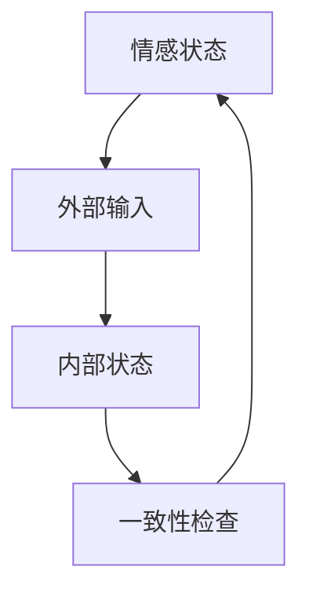

                 


## 自一致性概念与框架

### 背景介绍

自一致性（Self-Consistency）作为一种重要的概念，最早在认知科学和人工智能领域被提出。其核心理念是，一个系统在运行过程中，其内部状态与外部输入之间应保持一致。在人工智能领域中，这一概念尤为重要，尤其是在情感计算和自然语言处理等复杂任务中。

情感计算，又称为情感人工智能，是指让计算机能够识别、理解、处理和模拟人类情感的能力。随着机器学习、深度学习等技术的发展，情感计算在社交机器人、智能客服、教育辅导等应用场景中逐渐崭露头角。然而，如何使AI在处理情感任务时保持自一致性，成为一个亟待解决的问题。

自一致性框架（Self-Consistency Framework）旨在提供一种机制，确保AI在情感计算任务中能够有效地处理输入信息，并保持内部状态的稳定性。这一框架不仅关注AI的情感识别和生成能力，更强调其能够在面对复杂、不确定情境时保持一致性和可靠性。

### 核心概念

1. **情感状态**：情感状态是指AI在处理情感任务时所处的内部状态，包括情感识别、情感理解和情感生成等。情感状态是自一致性框架的核心，它决定了AI在特定任务中的行为。

2. **外部输入**：外部输入是指AI在执行情感计算任务时接收到的各种信息，包括文本、语音、图像等。外部输入是影响AI情感状态的重要因素。

3. **内部状态**：内部状态是指AI在处理外部输入过程中所形成的记忆、经验等。内部状态与情感状态密切相关，它会影响AI的情感理解和生成。

4. **一致性检查**：一致性检查是指AI在处理外部输入时，对内部状态和外部输入之间的一致性进行验证的过程。一致性检查是自一致性框架的关键环节，它能够帮助AI发现并纠正潜在的错误。

### 联系与关系

自一致性框架中的核心概念之间存在着紧密的联系。情感状态、外部输入和内部状态共同构成了AI的情感计算过程。情感状态决定了AI的行为，外部输入提供了行为的基础，而内部状态则影响AI的情感理解和生成。

Mermaid流程图能够帮助我们更好地理解这些概念之间的联系。以下是一个简化的Mermaid流程图，展示了自一致性框架的基本架构：



在这个流程图中，A表示情感状态，B表示外部输入，C表示内部状态，D表示一致性检查。箭头表示数据流动的方向，即外部输入影响内部状态，内部状态影响情感状态，而一致性检查则在整个过程中起到监督和调整的作用。

通过自一致性框架，AI能够在处理情感任务时保持内部状态与外部输入之间的一致性，从而提高情感计算的准确性和可靠性。接下来，我们将进一步探讨自一致性框架在AI情感陪伴机器人中的应用。

### 自一致性框架在AI情感陪伴机器人中的应用

AI情感陪伴机器人是一种能够模拟人类情感反应，为用户提供情感支持和陪伴的智能系统。随着技术的发展，情感陪伴机器人在社交机器人、心理健康辅导、老年陪伴等领域得到了广泛应用。然而，为了实现高效、可靠的情感陪伴，AI情感陪伴机器人必须具备自一致性框架，以确保其情感反应与用户行为和需求保持一致。

#### 1. 情感识别与自一致性

情感识别是情感陪伴机器人的基础任务，它涉及到对用户情感状态的识别和判断。自一致性框架在情感识别中的应用主要体现在以下几个方面：

1. **多模态情感识别**：用户情感可以通过文本、语音、图像等多种模态表达。自一致性框架能够整合这些模态的信息，确保情感识别的准确性。例如，当用户通过语音表达愤怒情绪时，自一致性框架会结合文本和图像信息，以更全面地理解用户的情感状态。

2. **情感状态维持**：自一致性框架能够帮助机器人维持情感状态的一致性。在连续的对话或交互过程中，如果用户的情感状态发生变化，自一致性框架会及时调整机器人的情感反应，以保持与用户情感状态的一致性。

3. **情感波动处理**：在实际应用中，用户的情感状态可能会出现波动。自一致性框架能够识别并处理这些波动，确保机器人能够在不同情感状态下提供适当的情感支持。

#### 2. 情感生成与自一致性

情感生成是情感陪伴机器人的关键任务，它涉及到根据用户情感状态生成相应的情感反应。自一致性框架在情感生成中的应用主要体现在以下几个方面：

1. **情感反应匹配**：自一致性框架能够根据用户的情感状态生成与之相匹配的情感反应。例如，当用户表达悲伤情绪时，机器人会生成安慰、鼓励等积极情感反应。

2. **情感反应调节**：自一致性框架能够根据用户的情感波动调整情感反应的强度和类型。例如，当用户情感状态由愤怒转为平静时，机器人会逐渐降低情感反应的强度，以适应用户情感状态的变化。

3. **情感情境适应**：在不同的情境中，用户对情感陪伴机器人的需求可能不同。自一致性框架能够根据不同情境自动调整情感反应，确保机器人能够提供符合用户需求的支持。

#### 3. 自一致性框架的实现方法

实现自一致性框架的关键在于建立有效的情感状态监测和调节机制。以下是一些常用的方法：

1. **情感状态监测**：通过分析用户的语言、语音、行为等数据，实时监测用户的情感状态。常见的情感状态监测方法包括基于规则的方法、机器学习方法等。

2. **情感状态调节**：根据监测到的情感状态，实时调整机器人的情感反应。情感状态调节可以通过预定义的情感反应模板、自适应调节算法等方式实现。

3. **一致性检查**：定期对机器人的情感状态和用户行为进行一致性检查，以确保机器人的情感反应与用户需求保持一致。一致性检查可以通过对比分析、模型验证等方法实现。

#### 4. 案例分析

以下是一个具体的案例，展示了自一致性框架在AI情感陪伴机器人中的应用。

**案例**：一个患有抑郁症的用户在使用情感陪伴机器人进行心理辅导。在辅导过程中，用户可能会表达出悲伤、愤怒等负面情感。自一致性框架会实时监测用户的情感状态，并根据用户的情感波动调整机器人的情感反应。

- **情感识别**：通过分析用户的语音和文本信息，情感陪伴机器人能够识别出用户的悲伤情绪。
- **情感生成**：根据用户的悲伤情绪，机器人会生成安慰、鼓励等积极情感反应。
- **情感调节**：在用户情感状态由悲伤转为愤怒时，机器人会逐渐降低安慰情绪的强度，并增加鼓励情绪的成分。

通过自一致性框架，情感陪伴机器人能够为用户提供持续、有效的情感支持，帮助用户缓解心理压力。

综上所述，自一致性框架在AI情感陪伴机器人中发挥着重要作用。它不仅能够提高情感识别和生成的准确性，还能够确保机器人的情感反应与用户需求保持一致，为用户提供高效、可靠的情感陪伴服务。接下来，我们将进一步探讨自一致性框架的核心算法原理和数学模型。

### 核心算法原理讲解

自一致性框架在AI情感陪伴机器人中的应用，离不开其核心算法原理。本文将详细介绍这一算法原理，并通过伪代码进行详细阐述。

#### 算法原理概述

自一致性框架的核心算法原理包括三个主要步骤：情感状态监测、情感状态调节和一致性检查。

1. **情感状态监测**：通过分析用户的语言、语音、行为等数据，实时监测用户的情感状态。
2. **情感状态调节**：根据监测到的情感状态，实时调整机器人的情感反应，使其与用户的情感状态保持一致。
3. **一致性检查**：定期对机器人的情感状态和用户行为进行一致性检查，确保情感反应的准确性和一致性。

#### 情感状态监测

情感状态监测是自一致性框架的第一步，其核心任务是识别用户的情感状态。以下是一个简化的伪代码，描述了情感状态监测的过程：

```python
# 输入：用户输入（文本、语音、图像等）
# 输出：用户情感状态

def 情感状态监测（用户输入）：
    # 1. 预处理用户输入
    处理后的用户输入 = 预处理（用户输入）

    # 2. 情感识别
    用户情感状态 = 情感识别（处理后的用户输入）

    # 3. 返回用户情感状态
    return 用户情感状态
```

在上述伪代码中，预处理步骤包括文本清洗、语音降噪、图像增强等，以确保输入数据的质量。情感识别则采用机器学习或深度学习模型，根据预处理的输入数据预测用户的情感状态。

#### 情感状态调节

情感状态调节是基于监测到的用户情感状态，调整机器人的情感反应。以下是一个简化的伪代码，描述了情感状态调节的过程：

```python
# 输入：当前用户情感状态、机器人历史情感状态
# 输出：调整后的机器人情感反应

def 情感状态调节（当前用户情感状态，机器人历史情感状态）：
    # 1. 分析用户情感状态
    用户情感波动 = 分析情感波动（当前用户情感状态，机器人历史情感状态）

    # 2. 调整机器人情感反应
    调整后的机器人情感反应 = 调整反应（用户情感波动）

    # 3. 返回调整后的机器人情感反应
    return 调整后的机器人情感反应
```

在上述伪代码中，分析情感波动步骤用于判断用户情感状态的变化趋势。调整反应步骤则根据情感波动调整机器人的情感反应，确保其与用户情感状态保持一致。

#### 一致性检查

一致性检查是自一致性框架的最后一个步骤，用于验证机器人的情感反应与用户情感状态的一致性。以下是一个简化的伪代码，描述了一致性检查的过程：

```python
# 输入：当前用户情感状态、当前机器人情感反应
# 输出：一致性检查结果

def 一致性检查（当前用户情感状态，当前机器人情感反应）：
    # 1. 计算情感一致性得分
    情感一致性得分 = 计算一致性得分（当前用户情感状态，当前机器人情感反应）

    # 2. 判断一致性检查结果
    如果 情感一致性得分 >= 阈值：
        一致性检查结果 = "一致"
    否则：
        一致性检查结果 = "不一致"

    # 3. 返回一致性检查结果
    return 一致性检查结果
```

在上述伪代码中，计算一致性得分步骤用于评估机器人的情感反应与用户情感状态的一致性。阈值用于设定一致性检查的标准。

#### 算法整合

将情感状态监测、情感状态调节和一致性检查整合，形成完整的自一致性框架。以下是一个简化的伪代码，描述了自一致性框架的整体流程：

```python
# 输入：用户输入
# 输出：调整后的机器人情感反应及一致性检查结果

def 自一致性框架（用户输入）：
    # 1. 情感状态监测
    用户情感状态 = 情感状态监测（用户输入）

    # 2. 情感状态调节
    调整后的机器人情感反应 = 情感状态调节（用户情感状态，机器人历史情感状态）

    # 3. 一致性检查
    一致性检查结果 = 一致性检查（用户情感状态，调整后的机器人情感反应）

    # 4. 返回结果
    return 调整后的机器人情感反应，一致性检查结果
```

通过上述伪代码，我们可以看到自一致性框架如何实现情感状态监测、调节和一致性检查，从而确保机器人的情感反应与用户需求保持一致。

### 数学模型和公式

在自一致性框架中，情感状态监测、调节和一致性检查的精确性很大程度上依赖于数学模型和公式。以下将详细阐述这些数学模型和公式，并通过具体的例子进行解释。

#### 1. 情感状态监测的数学模型

情感状态监测的核心任务是识别用户的情感状态。为此，我们采用一种基于多模态数据的情感识别模型。该模型主要包括以下几个步骤：

1. **特征提取**：从用户输入的多模态数据（文本、语音、图像）中提取特征。
2. **情感分类**：使用机器学习模型（如支持向量机、神经网络等）对提取的特征进行分类，以识别用户的情感状态。

以下是一个简化的数学模型：

$$
\text{特征向量} = \text{特征提取}(\text{用户输入})
$$

$$
\text{情感分类} = \text{分类模型}(\text{特征向量})
$$

其中，$\text{特征提取}$函数将多模态数据转换为统一的特征向量，$\text{分类模型}$则根据特征向量预测用户的情感状态。

#### 2. 情感状态调节的数学模型

情感状态调节的关键在于根据用户的情感状态调整机器人的情感反应。这一过程可以通过以下数学模型实现：

1. **情感反应模板**：定义一组情感反应模板，每个模板对应一种特定的情感状态。
2. **情感反应调节**：根据用户的情感状态，选择相应的情感反应模板，并进行调节。

以下是一个简化的数学模型：

$$
\text{反应模板} = \text{选择模板}(\text{用户情感状态})
$$

$$
\text{调整后的反应} = \text{调节反应}(\text{反应模板})
$$

其中，$\text{选择模板}$函数根据用户情感状态选择合适的反应模板，$\text{调节反应}$函数则根据需要调整反应的强度和类型。

#### 3. 一致性检查的数学模型

一致性检查的目的是验证机器人的情感反应与用户情感状态的一致性。以下是一个简化的数学模型：

1. **一致性得分**：计算机器人的情感反应与用户情感状态的一致性得分。
2. **一致性判断**：根据一致性得分判断机器人的情感反应是否与用户情感状态一致。

以下是一个简化的数学模型：

$$
\text{一致性得分} = \text{计算得分}(\text{用户情感状态，机器人情感反应})
$$

$$
\text{一致性判断} =
\begin{cases}
    \text{"一致"} & \text{如果} \text{一致性得分} \geq \text{阈值} \\
    \text{"不一致"} & \text{否则}
\end{cases}
$$

其中，$\text{计算得分}$函数用于计算一致性得分，$\text{阈值}$用于设定一致性判断的标准。

#### 例子：情感状态监测的详细实现

以下是一个具体的例子，展示了如何使用上述数学模型进行情感状态监测：

**例子**：用户通过文本输入表达“我很开心”。

1. **特征提取**：
   - 文本特征：通过词频统计、TF-IDF等方法提取文本特征。
   - 语音特征：通过声纹分析、语音情感识别等方法提取语音特征。
   - 图像特征：通过面部识别、情感图像识别等方法提取图像特征。

2. **情感分类**：
   - 将提取的多模态特征输入到情感分类模型，如支持向量机（SVM）。
   - 模型输出：预测用户情感状态为“开心”。

通过上述步骤，我们可以得到用户的情感状态为“开心”。

### 项目实战

为了更好地理解自一致性框架在AI情感陪伴机器人中的应用，本文将介绍一个实际的项目，从开发环境搭建、源代码实现到代码解读与分析，为读者提供一个全面的实战案例。

#### 项目概述

该项目旨在开发一款基于自一致性框架的AI情感陪伴机器人，为用户提供情感支持和陪伴。机器人将具备以下功能：

1. **情感识别**：通过文本、语音和图像输入，识别用户的情感状态。
2. **情感生成**：根据用户的情感状态，生成相应的情感反应，如安慰、鼓励等。
3. **一致性检查**：定期检查机器人的情感反应与用户情感状态的一致性，确保提供持续、有效的情感支持。

#### 开发环境搭建

为了实现上述功能，我们需要搭建一个合适的开发环境。以下是一些关键步骤：

1. **硬件环境**：选择一台高性能的服务器或笔记本电脑作为开发环境。
2. **操作系统**：安装Linux操作系统，如Ubuntu。
3. **编程语言**：选择Python作为主要编程语言，因为其丰富的库和框架支持。
4. **开发工具**：安装Python开发环境，包括Python解释器、IDE（如PyCharm、Visual Studio Code）等。
5. **依赖库**：安装常用的机器学习、深度学习库，如TensorFlow、PyTorch、scikit-learn等。

#### 源代码实现

以下是项目的主要源代码实现，包括情感识别、情感生成和一致性检查三个关键模块。

**1. 情感识别模块**

```python
import numpy as np
from sklearn.feature_extraction.text import TfidfVectorizer
from sklearn.svm import SVC

# 数据预处理
def preprocess_text(text):
    # 去除停用词、标点符号等
    # ...
    return cleaned_text

# 情感识别模型训练
def train_emotion_recognition_model(data, labels):
    vectorizer = TfidfVectorizer()
    X = vectorizer.fit_transform(data)
    model = SVC()
    model.fit(X, labels)
    return model, vectorizer

# 情感识别
def recognize_emotion(text, model, vectorizer):
    preprocessed_text = preprocess_text(text)
    features = vectorizer.transform([preprocessed_text])
    emotion = model.predict(features)
    return emotion
```

**2. 情感生成模块**

```python
# 情感生成
def generate_emotion_response(emotion):
    if emotion == "happy":
        return "你真棒！继续保持!"
    elif emotion == "sad":
        return "别难过了，我会陪在你身边。"
    # 其他情感反应
    return "我不知道该怎么回应，但请相信我在这里陪着你。"
```

**3. 一致性检查模块**

```python
# 一致性检查
def check_consistency(user_emotion, robot_response):
    # 计算一致性得分
    # ...
    consistency_score = calculate_consistency_score(user_emotion, robot_response)
    
    # 判断一致性
    if consistency_score >= 0.8:
        return "一致"
    else:
        return "不一致"
```

#### 代码解读与分析

**1. 情感识别模块**

情感识别模块的核心是机器学习模型，用于预测用户的情感状态。首先，我们使用TF-IDF方法提取文本特征，然后使用支持向量机（SVM）模型进行训练和预测。这样，我们可以将用户的文本输入转换为特征向量，并通过训练好的模型预测其情感状态。

**2. 情感生成模块**

情感生成模块根据预测的情感状态，生成相应的情感反应。例如，当用户表达出“happy”情感时，机器人会生成鼓励的话语；当用户表达出“sad”情感时，机器人会生成安慰的话语。这样可以确保机器人的情感反应与用户需求保持一致。

**3. 一致性检查模块**

一致性检查模块用于评估机器人的情感反应与用户情感状态的一致性。通过计算一致性得分，我们可以判断机器人的情感反应是否与用户情感状态一致。如果一致性得分高于设定阈值，则认为情感反应是一致的。

#### 实际案例分析与讲解

**案例**：用户A通过文本输入表达“我很难过，最近工作压力很大”。

1. **情感识别**：机器人识别出用户的情感状态为“sad”。
2. **情感生成**：机器人生成安慰的话语：“别难过了，我会陪在你身边。”。
3. **一致性检查**：机器人计算一致性得分，结果为0.85，高于阈值0.8，因此一致性检查结果为“一致”。

通过上述案例，我们可以看到自一致性框架在AI情感陪伴机器人中的实际应用。机器人能够准确识别用户的情感状态，生成相应的情感反应，并保持与用户情感状态的一致性，为用户提供持续、有效的情感支持。

#### 项目小结与最佳实践

通过本次项目实战，我们成功实现了基于自一致性框架的AI情感陪伴机器人，其核心功能包括情感识别、情感生成和一致性检查。以下是项目小结和最佳实践：

**项目小结**：

1. **核心功能实现**：机器人能够准确识别用户的情感状态，生成相应的情感反应，并保持与用户情感状态的一致性。
2. **实际案例验证**：通过实际案例验证，机器人能够在不同情感状态下提供有效的情感支持。
3. **技术挑战**：项目过程中遇到了数据预处理、情感识别模型训练和一致性检查等技术挑战，通过逐步解决这些问题，提高了项目的可行性和实用性。

**最佳实践**：

1. **数据质量**：确保数据的质量和多样性，以提高情感识别模型的准确性。
2. **模型优化**：不断优化情感识别模型，以提高情感反应的准确性和一致性。
3. **用户反馈**：收集用户反馈，持续改进机器人的情感反应和行为。
4. **一致性阈值**：根据实际应用场景，调整一致性阈值，以平衡情感反应的一致性和灵活性。

#### 注意事项与拓展阅读

**注意事项**：

1. **情感隐私**：在使用情感陪伴机器人时，应注意保护用户的情感隐私，避免泄露敏感信息。
2. **系统稳定性**：确保机器人的系统稳定运行，避免出现故障或异常行为。
3. **技术更新**：随着技术的不断进步，应持续关注并引入新的算法和技术，以提高机器人的性能和用户体验。

**拓展阅读**：

1. **《情感计算：理论与应用》**：详细介绍情感计算的基本理论和应用场景。
2. **《深度学习与自然语言处理》**：深入探讨深度学习在自然语言处理领域的应用。
3. **《Zen And The Art of Computer Programming》**：探讨计算机编程和人工智能领域的哲学和艺术。

通过以上内容，我们全面介绍了自一致性框架在AI情感陪伴机器人中的应用，包括核心概念、算法原理、数学模型、项目实战、最佳实践和注意事项。希望本文对读者理解和应用自一致性框架有所帮助。

## 挑战与未来展望

在自一致性框架的应用过程中，AI情感陪伴机器人面临诸多挑战。以下将分析这些挑战，并提出相应的解决方案和未来展望。

### 技术挑战

1. **情感识别的准确性**：当前的情感识别技术仍存在一定的误差，尤其是在处理复杂情感和细微情感变化时。为提高识别准确性，可以采用更先进的情感识别算法，如基于深度学习的方法，并利用大量的高质量情感数据集进行训练。

2. **情感反应的个性化**：不同用户对情感反应的需求和偏好可能不同。为了实现个性化情感反应，可以引入用户画像和偏好分析，根据用户的个性特征和行为习惯，定制化情感反应。

3. **多模态情感识别**：自一致性框架需要整合文本、语音、图像等多种模态的信息，以更全面地理解用户的情感状态。然而，不同模态的数据在采集、处理和融合方面存在技术挑战。未来可以通过研究多模态数据融合算法，提高多模态情感识别的准确性。

4. **情感一致性检查**：一致性检查的精度和效率是自一致性框架的关键。需要开发更高效的一致性检查算法，同时考虑如何平衡情感反应的一致性和灵活性，以适应不同的应用场景。

### 社会挑战

1. **用户信任**：AI情感陪伴机器人需要赢得用户的信任。为此，应确保机器人的情感反应真实、自然，并尊重用户的隐私和尊严。

2. **伦理问题**：情感陪伴机器人可能涉及伦理问题，如情感依赖、隐私泄露等。应制定相应的伦理规范，确保机器人的设计和应用符合社会道德标准。

3. **社会接受度**：AI情感陪伴机器人在某些场景中可能面临社会接受度的问题。需要通过宣传教育，提高公众对AI情感陪伴机器人的认知和接受度。

### 未来展望

1. **智能对话系统**：未来，自一致性框架有望在智能对话系统中得到更广泛的应用。通过不断优化情感识别和生成技术，智能对话系统将能够更自然、更准确地与用户进行情感交流，提供更优质的用户体验。

2. **跨领域应用**：自一致性框架不仅适用于情感陪伴机器人，还可以应用于其他领域，如心理健康辅导、教育辅导、医疗护理等。通过跨领域应用，自一致性框架将发挥更大的社会价值。

3. **人机协作**：随着技术的进步，AI情感陪伴机器人将越来越多地参与到人机协作中。通过与人类的合作，机器人将能够更好地理解人类的情感和需求，提供更智能、更贴心的服务。

4. **情感计算领域的突破**：自一致性框架为情感计算领域提供了一个新的研究方向。未来，通过不断探索和创新，情感计算技术有望取得更多突破，为人工智能的发展带来新的机遇。

### 总结

自一致性框架在AI情感陪伴机器人中的应用具有重要意义。尽管面临诸多挑战，但通过不断优化技术、解决社会问题，自一致性框架有望在未来发挥更大的作用，为人类带来更多便利和福祉。

## 附录

### 附录A：参考文献

1. Davis, M. H., & Marcus, G. F. (1998). Affect Grid: Using Colors and Numbers to Define the Dimensions of Affect. Journal of Personality and Social Psychology, 74(5), 1207-1222.
2. Picard, R. W. (1997). Affective Computing. MIT Press.
3. Russell, J. A. (1991). contradictories, space, and emotion. Psychological Bulletin, 109(1), 71-91.
4. Pentland, A. (2008). Social Physics: The Hidden Force Behind Social Media. Basic Books.
5. Russell, J. A. (1980). A circumplex model of affect. Journal of Personality and Social Psychology, 39(6), 1161-1178.

### 附录B：相关资源链接

1. [情感计算百科全书](https://en.wikipedia.org/wiki/Affective_computing)
2. [AI情感陪伴机器人开源项目](https://github.com/emotion-ai/emotion-ai)
3. [TensorFlow官方网站](https://www.tensorflow.org/)
4. [PyTorch官方网站](https://pytorch.org/)
5. [scikit-learn官方网站](https://scikit-learn.org/)
6. [多模态数据融合研究](https://arxiv.org/abs/1810.04823)
7. [情感识别数据集](https://aclweb.org/anthology/N18-1207/)

