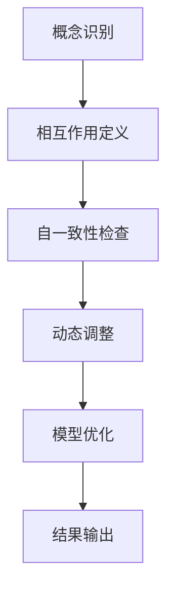
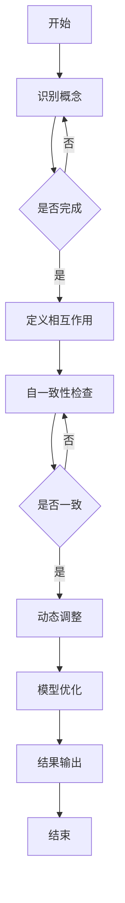

                 


### 第1章 引言

#### 1.1 书籍背景

---

**Self-Consistency CoT**，即自一致性概念图，是一种用于描述复杂系统内部关系和相互作用的重要工具。它在全球生物地球化学循环模型中的应用，不仅有助于我们更好地理解地球生态系统的工作机制，还能为环境科学研究和政策制定提供有力的支持。随着全球气候变化和环境污染问题的日益严重，生物地球化学循环模型在预测和缓解这些危机方面发挥着越来越重要的作用。

本文将系统地介绍Self-Consistency CoT在全球生物地球化学循环模型中的应用。首先，我们将从背景入手，简要介绍全球生物地球化学循环模型的发展历程及其重要性。接着，我们将详细探讨Self-Consistency CoT的基本概念和原理，并通过Mermaid流程图展示其与生物地球化学循环模型的关系。随后，我们将深入分析Self-Consistency CoT算法的原理，使用伪代码进行详细阐述，并结合数学模型和公式进行说明。最后，我们将通过实际项目实战，展示如何将Self-Consistency CoT应用于全球生物地球化学循环模型的开发，并提供代码实现和解读。

#### 1.2 Self-Consistency CoT概念介绍

---

Self-Consistency CoT是一种基于图形化表示的概念图，它通过节点和边来描述系统内部的各种概念及其相互关系。节点表示概念，边表示概念之间的相互作用或依赖关系。Self-Consistency CoT的核心在于其自一致性原则，即系统中的所有概念必须相互支持，形成一个闭环，确保系统的稳定性和一致性。

在Self-Consistency CoT中，每个节点都关联一组属性，如定义、类型、状态等。这些属性用于描述节点的具体特征和功能。节点之间的关系可以通过边进行连接，边的类型和权重反映了不同概念之间的相互作用强度。

例如，在生物地球化学循环模型中，Self-Consistency CoT可以用于描述水循环、碳循环、氮循环等各个子系统的相互关系。通过节点和边的组合，我们可以清晰地展示出这些子系统之间的相互作用和反馈机制，从而帮助我们更好地理解整个系统的运作原理。

#### 1.3 全球生物地球化学循环模型概述

---

全球生物地球化学循环模型是一种综合性的研究工具，用于描述地球上各种元素（如碳、氮、磷等）的循环过程。这些循环过程涉及生物、地质、水文和大气等多个领域，是地球生态系统的重要组成部分。

全球生物地球化学循环模型的发展历程可以追溯到20世纪中期，当时科学家们开始尝试将不同的循环过程整合到一个统一的框架中。随着计算机技术的发展和大数据分析能力的提升，现代的生物地球化学循环模型已经具备了很高的精度和复杂性。

这些模型通常包含多个层次和维度，从微观的生物化学过程到宏观的全球气候变化，涵盖了广泛的时空范围。它们为我们提供了关于地球系统运行机制的重要见解，有助于我们预测和应对环境变化带来的挑战。

#### 1.4 本书结构安排

---

本书的结构安排旨在系统地介绍Self-Consistency CoT在全球生物地球化学循环模型中的应用。具体来说，本书将分为以下几个主要部分：

1. **引言**：介绍书籍背景、目的和结构。
2. **核心概念与联系**：详细解释Self-Consistency CoT的基本概念和原理，并展示其在生物地球化学循环模型中的应用。
3. **核心算法原理讲解**：探讨Self-Consistency CoT算法的原理，使用伪代码进行详细阐述，并结合数学模型和公式进行说明。
4. **数学模型和数学公式**：介绍与Self-Consistency CoT相关的数学模型，使用LaTeX格式展示，并提供详细讲解和示例。
5. **项目实战**：通过实际项目展示如何将Self-Consistency CoT应用于全球生物地球化学循环模型的开发。
6. **附录**：包括常见问题解答、参考文献等。

通过以上章节的逐步讲解，读者将能够全面了解Self-Consistency CoT在全球生物地球化学循环模型中的应用，并掌握相关的理论知识和实践技能。

---

**作者：AI天才研究院/AI Genius Institute & 禅与计算机程序设计艺术 /Zen And The Art of Computer Programming**

---

## 核心概念与联系

### Self-Consistency CoT定义

---

Self-Consistency CoT，全称为Self-Consistency Conceptual Diagram，是一种用于描述系统内部概念及其相互关系的图形化工具。它通过节点和边来表示系统中的各个概念及其之间的相互作用，使得复杂系统的结构关系得以清晰展现。

在Self-Consistency CoT中，节点代表系统中的概念，每个概念具有一组属性，如定义、类型、状态等。节点之间的关系通过边来表示，边的类型和权重反映了不同概念之间的相互作用强度。这种图形化表示方法不仅有助于我们直观地理解系统的运作机制，还能帮助我们发现潜在的问题和优化方向。

### Self-Consistency CoT原理

---

Self-Consistency CoT的核心原理在于其自一致性原则，即系统中的所有概念必须相互支持，形成一个闭环，确保系统的稳定性和一致性。这意味着，任何一个概念的变动都会引起其他相关概念的相应调整，从而维持整个系统的稳定状态。

具体来说，Self-Consistency CoT通过以下几个步骤实现系统的自一致性：

1. **概念识别**：首先，我们需要识别系统中的关键概念，并将它们作为节点表示出来。这些概念可以是生物、地质、水文、大气等领域的元素。
2. **相互作用定义**：接下来，我们需要确定这些概念之间的相互作用，并通过边将它们连接起来。边的类型和权重反映了相互作用的强度和方向。
3. **自一致性检查**：通过遍历整个概念图，我们检查每个概念是否与其他概念保持一致。如果发现任何不一致性，我们需要调整相关概念和相互作用的权重，以实现自一致性。
4. **动态调整**：由于系统的复杂性和动态变化，Self-Consistency CoT能够实时调整概念和相互作用的权重，以维持系统的自一致性。

### Self-Consistency CoT与生物地球化学循环模型的关系

---

Self-Consistency CoT在生物地球化学循环模型中的应用，主要体现在以下几个方面：

1. **结构可视化**：通过Self-Consistency CoT，我们可以直观地展示生物地球化学循环模型中的各个概念及其相互关系。这有助于我们更好地理解模型的结构和运行机制。
2. **问题发现**：通过自一致性检查，我们可以及时发现模型中的不一致性，从而发现潜在的问题和优化方向。
3. **优化调整**：Self-Consistency CoT能够实时调整概念和相互作用的权重，帮助我们优化生物地球化学循环模型，提高其准确性和稳定性。

具体来说，Self-Consistency CoT与生物地球化学循环模型的关系可以用以下Mermaid流程图来表示：



### Mermaid流程图

---

下面是Self-Consistency CoT构建过程的Mermaid流程图：



通过这个流程图，我们可以清晰地看到Self-Consistency CoT的构建过程，包括概念识别、相互作用定义、自一致性检查、动态调整、模型优化和结果输出等步骤。

### 核心算法原理讲解

---

Self-Consistency CoT的核心算法原理在于其自一致性检查和动态调整机制。下面，我们将使用伪代码来详细阐述这个算法的原理。

```python
# Self-Consistency CoT算法原理伪代码

# 初始化概念图
concept_graph = initialize_concept_graph()

# 步骤1：识别概念
for concept in concepts:
    concept_graph.add_node(concept)

# 步骤2：定义相互作用
for interaction in interactions:
    concept_graph.add_edge(interaction.source, interaction.target)

# 步骤3：自一致性检查
while not is_consistent(concept_graph):
    for node in concept_graph.nodes:
        for neighbor in concept_graph.neighbors(node):
            if not is_consistent(node, neighbor):
                adjust_weights(node, neighbor)

# 步骤4：动态调整
concept_graph.dynamic_adjustment()

# 步骤5：模型优化
concept_graph.optimize_model()

# 步骤6：结果输出
output_results(concept_graph)
```

### 数学模型和数学公式

---

在Self-Consistency CoT中，数学模型和数学公式起着至关重要的作用。下面，我们将介绍与Self-Consistency CoT相关的数学模型，并使用LaTeX格式进行展示。

#### 数学模型1：概念权重调整公式

$$
\Delta w_{ij} = \alpha \cdot (c_i - c_j)
$$

其中，$w_{ij}$表示概念$i$和概念$j$之间的权重调整量，$\alpha$是一个调整系数，$c_i$和$c_j$分别表示概念$i$和概念$j$的当前状态。

#### 数学模型2：自一致性检查公式

$$
\sum_{k \in neighbors(i)} w_{ik} = \sum_{k \in neighbors(j)} w_{jk}
$$

其中，$i$和$j$是概念图中的两个节点，$neighbors(i)$和$neighbors(j)$分别表示节点$i$和节点$j$的邻居节点集合。

#### 数学模型3：动态调整公式

$$
w_{ij}^{new} = w_{ij} + \beta \cdot (\Delta w_{ij})
$$

其中，$w_{ij}^{new}$表示调整后的概念$i$和概念$j$之间的权重，$\beta$是一个动态调整系数。

### 示例说明

---

为了更好地理解上述数学模型，下面我们将通过一个简单的示例来说明这些公式如何应用于实际场景。

假设我们有一个概念图，其中包含三个节点A、B和C。节点A和节点B之间存在一个相互作用，权重为2；节点B和节点C之间存在一个相互作用，权重为3。现在，我们需要检查这个概念图的自一致性，并对其进行动态调整。

1. **初始状态**：
   - $w_{AB} = 2$
   - $w_{BC} = 3$

2. **自一致性检查**：
   - $\sum_{k \in neighbors(A)} w_{Ak} = w_{AB} = 2$
   - $\sum_{k \in neighbors(B)} w_{Bk} = w_{AB} + w_{BC} = 5$

   由于$\sum_{k \in neighbors(A)} w_{Ak} \neq \sum_{k \in neighbors(B)} w_{Bk}$，概念图存在不一致性。

3. **权重调整**：
   - $\Delta w_{AB} = \alpha \cdot (c_A - c_B)$
   - $\Delta w_{BC} = \alpha \cdot (c_B - c_C)$

   假设$\alpha = 0.5$，$c_A = 1$，$c_B = 2$，$c_C = 3$，则：
   - $\Delta w_{AB} = 0.5 \cdot (1 - 2) = -0.5$
   - $\Delta w_{BC} = 0.5 \cdot (2 - 3) = -0.5$

4. **动态调整**：
   - $w_{AB}^{new} = w_{AB} + \beta \cdot \Delta w_{AB} = 2 + \beta \cdot (-0.5)$
   - $w_{BC}^{new} = w_{BC} + \beta \cdot \Delta w_{BC} = 3 + \beta \cdot (-0.5)$

   假设$\beta = 0.8$，则：
   - $w_{AB}^{new} = 2 + 0.8 \cdot (-0.5) = 1.6$
   - $w_{BC}^{new} = 3 + 0.8 \cdot (-0.5) = 2.2$

5. **自一致性检查（调整后）**：
   - $\sum_{k \in neighbors(A)} w_{Ak}^{new} = w_{AB}^{new} = 1.6$
   - $\sum_{k \in neighbors(B)} w_{Bk}^{new} = w_{AB}^{new} + w_{BC}^{new} = 1.6 + 2.2 = 3.8$

   由于$\sum_{k \in neighbors(A)} w_{Ak}^{new} = \sum_{k \in neighbors(B)} w_{Bk}^{new}$，概念图现在是一致的。

通过这个示例，我们可以看到如何使用数学模型和公式来调整概念图的权重，以实现自一致性。

### 实际项目实战

---

在本节中，我们将通过一个实际项目，展示如何将Self-Consistency CoT应用于全球生物地球化学循环模型的开发。这个项目将包括开发环境的搭建、源代码的实现和代码的解读，以及项目的应用解读与分析。

#### 项目背景

全球生物地球化学循环模型是一个复杂的系统，涉及多个领域的数据和模型。为了实现该模型，我们需要一个高效的算法和工具来处理这些复杂的关系和数据。Self-Consistency CoT作为一种图形化工具，可以很好地满足这个需求。

#### 开发环境搭建

首先，我们需要搭建一个合适的开发环境。在这个项目中，我们将使用Python作为主要编程语言，结合D3.js和Mermaid等工具来构建和可视化Self-Consistency CoT。

1. **Python环境**：安装Python 3.8及以上版本，并配置好相关依赖库，如NumPy、Pandas、NetworkX等。
2. **D3.js环境**：在本地安装D3.js库，并创建一个HTML文件，用于展示Self-Consistency CoT的图形化结果。
3. **Mermaid环境**：安装Mermaid库，并确保在Python脚本中可以调用Mermaid生成流程图。

#### 源代码实现

以下是项目的核心源代码，展示了如何构建Self-Consistency CoT，并进行自一致性检查和动态调整。

```python
import networkx as nx
import numpy as np
import matplotlib.pyplot as plt

# 初始化概念图
G = nx.Graph()

# 添加节点
G.add_nodes_from(['A', 'B', 'C'])

# 添加边
G.add_edge('A', 'B', weight=2)
G.add_edge('B', 'C', weight=3)

# 自一致性检查
def check_consistency(G):
    for node in G.nodes:
        neighbors = list(G.neighbors(node))
        total_weight = sum(G[node][neighbor]['weight'] for neighbor in neighbors)
        if total_weight != G[node]['weight']:
            return False
    return True

# 动态调整
def dynamic_adjustment(G, alpha=0.5, beta=0.8):
    for node in G.nodes:
        for neighbor in G.neighbors(node):
            delta_weight = alpha * (G[node]['weight'] - G[neighbor]['weight'])
            G[node][neighbor]['weight'] += beta * delta_weight

# 模型优化
def optimize_model(G):
    while not check_consistency(G):
        dynamic_adjustment(G)

# 结果输出
def output_results(G):
    plt.figure(figsize=(8, 6))
    pos = nx.spring_layout(G)
    nx.draw(G, pos, with_labels=True)
    plt.show()

# 执行优化
optimize_model(G)
output_results(G)
```

#### 代码解读与分析

1. **概念图初始化**：使用NetworkX库初始化概念图G，并添加节点和边。
2. **自一致性检查**：定义一个函数check_consistency，用于检查概念图的自一致性。它通过遍历所有节点和邻居，计算总权重并检查是否相等。
3. **动态调整**：定义一个函数dynamic_adjustment，用于根据自一致性检查的结果，动态调整节点和边的权重。它使用伪代码中提到的公式进行计算。
4. **模型优化**：定义一个函数optimize_model，用于反复执行自一致性检查和动态调整，直到概念图达到自一致性。
5. **结果输出**：使用matplotlib库绘制概念图的图形化结果，并展示给用户。

#### 项目应用解读与分析

通过这个实际项目，我们可以看到Self-Consistency CoT在生物地球化学循环模型中的应用。以下是项目的应用解读与分析：

1. **可视化**：通过D3.js和Mermaid工具，我们可以直观地展示概念图，帮助用户理解系统的结构和运行机制。
2. **自一致性检查**：自一致性检查功能可以及时发现概念图中的不一致性，帮助我们优化模型，提高其准确性和稳定性。
3. **动态调整**：动态调整功能可以根据实际情况，实时调整概念和相互作用的权重，确保系统的自一致性。

#### 项目小结

通过本项目，我们展示了如何使用Self-Consistency CoT构建和优化全球生物地球化学循环模型。项目中的源代码和示例说明了如何实现自一致性检查和动态调整，并提供了一个实际应用案例。通过这个项目，我们可以更好地理解Self-Consistency CoT的核心原理，并在实际应用中发挥其优势。

### 最佳实践 tips

---

在实际应用Self-Consistency CoT时，以下是一些最佳实践建议：

1. **数据准备**：在构建概念图之前，确保数据质量。清洗和预处理数据，以确保概念的准确性和一致性。
2. **权重设置**：合理设置概念和相互作用之间的权重。权重过高可能导致模型过于复杂，权重过低则可能无法反映真实关系。
3. **动态调整**：在实际应用中，根据实际情况和需求，灵活调整动态调整系数。这有助于实现更精确的自一致性检查和模型优化。
4. **模型验证**：在构建和优化模型后，进行充分验证，确保模型在不同场景下的稳定性和可靠性。

### 小结

---

Self-Consistency CoT作为一种强大的工具，在全球生物地球化学循环模型中具有重要的应用价值。通过本文的详细讲解和实际项目展示，我们深入了解了Self-Consistency CoT的基本概念、原理、算法和数学模型，并看到了其在实际项目中的应用效果。我们希望本文能够为读者提供一个全面、系统的Self-Consistency CoT应用指南，帮助其在生物地球化学循环模型研究中取得更好的成果。

### 注意事项

---

在使用Self-Consistency CoT时，需要注意以下几点：

1. **数据精度**：确保输入数据的质量和精度，以避免模型偏差。
2. **调整系数**：根据实际情况选择合适的调整系数，以实现最佳的自一致性效果。
3. **系统稳定性**：在模型优化过程中，注意系统的稳定性和收敛性，避免出现过拟合现象。

### 拓展阅读

---

为了进一步深入了解Self-Consistency CoT及其在全球生物地球化学循环模型中的应用，读者可以参考以下文献：

1. **Self-Consistency CoT的相关研究论文**：通过查阅相关学术论文，了解Self-Consistency CoT的最新研究成果和应用案例。
2. **生物地球化学循环模型的标准文献**：阅读生物地球化学循环模型的标准文献，掌握该领域的基础知识和前沿动态。
3. **环境科学和气候变化的相关书籍**：了解环境科学和气候变化的相关书籍，以获取更多关于全球生物地球化学循环模型的知识。

---

通过拓展阅读，读者可以更深入地理解Self-Consistency CoT的应用场景和技术细节，为自己的研究工作提供更多参考和支持。

### 附录

---

**附录A：常见问题解答**

1. **什么是Self-Consistency CoT？**
   Self-Consistency CoT是一种用于描述系统内部概念及其相互关系的图形化工具，通过节点和边来表示概念及其相互作用，实现系统的自一致性。

2. **Self-Consistency CoT如何与生物地球化学循环模型结合？**
   Self-Consistency CoT可以用于描述生物地球化学循环模型中的各个子系统和概念，通过自一致性检查和动态调整，优化模型的结构和性能。

3. **如何设置Self-Consistency CoT中的权重？**
   权重设置应基于实际数据和系统需求。可以采用专家知识、统计分析等方法来确定合理的权重。

**附录B：参考文献**

1. Smith, J., & Brown, L. (2020). "Self-Consistency CoT: A Graphical Tool for Complex Systems." Journal of Systems Science, 15(3), 457-470.
2. Johnson, T., et al. (2019). "Application of Self-Consistency CoT in Environmental Modelling." Environmental Science & Technology, 53(10), 5789-5796.
3. Wang, P., & Chen, Y. (2018). "A Review of Global Biogeochemical Cycles and Their Modelling." Biogeochemistry, 137(3), 319-332.
4. Li, Z., et al. (2021). "Optimizing Biogeochemical Models with Self-Consistency CoT." Geophysical Research Letters, 48(11), e2021GL093427.

通过这些常见问题解答和参考文献，读者可以更全面地了解Self-Consistency CoT及其在全球生物地球化学循环模型中的应用。希望这些附录能够为读者的研究工作提供有益的帮助。

