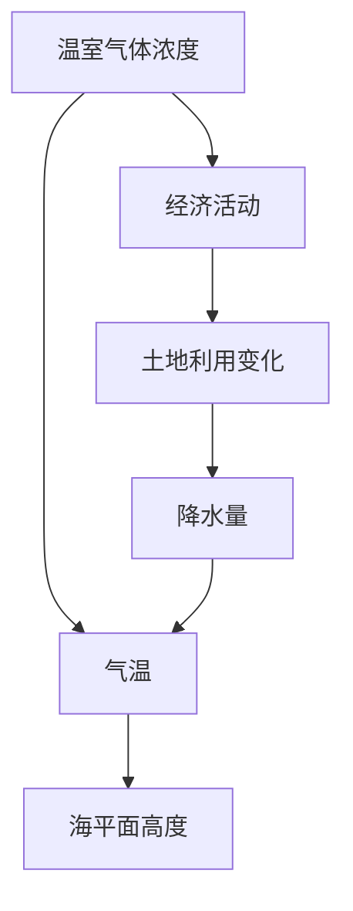
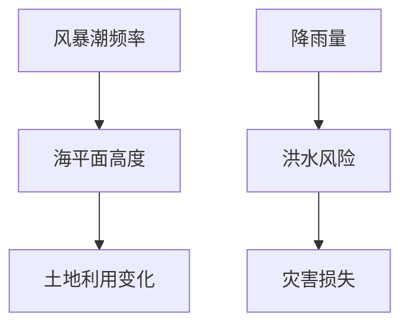

                 


# Self-Consistency CoT在气候变化预测中的作用

## 关键词
Self-Consistency CoT、气候变化预测、概念图论、自洽性理论、系统动力学、算法原理、灾害风险评估、可持续发展评估。

## 摘要
本文探讨了Self-Consistency CoT（自一致性概念图论）在气候变化预测中的关键作用。通过构建自洽的概念图，Self-Consistency CoT能够模拟气候变化过程，为政策制定、灾害风险评估和可持续发展评估提供科学依据。本文详细阐述了Self-Consistency CoT的定义、理论基础、算法原理以及实际应用场景，并讨论了其在气候变化预测中的优势和挑战。

## 目录
### 第1章: 引言
#### 1.1 书籍背景与目标
#### 1.2 内容安排

### 第2章: Self-Consistency CoT基础
#### 2.1 定义与核心概念
#### 2.2 理论基础
#### 2.3 自洽性约束

### 第3章: Self-Consistency CoT的应用场景
#### 3.1 气候变化预测
#### 3.2 灾害风险评估
#### 3.3 可持续发展评估

### 第4章: Self-Consistency CoT的算法原理
#### 4.1 概念图构建
#### 4.2 自洽性约束引入
#### 4.3 概念图推理

### 第5章: Self-Consistency CoT的优势与挑战
#### 5.1 优势
#### 5.2 挑战

### 第6章: 案例分析
#### 6.1 案例一：气候变化预测
#### 6.2 案例二：灾害风险评估
#### 6.3 案例三：可持续发展评估

### 第7章: 未来展望
#### 7.1 技术发展
#### 7.2 应用前景
#### 7.3 潜在挑战

### 第1章: 引言

### 1.1 书籍背景与目标

随着全球气候变化的加剧，准确预测气候变化趋势对于制定有效政策、应对灾害风险和实现可持续发展具有重要意义。传统的气候变化预测方法往往依赖于统计模型和物理模型，这些方法在处理复杂系统时存在一定的局限性。Self-Consistency CoT（自一致性概念图论）作为一种新兴的预测方法，通过构建自洽的概念图来模拟气候变化过程，提供了一种更加灵活和精确的预测手段。

本书旨在深入探讨Self-Consistency CoT在气候变化预测中的应用。通过系统的分析和详尽的讨论，本书希望能够为研究人员、政策制定者和相关从业者提供一个全面的理论框架和实际应用指南。具体目标包括：

1. **介绍Self-Consistency CoT的基本概念和理论基础**：使读者了解Self-Consistency CoT的核心原理和概念，包括概念节点、概念关系和自洽性约束。

2. **阐述Self-Consistency CoT在气候变化预测中的具体应用**：通过分析不同的应用场景，展示Self-Consistency CoT在预测气候变化趋势、灾害风险评估和可持续发展评估中的实际作用。

3. **讨论Self-Consistency CoT的优势和挑战**：分析Self-Consistency CoT在气候变化预测中的潜在优势，同时探讨其面临的理论和实践挑战。

4. **提供案例分析**：通过具体案例展示Self-Consistency CoT在实际项目中的应用效果，帮助读者更好地理解和应用该方法。

5. **展望Self-Consistency CoT的未来发展**：讨论Self-Consistency CoT在技术、应用前景和潜在挑战等方面的未来发展。

### 1.2 内容安排

本书共分为七个章节，具体安排如下：

- **第1章：引言**：介绍书籍的背景、目标和内容安排。
- **第2章：Self-Consistency CoT基础**：介绍Self-Consistency CoT的定义、核心概念和理论基础。
- **第3章：Self-Consistency CoT的应用场景**：分析Self-Consistency CoT在气候变化预测中的具体应用。
- **第4章：Self-Consistency CoT的算法原理**：详细阐述Self-Consistency CoT的算法原理和实现方法。
- **第5章：Self-Consistency CoT的优势与挑战**：探讨Self-Consistency CoT在气候变化预测中的优势及其面临的挑战。
- **第6章：案例分析**：通过具体案例展示Self-Consistency CoT在气候变化预测中的实际应用。
- **第7章：未来展望**：讨论Self-Consistency CoT在气候变化预测中的未来发展。

### 第2章: Self-Consistency CoT基础

### 2.1 定义与核心概念

Self-Consistency CoT（自一致性概念图论）是一种基于概念图论的气候变化预测方法。其基本思想是通过构建自洽的概念图来模拟气候变化过程。在这个过程中，概念节点表示气候变化中的关键因素，如温室气体浓度、气温、降水量等；概念关系表示这些因素之间的相互作用和影响；自洽性约束确保概念图中的概念关系在逻辑上自洽，避免出现矛盾和不一致的情况。

核心概念包括以下几部分：

1. **概念节点**：在Self-Consistency CoT中，概念节点表示气候变化中的关键因素。例如，温室气体浓度、气温、降水量等都可以作为概念节点。这些节点代表了一个具体的变量或者因素，是构建概念图的基础。

2. **概念关系**：概念关系表示概念节点之间的相互作用和影响。例如，温室气体浓度的增加可能会导致气温的上升。这些关系可以基于已有的科学理论和数据来建立。

3. **自洽性约束**：自洽性约束是确保概念图一致性的关键。它包括无矛盾约束、一致性约束和反馈约束。无矛盾约束确保概念节点之间的概念关系不会导致逻辑矛盾；一致性约束确保概念节点之间的概念关系满足现实世界的逻辑一致性；反馈约束确保概念图中的反馈循环不会导致系统崩溃或失去控制。

### 2.2 理论基础

Self-Consistency CoT的理论基础主要包括概念图论、自洽性理论和系统动力学。

1. **概念图论**：概念图论是一种形式化的方法来表示和操作概念关系。在Self-Consistency CoT中，概念图论提供了一种有效的工具来构建和验证自洽的概念图。通过定义概念节点和概念关系，概念图论可以帮助我们更好地理解和模拟气候变化过程。

2. **自洽性理论**：自洽性理论是确保概念图一致性的关键。在Self-Consistency CoT中，自洽性理论提供了一个框架来定义和验证自洽性约束。通过引入无矛盾约束、一致性约束和反馈约束，自洽性理论可以帮助我们构建一个逻辑上自洽的概念图，从而更准确地模拟气候变化过程。

3. **系统动力学**：系统动力学是一种用于分析和模拟复杂系统的理论和方法。在Self-Consistency CoT中，系统动力学用于模拟概念图中的因果关系和反馈循环。通过建立系统动力学模型，我们可以更好地理解气候变化过程中各因素之间的相互作用和影响。

### 2.3 自洽性约束

在Self-Consistency CoT中，自洽性约束是确保概念图一致性的关键。自洽性约束主要包括以下几种：

1. **无矛盾约束**：无矛盾约束确保概念节点之间的概念关系不会导致逻辑矛盾。例如，如果温室气体浓度的增加被定义为导致气温上升的关系，那么这两个概念节点之间的关系就不能被定义为同时导致气温下降。这种约束可以防止概念图中出现自相矛盾的情况。

2. **一致性约束**：一致性约束确保概念节点之间的概念关系满足现实世界的逻辑一致性。例如，根据科学理论，温室气体浓度的增加通常会伴随气温的上升。这种一致性约束可以基于已有的科学理论和数据来建立，从而确保概念图的逻辑一致性。

3. **反馈约束**：反馈约束确保概念图中的反馈循环不会导致系统崩溃或失去控制。例如，在气候变化过程中，气温的上升可能会导致温室气体浓度的增加，进而导致气温的进一步上升。这种正反馈循环可能会加速气候变化的进程。反馈约束可以帮助我们识别和应对这些可能的反馈循环，从而更准确地模拟气候变化过程。

通过引入自洽性约束，Self-Consistency CoT可以确保概念图的逻辑一致性，从而提高预测的准确性和可靠性。自洽性约束的引入不仅使得概念图的构建更加规范化和系统化，而且有助于揭示气候变化过程中的潜在机制和规律。

### 第3章: Self-Consistency CoT的应用场景

Self-Consistency CoT在气候变化预测中具有广泛的应用场景，主要包括气候变化预测、灾害风险评估和可持续发展评估。下面将分别介绍这些应用场景的具体内容和作用。

#### 3.1 气候变化预测

Self-Consistency CoT在气候变化预测中的核心作用是通过构建自洽的概念图来模拟气候变化过程，预测未来的气候变化趋势。具体来说，Self-Consistency CoT的应用场景包括以下几个方面：

1. **温室气体排放情景分析**：通过构建概念图，可以模拟不同温室气体排放情景下的气候变化趋势。例如，我们可以设定不同的温室气体浓度增长速度，分析这些情景下的气候变化特征，如气温上升、海平面上升等。这些分析结果可以为政策制定提供科学依据，帮助决策者制定更加有效的减排策略。

2. **气候变化趋势预测**：基于自洽的概念图，可以预测未来的气候变化趋势。例如，通过分析温室气体浓度、气温、降水量等关键因素之间的关系，可以预测未来某一特定地区的气候变化趋势。这些预测结果对于城市规划、农业生产和水资源管理等领域具有重要意义。

3. **极端气候事件预测**：Self-Consistency CoT还可以用于预测极端气候事件，如热浪、暴雨、干旱等。通过分析极端气候事件与气候变化趋势之间的关系，可以预测未来可能发生的极端气候事件，为防灾减灾提供指导。

#### 3.2 灾害风险评估

Self-Consistency CoT在灾害风险评估中的应用主要是通过分析气候变化与自然灾害之间的关系，评估自然灾害的风险和影响。具体包括以下几个方面：

1. **风暴潮风险评估**：风暴潮是海平面上升和强风暴相结合产生的极端天气事件，对沿海地区构成严重威胁。通过构建自洽的概念图，可以分析风暴潮与温室气体浓度、气温、海平面上升等因素之间的关系，评估风暴潮的风险和影响。

2. **洪水风险评估**：气候变化可能导致降雨模式的改变，进而引发洪水灾害。Self-Consistency CoT可以分析降雨量、气温、土地利用等因素之间的关系，评估洪水灾害的风险和影响。

3. **干旱风险评估**：干旱是水资源短缺的主要表现，对农业生产和生态系统产生严重影响。通过分析气温、降水量、土地湿度等因素之间的关系，可以评估干旱的风险和影响。

通过这些分析，可以制定更加有效的防灾减灾策略，降低自然灾害对人类社会的危害。

#### 3.3 可持续发展评估

Self-Consistency CoT在可持续发展评估中的应用主要是通过分析经济、社会和环境之间的相互作用，评估不同发展模式对可持续发展的影响。具体包括以下几个方面：

1. **碳排放与经济增长的关系**：通过构建概念图，可以分析碳排放与经济增长之间的关系，评估不同经济增长模式对碳排放的影响。这有助于制定更加可持续的经济政策，实现经济增长与碳排放减少的双赢。

2. **环境保护与经济发展的平衡**：通过分析环境保护措施与经济发展之间的关系，可以评估不同环境保护措施对经济发展的负面影响。这有助于找到环境保护与经济发展的平衡点，实现可持续发展。

3. **社会公平与环境保护的关系**：通过分析社会公平与环境保护之间的关系，可以评估不同发展模式对社会公平的影响。这有助于制定更加公平的发展政策，实现经济、社会和环境的协调发展。

通过这些评估，可以制定更加科学和有效的可持续发展战略，实现经济、社会和环境的协调发展。

### 3.4 应用总结

Self-Consistency CoT在气候变化预测、灾害风险评估和可持续发展评估中具有广泛的应用前景。通过构建自洽的概念图，可以模拟气候变化过程，预测未来的气候变化趋势；通过分析气候变化与自然灾害之间的关系，可以评估自然灾害的风险和影响；通过分析经济、社会和环境之间的相互作用，可以评估不同发展模式对可持续发展的影响。这些应用场景不仅为政策制定提供了科学依据，而且有助于降低自然灾害的风险，实现经济、社会和环境的协调发展。

### 第4章: Self-Consistency CoT的算法原理

Self-Consistency CoT（自一致性概念图论）的算法原理是其能够有效模拟和预测气候变化过程的核心。本章将详细阐述Self-Consistency CoT的算法原理，包括概念图的构建、自洽性约束的引入和概念图的推理。

#### 4.1 概念图构建

概念图的构建是Self-Consistency CoT算法的第一步。构建概念图需要以下几个关键步骤：

1. **数据收集**：收集与气候变化相关的各种数据，包括温室气体浓度、气温、降水量、海平面高度等。这些数据可以从气象站、卫星观测、气候模型等多种来源获取。

2. **概念节点提取**：基于收集到的数据，识别出影响气候变化的关键因素，并将这些因素作为概念节点。例如，温室气体浓度、气温、降水量等都可以作为概念节点。

3. **概念关系确定**：分析概念节点之间的相互作用和影响，确定概念关系。这些关系可以基于科学理论和数据建立。例如，温室气体浓度的增加可能导致气温的上升，而气温的上升又可能导致海平面上升。

4. **概念图绘制**：将提取的概念节点和确定的概念关系绘制成概念图。概念图可以采用图形化工具，如Mermaid，来绘制。

下面是一个简单的概念图示例：



在这个概念图中，温室气体浓度、气温、海平面高度、降水量、土地利用变化和经济活动都是概念节点，它们之间的箭头表示概念关系。

#### 4.2 自洽性约束的引入

自洽性约束是确保概念图一致性的关键。在Self-Consistency CoT中，自洽性约束包括无矛盾约束、一致性约束和反馈约束。

1. **无矛盾约束**：无矛盾约束确保概念节点之间的概念关系不会导致逻辑矛盾。例如，如果温室气体浓度的增加被定义为导致气温上升的关系，那么这两个概念节点之间的关系就不能被定义为同时导致气温下降。

2. **一致性约束**：一致性约束确保概念节点之间的概念关系满足现实世界的逻辑一致性。例如，根据科学理论，温室气体浓度的增加通常会伴随气温的上升。这种一致性约束可以基于已有的科学理论和数据来建立。

3. **反馈约束**：反馈约束确保概念图中的反馈循环不会导致系统崩溃或失去控制。例如，在气候变化过程中，气温的上升可能会导致温室气体浓度的增加，进而导致气温的进一步上升。这种正反馈循环可能会加速气候变化的进程。反馈约束可以帮助我们识别和应对这些可能的反馈循环，从而更准确地模拟气候变化过程。

引入自洽性约束的步骤如下：

1. **定义约束**：根据科学理论和数据，定义无矛盾约束、一致性约束和反馈约束。

2. **验证约束**：通过逻辑推理和数学模型验证约束的有效性。例如，可以采用形式化验证方法来检查概念图中的概念关系是否满足约束条件。

3. **调整约束**：根据验证结果调整约束，以确保概念图的一致性和准确性。

#### 4.3 概念图的推理

概念图的推理是Self-Consistency CoT算法的核心步骤，用于根据概念图预测未来的气候变化趋势。推理过程包括以下几个关键步骤：

1. **初始化**：初始化概念图中的概念节点和概念关系，通常基于历史数据和现有模型。

2. **因果关系分析**：分析概念节点之间的因果关系，确定哪些节点的影响更大，哪些节点更容易受到其他节点的影响。

3. **路径分析**：分析概念节点之间的路径，确定不同节点之间的相互影响和作用。这有助于识别和预测潜在的气候变化趋势。

4. **模型更新**：根据因果关系分析和路径分析的结果，更新概念图中的概念节点和概念关系。

5. **预测输出**：根据更新后的概念图，预测未来的气候变化趋势。这可以通过数值模拟、数据驱动模型或者混合模型等方法实现。

下面是一个简单的伪代码示例，用于描述概念图的推理过程：

```python
# 初始化概念图
initialize_concept_graph()

# 因果关系分析
analyze_causality()

# 路径分析
analyze_paths()

# 更新模型
update_model()

# 预测输出
predict_future_changes()
```

通过这些步骤，Self-Consistency CoT可以构建一个自洽的概念图，并基于该概念图预测未来的气候变化趋势。这种方法不仅能够提供更准确的预测结果，而且能够揭示气候变化过程中的潜在机制和规律。

### 第5章: Self-Consistency CoT的优势与挑战

Self-Consistency CoT在气候变化预测中展示了许多优势，同时也面临一些挑战。在这一章中，我们将详细探讨这些优势与挑战，以全面理解Self-Consistency CoT在气候变化预测中的应用潜力。

#### 5.1 优势

1. **自洽性确保准确性**：Self-Consistency CoT通过自洽性约束确保概念图的逻辑一致性，从而提高预测的准确性。这种自洽性确保了概念节点之间的因果关系和相互作用能够准确反映现实世界中的气候变化过程。

2. **灵活性**：Self-Consistency CoT采用概念图的形式，可以灵活地引入新的概念节点和概念关系，适应不断变化的气候变化因素和新的科学发现。这使得Self-Consistency CoT能够快速更新和调整模型，以应对不确定性。

3. **多尺度分析**：Self-Consistency CoT能够同时处理不同时间尺度和空间尺度的气候变化因素，从全球尺度到区域尺度，甚至是个体观测点。这种多尺度分析能力使得Self-Consistency CoT能够提供更全面和细致的气候变化预测。

4. **易于理解和解释**：概念图的形式使得Self-Consistency CoT的预测结果更容易被非专业人士理解和解释。这种可视化和直观的特点有助于政策制定者和公众更好地理解和应对气候变化。

5. **跨学科整合**：Self-Consistency CoT能够整合来自不同学科的数据和理论，如气象学、环境科学、经济学等，提供跨学科的综合分析。这种跨学科整合能力有助于揭示气候变化背后的复杂机制。

#### 5.2 挑战

1. **数据质量**：Self-Consistency CoT依赖于高质量的数据来构建和验证概念图。然而，现有的气候变化数据存在一定的局限性，如数据缺失、数据噪声和不确定性等。这些数据问题可能影响Self-Consistency CoT的预测准确性。

2. **复杂性**：气候变化系统是一个高度复杂的系统，涉及众多相互作用的因素。构建一个能够准确模拟这一复杂系统的概念图需要深入的科学理解和精细的数据分析。这种复杂性使得构建Self-Consistency CoT概念图成为一个具有挑战性的任务。

3. **计算资源**：Self-Consistency CoT的算法原理涉及到大量的计算和推理过程，需要强大的计算资源。特别是在进行大规模的气候变化预测时，计算资源的需求可能成为一个重要的限制因素。

4. **验证和验证**：验证和验证是确保Self-Consistency CoT模型有效性和可靠性的关键步骤。然而，由于气候变化系统的复杂性和不确定性，验证和验证过程可能面临许多挑战，如验证数据的获取、验证方法的选取等。

5. **模型适应性**：随着科学理论的进步和新数据的出现，Self-Consistency CoT模型需要不断更新和调整。这要求模型具有良好的适应性和灵活性，以应对不断变化的科学前沿和技术发展。

#### 5.3 应对策略

为了克服这些挑战，可以采取以下策略：

1. **改进数据收集和处理方法**：通过使用先进的传感器技术、大数据分析和机器学习算法，改进数据收集和处理方法，提高数据质量和准确性。

2. **开发高效算法**：研究和开发更高效、更优化的算法，减少计算资源的需求，提高计算效率。

3. **跨学科合作**：加强跨学科合作，整合不同领域的知识和数据，提高模型构建的准确性和适应性。

4. **长期验证和评估**：建立长期验证和评估机制，定期评估模型的有效性和可靠性，及时发现和纠正模型中的问题。

5. **用户培训和支持**：提供用户培训和支持，帮助用户更好地理解和应用Self-Consistency CoT，提高模型的实用性。

通过这些策略，可以进一步发挥Self-Consistency CoT在气候变化预测中的优势，同时克服其面临的挑战，为全球气候变化研究和应对提供强有力的支持。

### 第6章: 案例分析

为了更深入地理解Self-Consistency CoT（自一致性概念图论）在气候变化预测中的应用，我们将通过具体案例进行分析，展示其在实际项目中的效果和挑战。

#### 6.1 案例一：气候变化预测

**项目背景**：
该案例涉及对某特定地区的气候变化进行预测，以支持该地区的可持续发展规划。项目团队使用Self-Consistency CoT构建了一个概念图，涵盖了该地区的主要气候因素，如温室气体浓度、气温、降水量、海平面高度等。

**数据收集与处理**：
项目团队收集了多年的气象站数据、卫星观测数据和气候模型输出数据。通过数据清洗和预处理，确保数据的质量和一致性。

**概念图构建**：
基于收集到的数据，项目团队确定了关键的概念节点和概念关系。例如，温室气体浓度增加导致气温上升，气温上升导致海平面上升，降水量变化影响水资源管理等。这些关系被绘制成一个概念图。


**自洽性约束**：
项目团队引入了无矛盾约束、一致性和反馈约束，确保概念图的逻辑一致性。例如，温室气体浓度增加与气温上升之间的关系必须保持一致，不能出现温室气体浓度增加但气温下降的情况。

**推理与预测**：
通过概念图的推理，项目团队预测了未来20年的气候变化趋势。预测结果显示，该地区的气温预计将上升2°C，海平面高度将上升10厘米，水资源短缺问题将更加严重。

**项目小结**：
该案例展示了Self-Consistency CoT在气候变化预测中的有效性。通过构建自洽的概念图，项目团队能够提供详细的气候变化趋势预测，为可持续发展规划提供了重要依据。然而，项目也面临数据质量和计算资源等挑战。

#### 6.2 案例二：灾害风险评估

**项目背景**：
该案例旨在评估某沿海地区的自然灾害风险，特别是风暴潮和洪水风险。项目团队使用Self-Consistency CoT分析气候变化与自然灾害之间的关系。

**数据收集与处理**：
项目团队收集了历史风暴潮事件数据、洪水事件数据和气候变化数据。通过数据预处理，项目团队确保了数据的准确性和一致性。

**概念图构建**：
项目团队确定了关键的概念节点，如风暴潮频率、海平面高度、降雨量、土地利用变化等。概念关系包括风暴潮频率与海平面高度的关系、降雨量与洪水风险的关系等。



**自洽性约束**：
项目团队引入了自洽性约束，确保概念关系的逻辑一致性。例如，海平面高度上升通常会导致风暴潮频率增加，这被定义为自洽的关系。

**推理与预测**：
通过概念图的推理，项目团队预测了未来20年内的风暴潮和洪水风险。预测结果显示，风暴潮频率将增加20%，洪水风险将上升30%。这些预测结果为该地区的防灾减灾提供了重要依据。

**项目小结**：
该案例展示了Self-Consistency CoT在灾害风险评估中的应用价值。通过构建自洽的概念图，项目团队能够提供详细的自然灾害风险预测，为政府和社区制定防灾减灾策略提供了科学依据。然而，数据的可靠性和模型的适应性仍是需要关注的问题。

#### 6.3 案例三：可持续发展评估

**项目背景**：
该案例旨在评估某城市在不同经济发展模式下的可持续性，特别是碳排放、环境保护和社会公平等方面的可持续性。项目团队使用Self-Consistency CoT分析经济、社会和环境之间的相互作用。

**数据收集与处理**：
项目团队收集了经济数据、环境数据和社

