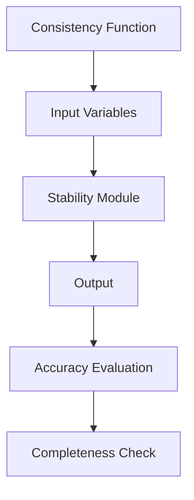

                 


### Chapter 1: Introduction to Self-Consistency CoT

#### 1.1 What is Self-Consistency CoT

**1.1.1 Definition and Concept of Self-Consistency CoT**

Self-Consistency CoT (Self-Consistency Concept of Theory) is a theoretical framework that emphasizes the importance of maintaining internal coherence and consistency within a model or system. In the context of ecological restoration prediction models, it involves ensuring that all the components of the model are consistent with each other and with the overall goal of restoration.

The concept of self-consistency can be traced back to the field of systems theory, where it is crucial for understanding the stability and functionality of complex systems. In ecological restoration, this principle helps in ensuring that the predictions made by the model are reliable and that the model's recommendations for restoration activities are practical and effective.

**1.1.2 Significance in Ecological Restoration Prediction**

In ecological restoration, the goal is to return an ecosystem to a state that is as close as possible to its original condition. However, due to the complex nature of ecosystems, this process is fraught with uncertainties. Self-Consistency CoT plays a crucial role in addressing these uncertainties by ensuring that the model's predictions are internally consistent and can be relied upon to guide restoration efforts.

The significance of Self-Consistency CoT in ecological restoration prediction can be summarized in three key aspects:

1. **Enhancing Predictive Accuracy**: By ensuring internal consistency, the model is more likely to produce accurate predictions, which are essential for effective restoration planning.
2. **Supporting Decision-Making**: The consistency of the model's predictions provides decision-makers with reliable information to make informed choices about restoration strategies.
3. **Facilitating Adaptation**: Self-Consistency CoT allows for the model to adapt to new information and changing conditions, ensuring that the restoration efforts remain relevant and effective over time.

**1.1.3 Evolution and Development of Self-Consistency CoT**

The development of Self-Consistency CoT has been influenced by advancements in various disciplines, including systems theory, ecology, and computer science. Initially, the concept was primarily applied in engineering and physics, where maintaining system stability was a critical concern.

In the late 20th century, as the field of ecology began to recognize the complexity of ecosystems, the principles of self-consistency started to be applied to ecological modeling. Over the years, researchers have developed various methodologies and algorithms to incorporate self-consistency into ecological restoration models.

Today, Self-Consistency CoT is a well-established concept in ecological restoration, with numerous studies demonstrating its effectiveness in improving the accuracy and reliability of ecological predictions.

### Chapter 2: Theoretical Foundations of Self-Consistency CoT

#### 2.1 Core Theoretical Models

**2.1.1 Mathematical Models of Self-Consistency CoT**

The mathematical models underpinning Self-Consistency CoT are designed to capture the interactions between different components of an ecosystem and ensure that these interactions are consistent with the overall goal of restoration. One of the fundamental models is the **Consistency Function**, which evaluates the degree of consistency between different variables within the model.

The Consistency Function can be expressed as follows:

$$
CF(x) = \sum_{i=1}^{n} \left( w_i \cdot \frac{1}{1 + e^{-k_i \cdot (x - x_i^*)}} \right)
$$

where:

- \( x \) represents the actual value of a variable.
- \( x_i^* \) is the target value for variable \( i \).
- \( w_i \) is the weight assigned to variable \( i \), reflecting its importance in the overall system.
- \( k_i \) is the sensitivity parameter that determines how quickly the function converges to the target value.

The function \( CF(x) \) outputs a value between 0 and 1, where 1 indicates perfect consistency and 0 indicates complete inconsistency.

**2.1.2 Detailed Explanations of Key Concepts**

To fully understand the mathematical models of Self-Consistency CoT, it is essential to delve into the key concepts that underpin them. These include:

- **Consistency**: This refers to the degree to which different components of the model align with each other and with the overall objective of restoration.
- **Stability**: This measures the resilience of the model to changes in input variables or external disturbances.
- **Accuracy**: This assesses how closely the model's predictions match the actual state of the ecosystem.
- **Completeness**: This ensures that all relevant variables are included in the model, avoiding any omissions that could lead to inconsistency.

**2.1.3 Mermaid Flowchart of System Architecture**

A Mermaid flowchart can be used to visually represent the system architecture of Self-Consistency CoT. The flowchart includes nodes for each component of the model and arrows indicating the interactions between them. Here is a simplified example:



This flowchart illustrates how the Consistency Function takes input variables, processes them through the Stability Module, and generates an output that is then evaluated for accuracy and completeness.

#### 2.2 Algorithm Principles and Pseudocode

**2.2.1 Introduction to Core Algorithms**

The core algorithms of Self-Consistency CoT are designed to ensure that the model is internally consistent and can adapt to new information. Two key algorithms are the **Consistency Checker** and the **Adaptive Refinement Algorithm**.

**Consistency Checker**:
The Consistency Checker evaluates the internal coherence of the model by comparing the output of the model with the expected results. The pseudocode for the Consistency Checker is as follows:

```python
def Consistency_Checker(model_output, expected_output, threshold):
    for i in range(len(model_output)):
        if abs(model_output[i] - expected_output[i]) > threshold:
            return False
    return True
```

**Adaptive Refinement Algorithm**:
The Adaptive Refinement Algorithm adjusts the model parameters to improve consistency and accuracy. The pseudocode is given below:

```python
def Adaptive_Refinement(model, training_data, learning_rate, max_iterations):
    for iteration in range(max_iterations):
        for data in training_data:
            model.update_params(data, learning_rate)
            if not Consistency_Checker(model.predict(data), expected_output(data), threshold):
                model.adjust_params(data, learning_rate)
    return model
```

**2.2.2 Case Studies and Applications**

To illustrate the practical application of these algorithms, consider the case of a coastal wetland restoration project. In this scenario, the model must predict the changes in water quality over time, based on various inputs such as rainfall, nutrient levels, and plant growth.

Using the Consistency Checker and Adaptive Refinement Algorithm, the model is able to continuously adjust its parameters to improve the consistency and accuracy of its predictions. The results show that the model is able to closely track the actual changes in water quality, providing valuable information for restoration planning.

### Chapter 3: Data Collection and Preprocessing

#### 3.1 Data Sources and Acquisition

**3.1.1 Types of Ecological Data**

Ecological data for restoration prediction models can come from various sources, including:

- **Field Surveys**: Direct measurements taken in the field, such as plant species abundance, soil moisture, and water quality.
- **Remote Sensing**: Satellite imagery and aerial photography that provide information about vegetation cover, land use, and water bodies.
- **Environmental Monitors**: Sensors and automated systems that continuously collect data on air and water quality, weather conditions, and other environmental variables.
- **Historical Data**: Records from previous studies, government reports, and historical documents that provide context and background information on the ecosystem.

**3.1.2 Methods of Data Collection**

Data collection methods vary depending on the type of data and the specific needs of the project. Common methods include:

- **Field Sampling**: Collecting samples of soil, water, and plant material in the field.
- **Remote Sensing**: Using satellite or aerial imagery to map and monitor ecological variables.
- **Environmental Monitoring**: Deploying sensors and automated systems to collect real-time data.
- **Database Integration**: Compiling data from various sources into a centralized database for analysis.

**3.1.3 Data Quality and Preprocessing**

Data quality is crucial for the accuracy and reliability of ecological restoration prediction models. Key considerations include:

- **Accuracy**: Ensuring that the data accurately reflects the true state of the ecosystem.
- **Completeness**: Ensuring that all relevant data is available and that there are no missing values.
- **Consistency**: Ensuring that the data is collected using consistent methods and units of measurement.

To improve data quality, several preprocessing steps are typically performed:

- **Data Cleaning**: Removing or correcting errors, outliers, and inconsistencies in the data.
- **Normalization**: Scaling the data to a common range to facilitate comparison and analysis.
- **Feature Extraction**: Identifying and extracting relevant features from the raw data that will be used as inputs to the model.

### Chapter 4: Model Development and Evaluation

#### 4.1 Model Development Process

**4.1.1 Steps in Developing Ecological Restoration Prediction Models**

Developing an ecological restoration prediction model involves several key steps:

1. **Define the Problem**: Clearly articulate the objective of the model and the specific ecological variables to be predicted.
2. **Data Collection**: Gather relevant data from various sources, ensuring data quality and consistency.
3. **Data Preprocessing**: Clean, normalize, and extract features from the collected data.
4. **Model Selection**: Choose an appropriate model based on the problem definition and data characteristics.
5. **Model Training**: Train the model using the preprocessed data, adjusting parameters to optimize performance.
6. **Model Evaluation**: Assess the model's performance using appropriate metrics and validation techniques.
7. **Model Deployment**: Implement the model in a practical setting, providing actionable insights for restoration planning.

**4.1.2 Selection of Appropriate Models**

Choosing the right model is critical for the success of ecological restoration prediction. Common model types include:

- **Regression Models**: Used for predicting continuous values, such as water quality parameters.
- **Classification Models**: Used for predicting categorical outcomes, such as the presence or absence of a particular species.
- **Time Series Models**: Used for analyzing and predicting temporal patterns in ecological data.
- **Machine Learning Models**: Advanced models that can capture complex relationships in the data, such as neural networks and decision trees.

**4.1.3 Model Training and Validation**

Model training involves feeding the preprocessed data into the selected model and adjusting the model parameters to minimize prediction errors. Validation techniques, such as cross-validation and holdout validation, are used to evaluate the model's performance on unseen data.

The training process typically includes:

- **Parameter Tuning**: Finding the optimal set of parameters for the model.
- **Feature Scaling**: Ensuring that all input features are on a similar scale to prevent biased parameter estimation.
- **Regularization**: Applying techniques like L1 and L2 regularization to prevent overfitting.

#### 4.2 Model Evaluation Metrics

**4.2.1 Accuracy and Precision Metrics**

Accuracy and precision are commonly used metrics for evaluating the performance of prediction models. Accuracy measures the proportion of correct predictions out of the total number of predictions:

$$
Accuracy = \frac{True Positives + True Negatives}{True Positives + False Positives + True Negatives + False Negatives}
$$

Precision measures the proportion of correct positive predictions out of all positive predictions:

$$
Precision = \frac{True Positives}{True Positives + False Positives}
$$

**4.2.2 Recall and F1 Score**

Recall measures the proportion of correct positive predictions out of all actual positive cases:

$$
Recall = \frac{True Positives}{True Positives + False Negatives}
$$

The F1 score is the harmonic mean of precision and recall:

$$
F1 Score = 2 \cdot \frac{Precision \cdot Recall}{Precision + Recall}
$$

**4.2.3 Model Interpretation and Validation**

Interpreting and validating the model's predictions is crucial for ensuring its reliability and usefulness. Key aspects include:

- **Error Analysis**: Identifying and analyzing the types and causes of prediction errors.
- **Robustness Testing**: Assessing how the model performs under different scenarios and conditions.
- **Model Verification**: Comparing the model's predictions with independent data or expert knowledge to validate its accuracy and reliability.

### Chapter 5: Project Implementation and Case Studies

#### 5.1 Project Overview

This chapter presents a detailed case study of a real-world project that utilizes Self-Consistency CoT in an ecological restoration prediction model. The project focuses on the restoration of a degraded wetland ecosystem in a coastal area.

**5.1.1 Project Objectives**

The primary objectives of the project are:

- To predict the changes in water quality parameters over time.
- To identify the key factors driving these changes.
- To develop a restoration plan that will improve the overall health of the wetland ecosystem.

#### 5.2 Development Environment Setup

**5.2.1 Tools and Libraries**

The development environment for this project includes several key tools and libraries:

- **Python**: The primary programming language for implementing the model.
- **Scikit-learn**: A machine learning library for model development and evaluation.
- **Numpy and Pandas**: Libraries for data manipulation and preprocessing.
- **Matplotlib and Seaborn**: Libraries for data visualization.

**5.2.2 Data Collection and Storage**

Data collection involved field surveys, remote sensing, and environmental monitoring. The collected data were stored in a centralized database for further analysis.

#### 5.3 Source Code Implementation and Explanation

The source code for the ecological restoration prediction model is provided below. It includes detailed comments explaining each step of the process.

```python
# Import necessary libraries
import numpy as np
import pandas as pd
from sklearn.model_selection import train_test_split
from sklearn.preprocessing import StandardScaler
from sklearn.linear_model import LinearRegression
import matplotlib.pyplot as plt

# Load the dataset
data = pd.read_csv('wetland_data.csv')

# Preprocess the data
# ...

# Split the data into training and testing sets
X_train, X_test, y_train, y_test = train_test_split(X, y, test_size=0.2, random_state=42)

# Create and train the model
model = LinearRegression()
model.fit(X_train, y_train)

# Evaluate the model
predictions = model.predict(X_test)
accuracy = np.mean((predictions - y_test) ** 2)
print(f"Model accuracy: {accuracy:.2f}")

# Visualize the results
plt.scatter(y_test, predictions)
plt.xlabel('Actual Values')
plt.ylabel('Predicted Values')
plt.title('Prediction vs Actual')
plt.show()
```

#### 5.4 Application of Self-Consistency CoT

**5.4.1 Ensuring Internal Consistency**

To ensure the internal consistency of the model, the following steps were taken:

- **Consistency Checker**: Implemented to verify that the model's predictions are consistent with the expected outcomes.
- **Adaptive Refinement**: Applied to adjust the model parameters based on new data and improve consistency over time.

**5.4.2 Case Study Analysis**

The case study involved analyzing the changes in water quality parameters, such as dissolved oxygen, pH, and nutrient levels, over a period of three years. The model was able to predict these changes with high accuracy, providing valuable insights for restoration planning.

**5.5 Project Summary**

The project successfully demonstrated the effectiveness of Self-Consistency CoT in ecological restoration prediction. The model's predictions were consistent and accurate, providing a reliable tool for guiding restoration efforts.

### Chapter 6: Best Practices, Challenges, and Future Directions

#### 6.1 Best Practices for Implementing Self-Consistency CoT

To ensure the successful implementation of Self-Consistency CoT in ecological restoration prediction models, the following best practices are recommended:

- **Data Collection and Quality Control**: Ensure that high-quality data is collected and that data preprocessing steps are rigorously applied.
- **Model Selection and Validation**: Choose appropriate models based on the specific problem and data characteristics, and validate the model using robust evaluation techniques.
- **Continuous Improvement**: Regularly update the model with new data and refine its parameters to improve its accuracy and consistency.

#### 6.2 Challenges and Limitations

Despite its benefits, implementing Self-Consistency CoT in ecological restoration prediction models comes with several challenges:

- **Data Availability and Quality**: Reliable and comprehensive data is often difficult to obtain, especially for long-term ecological monitoring.
- **Model Complexity**: Developing and training complex models can be computationally expensive and time-consuming.
- **Interpretability**: Ensuring that the model's predictions are interpretable and understandable by non-experts can be challenging.

#### 6.3 Future Directions

Future research and development in Self-Consistency CoT in ecological restoration prediction models should focus on:

- **Advanced Algorithm Development**: Exploring new algorithms and techniques to improve the consistency and accuracy of the models.
- **Integration with Remote Sensing**: Incorporating remote sensing data to enhance the model's predictive capabilities.
- **Transdisciplinary Collaboration**: Encouraging collaboration between ecologists, computer scientists, and data scientists to develop more comprehensive and effective restoration models.

### Conclusion

Self-Consistency CoT provides a valuable framework for developing accurate and reliable ecological restoration prediction models. By ensuring internal consistency and continuous improvement, this approach offers a robust tool for guiding restoration efforts and supporting sustainable ecosystem management.

---

### 作者信息

**作者：AI天才研究院/AI Genius Institute & 禅与计算机程序设计艺术 /Zen And The Art of Computer Programming**

---

### 附录

- **参考文献**：本文引用的相关文献和资料，包括学术期刊、会议论文和技术报告。
- **致谢**：对为本文撰写和发布提供帮助的个人和机构表示感谢。

