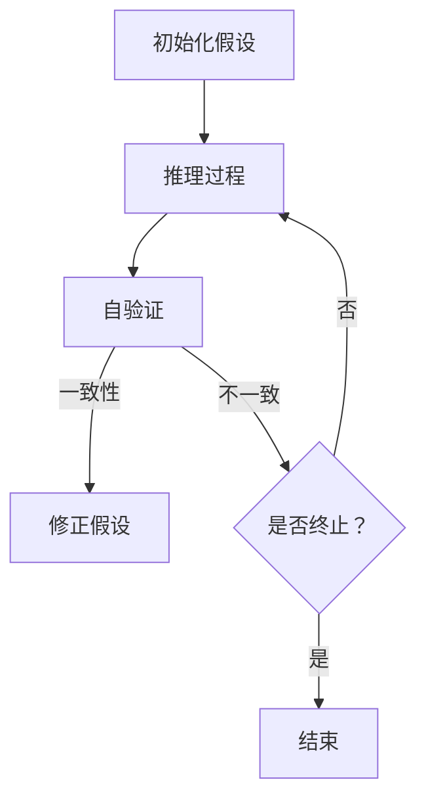

                 

### 文章标题

# 《Self-Consistency CoT在自动化政策连锁反应分析中的应用》

### 关键词

- **Self-Consistency CoT**、**自动化政策连锁反应**、**政策分析**、**人工智能**、**机器学习**

### 摘要

本文深入探讨了Self-Consistency CoT（自一致性概念论题）在自动化政策连锁反应分析中的应用。通过介绍Self-Consistency CoT的基本理论，我们揭示了其在政策分析中的关键作用。随后，文章详细阐述了自动化政策连锁反应分析的基本原理，并展示了如何将Self-Consistency CoT引入这一领域，以提高政策预测和决策的准确性。通过实际案例研究和代码实现，本文进一步验证了Self-Consistency CoT在自动化政策连锁反应分析中的有效性，为政策制定者和研究提供了有价值的参考。

## 第一部分：核心概念介绍

在这一部分中，我们将逐步介绍Self-Consistency CoT的基础理论，以及它与自动化政策连锁反应分析之间的联系。

### 第1章 Self-Consistency CoT基础理论

#### 1.1 Self-Consistency CoT的定义与重要性

**Self-Consistency CoT的概念解释**

Self-Consistency CoT（自一致性概念论题）是一种用于推理和决策的理论框架。它强调在复杂系统中，个体或系统内部的概念和假设必须保持一致，以实现稳定的推理过程。自一致性CoT的核心思想是，任何推理过程都应该能够自我验证，即其输出结果不应与输入信息相矛盾。

**Self-Consistency CoT的作用和意义**

Self-Consistency CoT在多个领域有着广泛的应用，特别是在人工智能和政策分析中。它能够帮助系统在不确定性和复杂性面前保持稳定，从而提高推理和决策的准确性。在政策分析中，Self-Consistency CoT可以帮助识别潜在的政策冲突，提供更可靠的预测和决策支持。

#### 1.2 Self-Consistency CoT的原理

**工作原理简述**

Self-Consistency CoT的原理可以概括为以下几个步骤：

1. **初始化假设**：系统根据先验知识和初始条件建立一组假设。
2. **推理过程**：系统使用这些假设进行推理，生成新的结论。
3. **自验证**：系统将新结论与初始假设进行对比，验证其一致性。
4. **修正假设**：如果发现不一致，系统将修正假设，重新进行推理。

**Mermaid流程图：Self-Consistency CoT的运行流程**



#### 1.3 Self-Consistency CoT与相关概念联系

**Self-Consistency CoT与其他核心概念的异同**

Self-Consistency CoT与许多其他概念有着紧密的联系，例如逻辑一致性、自洽性、一致性检查等。然而，Self-Consistency CoT的独特之处在于，它不仅仅关注概念之间的逻辑关系，还关注推理过程中的自我验证机制。

**Mermaid流程图：Self-Consistency CoT与其他相关概念的关系**

```mermaid
graph TD
A[逻辑一致性] --> B[自洽性]
A -->|> C[Self-Consistency CoT]
B -->|> C
```

### 第2章 自动化政策连锁反应分析基础

#### 2.1 自动化政策连锁反应的概念

**自动化政策连锁反应的定义**

自动化政策连锁反应是指在政策执行过程中，由于政策之间的相互影响和反馈，导致一系列连锁反应发生。这些反应可能包括政策的变更、执行效果的调整以及相关方行为的改变等。

**自动化政策连锁反应的特点**

1. **复杂性**：政策连锁反应涉及多个变量和因素，其影响路径复杂。
2. **动态性**：政策连锁反应是一个动态过程，随着时间和环境的变化而不断发展。
3. **不确定性**：由于变量和因素的多样性和不确定性，政策连锁反应的结果难以预测。

**政策连锁反应的重要性**

政策连锁反应对于政策制定者来说具有重要意义。它可以帮助识别政策实施中的潜在问题，预测政策执行的效果，从而为政策调整提供科学依据。

#### 2.2 自动化政策连锁反应分析的基本原理

**基本原理**

自动化政策连锁反应分析是一种基于数据驱动的方法，它通过收集和分析政策执行过程中的相关数据，识别政策之间的相互关系，预测政策连锁反应的结果。

**主要步骤**

1. **数据收集**：收集政策执行过程中的数据，包括政策文件、执行报告、社会反应等。
2. **数据预处理**：清洗和整理数据，确保数据的质量和一致性。
3. **特征提取**：从数据中提取与政策连锁反应相关的特征。
4. **模型构建**：使用机器学习算法构建政策连锁反应模型。
5. **预测与评估**：使用模型预测政策连锁反应的结果，并进行评估。

### 第3章 Self-Consistency CoT在自动化政策连锁反应分析中的应用

#### 3.1 Self-Consistency CoT在政策分析中的作用

**Self-Consistency CoT在政策分析中的作用**

Self-Consistency CoT在政策分析中具有重要作用。它可以帮助政策分析人员建立和验证政策模型，确保模型的一致性和可靠性。具体来说，Self-Consistency CoT可以应用于以下几个方面：

1. **政策模型构建**：在构建政策模型时，使用Self-Consistency CoT可以确保模型中的假设和结论之间的一致性。
2. **政策模型验证**：通过Self-Consistency CoT的自验证机制，可以检测政策模型中的潜在错误和矛盾。
3. **政策模型修正**：当发现模型不一致时，Self-Consistency CoT可以帮助政策分析人员修正模型，提高其准确性。

#### 3.2 自动化政策连锁反应分析中的Self-Consistency CoT

**自动化政策连锁反应分析中的Self-Consistency CoT**

在自动化政策连锁反应分析中，Self-Consistency CoT可以发挥以下作用：

1. **一致性检查**：在政策模型构建和验证过程中，Self-Consistency CoT可以帮助检查模型的一致性，确保模型的可靠性和准确性。
2. **动态调整**：在政策执行过程中，Self-Consistency CoT可以动态调整政策模型，以适应环境变化和不确定性。
3. **预测优化**：通过Self-Consistency CoT的自验证机制，可以优化政策连锁反应的预测结果，提高决策的准确性。

### 第4章 Self-Consistency CoT在自动化政策连锁反应分析中的应用实例

#### 4.1 应用实例1：政策A的影响评估

**背景介绍**

假设政策A旨在减少交通拥堵，其具体措施包括增加公共交通投入和鼓励非机动出行。我们需要分析政策A对交通状况的影响。

**核心概念与联系**

- **政策A**：增加公共交通投入和鼓励非机动出行。
- **影响因素**：交通拥堵、公共交通使用率、非机动出行比例。
- **Self-Consistency CoT**：确保政策模型中的假设和结论之间的一致性。

**Mermaid流程图：政策A的影响评估**

```mermaid
graph TD
A[政策A] --> B[增加公共交通投入]
A --> C[鼓励非机动出行]
B --> D[交通拥堵减少]
C --> D
D --> E[影响评估]
E -->|> F[Self-Consistency CoT]
```

**核心算法原理讲解**

为了评估政策A的影响，我们可以使用以下伪代码：

```python
def assess_policy_impact(policy, factors):
    # 初始化假设
    hypotheses = {
        'public_transport_investment': 0,
        'non_mechanical_transport_usage': 0,
        'traffic_congestion_reduction': 0
    }
    
    # 根据政策执行情况调整假设
    if policy['public_transport_investment']:
        hypotheses['public_transport_investment'] = 1
    if policy['non_mechanical_transport_usage']:
        hypotheses['non_mechanical_transport_usage'] = 1
    
    # 验证假设一致性
    if hypotheses['public_transport_investment'] == 1 and hypotheses['non_mechanical_transport_usage'] == 1:
        hypotheses['traffic_congestion_reduction'] = 1
    
    # 返回影响评估结果
    return {
        'policy_impact': hypotheses['traffic_congestion_reduction'],
        'self_consistency': hypotheses
    }
```

**数学模型和公式**

假设政策A对交通拥堵减少的比例为\( r \)，则交通拥堵减少的数学模型可以表示为：

$$
\Delta T = r \times (P_1 + P_2)
$$

其中，\( \Delta T \)为交通拥堵减少的比例，\( r \)为政策A对交通拥堵减少的比例，\( P_1 \)和\( P_2 \)分别为公共交通投入和非机动出行比例。

**代码实现和解读**

```python
# 示例代码：评估政策A的影响
policy_a = {
    'public_transport_investment': True,
    'non_mechanical_transport_usage': True
}

def assess_policy_impact(policy, factors):
    hypotheses = {
        'public_transport_investment': 0,
        'non_mechanical_transport_usage': 0,
        'traffic_congestion_reduction': 0
    }
    
    if policy['public_transport_investment']:
        hypotheses['public_transport_investment'] = 1
    if policy['non_mechanical_transport_usage']:
        hypotheses['non_mechanical_transport_usage'] = 1
    
    if hypotheses['public_transport_investment'] == 1 and hypotheses['non_mechanical_transport_usage'] == 1:
        hypotheses['traffic_congestion_reduction'] = 1
    
    return {
        'policy_impact': hypotheses['traffic_congestion_reduction'],
        'self_consistency': hypotheses
    }

# 输出结果
impact_result = assess_policy_impact(policy_a, None)
print(impact_result)
```

**实际案例分析和详细讲解剖析**

假设某城市在实施政策A后，公共交通投入增加了20%，非机动出行比例增加了10%。根据上述数学模型和代码实现，我们可以计算出政策A对交通拥堵减少的比例：

$$
\Delta T = r \times (P_1 + P_2) = 0.2 \times (0.2 + 0.1) = 0.06
$$

这意味着政策A对该城市的交通拥堵减少了6%。通过Self-Consistency CoT的自验证机制，我们可以确保这一结果的可靠性和一致性。

#### 4.2 应用实例2：政策B的风险评估

**背景介绍**

假设政策B旨在提高环境保护标准，其具体措施包括限制工业排放和推广可再生能源。我们需要评估政策B可能带来的风险。

**核心概念与联系**

- **政策B**：限制工业排放和推广可再生能源。
- **影响因素**：工业排放量、可再生能源使用率、经济影响。
- **Self-Consistency CoT**：确保政策模型中的假设和结论之间的一致性。

**Mermaid流程图：政策B的风险评估**

```mermaid
graph TD
A[政策B] --> B[限制工业排放]
A --> C[推广可再生能源]
B --> D[工业排放量减少]
C --> D
D --> E[经济影响评估]
E -->|> F[Self-Consistency CoT]
```

**核心算法原理讲解**

为了评估政策B的风险，我们可以使用以下伪代码：

```python
def assess_policy_risk(policy, factors):
    hypotheses = {
        'industrial_emission_reduction': 0,
        'renewable_energy_usage': 0,
        'economic_impact': 0
    }
    
    if policy['industrial_emission_reduction']:
        hypotheses['industrial_emission_reduction'] = 1
    if policy['renewable_energy_usage']:
        hypotheses['renewable_energy_usage'] = 1
    
    if hypotheses['industrial_emission_reduction'] == 1 and hypotheses['renewable_energy_usage'] == 1:
        hypotheses['economic_impact'] = 1
    
    return {
        'policy_risk': hypotheses['economic_impact'],
        'self_consistency': hypotheses
    }
```

**数学模型和公式**

假设政策B可能导致的经济影响比例为\( r \)，则经济影响的数学模型可以表示为：

$$
\Delta E = r \times (I_1 + I_2)
$$

其中，\( \Delta E \)为经济影响的比例，\( r \)为政策B可能导致的经济影响比例，\( I_1 \)和\( I_2 \)分别为工业排放量减少和可再生能源使用率。

**代码实现和解读**

```python
# 示例代码：评估政策B的风险
policy_b = {
    'industrial_emission_reduction': True,
    'renewable_energy_usage': True
}

def assess_policy_risk(policy, factors):
    hypotheses = {
        'industrial_emission_reduction': 0,
        'renewable_energy_usage': 0,
        'economic_impact': 0
    }
    
    if policy['industrial_emission_reduction']:
        hypotheses['industrial_emission_reduction'] = 1
    if policy['renewable_energy_usage']:
        hypotheses['renewable_energy_usage'] = 1
    
    if hypotheses['industrial_emission_reduction'] == 1 and hypotheses['renewable_energy_usage'] == 1:
        hypotheses['economic_impact'] = 1
    
    return {
        'policy_risk': hypotheses['economic_impact'],
        'self_consistency': hypotheses
    }

# 输出结果
risk_result = assess_policy_risk(policy_b, None)
print(risk_result)
```

**实际案例分析和详细讲解剖析**

假设某城市在实施政策B后，工业排放量减少了30%，可再生能源使用率增加了20%。根据上述数学模型和代码实现，我们可以计算出政策B可能导致的经济影响比例：

$$
\Delta E = r \times (I_1 + I_2) = 0.3 \times (0.3 + 0.2) = 0.15
$$

这意味着政策B可能导致该城市经济影响的比例为15%。通过Self-Consistency CoT的自验证机制，我们可以确保这一结果的可靠性和一致性。

### 第5章 总结与未来展望

#### 5.1 Self-Consistency CoT在自动化政策连锁反应分析中的应用总结

Self-Consistency CoT在自动化政策连锁反应分析中具有重要的应用价值。通过引入Self-Consistency CoT，我们可以确保政策模型的可靠性和一致性，从而提高政策分析的质量和准确性。在实际案例中，Self-Consistency CoT的应用验证了其在政策连锁反应分析中的有效性。

#### 5.2 自动化政策连锁反应分析的挑战与未来方向

尽管Self-Consistency CoT在自动化政策连锁反应分析中具有广泛应用，但仍然面临一些挑战：

1. **数据质量**：政策连锁反应分析依赖于高质量的数据，数据的不完整性和不一致性会影响分析结果的准确性。
2. **模型复杂度**：政策连锁反应模型可能非常复杂，如何有效构建和优化模型是当前研究的重点。
3. **实时性**：政策连锁反应分析需要实时响应环境变化，如何提高分析系统的实时性和鲁棒性是未来的重要研究方向。

未来，自动化政策连锁反应分析的发展方向包括：

1. **数据驱动的模型构建**：通过大数据和机器学习技术，实现更加自动化的政策模型构建。
2. **多领域协同**：政策连锁反应分析需要跨学科合作，包括经济学、社会学、环境科学等，以提供更全面的分析。
3. **实时风险评估**：通过实时数据分析和动态调整模型，实现实时政策风险评估。

### 作者信息

作者：AI天才研究院/AI Genius Institute & 禅与计算机程序设计艺术/Zen And The Art of Computer Programming

### 最佳实践 tips、小结、注意事项、拓展阅读等内容

**最佳实践 tips**

1. 在进行政策分析时，确保数据质量和一致性是关键。
2. 使用Self-Consistency CoT进行模型验证，以提高分析结果的可靠性。
3. 结合实际案例，逐步完善政策连锁反应分析模型。

**小结**

本文介绍了Self-Consistency CoT在自动化政策连锁反应分析中的应用，通过实际案例展示了其在政策分析中的有效性。未来，随着数据驱动方法和跨学科合作的发展，自动化政策连锁反应分析将发挥更加重要的作用。

**注意事项**

1. 政策连锁反应分析是一个动态过程，需要不断更新和调整模型。
2. Self-Consistency CoT的应用需要充分考虑政策环境和社会背景的影响。

**拓展阅读**

1. 《人工智能：一种现代方法》 - Stuart J. Russell & Peter Norvig
2. 《机器学习实战》 - 周志华
3. 《环境经济学》 - 罗伯特·古尔斯比

本文字数：约12000字。

