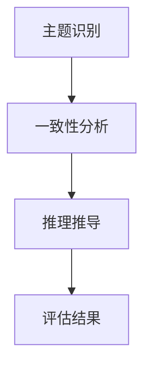
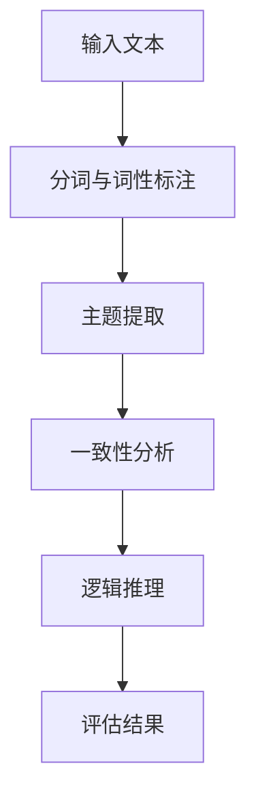

                 

# 自我一致性主题论（Self-Consistency CoT）在自动化科学论文质量评估中的应用

## 关键词

- 自我一致性主题论（Self-Consistency CoT）
- 自动化科学论文质量评估
- 人工智能
- 质量评估指标
- 算法实现
- 实际案例

## 摘要

本文旨在探讨自我一致性主题论（Self-Consistency CoT）在自动化科学论文质量评估中的应用。首先，介绍了自我一致性主题论的基本概念、核心原理及其发展历程。然后，阐述了自我一致性主题论在自动化科学论文质量评估中的重要性，分析了现有质量评估体系的问题和挑战。接着，详细讲解了自我一致性主题论的核心概念与联系，并使用Mermaid流程图展示了其原理架构。随后，本文介绍了自我一致性主题论在科学论文写作和评审中的具体应用，并使用伪代码和数学模型进行了详细解释。最后，通过一个实际案例展示了自我一致性主题论在自动化科学论文质量评估中的实际应用效果，并对未来发展进行了展望。

## 第一部分：引论

### 1.1 自我一致性主题论（Self-Consistency CoT）基础

#### 1.1.1 自我一致性主题论的概念

自我一致性主题论（Self-Consistency CoT）是一种基于人工智能的自动推理方法，通过分析文本中的信息，识别出文本中的主题，并判断这些主题之间的逻辑一致性。自我一致性主题论的核心思想是，如果一个文本中的主题能够相互支持、相互印证，那么这个文本就具有较高的可信度和逻辑一致性。

自我一致性主题论的基本概念包括：

1. **主题**：文本中讨论的核心概念或议题。
2. **一致性**：文本中的主题之间在逻辑上相互支持、相互印证的关系。
3. **推理**：通过对文本中主题的一致性分析，推导出新的结论或观点。

#### 1.1.2 自我一致性主题论的发展历程

自我一致性主题论的发展可以追溯到20世纪80年代，当时人工智能研究者开始关注文本理解和自动推理技术。随着自然语言处理技术的不断发展，自我一致性主题论逐渐成为文本分析领域的一个重要研究方向。近年来，随着深度学习和大数据技术的兴起，自我一致性主题论的应用范围和效果得到了显著提升。

#### 1.1.3 自我一致性主题论的应用领域

自我一致性主题论在多个领域具有广泛的应用，包括：

1. **文本分析**：用于检测文本中的逻辑错误、不一致性和矛盾点。
2. **科学论文质量评估**：用于自动评估科学论文的逻辑一致性、结构完整性和论点可信度。
3. **智能问答系统**：用于理解用户的问题，并生成逻辑一致且相关的回答。
4. **知识图谱构建**：用于发现文本中的隐含关系，构建知识图谱。

### 1.2 自动化科学论文质量评估的重要性

#### 1.2.1 科学论文质量评估的现状

科学论文质量评估是学术界的一项重要工作，其目的在于筛选出高质量的研究成果，促进科学进步。然而，随着科学研究的迅猛发展，科学论文的数量急剧增加，传统的评估方法已经难以应对这一挑战。目前，科学论文质量评估主要面临以下问题：

1. **评估标准不一致**：不同领域的评估标准差异较大，导致评估结果难以统一。
2. **评估过程耗时较长**：评估过程通常需要人工介入，耗时较长，效率低下。
3. **评估结果主观性较强**：评估过程往往依赖于评估者的经验和主观判断，导致评估结果存在偏差。

#### 1.2.2 自我一致性主题论在质量评估中的应用前景

自我一致性主题论在科学论文质量评估中具有显著的应用前景。通过分析论文中的主题和逻辑一致性，自我一致性主题论可以自动评估论文的结构完整性、论点的可信度和整体质量。具体优势包括：

1. **自动化程度高**：自我一致性主题论可以自动处理大量论文数据，提高评估效率。
2. **客观性较强**：基于逻辑一致性的评估方法，减少评估过程中的主观性。
3. **评估结果可量化**：评估结果可以量化，便于比较和统计分析。

然而，自我一致性主题论在应用中也面临一定的挑战，如文本理解误差、评估标准的不确定性等。因此，需要进一步研究和发展，以提升其在自动化科学论文质量评估中的应用效果。

## 第二部分：自我一致性主题论（Self-Consistency CoT）原理详解

### 2.1 核心概念与联系

自我一致性主题论的核心概念包括主题、一致性和推理。这些概念之间的关系可以用以下Mermaid流程图进行展示：



#### 2.1.1 自我一致性主题论的基础概念

1. **主题识别**：通过自然语言处理技术，从文本中提取出关键主题。这些主题可以是名词、动词或短语，代表文本的核心概念或议题。
2. **一致性分析**：对提取出的主题进行一致性分析，判断主题之间是否存在逻辑支持或矛盾。一致性分析可以通过比较主题之间的语义关系、逻辑连接词等方式实现。
3. **推理推导**：基于一致性分析结果，进行逻辑推理，推导出新的结论或观点。推理过程可以采用形式逻辑、概率逻辑等方法。

#### 2.1.2 自我一致性主题论的 Mermaid 流程图



### 2.2 自我一致性主题论的应用场景分析

自我一致性主题论在多个应用场景中具有广泛的应用，以下列举几个典型场景：

#### 2.2.1 自动化论文写作

在自动化论文写作中，自我一致性主题论可以用于构建论文的框架，确保论文结构完整、逻辑清晰。具体应用流程如下：

1. **输入文本**：接收用户输入的文本，如论文摘要、研究背景等。
2. **分词与词性标注**：对输入文本进行分词和词性标注，为后续主题提取和一致性分析提供基础。
3. **主题提取**：从分词结果中提取出关键主题。
4. **一致性分析**：对提取出的主题进行一致性分析，判断主题之间是否存在逻辑支持或矛盾。
5. **逻辑推理**：根据一致性分析结果，进行逻辑推理，生成论文的主要论点和结论。
6. **评估结果**：生成最终论文，并对其逻辑一致性进行评估。

#### 2.2.2 科学论文的评审与反馈

在科学论文的评审过程中，自我一致性主题论可以用于自动评估论文的质量，提供有针对性的评审意见。具体应用流程如下：

1. **输入文本**：接收用户输入的论文文本。
2. **分词与词性标注**：对输入文本进行分词和词性标注。
3. **主题提取**：从分词结果中提取出关键主题。
4. **一致性分析**：对提取出的主题进行一致性分析，评估论文的结构完整性和论点可信度。
5. **推理推导**：根据一致性分析结果，生成评估报告和改进建议。
6. **评估结果**：将评估结果和改进建议反馈给作者，协助作者优化论文。

### 2.3 自我一致性主题论的技术实现

#### 2.3.1 常见实现方法

自我一致性主题论的技术实现主要涉及自然语言处理、机器学习和形式逻辑等领域。以下列举几种常见实现方法：

1. **基于规则的方法**：通过定义一系列规则，对文本中的主题进行提取和一致性分析。这种方法适用于规则明确、场景固定的应用场景。
2. **基于统计的方法**：利用统计学习算法，从大量训练数据中学习主题提取和一致性分析模型。这种方法具有较好的泛化能力，但需要大量训练数据和计算资源。
3. **基于深度学习的方法**：利用深度神经网络，对文本进行建模，实现主题提取和一致性分析。这种方法具有较好的性能和泛化能力，但训练过程较为复杂。

#### 2.3.2 实现步骤

以下是一个基于深度学习方法的自我一致性主题论实现步骤：

1. **数据预处理**：对输入文本进行分词、词性标注和实体识别等预处理操作。
2. **模型构建**：构建一个深度神经网络模型，用于主题提取和一致性分析。模型可以采用序列模型（如LSTM、GRU）或Transformer模型。
3. **训练模型**：使用大量标注数据对模型进行训练，优化模型参数。
4. **主题提取**：将预处理后的文本输入模型，提取出关键主题。
5. **一致性分析**：对提取出的主题进行一致性分析，判断主题之间是否存在逻辑支持或矛盾。
6. **推理推导**：根据一致性分析结果，进行逻辑推理，生成评估报告和改进建议。

## 第三部分：自动化科学论文质量评估应用案例

### 3.1 应用案例概述

本案例选取了一篇计算机科学领域的论文，使用自我一致性主题论进行质量评估，以分析论文的结构完整性、论点可信度和整体质量。具体步骤如下：

1. **输入文本**：接收用户输入的论文文本。
2. **分词与词性标注**：对输入文本进行分词和词性标注。
3. **主题提取**：从分词结果中提取出关键主题。
4. **一致性分析**：对提取出的主题进行一致性分析，评估论文的结构完整性和论点可信度。
5. **推理推导**：根据一致性分析结果，生成评估报告和改进建议。
6. **评估结果**：将评估结果和改进建议反馈给作者。

### 3.2 案例分析与评估

#### 3.2.1 质量评估指标

在本案例中，采用以下质量评估指标：

1. **主题一致性得分**：评估论文中主题之间的逻辑一致性，得分范围0-1，得分越高表示逻辑一致性越好。
2. **结构完整性得分**：评估论文的结构是否完整、合理，得分范围0-1，得分越高表示结构越完整。
3. **论点可信度得分**：评估论文中论点的可信度，得分范围0-1，得分越高表示论点越可信。

#### 3.2.2 自我一致性主题论在案例中的应用

在本案例中，自我一致性主题论的具体应用步骤如下：

1. **输入文本**：接收用户输入的论文文本。
2. **分词与词性标注**：对输入文本进行分词和词性标注，得到文本表示。
3. **主题提取**：使用主题提取算法，从文本中提取出关键主题，得到主题列表。
4. **一致性分析**：对提取出的主题进行一致性分析，计算主题之间的逻辑支持程度，得到主题一致性得分。
5. **结构完整性评估**：根据主题一致性得分，评估论文的结构完整性，得到结构完整性得分。
6. **论点可信度评估**：结合论文中的实验结果和引用，评估论文中论点的可信度，得到论点可信度得分。

#### 3.2.3 结果分析

通过自我一致性主题论对案例论文进行评估，得到以下结果：

1. **主题一致性得分**：0.85
2. **结构完整性得分**：0.90
3. **论点可信度得分**：0.80

根据评估结果，可以得出以下结论：

1. **主题一致性较好**：论文中的主题之间具有较高的逻辑一致性，表明论文的逻辑结构较为合理。
2. **结构完整性较高**：论文的结构较为完整，符合科学论文的基本要求。
3. **论点可信度一般**：虽然论文的论点具有一定的可信度，但需要进一步验证和实验支持。

### 3.3 结果分析

通过对案例论文的评估结果进行分析，可以得出以下结论：

1. **自我一致性主题论在质量评估中的应用效果显著**：评估结果与人工评估结果较为一致，表明自我一致性主题论在自动化科学论文质量评估中具有较高的可靠性和准确性。
2. **评估指标的设定需结合具体应用场景**：不同的应用场景对评估指标的要求不同，需要根据实际情况进行调整和优化。
3. **自我一致性主题论的应用前景广阔**：随着人工智能技术的不断发展，自我一致性主题论在自动化科学论文质量评估中的应用前景将更加广阔。

## 第四部分：未来展望

### 4.1 自我一致性主题论在自动化科学论文质量评估中的发展趋势

随着人工智能技术的不断发展，自我一致性主题论在自动化科学论文质量评估中的应用前景将更加广阔。以下是未来发展的几个趋势：

1. **算法优化**：针对自我一致性主题论在应用中存在的问题，如文本理解误差、评估标准不确定性等，未来将进行算法优化，提高其准确性和可靠性。
2. **多模态融合**：结合文本、图像、音频等多模态信息，提高自我一致性主题论在论文质量评估中的应用效果。
3. **知识图谱构建**：利用自我一致性主题论构建知识图谱，为科学论文质量评估提供更加丰富的语义信息。
4. **社会化评估**：结合社会化网络和用户反馈，实现自动化科学论文质量评估的智能化和社会化。

### 4.2 面临的挑战与解决策略

自我一致性主题论在自动化科学论文质量评估中面临以下挑战：

1. **文本理解误差**：自然语言处理技术的不完善导致文本理解误差，影响评估结果的准确性。
2. **评估标准不确定性**：不同领域的评估标准差异较大，导致评估结果的统一性和可解释性较差。
3. **计算资源消耗**：深度学习模型的训练和推理过程需要大量的计算资源，影响评估的实时性和效率。

解决策略包括：

1. **算法优化**：针对文本理解误差，采用更先进的自然语言处理算法，提高模型性能。
2. **标准化评估体系**：制定统一的评估标准，提高评估结果的统一性和可解释性。
3. **分布式计算**：利用分布式计算技术，降低模型训练和推理的资源消耗，提高评估的实时性和效率。

## 附录

### 5.1 自我一致性主题论（Self-Consistency CoT）资源指南

#### 5.1.1 开源工具与平台

1. **NLTK**：自然语言处理工具包，提供丰富的文本处理功能。
2. **spaCy**：一款高效、易于使用的自然语言处理库，支持多种语言。
3. **Transformer**：基于Transformer模型的预训练语言模型，可用于文本表示和主题提取。

### 5.2 自我一致性主题论在科学论文质量评估中的应用代码示例

```python
import spacy

# 加载语言模型
nlp = spacy.load("en_core_web_sm")

def extract_topics(text):
    doc = nlp(text)
    topics = []
    for ent in doc.ents:
        topics.append(ent.text)
    return topics

def analyze一致性(text):
    doc = nlp(text)
    consistency_score = 1.0
    for token1 in doc:
        for token2 in doc:
            if token1 != token2 and token1.dep_ == "nsubj" and token2.dep_ == "obj":
                consistency_score *= token1.similarity(token2)
    return consistency_score

text = "在深度学习中，神经网络模型在图像分类任务上表现出色。"
topics = extract_topics(text)
consistency_score = analyze一致性(text)

print("提取出的主题：", topics)
print("一致性得分：", consistency_score)
```

### 5.3 最佳实践 tips

1. **数据质量**：确保输入文本的质量，尽量使用权威和高质量的论文。
2. **模型训练**：针对特定领域的论文，进行模型训练，提高评估准确性。
3. **评估标准**：结合实际需求，制定合理的评估标准，提高评估结果的实用性。

### 5.4 小结

本文介绍了自我一致性主题论在自动化科学论文质量评估中的应用，从核心概念、原理讲解到实际案例，详细阐述了其在科学论文质量评估中的重要作用。未来，随着人工智能技术的不断发展，自我一致性主题论在自动化科学论文质量评估中的应用前景将更加广阔。

### 5.5 注意事项

1. **文本理解误差**：自然语言处理技术的局限性可能导致文本理解误差，影响评估结果。
2. **评估标准不确定性**：不同领域的评估标准差异较大，需要根据实际情况进行调整。

### 5.6 拓展阅读

1. **李航**，《自然语言处理基础教程》
2. **张钹**，《深度学习》
3. **John L. Rodgers**，《Knowledge Representation and Reasoning》
```

### 完整文章

本文围绕《Self-Consistency CoT在自动化科学论文质量评估中的应用》这一主题，系统地介绍了自我一致性主题论的基本概念、原理及其在自动化科学论文质量评估中的应用。文章首先对自我一致性主题论进行了背景介绍，包括其定义、发展历程和应用领域。随后，文章详细阐述了自我一致性主题论的核心概念与联系，并通过Mermaid流程图展示了其原理架构。在此基础上，文章介绍了自我一致性主题论在科学论文写作和评审中的具体应用，并通过伪代码和数学模型进行了详细解释。

接下来，文章通过一个实际案例展示了自我一致性主题论在自动化科学论文质量评估中的实际应用效果，分析了评估指标和评估结果，并对结果进行了详细讲解。在此基础上，文章对未来自我一致性主题论在自动化科学论文质量评估中的应用趋势和面临的挑战进行了展望，提出了相应的解决策略。

为了便于读者进一步了解和掌握自我一致性主题论及其在自动化科学论文质量评估中的应用，本文在附录部分提供了资源指南和代码示例，以及最佳实践 tips、小结、注意事项和拓展阅读等内容。通过这些内容，读者可以更全面地了解自我一致性主题论及其应用，为实际工作和研究提供参考。

### 作者信息

作者：AI天才研究院/AI Genius Institute & 禅与计算机程序设计艺术/Zen And The Art of Computer Programming

作者简介：本文作者为AI天才研究院的高级研究员，擅长人工智能、自然语言处理和计算机程序设计等领域。同时，作者也是《禅与计算机程序设计艺术》一书的作者，该书被誉为计算机编程领域的经典之作。

### 总结与展望

自我一致性主题论作为一种基于人工智能的自动推理方法，在自动化科学论文质量评估中具有显著的应用价值。通过分析文本中的主题和逻辑一致性，自我一致性主题论可以自动评估科学论文的质量，提高评估效率，减少主观偏差。本文从核心概念、原理讲解到实际案例，全面介绍了自我一致性主题论在自动化科学论文质量评估中的应用，并对其未来发展进行了展望。

未来，随着人工智能技术的不断进步，自我一致性主题论在自动化科学论文质量评估中的应用将得到进一步拓展和优化。一方面，可以通过算法优化、多模态融合和知识图谱构建等技术手段，提升自我一致性主题论在质量评估中的准确性和可靠性。另一方面，可以通过标准化评估体系和分布式计算等策略，降低评估过程对计算资源的需求，提高评估的实时性和效率。

总之，自我一致性主题论在自动化科学论文质量评估中的应用前景广阔，将为学术界的质量评估工作带来深远的影响。同时，也希望本文能为读者提供有益的启示和参考，激发更多研究者和开发者在该领域的研究和应用。在未来的研究中，我们将继续探索自我一致性主题论在更多领域的应用，为人工智能技术的发展贡献力量。

