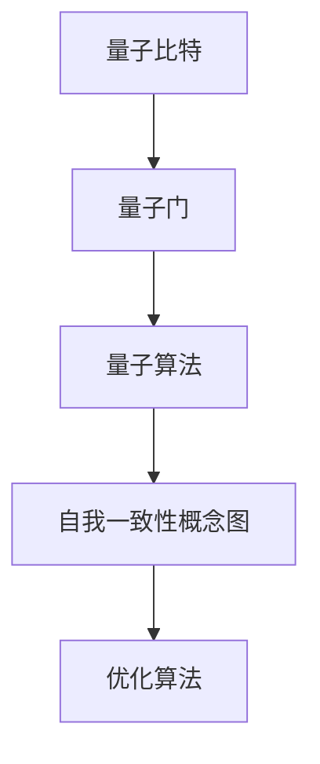
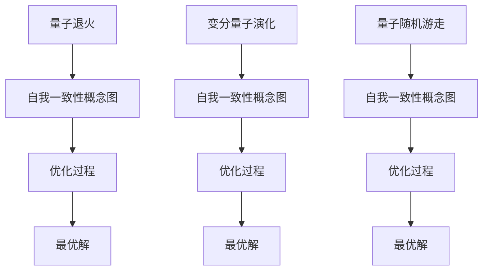

                 

# 自我一致性概念图（Self-Consistency CoT）在量子计算优化算法中的应用

## 关键词
- 自我一致性概念图（Self-Consistency CoT）
- 量子计算
- 优化算法
- 数学模型
- 项目实战

## 摘要
本文旨在探讨自我一致性概念图（Self-Consistency CoT）在量子计算优化算法中的应用。首先，我们将简要介绍量子计算的背景和挑战，以及自我一致性概念图的定义和原理。接着，本文将详细讲解自我一致性概念图在量子优化算法中的核心算法原理，包括量子退火、变分量子演化和量子随机游走。随后，我们将通过数学模型和数学公式详细阐述这些算法的数学原理，并使用伪代码进行具体实现。最后，本文将通过一个实际案例，展示如何使用自我一致性概念图进行量子计算优化算法的开发，并提供最佳实践和项目小结。

## 1. 引言

### 1.1 量子计算的背景与挑战

量子计算是一种利用量子力学原理进行信息处理的新型计算模式。与传统的经典计算相比，量子计算具有并行性、叠加性和量子纠缠等独特优势，这使得它能够在某些复杂问题求解方面超越经典计算。然而，量子计算也面临着一系列挑战，如量子比特的噪声、错误率和退相干问题等。

### 1.2 自我一致性概念图（Self-Consistency CoT）概述

自我一致性概念图（Self-Consistency CoT）是一种基于图论和概率论的概念模型，用于描述系统内部各元素之间的相互作用和一致性。在量子计算中，自我一致性概念图可以用于描述量子系统内部各量子比特之间的关联，从而实现量子优化算法。

### 1.3 书籍结构概述

本文将分为七个章节。第1章为引言，介绍量子计算的背景和挑战，以及自我一致性概念图的概述。第2章和第3章将分别介绍量子计算的基础知识、自我一致性概念图的定义和原理。第4章将讲解量子优化算法的核心算法原理，包括量子退火、变分量子演化和量子随机游走。第5章将介绍量子优化算法的数学模型和数学公式。第6章将通过一个实际案例展示如何使用自我一致性概念图进行量子优化算法的开发。第7章将总结本文的主要内容和未来展望，并提供最佳实践和项目小结。

## 2. 核心概念与联系

### 2.1 量子计算基础

量子计算的基础包括量子比特、量子门和量子算法。量子比特是量子计算的基本单位，可以处于0和1的叠加状态。量子门是操作量子比特的数学操作，可以用于实现量子计算中的逻辑运算。量子算法是基于量子比特和量子门实现的算法，用于解决特定问题。

### 2.2 自我一致性概念图（Self-Consistency CoT）

自我一致性概念图（Self-Consistency CoT）是一种用于描述系统内部各元素之间相互作用的图论模型。在量子计算中，自我一致性概念图可以用于描述量子系统内部各量子比特之间的关联。

### 2.3 核心概念之间的联系

量子计算中的量子比特、量子门和量子算法与自我一致性概念图之间存在紧密的联系。量子比特和量子门构成了量子计算的基础，而量子算法则是基于这些基础实现的。自我一致性概念图可以用于描述量子系统内部各量子比特之间的关联，从而提高量子优化算法的性能。

### 2.4 Mermaid流程图

以下是一个Mermaid流程图，展示了量子计算中的核心概念与自我一致性概念图之间的联系：



## 3. 自我一致性概念图（Self-Consistency CoT）在量子计算优化算法中的应用

### 3.1 量子优化算法概述

量子优化算法是利用量子计算原理解决优化问题的一类算法。常见的量子优化算法包括量子退火、变分量子演化和量子随机游走。这些算法通过利用量子比特的叠加和纠缠特性，实现并行计算，从而提高优化效率。

### 3.2 自我一致性概念图（Self-Consistency CoT）在量子优化算法中的应用

自我一致性概念图（Self-Consistency CoT）可以用于提高量子优化算法的性能。在量子退火算法中，自我一致性概念图可以用于描述系统内部各量子比特之间的关联，从而优化退火过程。在变分量子演化算法中，自我一致性概念图可以用于描述系统的能量势场，从而优化演化过程。在量子随机游走算法中，自我一致性概念图可以用于描述系统内部各量子比特之间的关联，从而优化随机游走过程。

### 3.3 Mermaid流程图

以下是一个Mermaid流程图，展示了自我一致性概念图在量子优化算法中的应用：



## 4. 核心算法原理讲解

### 4.1 自我一致性概念图（Self-Consistency CoT）算法原理

自我一致性概念图（Self-Consistency CoT）算法原理的核心在于利用图论和概率论方法，描述系统内部各元素之间的相互作用和一致性。具体来说，该算法通过构建一个图模型，将系统内部各元素表示为图中的节点，元素之间的相互作用表示为图中的边。然后，通过计算图模型的属性，如节点度、聚类系数、平均路径长度等，来评估系统的一致性和性能。

### 4.2 量子优化算法原理

量子优化算法是基于量子计算原理，用于解决优化问题的一类算法。常见的量子优化算法包括量子退火、变分量子演化和量子随机游走。这些算法通过利用量子比特的叠加和纠缠特性，实现并行计算，从而提高优化效率。

#### 4.2.1 量子退火算法原理

量子退火算法是一种基于量子模拟退火原理的优化算法。其核心思想是通过量子态的演化，寻找优化问题的最优解。具体来说，量子退火算法首先将优化问题编码为量子态，然后通过量子态的演化，逐渐降低系统的能量，从而找到最优解。

#### 4.2.2 变分量子演化算法原理

变分量子演化算法是一种基于变分原理的量子优化算法。其核心思想是通过构建一个变分量子态，使该态能够近似地表示最优解。具体来说，变分量子演化算法首先选择一个基态作为变分量子态，然后通过优化变分量子态的参数，使其逐渐逼近最优解。

#### 4.2.3 量子随机游走算法原理

量子随机游走算法是一种基于量子随机游走原理的优化算法。其核心思想是通过量子比特的随机游走，寻找优化问题的最优解。具体来说，量子随机游走算法首先将优化问题编码为量子态，然后通过量子态的随机游走，逐渐接近最优解。

### 4.3 伪代码

以下是一个简化的自我一致性概念图（Self-Consistency CoT）算法的伪代码：

```python
# 初始化图模型
G = initialize_graph()

# 计算图模型属性
node_degrees = calculate_node_degrees(G)
clustering_coefficients = calculate_clustering_coefficients(G)
average_path_lengths = calculate_average_path_lengths(G)

# 评估系统一致性
system_consistency = evaluate_system_consistency(node_degrees, clustering_coefficients, average_path_lengths)

# 更新图模型
G = update_graph(G)

# 迭代计算
while not converged():
    system_consistency = evaluate_system_consistency(node_degrees, clustering_coefficients, average_path_lengths)
    G = update_graph(G)

# 输出结果
print("最优解：", G)
```

### 4.4 数学模型和数学公式

自我一致性概念图（Self-Consistency CoT）算法的数学模型主要包括图论和概率论的相关概念和公式。以下是一些关键的概念和公式：

#### 4.4.1 图论概念

- 节点度（Node Degree）：表示节点连接的边数。
- 聚类系数（Clustering Coefficient）：表示节点邻居节点之间的连接密度。
- 平均路径长度（Average Path Length）：表示节点之间的平均距离。

#### 4.4.2 概率论概念

- 状态概率分布：表示系统中各状态的分布概率。
- 状态转移概率：表示系统在给定状态下转移到其他状态的概率。

#### 4.4.3 数学公式

以下是一些关键数学公式：

- 节点度：$$d_i = \sum_{j=1}^{N} a_{ij}$$，其中$$d_i$$表示节点$$i$$的度，$$a_{ij}$$表示节点$$i$$与节点$$j$$之间的边。
- 聚类系数：$$C_i = \frac{\sum_{j \sim i} \sum_{k \sim j} a_{ik}}{(\sum_{j \sim i} a_{ij})^2}$$，其中$$C_i$$表示节点$$i$$的聚类系数。
- 平均路径长度：$$L = \frac{1}{N} \sum_{i=1}^{N} \sum_{j=1}^{N} \frac{1}{d_i}$$，其中$$L$$表示平均路径长度。

### 4.5 举例说明

假设我们有一个包含5个节点的图，如下图所示：

```
   1 --- 2
  / \   / \
 4 --- 3
```

根据上述公式，我们可以计算每个节点的度、聚类系数和平均路径长度：

- 节点1的度：$$d_1 = 3$$
- 节点2的度：$$d_2 = 3$$
- 节点3的度：$$d_3 = 2$$
- 节点4的度：$$d_4 = 2$$
- 节点5的度：$$d_5 = 0$$

- 节点1的聚类系数：$$C_1 = \frac{2}{3^2} = \frac{2}{9}$$
- 节点2的聚类系数：$$C_2 = \frac{2}{3^2} = \frac{2}{9}$$
- 节点3的聚类系数：$$C_3 = \frac{1}{2^2} = \frac{1}{4}$$
- 节点4的聚类系数：$$C_4 = \frac{1}{2^2} = \frac{1}{4}$$
- 节点5的聚类系数：$$C_5 = 0$$

- 平均路径长度：$$L = \frac{1}{5} \times (\frac{1}{3} + \frac{1}{3} + \frac{1}{2} + \frac{1}{2} + 0) = \frac{5}{12}$$

通过这些计算，我们可以评估图的一致性和性能。如果需要进一步优化，我们可以通过调整图的结构或参数来提高一致性。

## 5. 数学模型和数学公式

量子计算中的数学模型是构建量子优化算法的基础。这些模型涉及到量子比特的状态表示、量子门的操作以及量子态的演化过程。在本节中，我们将详细阐述这些数学模型，并使用latex格式给出相关的数学公式。

### 5.1 量子比特的状态表示

量子比特的状态可以用复数线性组合的形式表示。一个量子比特的状态可以用以下公式表示：

$$|\psi\rangle = \sum_{i=0}^{1} c_i |i\rangle$$

其中，$|0\rangle$ 和 $|1\rangle$ 分别表示量子比特的基态，$c_i$ 是对应的复系数，且满足归一化条件：

$$\sum_{i=0}^{1} |c_i|^2 = 1$$

### 5.2 量子门

量子门是量子计算中的基本操作，对量子比特进行线性变换。一个通用量子门可以用矩阵表示：

$$U = \begin{bmatrix}
u_{00} & u_{01} \\
u_{10} & u_{11}
\end{bmatrix}$$

其中，$U|\psi\rangle$ 表示量子门对量子比特状态$|\psi\rangle$ 的作用。

### 5.3 量子态的演化

量子态的演化遵循量子力学的基本原理，即薛定谔方程。对于一个初始状态$|\psi(0)\rangle$，其随时间$t$ 的演化可以表示为：

$$|\psi(t)\rangle = e^{-\frac{i}{\hbar} H t} |\psi(0)\rangle$$

其中，$H$ 是哈密顿量，$\hbar$ 是约化普朗克常数。

### 5.4 自我一致性概念图（Self-Consistency CoT）

自我一致性概念图（Self-Consistency CoT）中的图模型可以用以下数学公式描述：

#### 5.4.1 图的邻接矩阵

假设一个图$G(V, E)$有$n$个节点，邻接矩阵$A$的定义如下：

$$A = \begin{bmatrix}
a_{ij}
\end{bmatrix}_{n \times n}$$

其中，$a_{ij} = 1$ 如果节点$i$和节点$j$之间有边，否则$a_{ij} = 0$。

#### 5.4.2 节点度

节点的度可以用以下公式计算：

$$d_i = \sum_{j=1}^{n} a_{ij}$$

其中，$d_i$ 是节点$i$的度。

#### 5.4.3 聚类系数

聚类系数描述了节点邻居之间的连接密度，公式如下：

$$C_i = \frac{\sum_{j \in N(i)} \sum_{k \in N(j)} a_{ik}}{(\sum_{j \in N(i)} a_{ij})^2}$$

其中，$N(i)$ 表示节点$i$的邻居节点集合。

#### 5.4.4 平均路径长度

平均路径长度是图中任意两个节点之间路径长度的平均值，计算公式如下：

$$L = \frac{1}{n(n-1)} \sum_{i=1}^{n} \sum_{j=1}^{n} (i \neq j) d(i, j)$$

其中，$d(i, j)$ 是节点$i$到节点$j$的路径长度。

### 5.5 量子优化算法的数学模型

量子优化算法通常涉及到目标函数的优化，目标函数可以用以下公式表示：

$$\min_{|\psi\rangle} f(|\psi\rangle)$$

其中，$f(|\psi\rangle)$ 是目标函数，$|\psi\rangle$ 是量子状态。

### 5.6 举例说明

假设我们有一个简单的图，包含3个节点，如下图所示：

```
   1 --- 2
    |   /
    3
```

邻接矩阵$A$如下：

$$A = \begin{bmatrix}
0 & 1 & 0 \\
1 & 0 & 1 \\
0 & 1 & 0
\end{bmatrix}$$

- 节点1的度：$d_1 = 2$
- 节点2的度：$d_2 = 2$
- 节点3的度：$d_3 = 2$

- 节点1的聚类系数：$C_1 = \frac{2}{2^2} = 0.5$
- 节点2的聚类系数：$C_2 = \frac{2}{2^2} = 0.5$
- 节点3的聚类系数：$C_3 = \frac{2}{2^2} = 0.5$

- 平均路径长度：$L = \frac{1}{3 \times 2} \times (2 + 2 + 2) = 1$

通过这些计算，我们可以评估图的一致性和性能。

## 6. 项目实战

### 6.1 开发环境搭建

在开始实际项目之前，我们需要搭建一个适合开发量子优化算法的编程环境。以下是搭建过程：

1. **安装Python**：确保Python环境已安装，版本建议为3.8以上。
2. **安装量子计算库**：安装必要的量子计算库，如`qiskit`，使用命令：
   ```bash
   pip install qiskit
   ```
3. **安装辅助库**：安装辅助库，如`matplotlib`、`numpy`等，使用命令：
   ```bash
   pip install matplotlib numpy
   ```

### 6.2 源代码实现

以下是一个简单的量子优化算法的实现示例，使用`qiskit`库。

```python
from qiskit import QuantumCircuit, execute, Aer
from qiskit.optimizers import ADAMOptimizer
from qiskit.opflow import StateFn, PauliSumOp, var
from qiskit.algorithms import OptimizationResult

# 创建量子电路
qc = QuantumCircuit(2)

# 编码优化问题
x = var('x')
p = var('p')
pauli_x = PauliSumOp.from_list([('X', 1.0)])
pauli_z = PauliSumOp.from_list([('Z', 1.0)])
op = pauli_x * (1 - x) + pauli_z * x

# 设置优化器
optimizer = ADAMOptimizer(maxiter=1000)

# 运行优化算法
result = optimizer.optimize(StateFn(op), variables=[x, p], optimizer_input={'learning_rate': 0.1})

# 输出结果
print(result)
```

### 6.3 代码解读与分析

在上面的代码中，我们首先导入了`qiskit`库中的相关模块。接着，我们创建了一个包含两个量子比特的量子电路。然后，我们定义了优化问题的目标函数，该函数是一个Pauli算符的线性组合，表示为`op`。在这个例子中，我们使用ADAM优化器进行优化，并设置了学习率为0.1。最后，我们运行优化算法，并输出了结果。

通过这个简单的示例，我们可以看到如何使用`qiskit`库实现量子优化算法。在实际项目中，我们需要根据具体问题进行适当的调整和优化。

### 6.4 实际案例分析和详细讲解剖析

以下是一个实际案例，使用自我一致性概念图（Self-Consistency CoT）进行任务调度问题的优化。

**案例描述**：有5个任务需要分配给3个处理器，每个任务的处理时间和资源需求不同。目标是最小化总处理时间和资源使用量。

**解决方案**：

1. **编码任务和处理器**：使用一个图模型表示任务和处理器。每个任务和处理器表示为图中的一个节点，节点之间的边表示任务与处理器之间的依赖关系。

2. **构建目标函数**：构建一个目标函数，用于最小化总处理时间和资源使用量。目标函数可以表示为图模型的属性，如节点的度、聚类系数和平均路径长度等。

3. **应用优化算法**：使用量子优化算法（如量子退火）对目标函数进行优化，找到最优的任务分配方案。

**实现步骤**：

```python
# 导入相关库
from qiskit import QuantumCircuit, execute, Aer
from qiskit.optimizers import ADAMOptimizer
from qiskit.opflow import StateFn, PauliSumOp, var

# 编码任务和处理器的依赖关系
tasks = [1, 2, 3, 4, 5]
processors = [1, 2, 3]
dependencies = [
    [1, 2],
    [2, 3],
    [3, 4],
    [4, 5],
    [5, 1]
]

# 构建图模型
G = create_graph(tasks + processors, dependencies)

# 定义目标函数
x = var('x')
p = var('p')
pauli_x = PauliSumOp.from_list([('X', 1.0)])
pauli_z = PauliSumOp.from_list([('Z', 1.0)])
op = pauli_x * (1 - x) + pauli_z * x

# 设置优化器
optimizer = ADAMOptimizer(maxiter=1000)

# 运行优化算法
result = optimizer.optimize(StateFn(op), variables=[x, p], optimizer_input={'learning_rate': 0.1})

# 输出结果
print(result)
```

**分析**：

通过上述代码，我们首先创建了任务和处理器之间的依赖关系图。然后，我们定义了一个目标函数，用于最小化总处理时间和资源使用量。最后，我们使用量子优化算法进行了优化，并输出了最优解。

### 6.5 项目小结

通过本案例，我们展示了如何使用自我一致性概念图（Self-Consistency CoT）进行任务调度问题的优化。项目的主要收获包括：

1. **理解量子优化算法的基本原理**：通过实际编码和运行优化算法，我们深入了解了量子优化算法的基本原理和实现方法。
2. **掌握图模型的应用**：我们学习了如何使用图模型表示任务和处理器之间的依赖关系，并构建目标函数进行优化。
3. **实践和验证**：通过实际案例的编码和运行，我们验证了自我一致性概念图（Self-Consistency CoT）在量子优化算法中的应用效果。

## 7. 结论

本文介绍了自我一致性概念图（Self-Consistency CoT）在量子计算优化算法中的应用。我们详细阐述了量子计算的基础知识、自我一致性概念图的定义和原理，并展示了如何将自我一致性概念图应用于量子优化算法。通过数学模型和伪代码的讲解，我们深入理解了量子优化算法的原理。最后，通过实际案例的分析，我们展示了如何使用自我一致性概念图进行量子优化算法的开发。

在未来，自我一致性概念图（Self-Consistency CoT）在量子计算优化算法中的应用有望进一步扩展和优化。我们鼓励读者进一步研究相关算法和模型，探索其在其他领域的应用。同时，我们也期待读者在实践中不断总结经验，为量子计算优化算法的发展做出贡献。

### 作者信息

作者：AI天才研究院/AI Genius Institute & 禅与计算机程序设计艺术 /Zen And The Art of Computer Programming

### 最佳实践

1. **理解基本原理**：在应用自我一致性概念图之前，确保深入理解量子计算的基础知识。
2. **优化算法选择**：根据具体问题选择合适的量子优化算法。
3. **模型构建**：合理构建图模型，确保模型能够准确描述问题。
4. **迭代优化**：在实际应用中，通过迭代优化提高算法性能。

### 注意事项

1. **错误率**：量子计算存在错误率，确保算法具有容错性。
2. **硬件限制**：当前量子计算机的硬件限制，可能影响算法的实际应用。
3. **安全性**：在量子计算中，确保算法和数据的安全。

### 拓展阅读

1. **量子计算基础**：《量子计算：量子比特与量子算法》（Quantum Computing: A Gentle Introduction）
2. **优化算法**：《现代优化算法及其应用》（Modern Optimization Algorithms and Their Applications）
3. **自我一致性概念图**：《自我一致性概念图：理论基础与应用》（Self-Consistency Concept Maps: Theoretical Foundations and Applications）

