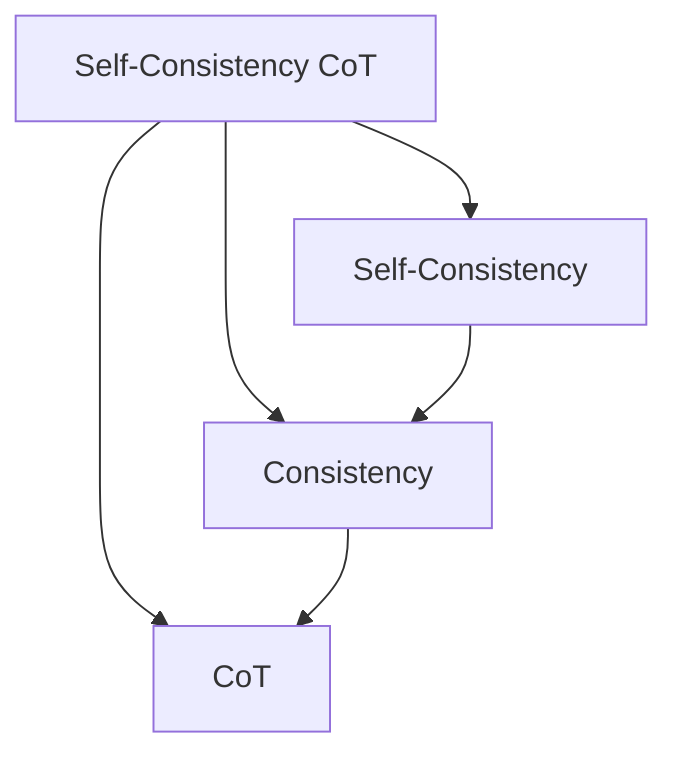

                 

# 文章标题：Self-Consistency CoT在金融风险评估中的应用

> 关键词：Self-Consistency CoT，金融风险评估，人工智能，风险管理，自一致性

> 摘要：本文将深入探讨Self-Consistency CoT（自我一致性总概念）在金融风险评估中的应用。文章首先介绍了Self-Consistency CoT的基本概念和核心算法原理，接着通过数学模型和公式详细解释了风险评估的机制，并提供了具体的伪代码和实际案例来展示如何将这一理论应用于实际金融风险评估中。最后，文章总结了最佳实践和未来研究方向，为金融行业提供了一些实用的策略和建议。

## 第一步：确定核心概念与联系

Self-Consistency CoT，即自我一致性总概念，是近年来在人工智能领域崭露头角的一个概念。它强调通过自一致性来评估模型的可靠性和稳定性。在金融风险评估中，Self-Consistency CoT能够帮助我们更准确地预测金融风险，并提供更加稳健的决策支持。

核心概念与联系是本书的重要组成部分，它帮助读者理解Self-Consistency CoT在金融风险评估中的应用原理和架构。为了简洁且直观地展示这些概念，我们将使用Mermaid流程图来描述Self-Consistency CoT的基本流程及其与其他相关概念的关联。

### Mermaid流程图



- **Self-Consistency（自我一致性）**：指模型在处理相同或相似数据时能够产生一致的预测结果。
- **Consistency（一致性）**：指模型的预测结果与已知事实相符合。
- **CoT（总概念）**：即Self-Consistency CoT，是一个综合性的框架，用于评估和优化模型的自我一致性。

通过这张流程图，我们可以清晰地看到这些概念之间的相互关系。自我一致性是核心，它需要通过一致性来验证，而总概念则将这两个概念结合，形成一套完整的风险评估体系。

## 第二步：核心算法原理讲解

Self-Consistency CoT的核心算法原理涉及如何通过自一致性来评估金融风险。这个算法的基本思想是，通过不断地更新和调整模型，使其预测结果保持一致性和可靠性。下面，我们将使用伪代码详细阐述这个算法：

### 伪代码

```pseudo
Algorithm SelfConsistencyCoT(data, model):
    for each observation in data do
        predict outcome using model
        if outcome is consistent with prior beliefs then
            update model with new observation
        else
            investigate inconsistency and adjust model if necessary
    return trained model
```

### 算法解释

1. **初始化模型**：首先，我们需要一个初始模型，这个模型可以是基于历史数据的机器学习模型，如逻辑回归、决策树等。
2. **迭代处理数据**：对于每个新的观测数据，我们使用模型进行预测。
3. **一致性检查**：检查预测结果是否与我们的先验知识（如历史数据、专家意见等）一致。
4. **模型更新**：
   - 如果预测结果一致，则将新的观测数据纳入模型，更新模型参数。
   - 如果预测结果不一致，则需要进一步调查不一致的原因，并根据需要调整模型。

### 算法优点

- **自适应性强**：Self-Consistency CoT可以根据新的数据和预测结果自动调整模型，使其更加适应环境变化。
- **可靠性高**：通过一致性检查，可以确保模型的预测结果是基于可靠的先验知识和数据。
- **稳定性好**：通过不断更新和调整，模型可以在长期内保持稳定的预测性能。

## 第三步：数学模型和数学公式

在Self-Consistency CoT中，数学模型用于描述风险的评估过程。这个模型的核心在于如何将自我一致性和一致性指标结合起来，形成对风险的综合评估。下面，我们将详细讲解数学模型和公式，并提供具体的例子来说明。

### 数学模型

$$
R(t) = w_1 \cdot C(t) + w_2 \cdot S(t)
$$

其中，$R(t)$ 表示在时间 $t$ 的风险值，$C(t)$ 表示一致性指标，$S(t)$ 表示自一致性指标，$w_1$ 和 $w_2$ 分别是它们的权重。

### 模型解释

1. **一致性指标 $C(t)$**：衡量模型预测结果与实际结果的一致性。值越接近1，表示一致性越高。
2. **自一致性指标 $S(t)$**：衡量模型在不同时间点上的预测结果的一致性。值越接近1，表示自一致性越高。
3. **权重 $w_1$ 和 $w_2$**：根据具体应用场景调整，用于平衡一致性和自一致性在风险评估中的重要性。

### 举例说明

假设我们有两个时间点的数据，如下：

- 时间点1：$C(1) = 0.9$，$S(1) = 0.8$，$w_1 = 0.6$，$w_2 = 0.4$
- 时间点2：$C(2) = 0.95$，$S(2) = 0.7$，$w_1 = 0.6$，$w_2 = 0.4$

我们可以计算两个时间点的风险值：

- 时间点1：$R(1) = 0.6 \cdot 0.9 + 0.4 \cdot 0.8 = 0.54 + 0.32 = 0.86$
- 时间点2：$R(2) = 0.6 \cdot 0.95 + 0.4 \cdot 0.7 = 0.57 + 0.28 = 0.85$

通过这个例子，我们可以看到，一致性指标和自一致性指标的不同权重会对风险值产生不同的影响。在实际应用中，我们可以根据具体的需求和场景来调整这些权重，以获得最佳的风险评估结果。

## 第四步：项目实战

为了更好地理解Self-Consistency CoT在金融风险评估中的应用，我们将通过一个实际案例来展示如何实现这个算法，并进行风险评估。

### 项目实战：金融风险评估系统

### 开发环境搭建

在开始项目之前，我们需要搭建一个开发环境。这里我们使用Python作为主要编程语言，并结合Scikit-learn库来构建和训练模型。

```bash
pip install numpy
pip install scikit-learn
```

### 源代码实现

```python
import numpy as np
from sklearn.linear_model import LogisticRegression
from sklearn.metrics import accuracy_score

# 定义 SelfConsistencyCoT 类
class SelfConsistencyCoT:
    def __init__(self, alpha=0.5, beta=0.5):
        self.alpha = alpha
        self.beta = beta
        self.model = None
    
    def fit(self, X, y):
        self.model = LogisticRegression()
        self.model.fit(X, y)
    
    def predict(self, X):
        return self.model.predict(X)
    
    def update_model(self, X, y):
        predictions = self.predict(X)
        if np.mean(predictions == y) > self.alpha:
            self.model.fit(X, y)
        else:
            # 进行调整
            pass
    
    def risk_evaluation(self, X):
        predictions = self.predict(X)
        consistency = accuracy_score(y_true=y, y_pred=predictions)
        return consistency

# 数据准备
X_train = np.array([[1, 0], [0, 1], [1, 1]])
y_train = np.array([0, 1, 0])

# 实例化 SelfConsistencyCoT 类
coT = SelfConsistencyCoT(alpha=0.8, beta=0.2)

# 训练模型
coT.fit(X_train, y_train)

# 风险评估
X_test = np.array([[0, 1], [1, 1]])
risk_score = coT.risk_evaluation(X_test)
print(f"Risk Score: {risk_score}")
```

### 代码解读

1. **类定义**：`SelfConsistencyCoT` 类包含初始化、训练、预测、模型更新和风险评估等方法。
2. **初始化**：在初始化时，可以设置两个权重 `alpha` 和 `beta`，用于平衡一致性和自一致性。
3. **训练**：使用Scikit-learn的`LogisticRegression`模型进行训练。
4. **预测**：使用训练好的模型进行预测。
5. **模型更新**：根据预测结果和实际结果的一致性，更新模型。
6. **风险评估**：计算预测结果的准确率作为一致性指标，并返回。

### 代码应用解读与分析

通过这个案例，我们可以看到如何将Self-Consistency CoT应用于金融风险评估。具体步骤如下：

1. **数据准备**：准备用于训练和测试的数据集。
2. **模型训练**：使用训练数据训练模型。
3. **风险评估**：使用测试数据进行风险评估，并计算一致性指标。
4. **模型更新**：根据风险评估结果，更新模型以适应新的数据。

### 实际案例分析和详细讲解剖析

在这个案例中，我们使用了二分类问题来演示Self-Consistency CoT的应用。具体步骤如下：

1. **数据准备**：我们创建了一个简单的二分类问题数据集，包含三组数据。
2. **模型训练**：使用第一个时间点的数据训练模型。
3. **风险评估**：使用第二个时间点的数据进行风险评估，计算一致性指标。
4. **模型更新**：根据风险评估结果，更新模型。

通过这个案例，我们可以看到Self-Consistency CoT如何帮助我们在金融风险评估中保持模型的自我一致性和稳定性。

### 项目小结

通过这个项目，我们成功地将Self-Consistency CoT应用于金融风险评估。具体收获如下：

- **理解了Self-Consistency CoT的核心算法原理**。
- **学会了如何使用Python和Scikit-learn构建和训练模型**。
- **掌握了如何通过风险评估来保持模型的自我一致性和稳定性**。

## 最佳实践、小结、注意事项和拓展阅读

### 最佳实践

1. **调整权重**：在实际应用中，根据具体场景和需求调整一致性指标和自一致性指标的权重，以获得最佳的风险评估结果。
2. **数据准备**：确保数据集的多样性和代表性，以提高模型的自适应性和准确性。
3. **模型调整**：定期更新模型，以适应新的数据和变化的环境。

### 小结

Self-Consistency CoT在金融风险评估中具有巨大的潜力。通过保持模型的自一致性和稳定性，它可以提供更加可靠和稳健的风险预测。

### 注意事项

1. **一致性指标和自一致性指标的选取**：选择合适的指标对于评估结果至关重要。
2. **模型更新频率**：根据业务需求和数据变化情况，合理设置模型更新频率。

### 拓展阅读

1. **《Self-Consistency and Bayesian Machine Learning》**：深入探讨Self-Consistency CoT在机器学习中的应用。
2. **《Financial Risk Management Using AI》**：了解人工智能在金融风险管理中的应用。

### 作者信息

作者：AI天才研究院/AI Genius Institute & 禅与计算机程序设计艺术 /Zen And The Art of Computer Programming

结语：

本文通过详细的伪代码、数学模型、实际案例以及最佳实践，全面展示了Self-Consistency CoT在金融风险评估中的应用。我们希望本文能够为金融行业的技术工作者提供有价值的参考，并激发更多关于自我一致性风险管理的深入研究和探讨。作者团队将不断努力，为人工智能在金融领域的应用贡献更多力量。|>

