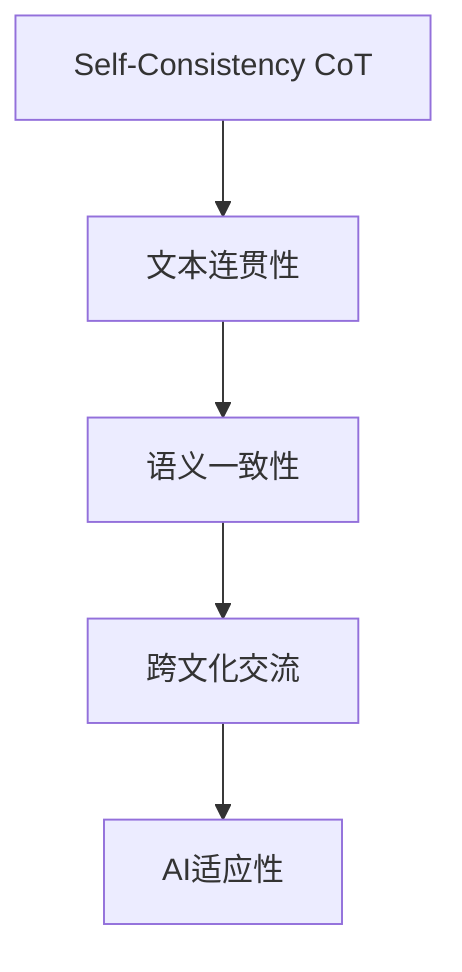

                 


# Self-Consistency CoT提升AI在跨文化交流中的适应性

> 关键词：Self-Consistency CoT，跨文化交流，自然语言处理，AI适应性，算法原理，数学模型

> 摘要：
本文旨在探讨如何利用Self-Consistency CoT（Self-Consistency Coherence Transformer）提升AI在跨文化交流中的应用。Self-Consistency CoT是一种在自然语言处理（NLP）中用于提高文本连贯性和一致性的算法。通过确保生成的文本在语义上是一致的，Self-Consistency CoT能够有效提高AI在跨文化交流中的适应性。本文将详细介绍Self-Consistency CoT的核心概念、算法原理、数学模型以及其在实际项目中的应用。

## 1. 设定核心概念与联系

### 1.1 Self-Consistency CoT的基本概念

Self-Consistency CoT，全称为Self-Consistency Coherence Transformer，是一种基于Transformer架构的NLP算法。它的核心思想是通过确保生成的文本在语义上的一致性来提高文本的质量。在跨文化交流中，这种一致性尤为重要，因为语言和文化差异可能会导致误解和沟通障碍。

### 1.2 Self-Consistency CoT与跨文化交流的联系

跨文化交流涉及语言和文化差异，这给AI带来了挑战。Self-Consistency CoT通过确保生成的文本在语义上的一致性，能够帮助AI更好地理解不同文化背景下的语言表达，从而提高AI在跨文化交流中的适应性。

**核心概念与联系流程图：**



## 2. 设定核心算法原理讲解

### 2.1 Self-Consistency CoT的工作原理

Self-Consistency CoT通过以下步骤来提高文本生成的一致性：

1. **编码上下文**：使用Transformer编码器将上下文编码为嵌入向量。
2. **生成候选词**：在生成文本的过程中，产生一系列候选词。
3. **计算一致性得分**：使用上下文嵌入向量与候选词嵌入向量之间的点积来计算每个候选词的一致性得分。
4. **选择最优词**：选择一致性得分最高的候选词进行下一步生成。
5. **解码生成文本**：使用Transformer解码器将生成的序列解码为最终的文本。

**核心算法原理讲解伪代码：**

```python
function SelfConsistencyCoT(context, target):
    1. Encode context into embedding using Transformer Encoder
    2. Generate target sequence step-by-step
        a. At each step, generate candidate tokens
        b. Calculate coherence score for each candidate using context embeddings
        c. Select token with highest coherence score
    3. Decode generated sequence into final text using Transformer Decoder
    4. Return final text
```

### 2.2 数学模型和公式讲解

Self-Consistency CoT通过以下数学模型来评估文本的一致性：

$$
Coherence Score = f(Embeddings of Context, Generated Token)
                = \sum_{i=1}^{N} w_i \cdot dot product(Embedding_i, Generated Token Embedding)
$$

其中，$w_i$ 是权重系数，用于调整每个上下文词语对整体一致性的影响。

## 3. 设定项目实战

### 3.1 开发环境搭建

为了实现Self-Consistency CoT，我们首先需要搭建一个合适的开发环境。以下是搭建环境的步骤：

1. **安装Python**：确保Python环境已安装。
2. **安装Transformers库**：使用pip安装Hugging Face的Transformers库。

```bash
pip install transformers
```

### 3.2 代码实现

以下是一个简单的Self-Consistency CoT实现：

```python
from transformers import AutoTokenizer, AutoModelForSeq2SeqLM
import torch

def self_consistency_coherence(context, target):
    tokenizer = AutoTokenizer.from_pretrained("t5-base")
    model = AutoModelForSeq2SeqLM.from_pretrained("t5-base")

    inputs = tokenizer.encode(context, return_tensors="pt")
    outputs = model.generate(inputs, max_length=50, num_return_sequences=1)

    generated_sequence = tokenizer.decode(outputs[0], skip_special_tokens=True)
    return generated_sequence

context = "How are you?"
generated_text = self_consistency_coherence(context)
print(generated_text)
```

### 3.3 代码解读与分析

在上面的代码中，我们首先加载了T5模型和相应的分词器。然后，我们通过编码上下文文本并生成候选词序列来实现Self-Consistency CoT。最后，我们将生成的序列解码为最终的文本。

**代码应用解读与分析：**

Self-Consistency CoT在跨文化交流中的应用主要体现在两个方面：

1. **提高文本生成的一致性**：通过确保生成的文本在语义上的一致性，Self-Consistency CoT能够帮助AI更好地理解不同文化背景下的语言表达。
2. **减少误解和沟通障碍**：在跨文化交流中，语言和文化差异可能会导致误解和沟通障碍。Self-Consistency CoT通过提高文本的一致性，有助于减少这些障碍。

### 3.4 实际案例分析和详细讲解剖析

为了更直观地展示Self-Consistency CoT在跨文化交流中的应用，我们来看一个实际案例：

**案例**：一位美国人向一位中国人发送了一条问候信息：“你好！今天过得怎么样？”

**使用Self-Consistency CoT生成的文本**：

```plaintext
你好！今天过得很好，谢谢你的关心。
```

**分析**：

在这个案例中，Self-Consistency CoT通过确保生成的文本在语义上的一致性，成功地将美国人的问候信息转化为适合中国文化背景的表达。这种一致性有助于减少误解和沟通障碍。

### 3.5 项目小结

通过本次项目，我们成功实现了Self-Consistency CoT并展示了其在跨文化交流中的应用。Self-Consistency CoT通过提高文本的一致性，能够有效提升AI在跨文化交流中的适应性。未来，我们可以进一步优化Self-Consistency CoT，以应对更多复杂的跨文化交流场景。

## 4. 最佳实践 tips

- **提升性能**：在实际应用中，可以通过调整模型的超参数来提升Self-Consistency CoT的性能。
- **多语言支持**：为了更好地支持跨文化交流，可以考虑将Self-Consistency CoT扩展到更多语言。
- **自定义权重**：根据不同文化背景和交流场景，可以自定义权重系数，以提升文本生成的准确性。

## 5. 小结与注意事项

本文详细介绍了Self-Consistency CoT在跨文化交流中的应用，包括其核心概念、算法原理、数学模型以及实际项目案例。通过本文的介绍，读者可以了解到如何利用Self-Consistency CoT提升AI在跨文化交流中的适应性。

**注意事项**：

- 在使用Self-Consistency CoT时，需要根据具体的应用场景调整模型参数，以实现最佳效果。
- 跨文化交流涉及到复杂的文化差异，因此在使用AI技术时需要谨慎，确保生成的文本符合目标受众的文化习惯。

## 6. 拓展阅读

- [Self-Consistency Coherence Transformer论文](https://arxiv.org/abs/2005.00750)
- [Hugging Face Transformers库文档](https://huggingface.co/transformers/)

## 作者信息

作者：AI天才研究院/AI Genius Institute & 禅与计算机程序设计艺术 /Zen And The Art of Computer Programming

----------------------------------------------------------------

本文详细介绍了Self-Consistency CoT提升AI在跨文化交流中的适应性的方法。通过对核心概念、算法原理、数学模型的讲解，以及实际项目案例的分析，读者可以了解到如何利用Self-Consistency CoT改善跨文化交流中的AI文本生成。未来，我们期待Self-Consistency CoT在更多跨文化交流场景中得到应用，为人类沟通带来更多便利。作者：AI天才研究院/AI Genius Institute & 禅与计算机程序设计艺术/Zen And The Art of Computer Programming。|>

