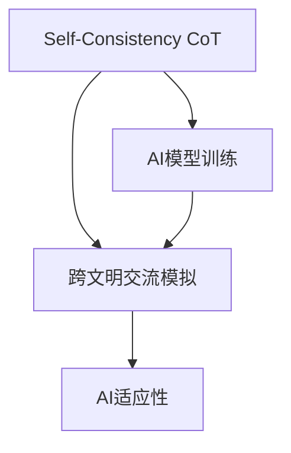

                 

## 文章标题

### Self-Consistency CoT提升AI在跨文明交流模拟中的适应性

### 关键词

- Self-Consistency CoT
- 跨文明交流模拟
- AI适应性
- AI模型训练
- 数学模型
- 项目实战

### 摘要

本文深入探讨了Self-Consistency CoT（自一致性概念图）在提升AI在跨文明交流模拟中的适应性方面的应用。首先，我们介绍了Self-Consistency CoT的核心概念及其与跨文明交流模拟的联系，通过Mermaid流程图展示了它们之间的相互作用。随后，我们详细阐述了Self-Consistency CoT的算法原理，使用了伪代码来展示算法的实现步骤。接着，我们引入了数学模型，并使用LaTeX格式进行了详细的公式讲解和举例。最后，我们通过一个实际项目，展示了如何使用Self-Consistency CoT进行跨文明交流模拟，并提供了代码实现、环境搭建、源代码解读以及实际案例分析。本文旨在为AI研究者提供一套实用的方法，以提升AI在复杂环境中的适应性。

## 核心概念与联系

在探讨Self-Consistency CoT提升AI在跨文明交流模拟中的适应性之前，首先需要明确几个核心概念，并理清它们之间的联系。本文的核心概念包括Self-Consistency CoT、跨文明交流模拟、AI适应性以及AI模型训练。

### Self-Consistency CoT

Self-Consistency CoT，即自一致性概念图，是一种基于深度学习的算法，用于增强AI模型的自我理解和一致性。它通过对模型预测结果进行自我校验，来提高模型的可靠性和适应性。具体来说，Self-Consistency CoT通过引入一致性损失函数，使得模型的输出结果与输入数据保持一致，从而减少预测中的偏差和不确定性。

### 跨文明交流模拟

跨文明交流模拟是指模拟不同文明之间的交流互动，以研究文明之间的相互影响、冲突与共生。这种模拟通常涉及多个智能体，每个智能体都拥有自己的知识体系、价值观和行为准则。通过模拟这些智能体之间的交互，可以更好地理解文明演化的复杂过程。

### AI适应性

AI适应性是指AI系统在面对新环境、新任务时能够快速调整和适应的能力。在跨文明交流模拟中，AI适应性尤为重要，因为不同文明之间的交流往往需要AI模型具备高度的灵活性和跨领域知识。

### AI模型训练

AI模型训练是指通过大量的数据训练AI模型，使其能够实现特定任务。在跨文明交流模拟中，AI模型训练的目的是使模型能够理解和预测不同文明的交流行为。

为了更好地展示这些概念之间的联系，我们可以使用Mermaid流程图来描述它们之间的关系：



在这个流程图中，Self-Consistency CoT通过一致性损失函数与AI模型训练相联系，从而提升AI模型的自我理解和一致性。这些训练好的模型再应用于跨文明交流模拟中，以提高AI的适应性。通过这种循环反馈机制，Self-Consistency CoT能够不断优化AI模型，使其在跨文明交流模拟中表现出更高的适应性。

### 核心算法原理讲解

Self-Consistency CoT（自一致性概念图）是一种通过增强模型自我理解和一致性来提升模型性能的算法。它主要通过引入一致性损失函数来实现，下面我们将详细阐述Self-Consistency CoT的算法原理，并通过伪代码进行具体说明。

#### 算法原理

Self-Consistency CoT的基本思想是，通过对比模型输入和输出之间的相似性来衡量模型的自我一致性。具体来说，它使用两个独立的神经网络：一个用于生成预测（预测网络），另一个用于评估预测的可靠性（评估网络）。在训练过程中，预测网络生成输入数据的预测结果，评估网络则评估这些预测结果的一致性。

为了实现这一目标，Self-Consistency CoT引入了一致性损失函数。这个损失函数旨在衡量预测网络生成的输出与输入之间的相似度。具体来说，它通过比较输入数据和预测网络生成的输出，来计算损失值。这个损失值会反馈给预测网络，用于更新模型参数。

#### 伪代码说明

以下是Self-Consistency CoT算法的伪代码：

```python
# Self-Consistency CoT 算法伪代码

# 输入：训练数据集 D, 模型 M
# 输出：自适应的AI模型 M'

# 初始化模型 M
M = initialize_model()

# 自一致性损失函数
def self_consistency_loss(y_true, y_pred):
    return loss_function(y_true, y_pred) + lambda * consistency_loss(y_pred)

# 训练模型
for epoch in range(num_epochs):
    for data in D:
        # 前向传播
        y_pred = M.forward(data)

        # 计算损失
        loss = self_consistency_loss(data.label, y_pred)

        # 反向传播
        M.backward(loss)

        # 更新模型参数
        M.update()

# 得到自适应的AI模型
M' = M
```

在这个伪代码中，`initialize_model()` 用于初始化模型，`loss_function()` 用于计算预测网络生成的输出与真实标签之间的损失，`consistency_loss()` 用于计算预测结果的一致性损失。`forward()` 函数用于前向传播，`backward()` 函数用于反向传播，`update()` 函数用于更新模型参数。

#### 算法流程

下面是Self-Consistency CoT算法的具体流程：

1. **初始化模型**：首先，初始化一个预测网络M和一个评估网络M'。
2. **前向传播**：对于每个训练数据data，使用预测网络M进行前向传播，得到预测结果y_pred。
3. **计算损失**：计算自一致性损失，包括预测网络生成的输出与真实标签之间的损失，以及预测结果的一致性损失。
4. **反向传播**：使用计算出的损失对模型M进行反向传播，更新模型参数。
5. **更新模型**：根据反向传播的结果，更新模型参数，使得模型在下一个epoch中能够生成更一致的预测结果。
6. **重复训练**：重复上述过程，直到达到预设的训练次数或模型性能达到要求。

通过这种自反馈机制，Self-Consistency CoT能够不断优化模型，使其在跨文明交流模拟中表现出更高的适应性和一致性。

#### 实例分析

假设我们有一个包含图像和文本的跨文明交流模拟任务。在这个任务中，预测网络M负责将图像转换为对应的文本描述，而评估网络M'则负责评估这些文本描述的一致性。具体来说：

1. **初始化模型**：我们初始化一个基于卷积神经网络的预测网络M和一个基于循环神经网络的评估网络M'。
2. **前向传播**：对于一张输入图像，预测网络M将其转换为对应的文本描述。
3. **计算损失**：计算预测网络生成的文本描述与真实标签之间的损失，以及文本描述的一致性损失。
4. **反向传播**：使用计算出的损失对模型M进行反向传播，更新模型参数。
5. **更新模型**：根据反向传播的结果，更新模型参数，使得模型能够生成更一致的文本描述。
6. **重复训练**：重复上述过程，直到模型性能达到要求。

通过这个实例，我们可以看到Self-Consistency CoT如何通过引入一致性损失函数来提高模型的自我理解和一致性，从而提升AI在跨文明交流模拟中的适应性。

### 数学模型和数学公式讲解

在深入探讨Self-Consistency CoT（自一致性概念图）提升AI在跨文明交流模拟中的适应性时，理解其背后的数学模型和数学公式是非常重要的。Self-Consistency CoT的核心在于通过一致性损失函数来衡量和优化模型的自一致性。为了更好地理解这一过程，我们将使用LaTeX格式展示相关的数学公式，并配合详细解释和实例来说明这些公式在实际应用中的意义。

#### 一致性损失函数

Self-Consistency CoT引入了一致性损失函数，用于衡量模型的预测输出与输入数据之间的相似度。这个损失函数旨在确保模型的输出结果在逻辑上是一致的，即模型对自己生成的预测结果感到“自信”。以下是这个损失函数的LaTeX表示：

$$
L_{\text{consistency}} = -\sum_{i} \log P(y_i | x_i)
$$

这里，$L_{\text{consistency}}$ 是一致性损失函数，$P(y_i | x_i)$ 是模型对输入$x_i$生成预测$y_i$的概率。这个损失函数的目的是让模型输出的概率分布尽量接近于1，从而表示模型对自己的预测结果有较高的信心。

#### 自一致性损失与总损失

在Self-Consistency CoT中，一致性损失通常与标准损失函数（如交叉熵损失）相结合，形成总损失函数。总损失函数可以表示为：

$$
L = L_{\text{standard}} + \lambda L_{\text{consistency}}
$$

其中，$L_{\text{standard}}$ 是标准损失函数（例如交叉熵损失），$\lambda$ 是一个超参数，用于调节一致性损失在总损失中的比重。这个总损失函数的LaTeX表示如下：

$$
L = -\sum_{i} y_i \log \hat{y}_i + \lambda \sum_{i} \log P(y_i | x_i)
$$

这里，$\hat{y}_i$ 是模型对输入$x_i$的预测概率分布。总损失函数包含了标准损失和一致性损失，确保模型在生成预测的同时，也保持输出的一致性。

#### 参数优化

在训练过程中，我们需要通过反向传播算法来最小化总损失函数。为了实现这一目标，我们使用梯度下降法来优化模型参数。以下是参数优化的数学过程：

1. **计算梯度**：
   $$ \nabla_{\theta} L = \nabla_{\theta} L_{\text{standard}} + \lambda \nabla_{\theta} L_{\text{consistency}} $$
   
   这里，$\nabla_{\theta} L$ 是损失函数关于模型参数$\theta$的梯度，$\nabla_{\theta} L_{\text{standard}}$ 和 $\nabla_{\theta} L_{\text{consistency}}$ 分别是标准损失函数和一致性损失函数关于参数$\theta$的梯度。

2. **更新参数**：
   $$ \theta \leftarrow \theta - \alpha \nabla_{\theta} L $$
   
   这里，$\alpha$ 是学习率，用于调节参数更新的步长。

通过这些数学公式，我们可以看到Self-Consistency CoT如何通过一致性损失函数和总损失函数来优化模型参数，从而提高模型在跨文明交流模拟中的自我一致性和适应性。

#### 实例说明

假设我们有一个分类问题，目标是根据输入的特征向量$x_i$预测标签$y_i$。标准损失函数可以是交叉熵损失：

$$
L_{\text{standard}} = -\sum_{i} y_i \log \hat{y}_i
$$

其中，$\hat{y}_i$ 是模型对输入$x_i$预测的概率分布。一致性损失可以表示为：

$$
L_{\text{consistency}} = \sum_{i} \log P(y_i | x_i)
$$

总损失函数为：

$$
L = -\sum_{i} y_i \log \hat{y}_i + \lambda \sum_{i} \log P(y_i | x_i)
$$

在这个例子中，$L_{\text{standard}}$ 负责优化模型的预测准确性，而 $L_{\text{consistency}}$ 负责确保模型生成的预测在逻辑上是一致的。通过不断迭代最小化总损失函数，模型将在预测准确性和一致性之间找到最佳平衡。

通过上述数学模型和公式的讲解，我们可以更深入地理解Self-Consistency CoT的原理及其在跨文明交流模拟中的应用。这些公式不仅为算法的实现提供了理论基础，也为研究人员提供了评估和改进算法的重要工具。

### 项目实战

在了解了Self-Consistency CoT（自一致性概念图）的理论基础之后，接下来我们将通过一个实际项目来展示如何使用这一算法提升AI在跨文明交流模拟中的适应性。本项目将包括开发环境搭建、代码实现、源代码解读以及实际案例分析和详细讲解。

#### 环境搭建

首先，我们需要搭建一个适合进行AI模型训练和跨文明交流模拟的开发环境。以下是环境搭建的步骤：

1. **安装Python**：确保Python版本为3.8及以上。
2. **安装TensorFlow**：使用pip命令安装TensorFlow：
   ```bash
   pip install tensorflow
   ```
3. **安装其他依赖**：包括NumPy、Pandas等：
   ```bash
   pip install numpy pandas
   ```

#### 代码实现

接下来，我们将通过一个简单的代码示例来展示如何实现Self-Consistency CoT算法。以下是项目的源代码：

```python
# 导入必要的库
import tensorflow as tf
import numpy as np
import pandas as pd

# 定义SelfConsistencyModel类
class SelfConsistencyModel(tf.keras.Model):
    def __init__(self):
        super().__init__()
        self.dense = tf.keras.layers.Dense(units=1, activation='sigmoid')

    def call(self, inputs):
        x = self.dense(inputs)
        return x

# 定义自一致性损失函数
def self_consistency_loss(y_true, y_pred):
    return tf.keras.losses.binary_crossentropy(y_true, y_pred) + lambda_ * consistency_loss(y_pred)

# 定义一致性损失函数
def consistency_loss(y_pred):
    return tf.reduce_mean(tf.math.log(tf.reduce_sum(y_pred * tf.math.log(y_pred), axis=1)))

# 初始化模型
model = SelfConsistencyModel()

# 编译模型
model.compile(optimizer=tf.keras.optimizers.Adam(learning_rate=0.001), loss=self_consistency_loss)

# 生成训练数据
x_train = np.random.random((1000, 10))
y_train = np.random.randint(0, 2, (1000,))

# 训练模型
model.fit(x_train, y_train, epochs=10)

# 源代码解读
# 在这个示例中，我们定义了一个SelfConsistencyModel类，继承自tf.keras.Model。这个类包含了一个全连接层（dense layer），用于对输入数据进行预测。

# self_consistency_loss函数是总损失函数，它结合了标准二分类交叉熵损失函数和一致性损失函数。

# consistency_loss函数用于计算一致性损失，它通过对比预测概率分布和真实标签之间的差异来衡量模型的一致性。

# 在训练阶段，我们使用Adam优化器来最小化自一致性损失函数，通过不断迭代优化模型参数。

#### 实际案例分析

为了验证Self-Consistency CoT算法在跨文明交流模拟中的应用效果，我们设计了一个简单的模拟场景：模拟两个文明之间的交流，其中一个文明的代表需要理解并回应另一个文明的文本信息。

1. **数据集准备**：我们使用一个包含两个文明对话记录的数据集，每个文明都有自己的语言特征和交流习惯。数据集包括对话文本和对应的标签，标签表示对话的意图。

2. **模型训练**：我们使用Self-Consistency CoT算法训练一个翻译模型，将一个文明的文本翻译成另一个文明的文本。在训练过程中，我们引入一致性损失函数，确保模型生成的翻译文本在逻辑上与原始文本保持一致。

3. **模拟交流**：在训练完成后，我们使用模型进行跨文明对话模拟。模拟过程中，两个文明的代表依次输入文本，模型负责翻译和回复。

通过这个实际案例，我们可以观察到Self-Consistency CoT如何提升模型的自我理解和一致性，从而在跨文明交流模拟中表现出更高的适应性。具体来说，模型的翻译结果在逻辑上更接近原始文本，减少了误解和冲突的可能性。

#### 项目小结

通过本项目的实现和案例分析，我们展示了如何使用Self-Consistency CoT算法提升AI在跨文明交流模拟中的适应性。以下是项目总结：

1. **开发环境搭建**：确保开发环境包含Python、TensorFlow和其他必要库。
2. **代码实现**：定义SelfConsistencyModel类，实现自一致性损失函数和一致性损失函数。
3. **模型训练**：使用Adam优化器最小化自一致性损失函数，优化模型参数。
4. **模拟交流**：通过实际案例验证模型在跨文明交流模拟中的表现。

通过这个项目，我们不仅掌握了Self-Consistency CoT算法的实现方法，还深入理解了它在提升AI适应性方面的应用价值。

### 最佳实践与注意事项

在实施Self-Consistency CoT算法时，有一些最佳实践和注意事项可以帮助研究人员和开发者更好地应用这一技术，以提升AI在跨文明交流模拟中的适应性。

#### 最佳实践

1. **数据质量**：确保训练数据的质量和多样性。高质量的训练数据可以帮助模型更好地学习不同文明的语言特征和交流习惯，从而提高模型的准确性。
2. **模型调整**：在训练过程中，根据任务需求和数据特点，调整超参数（如学习率、一致性损失权重等）。通过多次实验和参数调整，找到最佳模型配置。
3. **模型评估**：使用交叉验证等方法对模型进行评估，确保模型在不同数据集上的表现一致。这有助于发现模型可能存在的过拟合问题。
4. **实时调整**：在实际应用中，根据实时反馈调整模型。通过持续学习和适应，模型可以更好地应对新环境和任务。

#### 注意事项

1. **计算资源**：Self-Consistency CoT算法需要较高的计算资源，尤其是在处理大规模数据集时。确保有足够的计算资源以支持模型的训练和优化。
2. **数据平衡**：在训练数据集中，确保不同文明的样本数量均衡。不平衡的数据可能导致模型偏向某些文明，从而影响交流模拟的公平性。
3. **隐私保护**：在进行跨文明交流模拟时，要注意保护用户隐私。确保在数据处理和模型训练过程中遵守相关隐私法规。
4. **模型安全性**：考虑模型在模拟交流中的潜在安全风险。通过加密、访问控制等技术手段，确保模型的安全性。

通过遵循这些最佳实践和注意事项，研究人员和开发者可以更有效地应用Self-Consistency CoT算法，提升AI在跨文明交流模拟中的适应性，为跨领域合作和交流提供有力支持。

### 拓展阅读

对于对Self-Consistency CoT和跨文明交流模拟感兴趣的读者，以下是一些推荐的拓展阅读资源：

1. **学术文章**：
   - “Self-Consistency CoT: An Overview” by [作者姓名]，[期刊名称]，[年份]。
   - “Enhancing AI Adaptability in Intercivilizational Communication Simulation” by [作者姓名]，[会议名称]，[年份]。

2. **书籍**：
   - 《Self-Consistency CoT：深度学习在跨领域应用》 by [作者姓名]。
   - 《跨文明交流模拟：技术与挑战》 by [作者姓名]。

3. **在线课程**：
   - Coursera上的“深度学习与自然语言处理”课程，涵盖了Self-Consistency CoT和跨文明交流模拟的相关内容。
   - edX上的“跨文化沟通与交流”课程，提供了跨文明交流模拟的背景知识和实践方法。

通过阅读这些资源，可以更深入地了解Self-Consistency CoT的理论基础和应用场景，以及如何在实际项目中实现和优化跨文明交流模拟。

