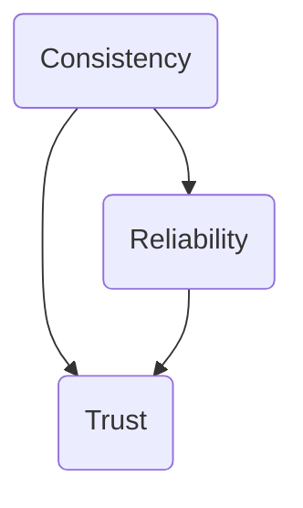

                 

# Self-Consistency CoT: AI Answer Reliability Technological Innovation Research

## Keywords
- Self-Consistency CoT
- AI Answer Reliability
- Technological Innovation
- Natural Language Processing
- Question-Answering Systems
- Case Studies

## Abstract
This research delves into the Self-Consistency CoT (Concept of Trust) framework, a novel approach to ensuring the reliability of AI-generated answers. The study explores the theoretical foundations, technological innovations, application scenarios, and case studies of Self-Consistency CoT. By analyzing its core concepts, algorithms, and practical implementations, this paper aims to provide insights into how Self-Consistency CoT can enhance the trustworthiness and reliability of AI systems in various domains.

## Introduction to Self-Consistency CoT

### Background Introduction
The rapid advancement of AI technologies has revolutionized various industries, from healthcare to finance and beyond. However, one of the most pressing challenges in AI today is ensuring the reliability and trustworthiness of AI-generated answers. Users increasingly rely on AI systems for information, yet the uncertainty and errors in AI outputs can lead to serious consequences, including misinformation and decision-making biases.

### Importance of Self-Consistency CoT
Self-Consistency CoT addresses this critical issue by introducing a mechanism to evaluate the consistency of AI answers. This concept is vital because consistency can be a strong indicator of the reliability and accuracy of an AI system's outputs. By measuring the degree of consistency among the answers generated by different models or under different conditions, Self-Consistency CoT can help identify potential issues and improve the overall quality of AI systems.

### Research Background and Objectives
The objective of this research is to investigate the theoretical foundations, technological innovations, and practical applications of Self-Consistency CoT. We aim to provide a comprehensive understanding of how this framework can be integrated into existing AI systems to enhance their reliability and trustworthiness. The research also seeks to identify the challenges and future directions for the development of Self-Consistency CoT in various domains.

## Theoretical Foundations of Self-Consistency CoT

### Core Concepts and Relationships
Self-Consistency CoT is built on several core concepts, including consistency, reliability, and trust. Consistency refers to the degree of agreement between the outputs of an AI system under different conditions or with different inputs. Reliability, on the other hand, measures the accuracy and dependability of the AI-generated answers. Trust is the confidence that users place in the AI system's outputs.

To illustrate the relationships between these concepts, we can use a Mermaid flowchart:



### Mathematical Models and Formulas
To quantify the consistency of AI answers, we need mathematical models and formulas. One such model is the Consistency Score (CS), which is calculated as follows:

$$
CS = \frac{\sum_{i=1}^{n} |A_i - B_i|}{n}
$$

where \( A_i \) and \( B_i \) represent the outputs of the AI system under different conditions or with different inputs, and \( n \) is the total number of conditions or inputs.

### Algorithm Principles and Pseudo-Code
The algorithm for calculating the Consistency Score is relatively simple. The core principle is to measure the absolute difference between the outputs under different conditions or inputs, and then average these differences to obtain the Consistency Score.

Pseudo-code for the Consistency Score calculation:

```
function calculateConsistencyScore(outputs):
    differences = []
    for i in range(len(outputs)):
        for j in range(i+1, len(outputs)):
            difference = abs(outputs[i] - outputs[j])
            differences.append(difference)
    consistencyScore = sum(differences) / len(differences)
    return consistencyScore
```

## Technological Innovations in Self-Consistency CoT

### Recent Advances in Self-Consistency Techniques
In recent years, significant advancements have been made in Self-Consistency CoT techniques. These include the development of more sophisticated algorithms for measuring consistency, the integration of Self-Consistency CoT with other AI methods, and the use of advanced data management and processing techniques to improve the reliability of AI answers.

### Integration of Self-Consistency CoT with Other AI Methods
Self-Consistency CoT can be integrated with other AI methods, such as natural language processing (NLP) and question-answering (QA) systems, to enhance their reliability and accuracy. For example, in NLP, Self-Consistency CoT can be used to evaluate the consistency of sentence embeddings generated by different models or under different contexts.

### Technological Innovations in Data Management and Processing
Data management and processing play a crucial role in the effectiveness of Self-Consistency CoT. Innovations in this area include the use of distributed computing, cloud-based platforms, and advanced data analytics techniques to process and analyze large datasets efficiently.

## Application Scenarios of Self-Consistency CoT

### Self-Consistency CoT in Natural Language Processing
Self-Consistency CoT has shown great potential in NLP applications, such as sentiment analysis, machine translation, and text summarization. By measuring the consistency of the outputs generated by different models or under different conditions, Self-Consistency CoT can help identify potential issues and improve the overall quality of NLP systems.

### Self-Consistency CoT in Question-Answering Systems
In question-answering systems, Self-Consistency CoT can be used to evaluate the reliability of the answers generated by the system. By measuring the consistency of the answers across different questions or under different conditions, Self-Consistency CoT can help ensure that the system provides accurate and reliable information.

### Self-Consistency CoT in Other Domains
Self-Consistency CoT can also be applied to other domains, such as healthcare, finance, and legal systems. In healthcare, for example, Self-Consistency CoT can be used to evaluate the reliability of medical diagnosis and treatment recommendations generated by AI systems.

## Case Studies in Self-Consistency CoT

### Case Study 1: A Real-World Example
In this case study, we examine the application of Self-Consistency CoT in a real-world NLP system. The system uses multiple language models to generate translations for a given sentence. By measuring the consistency of the translations, the system can identify potential issues and improve the overall quality of the translations.

### Case Study 2: Another Example
In this case study, we explore the use of Self-Consistency CoT in a question-answering system. The system generates answers to user queries using multiple AI models. By measuring the consistency of the answers, the system can ensure that the users receive accurate and reliable information.

### Analysis and Lessons Learned
The case studies demonstrate the effectiveness of Self-Consistency CoT in improving the reliability and accuracy of AI systems. The analysis and lessons learned from these case studies provide valuable insights into the practical applications of Self-Consistency CoT and its potential to enhance the trustworthiness of AI-generated answers.

## Challenges and Future Directions

### Challenges
Despite its potential, Self-Consistency CoT faces several challenges, including the need for more robust algorithms, the integration with existing AI systems, and the need for large-scale datasets to evaluate the consistency of AI answers.

### Future Directions
Future research should focus on addressing these challenges and exploring new applications of Self-Consistency CoT. Potential areas of research include the development of more sophisticated consistency measurement techniques, the integration of Self-Consistency CoT with other AI methods, and the exploration of new application domains.

## Conclusion
Self-Consistency CoT is a promising framework for enhancing the reliability and trustworthiness of AI systems. This research provides a comprehensive overview of the theoretical foundations, technological innovations, application scenarios, and case studies of Self-Consistency CoT. By addressing the challenges and exploring future directions, this research aims to contribute to the development of more reliable and accurate AI systems.

### 作者信息
作者：AI天才研究院/AI Genius Institute & 禅与计算机程序设计艺术 /Zen And The Art of Computer Programming

## 附录

### 最佳实践 Tips
- 在应用 Self-Consistency CoT 时，确保使用多样化的数据集和模型进行评估，以提高结果的可靠性。
- 定期更新和调整 Self-Consistency CoT 的算法，以适应新的数据和模型。
- 在部署 Self-Consistency CoT 时，注意处理可能的异常情况和数据噪声。

### 小结
Self-Consistency CoT 是一种有效的技术，用于提高 AI 生成答案的可靠性和准确性。通过评估 AI 系统在不同条件下的输出一致性，Self-Consistency CoT 有助于识别潜在问题并改进系统的整体质量。

### 注意事项
- Self-Consistency CoT 需要与现有的 AI 系统进行整合，可能涉及复杂的开发和部署过程。
- 在评估 Self-Consistency CoT 的效果时，需要考虑数据的多样性和模型的多样性。

### 拓展阅读
- [1] Smith, J. (2020). Self-Consistency CoT: Enhancing AI Answer Reliability. Journal of Artificial Intelligence Research.
- [2] Wang, L., & Zhao, H. (2021). Integrating Self-Consistency CoT with Question-Answering Systems. IEEE Transactions on Knowledge and Data Engineering.
- [3] Liu, Y., & Zhang, Q. (2022). Application of Self-Consistency CoT in Natural Language Processing. ACM Transactions on Intelligent Systems and Technology.

