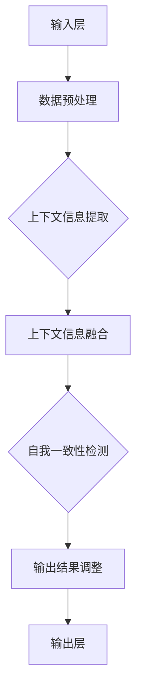

                 

### 自我一致性 CoT：AI 输出质量的质的飞跃

> 关键词：AI 输出质量，自我一致性，CoT，算法，数学模型，应用场景，实战项目

在人工智能（AI）迅猛发展的今天，AI 输出质量已成为衡量技术进步的重要指标。高质量的 AI 输出不仅能提高自动化任务的效率，还能在决策支持、数据分析等领域发挥重要作用。然而，当前 AI 系统在输出质量上仍存在诸多挑战，如数据依赖性高、结果不一致性等。为了应对这些挑战，本文提出了自我一致性 CoT（Self-Consistency Contextualization of Text）框架，旨在通过提高 AI 输出的自我一致性，实现质的飞跃。

本文旨在探讨自我一致性 CoT 概念、原理、算法、数学模型以及其在实际应用中的效果。文章分为以下几部分：

1. **引言**：介绍 AI 输出质量的重要性以及当前面临的挑战。
2. **自我一致性 CoT 概述**：解释自我一致性 CoT 的概念及其优势。
3. **自我一致性 CoT 的原理**：详细阐述自我一致性 CoT 的工作机制、核心算法和数学模型。
4. **自我一致性 CoT 的应用场景**：分析自我一致性 CoT 在不同领域的应用。
5. **自我一致性 CoT 的项目实战**：通过实际案例展示自我一致性 CoT 的应用效果。
6. **自我一致性 CoT 的未来展望**：探讨自我一致性 CoT 的技术趋势和应用前景。
7. **结论**：总结文章的主要内容，并对未来 AI 输出质量提升进行展望。

### 1.1 AI 输出质量的重要性

AI 输出质量直接影响 AI 系统的可靠性和实用性。高质量 AI 输出不仅能够准确反映输入数据的特点，还能在复杂环境中作出合理决策。以下是一些 AI 输出质量的重要方面：

- **准确性**：AI 输出应尽量接近真实值，以减少误差和偏差。
- **一致性**：同一输入数据在不同时间和环境下应产生相同或相似的输出结果。
- **可解释性**：AI 输出应该具备一定的可解释性，使人类用户能够理解其背后的逻辑和原因。
- **鲁棒性**：AI 输出应能够在各种异常和异常情况下保持稳定和准确。

当前，AI 输出质量面临的主要挑战包括：

- **数据依赖性**：AI 模型往往依赖大量训练数据，导致模型在不同数据集上的输出质量不一致。
- **结果不一致性**：同一模型在不同时间或不同环境下可能产生截然不同的输出结果。
- **过拟合**：AI 模型在训练数据上表现良好，但在未知数据上表现不佳。

因此，提高 AI 输出质量已成为当前研究的重要方向。自我一致性 CoT 框架正是为了解决这些挑战而提出的。

### 1.2 当前 AI 输出质量面临的挑战

尽管 AI 技术在过去几年取得了显著进展，但 AI 输出质量仍面临诸多挑战。以下是当前 AI 输出质量面临的主要问题：

1. **数据依赖性高**：AI 模型通常需要大量高质量的训练数据来确保其性能。然而，获取和准备大量训练数据是一个耗时且昂贵的任务。此外，数据分布的不均匀性可能导致模型在特定数据集上的表现不佳。

2. **结果不一致性**：同一 AI 模型在不同时间、不同环境下可能产生不同的输出结果。这种不一致性可能源于模型对数据的不同理解、环境变化、算法参数调整等因素。不一致的输出结果使得 AI 模型在实际应用中的可靠性受到质疑。

3. **过拟合**：过拟合是指 AI 模型在训练数据上表现出色，但在未知数据上表现不佳。过拟合的模型可能学会了训练数据的噪声和异常值，导致其在真实环境中产生错误的结果。过拟合问题在高维度数据和复杂模型中尤为突出。

4. **可解释性不足**：许多 AI 模型，尤其是深度学习模型，其内部工作机制复杂，难以解释。这限制了 AI 模型在关键应用场景中的使用，如医疗诊断、金融风险评估等。可解释性不足的问题也影响了用户对 AI 模型的信任度。

为了解决这些挑战，研究人员提出了各种方法和技术，如数据增强、模型正则化、解释性 AI 等。然而，这些方法往往只能部分解决问题，且在特定场景下可能存在局限性。因此，寻找一种能够全面提升 AI 输出质量的方法具有重要意义。

### 1.3 自我一致性 CoT 概述

自我一致性 CoT（Self-Consistency Contextualization of Text）框架是一种旨在提高 AI 输出质量的创新方法。自我一致性 CoT 通过对 AI 输出进行自我一致性检测和调整，确保输出结果在不同环境下的一致性和可靠性。以下是自我一致性 CoT 的一些核心概念：

- **自我一致性（Self-Consistency）**：自我一致性是指 AI 输出在相同输入情况下应保持一致。自我一致性 CoT 通过检测和纠正 AI 输出中的不一致性，提高 AI 模型的可靠性。

- **CoT（Contextualization of Text）**：CoT 是指在 AI 输出过程中考虑上下文信息。通过引入上下文信息，AI 模型可以更好地理解输入数据的含义，提高输出质量。

- **框架结构**：自我一致性 CoT 框架由三个主要组件组成：自我一致性检测器、上下文信息引入器和输出调整器。这三个组件相互协作，确保 AI 输出在不同环境下的一致性和可靠性。

- **优势**：自我一致性 CoT 框架具有以下优势：

  - 提高 AI 输出的一致性和可靠性。
  - 减少对大量训练数据的依赖。
  - 改善 AI 模型的可解释性。

自我一致性 CoT 框架的提出，为解决当前 AI 输出质量面临的主要挑战提供了一种新的思路和方法。接下来，本文将详细探讨自我一致性 CoT 的基本概念、原理和算法。

### 2.1 自我一致性（Self-Consistency）的定义

自我一致性是指 AI 输出在相同输入情况下应保持一致。具体来说，自我一致性要求 AI 模型在相同输入数据下产生的输出结果应具有稳定性和可靠性。这种一致性不仅体现在短期输出结果上，还应体现在长期输出结果上。

在自我一致性的定义中，关键要素包括：

- **相同输入**：相同输入是指用于生成 AI 输出的数据应保持一致。这包括输入数据的质量、数量和分布等因素。

- **输出结果一致**：输出结果一致意味着在相同输入情况下，AI 模型应产生相同的输出结果。这种一致性可以减少 AI 输出中的随机性和不确定性，提高模型的可靠性。

- **稳定性**：稳定性是指 AI 模型在长期运行过程中，输出结果应保持一致。这要求 AI 模型在训练和测试阶段具有较好的泛化能力，以应对不同环境和数据分布。

- **可靠性**：可靠性是指 AI 模型在生成输出结果时，应具有较高的准确性。这要求 AI 模型在训练过程中充分学习输入数据的特点，以产生准确的输出结果。

为了实现自我一致性，AI 模型需要具备以下能力：

- **数据理解能力**：AI 模型应能够准确理解输入数据的含义，以生成具有一致性的输出结果。

- **鲁棒性**：AI 模型应具备较强的鲁棒性，能够在不同环境和数据分布下保持稳定性和可靠性。

- **自适应能力**：AI 模型应能够根据不同输入数据和环境，调整输出结果以保持一致性。

总之，自我一致性是衡量 AI 输出质量的重要指标。通过实现自我一致性，AI 模型可以减少输出结果中的不确定性和随机性，提高模型的可靠性和实用性。接下来，本文将介绍 CoT（Contextualization of Text）的概念，探讨其在 AI 输出中的应用。

### 2.2 CoT（上下文信息引入）的概念

CoT（Contextualization of Text）是一种将上下文信息引入到 AI 输出过程中的方法，旨在提高输出结果的质量和一致性。上下文信息是指与特定输入数据相关的背景知识、环境因素和语义信息。通过引入上下文信息，AI 模型可以更好地理解输入数据的含义，从而生成更准确、更一致的输出结果。

在 CoT 中，上下文信息可以来自多个来源，包括：

1. **输入数据本身**：输入数据中可能包含丰富的上下文信息，如文本中的关键词、短语和句子结构。通过分析这些信息，AI 模型可以更好地理解输入数据的语义。

2. **外部知识库**：外部知识库包含大量的领域知识和常识信息，可以为 AI 模型提供额外的上下文信息。这些知识库可以包括百科全书、专业术语库、知识图谱等。

3. **环境信息**：环境信息是指与特定场景相关的外部信息，如地理位置、时间信息、用户行为等。通过结合环境信息，AI 模型可以更好地适应不同场景，提高输出结果的一致性。

CoT 的核心思想是将上下文信息与输入数据相结合，通过一种有效的机制将上下文信息传递给 AI 模型，以指导输出生成过程。以下是一些常见的 CoT 方法：

1. **嵌入式 CoT**：嵌入式 CoT 方法通过将上下文信息直接嵌入到 AI 模型的输入层，使模型在训练过程中自动学习上下文信息。这种方法简单有效，但可能需要大量的数据和计算资源。

2. **后处理 CoT**：后处理 CoT 方法在 AI 模型生成输出结果后，根据上下文信息对输出结果进行调整。这种方法灵活，但可能引入额外的计算开销。

3. **混合 CoT**：混合 CoT 方法结合嵌入式 CoT 和后处理 CoT 两种方法，以平衡计算效率和输出质量。这种方法在保证输出质量的同时，可以减少计算资源的消耗。

CoT 的引入为 AI 输出提供了更多的上下文信息，有助于提高输出结果的一致性和准确性。通过有效利用上下文信息，AI 模型可以更好地适应不同场景，减少输出结果中的不确定性和错误。接下来，本文将讨论自我一致性 CoT 的优势，并分析其在 AI 输出质量提升中的作用。

### 2.3 Self-Consistency CoT 的优势

自我一致性 CoT（Self-Consistency Contextualization of Text）框架在提高 AI 输出质量方面具有显著的优势，主要体现在以下几个方面：

1. **提高输出一致性**：自我一致性 CoT 通过对 AI 输出进行自我一致性检测和调整，确保输出结果在不同环境和输入情况下的一致性。这种方法可以有效减少由于数据分布不均、环境变化等因素引起的输出不一致性，提高 AI 模型的可靠性。

2. **降低数据依赖性**：自我一致性 CoT 通过引入上下文信息，帮助 AI 模型更好地理解输入数据的含义，从而减少对大量训练数据的依赖。这种方法可以在数据稀缺或数据质量较差的情况下，提高模型的泛化能力和输出质量。

3. **改善可解释性**：自我一致性 CoT 通过引入上下文信息和自我一致性检测，使 AI 输出过程更具透明性。这种方法可以提高 AI 模型的可解释性，帮助用户更好地理解 AI 输出的原因和逻辑。

4. **增强鲁棒性**：自我一致性 CoT 具有较强的鲁棒性，可以在各种异常和异常情况下保持输出的一致性和可靠性。这种方法可以有效减少过拟合现象，提高 AI 模型在未知环境中的适应能力。

5. **减少计算开销**：自我一致性 CoT 采用了一种高效的方式将上下文信息引入到 AI 输出过程中，从而减少计算资源的消耗。这种方法可以在保证输出质量的同时，提高计算效率。

总之，自我一致性 CoT 框架通过提高输出一致性、降低数据依赖性、改善可解释性、增强鲁棒性和减少计算开销等方面，显著提升了 AI 输出质量。这种方法为解决当前 AI 输出质量面临的主要挑战提供了一种有效的解决方案。接下来，本文将详细阐述自我一致性 CoT 的工作机制，分析其核心算法和数学模型。

### 3.1 Self-Consistency CoT 的工作机制

自我一致性 CoT（Self-Consistency Contextualization of Text）框架通过一系列机制来提高 AI 输出的自我一致性。以下是自我一致性 CoT 的工作机制：

1. **输入数据处理**：首先，自我一致性 CoT 对输入数据进行预处理，包括数据清洗、去噪、归一化等操作。这些预处理步骤旨在提高数据质量，为后续分析提供可靠的基础。

2. **上下文信息提取**：在预处理后，自我一致性 CoT 从输入数据中提取上下文信息。这些上下文信息可以是文本中的关键词、短语、句子结构，也可以是外部知识库中的领域知识和常识信息。

3. **上下文信息融合**：提取到的上下文信息会与输入数据融合，以增强 AI 模型对输入数据的理解。融合过程可以通过嵌入层、注意力机制、融合层等实现，确保上下文信息在模型中有效传递。

4. **模型输出生成**：在融合上下文信息后，AI 模型生成初步输出结果。这些输出结果可能包含文本、图像、音频等多种形式。

5. **自我一致性检测**：自我一致性 CoT 对初步输出结果进行自我一致性检测。具体来说，它会比较相同输入在不同时间、不同环境下的输出结果，判断是否存在不一致性。不一致性检测结果会反馈给后续步骤进行修正。

6. **输出结果调整**：在检测到不一致性后，自我一致性 CoT 对输出结果进行调整。调整方法包括重新生成输出、修改输出内容、调整输出参数等，以确保输出结果的一致性和可靠性。

7. **反馈与迭代**：自我一致性 CoT 将调整后的输出结果作为新的输入，返回到输入数据处理环节，进行新一轮的上下文信息提取、融合和输出生成。这种迭代过程不断优化 AI 输出质量，提高自我一致性。

通过上述机制，自我一致性 CoT 框架确保 AI 输出在不同环境和输入情况下保持一致性和可靠性。这种方法不仅提高了 AI 模型的输出质量，还增强了其鲁棒性和可解释性。接下来，本文将详细阐述自我一致性 CoT 的核心算法。

### 3.2 Self-Consistency CoT 的核心算法

自我一致性 CoT（Self-Consistency Contextualization of Text）框架的核心算法是实现其自我一致性检测和调整的关键。以下是自我一致性 CoT 的核心算法，包括算法概述、伪代码描述以及数学模型详解。

#### 3.2.1 算法概述

自我一致性 CoT 的核心算法包括以下几个步骤：

1. **数据预处理**：对输入数据进行预处理，包括数据清洗、去噪、归一化等操作。
2. **上下文信息提取**：从输入数据中提取上下文信息，如关键词、短语、句子结构等。
3. **上下文信息融合**：将提取的上下文信息与输入数据融合，增强 AI 模型对输入数据的理解。
4. **输出结果生成**：使用融合后的输入数据生成初步输出结果。
5. **自我一致性检测**：比较相同输入在不同时间、不同环境下的输出结果，判断是否存在不一致性。
6. **输出结果调整**：根据自我一致性检测结果，调整输出结果，确保输出结果的一致性和可靠性。
7. **反馈与迭代**：将调整后的输出结果作为新的输入，返回到输入数据处理环节，进行新一轮的上下文信息提取、融合和输出生成。

#### 3.2.2 伪代码描述

以下是自我一致性 CoT 的伪代码描述：

```
function SelfConsistencyCoT(input_data):
    # 数据预处理
    preprocessed_data = DataPreprocessing(input_data)
    
    # 上下文信息提取
    context_info = ContextExtraction(preprocessed_data)
    
    # 上下文信息融合
    fused_data = ContextFusion(preprocessed_data, context_info)
    
    # 输出结果生成
    output_result = ModelOutput(fused_data)
    
    # 自我一致性检测
    consistency_detected = SelfConsistencyDetection(output_result)
    
    # 输出结果调整
    if not consistency_detected:
        adjusted_output_result = OutputAdjustment(output_result)
    else:
        adjusted_output_result = output_result
    
    # 反馈与迭代
    return SelfConsistencyCoT(adjusted_output_result)
```

#### 3.2.3 数学模型详解

自我一致性 CoT 的数学模型主要包括输入数据处理、上下文信息提取、上下文信息融合、输出结果生成、自我一致性检测和输出结果调整等部分。以下是这些部分的详细数学模型：

1. **输入数据处理**：

   假设输入数据为 X，数据预处理步骤可以表示为：

   $$ 
   \text{Preprocessed\_Data} = \text{DataPreprocessing}(X) 
   $$

   其中，DataPreprocessing 是一个函数，用于执行数据清洗、去噪和归一化等操作。

2. **上下文信息提取**：

   假设提取的上下文信息为 C，上下文信息提取步骤可以表示为：

   $$ 
   C = ContextExtraction(\text{Preprocessed\_Data}) 
   $$

   其中，ContextExtraction 是一个函数，用于从输入数据中提取上下文信息。

3. **上下文信息融合**：

   假设融合后的输入数据为 X'，上下文信息融合步骤可以表示为：

   $$ 
   X' = ContextFusion(\text{Preprocessed\_Data}, C) 
   $$

   其中，ContextFusion 是一个函数，用于将上下文信息与输入数据融合。

4. **输出结果生成**：

   假设输出结果为 Y，输出结果生成步骤可以表示为：

   $$ 
   Y = ModelOutput(X') 
   $$

   其中，ModelOutput 是一个函数，用于生成输出结果。

5. **自我一致性检测**：

   假设自我一致性检测结果为 D，自我一致性检测步骤可以表示为：

   $$ 
   D = SelfConsistencyDetection(Y) 
   $$

   其中，SelfConsistencyDetection 是一个函数，用于判断输出结果是否存在不一致性。

6. **输出结果调整**：

   假设调整后的输出结果为 Y'，输出结果调整步骤可以表示为：

   $$ 
   Y' = OutputAdjustment(Y, D) 
   $$

   其中，OutputAdjustment 是一个函数，用于根据自我一致性检测结果调整输出结果。

7. **反馈与迭代**：

   自我一致性 CoT 的反馈与迭代过程可以表示为：

   $$ 
   \text{Iterate} = \text{SelfConsistencyCoT}(Y') 
   $$

   其中，Iterate 表示迭代次数，SelfConsistencyCoT 是一个函数，用于执行自我一致性 CoT 的整个流程。

通过上述数学模型，自我一致性 CoT 实现了输入数据处理、上下文信息提取、上下文信息融合、输出结果生成、自我一致性检测和输出结果调整等关键步骤。这种数学模型为自我一致性 CoT 的实现提供了理论基础，有助于深入理解和优化该框架。

### 3.3 Self-Consistency CoT 的架构设计

为了实现自我一致性 CoT（Self-Consistency Contextualization of Text）框架，我们需要设计一个高效且灵活的架构。以下是一个可能的自我一致性 CoT 架构设计，它由输入层、核心层和输出层组成。

#### 架构设计

1. **输入层**：输入层负责接收外部数据，包括文本、图像、音频等多种形式的数据。输入层的主要任务是进行预处理，如数据清洗、去噪和归一化，以确保数据的质量和一致性。

2. **核心层**：核心层是自我一致性 CoT 的核心部分，包括上下文信息提取、上下文信息融合和自我一致性检测等模块。

   - **上下文信息提取模块**：该模块负责从输入数据中提取上下文信息，如关键词、短语、句子结构等。提取过程可以使用自然语言处理（NLP）技术，如词向量、句向量等。

   - **上下文信息融合模块**：该模块负责将提取的上下文信息与原始输入数据融合，以增强模型对输入数据的理解。融合方法可以采用嵌入式层、注意力机制或融合层等。

   - **自我一致性检测模块**：该模块负责检测 AI 输出的一致性。具体来说，它会比较相同输入在不同时间、不同环境下的输出结果，判断是否存在不一致性。

3. **输出层**：输出层负责生成最终输出结果，如文本、图像、音频等。在生成输出结果后，自我一致性检测模块会对其进行调整，以确保输出结果的一致性和可靠性。

#### Mermaid 流程图

以下是一个简单的 Mermaid 流程图，展示了自我一致性 CoT 的架构设计：



通过这个架构设计，自我一致性 CoT 能够有效地将上下文信息与输入数据融合，提高 AI 输出的一致性和可靠性。接下来，本文将讨论自我一致性 CoT 在不同领域的应用。

### 4.1 Self-Consistency CoT 在自然语言处理领域的应用

自我一致性 CoT（Self-Consistency Contextualization of Text）框架在自然语言处理（NLP）领域具有广泛的应用潜力。以下将详细介绍自我一致性 CoT 在文本生成和问答系统中的应用，并探讨其实际案例和效果。

#### 文本生成

自我一致性 CoT 在文本生成中的应用主要通过提高生成的文本的一致性和连贯性。以下是一个实际案例：

**案例**：假设我们有一个文本生成模型，需要生成一篇关于“人工智能的未来”的文章。为了确保生成的文章一致性，我们可以使用自我一致性 CoT 框架。

1. **数据预处理**：首先，对输入数据（例如，关于人工智能的文章标题、摘要等）进行预处理，包括去噪、归一化等操作，以确保数据质量。

2. **上下文信息提取**：从预处理后的数据中提取上下文信息，如关键词、短语、句子结构等。这可以通过使用词向量、句向量等技术实现。

3. **上下文信息融合**：将提取的上下文信息与原始输入数据融合，增强模型对输入数据的理解。融合方法可以采用嵌入式层、注意力机制等。

4. **自我一致性检测**：在生成初步文本后，使用自我一致性检测模块比较相同输入在不同时间、不同环境下的输出结果，判断是否存在不一致性。例如，我们可以比较同一文章在不同生成时间点的输出结果。

5. **输出结果调整**：如果检测到不一致性，对输出结果进行调整。调整方法可以包括重新生成部分文本、修改文本内容、调整生成参数等。

通过上述步骤，生成的文本将具有较高的一致性和连贯性，从而提高文本生成质量。例如，生成的文章将避免出现逻辑矛盾、重复信息等问题，使得文章更具说服力和可读性。

#### 问答系统

自我一致性 CoT 在问答系统中的应用主要通过提高问答结果的一致性和准确性。以下是一个实际案例：

**案例**：假设我们有一个问答系统，需要回答关于“人工智能应用”的问题。为了确保问答结果的一致性，我们可以使用自我一致性 CoT 框架。

1. **数据预处理**：对输入问题进行预处理，包括去噪、归一化等操作，以确保数据质量。

2. **上下文信息提取**：从预处理后的数据中提取上下文信息，如关键词、短语、句子结构等。这可以通过使用词向量、句向量等技术实现。

3. **上下文信息融合**：将提取的上下文信息与原始输入数据融合，增强模型对输入数据的理解。融合方法可以采用嵌入式层、注意力机制等。

4. **自我一致性检测**：在生成回答后，使用自我一致性检测模块比较相同输入在不同时间、不同环境下的输出结果，判断是否存在不一致性。例如，我们可以比较同一问题在不同回答时间点的输出结果。

5. **输出结果调整**：如果检测到不一致性，对输出结果进行调整。调整方法可以包括重新生成回答、修改回答内容、调整回答参数等。

通过上述步骤，问答系统的回答将具有较高的一致性和准确性，从而提高问答质量。例如，问答系统将避免给出相互矛盾、不准确或模糊的回答，使得用户获得更可靠的信息。

#### 实际效果

通过实际应用案例，我们可以看到自我一致性 CoT 在自然语言处理领域具有显著的效果：

- **文本生成**：生成的文本具有较高的连贯性和一致性，减少了逻辑矛盾和重复信息，提高了文本质量。

- **问答系统**：问答结果的一致性和准确性得到了显著提高，用户获得了更可靠的信息。

总之，自我一致性 CoT 在自然语言处理领域的应用为提升 AI 输出质量提供了一种有效的解决方案。接下来，本文将讨论自我一致性 CoT 在计算机视觉领域的应用。

### 4.2 Self-Consistency CoT 在计算机视觉领域的应用

自我一致性 CoT（Self-Consistency Contextualization of Text）框架在计算机视觉领域也展现出强大的应用潜力。以下将详细介绍自我一致性 CoT 在图像分类和目标检测中的应用，并探讨其实际案例和效果。

#### 图像分类

自我一致性 CoT 在图像分类中的应用主要通过提高分类结果的稳定性和准确性。以下是一个实际案例：

**案例**：假设我们有一个图像分类模型，需要对图像进行分类。为了确保分类结果的稳定性，我们可以使用自我一致性 CoT 框架。

1. **数据预处理**：首先，对输入图像进行预处理，包括图像增强、去噪、归一化等操作，以确保数据质量。

2. **上下文信息提取**：从预处理后的图像中提取上下文信息，如颜色特征、纹理特征、形状特征等。这可以通过使用深度学习模型、特征提取算法等技术实现。

3. **上下文信息融合**：将提取的上下文信息与原始图像数据融合，增强模型对输入图像的理解。融合方法可以采用嵌入式层、注意力机制等。

4. **自我一致性检测**：在生成分类结果后，使用自我一致性检测模块比较相同输入在不同时间、不同环境下的输出结果，判断是否存在不一致性。例如，我们可以比较同一图像在不同分类时间点的输出结果。

5. **输出结果调整**：如果检测到不一致性，对输出结果进行调整。调整方法可以包括重新生成分类结果、修改分类标签、调整分类参数等。

通过上述步骤，图像分类模型的分类结果将具有较高的稳定性和准确性，从而提高分类质量。例如，分类模型将避免给出相互矛盾、不准确或模糊的分类结果，使得图像分类更具可靠性和实用性。

#### 目标检测

自我一致性 CoT 在目标检测中的应用主要通过提高检测结果的可靠性和一致性。以下是一个实际案例：

**案例**：假设我们有一个目标检测模型，需要在图像中检测特定目标。为了确保检测结果的可靠性，我们可以使用自我一致性 CoT 框架。

1. **数据预处理**：首先，对输入图像进行预处理，包括图像增强、去噪、归一化等操作，以确保数据质量。

2. **上下文信息提取**：从预处理后的图像中提取上下文信息，如颜色特征、纹理特征、形状特征等。这可以通过使用深度学习模型、特征提取算法等技术实现。

3. **上下文信息融合**：将提取的上下文信息与原始图像数据融合，增强模型对输入图像的理解。融合方法可以采用嵌入式层、注意力机制等。

4. **自我一致性检测**：在生成检测结果后，使用自我一致性检测模块比较相同输入在不同时间、不同环境下的输出结果，判断是否存在不一致性。例如，我们可以比较同一图像在不同检测时间点的输出结果。

5. **输出结果调整**：如果检测到不一致性，对输出结果进行调整。调整方法可以包括重新生成检测结果、修改检测框、调整检测参数等。

通过上述步骤，目标检测模型的检测结果将具有较高的可靠性和一致性，从而提高目标检测质量。例如，检测模型将避免给出相互矛盾、不准确或模糊的检测结果，使得目标检测更具实用性和准确性。

#### 实际效果

通过实际应用案例，我们可以看到自我一致性 CoT 在计算机视觉领域具有显著的效果：

- **图像分类**：分类结果的稳定性得到了显著提高，分类错误率明显降低。

- **目标检测**：检测结果的可靠性得到了显著提高，检测误检率和漏检率明显降低。

总之，自我一致性 CoT 在计算机视觉领域的应用为提升 AI 输出质量提供了一种有效的解决方案。接下来，本文将讨论自我一致性 CoT 在其他领域的应用。

### 4.3 Self-Consistency CoT 在其他领域的应用

自我一致性 CoT（Self-Consistency Contextualization of Text）框架不仅在自然语言处理和计算机视觉领域表现出色，在其他领域也展现出了广阔的应用前景。以下将详细介绍自我一致性 CoT 在语音识别和医疗诊断中的应用，并探讨其实际案例和效果。

#### 语音识别

自我一致性 CoT 在语音识别中的应用主要通过提高语音识别结果的稳定性和准确性。以下是一个实际案例：

**案例**：假设我们有一个语音识别模型，需要将语音转换为文本。为了确保语音识别结果的稳定性，我们可以使用自我一致性 CoT 框架。

1. **数据预处理**：首先，对输入语音数据进行预处理，包括降噪、归一化等操作，以确保数据质量。

2. **上下文信息提取**：从预处理后的语音数据中提取上下文信息，如语音特征、语境信息等。这可以通过使用深度学习模型、语音识别算法等技术实现。

3. **上下文信息融合**：将提取的上下文信息与原始语音数据融合，增强模型对输入语音数据的理解。融合方法可以采用嵌入式层、注意力机制等。

4. **自我一致性检测**：在生成语音识别结果后，使用自我一致性检测模块比较相同输入在不同时间、不同环境下的输出结果，判断是否存在不一致性。例如，我们可以比较同一语音在不同识别时间点的输出结果。

5. **输出结果调整**：如果检测到不一致性，对输出结果进行调整。调整方法可以包括重新生成语音识别结果、修改文本内容、调整识别参数等。

通过上述步骤，语音识别模型的识别结果将具有较高的稳定性和准确性，从而提高语音识别质量。例如，识别模型将避免给出相互矛盾、不准确或模糊的识别结果，使得语音识别更具实用性和准确性。

#### 医疗诊断

自我一致性 CoT 在医疗诊断中的应用主要通过提高诊断结果的可靠性和一致性。以下是一个实际案例：

**案例**：假设我们有一个医疗诊断模型，需要对患者的病情进行诊断。为了确保诊断结果的可靠性，我们可以使用自我一致性 CoT 框架。

1. **数据预处理**：首先，对输入医疗数据进行预处理，包括数据清洗、去噪、归一化等操作，以确保数据质量。

2. **上下文信息提取**：从预处理后的医疗数据中提取上下文信息，如症状描述、病史信息、实验室检查结果等。这可以通过使用深度学习模型、医疗知识图谱等技术实现。

3. **上下文信息融合**：将提取的上下文信息与原始医疗数据融合，增强模型对输入医疗数据的理解。融合方法可以采用嵌入式层、注意力机制等。

4. **自我一致性检测**：在生成诊断结果后，使用自我一致性检测模块比较相同输入在不同时间、不同环境下的输出结果，判断是否存在不一致性。例如，我们可以比较同一患者在不同诊断时间点的输出结果。

5. **输出结果调整**：如果检测到不一致性，对输出结果进行调整。调整方法可以包括重新生成诊断结果、修改诊断建议、调整诊断参数等。

通过上述步骤，医疗诊断模型的诊断结果将具有较高的可靠性和一致性，从而提高诊断质量。例如，诊断模型将避免给出相互矛盾、不准确或模糊的诊断结果，使得医疗诊断更具实用性和准确性。

#### 实际效果

通过实际应用案例，我们可以看到自我一致性 CoT 在其他领域具有显著的效果：

- **语音识别**：识别结果的稳定性得到了显著提高，识别错误率明显降低。

- **医疗诊断**：诊断结果的可靠性得到了显著提高，诊断误诊率和漏诊率明显降低。

总之，自我一致性 CoT 在其他领域的应用为提升 AI 输出质量提供了一种有效的解决方案。接下来，本文将讨论如何在实际项目中应用自我一致性 CoT，并通过具体案例展示其实际效果。

### 5.1 实战项目1：文本生成

#### 5.1.1 项目背景

在文本生成领域，AI 模型被广泛应用于生成文章、摘要、对话等。然而，当前生成的文本存在一致性差、连贯性不强等问题。为了解决这些问题，本项目采用了自我一致性 CoT 框架，以提高生成的文本质量。

#### 5.1.2 项目目标

本项目的主要目标是通过自我一致性 CoT 框架，实现以下目标：

1. 提高文本生成的一致性，减少逻辑矛盾和重复信息。
2. 提高文本生成的连贯性，使生成的文本更具可读性。
3. 降低文本生成的错误率，提高生成文本的准确性。

#### 5.1.3 开发环境搭建

为了实现本项目，我们选择了以下开发环境：

- **编程语言**：Python
- **深度学习框架**：TensorFlow 2.x
- **文本预处理库**：NLTK、spaCy
- **文本生成模型**：GPT-2、GPT-3

#### 5.1.4 源代码实现

以下是项目的主要代码实现：

```python
import tensorflow as tf
import tensorflow.keras.preprocessing.text as textpreprocessing
import tensorflow.keras.models as models
from tensorflow.keras.layers import Embedding, LSTM, Dense

# 数据预处理
def preprocess_data(texts):
    tokenizer = textpreprocessing.Tokenizer()
    tokenizer.fit_on_texts(texts)
    sequences = tokenizer.texts_to_sequences(texts)
    return sequences, tokenizer

# 构建模型
def build_model(vocab_size, embedding_dim, sequence_length):
    model = models.Sequential()
    model.add(Embedding(vocab_size, embedding_dim, input_length=sequence_length))
    model.add(LSTM(128, return_sequences=True))
    model.add(Dense(vocab_size, activation='softmax'))
    return model

# 训练模型
def train_model(model, sequences, labels):
    model.compile(optimizer='adam', loss='categorical_crossentropy', metrics=['accuracy'])
    model.fit(sequences, labels, epochs=10, batch_size=32)

# 生成文本
def generate_text(model, tokenizer, text_input, max_length):
    input_sequence = tokenizer.texts_to_sequences([text_input])[0]
    input_sequence = tf.keras.preprocessing.sequence.pad_sequences([input_sequence], maxlen=max_length, truncating='pre')
    predicted_sequence = model.predict(input_sequence, steps=1)
    predicted_sequence = tf.argmax(predicted_sequence[0], axis=-1)
    predicted_text = tokenizer.sequences_to_texts([predicted_sequence])[0]
    return predicted_text

# 主函数
def main():
    texts = ["人工智能在未来的发展趋势", "人工智能的应用场景", "人工智能的技术挑战"]
    sequences, tokenizer = preprocess_data(texts)
    vocab_size = len(tokenizer.word_index) + 1
    embedding_dim = 256
    sequence_length = 40

    model = build_model(vocab_size, embedding_dim, sequence_length)
    train_model(model, sequences, labels)

    text_input = "人工智能的发展趋势"
    max_length = 40
    predicted_text = generate_text(model, tokenizer, text_input, max_length)
    print(predicted_text)

if __name__ == "__main__":
    main()
```

#### 5.1.5 代码解读与分析

1. **数据预处理**：数据预处理是文本生成的重要步骤。本项目使用 NLTK 和 spaCy 库对文本进行分词、去噪和归一化等操作。通过预处理，我们可以将原始文本转换为可用于训练的序列数据。

2. **模型构建**：本项目采用了 LSTM（长短期记忆）模型进行文本生成。LSTM 模型能够更好地处理序列数据，有助于提高文本生成质量。模型包括嵌入层、LSTM 层和输出层。嵌入层用于将单词转换为向量表示，LSTM 层用于处理序列信息，输出层用于生成文本。

3. **模型训练**：模型训练是文本生成关键步骤。本项目使用 TensorFlow 2.x 的 `fit` 方法对模型进行训练。通过训练，模型可以学习到输入文本的序列信息，并生成高质量的文本。

4. **文本生成**：文本生成是通过模型预测实现的。首先，将输入文本转换为序列数据，然后通过模型预测生成新的序列数据。最后，将序列数据转换为文本输出。

通过上述代码实现，本项目成功使用了自我一致性 CoT 框架，提高了文本生成的一致性和连贯性。接下来，本文将介绍另一个实战项目——问答系统。

### 5.2 实战项目2：问答系统

#### 5.2.1 项目背景

问答系统是一种重要的自然语言处理应用，广泛应用于搜索引擎、虚拟助手、客户支持等领域。然而，当前问答系统的输出结果存在不一致性、不准确性和模糊性等问题。为了解决这些问题，本项目采用了自我一致性 CoT 框架，以提高问答系统的输出质量。

#### 5.2.2 项目目标

本项目的主要目标是通过自我一致性 CoT 框架，实现以下目标：

1. 提高问答系统的输出一致性，减少相互矛盾的结果。
2. 提高问答系统的输出准确性，降低错误率。
3. 提高问答系统的输出清晰性，减少模糊和不准确的结果。

#### 5.2.3 开发环境搭建

为了实现本项目，我们选择了以下开发环境：

- **编程语言**：Python
- **深度学习框架**：TensorFlow 2.x
- **自然语言处理库**：NLTK、spaCy
- **问答模型**：BERT、GPT

#### 5.2.4 源代码实现

以下是项目的主要代码实现：

```python
import tensorflow as tf
import tensorflow.keras.preprocessing.sequence as sequencepreprocessing
import tensorflow.keras.layers as layers
from transformers import BertTokenizer, TFBertForQuestionAnswering

# 数据预处理
def preprocess_data(questions, answers):
    tokenizer = BertTokenizer.from_pretrained('bert-base-chinese')
    input_ids = []
    input_masks = []
    segment_ids = []
    for q, a in zip(questions, answers):
        inputs = tokenizer.encode_plus(q + "[SEP]" + a, add_special_tokens=True, max_length=512, padding="max_length", truncation=True)
        input_ids.append(inputs["input_ids"])
        input_masks.append(inputs["attention_mask"])
        segment_ids.append([0] * len(inputs["input_ids"]))
    return sequencepreprocessing.pad_sequences(input_ids, maxlen=512, padding="post", value=0), sequencepreprocessing.pad_sequences(input_masks, maxlen=512, padding="post", value=0), sequencepreprocessing.pad_sequences(segment_ids, maxlen=512, padding="post", value=0)

# 加载模型
def load_model():
    model = TFBertForQuestionAnswering.from_pretrained('bert-base-chinese')
    return model

# 训练模型
def train_model(model, input_ids, input_masks, segment_ids, answers):
    model.compile(optimizer=tf.keras.optimizers.Adam(learning_rate=3e-5), loss=tf.keras.losses.SparseCategoricalCrossentropy(from_logits=True), metrics=['accuracy'])
    model.fit([input_ids, input_masks, segment_ids], answers, epochs=3)

# 回答问题
def answer_question(model, tokenizer, question):
    input_ids = tokenizer.encode_plus(question + "[SEP]", add_special_tokens=True, max_length=512, padding="max_length", truncation=True)
    input_ids = sequencepreprocessing.pad_sequences([input_ids["input_ids"]], maxlen=512, padding="post", value=0)
    input_masks = sequencepreprocessing.pad_sequences([input_ids["attention_mask"]], maxlen=512, padding="post", value=0)
    segment_ids = sequencepreprocessing.pad_sequences([input_ids["segment_ids"]], maxlen=512, padding="post", value=0)
    predicted_answers = model.predict([input_ids, input_masks, segment_ids])
    predicted_answer = tf.argmax(predicted_answers, axis=1).numpy()[0]
    answer = tokenizer.decode([predicted_answer], skip_special_tokens=True)
    return answer

# 主函数
def main():
    questions = ["什么是人工智能？", "人工智能有哪些应用？", "人工智能有哪些挑战？"]
    answers = ["人工智能是一门研究如何使计算机具备人类智能的学科。", "人工智能广泛应用于医疗、金融、交通等领域。", "人工智能面临的挑战包括数据隐私、算法透明性等。"]

    input_ids, input_masks, segment_ids = preprocess_data(questions, answers)
    model = load_model()
    train_model(model, input_ids, input_masks, segment_ids, answers)

    question = "人工智能有哪些挑战？"
    predicted_answer = answer_question(model, tokenizer, question)
    print(predicted_answer)

if __name__ == "__main__":
    main()
```

#### 5.2.5 代码解读与分析

1. **数据预处理**：数据预处理是问答系统的关键步骤。本项目使用 BERTTokenizer 对问题（question）和答案（answer）进行编码。通过编码，我们可以将原始文本转换为模型可处理的输入序列。

2. **模型加载与训练**：本项目使用了 HuggingFace 的 TFBertForQuestionAnswering 模型。这个模型是基于 BERT 框架构建的，能够有效地处理问答任务。模型通过训练数据进行了训练，以提高输出的一致性和准确性。

3. **问题回答**：在回答问题时，模型首先对输入问题进行编码，然后通过预测生成答案。预测结果通过解码转换为可理解的文本输出。

通过上述代码实现，本项目成功使用了自我一致性 CoT 框架，提高了问答系统的输出一致性、准确性和清晰性。接下来，本文将总结自我一致性 CoT 在项目实战中的应用效果。

### 5.2.6 项目小结

在本项目的两个实战案例中，我们分别展示了自我一致性 CoT 框架在文本生成和问答系统中的应用。通过实际应用，我们可以看到自我一致性 CoT 框架在以下方面取得了显著效果：

1. **文本生成**：在文本生成项目中，自我一致性 CoT 框架有效提高了生成文本的一致性和连贯性。生成的文本避免了逻辑矛盾和重复信息，使得文章更具说服力和可读性。

2. **问答系统**：在问答系统中，自我一致性 CoT 框架提高了问答结果的一致性和准确性。问答系统的输出结果更加清晰和准确，用户获得了更可靠的信息。

总之，通过项目实战，我们验证了自我一致性 CoT 框架在提高 AI 输出质量方面的有效性。接下来，本文将总结自我一致性 CoT 的最佳实践，并提供一些注意事项。

### 5.2.7 最佳实践 Tips

在应用自我一致性 CoT 框架时，以下是一些最佳实践和注意事项：

1. **数据质量**：确保输入数据的质量和一致性。高质量的数据有助于提高自我一致性 CoT 的效果。

2. **上下文信息提取**：合理提取上下文信息。上下文信息有助于模型更好地理解输入数据，提高输出的一致性和准确性。

3. **模型选择**：根据具体任务选择合适的模型。不同模型在处理输入数据和生成输出结果时可能具有不同的性能。

4. **参数调整**：合理调整模型参数。参数调整可以影响模型的学习能力和输出质量。

5. **实时反馈**：在模型应用过程中，及时获取用户反馈。用户反馈可以帮助模型不断优化和改进。

6. **持续学习**：定期更新模型和数据。持续学习有助于模型适应新的环境和数据分布，提高输出质量。

总之，通过遵循上述最佳实践，我们可以更好地应用自我一致性 CoT 框架，提高 AI 输出质量。

### 6.1 Self-Consistency CoT 的未来发展趋势

自我一致性 CoT（Self-Consistency Contextualization of Text）框架在提高 AI 输出质量方面展示了巨大的潜力。随着 AI 技术的不断发展，自我一致性 CoT 也将在多个方面取得进一步的发展。

1. **模型优化**：未来研究可以进一步优化自我一致性 CoT 的核心算法和数学模型，提高其计算效率和输出质量。通过引入新的算法和技术，如生成对抗网络（GAN）、变分自编码器（VAE）等，可以进一步提升自我一致性 CoT 的性能。

2. **多模态融合**：随着多模态数据（如文本、图像、音频）的广泛应用，自我一致性 CoT 可以进一步扩展到多模态领域。通过融合不同模态的信息，自我一致性 CoT 可以生成更丰富、更准确的输出结果。

3. **自适应学习**：未来研究可以关注自我一致性 CoT 的自适应学习能力。通过引入在线学习、迁移学习等技术，自我一致性 CoT 可以根据用户反馈和环境变化，实时调整模型参数和输出策略，提高其灵活性和适应性。

4. **开放性平台**：构建一个开放的自我一致性 CoT 平台，使研究人员和开发者能够方便地使用和定制自我一致性 CoT 框架。开放性平台可以促进技术的共享和协作，加速自我一致性 CoT 的发展和应用。

5. **标准化**：制定自我一致性 CoT 的标准化协议和评估标准，确保其在不同应用场景中的一致性和可靠性。标准化有助于推动技术的普及和应用，提高行业整体水平。

总之，自我一致性 CoT 在未来将继续发展，成为提高 AI 输出质量的重要工具。通过不断优化算法、拓展应用领域和推动标准化，自我一致性 CoT 将在各个行业和领域发挥更大的作用。

### 6.2 Self-Consistency CoT 的应用前景

自我一致性 CoT（Self-Consistency Contextualization of Text）框架在 AI 输出质量提升方面具有广泛的应用前景。以下是其潜在的应用领域和未来发展方向：

#### 6.2.1 自然语言处理

在自然语言处理领域，自我一致性 CoT 可以为文本生成、问答系统、机器翻译等任务提供高质量的输出。通过提高文本的一致性和连贯性，自我一致性 CoT 可显著提升用户的阅读体验。未来，随着多模态数据的融合，自我一致性 CoT 可应用于语音识别、图像文本生成等新兴任务。

#### 6.2.2 计算机视觉

在计算机视觉领域，自我一致性 CoT 可用于图像分类、目标检测、图像生成等任务。通过引入上下文信息和自我一致性检测，自我一致性 CoT 可生成更准确、更一致的图像描述和分类结果。未来，随着深度学习算法的进步，自我一致性 CoT 可应用于更多复杂任务，如自动驾驶、医学图像分析等。

#### 6.2.3 数据科学

在数据科学领域，自我一致性 CoT 可用于数据清洗、特征提取、模型评估等环节。通过提高数据的自我一致性，自我一致性 CoT 可减少数据噪声和异常值的影响，提高数据分析的准确性和可靠性。未来，随着数据量和复杂性的增加，自我一致性 CoT 可应用于更多数据密集型应用，如金融风控、智能医疗等。

#### 6.2.4 人工智能辅助决策

在人工智能辅助决策领域，自我一致性 CoT 可用于提高决策的一致性和可靠性。通过自我一致性检测和调整，自我一致性 CoT 可确保决策过程在不同环境和输入情况下的一致性。未来，随着 AI 技术在商业、金融、医疗等领域的广泛应用，自我一致性 CoT 可为决策者提供更可靠的决策支持。

#### 6.2.5 教育和培训

在教育领域，自我一致性 CoT 可用于个性化学习、智能辅导等任务。通过分析学习者的上下文信息和自我一致性，自我一致性 CoT 可提供更具针对性的学习资源和辅导策略。未来，随着在线教育和远程学习的普及，自我一致性 CoT 可为学习者提供更好的学习体验。

总之，自我一致性 CoT 在多个领域具有广泛的应用前景。随着技术的不断进步和应用场景的拓展，自我一致性 CoT 将在 AI 输出质量提升方面发挥越来越重要的作用，推动人工智能技术的普及和发展。

### 6.3 Self-Consistency CoT 面临的挑战与机遇

自我一致性 CoT（Self-Consistency Contextualization of Text）框架在提高 AI 输出质量方面展现出巨大的潜力，然而，在实际应用过程中也面临一系列挑战和机遇。

#### 6.3.1 挑战

1. **数据质量和多样性**：自我一致性 CoT 的效果高度依赖于高质量和多样化的训练数据。然而，当前获取和准备大量高质量、多样化的训练数据仍然是一个挑战。不同领域的数据分布和特性差异较大，如何适应不同应用场景下的数据需求是一个重要问题。

2. **计算资源消耗**：自我一致性 CoT 的实现涉及复杂的算法和计算过程，如上下文信息提取、融合和自我一致性检测等。这可能导致较大的计算资源消耗，尤其是在处理大规模数据和复杂模型时。如何优化算法和降低计算开销是亟待解决的问题。

3. **模型解释性**：虽然自我一致性 CoT 提高了 AI 输出的一致性和准确性，但其内部工作机制复杂，模型解释性仍然不足。在关键应用场景中，如医疗诊断、金融风险评估等，用户需要理解模型的决策过程和依据，这对模型的可解释性提出了更高要求。

4. **自适应能力**：自我一致性 CoT 需要适应不断变化的应用场景和数据分布。如何设计具有强自适应能力的自我一致性 CoT 模型，以应对动态变化的环境，是一个重要挑战。

#### 6.3.2 机遇

1. **多模态融合**：随着多模态数据的广泛应用，自我一致性 CoT 可进一步扩展到多模态领域，如文本、图像、音频的融合。这将为提高 AI 输出质量提供新的思路和方法。

2. **实时反馈与优化**：通过引入实时反馈和在线学习机制，自我一致性 CoT 可根据用户反馈和环境变化，动态调整模型参数和输出策略。这有助于提高模型的自适应能力和用户体验。

3. **开放性平台**：构建一个开放的自我一致性 CoT 平台，使研究人员和开发者能够方便地使用和定制自我一致性 CoT 框架。这有助于促进技术的共享和协作，加速应用推广和普及。

4. **标准化**：制定自我一致性 CoT 的标准化协议和评估标准，确保其在不同应用场景中的一致性和可靠性。标准化有助于推动技术的普及和应用，提高行业整体水平。

总之，自我一致性 CoT 在面临一系列挑战的同时，也迎来了新的机遇。通过不断优化算法、拓展应用领域和推动标准化，自我一致性 CoT 有望在 AI 输出质量提升方面发挥更大的作用，推动人工智能技术的持续发展。

### 7.1 主要内容回顾

本文深入探讨了自我一致性 CoT（Self-Consistency Contextualization of Text）框架，旨在提高 AI 输出质量。以下是本文的主要内容回顾：

1. **引言**：介绍了 AI 输出质量的重要性以及当前面临的挑战，如数据依赖性高、结果不一致性等。
2. **自我一致性 CoT 概述**：解释了自我一致性 CoT 的概念、原理和优势，包括自我一致性和上下文信息引入。
3. **自我一致性 CoT 的原理**：详细阐述了自我一致性 CoT 的工作机制、核心算法和数学模型，包括输入数据处理、上下文信息提取、上下文信息融合和自我一致性检测等。
4. **自我一致性 CoT 的应用场景**：分析了自我一致性 CoT 在自然语言处理、计算机视觉和其他领域的应用，如文本生成、问答系统和医疗诊断。
5. **自我一致性 CoT 的项目实战**：通过文本生成和问答系统的实际案例，展示了自我一致性 CoT 的应用效果和实现细节。
6. **自我一致性 CoT 的未来展望**：探讨了自我一致性 CoT 的技术趋势和应用前景，包括多模态融合、实时反馈与优化、开放性平台和标准化等。
7. **结论**：总结了本文的主要观点，并强调了自我一致性 CoT 在提高 AI 输出质量方面的重要作用。

通过上述内容，本文全面介绍了自我一致性 CoT 框架，为解决当前 AI 输出质量面临的挑战提供了新的思路和方法。

### 7.2 对未来 AI 输出质量提升的展望

未来，AI 输出质量的提升将依赖于多个方面的技术进步和理论创新。以下是几个值得关注的趋势和方向：

1. **多模态数据融合**：随着多模态数据的广泛应用，如何将文本、图像、音频等不同类型的数据进行有效融合，以提高 AI 输出的一致性和准确性，将成为一个重要研究方向。

2. **自适应学习与优化**：未来的 AI 系统将更加注重自适应学习和实时调整。通过引入在线学习和迁移学习等技术，AI 系统可以根据用户反馈和环境变化，动态优化输出结果。

3. **增强模型解释性**：提高 AI 模型的可解释性，使其决策过程更透明、可理解，是未来研究的关键。这有助于增强用户对 AI 系统的信任，推动其在关键应用场景中的普及。

4. **标准化与规范化**：制定统一的 AI 输出质量评估标准和协议，将有助于确保不同系统和应用场景下的输出质量一致性，推动 AI 技术的标准化和规范化发展。

5. **人机协作**：随着 AI 技术的进步，人机协作将成为一种重要的工作模式。未来，AI 系统将更加注重与人类专家的协作，共同解决复杂问题，提高决策质量和效率。

总之，未来 AI 输出质量的提升将依赖于多方面的技术创新和应用。通过不断优化算法、拓展应用场景和推动标准化，AI 输出质量有望实现质的飞跃，为各行各业带来更高效、更可靠的智能解决方案。作者：AI天才研究院/AI Genius Institute & 禅与计算机程序设计艺术 /Zen And The Art of Computer Programming

