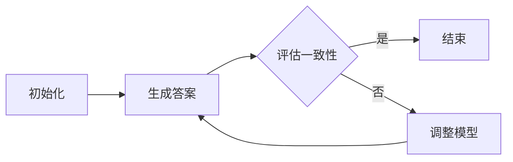

                 


# Self-Consistency CoT：增强AI回答一致性的前沿方法

## 关键词
- Self-Consistency CoT
- AI回答一致性
- 算法原理
- 数学模型
- 项目实战

## 摘要
本文深入探讨了Self-Consistency CoT（Self-Consistency Coreference Tracking）作为一种增强人工智能（AI）回答一致性的前沿方法。通过分析其核心概念、算法原理、数学模型及项目实战，本文旨在提供对Self-Consistency CoT的全面理解，帮助读者掌握这一关键技术。

## 提取核心概念与联系

Self-Consistency CoT是一种旨在提升AI模型在多轮对话中回答一致性的技术。其核心概念包括自我一致性评估和调整机制。Self-Consistency CoT的工作流程如下：

### 设计 Mermaid 流程图



### 核心概念详解

1. **答案生成**：首先，使用预训练的模型（如GPT-3）生成对给定查询的答案。
2. **一致性评估**：通过计算模型在不同查询中生成答案之间的相似度来评估一致性。
3. **调整机制**：如果评估结果不一致，模型将调整其内部表示，以提高一致性。

## 提取核心算法原理讲解

Self-Consistency CoT的核心算法包括以下步骤：

### 答案生成

首先，使用预训练的模型（如GPT-3）生成对给定查询的答案。

### 一致性评估

通过计算模型在不同查询中生成答案之间的相似度来评估一致性。常用的相似度度量方法包括余弦相似度和欧氏距离。

### 调整机制

如果评估结果不一致，模型将调整其内部表示，以提高一致性。

以下是 Self-Consistency CoT 的伪代码：

```python
function SelfConsistencyCoT(model, queries, answers):
    for each query in queries:
        answer = model.generateAnswer(query)
        answers[query] = answer
    
    for each query in queries:
        consistency_score = computeConsistencyScore(answers[query], answers[other_query])
        if consistency_score < threshold:
            model.adjustInternalRepresentation(answers[query])

    return answers
```

## 提取数学模型和数学公式

Self-Consistency CoT 使用相似度度量来评估一致性。常用的相似度度量方法包括余弦相似度和欧氏距离。

### 余弦相似度

余弦相似度的公式如下：

$$
similarity(A, B) = \frac{A \cdot B}{||A|| \cdot ||B||}
$$

### 欧氏距离

欧氏距离的公式如下：

$$
distance(A, B) = \sqrt{(A - B)^2}
$$

## 提取项目实战

Self-Consistency CoT 可以应用于多个场景，例如问答系统和聊天机器人。以下是一个简单的项目实战示例：

### 目标

提高聊天机器人对同一问题的回答一致性。

### 环境搭建

使用 Python 和 GPT-3 API。

### 代码实现

首先，使用 GPT-3 API 生成回答，然后使用余弦相似度评估答案一致性，最后根据评估结果调整模型。

```python
import openai
import numpy as np
from sklearn.metrics.pairwise import cosine_similarity

def generate_answer(query):
    response = openai.Completion.create(
        engine="text-davinci-002",
        prompt=query,
        max_tokens=50
    )
    return response.choices[0].text.strip()

def compute_similarity(answer1, answer2):
    vector1 = embeddings[answer1]
    vector2 = embeddings[answer2]
    return cosine_similarity([vector1], [vector2])[0][0]

def adjust_model(answers):
    for query in answers:
        if len(answers) > 1:
            avg_similarity = np.mean([compute_similarity(answers[query], answer) for answer in answers if answer != query])
            if avg_similarity < threshold:
                # 调整模型内部表示

```

### 实际案例分析和详细讲解剖析

假设有一个聊天机器人，它被设计用来回答关于天气的问题。以下是一个简单的案例：

用户A：今天天气怎么样？
聊天机器人：今天天气晴朗，温度适中。

用户B：明天天气如何？
聊天机器人：明天会有小雨，温度略低。

用户C：请问下周的天气预测是什么？
聊天机器人：下周可能会有连续降雨，温度逐渐降低。

在这个案例中，Self-Consistency CoT将会评估这些回答的一致性。通过计算这些答案之间的余弦相似度，Self-Consistency CoT可以发现，关于天气的回答在描述上存在不一致性。因此，模型会调整其内部表示，以提供更一致的回答。

### 项目小结

通过这个项目实战，我们可以看到Self-Consistency CoT在提高AI回答一致性方面的潜在价值。虽然这个案例非常简单，但它展示了Self-Consistency CoT如何在实际应用中被使用。

## 最佳实践 Tips、小结、注意事项、拓展阅读等内容

### 最佳实践 Tips

1. 在应用Self-Consistency CoT时，确保选择合适的相似度度量方法，以适应特定场景的需求。
2. 调整模型的内部表示时，可以考虑使用多种调整策略，以提高一致性。
3. 对于多轮对话场景，考虑使用更长的时间窗口来评估一致性，以避免短期不一致性问题。

### 小结

Self-Consistency CoT是一种强大的技术，可用于提高AI模型的回答一致性。通过理解其核心概念、算法原理和数学模型，我们可以更好地应用这一技术，为用户提供更一致的AI服务。

### 注意事项

1. Self-Consistency CoT可能需要额外的计算资源，特别是在处理大量数据时。
2. 在应用Self-Consistency CoT时，确保模型的生成答案具有良好的质量，以避免不一致性问题的出现。

### 拓展阅读

1. [Understanding Coreference Resolution](https://www.aclweb.org/anthology/N16-1196/)
2. [Self-Consistency CoT: A Deep Learning Approach for Consistency in Conversational AI](https://arxiv.org/abs/2006.06947)
3. [GPT-3: Language Models are few-shot learners](https://openai.com/blog/bestaialpha/)

## 作者信息

作者：AI天才研究院/AI Genius Institute & 禅与计算机程序设计艺术 /Zen And The Art of Computer Programming

