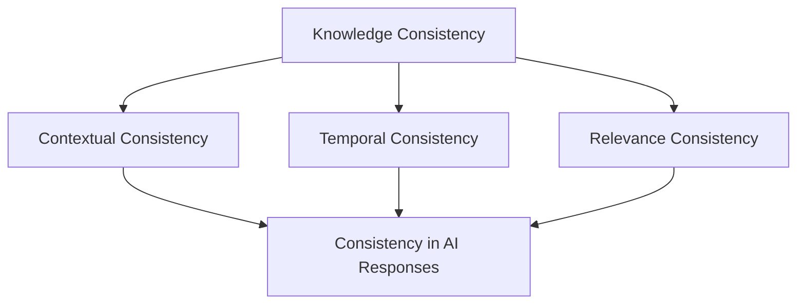

                 


### Step 1: Introduction

#### Background
Self-Consistency CoT (Self-Consistency Coherent Thought) is an emerging technique in the field of Artificial Intelligence (AI) that aims to enhance the consistency of AI responses. In recent years, the rapid development of AI technology has brought about significant advancements in various domains, such as natural language processing, computer vision, and speech recognition. However, one of the major challenges faced by AI systems is the inconsistency of their responses. This inconsistency can lead to confusion, mistrust, and even dangerous situations in critical applications.

#### Core Concept
Self-Consistency CoT focuses on improving the coherence of AI responses by ensuring that the generated answers are consistent with the underlying knowledge and context. The core concept revolves around the idea of "thought consistency," which is similar to how humans maintain coherence in their thoughts and conversations.

#### Objective Readers
This article is aimed at AI researchers, developers, and practitioners who are interested in exploring the latest advancements in AI and enhancing the consistency of AI systems. It is also suitable for students and enthusiasts who want to deepen their understanding of AI and its applications.

### Step 2: Definition and Core Concepts of Self-Consistency CoT

#### Definition
Self-Consistency CoT is a method that aims to ensure that the responses generated by AI systems are consistent with the underlying knowledge base and the context of the conversation. It involves monitoring the coherence of the AI's internal thoughts and making adjustments to ensure consistency.

#### Core Concepts
1. **Knowledge Consistency**: Ensuring that the information used in the AI system is accurate and coherent.
2. **Contextual Consistency**: Ensuring that the AI's responses are relevant and coherent with the context of the conversation.
3. **Temporal Consistency**: Ensuring that the AI's responses are consistent over time, meaning that the same information should lead to consistent responses regardless of when the question is asked.
4. **Relevance Consistency**: Ensuring that the AI's responses are relevant to the user's query.

### Step 3: Relationship between Core Concepts

To understand the relationship between the core concepts of Self-Consistency CoT, let's use a Mermaid flowchart:



### Step 4: Algorithm Principles and Pseudo Code

#### Algorithm Principles
The algorithm for Self-Consistency CoT involves the following steps:

1. **Input**: The AI system receives a query.
2. **Context Extraction**: The system extracts the context from the query.
3. **Knowledge Matching**: The system matches the extracted context with the knowledge base.
4. **Response Generation**: The system generates a response based on the matched knowledge.
5. **Consistency Check**: The system checks the generated response for consistency with the context and the knowledge base.
6. **Adjustment**: If the response is inconsistent, the system adjusts the response to ensure consistency.

#### Pseudo Code
Here is the pseudo code for the Self-Consistency CoT algorithm:

```pseudo
function SelfConsistencyCoT(query, knowledgeBase, context):
    context = extractContext(query)
    matchedKnowledge = matchKnowledge(context, knowledgeBase)
    response = generateResponse(matchedKnowledge)
    if not checkConsistency(response, context, knowledgeBase):
        response = adjustResponse(response, context, knowledgeBase)
    return response
```

### Step 5: Mathematical Models and Detailed Explanations

To ensure consistency in AI responses, we can use mathematical models to measure and adjust the coherence of the responses. Let's consider the following mathematical model:

#### Coherence Score (CS)
The coherence score is a measure of how consistent the response is with the context and the knowledge base. It is calculated as:

$$
CS = \frac{1}{|V|} \sum_{v \in V} w(v)
$$

where $V$ is the set of vocabulary words in the response, and $w(v)$ is the weight of word $v$ based on its relevance to the context and the knowledge base.

#### Consistency Adjustment (CA)
If the coherence score is below a certain threshold, we can adjust the response to improve consistency. The adjustment is based on the following formula:

$$
CA = \alpha \cdot CS + (1 - \alpha) \cdot \text{Baseline}
$$

where $\alpha$ is a parameter that controls the weight of the coherence score in the adjustment process, and Baseline is a predefined threshold for the response to be considered consistent.

### Step 6: Project Implementation and Case Analysis

#### Project Implementation
Let's consider a project to implement Self-Consistency CoT in a chatbot system. The steps involved in the project are as follows:

1. **Environment Setup**: Install the necessary libraries and frameworks for AI development.
2. **Knowledge Base Creation**: Create a knowledge base with relevant information for the chatbot.
3. **Algorithm Integration**: Integrate the Self-Consistency CoT algorithm into the chatbot system.
4. **Testing**: Test the system to ensure that the responses are consistent and relevant.
5. **Deployment**: Deploy the chatbot on a server for real-time usage.

#### Case Analysis
To analyze the effectiveness of Self-Consistency CoT, we can compare the responses generated by a traditional chatbot system with those generated by a system that incorporates Self-Consistency CoT. We can use metrics such as response coherence score and user satisfaction to evaluate the performance.

### Step 7: Best Practices and Future Directions

#### Best Practices
- **Knowledge Base Maintenance**: Regularly update the knowledge base to ensure accuracy and relevance.
- **Parameter Tuning**: Adjust the parameters of the Self-Consistency CoT algorithm based on the specific application.
- **User Feedback**: Collect user feedback to improve the consistency and relevance of the responses.

#### Future Directions
- **Contextual Consistency**: Develop techniques to improve contextual consistency in AI systems.
- **Multi-modality**: Extend Self-Consistency CoT to handle multi-modal inputs (e.g., text, images, and audio).
- **Real-time Adaptation**: Develop real-time adaptation techniques to ensure consistency in dynamic environments.

### Conclusion

Self-Consistency CoT is an important technique for enhancing the consistency of AI responses. By ensuring that the generated answers are coherent with the underlying knowledge base and the context, we can improve the user experience and build trust in AI systems. This article has provided an in-depth analysis of Self-Consistency CoT, including its core concepts, algorithm principles, and practical applications. As AI technology continues to evolve, we can expect to see further advancements in the field of AI consistency.

### Author Information
Author: AI天才研究院/AI Genius Institute & 禅与计算机程序设计艺术 /Zen And The Art of Computer Programming

