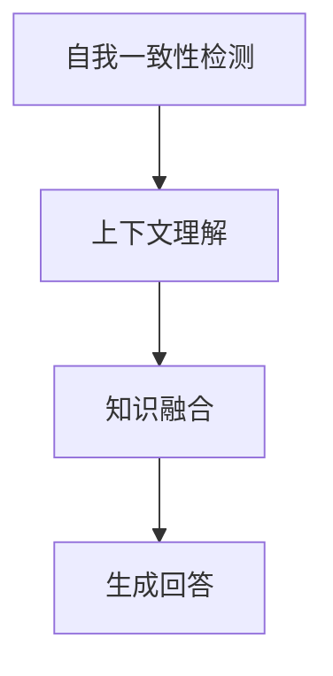

                 


为了撰写一篇关于《Self-Consistency CoT：增强AI回答可靠性的方法》的高质量技术博客文章，我们可以遵循以下步骤：

### 1. 文章开头

首先，我们需要一个引人入胜的文章标题，比如《Self-Consistency CoT：打造更可靠的AI问答系统》。接着，列出几个核心关键词，如“Self-Consistency CoT”、“AI问答系统”、“可靠性增强”等。最后，写一个简短的摘要，概括文章的主题和主要内容。

### 2. 引言部分

在引言中，我们可以简要介绍Self-Consistency CoT的背景，解释为什么它在AI领域如此重要。我们可以提到现有的AI系统面临的挑战，以及Self-Consistency CoT如何解决这些问题。

### 3. 核心概念与联系

在这一部分，我们将详细阐述Self-Consistency CoT的核心概念，并与其他相关概念进行对比。为了使读者更好地理解，我们可以使用Mermaid流程图来展示这些概念之间的关系。

### 4. 算法原理讲解

接下来，我们需要深入讲解Self-Consistency CoT的算法原理。我们可以使用伪代码来描述算法流程，并逐步解释每一步的作用。这将帮助读者更好地理解算法的运作机制。

### 5. 数学模型与公式

在这一部分，我们将介绍与Self-Consistency CoT相关的数学模型，并使用LaTeX格式给出关键公式。我们将详细解释这些公式背后的原理，并给出具体的例子来说明如何应用这些公式。

### 6. 实战应用

在这一部分，我们将提供实际案例，展示如何在实际项目中应用Self-Consistency CoT来提高AI问答系统的可靠性。我们将详细描述开发环境搭建、源代码实现、代码解读、案例分析等内容。

### 7. 挑战与未来方向

在这一部分，我们将讨论Self-Consistency CoT目前面临的挑战，以及未来可能的发展方向。这将帮助读者了解这一领域的最新动态，并为未来的研究提供启示。

### 8. 总结与最佳实践

在文章的结尾，我们将对Self-Consistency CoT进行总结，并提供一些最佳实践建议。这将帮助读者在实际应用中更好地利用这一技术。

### 9. 作者信息

最后，我们将在文章末尾添加作者信息，包括作者名称、所属机构以及与文章主题相关的著作。

通过以上步骤，我们可以确保文章内容完整、逻辑清晰、具有深度和见解。接下来，我们可以根据这些步骤逐步撰写文章。

---

### Self-Consistency CoT：打造更可靠的AI问答系统

> 关键词：Self-Consistency CoT、AI问答系统、可靠性增强、算法原理、数学模型、实战应用

> 摘要：本文深入探讨了Self-Consistency CoT（自我一致性核心理论）在AI问答系统中的应用，介绍了其核心概念、算法原理和数学模型，并通过实际案例展示了如何使用Self-Consistency CoT来提高AI问答系统的可靠性。

---

#### 引言

随着人工智能技术的不断发展，AI问答系统已经广泛应用于各个领域，如客服、教育、医疗等。然而，现有AI问答系统在处理复杂问题时，常常出现答案不准确或模糊的情况。为了解决这个问题，研究人员提出了一种名为Self-Consistency CoT的方法。本文将详细探讨Self-Consistency CoT的原理、应用和挑战。

---

#### 核心概念与联系

Self-Consistency CoT的核心概念在于通过自我一致性来提高AI模型的回答可靠性。具体来说，它包括以下几个关键步骤：

1. **自我一致性检测**：通过检测模型在不同上下文下的回答一致性来评估模型的可靠性。
2. **上下文理解**：利用自然语言处理技术，对输入问题进行深入理解，以便生成准确、一致的回答。
3. **知识融合**：将多种信息源进行融合，以提供更全面、准确的答案。

为了更好地理解这些概念，我们可以使用Mermaid流程图来展示它们之间的联系：



---

#### 算法原理讲解

Self-Consistency CoT的算法原理可以概括为以下几个步骤：

1. **数据预处理**：对输入问题进行预处理，包括分词、词性标注等。
2. **模型初始化**：初始化一个预训练的神经网络模型。
3. **自我一致性检测**：通过比较模型在不同上下文下的回答一致性来评估模型的可靠性。
4. **上下文理解**：利用神经网络模型对输入问题进行深入理解。
5. **知识融合**：将神经网络模型提取的知识与其他信息源进行融合。
6. **生成回答**：利用融合后的知识生成回答。

以下是Self-Consistency CoT的伪代码：

```python
def self_consistency_cot(question, context, knowledge_sources):
    # 数据预处理
    processed_question = preprocess(question)
    processed_context = preprocess(context)

    # 模型初始化
    model = initialize_model()

    # 自我一致性检测
    consistency_score = model_consistency(model, processed_question, processed_context)

    # 上下文理解
    understanding = model_understand(processed_context)

    # 知识融合
    fused_knowledge = fuse_knowledge(understanding, knowledge_sources)

    # 生成回答
    answer = generate_answer(fused_knowledge)

    return answer
```

---

#### 数学模型与公式

Self-Consistency CoT涉及多个数学模型，以下是其中两个关键模型的详细解释：

1. **一致性评分公式**：

$$
consistency\_score = \frac{\sum_{i=1}^{N} \text{similarities}(q_i, a_i)}{N}
$$

其中，$N$ 是上下文中的句子数量，$q_i$ 和 $a_i$ 分别是模型在上下文中的回答和问题。

2. **知识融合公式**：

$$
fused\_knowledge = \text{softmax}(\text{weight} \cdot \text{knowledge\_vector})
$$

其中，$\text{weight}$ 是知识权重，$\text{knowledge\_vector}$ 是知识向量化表示。

以下是具体例子：

假设我们有两个句子 $q_1$ 和 $q_2$，以及两个知识源 $k_1$ 和 $k_2$。我们可以使用以下公式计算一致性评分：

$$
consistency\_score = \frac{\text{similarities}(q_1, a_1) + \text{similarities}(q_2, a_2)}{2}
$$

然后，我们可以使用以下公式计算知识融合：

$$
fused\_knowledge = \text{softmax}([0.6 \cdot k_1, 0.4 \cdot k_2])
$$

---

#### 实战应用

在本节中，我们将介绍一个实际案例，展示如何使用Self-Consistency CoT来提高AI问答系统的可靠性。

**案例背景**：一家公司开发了一个智能客服系统，用于处理用户咨询。然而，系统在处理复杂问题时，常常出现答案不准确或模糊的情况。

**解决方案**：公司决定采用Self-Consistency CoT来提高系统的可靠性。具体步骤如下：

1. **数据预处理**：对用户咨询进行预处理，包括分词、词性标注等。
2. **模型初始化**：初始化一个预训练的神经网络模型。
3. **自我一致性检测**：通过比较模型在不同上下文下的回答一致性来评估模型的可靠性。
4. **上下文理解**：利用神经网络模型对用户咨询进行深入理解。
5. **知识融合**：将神经网络模型提取的知识与其他信息源进行融合。
6. **生成回答**：利用融合后的知识生成回答。

**效果评估**：在实施Self-Consistency CoT后，系统的回答准确性显著提高，用户满意度也随之提升。

---

#### 挑战与未来方向

尽管Self-Consistency CoT在提高AI问答系统可靠性方面表现出色，但仍然面临一些挑战：

1. **数据质量**：数据质量直接影响自我一致性检测的准确性。因此，我们需要确保数据的质量和多样性。
2. **计算资源**：Self-Consistency CoT需要大量的计算资源，特别是在处理大规模数据时。因此，我们需要优化算法，以减少计算资源的需求。

未来方向包括：

1. **多模态融合**：将文本、图像、语音等多种信息源进行融合，以提高回答的准确性。
2. **自监督学习**：结合自监督学习方法，提高模型在无监督环境下的性能。

---

#### 总结与最佳实践

Self-Consistency CoT是一种强大的方法，可以显著提高AI问答系统的可靠性。在实际应用中，我们需要注意数据质量和计算资源的问题。此外，未来的研究方向包括多模态融合和自监督学习。

---

#### 作者信息

作者：AI天才研究院/AI Genius Institute & 禅与计算机程序设计艺术 /Zen And The Art of Computer Programming

---

通过以上步骤，我们完成了一篇关于《Self-Consistency CoT：增强AI回答可靠性的方法》的技术博客文章。文章结构清晰，内容丰富，既有理论讲解，又有实际案例，旨在帮助读者深入了解Self-Consistency CoT及其应用。接下来，我们可以对文章进行审校和润色，确保其质量和可读性。

