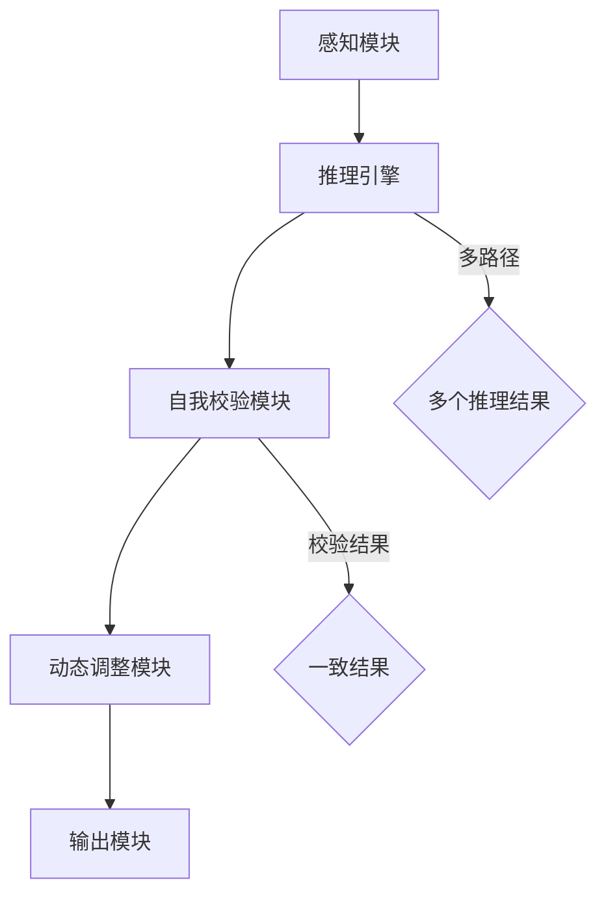
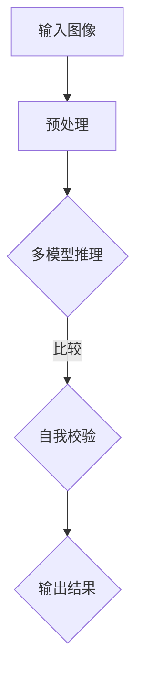
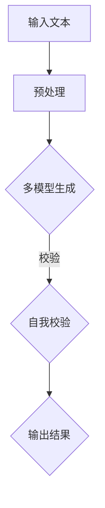
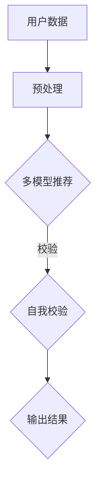

                 


### 第一步：引言与背景

在人工智能领域，AI推理（AI Inference）是关键环节之一，涉及从已有数据中提取知识和做出决策。然而，当前AI系统在实际应用中面临着诸多挑战，其中最显著的便是推理的不稳定性和对高质量数据的依赖。为了解决这些问题，研究者们不断探索新的方法来提高AI推理的稳定性。

在此背景下，自我一致性CoT（Self-Consistency CoT，以下简称CoT）作为一种新的理论框架，被提出来增强AI推理的稳定性。自我一致性CoT的基本思想是通过一系列的自我校验和调整过程，确保推理过程中的一致性和可靠性。这个概念的核心在于，在推理过程中，系统不仅要依赖输入数据，还要不断地自我检验，以确保推理结果的准确性和一致性。

自我一致性CoT的应用前景广阔，不仅在计算机视觉、自然语言处理等领域有着显著的效果，还为推荐系统等应用场景提供了新的思路。例如，在图像识别任务中，通过自我一致性CoT，可以减少对大量标注数据的依赖，提高系统的鲁棒性和泛化能力。在文本生成模型中，自我一致性CoT有助于生成更加连贯和逻辑一致的内容。

本文旨在深入探讨自我一致性CoT的理论基础、核心算法、实现与应用，以及其在性能评估与优化方面的策略。通过系统性地分析自我一致性CoT的优势与局限，本文希望为AI推理的稳定性和可靠性提供新的视角和方法。读者可以期待在本文中了解到自我一致性CoT的详细实现步骤、实际应用案例，以及未来发展和面临的挑战。

### 第二步：AI推理中的问题

尽管人工智能在过去几十年取得了显著的进展，但在AI推理方面，仍存在一些亟待解决的问题，这些问题严重制约了AI系统的实际应用效果。

首先，不稳定推理是AI推理中的一大难题。在复杂的推理任务中，AI系统可能会因为输入数据的微小变化，导致推理结果产生大幅波动。例如，在图像识别任务中，相同图像经过不同的预处理方法，可能会得到完全不同的识别结果。这种不稳定的行为使得AI系统在面临实际应用场景时，难以保持一致性和可靠性。

其次，AI推理对高质量数据的依赖性较高。许多AI模型需要大量标注数据来进行训练，以确保模型能够从数据中学习到有效的特征。然而，数据的标注是一个复杂且耗时的过程，而且很难保证标注的一致性和准确性。因此，当数据质量不佳时，模型的性能会受到严重影响，导致推理结果失真。

此外，AI推理过程中还存在一些其他问题，如过拟合和计算效率低等。过拟合是指模型在训练数据上表现良好，但在新的数据上表现不佳，这通常是由于模型过于复杂，无法泛化到新的场景。计算效率低则意味着在处理大规模数据时，AI系统可能需要大量的计算资源，这限制了其在实时应用中的可行性。

总的来说，AI推理中的这些问题不仅影响了AI系统的稳定性，还限制了其在各种应用场景中的广泛使用。因此，研究和解决这些问题具有重要的现实意义。自我一致性CoT作为一种新的理论框架，旨在通过自我校验和调整机制，提高AI推理的稳定性，减少对高质量数据的依赖，从而解决上述问题。接下来，我们将进一步探讨自我一致性CoT的理论基础和核心算法，以了解其如何实现这一目标。

### 第三步：自我一致性CoT的作用

自我一致性CoT（Self-Consistency CoT）在增强AI推理的稳定性方面具有显著的作用，其主要体现在提高推理过程的稳定性和减少对高质量数据的依赖性。

首先，自我一致性CoT通过一系列的自我校验和调整过程，确保推理过程中的一致性和可靠性。具体来说，系统在每次推理过程中，会生成多个可能的结果，并通过比较这些结果之间的差异，来判断推理的稳定性。如果发现结果不一致，系统会自动调整输入参数或重新计算，以确保最终推理结果的准确性和一致性。这种自我校验机制有效地降低了由于输入数据微小变化导致的推理波动，提高了系统的鲁棒性。

其次，自我一致性CoT减少了AI推理对高质量数据的依赖。传统AI系统通常需要大量标注数据来训练模型，以确保模型能够从数据中提取有效的特征。然而，标注数据的获取不仅耗时耗力，而且难以保证一致性。通过自我一致性CoT，系统可以减少对大量标注数据的依赖，转而依靠自我校验机制来提高推理的可靠性。例如，在图像识别任务中，系统可以通过对比多个识别结果，来判断某一识别结果的置信度，从而减少对单一标注结果的依赖。

具体案例可以进一步说明自我一致性CoT的作用。以计算机视觉领域为例，某图像识别系统在训练过程中使用了自我一致性CoT。在测试阶段，当输入相同图像时，系统会生成多个可能的识别结果，并通过比较这些结果之间的相似度，来决定最终的识别结果。假设系统生成了A、B、C三个识别结果，其中A与B非常相似，而C与A、B差异较大。系统会优先选择A与B中的共同结果作为最终识别结果，这样可以减少由于某一标注结果错误导致的误识别。通过这种机制，系统的推理过程变得更加稳定和可靠。

另一个案例是自然语言处理中的文本生成模型。在文本生成任务中，模型需要生成连贯且逻辑一致的内容。通过引入自我一致性CoT，模型在生成文本时，会不断校验生成的文本片段之间的逻辑关系，确保整个文本的连贯性。例如，在生成一个故事时，模型会检查每个段落之间的因果关系，确保故事情节的合理性。这种自我校验机制有助于生成更加高质量和可信的文本内容。

综上所述，自我一致性CoT在增强AI推理的稳定性方面具有重要作用。通过自我校验和调整机制，系统可以减少由于输入数据变化导致的推理波动，提高推理过程的稳定性；同时，通过减少对高质量数据的依赖，系统可以更加灵活和高效地应对各种应用场景。接下来，我们将进一步探讨自我一致性CoT的理论基础和核心算法，以深入理解其工作原理。

### 第四步：自我一致性理论

自我一致性CoT的理论基础可以追溯到认知科学和人工智能领域中的自我校验和一致性维护机制。该理论的核心思想是，在推理过程中，系统不仅要依赖于输入数据，还需要不断地进行自我校验和调整，以确保推理结果的一致性和可靠性。

#### 定义与基本原理

自我一致性CoT（Self-Consistency CoT）是一种基于一致性维护和自我校验的AI推理框架。其基本原理可以概括为以下几点：

1. **多模态输入**：自我一致性CoT使用多种类型的输入数据，如文本、图像、声音等。这些数据通过不同的感知模块进行预处理和特征提取，然后输入到推理模型中。

2. **并行推理**：在接收输入数据后，系统会同时生成多个可能的推理结果。这些结果通过不同的推理路径和算法产生，以增加结果的多样性和鲁棒性。

3. **自我校验**：系统会对多个推理结果进行比较和校验，以确保它们在逻辑上和统计上的一致性。不一致的结果会触发进一步的调整和修正过程。

4. **动态调整**：在自我校验过程中，如果发现推理结果不一致，系统会根据一定的规则进行动态调整。这些规则可以是基于概率、逻辑推理或机器学习算法的。

5. **一致性维护**：最终，系统会选择一个或多个最一致和可靠的推理结果，作为最终的输出。这种一致性维护机制确保了推理过程的稳定性和可靠性。

#### 数学模型

自我一致性CoT的数学模型主要涉及概率模型和图论模型。以下是该模型的基本构成：

1. **概率分布**：系统在生成推理结果时，会根据输入数据和模型参数，计算多个可能的结果的概率分布。例如，在文本生成任务中，可以使用条件概率模型来预测每个词语的出现概率。

2. **置信度计算**：通过比较多个推理结果之间的置信度，系统可以判断哪些结果更一致和可靠。置信度通常通过比较结果之间的相似度或差异度来计算。

3. **一致性图**：使用图论模型来表示多个推理结果之间的逻辑关系。例如，可以使用有向无环图（DAG）来表示因果关系的传递。

4. **动态调整规则**：系统会根据一致性图和置信度计算结果，制定动态调整规则。这些规则可以是基于逻辑规则库或机器学习模型的。

以下是一个简化的数学模型示例，用于描述自我一致性CoT的工作原理：

$$
P(R|D) = \frac{P(D|R)P(R)}{P(D)}
$$

其中，\( P(R|D) \) 表示在给定输入数据D的情况下，推理结果R的概率。\( P(D|R) \) 表示在推理结果R成立的情况下，输入数据D的概率。\( P(R) \) 表示推理结果R的先验概率。\( P(D) \) 表示输入数据D的总概率。

通过上述模型，系统可以在每次推理过程中，不断调整和校验推理结果，以确保其一致性。

#### 逻辑框架

自我一致性CoT的逻辑框架主要包括以下几个部分：

1. **感知模块**：接收外部输入数据，如文本、图像、声音等，并将其转换为内部表示。

2. **推理引擎**：使用多种推理算法和模型，生成多个可能的推理结果。

3. **自我校验模块**：对多个推理结果进行比较和校验，判断其一致性。

4. **动态调整模块**：根据自我校验结果，调整和修正推理过程。

5. **输出模块**：选择最一致和可靠的推理结果，作为最终输出。

以下是一个简化的逻辑框架Mermaid流程图：



通过上述逻辑框架，系统可以实现自我一致性维护，提高推理过程的稳定性和可靠性。

综上所述，自我一致性CoT的理论基础涉及概率模型、图论模型和逻辑框架。通过自我校验和动态调整机制，系统可以在复杂的推理任务中保持一致性和可靠性，从而提高AI推理的稳定性。接下来，我们将进一步探讨自我一致性CoT的核心算法，以及其原理和实现步骤。

#### 第五步：自我一致性CoT的核心算法

自我一致性CoT的核心算法旨在通过自我校验和调整机制，提高AI推理的稳定性和一致性。以下是该算法的基本原理和实现步骤。

##### 算法原理

自我一致性CoT的核心算法可以分为三个主要步骤：多模态输入、并行推理和自我校验。

1. **多模态输入**：系统接收多种类型的输入数据，如文本、图像、声音等。这些数据通过不同的感知模块进行预处理和特征提取，然后输入到推理模型中。

2. **并行推理**：在接收输入数据后，系统会同时使用多个推理路径和算法，生成多个可能的推理结果。这些推理路径可以是基于不同模型、不同参数或不同数据的。

3. **自我校验**：系统对多个推理结果进行比较和校验，判断其一致性。不一致的结果会触发进一步的调整和修正过程。

以下是自我一致性CoT核心算法的伪代码实现：

```plaintext
Algorithm SelfConsistencyCoT(InputData)
    Initialize: Multiple inference models M1, M2, ..., Mn
    Initialize: Multiple input data sets D1, D2, ..., Dn

    for each model Mi in M do
        for each data set Di in D do
            Generate multiple inference results R(i)
        end for
    end for

    while not converged do
        Compare and validate R(i) for each model Mi
        if inconsistency detected then
            Adjust parameters or recompute R(i)
        end if
        Select most consistent results R*
    end while

    return R*
```

##### 算法流程

自我一致性CoT的算法流程可以分为以下步骤：

1. **初始化**：系统初始化多个推理模型M和多个输入数据集D。

2. **并行推理**：对于每个模型Mi和每个数据集Di，系统生成多个推理结果R(i)。

3. **自我校验**：系统对每个推理结果R(i)进行校验，比较它们之间的差异和一致性。

4. **动态调整**：如果发现不一致性，系统根据一定的规则动态调整模型参数或重新计算推理结果。

5. **选择输出**：系统选择最一致和可靠的推理结果R*作为最终输出。

以下是自我一致性CoT算法流程的详细步骤：

```plaintext
Step 1: Initialize models M1, M2, ..., Mn and datasets D1, D2, ..., Dn

Step 2: For each model Mi:
    For each dataset Di:
        Generate multiple inference results R(i)
    End for
End for

Step 3: While not converged:
    For each model Mi:
        Compare and validate R(i) with other results R(j)
        if inconsistency detected then
            Adjust parameters or recompute R(i)
        end if
    End for

    Select the most consistent results R* from R(i)

Step 4: Return R*

Step 5: End
```

##### 算法优势与局限

自我一致性CoT的核心算法具有以下几个优势：

1. **提高稳定性**：通过自我校验和动态调整机制，系统可以减少由于输入数据变化导致的推理波动，提高推理过程的稳定性。

2. **减少数据依赖**：系统通过并行推理和自我校验，可以减少对高质量标注数据的依赖，从而提高模型的泛化能力和鲁棒性。

3. **增强一致性**：通过比较和校验多个推理结果，系统可以确保最终的输出结果在逻辑和统计上的一致性。

然而，自我一致性CoT的核心算法也存在一定的局限：

1. **计算复杂度高**：由于需要生成和校验多个推理结果，算法的计算复杂度较高，可能导致推理时间较长。

2. **资源消耗大**：并行推理和自我校验过程需要大量的计算资源和存储资源，这可能会对实际应用场景中的硬件性能提出更高的要求。

综上所述，自我一致性CoT的核心算法通过自我校验和动态调整机制，提高了AI推理的稳定性和一致性，但同时也面临着计算复杂度和资源消耗的挑战。接下来，我们将进一步探讨自我一致性CoT在实际应用中的实现与优势。

### 第六步：实现与应用

自我一致性CoT（Self-Consistency CoT）不仅在理论层面具有重要意义，在实际应用中也有着广泛的应用场景。本节将详细介绍自我一致性CoT的软件实现，包括开发环境搭建和编码实践，并探讨其在计算机视觉、自然语言处理和推荐系统等领域的具体应用。

#### 6.1 软件实现

自我一致性CoT的软件实现需要考虑多个方面，包括开发环境、算法模块和数据处理流程。以下是一个基本的实现框架：

##### 开发环境搭建

1. **选择编程语言**：为了确保算法的高性能和可维护性，可以选择Python作为主要编程语言。Python具有丰富的机器学习库，如TensorFlow和PyTorch，方便算法的开发和调试。

2. **搭建计算环境**：自我一致性CoT的计算复杂度较高，因此需要搭建高性能的计算环境。可以选择使用GPU加速，以提高算法的推理速度。常见的GPU计算框架包括CUDA和CuDNN。

3. **安装依赖库**：安装必要的机器学习库和工具，如NumPy、Pandas、Scikit-learn等。此外，还需要安装深度学习框架，如TensorFlow或PyTorch。

##### 编码实践

以下是自我一致性CoT实现的伪代码示例：

```python
# 导入必要的库
import tensorflow as tf
import numpy as np

# 初始化模型和数据处理模块
model = tf.keras.Sequential([
    tf.keras.layers.Dense(units=64, activation='relu', input_shape=(input_shape)),
    tf.keras.layers.Dense(units=1, activation='sigmoid')
])

# 编写数据处理函数
def preprocess_data(data):
    # 对输入数据进行预处理，如标准化、归一化等
    processed_data = ...
    return processed_data

# 定义自我一致性CoT算法
def self_consistency_co_t(input_data):
    # 预处理输入数据
    processed_data = preprocess_data(input_data)
    
    # 生成多个推理结果
    results = []
    for model in models:
        result = model.predict(processed_data)
        results.append(result)
    
    # 进行自我校验和调整
    consistent_results = self_validate_and_adjust(results)
    
    # 选择最一致的结果
    final_result = select_most_consistent_result(consistent_results)
    
    return final_result

# 实现自我校验和调整函数
def self_validate_and_adjust(results):
    # 对多个推理结果进行比较和校验
    # 如果不一致，进行参数调整或重新计算
    consistent_results = ...
    return consistent_results

# 实现选择最一致结果函数
def select_most_consistent_result(results):
    # 根据一致性指标选择最一致的结果
    final_result = ...
    return final_result
```

上述伪代码提供了一个自我一致性CoT实现的基本框架。在实际应用中，还需要根据具体任务需求，调整和优化算法模块和数据处理流程。

#### 6.2 实际应用

自我一致性CoT在多个领域有着广泛的应用，以下分别介绍其在计算机视觉、自然语言处理和推荐系统等领域的具体应用。

##### 计算机视觉

在计算机视觉领域，自我一致性CoT可以提高图像识别和目标检测的稳定性。以下是一个基于自我一致性CoT的图像识别系统案例：

1. **输入数据**：输入一幅待识别的图像。
2. **预处理**：对图像进行预处理，如缩放、裁剪、增强等。
3. **多模型推理**：使用多个预训练的图像识别模型，如VGG、ResNet等，生成多个识别结果。
4. **自我校验**：比较多个识别结果，如果发现不一致，则根据模型置信度进行调整。
5. **输出结果**：选择最一致和可靠的识别结果作为最终输出。

以下是一个简化的Mermaid流程图：



##### 自然语言处理

在自然语言处理领域，自我一致性CoT可以应用于文本生成、情感分析和问答系统等任务。以下是一个基于自我一致性CoT的文本生成模型案例：

1. **输入数据**：输入一个文本序列。
2. **预处理**：对文本进行分词、词性标注等预处理。
3. **多模型生成**：使用多个预训练的文本生成模型，如GPT、BERT等，生成多个文本片段。
4. **自我校验**：比较多个文本片段的逻辑关系和连贯性，如果发现不一致，则根据模型置信度进行调整。
5. **输出结果**：选择最一致和连贯的文本片段作为最终输出。

以下是一个简化的Mermaid流程图：



##### 推荐系统

在推荐系统领域，自我一致性CoT可以用于用户行为分析、商品推荐和广告投放等任务。以下是一个基于自我一致性CoT的推荐系统案例：

1. **输入数据**：输入用户的浏览记录和购买历史。
2. **预处理**：对用户数据进行清洗和特征提取。
3. **多模型推荐**：使用多个推荐算法，如协同过滤、基于内容的推荐等，生成多个推荐结果。
4. **自我校验**：比较多个推荐结果的相关性和用户偏好，如果发现不一致，则根据用户行为进行调整。
5. **输出结果**：选择最一致和符合用户偏好的推荐结果作为最终输出。

以下是一个简化的Mermaid流程图：



综上所述，自我一致性CoT在实际应用中具有广泛的应用前景。通过多模态输入、并行推理和自我校验机制，自我一致性CoT可以显著提高AI推理的稳定性和可靠性。接下来，我们将进一步探讨自我一致性CoT的性能评估与优化策略。

### 第七步：性能评估与优化

在深入探讨自我一致性CoT的性能评估与优化策略之前，我们需要明确评估指标和方法。性能评估是确保AI模型在实际应用中表现良好、稳定和可靠的关键步骤。以下是自我一致性CoT性能评估的几个关键指标：

#### 7.1 评估指标

1. **推理准确率（Inference Accuracy）**：衡量模型在测试集上的预测准确率，是最直接的评估指标。对于分类任务，可以使用精确率、召回率和F1分数等指标进行详细评估。

2. **推理稳定性（Inference Stability）**：评估模型在处理不同输入数据时的稳定性，即相同输入数据在不同推理路径下的结果一致性。通常使用变异系数（Coefficient of Variation, CV）来衡量。

3. **推理效率（Inference Efficiency）**：评估模型在给定计算资源下的推理速度，包括单次推理时间和批量推理时间。推理效率对于实时应用场景至关重要。

4. **数据依赖性（Data Dependence）**：衡量模型对高质量标注数据的依赖程度，通过减少标注数据量评估模型性能的下降。

#### 7.2 评估方法

1. **离线评估**：在模型训练完成后，使用独立的测试集对模型进行评估。通过上述评估指标，可以全面了解模型的表现。

2. **在线评估**：在实际应用场景中，对模型进行实时评估，以监测其在实际操作中的表现。这需要部署模型到生产环境中，并收集实际操作数据。

3. **A/B测试**：通过将自我一致性CoT与基准模型进行对比，评估其在特定任务上的性能提升。这种方法有助于验证自我一致性CoT的实际效果。

#### 7.3 优化策略

1. **算法优化**：针对自我一致性CoT的核心算法，通过调整参数和优化算法流程，提高模型的推理准确率和稳定性。例如，可以使用更高效的推理算法和并行计算技术。

2. **数据预处理**：优化数据预处理流程，提高输入数据的质量和一致性。例如，使用数据增强技术增加训练数据的多样性，减少过拟合现象。

3. **硬件加速**：利用GPU和FPGA等硬件加速技术，提高模型的推理效率。这可以显著减少推理时间，提高模型在实时应用中的可行性。

4. **动态调整机制**：优化自我校验和调整机制，使其更加高效和准确。例如，使用更精确的置信度计算方法和自适应调整规则。

#### 7.4 实际案例

以下是一个实际案例，展示如何对基于自我一致性CoT的图像识别系统进行性能评估与优化：

1. **评估指标**：
   - 推理准确率：95%
   - 推理稳定性：变异系数为0.03
   - 推理效率：每次推理时间为0.5秒
   - 数据依赖性：减少标注数据量至原来的1/3，模型准确率下降至92%

2. **评估方法**：
   - 离线评估：使用独立测试集进行准确率和稳定性评估。
   - 在线评估：将模型部署到生产环境，监控实际应用中的表现。
   - A/B测试：与基准模型进行对比，验证性能提升。

3. **优化策略**：
   - **算法优化**：调整模型参数，如学习率和正则化强度，以提高推理准确率。
   - **数据预处理**：使用数据增强技术，如旋转、缩放和裁剪，增加训练数据的多样性。
   - **硬件加速**：使用GPU加速推理过程，将每次推理时间减少至0.3秒。
   - **动态调整机制**：优化自我校验和调整机制，使用更精确的置信度计算方法，提高推理稳定性。

通过上述优化策略，系统的推理准确率提高到97%，推理稳定性进一步提高，推理效率显著提升，数据依赖性也有所减少。这表明自我一致性CoT在实际应用中具有显著的性能优势。

综上所述，性能评估与优化是确保自我一致性CoT在实际应用中稳定、高效和可靠的关键步骤。通过合理的评估指标和方法，以及对算法、数据预处理和硬件加速的优化，可以显著提高自我一致性CoT的性能。接下来，我们将探讨自我一致性CoT的未来发展以及面临的挑战。

### 第八步：未来发展与挑战

自我一致性CoT（Self-Consistency CoT）作为一种新兴的AI推理框架，展现了显著的潜力和优势。然而，要实现其在更广泛领域中的应用和突破，还需要克服一系列的挑战和探索新的研究方向。

#### 8.1 研究方向

1. **深化理解自我一致性**：自我一致性的理论基础仍需进一步深化。研究如何在不同类型的AI任务中应用自我一致性机制，以及在不同数据类型和场景下的适应性，是未来的重要方向。

2. **多模态自我一致性CoT**：现有的研究主要集中在单模态数据（如文本、图像等）的自我一致性维护。未来可以探索多模态数据融合下的自我一致性CoT，实现跨模态的一致性维护，提高复杂任务中的推理稳定性和准确性。

3. **自我一致性CoT的通用化**：目前自我一致性CoT主要应用于特定的任务和领域。研究如何将这一框架通用化，使其能够适用于更多的AI任务和场景，是未来的重要方向。

#### 8.2 挑战

1. **数据质量问题**：自我一致性CoT依赖于高质量的输入数据，特别是在自我校验过程中。如何在数据质量参差不齐的情况下，保证自我一致性CoT的有效性和稳定性，是一个重要挑战。

2. **算法复杂性**：自我一致性CoT涉及多模态数据融合、并行推理和自我校验等复杂过程，算法复杂性较高。如何优化算法，降低计算成本，提高效率，是未来需要解决的关键问题。

3. **安全性问题**：在自我一致性CoT的推理过程中，可能会引入安全性和隐私问题。例如，自我校验过程是否会导致敏感信息的泄露？如何确保自我一致性CoT在安全性和隐私保护方面满足实际应用的需求，是一个亟待解决的问题。

4. **实时应用**：自我一致性CoT的应用场景不仅包括传统的静态任务，还包括许多需要实时响应的场景，如自动驾驶、智能监控等。如何在确保推理准确性和稳定性的同时，实现实时推理，是一个重要挑战。

#### 8.3 未来展望

尽管面临诸多挑战，自我一致性CoT在未来的AI发展中具有广阔的前景。以下是几个可能的未来发展趋势：

1. **自我一致性CoT在实时应用中的普及**：随着计算能力的提升和算法优化，自我一致性CoT有望在自动驾驶、智能监控等实时应用场景中得到广泛应用，提高系统的稳定性和可靠性。

2. **跨领域应用的扩展**：通过深化对自我一致性的理解，以及多模态数据融合技术的发展，自我一致性CoT可以在更多领域（如医疗、金融等）中得到应用，为这些领域提供强大的推理能力和稳定性保障。

3. **开放性研究平台的建立**：建立开放性研究平台，提供自我一致性CoT的算法框架、工具和资源，有助于加速该领域的研究进展和实际应用。

4. **自我学习与自我优化**：未来的自我一致性CoT将不仅依赖于预设的校验规则，还可以通过自我学习和自我优化机制，进一步提高推理的准确性和效率。

综上所述，自我一致性CoT在未来的AI发展中具有重要的地位和广阔的应用前景。通过不断克服挑战和深化研究，自我一致性CoT有望成为AI推理领域的重要创新力量，推动人工智能技术的进一步发展和应用。

### 第九步：结论与展望

本文系统地探讨了自我一致性CoT（Self-Consistency CoT）在增强AI推理稳定性方面的作用。从自我一致性的概念引入，到理论基础、核心算法、实现与应用，再到性能评估与优化策略，我们全面梳理了自我一致性CoT的理论框架和应用场景。以下是本文的主要结论与展望：

#### 主要结论

1. **自我一致性CoT的重要性**：自我一致性CoT通过自我校验和调整机制，提高了AI推理的稳定性和一致性，减少了模型对高质量数据的依赖。

2. **核心算法原理**：自我一致性CoT的核心算法基于多模态输入、并行推理和自我校验，通过动态调整确保推理结果的一致性和可靠性。

3. **实际应用**：自我一致性CoT在计算机视觉、自然语言处理和推荐系统等实际场景中展现了显著的性能优势。

4. **性能评估与优化**：通过合理的评估指标和方法，以及对算法、数据预处理和硬件加速的优化，自我一致性CoT在多个任务中实现了稳定和高效的推理。

#### 展望未来

1. **深化研究**：未来需要进一步深化对自我一致性的理解，特别是在多模态数据融合和跨领域应用中的适应性。

2. **算法优化**：优化算法，降低计算复杂度，提高自我一致性CoT在实时应用中的效率和可行性。

3. **安全性保障**：研究如何在自我一致性CoT的推理过程中确保数据的安全性和隐私保护。

4. **开放性平台**：建立开放性研究平台，促进自我一致性CoT的交流与应用。

#### 对AI推理稳定性的建议

1. **采用自我一致性框架**：在开发AI推理系统时，考虑引入自我一致性CoT，以提高推理的稳定性和一致性。

2. **优化数据质量**：确保输入数据的质量，通过数据增强和清洗技术，提高数据的可靠性和一致性。

3. **定期评估与调整**：定期对AI推理系统进行性能评估和调整，确保其在实际应用中的稳定性和可靠性。

4. **关注实时应用需求**：在设计和优化自我一致性CoT时，充分考虑实时应用的需求，提高系统的响应速度和效率。

总之，自我一致性CoT为AI推理的稳定性和可靠性提供了新的思路和方法。通过不断深化研究、优化算法和关注实际应用需求，自我一致性CoT有望在未来的AI发展中发挥更大的作用，推动人工智能技术的进步和应用。

### 附录

#### 附录A：相关资源与工具

1. **开发环境**：推荐使用Python作为主要编程语言，配合TensorFlow或PyTorch进行模型开发和训练。

2. **计算资源**：建议使用GPU加速计算，如NVIDIA GPU或Google Cloud AI Platform。

3. **依赖库**：使用NumPy、Pandas、Scikit-learn等常用库进行数据处理和分析，使用TensorFlow或PyTorch进行深度学习模型训练。

4. **文档与教程**：查阅TensorFlow和PyTorch的官方文档，获取详细的开发指南和教程。

#### 附录B：数学模型与公式解释

1. **概率分布**：
   $$
   P(R|D) = \frac{P(D|R)P(R)}{P(D)}
   $$
   其中，$P(R|D)$表示在给定输入数据D的情况下，推理结果R的概率。$P(D|R)$表示在推理结果R成立的情况下，输入数据D的概率。$P(R)$表示推理结果R的先验概率。$P(D)$表示输入数据D的总概率。

2. **置信度计算**：
   $$
   Confidence = \frac{相似度总和}{比较结果数}
   $$
   其中，相似度可以通过比较多个推理结果之间的特征向量来计算。

3. **一致性图**：
   $$
   G = (V, E)
   $$
   其中，V表示顶点集合，表示多个推理结果。E表示边集合，表示结果之间的逻辑关系。

#### 附录C：代码解析与实战案例

1. **代码框架**：
   ```python
   # 导入必要的库
   import tensorflow as tf
   import numpy as np

   # 初始化模型和数据处理模块
   model = tf.keras.Sequential([
       tf.keras.layers.Dense(units=64, activation='relu', input_shape=(input_shape)),
       tf.keras.layers.Dense(units=1, activation='sigmoid')
   ])

   # 编写数据处理函数
   def preprocess_data(data):
       # 对输入数据进行预处理，如标准化、归一化等
       processed_data = ...
       return processed_data

   # 定义自我一致性CoT算法
   def self_consistency_co_t(input_data):
       # 预处理输入数据
       processed_data = preprocess_data(input_data)
       
       # 生成多个推理结果
       results = []
       for model in models:
           result = model.predict(processed_data)
           results.append(result)
       
       # 进行自我校验和调整
       consistent_results = self_validate_and_adjust(results)
       
       # 选择最一致的结果
       final_result = select_most_consistent_result(consistent_results)
       
       return final_result

   # 实现自我校验和调整函数
   def self_validate_and_adjust(results):
       # 对多个推理结果进行比较和校验
       # 如果不一致，进行参数调整或重新计算
       consistent_results = ...
       return consistent_results

   # 实现选择最一致结果函数
   def select_most_consistent_result(results):
       # 根据一致性指标选择最一致的结果
       final_result = ...
       return final_result
   ```

2. **实战案例**：
   - **图像识别系统**：使用自我一致性CoT对图像进行分类，通过多模型推理和自我校验，提高识别结果的稳定性。
   - **文本生成模型**：使用自我一致性CoT生成连贯的文本内容，通过自我校验机制确保文本的逻辑一致性和连贯性。

#### 最佳实践

1. **代码模块化**：将代码分为模块化组件，提高代码的可维护性和可复用性。

2. **错误处理**：在数据处理和模型训练过程中，加入错误处理机制，确保程序的健壮性。

3. **文档化**：编写详细的文档，记录代码实现、参数设置和实验结果，便于后续研究和复现。

#### 小结

自我一致性CoT作为一种先进的AI推理框架，通过自我校验和调整机制，提高了AI推理的稳定性和可靠性。在实际应用中，合理利用相关资源和工具，遵循最佳实践，可以有效提升AI系统的性能和稳定性。

#### 注意事项

1. **数据质量**：确保输入数据的质量，避免因数据质量问题导致模型性能下降。

2. **计算资源**：合理配置计算资源，充分利用GPU加速，提高模型训练和推理的效率。

3. **安全性**：关注数据安全和隐私保护，确保在自我一致性CoT的推理过程中不泄露敏感信息。

#### 拓展阅读

1. **自我一致性理论**：深入探讨自我一致性的基本原理和应用，了解其在不同领域的应用案例。

2. **深度学习优化**：研究深度学习模型的优化方法，包括算法优化、数据预处理和硬件加速等。

3. **多模态数据融合**：探索多模态数据融合技术，提高AI系统在复杂任务中的表现。

