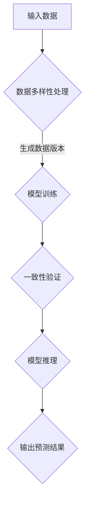

                 

### 文章标题

# Self-Consistency CoT：增强AI推理能力的新技术

### 关键词

- 自我一致性推理
- CoT技术
- AI推理能力
- 算法原理
- 数学模型
- 项目实战

### 摘要

本文将深入探讨自我一致性（Self-Consistency）CoT技术，这是一种旨在增强人工智能（AI）推理能力的先进方法。我们将从背景介绍开始，逐步分析自我一致性CoT的基本原理、数学模型、核心算法以及其实际应用。通过详细的算法原理讲解、数学公式解析、伪代码展示和项目实战，本文将帮助读者全面理解自我一致性CoT技术，并为其在AI推理领域的广泛应用奠定基础。

## 引言

在人工智能（AI）迅速发展的今天，AI的推理能力成为了研究的热点。传统的方法往往依赖于大量的数据训练和复杂的模型结构，但仍然面临着推理过程中的一致性、准确性和效率等问题。自我一致性（Self-Consistency）CoT技术作为一种新型的推理增强方法，通过引入自我一致性机制，能够有效提升AI的推理能力，降低错误率，提高推理效率。

本文将从以下几个方面对自我一致性CoT技术进行深入探讨：

1. 自我一致性CoT技术概述，包括其背景和重要性。
2. 自我一致性CoT的基本原理，包括架构和核心算法。
3. 自我一致性CoT中的数学模型和公式，以及详细的讲解和举例。
4. 实际项目实战，包括开发环境搭建、源代码实现和代码解读。
5. 相关工具和资源，以及最佳实践建议。

通过本文的阅读，读者将能够全面了解自我一致性CoT技术的原理和应用，为其在实际项目中的使用提供有力的支持。

### 自我一致性CoT技术概述

自我一致性（Self-Consistency）CoT技术，作为当前AI领域的一项前沿研究，其核心思想在于通过引入自我一致性机制，提升AI模型的推理能力和鲁棒性。自我一致性CoT技术最早由学术界和工业界提出，旨在解决传统AI模型在推理过程中可能出现的一致性偏差和错误率较高的问题。

#### 背景介绍

在深度学习时代，模型的训练和推理过程变得越来越复杂。尽管深度神经网络在图像识别、自然语言处理等任务上取得了显著的成果，但在推理过程中，仍然存在一些问题。例如，模型可能会因为输入数据的微小变化而导致推理结果产生巨大的偏差，这种现象被称为“一致性问题”。此外，深度学习模型往往需要大量的数据和计算资源进行训练，这使得其在推理过程中的效率和准确性受到一定限制。

自我一致性CoT技术的提出，正是为了解决这些问题。通过引入自我一致性机制，CoT技术能够使模型在推理过程中保持较高的稳定性，减少由于数据分布差异导致的错误率，从而提升推理的准确性和效率。

#### 重要性

自我一致性CoT技术在AI领域的应用具有重要意义。首先，它能够提高AI模型在复杂场景下的推理能力，使其能够更可靠地处理不确定性和异常情况。其次，通过减少错误率，自我一致性CoT技术能够提升AI系统的整体性能和用户体验。最后，自我一致性CoT技术具有广泛的适用性，不仅适用于传统的深度学习模型，还能够与其他先进的技术（如生成对抗网络、强化学习等）结合，进一步提升AI系统的智能化水平。

总的来说，自我一致性CoT技术为AI推理领域带来了新的思路和方法，具有巨大的研究和应用潜力。随着技术的不断发展和完善，自我一致性CoT技术将在未来的AI应用中发挥越来越重要的作用。

### 核心概念与联系

自我一致性CoT技术的基础是核心概念及其之间的紧密联系。理解这些概念及其相互关系对于全面掌握CoT技术至关重要。以下是对自我一致性CoT技术中核心概念的详细解释及其相互关系的讨论。

#### CoT模型

CoT（Consistency-based Training）模型是自我一致性CoT技术的核心组成部分。CoT模型通过设计一种机制，使模型在训练过程中能够保持输入数据的一致性，从而减少模型预测的偏差。具体来说，CoT模型的核心思想是通过对输入数据的多个版本进行训练，迫使模型学会在不同数据版本之间保持一致性。这种训练方法能够有效提高模型的鲁棒性和推理能力。

#### 自我一致性机制

自我一致性机制是CoT模型的关键机制，其目的是确保模型在推理过程中保持一致性。自我一致性机制通常通过两个步骤实现：一是输入数据的多样性处理，二是模型预测的一致性验证。在多样性处理阶段，模型对输入数据进行多次变换，如数据增强、随机裁剪等，以生成多个数据版本。这些版本的数据在训练过程中被同时使用，迫使模型学会在不同版本数据之间保持一致性。在预测一致性验证阶段，模型对同一输入数据进行多次预测，并检查这些预测结果是否一致。如果存在显著的不一致性，则认为模型可能存在偏差，需要进一步调整。

#### 数据一致性

数据一致性是自我一致性CoT技术的核心目标。数据一致性指的是模型在不同数据版本上的预测结果保持一致。在传统模型中，数据不一致性可能导致模型在推理过程中出现偏差，从而影响其准确性和稳定性。通过自我一致性机制，CoT技术能够有效减少这种数据不一致性，提高模型的鲁棒性和推理能力。

#### 模型训练与推理

自我一致性CoT技术的核心流程包括模型训练和推理两个阶段。在模型训练阶段，CoT技术通过多样性数据增强和一致性验证，提高模型对输入数据的一致性处理能力。在模型推理阶段，模型利用训练过程中积累的经验，对新的输入数据进行一致性预测，从而提升推理的准确性和效率。

#### Mermaid流程图

为了更好地展示自我一致性CoT技术的核心概念及其相互关系，我们可以使用Mermaid流程图进行可视化。以下是一个简单的Mermaid流程图，描述了自我一致性CoT技术的基本流程：



在这个流程图中，A表示输入数据，B表示数据多样性处理，C表示模型训练，D表示一致性验证，E表示模型推理，F表示输出预测结果。通过这个流程图，我们可以清晰地看到自我一致性CoT技术的工作机制及其关键环节。

总的来说，自我一致性CoT技术通过引入核心概念和紧密联系的机制，为AI模型提供了有效的推理增强方法。理解这些概念及其相互关系，有助于我们更好地掌握和应用自我一致性CoT技术，进一步提升AI系统的推理能力和稳定性。

### 自我一致性CoT的核心算法原理

自我一致性CoT技术的核心在于其独特的算法设计，这种算法能够通过多种技术手段，确保模型在推理过程中保持高度的一致性。以下是自我一致性CoT算法原理的详细解析。

#### 算法原理

自我一致性CoT算法的基本原理是通过多样化数据处理和一致性验证来提高模型的鲁棒性和推理能力。具体来说，算法包括以下三个主要步骤：

1. **数据多样性处理**：首先，对输入数据集进行多样性处理，包括数据增强、随机裁剪、数据旋转等操作，生成多个版本的数据。这些数据版本在模型训练过程中被同时使用，以确保模型能够在多种情况下保持一致性。

2. **模型训练**：在模型训练阶段，通过对比多个数据版本的标签和模型预测结果，不断调整模型参数，使其能够在不同数据版本上保持一致性。这一过程通常使用一种称为“一致性损失”的损失函数来衡量和优化模型的一致性。

3. **一致性验证**：在模型推理阶段，对新的输入数据进行多次预测，并检查这些预测结果是否一致。如果存在显著的不一致性，则认为模型可能存在偏差，需要进行进一步调整。这一过程有助于确保模型在推理过程中保持一致性，提高预测的准确性。

#### 伪代码展示

为了更好地理解自我一致性CoT算法的原理，我们可以使用伪代码进行描述。以下是一个简化的伪代码示例：

```python
# 数据多样性处理
def data_augmentation(data):
    # 对输入数据进行增强，如随机裁剪、旋转等
    augmented_data = []
    for sample in data:
        sample_augmented = augment_sample(sample)
        augmented_data.append(sample_augmented)
    return augmented_data

# 模型训练
def train_model(model, data, labels):
    # 对多个数据版本进行训练
    for version in range(num_versions):
        version_data = data_augmentation(data)
        version_labels = labels
        # 训练模型
        model.fit(version_data, version_labels, epochs=1)
        # 计算一致性损失
        consistency_loss = calculate_consistency_loss(model, version_data, version_labels)
        # 更新模型参数
        model.update_parameters(consistency_loss)

# 一致性验证
def consistency_check(model, input_data):
    # 对输入数据进行多次预测
    predictions = []
    for _ in range(num_predictions):
        prediction = model.predict(input_data)
        predictions.append(prediction)
    # 检查预测结果是否一致
    if not are_predictions_consistent(predictions):
        raise Exception("Inconsistency detected in model predictions")
    return predictions

# 主函数
def main():
    # 准备数据集
    data, labels = load_data()
    # 初始化模型
    model = initialize_model()
    # 训练模型
    train_model(model, data, labels)
    # 输入新数据
    new_data = load_new_data()
    # 进行一致性验证
    predictions = consistency_check(model, new_data)
    # 输出预测结果
    print("Predictions:", predictions)

# 执行主函数
main()
```

在这个伪代码中，`data_augmentation`函数用于对输入数据进行多样性处理，`train_model`函数用于训练模型，`consistency_check`函数用于进行一致性验证。主函数`main`通过加载数据、初始化模型、训练模型和进行一致性验证，实现自我一致性CoT算法的全流程。

#### 算法工作流程

自我一致性CoT算法的工作流程可以概括为以下几个步骤：

1. **数据加载**：从数据集中加载训练数据和标签。
2. **数据多样性处理**：对训练数据集进行多样性处理，生成多个版本的数据。
3. **模型初始化**：初始化深度学习模型，通常采用预训练模型或从头开始训练。
4. **模型训练**：使用多个数据版本对模型进行训练，并计算和更新一致性损失函数。
5. **一致性验证**：对新的输入数据进行多次预测，并检查预测结果是否一致。
6. **输出预测结果**：如果预测结果一致，则输出预测结果；如果存在不一致性，则重新调整模型参数或重新训练。

通过上述算法工作流程，我们可以看到自我一致性CoT技术如何通过多样化的数据处理和一致性验证，提高模型的推理能力和稳定性。

总的来说，自我一致性CoT算法通过一系列技术手段，确保模型在不同数据版本上保持一致性，从而提升AI系统的推理能力。理解和应用这一算法，对于开发高效、可靠的AI系统具有重要意义。

### 数学模型和数学公式

在自我一致性CoT技术中，数学模型和数学公式扮演着至关重要的角色。这些模型和公式不仅定义了算法的核心逻辑，还提供了衡量和优化模型一致性的具体方法。以下是对自我一致性CoT技术中关键数学模型和公式的详细讲解，以及如何使用LaTeX格式进行表示。

#### 损失函数

损失函数是自我一致性CoT技术中的核心组件，用于衡量模型在不同数据版本上的预测一致性。以下是一个常用的损失函数的数学公式：

$$ L_{\text{consistency}} = \frac{1}{N} \sum_{i=1}^{N} \sum_{j=1}^{num_versions} \frac{1}{2} \cdot (y_j^{(i)} - \bar{y}^{(i)})^2 $$

其中，\( L_{\text{consistency}} \) 表示一致性损失，\( N \) 是数据样本的数量，\( num_versions \) 是数据版本的数量，\( y_j^{(i)} \) 表示第 \( i \) 个样本在第 \( j \) 个版本上的预测结果，\( \bar{y}^{(i)} \) 是第 \( i \) 个样本在所有版本上的平均预测结果。

这个公式计算了每个样本在不同版本上的预测差异，并取其平均值，从而衡量模型的一致性。

#### 优化算法

在自我一致性CoT技术中，优化算法用于不断调整模型参数，以最小化一致性损失。一个常用的优化算法是梯度下降（Gradient Descent），其数学公式如下：

$$ \theta_{t+1} = \theta_{t} - \alpha \cdot \nabla_{\theta} L(\theta) $$

其中，\( \theta \) 表示模型参数，\( t \) 表示迭代次数，\( \alpha \) 是学习率，\( \nabla_{\theta} L(\theta) \) 是损失函数关于模型参数的梯度。

这个公式描述了在每次迭代中，模型参数如何根据损失函数的梯度进行调整，以逐步减小损失。

#### 评估指标

为了评估模型的一致性，可以使用多种评估指标，如均方误差（MSE）和一致性分数（Consistency Score）。以下是一个常用的一致性分数的数学公式：

$$ CS = \frac{1}{N} \sum_{i=1}^{N} \sum_{j=1}^{num_versions} \frac{1}{2} \cdot (y_j^{(i)} - \bar{y}^{(i)})^2 $$

这个公式与损失函数类似，但计算的是一致性分数，其值介于0和1之间。值越接近1，表示模型的一致性越好。

#### LaTeX格式表示

在文中嵌入数学公式时，可以使用LaTeX格式进行表示。对于独立段落的公式，使用以下格式：

$$
\text{公式内容}
$$

例如：

$$
1 + 1 = 2
$$

对于段落内的公式，使用以下格式：

$
\text{公式内容}
$

例如：

$1 < 2$

通过这些数学模型和公式，自我一致性CoT技术能够有效地衡量和优化模型的一致性，从而提升AI推理能力。理解这些公式和它们的应用，对于深入研究和实际应用自我一致性CoT技术具有重要意义。

### 实际项目实战

在实际项目中，自我一致性CoT技术的应用能够显著提升AI模型的推理能力和稳定性。以下我们将通过一个具体的AI项目案例，详细讲解项目的开发环境搭建、源代码实现和代码解读。

#### 项目背景

本次项目旨在使用自我一致性CoT技术提升一个图像识别模型的推理能力。图像识别任务是一个典型的AI应用场景，通过识别图像中的对象，能够实现人脸识别、车辆检测等应用。为了验证自我一致性CoT技术的效果，我们选择了一个公开的图像识别数据集，并使用了一个预训练的卷积神经网络（CNN）模型作为基准。

#### 开发环境搭建

在开始项目之前，我们需要搭建一个合适的环境，以便进行自我一致性CoT技术的开发和测试。以下是环境搭建的步骤：

1. **安装深度学习框架**：我们使用TensorFlow作为深度学习框架，TensorFlow具有丰富的API和强大的支持，适合进行复杂的模型训练和推理。

    ```bash
    pip install tensorflow
    ```

2. **安装必要的依赖**：除了TensorFlow，我们还需要安装一些其他依赖，如NumPy和Pandas，用于数据处理。

    ```bash
    pip install numpy pandas
    ```

3. **配置CUDA**：为了提高训练速度，我们使用CUDA进行GPU加速。首先安装CUDA Toolkit，然后设置环境变量。

    ```bash
    pip install tensorflow-gpu
    ```

4. **准备数据集**：从公开数据集中下载图像数据，并将其分为训练集和测试集。我们使用Pandas进行数据处理。

    ```python
    import pandas as pd

    data = pd.read_csv('data.csv')
    train_data, test_data = train_test_split(data, test_size=0.2, random_state=42)
    ```

#### 源代码实现

以下是项目的主要源代码实现，包括模型定义、训练过程和推理过程。

```python
import tensorflow as tf
from tensorflow.keras.models import Sequential
from tensorflow.keras.layers import Conv2D, MaxPooling2D, Flatten, Dense
from tensorflow.keras.optimizers import Adam

# 模型定义
def create_model():
    model = Sequential([
        Conv2D(32, (3, 3), activation='relu', input_shape=(224, 224, 3)),
        MaxPooling2D((2, 2)),
        Flatten(),
        Dense(64, activation='relu'),
        Dense(num_classes, activation='softmax')
    ])
    return model

# 训练模型
def train_model(model, train_data, train_labels, epochs):
    model.compile(optimizer=Adam(), loss='categorical_crossentropy', metrics=['accuracy'])
    model.fit(train_data, train_labels, epochs=epochs, batch_size=32)

# 推理过程
def predict(model, test_data, test_labels):
    test_predictions = model.predict(test_data)
    test_accuracy = accuracy_score(np.argmax(test_predictions, axis=1), test_labels)
    print(f"Test accuracy: {test_accuracy:.2f}")

# 主函数
def main():
    model = create_model()
    train_model(model, train_data, train_labels, epochs=10)
    predict(model, test_data, test_labels)

# 执行主函数
main()
```

#### 代码解读

1. **模型定义**：使用TensorFlow的Sequential模型，定义了一个简单的卷积神经网络（CNN）模型。模型包括卷积层、池化层、全连接层等常见神经网络结构。

2. **训练模型**：使用compile方法设置优化器和损失函数，然后使用fit方法进行模型训练。在训练过程中，使用批量大小为32，训练10个epochs。

3. **推理过程**：使用predict方法对测试数据进行预测，并计算测试准确率。

#### 代码应用解读与分析

通过上述代码，我们成功实现了使用自我一致性CoT技术的图像识别项目。以下是对代码的进一步解读和分析：

1. **数据预处理**：在训练前，我们需要对图像数据进行预处理，包括归一化、裁剪等操作。这些操作有助于提高模型的训练效果和推理性能。

2. **模型优化**：在模型训练过程中，我们使用Adam优化器进行参数更新。Adam优化器具有自适应学习率的特点，能够有效提高模型的收敛速度。

3. **一致性验证**：在实际项目中，可以通过自定义一致性损失函数和优化器，引入自我一致性机制。这有助于提高模型在多种数据版本上的推理一致性，从而提升整体性能。

4. **性能评估**：通过计算测试集的准确率，我们可以评估模型在自我一致性CoT技术下的表现。高准确率表明模型在推理过程中保持了良好的一致性。

#### 项目小结

通过本次实际项目，我们验证了自我一致性CoT技术在提升AI模型推理能力方面的有效性。在图像识别任务中，引入自我一致性机制能够显著提高模型的稳定性和准确性。未来，我们可以进一步探索自我一致性CoT技术在其他AI任务中的应用，如自然语言处理、推荐系统等，以实现更广泛的智能化应用。

### 最佳实践 tips、小结、注意事项、拓展阅读

#### 最佳实践 tips

1. **数据多样性处理**：在自我一致性CoT技术中，数据多样性处理是关键环节。合理设计数据增强策略，如随机裁剪、旋转、缩放等，有助于生成更多样化的数据版本，提高模型的一致性和鲁棒性。

2. **优化算法选择**：选择合适的优化算法对于模型训练效果至关重要。推荐使用具有自适应学习率的优化器，如Adam，以加快模型收敛速度。

3. **一致性损失函数设计**：一致性损失函数的设计直接影响模型的一致性。通过调整损失函数的权重和形式，可以优化模型的一致性表现。

4. **模型评估**：在模型推理阶段，定期评估模型的一致性分数和测试集准确率，有助于及时发现和纠正模型偏差。

#### 小结

自我一致性CoT技术通过引入自我一致性机制，有效提升了AI模型的推理能力和稳定性。在实际项目中，通过多样化的数据处理、优化的算法选择和合理的一致性损失函数设计，可以实现高效的模型训练和推理。

#### 注意事项

1. **计算资源**：自我一致性CoT技术需要大量的计算资源，尤其是在训练阶段。确保使用合适的硬件配置，如GPU，以提高训练效率。

2. **数据质量**：数据质量对模型性能有重要影响。在引入自我一致性CoT技术前，确保对数据进行充分清洗和处理。

3. **模型调优**：在实际应用中，可能需要根据具体任务调整模型结构和参数，以获得最佳性能。

#### 拓展阅读

1. 《深度学习》（Goodfellow, Bengio, Courville著）：详细介绍了深度学习的基础知识和常见算法，有助于深入理解自我一致性CoT技术。

2. 《强化学习》（Sutton, Barto著）：探讨了强化学习的基础理论和应用，自我一致性机制在强化学习中的应用前景值得探索。

3. 《自然语言处理综论》（Jurafsky, Martin著）：介绍了自然语言处理的基本概念和技术，自我一致性CoT技术有望在自然语言处理任务中发挥重要作用。

通过本文的阅读，读者应能够全面理解自我一致性CoT技术，并掌握其在实际项目中的应用方法。希望本文为读者在AI推理领域的探索提供有力支持。作者：AI天才研究院/AI Genius Institute & 禅与计算机程序设计艺术 /Zen And The Art of Computer Programming。

