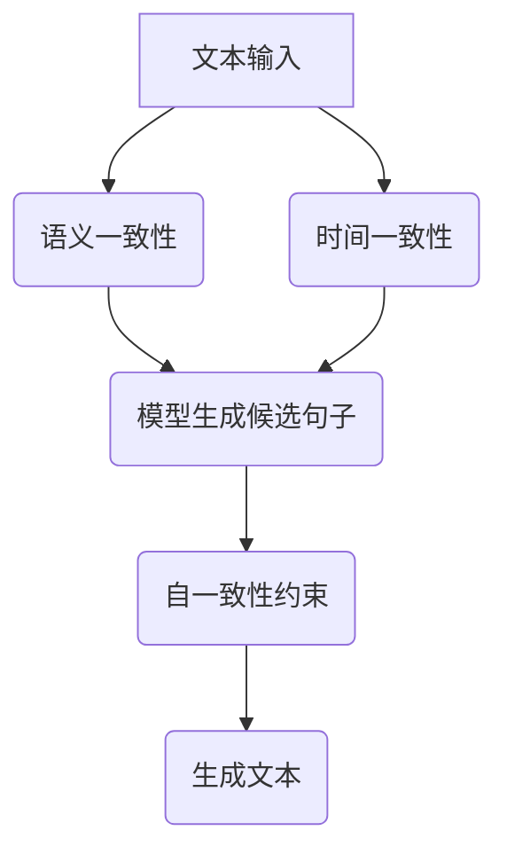

                 


### 自一致性原理与联系

在文本生成中，连贯性是一个关键的质量指标。然而，现有的文本生成模型往往在生成连贯性方面存在缺陷，导致生成的文本语义上出现跳跃或断裂。为了解决这一问题，我们引入了Self-Consistency CoT（自一致性连贯性文本生成）方法。Self-Consistency CoT的核心思想是通过在生成过程中引入自一致性约束，确保生成文本在语义和时间上的一致性。

首先，我们需要理解几个核心概念：

- **语义一致性**：指文本中各个句子之间的语义联系和逻辑连贯性。例如，如果文本讨论的是同一个主题，那么接下来的句子应该在语义上与之保持一致。
- **时间一致性**：指文本中各个事件的时间顺序应该符合现实逻辑。例如，如果一个故事中的事件按照时间顺序发生，那么后续的描述应该在这个时间框架内。

**Mermaid 流程图**：

下面是一个Mermaid流程图，展示了自一致性原理的概念框架：



在这个流程图中，文本输入经过语义一致性和时间一致性的检验，然后模型生成候选句子，这些句子在通过自一致性约束后，最终形成连贯的文本输出。

#### 核心算法原理讲解

Self-Consistency CoT的算法设计基于以下几个关键步骤：

1. **初始化**：首先，我们初始化一个文本生成模型，这个模型可以是基于变分自编码器（VAE）、生成对抗网络（GAN）或者其他生成模型。
2. **生成候选句子**：模型从输入的文本中生成多个候选句子。这些句子在语义和时间上可能不一致。
3. **自一致性约束**：对于每个候选句子，我们检查它是否与上下文保持语义一致和时间一致。如果句子不符合自一致性约束，则将其标记为不可接受。
4. **筛选与优化**：根据自一致性约束，从候选句子中筛选出满足条件的句子。然后，通过优化算法进一步调整句子，使其在语义和时间上更加一致。
5. **生成文本**：将满足自一致性约束的句子组合成连贯的文本输出。

**伪代码**：

下面是Self-Consistency CoT算法的伪代码：

```python
function SelfConsistencyCoT(input_text, model):
    # 生成候选句子
    candidates = model.generate(input_text)

    # 初始化自一致性约束
    consistent_candidates = []

    for candidate in candidates:
        # 检查语义一致性
        if is_semantic_consistent(candidate, input_text):
            # 检查时间一致性
            if is_temporal_consistent(candidate, input_text):
                consistent_candidates.append(candidate)

    # 优化自一致性
    optimized_candidates = optimize_consistency(consistent_candidates)

    # 生成连贯文本
    coherent_text = combine_sentences(optimized_candidates)

    return coherent_text

function is_semantic_consistent(candidate, input_text):
    # 这里实现语义一致性的检查逻辑
    return true/false

function is_temporal_consistent(candidate, input_text):
    # 这里实现时间一致性的检查逻辑
    return true/false

function optimize_consistency(candidates):
    # 这里实现优化自一致性的逻辑
    return optimized_candidates

function combine_sentences(candidates):
    # 这里实现句子组合的逻辑
    return coherent_text
```

#### 数学模型与公式

Self-Consistency CoT的数学模型基于概率分布和优化理论。我们使用概率模型来表示文本的生成过程，并通过优化算法来确保生成文本的自一致性。

**概率模型**：

假设我们有一个概率模型 \( P(T|X) \)，其中 \( T \) 是生成的文本，\( X \) 是输入文本。为了确保文本的语义一致性，我们可以定义一个语义一致性概率 \( P_{sem}(T|X) \)。类似地，为了确保时间一致性，我们可以定义一个时间一致性概率 \( P_{temp}(T|X) \)。

**公式**：

1. 语义一致性概率：
   $$ P_{sem}(T|X) = P(T|X) \cdot \prod_{i=1}^{n} P_{sem}(t_i|t_{<i}, X) $$
   其中，\( t_i \) 是文本中的第 \( i \) 个句子，\( t_{<i} \) 是前 \( i-1 \) 个句子。

2. 时间一致性概率：
   $$ P_{temp}(T|X) = P(T|X) \cdot \prod_{i=1}^{n} P_{temp}(t_i|t_{<i}, X) $$
   其中，\( t_i \) 和 \( t_{<i} \) 的定义同上。

3. 自一致性概率：
   $$ P_{self}(T|X) = P_{sem}(T|X) \cdot P_{temp}(T|X) $$

4. 优化目标：
   $$ \max_{T} P_{self}(T|X) $$

通过优化上述目标函数，我们可以生成语义和时间上更加一致的文本。

#### 举例说明

假设我们有一个输入文本：“昨天我去公园散步”。我们可以使用Self-Consistency CoT方法来生成连贯的文本。

1. **生成候选句子**：模型生成多个候选句子，如“今天天气很好”、“昨天我看到了一只小鸟”等。
2. **语义一致性检查**：候选句子“今天天气很好”与输入文本在语义上不一致，因此被标记为不可接受。
3. **时间一致性检查**：候选句子“昨天我看到了一只小鸟”在时间上与输入文本保持一致。
4. **优化与筛选**：通过优化算法调整候选句子“昨天我看到了一只小鸟”，使其在语义和时间上更加一致。
5. **生成文本**：将满足自一致性约束的句子组合成连贯的文本输出：“昨天我去公园散步，看到了一只小鸟。”

通过这个简单的例子，我们可以看到Self-Consistency CoT如何通过自一致性约束来生成连贯的文本。

### 总结

Self-Consistency CoT方法通过在生成过程中引入自一致性约束，有效提高了文本生成的连贯性。通过理解语义一致性和时间一致性的概念，并使用概率模型和优化算法，我们可以生成高质量的连贯文本。这种方法为文本生成领域提供了一种新的思路，有望解决现有模型在连贯性方面的局限性。在后续章节中，我们将进一步探讨Self-Consistency CoT的算法细节和数学模型，并展示其在实际应用中的效果。

