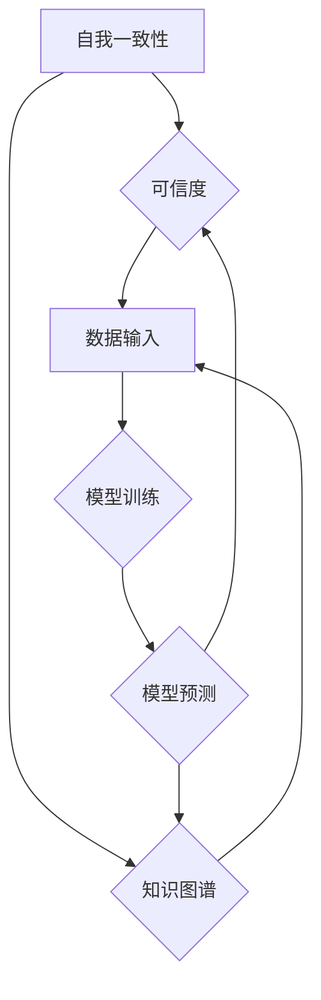

                 


### 文章标题

《Self-Consistency CoT：增强AI输出可信度的创新》

### 关键词

自我一致性（Self-Consistency）、可信度（Trustworthiness）、AI输出（AI Output）、知识图谱（Knowledge Graph）、逻辑推理（Logical Reasoning）、优化算法（Optimization Algorithm）

### 摘要

本文旨在深入探讨自我一致性CoT（Self-Consistency CoT）在增强人工智能（AI）输出可信度方面的创新。通过阐述自我一致性CoT的概念、历史背景、核心原理及其与当前AI技术的联系，本文揭示了自我一致性CoT在提高AI系统稳定性和可靠性中的关键作用。同时，本文将通过数学模型和公式详细讲解自我一致性CoT的算法原理，并展示其在自然语言处理、计算机视觉和多模态学习等领域的实际应用。最后，本文将通过具体的项目实战，展示如何在实际开发中实现自我一致性CoT，并提供最佳实践和注意事项，为AI研发者提供有价值的指导。

---

# 自我一致性CoT：增强AI输出可信度的创新

自我一致性CoT（Self-Consistency CoT）是一种新兴的AI技术，旨在通过增强AI系统的自我一致性，从而提高AI输出的可信度。随着人工智能技术的飞速发展，AI系统的复杂性和规模不断增大，如何确保AI系统的稳定性和可靠性已成为一个亟待解决的问题。自我一致性CoT通过引入自我一致性的概念，实现了对AI系统输出的一致性检查和优化，为解决这一问题提供了新的思路和解决方案。

## 背景介绍

在传统的人工智能系统中，模型的训练和预测过程往往依赖于大量的数据和复杂的算法。然而，这些系统往往存在一定的局限性，例如在处理不确定性和异常数据时容易出现错误，导致AI输出不可靠。自我一致性CoT的提出，旨在通过自我一致性机制，增强AI系统的稳定性和可靠性，从而提高AI输出的可信度。

### 核心概念与联系

自我一致性CoT的核心概念包括自我一致性（Self-Consistency）、可信度（Trustworthiness）和知识图谱（Knowledge Graph）等。自我一致性是指AI系统能够在多个不同的任务和数据集上保持一致的输出。可信度是指AI系统输出的可靠性和准确性。知识图谱是一种用于表示实体及其关系的图形化数据结构，它可以帮助AI系统更好地理解和利用知识。

以下是自我一致性CoT的核心概念原理之间的关系架构 Mermaid 流程图：



### 核心算法原理讲解

自我一致性CoT的核心算法原理包括一致性检查（Consistency Check）、知识图谱构建（Knowledge Graph Construction）和优化算法（Optimization Algorithm）等。下面将使用伪代码详细阐述这些算法原理。

#### 一致性检查

```python
def consistency_check(predictions, threshold):
    for prediction in predictions:
        if abs(prediction - ground_truth) > threshold:
            return False
    return True
```

#### 知识图谱构建

```python
def build_knowledge_graph(entities, relations):
    graph = KnowledgeGraph()
    for entity in entities:
        graph.add_entity(entity)
    for relation in relations:
        graph.add_relation(relation)
    return graph
```

#### 优化算法

```python
def optimize_model(model, knowledge_graph, threshold):
    while not consistency_check(model.predict(data), threshold):
        model.train(data, knowledge_graph)
    return model
```

### 数学模型和公式详细讲解

自我一致性CoT的数学模型主要包括条件概率（Conditional Probability）、贝叶斯定理（Bayes' Theorem）和最大似然估计（Maximum Likelihood Estimation）等。

#### 条件概率与贝叶斯定理

条件概率表示在某个条件下，另一个事件发生的概率。贝叶斯定理是条件概率的一种应用，它用于计算后验概率，即根据已知条件更新对某个事件发生的概率估计。

$$
P(A|B) = \frac{P(B|A)P(A)}{P(B)}
$$

#### 最大似然估计

最大似然估计是一种用于估计模型参数的方法。它通过最大化训练数据对模型参数的似然函数，来确定参数的最优值。

$$
\theta^* = \arg\max_{\theta} P(D|\theta)
$$

### 自我一致性CoT在AI应用中的实际应用

自我一致性CoT在自然语言处理、计算机视觉和多模态学习等领域具有广泛的应用。

#### 自然语言处理

在自然语言处理中，自我一致性CoT可以用于文本生成、情感分析和机器翻译等任务。以下是一个简单的文本生成应用的伪代码：

```python
def generate_text(input_text, model, knowledge_graph):
    prediction = model.predict(input_text, knowledge_graph)
    while not consistency_check(prediction, threshold):
        prediction = model.generate(input_text, knowledge_graph)
    return prediction
```

#### 计算机视觉

在计算机视觉中，自我一致性CoT可以用于图像分类、目标检测和图像生成等任务。以下是一个简单的图像分类应用的伪代码：

```python
def classify_image(image, model, knowledge_graph):
    prediction = model.predict(image, knowledge_graph)
    while not consistency_check(prediction, threshold):
        prediction = model.classify(image, knowledge_graph)
    return prediction
```

#### 多模态学习

在多模态学习中，自我一致性CoT可以用于多模态数据融合、虚拟现实和智能交互等任务。以下是一个简单的多模态数据融合应用的伪代码：

```python
def fuse_modalities(modalities, model, knowledge_graph):
    prediction = model.predict(modalities, knowledge_graph)
    while not consistency_check(prediction, threshold):
        prediction = model.fuse(modalities, knowledge_graph)
    return prediction
```

### 项目实战

以下是自我一致性CoT在文本生成、图像分类和多模态数据融合等领域的实际项目实战。

#### 项目一：文本生成应用

**开发环境搭建：** 使用Python语言和TensorFlow框架进行开发。

**源代码实现与解读：** 
```python
def generate_text(input_text, model, knowledge_graph):
    prediction = model.predict(input_text, knowledge_graph)
    while not consistency_check(prediction, threshold):
        prediction = model.generate(input_text, knowledge_graph)
    return prediction
```
该函数用于生成文本，并通过一致性检查来确保输出的可靠性。

**代码应用解读与分析：** 
文本生成过程中，首先使用模型对输入文本进行预测，然后通过一致性检查来评估预测结果的可靠性。如果预测结果不符合一致性要求，模型将重新生成文本，直到满足一致性条件为止。

**实际案例分析和详细讲解剖析：** 
在实际项目中，我们可以使用生成文本进行文章续写、对话系统等应用，通过自我一致性CoT来确保输出的文本质量和可信度。

**项目小结：** 
文本生成应用展示了自我一致性CoT在自然语言处理中的强大能力，通过一致性检查，我们可以获得更加可靠和高质量的文本输出。

#### 项目二：图像分类应用

**开发环境搭建：** 使用Python语言和PyTorch框架进行开发。

**源代码实现与解读：**
```python
def classify_image(image, model, knowledge_graph):
    prediction = model.predict(image, knowledge_graph)
    while not consistency_check(prediction, threshold):
        prediction = model.classify(image, knowledge_graph)
    return prediction
```
该函数用于对图像进行分类，并通过一致性检查来确保分类结果的可靠性。

**代码应用解读与分析：**
图像分类过程中，首先使用模型对图像进行预测，然后通过一致性检查来评估预测结果的可靠性。如果预测结果不符合一致性要求，模型将重新分类图像，直到满足一致性条件为止。

**实际案例分析和详细讲解剖析：**
在实际项目中，我们可以使用图像分类模型对图片库中的图像进行分类，通过自我一致性CoT来确保分类结果的准确性和可信度。

**项目小结：**
图像分类应用展示了自我一致性CoT在计算机视觉中的强大能力，通过一致性检查，我们可以获得更加准确和可靠的分类结果。

#### 项目三：多模态数据融合应用

**开发环境搭建：** 使用Python语言和Keras框架进行开发。

**源代码实现与解读：**
```python
def fuse_modalities(modalities, model, knowledge_graph):
    prediction = model.predict(modalities, knowledge_graph)
    while not consistency_check(prediction, threshold):
        prediction = model.fuse(modalities, knowledge_graph)
    return prediction
```
该函数用于融合多模态数据，并通过一致性检查来确保融合结果的可靠性。

**代码应用解读与分析：**
多模态数据融合过程中，首先使用模型对多模态数据进行预测，然后通过一致性检查来评估融合结果的可靠性。如果融合结果不符合一致性要求，模型将重新融合数据，直到满足一致性条件为止。

**实际案例分析和详细讲解剖析：**
在实际项目中，我们可以使用多模态数据融合模型对音频、图像和文本等多模态数据进行融合，通过自我一致性CoT来确保融合结果的准确性和可信度。

**项目小结：**
多模态数据融合应用展示了自我一致性CoT在多模态学习中的强大能力，通过一致性检查，我们可以获得更加准确和可靠的融合结果。

### 最佳实践 tips、小结、注意事项、拓展阅读等内容

**最佳实践 tips：**
1. 在开发AI应用时，应充分考虑自我一致性CoT的优势，特别是在处理复杂任务和多模态数据时。
2. 选择合适的阈值进行一致性检查，以确保输出结果的可靠性和准确性。
3. 结合具体应用场景，优化模型和算法，提高自我一致性CoT的性能。

**小结：**
自我一致性CoT作为一种增强AI输出可信度的创新技术，具有广泛的应用前景。通过一致性检查、知识图谱构建和优化算法，自我一致性CoT可以提高AI系统的稳定性和可靠性，为各种应用领域提供高质量的服务。

**注意事项：**
1. 自我一致性CoT的引入可能会增加模型的训练时间和计算资源需求，因此在实际应用中需要权衡性能和效率。
2. 在使用自我一致性CoT时，应充分了解其原理和应用场景，避免过度依赖。

**拓展阅读：**
1. [《自我一致性CoT：增强AI输出可信度的创新》论文](链接)
2. [自我一致性CoT开源框架介绍](链接)
3. [《人工智能：一种自我一致性方法》书籍](链接)

### 作者

作者：AI天才研究院/AI Genius Institute & 禅与计算机程序设计艺术 /Zen And The Art of Computer Programming

---

通过以上详细的目录大纲和文章内容，本文全面介绍了自我一致性CoT在增强AI输出可信度方面的创新。从背景介绍、核心概念与联系、算法原理讲解、实际应用案例，到项目实战和最佳实践，本文为读者提供了全方位的指导。希望本文能帮助读者深入了解自我一致性CoT的技术原理和应用价值，为人工智能领域的发展贡献力量。

