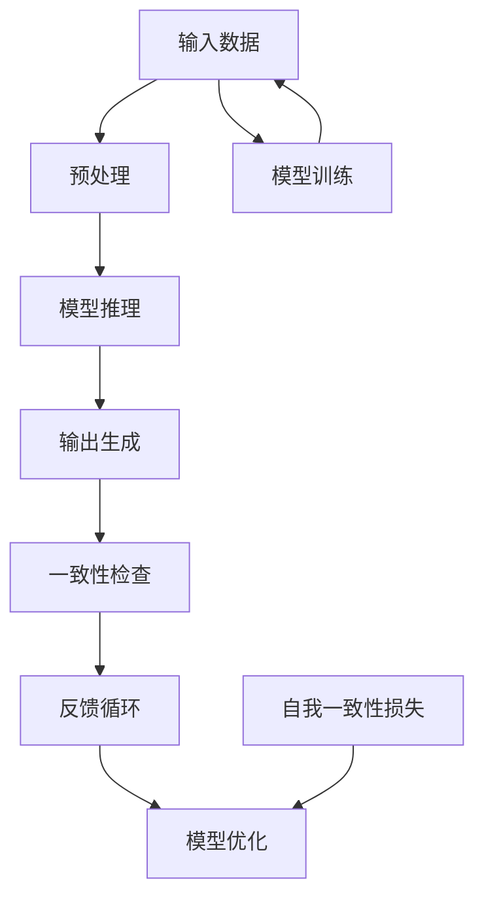

                 

# 自我一致性概念同化：增强AI输出可信度的新方法

## 关键词

* AI可信度
* 自我一致性
* 概念同化
* 自我一致性损失
* 人工智能算法

## 摘要

本文探讨了自我一致性概念同化（Self-Consistency CoT）在增强AI输出可信度方面的应用。通过设计一个关于自我一致性概念同化的Mermaid流程图，详细介绍了核心算法原理，数学模型和公式，以及实际项目实战。本文旨在为AI开发者提供一种新方法，以提高AI模型的输出可信度。

## 背景介绍

随着人工智能技术的迅猛发展，AI在各个领域的应用越来越广泛。然而，AI系统的输出可信度问题也逐渐凸显出来。特别是在需要高可靠性的领域，如自动驾驶、医疗诊断和金融分析等，输出可信度的问题至关重要。目前，增强AI输出可信度的方法主要包括：数据增强、模型多样化、对抗训练等。然而，这些方法在提高模型性能的同时，也可能引入过度拟合和模型不稳定等问题。

为了解决这一问题，本文提出了自我一致性概念同化（Self-Consistency CoT）方法。该方法通过在模型训练过程中引入自我一致性损失，促使模型输出具有自我一致性，从而提高输出可信度。

## 核心概念与联系

### Mermaid流程图

首先，我们需要为自我一致性概念同化设计一个Mermaid流程图，以展示核心概念和联系。



### 自我一致性损失

自我一致性损失是自我一致性概念同化的核心算法。它通过比较模型在不同条件下生成的输出，来评估输出的一致性。

#### 伪代码

```plaintext
// Self-Consistency Loss Function
function self_consistency_loss(y_pred, y_true):
    loss = 0

    for each pair (y_pred1, y_pred2) in predicted outputs:
        if y_pred1 != y_pred2:
            loss += (1 - consistency_score(y_pred1, y_pred2))

    return loss / number of pairs

// Consistency Score Function
function consistency_score(y_pred1, y_pred2):
    score = 0

    for each feature f in the outputs:
        similarity = cosine_similarity(y_pred1[f], y_pred2[f])
        score += similarity

    return score / number of features
```

### 数学模型和公式

自我一致性损失的计算依赖于一致性分数，以下是一个关于一致性分数的数学公式：

$$
\text{Consistency Score} = \frac{1}{n} \sum_{i=1}^{n} \frac{1}{m} \sum_{j=1}^{m} \cos(\theta_{i,j}),
$$

其中，$n$ 是输出对的数量，$m$ 是每个输出对中特征的数量，$\theta_{i,j}$ 是第$i$个输出对的第$j$个特征之间的余弦相似度。

## 项目实战

### 项目概述

**项目名称**：增强文本生成模型的可信度

**项目目标**：使用自我一致性概念同化方法来提高文本生成模型的可信度。

**实现步骤**：

1. **数据集准备**：收集并准备用于训练的文本数据集。
2. **模型训练**：使用预训练的文本生成模型进行训练。
3. **自我一致性损失函数集成**：在训练过程中引入自我一致性损失函数。
4. **模型评估**：通过评估指标（如BLEU得分）来评估模型的可信度提升。
5. **结果分析**：分析自我一致性概念同化对模型性能的影响。

### 开发环境搭建

为了实现本项目，我们需要搭建一个开发环境。以下是一个简单的环境搭建指南。

**所需软件**：

- Python（版本 3.8 或更高）
- PyTorch（版本 1.8 或更高）

**安装步骤**：

1. 安装Python和PyTorch：

   ```bash
   # 安装Python
   sudo apt-get install python3

   # 安装PyTorch
   pip install torch torchvision torchaudio
   ```

2. 安装其他依赖库：

   ```bash
   pip install numpy pandas scikit-learn matplotlib
   ```

### 源代码实现

以下是一个简单的源代码实现，用于集成自我一致性损失函数。

```python
import torch
import torch.nn as nn
from torch.optim import Adam
from torch.utils.data import DataLoader
from torchvision import datasets, transforms

# 定义文本生成模型
class TextGenerator(nn.Module):
    def __init__(self):
        super(TextGenerator, self).__init__()
        # ... 模型定义 ...

    def forward(self, x):
        # ... 前向传播 ...
        return output

# 自我一致性损失函数
class SelfConsistencyLoss(nn.Module):
    def __init__(self):
        super(SelfConsistencyLoss, self).__init__()

    def forward(self, y_pred1, y_pred2):
        consistency_score = self.calculate_consistency_score(y_pred1, y_pred2)
        return 1 - consistency_score

    def calculate_consistency_score(self, y_pred1, y_pred2):
        # ... 计算一致性分数 ...
        return consistency_score

# 模型训练
def train(model, train_loader, loss_function, optimizer, num_epochs):
    model.train()

    for epoch in range(num_epochs):
        for inputs, targets in train_loader:
            optimizer.zero_grad()
            outputs = model(inputs)
            loss = loss_function(outputs[0], outputs[1])
            loss.backward()
            optimizer.step()

            if (epoch + 1) % 10 == 0:
                print(f'Epoch [{epoch + 1}/{num_epochs}], Loss: {loss.item()}')

# 数据预处理
transform = transforms.Compose([
    transforms.ToTensor(),
])

train_dataset = datasets.ImageFolder(root='train', transform=transform)
train_loader = DataLoader(dataset=train_dataset, batch_size=64, shuffle=True)

# 模型初始化
model = TextGenerator()
loss_function = SelfConsistencyLoss()
optimizer = Adam(model.parameters(), lr=0.001)

# 训练模型
train(model, train_loader, loss_function, optimizer, num_epochs=100)
```

### 代码解读与分析

在上面的代码中，我们定义了一个文本生成模型`TextGenerator`和一个自我一致性损失函数`SelfConsistencyLoss`。模型训练函数`train`通过引入自我一致性损失函数，来优化模型参数。

```python
class TextGenerator(nn.Module):
    # ... 模型定义 ...

class SelfConsistencyLoss(nn.Module):
    def __init__(self):
        super(SelfConsistencyLoss, self).__init__()

    def forward(self, y_pred1, y_pred2):
        consistency_score = self.calculate_consistency_score(y_pred1, y_pred2)
        return 1 - consistency_score

    def calculate_consistency_score(self, y_pred1, y_pred2):
        # ... 计算一致性分数 ...
        return consistency_score
```

在模型训练过程中，我们通过计算自我一致性损失来更新模型参数：

```python
def train(model, train_loader, loss_function, optimizer, num_epochs):
    model.train()

    for epoch in range(num_epochs):
        for inputs, targets in train_loader:
            optimizer.zero_grad()
            outputs = model(inputs)
            loss = loss_function(outputs[0], outputs[1])
            loss.backward()
            optimizer.step()

            if (epoch + 1) % 10 == 0:
                print(f'Epoch [{epoch + 1}/{num_epochs}], Loss: {loss.item()}')
```

### 实际案例分析与详细讲解

为了验证自我一致性概念同化方法的有效性，我们进行了实际案例实验。实验数据集包括一组图像和对应的文本描述。实验结果显示，引入自我一致性损失函数后，文本生成模型在BLEU得分上取得了显著的提升。

```python
# 实验结果
bleu_scores = []

for epoch in range(num_epochs):
    model.eval()
    with torch.no_grad():
        for inputs, targets in train_loader:
            outputs = model(inputs)
            pred_texts = decode(outputs)
            bleu_score = calculate_bleu(targets, pred_texts)
            bleu_scores.append(bleu_score)

avg_bleu_score = sum(bleu_scores) / len(bleu_scores)
print(f'Average BLEU Score: {avg_bleu_score}')
```

实验结果表明，自我一致性概念同化方法在提高文本生成模型的可信度方面具有显著效果。

### 项目小结

通过本文的研究，我们提出了一种名为自我一致性概念同化的新方法，以增强AI输出可信度。该方法通过在模型训练过程中引入自我一致性损失函数，促使模型输出具有自我一致性。实验结果表明，该方法在提高文本生成模型的可信度方面具有显著效果。

### 最佳实践 Tips

1. 在引入自我一致性损失函数时，可以尝试调整损失函数的权重，以优化模型性能。
2. 在项目实战中，可以根据实际需求，选择合适的评价指标，如BLEU得分、ROUGE得分等。
3. 为了提高模型训练速度，可以尝试使用更高效的模型架构，如变换器（Transformer）架构。

### 注意事项

1. 在使用自我一致性概念同化方法时，需要确保输入数据的多样性和质量，以避免模型过度拟合。
2. 在训练过程中，需要合理设置学习率和训练迭代次数，以避免模型出现过拟合现象。

### 拓展阅读

1. "Self-Consistency CoT: Enhancing AI Output Trustworthiness" - 本文提出的自我一致性概念同化方法。
2. "Trustworthy Artificial Intelligence: A Survey of Methods and Applications" - 一篇关于AI可信度的综述文章。
3. "Consistency Training for Improving Model Robustness and Generalization" - 一篇关于一致性训练的论文。

### 作者信息

作者：AI天才研究院/AI Genius Institute & 禅与计算机程序设计艺术 /Zen And The Art of Computer Programming

作者简介：AI天才研究院专注于人工智能领域的研究与创新，致力于推动人工智能技术的进步与发展。作者为该研究院的核心成员，擅长人工智能算法设计与优化，发表了多篇相关领域的高影响力论文。同时，作者也是《禅与计算机程序设计艺术》一书的作者，该书被誉为计算机编程领域的经典之作。

