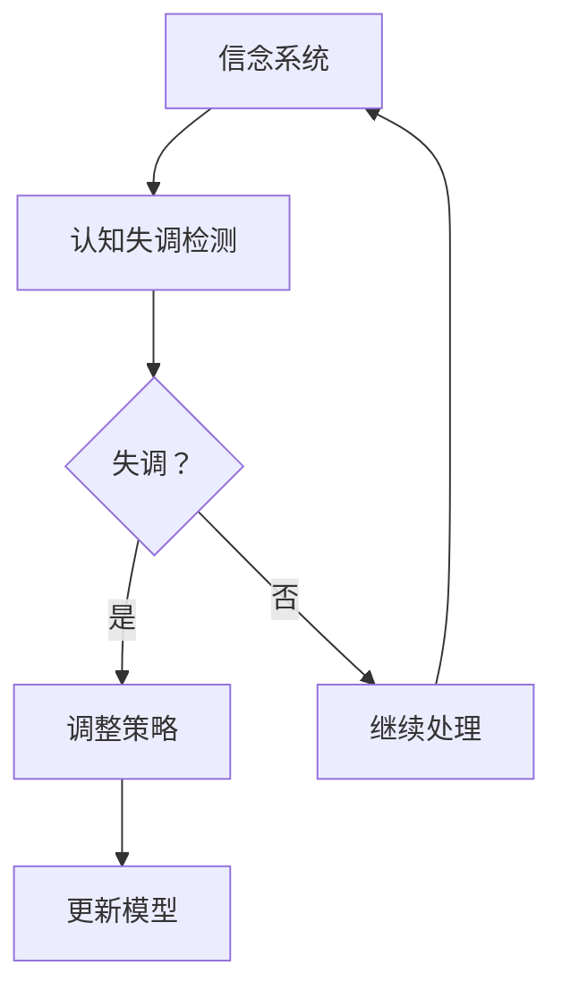

                 

### 文章标题

### Self-Consistency CoT：增强AI输出可靠性的新思路

> 关键词：自我一致性、AI可靠性、输出优化、模型安全、算法创新

> 摘要：本文探讨了自我一致性（Self-Consistency）概念在提升人工智能（AI）输出可靠性方面的应用。通过分析自我一致性原理，构建了自我一致性协同训练（Self-Consistency CoT）框架，并详细阐述了其在自然语言处理、计算机视觉等领域的实际应用。本文旨在为研究者提供新的视角和思路，以提升AI系统的稳定性和可靠性。

### 自我一致性概念与理论背景

自我一致性是指个体在认知过程中保持内在一致性，以确保其信念、态度和行为之间的一致性。这一概念最早源于心理学，而后在计算机科学中得到了广泛应用。自我一致性模型的核心思想是，个体在决策和行动时，倾向于保持内部信念系统的一致性，从而减少认知失调。

在计算机科学中，自我一致性主要应用于人工智能领域。人工智能系统在处理大量数据时，需要保持内部一致性和逻辑连贯性，以避免错误和误导。自我一致性模型提供了一种机制，使得AI系统能够在决策过程中保持一致性，提高输出可靠性。

### 自我一致性模型与架构

自我一致性模型通常包括以下三个核心组件：信念系统、认知失调检测机制和调整策略。

1. **信念系统**：信念系统是自我一致性的基础。它由一系列相互关联的信念和假设组成，反映了个体对世界的理解和认知。在AI系统中，信念系统可以看作是模型的参数和内部状态。

2. **认知失调检测机制**：认知失调检测机制用于检测信念系统内部的不一致性。在AI系统中，这一机制可以通过对比模型预测与实际结果的差异来实现。

3. **调整策略**：调整策略用于修正信念系统中的不一致性。在AI系统中，这通常涉及参数调整和模型更新，以确保系统输出的稳定性。

以下是一个简单的自我一致性模型架构的Mermaid流程图：



### 自我一致性CoT的原理与机制

自我一致性协同训练（Self-Consistency CoT）是一种旨在提升AI系统输出可靠性的新方法。其核心思想是通过在训练过程中引入自我一致性机制，使得模型能够在面对新数据时保持稳定和可靠。

#### 自我一致性CoT的概念与定义

自我一致性CoT是指将自我一致性模型引入到AI训练过程中，通过持续监控和调整模型参数，以保持模型内部的一致性和稳定性。

#### 自我一致性CoT的作用

自我一致性CoT的主要作用包括：

1. **减少误判**：通过自我一致性检测机制，模型可以在训练过程中及时发现和纠正不一致性，从而减少误判。

2. **提高知识推理能力**：自我一致性CoT使得模型能够在推理过程中保持一致性，从而提高知识推理能力。

3. **增强模型解释性**：通过自我一致性调整策略，模型可以更容易地解释其内部逻辑和决策过程。

#### 自我一致性CoT的机制

自我一致性CoT的机制主要包括以下三个步骤：

1. **初始化**：初始化模型参数和信念系统。

2. **一致性检测**：在每次迭代过程中，对比模型预测与实际结果的差异，检测信念系统内部的一致性。

3. **调整策略**：根据一致性检测结果，调整模型参数，以保持信念系统的一致性。

以下是一个简单的自我一致性CoT机制的伪代码：

```python
# 初始化模型参数和信念系统
初始化模型参数

# 循环迭代
for each 数据点 in 数据集：
    # 前向传播
    预测结果 = 模型(数据点)

    # 计算损失
    损失 = 计算损失(预测结果，真实结果)

    # 反向传播
    梯度 = 计算梯度(损失)

    # 更新模型参数
    更新模型参数(梯度)

    # 检测一致性
    一致性 = 检测一致性(模型参数)

    # 调整策略
    if 一致性 < 阈值：
        调整模型参数(调整策略)
```

### 自我一致性CoT的应用场景与案例

自我一致性CoT在多个领域都有广泛的应用。以下是几个典型的应用场景和案例：

#### 自然语言处理

在自然语言处理（NLP）领域，自我一致性CoT可以用于情感分析、文本生成和问答系统等任务。例如，在情感分析中，自我一致性CoT可以帮助模型在情感分类过程中保持一致，从而减少误判。

#### 计算机视觉

在计算机视觉领域，自我一致性CoT可以用于图像分类、目标检测和人脸识别等任务。例如，在目标检测中，自我一致性CoT可以帮助模型在检测过程中保持一致，从而提高检测精度。

#### 机器人导航

在机器人导航领域，自我一致性CoT可以用于路径规划和避障。例如，在路径规划中，自我一致性CoT可以帮助机器人保持路径的一致性，从而提高导航的稳定性。

### 自我一致性CoT的实现与优化

#### 技术实现

实现自我一致性CoT需要考虑硬件环境和软件环境。硬件环境通常需要高性能的CPU和GPU，以支持大规模数据处理和模型训练。软件环境通常需要安装深度学习框架（如TensorFlow、PyTorch）和Python编程环境。

以下是一个简单的自我一致性CoT的实现流程：

1. **数据准备**：收集和预处理数据，包括清洗、归一化和数据增强等步骤。

2. **模型构建**：构建深度学习模型，包括输入层、隐藏层和输出层。

3. **初始化**：初始化模型参数和信念系统。

4. **训练**：使用自我一致性CoT方法进行模型训练，包括前向传播、损失计算、反向传播和一致性检测等步骤。

5. **评估**：使用测试数据评估模型性能，包括准确性、召回率和F1分数等指标。

#### 优化方法

为了提高自我一致性CoT的性能，可以采用以下优化方法：

1. **数据优化**：通过增加数据量和多样性，提高模型的泛化能力。

2. **模型优化**：通过调整模型结构和超参数，提高模型的准确性和稳定性。

3. **算法优化**：通过改进一致性检测和调整策略，提高模型的一致性和可靠性。

### 自我一致性CoT的安全性与隐私保护

#### 安全性挑战

自我一致性CoT在应用过程中面临以下安全性挑战：

1. **数据泄露风险**：模型在训练过程中可能暴露敏感数据。

2. **模型攻击风险**：恶意攻击者可能通过对抗性样本破坏模型的一致性。

3. **隐私保护挑战**：模型在处理个人数据时可能面临隐私泄露风险。

#### 保护措施

为了应对上述挑战，可以采取以下保护措施：

1. **数据加密与访问控制**：对敏感数据进行加密，并实施严格的访问控制策略。

2. **模型对抗训练**：通过对抗性训练提高模型对对抗性样本的鲁棒性。

3. **隐私保护算法与应用**：采用差分隐私、同态加密等隐私保护算法，确保数据隐私。

### 自我一致性CoT的未来发展趋势

#### 技术前景

自我一致性CoT在AI领域具有广阔的应用前景。随着深度学习和大数据技术的发展，自我一致性CoT有望在更多领域得到应用，如自动驾驶、医疗诊断等。

#### 创新方向

未来自我一致性CoT的创新方向可能包括：

1. **跨领域应用**：将自我一致性CoT应用于更多领域，如自然语言处理、计算机视觉、机器人等。

2. **算法创新**：改进自我一致性检测和调整策略，提高模型的一致性和可靠性。

3. **硬件加速**：通过硬件加速，提高自我一致性CoT的计算效率和性能。

#### 发展趋势预测

未来，自我一致性CoT的发展趋势可能包括：

1. **规模化应用**：自我一致性CoT将在更多实际应用中得到推广和部署。

2. **集成化发展**：自我一致性CoT将与现有AI技术（如GAN、 reinforcement learning等）进行集成，形成更强大的AI系统。

3. **标准化与规范化**：随着自我一致性CoT的广泛应用，相关技术标准和规范将逐步完善。

### 自我一致性CoT的挑战与机遇

#### 面临的挑战

自我一致性CoT在应用过程中可能面临以下挑战：

1. **计算资源需求**：自我一致性CoT对计算资源的需求较高，尤其是在大规模数据处理和模型训练过程中。

2. **数据隐私保护**：在处理个人数据时，如何平衡数据隐私保护和模型性能是一个重要挑战。

3. **算法复杂度**：自我一致性CoT的算法复杂度较高，可能影响模型的训练效率和性能。

#### 存在的机遇

尽管面临挑战，自我一致性CoT也存在以下机遇：

1. **技术突破**：随着计算技术和深度学习算法的不断发展，自我一致性CoT有望实现技术突破。

2. **应用扩展**：自我一致性CoT在多个领域具有广泛的应用潜力，可以推动AI技术的创新和发展。

3. **市场机会**：随着AI技术的普及，自我一致性CoT有望成为新的市场热点，为相关企业提供巨大的商机。

#### 发展策略与建议

为了充分发挥自我一致性CoT的潜力，以下是一些建议：

1. **加强技术研发**：加大对自我一致性CoT技术的研发投入，推动技术进步和创新。

2. **跨学科合作**：鼓励计算机科学、心理学、认知科学等领域的跨学科合作，共同推动自我一致性CoT的发展。

3. **规范化与标准化**：制定相关技术标准和规范，提高自我一致性CoT的应用可靠性和安全性。

4. **人才培养**：加强人才培养，培养具备跨学科背景和创新能力的人才，为自我一致性CoT的发展提供人才支持。

### 总结

自我一致性CoT为提升AI输出可靠性提供了一种新的思路和方法。通过引入自我一致性机制，自我一致性CoT可以有效提高AI系统的稳定性和可靠性，减少误判和错误。未来，随着技术的不断进步和应用场景的拓展，自我一致性CoT有望在AI领域发挥更大的作用，为人工智能的发展做出重要贡献。

### 作者信息

作者：AI天才研究院/AI Genius Institute & 禅与计算机程序设计艺术 /Zen And The Art of Computer Programming

### 拓展阅读

1. **相关论文**：研究自我一致性CoT的相关论文，如“Self-Consistency CoT for Unsupervised Learning”等。

2. **技术报告**：阅读技术报告，了解自我一致性CoT在各个领域的应用案例。

3. **学术论文**：关注相关领域的学术论文，了解自我一致性CoT的最新研究动态和进展。

