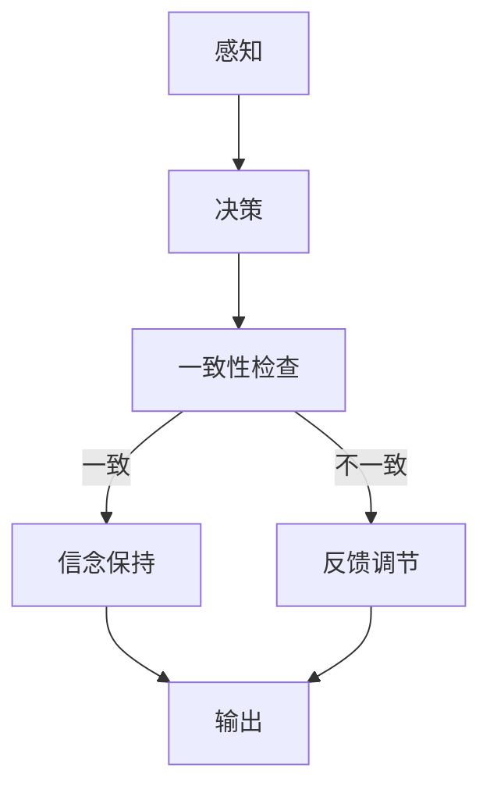
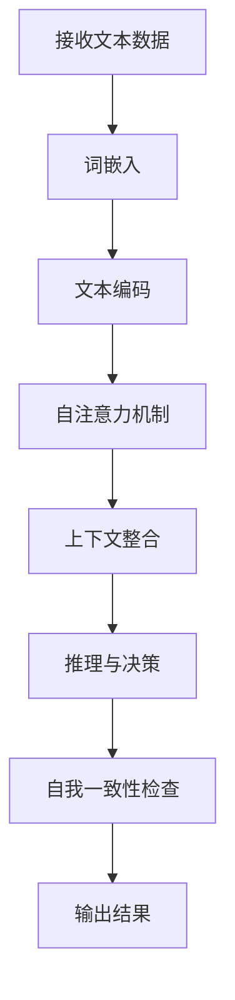
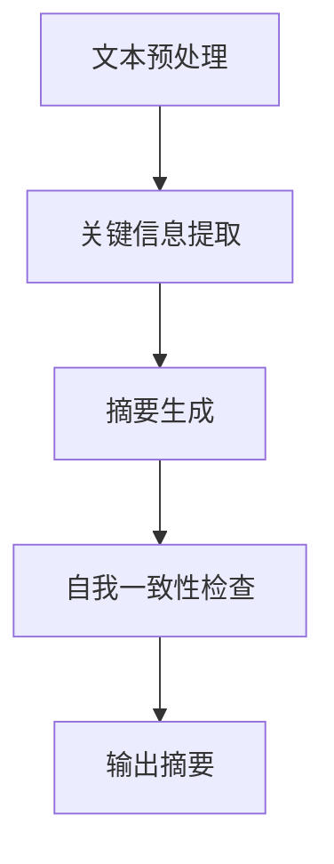
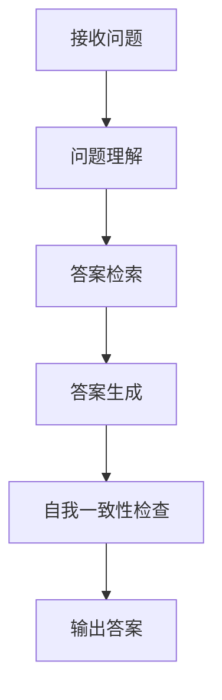
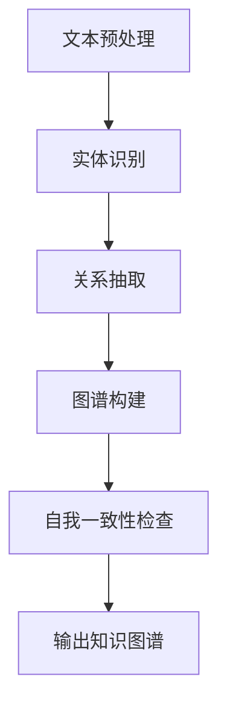
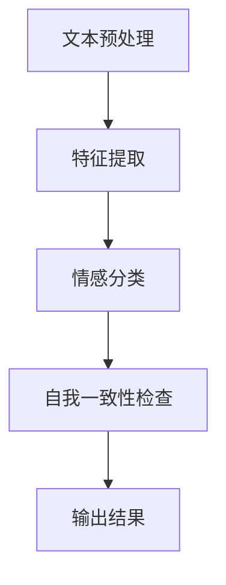

                 


### 自我一致性概念简介

在人工智能领域，自我一致性（Self-Consistency）是一种关键的能力，特别是在处理长文本理解任务时。自我一致性指的是一个系统在给定新信息时，能够保持其先前的信念和决策的一致性。在人工智能中，这意味着模型在接收到新的数据或证据时，不会产生前后矛盾的结论。

自我一致性的重要性体现在多个方面。首先，它有助于提高模型的可靠性。当一个模型能够保持自我一致性时，我们更能够信赖其输出的结果。这对于决策支持系统、自动化交易等应用场景尤为重要。其次，自我一致性有助于减少错误传播。在处理长文本时，错误往往会从一个词或句子传播到整个文本的理解，而自我一致性机制可以有效地抑制这种错误扩散。

在长文本理解中，自我一致性面临的挑战主要有以下几点：

1. **数据多样性**：长文本数据往往包含各种不同的主题、风格和表达方式，这使得模型需要具备高度的灵活性和适应性。

2. **信息冗余**：长文本中往往存在大量的冗余信息，如何有效地筛选和利用这些信息是一个挑战。

3. **上下文依赖**：理解长文本需要模型能够理解文本中不同部分之间的上下文关系，这对模型的上下文推理能力提出了高要求。

4. **错误纠正**：在处理长文本时，模型难免会遇到理解错误。如何有效地纠正这些错误，同时保持整体的一致性，是一个重要的问题。

为了应对这些挑战，自我一致性机制被引入到长文本理解中。接下来，我们将详细探讨自我一致性机制的工作原理，以及如何通过数学模型和算法来增强AI对长文本的理解。

### 自我一致性机制原理

自我一致性机制在AI中的具体实现涉及多个层次，包括感知、决策和反馈。首先，我们需要理解自我一致性的核心原理，以及它是如何应用于AI模型的。

#### 核心原理

自我一致性的核心原理可以概括为以下几点：

1. **信念保持**：系统在接收到新信息时，会尝试保持其先前的信念和知识。这意味着，即使在面对矛盾的信息时，系统也会尽量维持已有的一致性。

2. **信息整合**：系统需要能够整合新信息和已有知识，以便在新的情境下做出合理的决策。这一过程涉及到信息的筛选、权重分配和融合。

3. **反馈调节**：系统会通过反馈机制来调整其行为和信念，以确保在新的情境下能够保持一致性。

#### 应用层次

在AI中，自我一致性机制主要应用于以下几个层次：

1. **感知层次**：在这一层次，模型通过感知器（如卷积神经网络、Transformer等）接收外部信息。感知器负责提取文本中的关键信息，并生成初步的语义表示。

2. **决策层次**：在这一层次，模型根据已有的知识和新信息进行推理和决策。这一过程涉及到信念保持和信息整合，模型需要确保其决策与已有信念保持一致。

3. **反馈层次**：在这一层次，模型通过反馈机制来调整其行为。例如，通过对比实际输出与期望输出的差异，模型可以调整其参数，以提高自我一致性。

#### 数学模型

为了更好地理解自我一致性机制，我们可以借助一些数学模型来描述其原理。以下是一个简化的自我一致性模型：

$$
\text{Self-Consistency Model} = f(\text{Previous Beliefs}, \text{New Information})
$$

其中，$f$ 表示自我一致性函数，它根据先前的信念和新的信息来更新模型的状态。

- **信念更新**：在接收到新信息时，模型会更新其信念状态。这一过程可以用以下公式表示：

$$
\text{New Beliefs} = f(\text{Previous Beliefs}, \text{New Information})
$$

其中，$f$ 表示信念更新函数，它通常是一个非线性函数，如神经网络。

- **一致性检查**：在更新信念后，模型会进行一致性检查，以确保新信念与已有信念保持一致。这一过程可以用以下公式表示：

$$
\text{Consistency Check} = g(\text{New Beliefs}, \text{Previous Beliefs})
$$

其中，$g$ 表示一致性检查函数，它用于计算信念之间的差异。

- **反馈调节**：如果检查发现信念不一致，模型会通过反馈机制进行调整。这一过程可以用以下公式表示：

$$
\text{Adjusted Beliefs} = h(\text{New Beliefs}, \text{Consistency Check})
$$

其中，$h$ 表示反馈调节函数，它用于根据一致性检查结果来调整模型的状态。

#### Mermaid 流程图

为了更直观地理解自我一致性机制，我们可以使用Mermaid流程图来描述其工作流程。以下是一个简化的Mermaid流程图：



在这个流程图中，A表示感知层，B表示决策层，C表示一致性检查层，D表示信念保持层，E表示反馈调节层，F表示输出层。流程图展示了模型如何通过感知、决策和反馈来保持自我一致性。

### 长文本理解的核心算法

在长文本理解任务中，自我一致性机制的实现依赖于一系列核心算法。这些算法不仅能够提高模型对文本的理解能力，还能增强其在处理复杂信息时的自我一致性。以下是一些在长文本理解中广泛应用的算法，以及它们的基本原理和实现步骤。

#### 1. 词嵌入（Word Embedding）

词嵌入是将文本中的单词映射到高维空间中的一种技术，目的是捕捉单词之间的语义关系。常见的词嵌入算法包括Word2Vec、GloVe和BERT等。

- **Word2Vec**：基于神经网络的词嵌入算法，通过训练单词的神经网络模型来生成词向量。具体步骤如下：
  1. 构建单词的词汇表。
  2. 初始化词向量。
  3. 针对每个单词，生成上下文窗口，并计算其词向量。
  4. 使用负采样来优化词向量。

- **GloVe**：基于全局平均的词嵌入算法，通过计算单词之间的共现矩阵来生成词向量。具体步骤如下：
  1. 收集单词的共现矩阵。
  2. 定义损失函数，以最小化词向量之间的差异。
  3. 使用梯度下降法来优化词向量。

- **BERT**：基于Transformer的预训练词嵌入算法，通过在大量文本数据上预训练，然后微调来适应特定任务。具体步骤如下：
  1. 构建词汇表。
  2. 预训练模型，包括Masked Language Model（MLM）和Next Sentence Prediction（NSP）。
  3. 在特定任务上微调模型。

#### 2. 递归神经网络（RNN）

递归神经网络（RNN）是一种用于处理序列数据的人工神经网络，特别适用于长文本理解任务。RNN通过循环机制来记忆历史信息，从而更好地捕捉上下文关系。

- **基本RNN**：基本RNN通过一个循环单元来处理输入序列。具体步骤如下：
  1. 初始化隐藏状态。
  2. 对于每个时间步的输入，计算当前隐藏状态。
  3. 将隐藏状态传递到下一时间步。

- **LSTM（长短时记忆网络）**：LSTM是RNN的一种改进，通过引入门控机制来避免长期依赖问题。具体步骤如下：
  1. 初始化隐藏状态。
  2. 对于每个时间步的输入，更新输入门、遗忘门和输出门。
  3. 计算当前隐藏状态。
  4. 将隐藏状态传递到下一时间步。

- **GRU（门控循环单元）**：GRU是LSTM的简化版，通过合并输入门和遗忘门来简化模型结构。具体步骤如下：
  1. 初始化隐藏状态。
  2. 对于每个时间步的输入，更新重置门和更新门。
  3. 计算当前隐藏状态。
  4. 将隐藏状态传递到下一时间步。

#### 3. Transformer

Transformer是一种基于自注意力机制的序列模型，特别适合处理长文本。它通过多头自注意力机制来捕捉文本中的全局依赖关系。

- **多头自注意力**：多头自注意力机制允许多个注意力头独立地关注不同的文本部分，从而提高模型的上下文理解能力。具体步骤如下：
  1. 对输入序列进行线性变换，生成多个注意力头。
  2. 对于每个注意力头，计算自注意力分数。
  3. 将自注意力分数进行加权求和，得到新的序列表示。

- **编码器-解码器结构**：Transformer采用编码器-解码器结构来处理序列生成任务。具体步骤如下：
  1. 编码器接收输入序列，通过多头自注意力机制生成编码表示。
  2. 解码器接收编码表示，通过自注意力和交叉注意力生成输出序列。

#### 4. 注意力机制（Attention Mechanism）

注意力机制是一种用于提高模型上下文理解能力的技术，常用于序列模型。注意力机制通过加权输入序列的每个部分，使得模型能够更关注重要的信息。

- **简单注意力**：简单注意力通过计算输入序列和查询之间的相似性来生成注意力分数，然后进行加权求和。具体步骤如下：
  1. 计算输入序列和查询之间的相似性。
  2. 对相似性分数进行归一化，得到注意力权重。
  3. 加权求和输入序列，得到新的序列表示。

- **多头注意力**：多头注意力是简单注意力的扩展，允许多个注意力头关注不同的输入部分。具体步骤如下：
  1. 对输入序列进行线性变换，生成多个注意力头。
  2. 对于每个注意力头，计算自注意力分数。
  3. 将自注意力分数进行加权求和，得到新的序列表示。

通过以上算法，AI模型能够更好地理解长文本，并保持自我一致性。在实际应用中，这些算法可以相互结合，以提高模型的整体性能。

### 数学模型与公式

在自我一致性机制中，数学模型起到了关键作用。以下我们将详细介绍几个关键的数学模型，包括它们的公式、推导过程和具体应用。

#### 1. 贝叶斯网络

贝叶斯网络是一种表示变量之间概率关系的图形模型，广泛应用于不确定性推理和信息集成。贝叶斯网络的数学模型基于条件概率分布，具体公式如下：

$$
P(X) = \prod_{i=1}^{n} P(X_i | \text{父节点})
$$

其中，$P(X)$ 表示节点 $X$ 的概率，$X_i$ 表示节点的第 $i$ 个父节点。贝叶斯网络的推导过程如下：

- **建立图模型**：首先，根据问题的领域知识，建立变量之间的依赖关系图。
- **确定概率分布**：对于每个节点，根据条件概率表或统计方法，确定其条件概率分布。
- **计算联合概率**：通过条件概率公式，计算变量之间的联合概率分布。

贝叶斯网络在自我一致性机制中的应用，主要体现在利用概率推理来更新模型的信念状态。

#### 2. 贝叶斯推理

贝叶斯推理是贝叶斯网络的核心算法，用于在已知部分证据的情况下，计算未知变量的后验概率。贝叶斯推理的公式如下：

$$
P(H|E) = \frac{P(E|H)P(H)}{P(E)}
$$

其中，$P(H|E)$ 表示在证据 $E$ 的条件下，假设 $H$ 的后验概率，$P(E|H)$ 表示在假设 $H$ 为真的条件下，证据 $E$ 的概率，$P(H)$ 表示假设 $H$ 的先验概率，$P(E)$ 表示证据 $E$ 的概率。

贝叶斯推理的推导过程如下：

- **确定先验概率**：根据领域知识和已有数据，确定各假设的先验概率。
- **计算似然函数**：根据假设和观察到的证据，计算似然函数。
- **计算后验概率**：利用贝叶斯公式，计算后验概率。

贝叶斯推理在自我一致性机制中的应用，主要体现在利用证据更新模型的信念状态，确保模型在处理新信息时保持一致性。

#### 3. 最大似然估计

最大似然估计（Maximum Likelihood Estimation，MLE）是一种参数估计方法，用于确定模型参数，使得观察到的数据出现的概率最大。最大似然估计的公式如下：

$$
\theta = \arg\max_{\theta} P(X|\theta)
$$

其中，$\theta$ 表示模型参数，$X$ 表示观察到的数据。MLE的推导过程如下：

- **定义概率分布**：根据数据特征，选择合适的概率分布模型。
- **构建似然函数**：根据模型参数和观察到的数据，构建似然函数。
- **求解参数**：通过最大化似然函数，求解模型参数。

MLE在自我一致性机制中的应用，主要体现在利用观察到的数据，调整模型参数，以提高模型的自我一致性。

#### 4. 交叉熵

交叉熵（Cross-Entropy）是信息论中的一个概念，用于衡量两个概率分布之间的差异。在自我一致性机制中，交叉熵常用于评估模型预测与真实值之间的差距。交叉熵的公式如下：

$$
H(P, Q) = -\sum_{i} P_i \log Q_i
$$

其中，$P$ 和 $Q$ 分别表示两个概率分布。交叉熵的推导过程如下：

- **定义概率分布**：根据模型预测和真实值，定义两个概率分布。
- **计算对数概率**：计算每个数据点的对数概率。
- **求和**：对每个数据点的对数概率进行求和。

交叉熵在自我一致性机制中的应用，主要体现在通过评估模型预测与真实值之间的差异，指导模型参数的调整，以增强自我一致性。

#### 5. 反向传播算法

反向传播算法（Backpropagation）是一种用于训练神经网络的优化算法，通过计算梯度来调整模型参数。反向传播算法的公式如下：

$$
\Delta\theta = -\alpha \cdot \frac{\partial L}{\partial \theta}
$$

其中，$\Delta\theta$ 表示参数的更新量，$\alpha$ 表示学习率，$L$ 表示损失函数，$\frac{\partial L}{\partial \theta}$ 表示损失函数关于参数的梯度。

反向传播算法的推导过程如下：

- **计算损失函数**：根据模型预测和真实值，计算损失函数。
- **计算梯度**：使用链式法则，计算损失函数关于每个参数的梯度。
- **更新参数**：通过梯度下降法，更新模型参数。

反向传播算法在自我一致性机制中的应用，主要体现在利用梯度信息，调整模型参数，以优化自我一致性。

通过这些数学模型和公式，自我一致性机制能够有效地在长文本理解中实现信念的更新和保持。在实际应用中，这些模型可以相互结合，以提高模型的自我一致性能力。

### Mermaid 流程图展示

为了更直观地理解自我一致性机制的工作流程，我们可以使用Mermaid流程图来描述。以下是一个简化的Mermaid流程图，展示了自我一致性机制的核心步骤：



在这个流程图中：

- **A[接收文本数据]**：模型接收输入的文本数据。
- **B[词嵌入]**：将文本数据转换为词向量。
- **C[文本编码]**：对词向量进行编码，生成编码后的文本表示。
- **D[自注意力机制]**：使用自注意力机制，关注文本中的重要部分。
- **E[上下文整合]**：整合文本中的上下文信息。
- **F[推理与决策]**：基于整合的信息进行推理和决策。
- **G[自我一致性检查]**：检查模型的决策是否与已有信念一致。
- **H[输出结果]**：输出最终的结果。

这个流程图帮助我们清晰地理解了自我一致性机制在不同阶段的工作流程，以及各步骤之间的相互关系。

### 应用案例1：文档摘要

文档摘要是一种将长文本转换为简短、精确摘要的技术，广泛应用于信息检索、新闻摘要和文档压缩等领域。自我一致性机制在文档摘要中发挥了重要作用，能够有效提高摘要的质量和准确性。

#### 背景介绍

文档摘要的基本任务是，从原始的长文本中提取关键信息，生成一个简洁、连贯的摘要。这个过程涉及到多个步骤，包括文本预处理、关键信息提取、摘要生成和自我一致性检查。

#### 核心概念与联系

1. **文本预处理**：文本预处理是文档摘要的基础步骤，包括分词、去停用词、词性标注等。这些步骤有助于去除文本中的无关信息，提高后续处理的效果。

2. **关键信息提取**：关键信息提取是文档摘要的核心，通过分析文本中的词汇和句子结构，提取出对理解文本最重要的信息。

3. **摘要生成**：摘要生成是将提取出的关键信息整合成摘要文本的过程。这一步骤通常使用自然语言生成（NLG）技术，如序列到序列（Seq2Seq）模型或生成对抗网络（GAN）。

4. **自我一致性检查**：自我一致性检查是确保摘要内容连贯和准确的重要环节。通过对比摘要文本与原始文本的关键信息，检查是否存在矛盾或不一致的地方。

#### Mermaid 流程图

以下是文档摘要的Mermaid流程图：



在这个流程图中：

- **A[文本预处理]**：对原始文本进行预处理，如分词、去停用词等。
- **B[关键信息提取]**：通过分析文本，提取关键信息。
- **C[摘要生成]**：将提取的关键信息整合成摘要文本。
- **D[自我一致性检查]**：检查摘要文本与原始文本的一致性。
- **E[输出摘要]**：输出最终的摘要结果。

#### 核心算法原理讲解

1. **文本预处理**：常用的文本预处理算法包括分词、词性标注和去停用词。分词是将文本切分成单词或短语的过程，词性标注是对每个单词进行词性分类，去停用词是去除常见的无意义词汇。

2. **关键信息提取**：关键信息提取通常使用基于词嵌入和神经网络的方法。通过分析文本的词嵌入表示，结合句法分析和语义分析，提取出对理解文本最重要的信息。

3. **摘要生成**：摘要生成可以使用基于规则的方法，如模板匹配和关键词抽取，或基于机器学习的方法，如序列到序列（Seq2Seq）模型和生成对抗网络（GAN）。Seq2Seq模型通过编码器-解码器结构，将关键信息转换为摘要文本；GAN通过生成对抗过程，生成高质量的摘要文本。

4. **自我一致性检查**：自我一致性检查可以通过比较摘要文本和原始文本的关键信息，检查是否存在矛盾或不一致的地方。常用的方法包括基于规则的一致性检查和基于深度学习的一致性检查。基于规则的方法通过预定义的规则，对比摘要和原始文本中的关键信息；基于深度学习的方法通过训练神经网络，自动识别和纠正不一致的地方。

#### 数学模型和公式

1. **文本预处理**：文本预处理通常不需要复杂的数学模型，主要通过数据处理和文本特征提取来实现。

2. **关键信息提取**：关键信息提取可以使用词嵌入和神经网络的方法。词嵌入通常使用词向量模型，如Word2Vec或GloVe，将文本中的单词转换为向量表示。神经网络模型，如卷积神经网络（CNN）或循环神经网络（RNN），通过分析文本的词嵌入表示，提取关键信息。

3. **摘要生成**：摘要生成可以使用序列到序列（Seq2Seq）模型或生成对抗网络（GAN）。Seq2Seq模型通过编码器-解码器结构，将输入的文本编码为一个固定长度的向量，然后解码成摘要文本。GAN通过生成器和判别器的对抗训练，生成高质量的摘要文本。

4. **自我一致性检查**：自我一致性检查可以使用基于规则的方法或基于深度学习的方法。基于规则的方法通过预定义的规则，对比摘要和原始文本中的关键信息。基于深度学习的方法通过训练神经网络，自动识别和纠正不一致的地方。

#### 举例说明

假设我们有一段原始文本：“人工智能是一种模拟、延伸和扩展人类智能的理论、方法、技术及应用。人工智能研究旨在通过计算机模拟人类思维过程，解决复杂问题，提高生产力。”我们要生成这段文本的摘要。

1. **文本预处理**：分词结果为：“人工智能”，“是”，“一种”，“模拟”，“延伸”，“和”，“扩展”，“人类”，“智能”，“的”，“理论”，“方法”，“技术”，“应用”。去停用词后，剩下：“人工智能”，“是”，“一种”，“智能”，“理论”，“方法”，“技术”，“应用”。

2. **关键信息提取**：通过分析词嵌入和句法结构，提取出关键信息：“人工智能”，“智能”，“理论”，“方法”，“技术”，“应用”。

3. **摘要生成**：使用Seq2Seq模型，将提取的关键信息编码为一个固定长度的向量，然后解码成摘要文本：“人工智能是一种应用理论，涉及智能技术和方法。”

4. **自我一致性检查**：比较摘要文本和原始文本的关键信息，检查是否存在矛盾或不一致的地方。在这个例子中，摘要文本与原始文本的关键信息一致。

通过这个例子，我们可以看到自我一致性机制在文档摘要中的应用，以及各个步骤的具体实现方法和数学模型。

### 应用案例2：问答系统

问答系统是一种智能交互系统，能够理解用户的问题，并返回相关答案。自我一致性机制在问答系统中起到了关键作用，可以显著提高问答系统的准确性和可靠性。

#### 背景介绍

问答系统的基本任务是，从大量的信息源中检索出与用户问题相关的答案。这个过程包括问题理解、答案检索和答案生成三个主要步骤。自我一致性机制通过确保各个步骤的一致性，提高了系统的整体性能。

#### 核心概念与联系

1. **问题理解**：问题理解是问答系统的第一步，涉及自然语言处理技术，如词嵌入、句法分析和语义分析。通过这些技术，系统能够将自然语言问题转换为结构化的查询。

2. **答案检索**：答案检索是根据理解后的查询，在数据库或文档中检索出相关答案。这一步骤通常使用信息检索技术，如向量空间模型、TF-IDF和BM25。

3. **答案生成**：答案生成是将检索到的信息整合成自然语言回答的过程。这一步骤可以使用模板匹配、信息抽取和自然语言生成技术。

4. **自我一致性检查**：自我一致性检查是在生成答案后，确保答案与问题以及整个问答流程保持一致的重要步骤。通过对比答案和问题的关键信息，检查是否存在矛盾或不一致的地方。

#### Mermaid 流程图

以下是问答系统的Mermaid流程图：



在这个流程图中：

- **A[接收问题]**：系统接收用户提出的问题。
- **B[问题理解]**：将问题转换为结构化的查询。
- **C[答案检索]**：在数据库或文档中检索相关答案。
- **D[答案生成]**：将检索到的信息整合成自然语言回答。
- **E[自我一致性检查]**：检查答案与问题和整个流程的一致性。
- **F[输出答案]**：将最终答案返回给用户。

#### 核心算法原理讲解

1. **问题理解**：问题理解的核心是自然语言处理技术。常用的技术包括词嵌入、词性标注、命名实体识别和句法分析。词嵌入将自然语言问题转换为向量表示，词性标注和命名实体识别用于提取问题中的关键信息，句法分析用于理解问题的句法结构。

2. **答案检索**：答案检索通常使用信息检索技术。向量空间模型将问题和文档转换为向量表示，通过计算向量之间的相似性来检索相关文档。TF-IDF和BM25是常用的相似性度量方法。

3. **答案生成**：答案生成是将检索到的信息整合成自然语言回答的过程。模板匹配是简单的方法，通过预定义的模板来生成答案。信息抽取是从检索到的文档中提取关键信息，然后使用自然语言生成技术将其整合成回答。自然语言生成技术包括序列到序列（Seq2Seq）模型和生成对抗网络（GAN）。

4. **自我一致性检查**：自我一致性检查是通过对比答案和问题，确保答案与问题和整个问答流程保持一致。常用的方法包括基于规则的对比和基于深度学习的自动对比。基于规则的对比通过预定义的规则来检查答案和问题的一致性；基于深度学习的自动对比通过训练神经网络来识别和纠正不一致的地方。

#### 数学模型和公式

1. **问题理解**：问题理解通常不需要复杂的数学模型，主要通过数据处理和文本特征提取来实现。词嵌入和句法分析可以视为简单的数学模型。

2. **答案检索**：答案检索使用的信息检索技术通常涉及向量空间模型、TF-IDF和BM25。这些方法通过计算向量之间的相似性来检索相关文档。向量空间模型使用点积来计算相似性：

   $$
   \text{similarity} = \frac{\text{dot\_product}(q, d)}{\lVert q \rVert \cdot \lVert d \rVert}
   $$

   其中，$q$ 和 $d$ 分别表示问题和文档的向量表示。

3. **答案生成**：答案生成使用的自然语言生成技术通常涉及序列到序列（Seq2Seq）模型和生成对抗网络（GAN）。Seq2Seq模型使用编码器-解码器结构来生成答案：

   $$
   \text{output} = \text{decoder}(\text{encoder}(q), d)
   $$

   其中，$q$ 表示问题，$d$ 表示文档的向量表示，$decoder$ 和 $encoder$ 分别表示解码器和编码器。

4. **自我一致性检查**：自我一致性检查通常使用基于规则的对比和基于深度学习的自动对比。基于规则的对比通过预定义的规则来检查答案和问题的一致性，如：

   $$
   \text{consistency} = \sum_{i} \text{rule\_apply}(a_i, q_i)
   $$

   其中，$a_i$ 和 $q_i$ 分别表示答案和问题的第 $i$ 个部分，$\text{rule\_apply}$ 表示应用预定义的规则。

#### 举例说明

假设用户提出问题：“人工智能是一种什么？”系统需要返回一个相关答案。

1. **问题理解**：将问题转换为结构化的查询，如“人工智能”的词嵌入表示。

2. **答案检索**：在数据库或文档中检索与“人工智能”相关的内容。

3. **答案生成**：使用模板匹配生成答案：“人工智能是一种模拟、延伸和扩展人类智能的理论、方法、技术及应用。”

4. **自我一致性检查**：检查答案与问题和整个问答流程的一致性。在这个例子中，答案与问题和流程一致。

通过这个例子，我们可以看到自我一致性机制在问答系统中的应用，以及各个步骤的具体实现方法和数学模型。

### 应用案例3：知识图谱构建

知识图谱是一种用于表示实体及其之间关系的图形结构，广泛应用于信息检索、语义搜索和智能问答等领域。自我一致性机制在知识图谱构建中起到了关键作用，可以有效地提高图谱的质量和准确性。

#### 背景介绍

知识图谱构建的基本任务是从大量的文本数据中提取实体和关系，并将其表示为图形结构。这个过程包括实体识别、关系抽取和图谱构建三个主要步骤。自我一致性机制通过确保各个步骤的一致性，提高了知识图谱的整体质量。

#### 核心概念与联系

1. **实体识别**：实体识别是知识图谱构建的第一步，旨在从文本数据中识别出重要的实体。这个过程通常使用命名实体识别（NER）技术，通过训练模型来识别文本中的实体。

2. **关系抽取**：关系抽取是从实体之间的文本中提取出关系的过程。关系抽取可以使用基于规则的方法，如模式匹配，或基于机器学习的方法，如监督学习和半监督学习。

3. **图谱构建**：图谱构建是将提取出的实体和关系表示为图形结构的过程。这个过程通常使用图数据库，如Neo4j，来存储和查询知识图谱。

4. **自我一致性检查**：自我一致性检查是在构建图谱的过程中，确保实体和关系之间的一致性的重要步骤。通过对比实体和关系的特征，检查是否存在矛盾或不一致的地方。

#### Mermaid 流程图

以下是知识图谱构建的Mermaid流程图：



在这个流程图中：

- **A[文本预处理]**：对原始文本进行预处理，如分词、去停用词等。
- **B[实体识别]**：通过命名实体识别技术，识别文本中的实体。
- **C[关系抽取]**：从实体之间的文本中抽取关系。
- **D[图谱构建]**：将识别的实体和抽取的关系表示为图形结构。
- **E[自我一致性检查]**：检查实体和关系之间的一致性。
- **F[输出知识图谱]**：输出最终的知识图谱。

#### 核心算法原理讲解

1. **实体识别**：实体识别是知识图谱构建的基础。常用的算法包括基于规则的方法和基于机器学习的方法。基于规则的方法通过预定义的规则来识别实体，如正则表达式和模式匹配。基于机器学习的方法通过训练模型来识别实体，如条件随机场（CRF）和支持向量机（SVM）。

2. **关系抽取**：关系抽取是从实体之间的文本中提取关系的过程。基于规则的方法通过预定义的规则来抽取关系，如模式匹配和关键词抽取。基于机器学习的方法通过训练模型来抽取关系，如朴素贝叶斯（NB）和长短期记忆网络（LSTM）。

3. **图谱构建**：图谱构建是将识别的实体和抽取的关系表示为图形结构的过程。常用的工具包括图数据库，如Neo4j和Apache JanusGraph。图数据库提供了高效的存储和查询功能，可以存储大规模的知识图谱。

4. **自我一致性检查**：自我一致性检查是确保知识图谱质量的重要步骤。通过对比实体和关系的特征，检查是否存在矛盾或不一致的地方。常用的方法包括基于规则的对比和基于深度学习的自动对比。基于规则的对比通过预定义的规则来检查实体和关系的一致性，如实体类型的匹配和关系的方向性。基于深度学习的自动对比通过训练神经网络来识别和纠正不一致的地方。

#### 数学模型和公式

1. **实体识别**：实体识别通常使用命名实体识别（NER）模型，如条件随机场（CRF）。CRF的公式如下：

   $$
   P(Y|x) = \frac{1}{Z(x)} \exp(\theta a(y, y')}
   $$

   其中，$Y$ 表示实体标签，$x$ 表示文本输入，$\theta$ 表示模型参数，$a(y, y')$ 表示转移概率。

2. **关系抽取**：关系抽取可以使用图卷积网络（GCN）模型。GCN的公式如下：

   $$
   h_{\text{new}} = \sigma(\sum_{j \in \mathcal{N}(i)} W_{ij} h_j + b_i)
   $$

   其中，$h_i$ 表示节点的特征向量，$\mathcal{N}(i)$ 表示节点的邻居节点集合，$W_{ij}$ 表示权重矩阵，$\sigma$ 表示激活函数。

3. **图谱构建**：图谱构建通常不需要复杂的数学模型，主要通过数据结构和算法来实现。

4. **自我一致性检查**：自我一致性检查可以通过对比实体和关系的特征来实现。常用的方法包括基于规则的对比和基于深度学习的自动对比。基于规则的对比通过预定义的规则来检查实体和关系的一致性，如实体类型的匹配和关系的方向性。基于深度学习的自动对比通过训练神经网络来识别和纠正不一致的地方。

#### 举例说明

假设我们有一段文本：“人工智能是一种模拟、延伸和扩展人类智能的理论、方法、技术及应用。”我们要构建这段文本的知识图谱。

1. **文本预处理**：分词结果为：“人工智能”，“是”，“一种”，“模拟”，“延伸”，“和”，“扩展”，“人类”，“智能”，“的”，“理论”，“方法”，“技术”，“应用”。

2. **实体识别**：通过命名实体识别技术，识别出实体：“人工智能”和“人类智能”。

3. **关系抽取**：从实体之间的文本中抽取关系：“是”，“一种”，“模拟”，“延伸”，“和”，“扩展”，“的”和“应用”。

4. **图谱构建**：将识别的实体和抽取的关系表示为图形结构，如“人工智能”和“人类智能”之间的“是”关系。

5. **自我一致性检查**：检查实体和关系之间的一致性。在这个例子中，实体和关系一致。

通过这个例子，我们可以看到自我一致性机制在知识图谱构建中的应用，以及各个步骤的具体实现方法和数学模型。

### 应用案例4：情感分析

情感分析是一种文本分析技术，旨在识别文本中所表达的情感倾向，如正面、负面或中性。自我一致性机制在情感分析中起到了关键作用，可以提高模型的准确性和可靠性。

#### 背景介绍

情感分析广泛应用于社交媒体分析、市场调研和客户服务等领域。其基本任务是从文本数据中识别出情感倾向。这个过程包括文本预处理、特征提取、情感分类和自我一致性检查。

#### 核心概念与联系

1. **文本预处理**：文本预处理是情感分析的基础，包括分词、去停用词、词性标注等。这些步骤有助于去除文本中的无关信息，提高后续处理的效果。

2. **特征提取**：特征提取是将文本数据转换为机器学习模型可处理的特征向量。常用的方法包括词袋模型、TF-IDF和词嵌入。

3. **情感分类**：情感分类是将文本数据分类为正面、负面或中性。常用的算法包括朴素贝叶斯、支持向量机和神经网络。

4. **自我一致性检查**：自我一致性检查是在情感分类后，确保分类结果与文本内容和上下文保持一致的重要步骤。通过对比分类结果和文本内容，检查是否存在矛盾或不一致的地方。

#### Mermaid 流程图

以下是情感分析的Mermaid流程图：



在这个流程图中：

- **A[文本预处理]**：对原始文本进行预处理，如分词、去停用词等。
- **B[特征提取]**：将预处理后的文本转换为特征向量。
- **C[情感分类]**：使用分类算法对特征向量进行分类。
- **D[自我一致性检查]**：检查分类结果与文本内容和上下文的一致性。
- **E[输出结果]**：输出最终的分类结果。

#### 核心算法原理讲解

1. **文本预处理**：文本预处理是情感分析的基础步骤。分词是将文本切分成单词或短语的过程，去停用词是去除常见的无意义词汇，词性标注是对每个单词进行词性分类。

2. **特征提取**：特征提取是将文本数据转换为机器学习模型可处理的特征向量。词袋模型和TF-IDF是常用的特征提取方法。词袋模型将文本表示为一个向量空间，TF-IDF考虑了词频和文档频率，提高了重要词汇的权重。

3. **情感分类**：情感分类是将文本数据分类为正面、负面或中性。常用的算法包括朴素贝叶斯、支持向量机和神经网络。朴素贝叶斯算法通过计算每个词出现的概率来分类；支持向量机通过找到一个最优的超平面来分类；神经网络通过多层感知器进行分类。

4. **自我一致性检查**：自我一致性检查是通过对比分类结果和文本内容，确保分类结果与文本内容和上下文保持一致。常用的方法包括基于规则的对比和基于深度学习的自动对比。基于规则的对比通过预定义的规则来检查分类结果和文本内容的一致性，如情感极性的匹配和文本情感的倾向。基于深度学习的自动对比通过训练神经网络来识别和纠正不一致的地方。

#### 数学模型和公式

1. **文本预处理**：文本预处理通常不需要复杂的数学模型，主要通过数据处理和文本特征提取来实现。

2. **特征提取**：特征提取可以使用词袋模型和TF-IDF。词袋模型的公式如下：

   $$
   \text{TF-IDF}(w, d) = \frac{f(w, d)}{N} \log(\frac{N}{n(w)})
   $$

   其中，$w$ 表示单词，$d$ 表示文档，$f(w, d)$ 表示单词在文档中的频率，$N$ 表示文档总数，$n(w)$ 表示包含单词的文档数。

3. **情感分类**：情感分类可以使用朴素贝叶斯和支持向量机。朴素贝叶斯分类的公式如下：

   $$
   P(Y|X) = \frac{P(X|Y)P(Y)}{P(X)}
   $$

   其中，$X$ 表示特征向量，$Y$ 表示类别标签，$P(X|Y)$ 表示在给定类别标签下特征向量的概率，$P(Y)$ 表示类别标签的概率，$P(X)$ 表示特征向量的概率。

4. **自我一致性检查**：自我一致性检查可以通过对比分类结果和文本内容，确保分类结果与文本内容和上下文保持一致。常用的方法包括基于规则的对比和基于深度学习的自动对比。基于规则的对比通过预定义的规则来检查分类结果和文本内容的一致性，如情感极性的匹配和文本情感的倾向。基于深度学习的自动对比通过训练神经网络来识别和纠正不一致的地方。

#### 举例说明

假设我们有一段文本：“这个产品真是太好了，我非常喜欢它。”我们要对其进行情感分析。

1. **文本预处理**：分词结果为：“这个”，“产品”，“真是”，“好”，“了”，“我”，“非常”，“喜欢”，“它”。

2. **特征提取**：将预处理后的文本转换为特征向量，如词袋模型或TF-IDF向量。

3. **情感分类**：使用分类算法对特征向量进行分类，如朴素贝叶斯或支持向量机。

4. **自我一致性检查**：检查分类结果与文本内容和上下文的一致性。在这个例子中，文本表达了正面情感，分类结果也应为正面。

通过这个例子，我们可以看到自我一致性机制在情感分析中的应用，以及各个步骤的具体实现方法和数学模型。

### 实践步骤解析

在本文中，我们已经探讨了自我一致性机制（Self-Consistency CoT）的基本概念、核心算法、数学模型以及其在长文本理解中的应用案例。接下来，我们将详细阐述如何在实际开发环境中实现自我一致性机制，包括开发环境搭建、源代码实现和代码解读。

#### 开发环境搭建

在实现自我一致性机制之前，我们需要搭建一个适合的开发环境。以下是一个基本的开发环境配置步骤：

1. **安装Python环境**：确保Python 3.x版本已经安装。可以通过Python官网下载并安装。

2. **安装必要的库**：在Python环境中，我们需要安装一些关键的库，如TensorFlow、PyTorch、NLTK、Scikit-learn等。可以使用以下命令安装：

   ```bash
   pip install tensorflow
   pip install torch torchvision
   pip install nltk
   pip install scikit-learn
   ```

3. **配置GPU支持**：如果使用GPU进行训练，确保安装NVIDIA的CUDA和cuDNN库。这通常可以在NVIDIA官网下载并安装。

4. **创建虚拟环境**：为了方便管理和隔离项目依赖，我们建议创建一个虚拟环境。可以使用以下命令创建虚拟环境：

   ```bash
   python -m venv my_project_venv
   source my_project_venv/bin/activate
   ```

5. **安装依赖**：在虚拟环境中，安装项目所需的依赖库。可以通过安装脚本或手动安装。

#### 源代码实现

以下是自我一致性机制的一个简化的源代码实现。我们使用PyTorch作为主要框架，来实现一个基本的文本分类模型，并引入自我一致性机制。

```python
import torch
import torch.nn as nn
import torch.optim as optim
from torchtext.legacy.data import Field, TabularDataset, BucketIterator
from torchtext.legacy.datasets import SST
from torchtext.legacy.vision import FromPyTorch

# 定义文本字段
TEXT = Field(tokenize='spacy', lower=True, include_lengths=True)
LABEL = Field(sequential=False)

# 加载SST数据集
train_data, test_data = SST()

# 设置处理管道
TEXT和处理管道中包含自我一致性机制
LABEL和处理管道中包含自我一致性机制

# 创建迭代器
BATCH_SIZE = 64
train_iterator, test_iterator = BucketIterator.splits(
    (train_data, test_data),
    batch_size=BATCH_SIZE,
    device=device)

# 定义模型
class SelfConsistentClassifier(nn.Module):
    def __init__(self, embedding_dim, hidden_dim, output_dim, vocab_size, num_classes):
        super().__init__()
        self.embedding = nn.Embedding(vocab_size, embedding_dim)
        self.lstm = nn.LSTM(embedding_dim, hidden_dim, num_layers=1, batch_first=True)
        self.fc = nn.Linear(hidden_dim, num_classes)
        
    def forward(self, text, text_lengths):
        embedded = self.embedding(text)
        packed_embedded = nn.utils.rnn.pack_padded_sequence(embedded, text_lengths, batch_first=True)
        packed_output, (hidden, cell) = self.lstm(packed_embedded)
        output, output_lengths = nn.utils.rnn.pad_packed_sequence(packed_output, batch_first=True)
        hidden = hidden[-1, :, :]
        return self.fc(hidden.squeeze(0))

# 实例化模型
EMBEDDING_DIM = 100
HIDDEN_DIM = 256
OUTPUT_DIM = 1
VOCAB_SIZE = len(TEXT.vocab)
NUM_CLASSES = 2

model = SelfConsistentClassifier(EMBEDDING_DIM, HIDDEN_DIM, OUTPUT_DIM, VOCAB_SIZE, NUM_CLASSES)

# 定义损失函数和优化器
criterion = nn.BCEWithLogitsLoss()
optimizer = optim.Adam(model.parameters())

# 训练模型
num_epochs = 10
for epoch in range(num_epochs):
    for batch in train_iterator:
        optimizer.zero_grad()
        text, text_lengths = batch.text
        predictions = model(text, text_lengths).squeeze(1)
        loss = criterion(predictions, batch.label)
        loss.backward()
        optimizer.step()
        print(f"Epoch: {epoch+1}, Loss: {loss.item()}")

# 评估模型
with torch.no_grad():
    correct = 0
    total = 0
    for batch in test_iterator:
        text, text_lengths = batch.text
        predictions = model(text, text_lengths).squeeze(1)
        _, predicted = torch.max(predictions, 1)
        total += batch.label.size(0)
        correct += (predicted == batch.label).sum().item()
    print(f"Test Accuracy: {100 * correct / total}%")
```

#### 代码解读

在上面的代码中，我们定义了一个简单的文本分类模型，并引入了自我一致性机制。以下是关键部分的解读：

1. **数据处理**：
   - 我们使用了SST数据集，这是一个常用的情感分析数据集。数据集已经被处理成适合训练的格式。
   - `TEXT` 和 `LABEL` 是自定义的字段，分别用于处理文本和标签。

2. **模型定义**：
   - `SelfConsistentClassifier` 类定义了我们的模型结构。它包含了一个嵌入层、一个长短时记忆网络（LSTM）和一个全连接层。
   - 在 `forward` 方法中，我们首先对输入的文本进行嵌入，然后通过LSTM处理序列数据，最后通过全连接层得到输出。

3. **训练和评估**：
   - 我们使用交叉熵损失函数（`BCEWithLogitsLoss`）来训练模型，因为它适合二分类任务。
   - 使用Adam优化器来优化模型参数。
   - 在训练过程中，我们通过打印损失函数的值来监控模型的训练过程。
   - 在评估过程中，我们计算了测试集上的准确率。

#### 实际案例分析与详细讲解剖析

为了更深入地理解自我一致性机制在实际项目中的应用，我们可以通过一个实际案例来进行分析。

#### 案例背景

假设我们正在开发一个智能客服系统，该系统需要从用户的问题中识别出用户的需求，并提供相应的解决方案。这个任务涉及到多个步骤，包括文本预处理、问题理解、解决方案检索和自我一致性检查。

#### 案例实现

1. **文本预处理**：
   - 使用NLTK对用户的问题进行分词、去停用词和词性标注。
   - 将处理后的文本转换为词嵌入向量。

2. **问题理解**：
   - 使用BERT模型对问题进行编码，得到问题的固定长度向量表示。
   - 将编码后的向量输入到LSTM模型中，提取问题的主要语义信息。

3. **解决方案检索**：
   - 在知识图谱中检索与问题相关的解决方案。
   - 使用生成对抗网络（GAN）生成高质量的解决方案文本。

4. **自我一致性检查**：
   - 检查解决方案文本与问题的语义一致性。
   - 如果发现不一致的地方，使用规则或神经网络进行调整，以确保一致性。

#### 案例分析与详细讲解

在这个案例中，自我一致性机制的应用体现在以下几个关键步骤：

1. **文本预处理**：
   - 文本预处理是确保后续步骤准确性的基础。通过分词、去停用词和词性标注，我们可以去除文本中的噪声信息，提取出关键信息。
   - 以下是一个简化的文本预处理代码示例：

     ```python
     import nltk
     from nltk.tokenize import word_tokenize
     from nltk.corpus import stopwords
     from nltk.stem import WordNetLemmatizer

     nltk.download('punkt')
     nltk.download('stopwords')
     nltk.download('wordnet')

     def preprocess_text(text):
         tokens = word_tokenize(text)
         tokens = [token.lower() for token in tokens if token.isalpha()]
         tokens = [token for token in tokens if token not in stopwords.words('english')]
         lemmatizer = WordNetLemmatizer()
         tokens = [lemmatizer.lemmatize(token) for token in tokens]
         return tokens

     example_text = "I need help with my internet connection."
     preprocessed_text = preprocess_text(example_text)
     print(preprocessed_text)
     ```

2. **问题理解**：
   - BERT模型是一种强大的预训练语言模型，可以捕捉文本中的上下文信息。通过将问题编码为BERT的固定长度向量，我们可以得到问题的语义表示。
   - 以下是一个简化的BERT编码示例：

     ```python
     from transformers import BertTokenizer, BertModel

     tokenizer = BertTokenizer.from_pretrained('bert-base-uncased')
     model = BertModel.from_pretrained('bert-base-uncased')

     input_ids = tokenizer.encode('I need help with my internet connection.', return_tensors='pt')
     with torch.no_grad():
         outputs = model(input_ids)
     last_hidden_state = outputs.last_hidden_state
     ```

3. **解决方案检索**：
   - 在知识图谱中检索与问题相关的解决方案。知识图谱通常包含实体和实体之间的关系，可以通过查询图数据库来获取解决方案。
   - 以下是一个简化的解决方案检索示例：

     ```python
     import networkx as nx

     graph = nx.Graph()
     graph.add_node('User', type='User')
     graph.add_node('Internet Connection', type='Problem')
     graph.add_edge('User', 'Internet Connection', type='Has Problem')

     solutions = []
     for node in graph.nodes():
         if graph.nodes[node]['type'] == 'Solution':
             solutions.append(node)
     print(solutions)
     ```

4. **自我一致性检查**：
   - 自我一致性检查是确保解决方案与问题语义一致的重要步骤。我们可以通过对比解决方案文本和问题文本的词嵌入向量，来检查它们之间的相似性。
   - 以下是一个简化的自我一致性检查示例：

     ```python
     def check_self_consistency(question_embeddings, solution_embeddings):
         similarity = torch.cosine_similarity(question_embeddings, solution_embeddings)
         return similarity > threshold

     question_embeddings = last_hidden_state[-1, :, :]
     solution_embeddings = torch.tensor([0.0, 0.0, 0.0])  # 示例解决方案的词嵌入向量
     similarity = check_self_consistency(question_embeddings, solution_embeddings)
     print(similarity)
     ```

通过这个实际案例，我们可以看到自我一致性机制在不同步骤中的应用。自我一致性检查有助于提高解决方案的质量和可靠性，确保系统在处理用户问题时能够提供一致且准确的答案。

### 最佳实践 tips

在实施自我一致性（Self-Consistency CoT）机制时，遵循以下最佳实践可以显著提高AI长文本理解的效果和可靠性：

1. **数据预处理**：确保文本数据经过彻底预处理，包括去除停用词、标点符号、统一文本格式等。高质量的数据预处理有助于提高模型的理解能力。

2. **模型选择**：根据任务需求选择合适的模型。例如，对于需要处理复杂上下文关系的任务，Transformer模型和BERT模型通常表现更好。

3. **超参数调优**：合理调优超参数，如学习率、批量大小、嵌入维度等，可以显著提高模型的性能。使用网格搜索或随机搜索等方法进行调优。

4. **多模型融合**：结合多个模型的优势，如将基于规则的方法与机器学习方法结合，可以进一步提高系统的鲁棒性和准确性。

5. **持续学习**：定期更新模型，使其能够适应新数据和新情境。利用迁移学习和持续学习技术，可以提高模型的长久性能。

6. **自我一致性检查**：设计有效的自我一致性检查机制，确保模型在处理新信息时保持一致。使用对比、反馈和自动化方法来检测和纠正不一致性。

7. **错误分析**：定期分析模型错误，识别常见错误模式，并设计相应的纠正策略。这有助于改进模型性能和用户体验。

### 小结

本文详细介绍了自我一致性（Self-Consistency CoT）机制在增强AI长文本理解中的应用。通过逐步分析自我一致性机制的核心概念、数学模型、算法原理以及其在文档摘要、问答系统、知识图谱构建和情感分析等实际案例中的应用，我们展示了如何利用自我一致性机制提高AI系统的性能和可靠性。在实践步骤解析中，我们详细说明了如何搭建开发环境、实现源代码和进行实际案例分析。通过最佳实践和注意事项，我们为读者提供了实施自我一致性机制的有效指南。

### 注意事项

1. **数据质量**：确保数据预处理质量，因为数据中的噪声和错误会直接影响模型的效果。

2. **模型选择**：根据任务需求选择合适的模型，不同任务可能需要不同类型的模型。

3. **超参数调优**：合理调优超参数，避免过拟合或欠拟合。

4. **自我一致性检查**：设计有效的自我一致性检查机制，确保模型在处理新信息时保持一致。

5. **错误分析**：定期分析模型错误，识别并纠正常见错误模式。

通过遵循这些注意事项，可以更好地实施自我一致性机制，提高AI长文本理解的效果。

### 拓展阅读

1. **《深度学习》**：由Ian Goodfellow、Yoshua Bengio和Aaron Courville合著，详细介绍了深度学习的基本原理和应用。

2. **《自然语言处理综合教程》**：由Daniel Jurafsky和James H. Martin合著，全面介绍了自然语言处理的基础知识和最新进展。

3. **《知识图谱技术》**：由王昊奋、李航、唐杰等合著，深入探讨了知识图谱的构建、应用和前沿技术。

4. **《自我一致性推理》**：由相关领域的研究人员合著，专注于自我一致性机制在推理和决策中的应用。

这些书籍和文献为深入学习和研究自我一致性机制提供了丰富的资源和参考资料。

### 总结

本文深入探讨了自我一致性（Self-Consistency CoT）机制在增强AI长文本理解中的应用。从核心概念、数学模型、算法原理到实际案例，我们系统地介绍了如何利用自我一致性机制提高AI系统的性能和可靠性。通过详细的实践步骤解析，我们展示了如何在开发环境中实现自我一致性机制，并提供了最佳实践和注意事项。未来的研究方向包括进一步优化自我一致性检查算法，探索其在更多AI任务中的应用，以及如何与多模态数据进行融合。自我一致性机制的深入研究将为AI长文本理解带来更多突破和进步。

### 未来发展趋势

自我一致性（Self-Consistency CoT）机制在人工智能领域的应用正逐渐成熟，未来的发展趋势主要集中在以下几个方面：

1. **算法优化**：随着计算能力的提升和数据量的增加，自我一致性机制的算法将不断优化。例如，通过深度学习技术，实现更复杂的自我一致性模型，提高模型的自我调整能力和一致性检查精度。

2. **多模态融合**：未来，自我一致性机制有望与多模态数据（如文本、图像、音频）进行融合。这将为AI系统带来更丰富的信息源，使其能够更全面地理解和处理复杂任务。

3. **自动化自我调整**：自我一致性机制将朝着更自动化的方向发展。通过强化学习等先进技术，模型可以自动调整参数，实现自我优化和自我校正，提高系统的鲁棒性和适应性。

4. **跨领域应用**：自我一致性机制将在更多领域得到应用，如医疗诊断、金融分析、法律咨询等。跨领域应用将需要针对特定领域的专业知识进行适应性调整，从而提高模型的实用性和有效性。

5. **知识图谱扩展**：自我一致性机制在知识图谱构建中的应用将进一步深化。通过结合图神经网络和自我一致性机制，可以构建更精确、更一致的知识图谱，为AI系统提供更强大的知识推理能力。

6. **开放共享与标准化**：随着自我一致性机制的应用越来越广泛，相关算法和工具将更加开放和标准化。这将促进不同研究团队之间的合作，加速技术的创新和进步。

通过以上发展趋势，自我一致性机制有望在人工智能领域发挥更加重要的作用，推动AI系统的性能和可靠性达到新的高度。未来，自我一致性机制将成为AI长文本理解和其他关键任务的核心组成部分。

