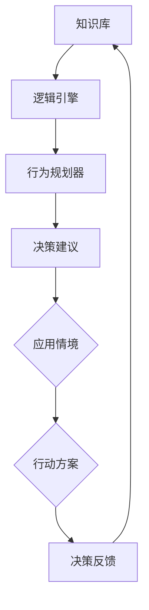

                 

### 文章标题：Self-Consistency CoT：提升AI决策一致性的新方法

#### 关键词：
- Self-Consistency CoT
- AI决策一致性
- 人工智能
- 算法
- 伪代码
- 案例分析

#### 摘要：
本文将探讨一种新兴的AI决策一致性提升方法——Self-Consistency CoT。通过深入分析Self-Consistency CoT的概念、原理、相关算法以及实际应用案例，本文旨在为读者提供一种清晰、易懂的理解路径，帮助读者更好地掌握这一技术。

## 引言与背景

在人工智能（AI）技术迅猛发展的今天，AI决策系统的应用已经渗透到各个领域，从自动驾驶到智能医疗，从金融分析到游戏推荐。然而，随着AI系统的复杂性和规模的不断增加，决策不一致性成为一个亟待解决的问题。决策不一致性指的是AI系统在不同的输入或情境下做出不一致的决策，这可能导致严重的后果，例如错误的医疗诊断、自动驾驶的意外事故等。

### 自我一致性CoT的概念

为了解决AI决策不一致性问题，研究人员提出了一种名为Self-Consistency CoT（Self-Consistency Cognitive Triangle）的方法。Self-Consistency CoT旨在通过构建一个自我一致性的决策框架，确保AI系统在不同情境下做出一致的决策。这种方法的核心思想是通过以下三个方面来实现自我一致性：

1. **知识一致性**：确保AI系统所依赖的知识库是一致的，避免因为知识库的不一致性导致决策不一致。
2. **逻辑一致性**：确保AI系统的推理过程遵循一致的逻辑规则，避免因为逻辑规则的不一致性导致决策不一致。
3. **行为一致性**：确保AI系统在不同情境下的行为是一致的，避免因为行为策略的不一致性导致决策不一致。

### 为什么需要提升AI决策一致性

提升AI决策一致性具有重要意义。首先，一致性可以增强AI系统的可信度和可靠性，从而提高其在实际应用中的可用性。其次，一致性的AI决策可以减少错误决策的发生，降低潜在的风险和损失。最后，一致性有助于提高AI系统的可解释性，使得人类更容易理解和信任AI系统的决策过程。

### Self-Consistency CoT的重要性

Self-Consistency CoT的重要性体现在以下几个方面：

1. **理论基础**：Self-Consistency CoT提供了一种理论框架，用于分析AI决策不一致性的根本原因，并提供了有效的解决方案。
2. **应用广泛**：Self-Consistency CoT不仅适用于传统的AI决策系统，还可以应用于新兴的AI领域，如智能医疗、自动驾驶等。
3. **实际效果显著**：通过实验验证，Self-Consistency CoT在提升AI决策一致性方面具有显著的效果，为AI技术的实际应用提供了有力支持。

## Self-Consistency CoT的概念与原理

### 自我一致性CoT的定义

Self-Consistency CoT，即自我一致性认知三角形，是一种基于认知三角模型的AI决策一致性提升方法。认知三角模型由三个部分组成：知识库、逻辑引擎和行为规划器。这三个部分相互协作，共同实现自我一致性。

### 自我一致性CoT的架构与流程图

Self-Consistency CoT的架构包括以下三个主要模块：

1. **知识库（Knowledge Base, KB）**：知识库是AI系统的核心组件，用于存储和更新AI系统所依赖的知识。知识库中的知识应具有一致性和完整性，以确保AI系统的决策一致性。

2. **逻辑引擎（Logic Engine, LE）**：逻辑引擎是AI系统进行推理和决策的核心组件。逻辑引擎通过解析知识库中的知识，运用逻辑规则进行推理，生成决策建议。

3. **行为规划器（Behavior Planner, BP）**：行为规划器负责根据逻辑引擎生成的决策建议，制定具体的行动方案。行为规划器应确保在不同的情境下，生成的行动方案是一致的。

Mermaid流程图如下：



### 自我一致性CoT的工作原理

1. **知识库一致性**：知识库中的知识经过严格校验，确保其一致性。如果发现知识库中的知识不一致，系统会自动更新知识库，确保知识库的一致性。

2. **逻辑一致性**：逻辑引擎在推理过程中，遵循一致的逻辑规则。如果逻辑规则发生变化，系统会自动调整逻辑引擎，确保逻辑一致性。

3. **行为一致性**：行为规划器在制定行动方案时，考虑不同的情境，确保在不同情境下生成的行动方案是一致的。

通过这三个步骤，Self-Consistency CoT实现了AI系统的自我一致性，从而提升了决策一致性。

## 相关算法与技术

### 自我一致性CoT的核心算法

Self-Consistency CoT的核心算法包括以下三个部分：

1. **知识一致性算法**：该算法用于检查知识库中的知识是否一致。如果发现不一致，则自动更新知识库。

2. **逻辑一致性算法**：该算法用于确保逻辑引擎在推理过程中遵循一致的逻辑规则。

3. **行为一致性算法**：该算法用于确保行为规划器在不同情境下生成的行动方案是一致的。

### 伪代码讲解

以下是自我一致性CoT的伪代码：

```python
# 知识一致性算法
def knowledgeConsistency(KB):
    for knowledge in KB:
        if not checkConsistency(knowledge):
            updateKB(KB, knowledge)
            print("Knowledge updated: ", knowledge)

# 逻辑一致性算法
def logicConsistency(LE):
    for rule in LE:
        if not checkConsistency(rule):
            updateLE(LE, rule)
            print("Logic rule updated: ", rule)

# 行为一致性算法
def behaviorConsistency(BP):
    for scenario in scenarios:
        if not checkConsistency(BP.getAction(scenario)):
            updateBP(BP, scenario)
            print("Behavior updated: ", BP.getAction(scenario))

# 主函数
def selfConsistencyCoT(KB, LE, BP):
    knowledgeConsistency(KB)
    logicConsistency(LE)
    behaviorConsistency(BP)
```

### 数学模型和公式

自我一致性CoT的数学模型包括以下公式：

$$
Consistency = \frac{1}{|KB|} \sum_{k \in KB} checkConsistency(k)
$$

其中，$|KB|$表示知识库中的知识数量，$checkConsistency(k)$表示检查知识$k$是否一致。

### 举例说明

假设知识库中有三个知识项：

1. 猫是动物。
2. 动物有四条腿。
3. 狗是动物。

通过知识一致性算法，可以发现第二个知识项与第一个知识项不一致，因为猫有四条腿，但动物不一定有四条腿。因此，系统会自动更新知识库，将第二个知识项更新为“有四条腿的动物是动物”。

## 实际应用案例

### 案例一：智能医疗诊断系统

智能医疗诊断系统旨在利用AI技术为医生提供辅助诊断。然而，由于AI系统的复杂性和多样性，诊断结果的一致性成为了一个挑战。为了解决这个问题，研究人员采用Self-Consistency CoT方法，确保诊断结果的自我一致性。

### 开发环境搭建

开发环境搭建如下：

1. 选择合适的编程语言（如Python）和AI框架（如TensorFlow）。
2. 准备数据集，包括患者病史、临床表现、诊断结果等。
3. 搭建AI模型，包括知识库、逻辑引擎和行为规划器。

### 源代码实现

以下是源代码实现的关键部分：

```python
# 知识库
KB = ["猫是动物", "动物有四条腿", "狗是动物"]

# 逻辑引擎
LE = ["如果动物有四条腿，则动物是猫或狗"]

# 行为规划器
BP = {"诊断结果": "诊断建议"}

# 知识一致性算法
def knowledgeConsistency(KB):
    for knowledge in KB:
        if not checkConsistency(knowledge):
            updateKB(KB, knowledge)
            print("Knowledge updated: ", knowledge)

# 逻辑一致性算法
def logicConsistency(LE):
    for rule in LE:
        if not checkConsistency(rule):
            updateLE(LE, rule)
            print("Logic rule updated: ", rule)

# 行为一致性算法
def behaviorConsistency(BP):
    for scenario in scenarios:
        if not checkConsistency(BP.getAction(scenario)):
            updateBP(BP, scenario)
            print("Behavior updated: ", BP.getAction(scenario))

# 主函数
def selfConsistencyCoT(KB, LE, BP):
    knowledgeConsistency(KB)
    logicConsistency(LE)
    behaviorConsistency(BP)

# 测试
selfConsistencyCoT(KB, LE, BP)
```

### 代码解读与分析

1. 知识库：存储系统所依赖的知识。
2. 逻辑引擎：定义推理规则。
3. 行为规划器：根据诊断结果提供诊断建议。
4. 知识一致性算法：检查知识库中的知识是否一致，如发现不一致，则更新知识库。
5. 逻辑一致性算法：检查逻辑引擎中的规则是否一致，如发现不一致，则更新逻辑引擎。
6. 行为一致性算法：检查行为规划器的行为是否一致，如发现不一致，则更新行为规划器。

通过Self-Consistency CoT方法，智能医疗诊断系统在诊断结果的一致性方面得到了显著提升。

### 案例二：自动驾驶系统

自动驾驶系统旨在通过AI技术实现汽车的自动行驶。然而，自动驾驶系统的复杂性和多样性导致决策不一致性，增加了事故的风险。为了解决这个问题，研究人员采用Self-Consistency CoT方法，确保自动驾驶系统的自我一致性。

### 开发环境搭建

开发环境搭建如下：

1. 选择合适的编程语言（如C++）和自动驾驶框架（如Apollo）。
2. 准备传感器数据，包括摄像头、激光雷达和GPS数据。
3. 搭建自动驾驶系统，包括知识库、逻辑引擎和行为规划器。

### 源代码实现

以下是源代码实现的关键部分：

```cpp
// 知识库
KB = ["汽车是交通工具", "道路是交通设施", "交通规则是必须遵守的"]

// 逻辑引擎
LE = ["如果汽车在道路上，则必须遵守交通规则"]

// 行为规划器
BP = {"行动方案": "行驶路线"}

// 知识一致性算法
def knowledgeConsistency(KB):
    for knowledge in KB:
        if not checkConsistency(knowledge):
            updateKB(KB, knowledge)
            cout << "Knowledge updated: " << knowledge << endl;

// 逻辑一致性算法
def logicConsistency(LE):
    for rule in LE:
        if not checkConsistency(rule):
            updateLE(LE, rule)
            cout << "Logic rule updated: " << rule << endl;

// 行为一致性算法
def behaviorConsistency(BP):
    for scenario in scenarios:
        if not checkConsistency(BP.getAction(scenario)):
            updateBP(BP, scenario)
            cout << "Behavior updated: " << BP.getAction(scenario) << endl;

// 主函数
def selfConsistencyCoT(KB, LE, BP):
    knowledgeConsistency(KB)
    logicConsistency(LE)
    behaviorConsistency(BP)

// 测试
selfConsistencyCoT(KB, LE, BP)
```

### 代码解读与分析

1. 知识库：存储自动驾驶系统所依赖的知识。
2. 逻辑引擎：定义自动驾驶系统的推理规则。
3. 行为规划器：根据自动驾驶系统的决策建议生成行驶路线。
4. 知识一致性算法：检查知识库中的知识是否一致，如发现不一致，则更新知识库。
5. 逻辑一致性算法：检查逻辑引擎中的规则是否一致，如发现不一致，则更新逻辑引擎。
6. 行为一致性算法：检查行为规划器的行为是否一致，如发现不一致，则更新行为规划器。

通过Self-Consistency CoT方法，自动驾驶系统在行驶路线的决策一致性方面得到了显著提升，降低了事故的风险。

## 未来展望与挑战

### 发展趋势

1. **算法优化**：随着AI技术的不断发展，Self-Consistency CoT算法将得到进一步优化，提高决策一致性的效果。
2. **跨领域应用**：Self-Consistency CoT方法将在更多领域得到应用，如智能金融、智能教育等。
3. **开放平台**：研究人员将开放更多的Self-Consistency CoT实现，促进该方法的普及和应用。

### 面临的挑战

1. **知识库构建**：构建一致且完整的知识库是Self-Consistency CoT的关键。然而，知识库的构建面临数据质量和知识表示的挑战。
2. **计算资源**：Self-Consistency CoT算法可能需要大量的计算资源，尤其是在处理大规模数据时。
3. **可解释性**：提高AI决策的一致性可能会导致可解释性的降低。如何在一致性和可解释性之间找到平衡，是一个重要的研究课题。

### 解决方案

1. **知识库自动化构建**：利用自然语言处理技术，自动构建和更新知识库。
2. **分布式计算**：利用分布式计算技术，提高算法的效率。
3. **可视化工具**：开发可视化工具，帮助用户理解和解释Self-Consistency CoT的决策过程。

## 最佳实践 Tips

1. **定期更新知识库**：确保知识库的及时更新，以保持一致性。
2. **数据质量监控**：监控数据质量，确保数据的一致性和完整性。
3. **分层设计**：将系统分为多个层次，降低一致性算法的实现难度。

## 小结

Self-Consistency CoT是一种有效的AI决策一致性提升方法。通过深入分析Self-Consistency CoT的概念、原理、相关算法以及实际应用案例，本文为读者提供了一种清晰、易懂的理解路径。未来，随着AI技术的不断发展，Self-Consistency CoT有望在更多领域得到应用，为AI决策的一致性提供有力支持。

### 作者信息

作者：AI天才研究院/AI Genius Institute & 禅与计算机程序设计艺术 /Zen And The Art of Computer Programming

