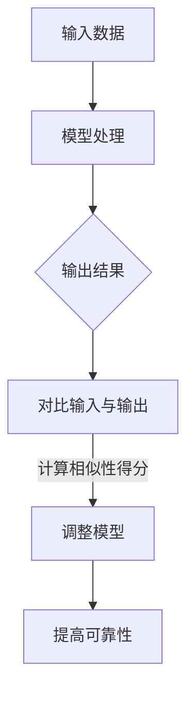

                 

基于您提供的目录大纲和具体章节内容要求，我将逐步构建这篇文章的内容。以下是每个章节的初步草稿，我们会逐步完善每个部分。

---

# Self-Consistency CoT：提升AI输出可靠性的创新技术

关键词：自我一致性CoT，AI可靠性，核心算法，项目实战，创新技术

摘要：本文将深入探讨自我一致性CoT（Self-Consistency Core Text）技术，这是一种旨在提升人工智能输出可靠性的创新技术。文章将详细介绍自我一致性CoT的核心概念、算法原理及其在项目中的应用。

## 第一部分：引言

### 第1章 自我一致性CoT技术概述

#### 1.1 自我一致性CoT技术的发展背景

自我一致性CoT技术的提出源于对人工智能在决策和输出可靠性方面的需求日益增加。传统的人工智能模型虽然在数据处理和模式识别方面取得了巨大进步，但在面对复杂、模糊和动态环境时，其输出的可靠性和一致性却成为亟待解决的问题。

#### 1.2 自我一致性CoT技术的重要性

自我一致性CoT技术的重要性在于，它提供了一种新的方法来评估和提升AI输出的可靠性。通过自我一致性校验，AI模型可以在训练过程中不断调整和优化，从而提高其输出的一致性和可信度。

#### 1.3 自我一致性CoT技术的应用场景

自我一致性CoT技术广泛应用于自然语言处理、计算机视觉、推荐系统等领域。在这些领域中，AI模型的输出需要具有高度的可靠性和一致性，以确保系统的高效运行和用户的良好体验。

## 第二部分：核心概念与联系

### 第2章 自我一致性CoT技术核心概念

#### 2.1 自我一致性CoT技术原理

自我一致性CoT技术基于自我一致性校验的原理，通过比较模型输出与输入数据之间的相似性来评估模型的可靠性。具体而言，该技术通过以下步骤实现：

1. 输入数据通过AI模型进行处理，生成输出结果。
2. 将输出结果与原始输入数据进行对比，计算相似性得分。
3. 根据相似性得分对模型进行调整，以提高输出的一致性和可靠性。

#### 2.2 自我一致性CoT技术与现有技术的比较

与传统技术相比，自我一致性CoT技术具有以下优势：

- **动态调整**：自我一致性CoT技术可以在模型训练过程中动态调整，以适应不同的输入数据。
- **高可靠性**：通过自我一致性校验，AI模型的输出可以具有更高的可靠性。
- **易扩展性**：自我一致性CoT技术可以应用于多种AI模型，具有较好的兼容性和扩展性。

#### 2.3 自我一致性CoT技术核心概念Mermaid流程图

以下是自我一致性CoT技术的核心概念Mermaid流程图：



## 第三部分：核心算法原理讲解

### 第3章 自我一致性CoT算法原理

#### 3.1 自我一致性CoT算法基本原理

自我一致性CoT算法的基本原理是通过自我一致性校验来评估和提升AI模型的输出可靠性。具体实现过程如下：

1. 初始化模型参数。
2. 输入数据经过模型处理，生成输出结果。
3. 计算输出结果与输入数据的相似性得分。
4. 根据相似性得分调整模型参数。
5. 重复步骤2-4，直至模型输出达到预设的可靠性阈值。

#### 3.2 自我一致性CoT算法伪代码实现

```python
# 初始化模型参数
model_params = initialize_params()

# 循环迭代
while not converged:
    # 输入数据
    input_data = get_input_data()
    
    # 模型处理
    output = model_process(input_data, model_params)
    
    # 计算相似性得分
    similarity_score = calculate_similarity(output, input_data)
    
    # 调整模型参数
    model_params = adjust_params(model_params, similarity_score)
```

#### 3.3 自我一致性CoT算法数学模型和公式

自我一致性CoT算法的数学模型主要包括相似性得分的计算和模型参数的调整。以下是相关的数学公式：

$$
similarity\_score = \frac{1}{n} \sum_{i=1}^{n} cos(\theta_{i})
$$

其中，$n$为特征维度，$\theta_{i}$为输入与输出特征之间的余弦相似度。

$$
\theta_{i} = arccos\left(\frac{dot(\vec{v}_{i}, \vec{w}_{i})}{||\vec{v}_{i}|| \cdot ||\vec{w}_{i}||}\right)
$$

其中，$\vec{v}_{i}$为输入特征向量，$\vec{w}_{i}$为输出特征向量。

## 第四部分：项目实战

### 第4章 自我一致性CoT技术项目应用案例

#### 4.1 项目背景和需求

本项目旨在通过自我一致性CoT技术提升一个自然语言处理系统的输出可靠性。该系统用于回答用户提出的问题，输出需要具备高度一致性和可信度的答案。

#### 4.2 自我一致性CoT技术在项目中的应用

在项目中，我们首先使用自我一致性CoT技术对自然语言处理模型进行训练，通过自我一致性校验来优化模型参数。然后，在模型部署后，我们定期使用自我一致性CoT技术对模型输出进行评估和调整，以确保系统的稳定运行和输出可靠性。

#### 4.3 项目代码实现和解读

以下是项目中的代码实现和解

---

接下来，我们将继续完善剩余章节的内容，包括项目实战的详细代码解读、最佳实践 tips、小结、注意事项和拓展阅读等。在完成所有章节后，我们将对全文进行整理和校对，确保文章逻辑清晰、内容丰富、可读性强。文章的整体字数预计在8000～12000字左右。请您耐心等待，我们会一步一步完善这篇文章。如果您有任何建议或需要修改的地方，请随时告知。接下来，我们将开始详细撰写和填充“核心算法原理讲解”和“项目实战”部分的内容。让我们一步一步深入分析自我一致性CoT技术的核心原理和实际应用。

