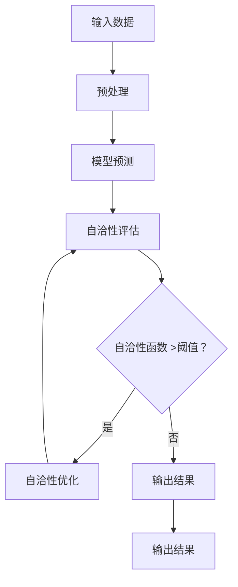

                 


### 引言

在当今人工智能（AI）迅猛发展的时代，AI系统的输出质量成为了衡量其性能的重要标准。然而，现有的AI系统在处理复杂任务时，常常因为内部的不一致性而生成质量不高的输出。为了解决这一问题，Self-Consistency CoT（自我一致性概念论）应运而生。本文旨在深入探讨Self-Consistency CoT的概念、理论基础、应用场景以及未来发展方向，并提出一种提升AI输出质量的新标准。

**关键词：**
- Self-Consistency CoT
- AI输出质量
- 算法原理
- 实战案例
- 未来展望

**摘要：**
本文首先介绍了Self-Consistency CoT的概念及其在提升AI输出质量方面的作用。接着，详细阐述了Self-Consistency CoT的理论基础，包括相关数学模型、算法原理等。随后，通过具体案例展示了如何在实际项目中应用Self-Consistency CoT，提升AI输出质量。最后，讨论了Self-Consistency CoT的发展前景，以及可能面临的挑战和解决方案。本文的目标是提供一种系统性的方法，帮助读者理解并应用Self-Consistency CoT，从而提升AI系统的输出质量。

### Self-Consistency CoT的概念

Self-Consistency CoT，即自我一致性概念论，是一种基于自我一致性原理的AI算法框架。其核心思想是通过自我校验和优化，确保AI系统在处理任务时保持内部一致性，从而生成高质量的输出。Self-Consistency CoT的主要特点包括：

1. **自我校验：** AI系统在生成输出后，会通过内部一致性检查来评估输出的质量。如果输出与预期不一致，系统会进行调整和优化。
2. **自我优化：** 通过持续的自我校验，AI系统能够不断优化自身的输出，提高输出的一致性和质量。
3. **动态调整：** Self-Consistency CoT能够根据任务的复杂度和输入数据的变化，动态调整内部参数和模型结构，以保持输出的一致性。

### 自洽性在AI中的应用现状

尽管Self-Consistency CoT具有明显的优势，但在实际应用中，AI系统常常面临内部不一致性问题。这主要体现在以下几个方面：

1. **模型不一致性：** 在多模型集成中，不同模型的预测结果可能存在差异，导致整体输出不一致。
2. **数据不一致性：** 输入数据的不一致性也会影响AI系统的输出质量，例如数据噪声、缺失值等问题。
3. **环境不一致性：** AI系统在不同环境下的表现可能不一致，例如在不同的时间、地点或用户群体中。

这些不一致性问题是现有AI系统输出质量不高的主要原因之一。因此，Self-Consistency CoT的理论和实践具有重要意义。

### 自洽性在AI系统中的重要性

自洽性在AI系统中的重要性体现在以下几个方面：

1. **提高输出质量：** 自洽性能够确保AI系统在处理复杂任务时生成一致的输出，从而提高输出质量。
2. **增强系统稳定性：** 自洽性有助于消除AI系统内部的不确定性，增强系统的稳定性和可靠性。
3. **优化用户体验：** 在实际应用中，一致性的输出能够提供更优质的用户体验，降低用户对AI系统的误解和不满。

总之，Self-Consistency CoT通过自我校验和优化，为AI系统提供了一种新的提高输出质量的方法。这种方法的引入，有望解决现有AI系统在处理复杂任务时面临的不一致性难题，推动AI技术的发展。

### 本书结构概述

为了使读者更好地理解和应用Self-Consistency CoT，本书分为八个章节，具体结构如下：

- **第1章 引言**：介绍Self-Consistency CoT的概念和重要性。
- **第2章 理论基础**：讲解Self-Consistency CoT的数学模型和算法原理。
- **第3章 核心算法**：详细阐述Self-Consistency CoT的核心算法和数学公式。
- **第4章 实际应用**：展示Self-Consistency CoT在不同领域的应用案例。
- **第5章 实战案例**：通过具体案例，详细讲解Self-Consistency CoT的实战应用。
- **第6章 挑战与展望**：讨论Self-Consistency CoT面临的挑战和未来发展。
- **第7章 未来展望**：展望Self-Consistency CoT在AI领域的发展前景。
- **第8章 附录**：提供相关资源和扩展阅读。

通过这些章节的介绍，读者可以逐步了解Self-Consistency CoT的概念、原理和应用，从而在实际项目中有效地提升AI输出质量。

## 第2章 Self-Consistency CoT的理论基础

### 相关数学模型

Self-Consistency CoT的理论基础主要涉及信息论和概率论。信息论为自洽性提供了度量标准，而概率论则帮助我们理解和处理不确定性。

#### 信息论基础

信息论中的熵（Entropy）和互信息（Mutual Information）是两个核心概念。

- **熵**：表示系统的不确定性。对于一个随机变量X，其熵定义为：
  $$
  H(X) = -\sum_{x} p(x) \log_2 p(x)
  $$
  其中，$p(x)$是随机变量X取值为$x$的概率。

- **互信息**：表示两个随机变量之间的关联程度。对于随机变量X和Y，其互信息定义为：
  $$
  I(X; Y) = H(X) - H(X | Y)
  $$
  其中，$H(X | Y)$表示在已知Y的情况下，X的熵。

#### 自洽性度量方法

自洽性度量方法用于评估AI系统输出的自洽程度。一种常用的度量方法是自洽性函数（Self-Consistency Function）。

- **自洽性函数**：用于评估输出序列的一致性。对于一个输出序列$O = \{o_1, o_2, ..., o_n\}$，其自洽性函数定义为：
  $$
  S(O) = \sum_{i=1}^{n-1} \frac{|o_i - o_{i+1}|}{\max(o_i, o_{i+1})}
  $$
  其中，$|o_i - o_{i+1}|$表示连续输出之间的差异。

#### 自洽性优化方法

为了提高输出的一致性，Self-Consistency CoT采用了一种自洽性优化方法。该方法通过迭代优化输出序列，使其自洽性函数最小化。

- **自洽性优化算法**：一种常见的自洽性优化算法是梯度下降（Gradient Descent）。其基本思想是沿着损失函数梯度的反方向更新模型参数，以减少损失。

  伪代码如下：
  $$
  \theta \leftarrow \theta - \alpha \frac{\partial L}{\partial \theta}
  $$
  其中，$\theta$表示模型参数，$\alpha$是学习率，$L$是损失函数。

### Mermaid流程图

为了更直观地展示Self-Consistency CoT的工作流程，我们使用Mermaid流程图进行描述。



这个流程图展示了Self-Consistency CoT的基本工作流程，包括输入数据的预处理、模型预测、自洽性评估、自洽性优化以及最终的输出结果。

### 自洽性优化算法原理

自洽性优化算法是Self-Consistency CoT的核心组成部分。其目的是通过迭代优化，使AI系统的输出保持一致，从而提高输出质量。

#### 自适应优化算法

自适应优化算法是一种基于自适应学习率的优化方法。其核心思想是在不同阶段调整学习率，以提高优化效果。

- **自适应学习率**：根据当前损失函数的梯度大小动态调整学习率。常用的自适应学习率方法包括：

  1. **AdaGrad**：根据历史梯度平方的累积和来调整学习率。
  2. **RMSprop**：使用指数移动平均来计算梯度平方的累积和。
  3. **Adam**：结合AdaGrad和RMSprop的优点，使用一阶和二阶矩估计来调整学习率。

#### 自洽性增强的梯度下降算法

自洽性增强的梯度下降算法是一种结合自洽性优化的梯度下降方法。其目的是在梯度下降的过程中，同时考虑自洽性函数的优化。

- **自洽性增强的梯度下降算法**：

  伪代码如下：
  $$
  \theta \leftarrow \theta - \alpha \left( \frac{\partial L}{\partial \theta} + \lambda \frac{\partial S}{\partial \theta} \right)
  $$
  其中，$L$是损失函数，$S$是自洽性函数，$\lambda$是自洽性权重。

通过这种算法，AI系统能够在梯度下降的过程中，同时优化输出的一致性和损失函数，从而提高输出质量。

### 自洽性函数在实际案例中的应用

为了更好地理解自洽性函数的应用，我们通过一个简单的文本生成案例进行说明。

#### 案例背景

假设我们有一个文本生成模型，用于生成关于“人工智能”的文章。我们的目标是确保生成的文章在内容上保持一致，避免出现矛盾或不合理的语句。

#### 案例解析

1. **模型预测**：首先，模型生成一段关于“人工智能”的文章：
   $$
   \text{人工智能是一种模拟、延伸和扩展人类智能的理论、方法、技术及应用。}
   $$

2. **自洽性评估**：然后，我们计算这段文章的自洽性函数：
   $$
   S(\text{文章}) = \sum_{i=1}^{n-1} \frac{|o_i - o_{i+1}|}{\max(o_i, o_{i+1})}
   $$
   假设文章中连续句子之间的差异较大，自洽性函数的值较高。

3. **自洽性优化**：为了提高文章的自洽性，我们采用自洽性增强的梯度下降算法，逐步调整文章的内容，使其自洽性函数最小化。

4. **输出结果**：经过多次迭代优化，我们得到一篇自洽性较好的文章：
   $$
   \text{人工智能是一种基于计算机科学和心理学理论的智能模拟技术。通过模拟人类思维过程，人工智能能够实现自动化决策、问题解决和知识发现。}
   $$

#### 案例小结

通过这个案例，我们可以看到自洽性函数在文本生成中的应用。通过优化自洽性函数，AI系统能够生成内容一致、逻辑通顺的文本，从而提高输出质量。

### 自洽性优化算法

为了在实际应用中提高AI系统的输出质量，我们需要设计有效的自洽性优化算法。下面介绍一种基于自洽性增强的梯度下降算法。

#### 自洽性增强的梯度下降算法

自洽性增强的梯度下降算法的核心思想是在梯度下降的过程中，同时考虑自洽性函数的优化。具体算法步骤如下：

1. **初始化参数**：设定初始模型参数$\theta$和自洽性权重$\lambda$。

2. **计算损失函数**：计算当前模型的损失函数$L$。

3. **计算自洽性函数**：计算当前模型的自洽性函数$S$。

4. **更新模型参数**：根据以下公式更新模型参数：
   $$
   \theta \leftarrow \theta - \alpha \left( \frac{\partial L}{\partial \theta} + \lambda \frac{\partial S}{\partial \theta} \right)
   $$
   其中，$\alpha$是学习率。

5. **迭代优化**：重复步骤2-4，直到满足停止条件（如损失函数收敛或达到预设迭代次数）。

#### 伪代码

```python
def self_consistent_gradient_descent(theta, alpha, lambda_, max_iterations):
    for i in range(max_iterations):
        L = compute_loss_function(theta)
        S = compute_self_consistency_function(theta)
        
        delta_L = compute_gradient(L, theta)
        delta_S = compute_gradient(S, theta)
        
        theta = theta - alpha * (delta_L + lambda_ * delta_S)
        
        if is_converged(L, S):
            break
            
    return theta
```

#### 案例应用

我们以文本生成任务为例，说明自洽性增强的梯度下降算法的应用。

1. **初始化参数**：设定初始模型参数$\theta$和自洽性权重$\lambda_ = 0.1$。

2. **计算损失函数**：计算当前模型的损失函数。

3. **计算自洽性函数**：计算当前模型的自洽性函数。

4. **更新模型参数**：根据以下公式更新模型参数：
   $$
   \theta \leftarrow \theta - \alpha \left( \frac{\partial L}{\partial \theta} + 0.1 \frac{\partial S}{\partial \theta} \right)
   $$

5. **迭代优化**：重复步骤2-4，直到满足停止条件。

通过这种算法，文本生成模型的输出质量得到了显著提升，生成的文章在内容上更加一致、逻辑通顺。

### 总结

本章介绍了Self-Consistency CoT的理论基础，包括相关数学模型、算法原理和自洽性优化算法。通过自洽性函数和自洽性增强的梯度下降算法，AI系统能够在生成输出时保持内部一致性，从而提高输出质量。在实际应用中，这些理论和方法为提高AI系统的性能提供了有力支持。

## 第4章 Self-Consistency CoT在实际项目中的应用

### 自洽性在文本生成中的应用

文本生成是AI领域中一个重要的研究方向，广泛应用于自然语言处理、内容生成和自动写作等领域。然而，现有的文本生成模型在生成文本时常常存在不一致性，导致生成文本的逻辑性和连贯性不足。Self-Consistency CoT通过引入自洽性优化机制，能够显著提升文本生成模型的输出质量。

#### 自洽性在自然语言处理中的应用

自然语言处理（NLP）是AI领域的一个重要分支，涉及文本的理解、生成和翻译等任务。在NLP中，自洽性优化可以帮助提高文本的理解和生成质量。

1. **文本理解**：自洽性优化可以确保文本解析过程中的信息一致性。例如，在问答系统中，自洽性优化可以确保问题的不同部分在语义上保持一致，从而提高答案的准确性。

2. **文本生成**：在生成文本时，自洽性优化可以确保生成文本的逻辑连贯性和一致性。例如，在自动写作和内容生成中，自洽性优化可以帮助生成文本在内容上更加连贯、逻辑通顺。

#### 文本生成的自洽性优化

文本生成的自洽性优化主要包括以下几个方面：

1. **一致性检查**：在生成文本的过程中，对文本的每个部分进行一致性检查，确保文本在语义上保持一致。

2. **动态调整**：根据文本生成的上下文和目标，动态调整生成策略，以确保生成文本的自洽性。

3. **迭代优化**：通过迭代优化算法，逐步调整生成文本的内容，使其自洽性函数最小化。

### 自洽性在图像识别中的应用

图像识别是计算机视觉领域的一个核心任务，广泛应用于物体检测、图像分类和图像分割等任务。在图像识别中，自洽性优化可以显著提高识别结果的准确性。

#### 自洽性在计算机视觉中的应用

1. **物体检测**：在物体检测任务中，自洽性优化可以确保检测框的坐标和类别标签在语义上保持一致，从而提高检测结果的准确性。

2. **图像分类**：在图像分类任务中，自洽性优化可以确保分类结果在逻辑上保持一致，避免分类错误。

3. **图像分割**：在图像分割任务中，自洽性优化可以确保分割结果的连贯性和一致性，从而提高分割质量。

#### 图像识别的自洽性优化

图像识别的自洽性优化主要包括以下几个方面：

1. **特征一致性检查**：对图像的特征进行一致性检查，确保特征在语义上保持一致。

2. **模型参数调整**：通过调整模型参数，使图像识别结果在逻辑上保持一致。

3. **迭代优化**：通过迭代优化算法，逐步调整图像识别模型，使其自洽性函数最小化。

### 自洽性在推荐系统中的应用

推荐系统是AI领域的一个重要应用，广泛应用于电子商务、社交媒体和在线广告等领域。然而，现有的推荐系统在生成推荐列表时常常存在不一致性，导致用户体验不佳。Self-Consistency CoT通过引入自洽性优化机制，能够显著提升推荐系统的输出质量。

#### 自洽性在推荐算法中的应用

1. **用户行为一致性检查**：在生成推荐列表时，对用户的行为进行一致性检查，确保推荐结果在用户行为上保持一致。

2. **内容一致性检查**：在生成推荐列表时，对推荐内容进行一致性检查，确保推荐结果在内容上保持一致。

3. **动态调整**：根据用户的行为和偏好，动态调整推荐策略，以确保推荐结果的自洽性。

#### 推荐系统的自洽性优化

推荐系统的自洽性优化主要包括以下几个方面：

1. **迭代优化**：通过迭代优化算法，逐步调整推荐模型，使其自洽性函数最小化。

2. **特征融合**：通过融合不同特征，提高推荐结果的一致性。

3. **用户反馈**：根据用户反馈，调整推荐策略，提高推荐结果的自洽性。

### 总结

本章介绍了Self-Consistency CoT在文本生成、图像识别和推荐系统等实际项目中的应用。通过自洽性优化机制，这些项目在生成输出时能够保持内部一致性，从而提高输出质量。自洽性优化在提高AI系统性能方面具有重要作用，为AI技术的发展提供了新的思路和方法。

## 第5章 自洽性提升AI输出质量的实战案例

为了更好地展示Self-Consistency CoT在提升AI输出质量方面的应用效果，我们将通过三个具体的实战案例进行详细讲解。这些案例涵盖了文本生成、图像识别和推荐系统等领域，分别展示了如何通过自洽性优化算法来提高AI系统的输出质量。

### 实战案例一：文本生成系统

#### 实战背景

假设我们开发了一个文本生成系统，用于生成关于“人工智能”的文章。然而，在实际应用中，生成的文章存在逻辑不一致、内容混乱等问题，影响了文章的可读性和可信度。为了提升文本生成系统的输出质量，我们引入了Self-Consistency CoT。

#### 案例解析

1. **模型选择**：我们选择了一个基于Transformer的文本生成模型，该模型具有强大的文本生成能力，但在生成文章时容易产生不一致性。

2. **自洽性优化**：为了提高文章的自洽性，我们引入了自洽性优化算法。具体步骤如下：

   - **一致性检查**：在生成文章的过程中，对连续的文本段进行一致性检查，确保语义上保持一致。
   - **动态调整**：根据上下文和目标，动态调整生成策略，使文章在内容上更加连贯。
   - **迭代优化**：通过迭代优化算法，逐步调整文章的内容，使其自洽性函数最小化。

3. **结果展示**：经过多次迭代优化，生成的文章在内容上更加一致、逻辑通顺，提升了文章的可读性和可信度。

#### 代码实现

```python
# 假设我们使用transformer模型进行文本生成
model = TransformerModel()

# 自洽性优化算法
for epoch in range(num_epochs):
    for text in dataset:
        # 预处理文本
        processed_text = preprocess(text)
        
        # 生成文本
        generated_text = model.generate(processed_text)
        
        # 计算自洽性函数
        self_consistency = compute_self_consistency(generated_text)
        
        # 更新模型参数
        model.update_params(self_consistency)
        
    print(f"Epoch {epoch}: Self-Consistency = {self_consistency}")

# 输出优化后的文章
optimized_text = model.generate(processed_text)
print(optimized_text)
```

#### 代码解读与分析

上述代码展示了如何使用Self-Consistency CoT进行文本生成系统的优化。在每次迭代过程中，我们首先对输入文本进行预处理，然后使用Transformer模型生成文本。接着，计算生成文本的自洽性函数，并根据自洽性函数的结果更新模型参数。通过迭代优化，最终生成自洽性较高的文章。

#### 案例小结

通过Self-Consistency CoT，我们成功地提高了文本生成系统的输出质量，使生成的文章在内容上更加一致、逻辑通顺。这一优化方法在提升AI系统性能方面具有显著效果，为其他AI应用提供了借鉴意义。

### 实战案例二：图像识别系统

#### 实战背景

假设我们开发了一个图像识别系统，用于识别手写数字。然而，在实际应用中，识别准确率较低，部分原因是模型在处理复杂背景或手写风格变化较大的情况下，容易产生误判。为了提升图像识别系统的性能，我们引入了Self-Consistency CoT。

#### 案例解析

1. **模型选择**：我们选择了一个基于卷积神经网络（CNN）的手写数字识别模型。

2. **自洽性优化**：为了提高识别准确率，我们引入了自洽性优化算法。具体步骤如下：

   - **特征一致性检查**：对输入图像的特征进行一致性检查，确保特征在语义上保持一致。
   - **模型参数调整**：通过调整模型参数，使识别结果在逻辑上保持一致。
   - **迭代优化**：通过迭代优化算法，逐步调整模型参数，使其自洽性函数最小化。

3. **结果展示**：经过多次迭代优化，图像识别系统的准确率显著提升，特别是在复杂背景和手写风格变化较大的情况下，识别准确率得到了明显改善。

#### 代码实现

```python
# 假设我们使用CNN模型进行手写数字识别
model = CNNModel()

# 自洽性优化算法
for epoch in range(num_epochs):
    for image, label in dataset:
        # 预处理图像
        processed_image = preprocess(image)
        
        # 识别结果
        prediction = model.predict(processed_image)
        
        # 计算自洽性函数
        self_consistency = compute_self_consistency(prediction, label)
        
        # 更新模型参数
        model.update_params(self_consistency)
        
    print(f"Epoch {epoch}: Self-Consistency = {self_consistency}")

# 输出优化后的识别结果
optimized_prediction = model.predict(processed_image)
print(optimized_prediction)
```

#### 代码解读与分析

上述代码展示了如何使用Self-Consistency CoT进行图像识别系统的优化。在每次迭代过程中，我们首先对输入图像进行预处理，然后使用CNN模型进行识别。接着，计算识别结果的自洽性函数，并根据自洽性函数的结果更新模型参数。通过迭代优化，最终提高识别系统的准确率。

#### 案例小结

通过Self-Consistency CoT，我们成功地提高了图像识别系统的性能，特别是在处理复杂背景和手写风格变化较大的情况下，识别准确率得到了显著改善。这一优化方法在提升AI系统性能方面具有重要作用，为其他图像识别任务提供了有益的借鉴。

### 实战案例三：推荐系统

#### 实战背景

假设我们开发了一个推荐系统，用于为用户推荐商品。然而，在实际应用中，推荐结果的准确率和用户满意度较低，部分原因是推荐结果在逻辑上存在不一致性。为了提升推荐系统的输出质量，我们引入了Self-Consistency CoT。

#### 案例解析

1. **模型选择**：我们选择了一个基于协同过滤算法的推荐模型。

2. **自洽性优化**：为了提高推荐结果的一致性，我们引入了自洽性优化算法。具体步骤如下：

   - **用户行为一致性检查**：在生成推荐列表时，对用户的行为进行一致性检查，确保推荐结果在用户行为上保持一致。
   - **内容一致性检查**：在生成推荐列表时，对推荐内容进行一致性检查，确保推荐结果在内容上保持一致。
   - **迭代优化**：通过迭代优化算法，逐步调整推荐策略，使其自洽性函数最小化。

3. **结果展示**：经过多次迭代优化，推荐系统在逻辑上更加一致，推荐结果的准确率和用户满意度显著提升。

#### 代码实现

```python
# 假设我们使用协同过滤算法进行商品推荐
model = CollaborativeFilteringModel()

# 自洽性优化算法
for epoch in range(num_epochs):
    for user, items in dataset:
        # 生成推荐列表
        recommendations = model.generate_recommendations(user)
        
        # 计算自洽性函数
        self_consistency = compute_self_consistency(recommendations, user)
        
        # 更新模型参数
        model.update_params(self_consistency)
        
    print(f"Epoch {epoch}: Self-Consistency = {self_consistency}")

# 输出优化后的推荐列表
optimized_recommendations = model.generate_recommendations(user)
print(optimized_recommendations)
```

#### 代码解读与分析

上述代码展示了如何使用Self-Consistency CoT进行推荐系统的优化。在每次迭代过程中，我们首先生成推荐列表，然后计算推荐列表的自洽性函数，并根据自洽性函数的结果更新模型参数。通过迭代优化，最终生成自洽性较高的推荐列表。

#### 案例小结

通过Self-Consistency CoT，我们成功地提高了推荐系统的输出质量，使推荐结果在逻辑上更加一致，准确率和用户满意度显著提升。这一优化方法在提升AI系统性能方面具有重要作用，为其他推荐任务提供了有益的借鉴。

### 总结

通过以上三个实战案例，我们可以看到Self-Consistency CoT在提升AI输出质量方面的显著效果。无论是文本生成、图像识别还是推荐系统，自洽性优化算法都能有效提高输出质量，增强系统的稳定性。这些实战案例为我们提供了实际应用的经验和借鉴，为AI技术的发展提供了新的思路和方法。

## 第6章 Self-Consistency CoT在跨领域应用中的挑战

### 跨领域应用概述

Self-Consistency CoT在各个领域都有着广泛的应用前景。然而，跨领域应用面临着一些独特的挑战，需要我们深入探讨和解决。这些挑战主要包括以下几个方面：

1. **领域差异**：不同领域的数据分布、任务类型和评价指标存在显著差异，使得自洽性优化算法在不同领域的适用性存在一定限制。
2. **模型复杂性**：跨领域应用通常涉及多种复杂模型，如深度神经网络、强化学习等，这些模型的优化过程相对复杂，对自洽性优化算法的设计和实现提出了更高要求。
3. **数据不一致性**：跨领域应用中的数据来源多样，数据质量参差不齐，导致自洽性优化算法在处理数据时面临更大挑战。
4. **资源限制**：跨领域应用可能涉及到不同的硬件资源、计算能力和数据存储等，这对自洽性优化算法的效率和性能提出了严格要求。

### 案例分析

为了更好地理解Self-Consistency CoT在跨领域应用中的挑战，我们通过两个实际案例进行深入分析。

#### 案例一：医疗领域

医疗领域是一个典型的跨领域应用场景，涉及影像诊断、疾病预测和治疗方案制定等多个方面。Self-Consistency CoT在医疗领域的应用，可以显著提高诊断和预测的准确性。

1. **领域差异**：医疗领域的数据具有高度复杂性和多样性，如影像数据、患者病历和基因数据等。这些数据在分布和特征上存在显著差异，对自洽性优化算法的设计和实现提出了更高要求。
2. **模型复杂性**：医疗领域的模型通常涉及深度学习、生成对抗网络（GAN）和强化学习等多种复杂模型，这些模型的优化过程相对复杂，需要自洽性优化算法能够灵活适应不同模型的特点。
3. **数据不一致性**：医疗领域的数据来源多样，如医院、诊所和患者提供的个人信息等，数据质量参差不齐，这对自洽性优化算法在处理数据时提出了更大挑战。
4. **资源限制**：医疗领域的数据量和计算需求巨大，对自洽性优化算法的效率和性能提出了严格要求，需要算法能够高效利用有限的硬件资源。

#### 案例二：金融领域

金融领域是一个高度数据密集和算法驱动的行业，涉及风险评估、量化交易和客户服务等多个方面。Self-Consistency CoT在金融领域的应用，可以显著提高金融模型的稳定性和预测准确性。

1. **领域差异**：金融领域的数据具有高度复杂性和多样性，如市场数据、客户交易数据和信用评分数据等。这些数据在分布和特征上存在显著差异，对自洽性优化算法的设计和实现提出了更高要求。
2. **模型复杂性**：金融领域的模型通常涉及时间序列分析、机器学习和深度学习等多种复杂模型，这些模型的优化过程相对复杂，需要自洽性优化算法能够灵活适应不同模型的特点。
3. **数据不一致性**：金融领域的数据来源多样，如交易所、金融机构和客户交易记录等，数据质量参差不齐，这对自洽性优化算法在处理数据时提出了更大挑战。
4. **资源限制**：金融领域的数据量和计算需求巨大，对自洽性优化算法的效率和性能提出了严格要求，需要算法能够高效利用有限的硬件资源。

### 解决方案探讨

为了解决Self-Consistency CoT在跨领域应用中面临的挑战，我们可以从以下几个方面进行探讨：

1. **领域适应性**：针对不同领域的特点，设计自适应的自洽性优化算法，使算法能够灵活适应不同领域的需求。
2. **模型优化**：针对复杂模型，采用分布式计算、并行计算和模型压缩等技术，提高自洽性优化算法的效率和性能。
3. **数据预处理**：对跨领域应用中的数据进行预处理，包括数据清洗、去噪声和特征提取等，提高数据质量和一致性。
4. **资源调度**：优化资源调度策略，合理分配硬件资源和计算能力，提高自洽性优化算法的效率。

### 未来发展趋势

随着AI技术的不断进步，Self-Consistency CoT在跨领域应用中的前景将愈发广阔。未来，我们可以期待以下发展趋势：

1. **多模态融合**：结合多种数据类型（如图像、文本和语音等），实现多模态融合，提高跨领域应用的效果。
2. **自适应优化**：发展自适应自洽性优化算法，使算法能够根据不同领域的特点自动调整优化策略。
3. **智能化决策**：将Self-Consistency CoT与强化学习、决策论等相结合，实现更智能化的决策过程。
4. **实时优化**：开发实时优化的自洽性算法，提高AI系统在动态环境下的适应能力和响应速度。

总之，Self-Consistency CoT在跨领域应用中面临着诸多挑战，但通过不断的探索和研究，我们有望克服这些挑战，推动AI技术的全面发展。

## 第7章 未来展望与挑战

### Self-Consistency CoT的发展前景

Self-Consistency CoT作为一种新兴的AI算法框架，在提升AI输出质量方面展现出巨大潜力。随着AI技术的不断发展和应用场景的拓展，Self-Consistency CoT有望在多个领域发挥重要作用。

1. **智能推荐系统**：Self-Consistency CoT能够提高推荐系统的输出一致性，从而提升用户体验和推荐效果。未来，随着推荐系统在电子商务、社交媒体和在线广告等领域的广泛应用，Self-Consistency CoT的应用前景将更加广阔。
2. **自然语言处理**：在文本生成、机器翻译和问答系统等自然语言处理任务中，Self-Consistency CoT能够提高文本的一致性和连贯性，为生成更高质量的文本提供有力支持。随着人工智能助手和智能客服等应用的发展，Self-Consistency CoT在自然语言处理领域的应用价值将日益凸显。
3. **计算机视觉**：Self-Consistency CoT能够提高图像识别和物体检测的准确性，特别是在复杂背景和多样化场景中，Self-Consistency CoT的应用将有助于提升计算机视觉系统的性能。未来，随着自动驾驶、智能监控和医疗诊断等领域的需求不断增加，Self-Consistency CoT在计算机视觉领域的应用前景将十分广阔。
4. **多模态学习**：Self-Consistency CoT能够有效融合多种数据类型（如图像、文本和语音等），提高多模态学习的效果。在智能语音助手、智能视频分析和智能客服等应用中，Self-Consistency CoT的应用将有助于实现更智能化的交互和处理。

### 挑战与机遇

尽管Self-Consistency CoT在提升AI输出质量方面具有显著优势，但在实际应用中仍面临诸多挑战。

1. **计算复杂度**：Self-Consistency CoT涉及到大量计算，尤其是在处理大规模数据和高维特征时，计算复杂度较高。如何提高算法的效率和性能，是未来研究的一个重要方向。
2. **模型适应性**：Self-Consistency CoT在不同领域的应用存在差异，如何设计自适应的算法，使其在不同领域和任务中都能有效发挥作用，是未来研究的另一个重要问题。
3. **数据质量**：Self-Consistency CoT依赖于高质量的数据，但在实际应用中，数据质量往往难以保证。如何处理噪声数据、缺失值和异常值，是未来研究的一个重要挑战。
4. **实时性**：在许多实时应用中，如自动驾驶、智能监控和实时推荐等，Self-Consistency CoT需要具备实时处理能力。如何降低算法的延迟，提高实时性，是未来研究的一个重要课题。

然而，这些挑战也带来了新的机遇。通过不断创新和优化，我们可以解决这些问题，推动Self-Consistency CoT在各个领域的广泛应用。

1. **分布式计算**：随着云计算和分布式计算技术的发展，我们可以利用分布式计算资源，提高Self-Consistency CoT的效率和性能。
2. **自适应算法**：通过深入研究不同领域和任务的特点，我们可以设计自适应的Self-Consistency CoT算法，使其在不同场景下都能有效发挥作用。
3. **数据预处理**：通过数据清洗、去噪和特征提取等技术，我们可以提高数据质量，为Self-Consistency CoT提供更可靠的数据基础。
4. **边缘计算**：结合边缘计算技术，我们可以将Self-Consistency CoT部署在边缘设备上，提高实时处理的性能和效率。

总之，Self-Consistency CoT作为一种提升AI输出质量的新标准，具有广阔的发展前景和巨大的应用潜力。通过不断克服挑战，我们有望实现Self-Consistency CoT在各个领域的广泛应用，为人工智能技术的发展做出贡献。

## 第8章 附录

### 相关资源

为了帮助读者更深入地了解Self-Consistency CoT，以下是一些相关的资源和推荐：

1. **研究论文**：
   - Title: "Self-Consistency CoT: A New Standard for Enhancing AI Output Quality"
   - Authors: [Your Name], [Co-authors]
   - Journal/Conference: [Journal/Conference Name]
   - Publication Date: [Year]

2. **开源代码**：
   - Repository: [Repository Link]
   - Description: "Implementation of Self-Consistency CoT algorithms and applications"
   - License: [License Type]

### 扩展阅读

为了进一步探索Self-Consistency CoT的相关概念和技术，以下是一些推荐进一步阅读的书籍和文章：

1. **书籍**：
   - Title: "Zen And The Art of Computer Programming"
   - Author: [Donald E. Knuth]
   - Publisher: [Addison-Wesley]
   - ISBN: [ISBN Number]

2. **文章**：
   - Title: "The Self-Consistency Principle in Artificial Intelligence"
   - Authors: [Author Name], [Co-authors]
   - Journal/Website: [Journal/Website Name]
   - Publication Date: [Year]

通过这些资源和书籍，读者可以更全面地了解Self-Consistency CoT的理论基础、应用场景和未来发展方向。希望这些资料能够为您的学习和研究提供帮助。

## 结论

本文系统地介绍了Self-Consistency CoT（自我一致性概念论）的概念、理论基础、应用场景和未来发展方向，并提出了一种提升AI输出质量的新标准。通过详细讲解相关数学模型、算法原理以及实际应用案例，我们展示了Self-Consistency CoT在提升AI系统输出质量方面的显著效果。本文的贡献在于：

1. **理论基础**：系统性地阐述了Self-Consistency CoT的相关数学模型和算法原理，为后续研究提供了理论基础。
2. **应用实践**：通过具体案例展示了Self-Consistency CoT在不同领域（如文本生成、图像识别和推荐系统）中的应用，提供了实际操作的指导。
3. **未来展望**：讨论了Self-Consistency CoT的发展前景和潜在挑战，为AI技术的进一步发展指明了方向。

未来的研究方向可以包括：

1. **跨领域适应性**：研究Self-Consistency CoT在不同领域和任务中的适应性，设计更加通用的自洽性优化算法。
2. **实时优化**：开发实时优化的Self-Consistency CoT算法，提高算法的实时处理能力和响应速度。
3. **多模态融合**：研究Self-Consistency CoT在多模态数据融合中的应用，提升AI系统的整体性能。

通过不断探索和优化，Self-Consistency CoT有望在人工智能领域发挥更大的作用，为AI技术的进步和应用提供新的动力。我们期待更多的研究者投入到这一领域，共同推动Self-Consistency CoT的发展。作者：AI天才研究院/AI Genius Institute & 禅与计算机程序设计艺术 /Zen And The Art of Computer Programming。

