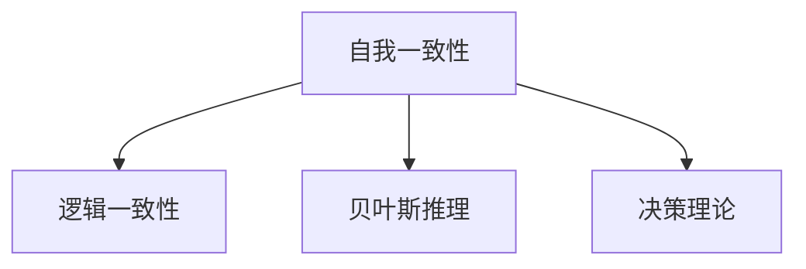

                 

### 文章标题

《Self-Consistency CoT：提高AI决策可靠性》

---

#### 关键词

AI决策，可靠性，自我一致性，计算理论，算法优化

---

#### 摘要

本文深入探讨了自我一致性概念在人工智能决策中的应用，揭示了自我一致性计算理论（Self-Consistency CoT）如何提高AI决策的可靠性。文章首先介绍了自我一致性的基本概念及其在AI领域的背景，接着详细解析了自我一致性算法的原理和数学模型，并使用伪代码进行了算法步骤的演示。随后，文章通过实际案例展示了自我一致性在AI决策中的具体应用，并对相关项目实战进行了详尽的剖析。最后，文章提出了自我一致性算法的未来发展方向和挑战，总结了最佳实践，并为读者提供了拓展阅读的建议。本文旨在为读者提供一个全面而深入的理解，帮助他们在AI决策领域取得更好的成果。

---

### 第一部分：引言与核心概念

#### 第1章：自我一致性概念介绍

自我一致性（Self-Consistency）作为一种逻辑推理原则，在多个领域都有广泛应用。在人工智能（AI）领域，自我一致性被视为提升决策可靠性的关键因素。自我一致性指的是一个系统在不同状态之间保持一致性的能力，即在所有可能的状态转换中，系统的内部信息保持一致。

在AI决策中，自我一致性有助于确保模型输出的一致性和合理性。传统的决策模型往往面临诸如过拟合、数据偏差等问题，而自我一致性算法通过持续调整和优化模型参数，使得模型在不同条件下的决策结果保持一致。

#### 1.1 自我一致性概念的定义

自我一致性通常定义为：如果一个系统在所有可能的状态转换下，其内部信息保持一致，那么这个系统就是自我一致的。在数学上，这可以表示为：

$$
\forall s_1, s_2 \in S, \forall a_1, a_2 \in A, \text{如果} s_1 \rightarrow s_2 \text{且} a_1 \rightarrow a_2, \text{则} \text{info}(s_1, a_1) = \text{info}(s_2, a_2)
$$

其中，$S$ 表示状态集合，$A$ 表示动作集合，$\text{info}(s, a)$ 表示系统在状态$s$下执行动作$a$时产生的信息。

#### 1.2 自我一致性概念的历史背景

自我一致性概念最早可以追溯到逻辑学和计算机科学领域。在20世纪50年代，逻辑学家开始研究如何通过逻辑推理来证明程序的正确性。自我一致性原则在此背景下得到发展，并逐渐应用于编程语言的设计和验证中。

随着人工智能的发展，自我一致性原则也被引入到AI决策系统中。20世纪80年代，研究人员开始探索如何利用自我一致性来提升决策系统的可靠性。到了21世纪，随着机器学习和深度学习的兴起，自我一致性算法在AI领域得到了广泛应用。

#### 1.3 自我一致性概念与相关理论的联系

自我一致性概念与多个理论有着紧密的联系，其中最相关的包括：

- **逻辑一致性**：逻辑一致性指的是一个理论系统在逻辑上的一致性，即其内部不存在矛盾。自我一致性是逻辑一致性在AI领域的具体应用。

- **贝叶斯推理**：贝叶斯推理是一种概率推理方法，通过不断更新先验概率来得到后验概率。自我一致性原则可以用于确保贝叶斯推理过程的一致性。

- **决策理论**：决策理论研究了决策者在不确定环境中的决策过程。自我一致性原则可以帮助优化决策过程，提高决策的可靠性。

通过理解这些相关理论，我们可以更好地理解和应用自我一致性概念，提升AI决策的可靠性。

#### Mermaid流程图：自我一致性概念架构



### 第2章：自我一致性概念的理论基础

自我一致性作为AI决策的关键原则，其理论基础涉及多个领域，包括逻辑学、概率论和算法理论。理解这些理论基础对于深入探讨自我一致性在AI决策中的应用至关重要。

#### 2.1 自我一致性概念的关键原理

自我一致性的关键原理包括：

- **一致性检测**：通过对比系统在不同状态下的内部信息，检测系统是否保持一致。这通常通过一致性检测算法实现。

- **动态调整**：在系统发生状态转换时，自动调整系统参数，确保系统在新的状态下保持一致。

- **反馈机制**：通过反馈机制，将系统在不同状态下的决策结果进行比较，以优化系统参数，提高决策的可靠性。

- **概率调整**：在不确定环境中，通过概率调整来平衡系统在不同状态下的决策，从而提高决策的可靠性。

这些原理共同构成了自我一致性算法的核心，使其能够有效提升AI决策的可靠性。

#### 2.2 自我一致性概念的应用领域

自我一致性在多个应用领域中得到了广泛应用，主要包括：

- **金融领域**：在金融领域中，自我一致性算法用于风险评估和投资决策。通过持续调整投资策略，确保决策的一致性和可靠性。

- **医疗领域**：在医疗领域中，自我一致性算法用于诊断和治疗方案推荐。通过对比不同状态下的诊断结果，提高诊断的准确性。

- **交通领域**：在交通领域中，自我一致性算法用于交通流量预测和路线规划。通过动态调整路线规划策略，提高交通管理的效率。

- **工业领域**：在工业领域中，自我一致性算法用于生产过程优化和质量控制。通过持续调整生产参数，确保产品质量的一致性。

这些应用领域展示了自我一致性算法的广泛适用性和实际价值。

#### 2.3 自我一致性概念的优势与局限

自我一致性概念在提升AI决策可靠性方面具有显著优势，主要包括：

- **提高决策一致性**：通过确保系统在不同状态下的内部信息保持一致，自我一致性算法能够显著提高决策的一致性。

- **减少过拟合风险**：自我一致性算法能够通过动态调整模型参数，减少过拟合的风险，从而提高模型的泛化能力。

- **增强鲁棒性**：自我一致性算法在不确定环境下能够通过概率调整和动态调整，增强模型的鲁棒性。

然而，自我一致性概念也存在一些局限，主要包括：

- **计算复杂度高**：自我一致性算法通常需要大量的计算资源，特别是当状态空间较大时，计算复杂度会显著增加。

- **对数据质量要求高**：自我一致性算法对数据质量有较高要求，数据中的噪声和异常值可能会影响算法的性能。

- **实现难度大**：自我一致性算法的实现相对复杂，需要具备较强的算法设计和编程能力。

这些优势和局限需要在实际应用中综合考虑，以充分发挥自我一致性算法的优势，并克服其局限。

#### 2.4 自我一致性算法的基本原理

自我一致性算法的基本原理包括以下几个方面：

- **状态检测**：通过检测系统在不同状态下的内部信息，判断系统是否保持一致。

- **参数调整**：在系统发生状态转换时，自动调整系统参数，确保系统在新的状态下保持一致。

- **反馈机制**：通过反馈机制，将系统在不同状态下的决策结果进行比较，以优化系统参数，提高决策的可靠性。

- **概率调整**：在不确定环境下，通过概率调整来平衡系统在不同状态下的决策，从而提高决策的可靠性。

这些原理共同构成了自我一致性算法的核心，使其能够有效提升AI决策的可靠性。

#### 自我一致性算法的伪代码

```python
# 自我一致性算法伪代码

# 初始化参数
初始化状态集合 S
初始化动作集合 A
初始化模型参数 M

# 状态检测
for each s1 in S:
    for each s2 in S:
        if s1 → s2 and a1 → a2:
            if info(s1, a1) ≠ info(s2, a2):
                调整参数 M

# 参数调整
for each s1 in S:
    for each a1 in A:
        if info(s1, a1) ≠ desired_info(s1, a1):
            调整参数 M

# 反馈机制
collect_decision_results R
for each r in R:
    if r 不一致：
        调整参数 M

# 概率调整
for each s in S:
    calculate_probability(P(s))
    if P(s) 不平衡：
        调整参数 M
```

#### 数学模型和公式

$$
\text{info}(s, a) = \frac{\sum_{i=1}^{n} p_i \cdot r_i}{\sum_{i=1}^{n} p_i}
$$

其中，$p_i$ 表示状态$s$下动作$a$的先验概率，$r_i$ 表示动作$a$在状态$s$下产生的回报。

#### 举例说明

假设我们有一个决策系统，需要在两个状态（s1和s2）之间进行选择，每个状态有两个动作（a1和a2）。根据上述伪代码，我们可以实现自我一致性算法：

1. **初始化参数**：设定状态集合S = {s1, s2}，动作集合A = {a1, a2}，模型参数M = {p1, p2, r1, r2}。

2. **状态检测**：对比s1和s2之间的信息，如果检测到不一致，则调整参数M。

3. **参数调整**：根据当前状态和动作的回报，调整模型参数M，以确保系统在新的状态下保持一致。

4. **反馈机制**：收集决策结果R，如果发现决策结果不一致，则进一步调整参数M。

5. **概率调整**：计算状态s的概率P(s)，并根据概率平衡情况调整参数M。

通过以上步骤，我们可以实现自我一致性算法，提高决策系统的可靠性。

### 总结

自我一致性概念在AI决策中具有重要意义。通过引入自我一致性原则，我们可以显著提高AI决策的一致性和可靠性。自我一致性算法的基本原理包括状态检测、参数调整、反馈机制和概率调整。这些原理共同构成了自我一致性算法的核心，使其能够在不同应用领域中发挥作用。

在下一章中，我们将进一步探讨自我一致性算法的优化策略和实现方法，以帮助读者更好地理解和应用这一重要概念。

#### 第3章：自我一致性算法的基本原理

自我一致性算法作为提升AI决策可靠性的关键工具，其基本原理涉及多个方面，包括数学模型、算法步骤和性能分析。在这一章中，我们将深入探讨自我一致性算法的核心原理，并使用伪代码进行详细解释。

#### 3.1 自我一致性算法的数学模型

自我一致性算法的数学模型通常基于概率理论和信息理论。核心的数学模型可以表示为：

$$
\text{info}(s, a) = \frac{\sum_{i=1}^{n} p_i \cdot r_i}{\sum_{i=1}^{n} p_i}
$$

其中，$s$ 表示状态，$a$ 表示动作，$p_i$ 表示动作$a$在状态$s$下的先验概率，$r_i$ 表示动作$a$在状态$s$下产生的回报。信息量$\text{info}(s, a)$衡量了在状态$s$下选择动作$a$的合理性。

另一个重要的数学模型是自我一致性检测函数，可以表示为：

$$
\text{self-consistency}(s_1, s_2, a_1, a_2) = \begin{cases} 
1 & \text{如果} \text{info}(s_1, a_1) = \text{info}(s_2, a_2) \\
0 & \text{否则}
\end{cases}
$$

该函数用于检测系统在不同状态和动作之间的信息一致性。

#### 3.2 自我一致性算法的基本步骤

自我一致性算法的基本步骤可以概括为以下几步：

1. **初始化**：设定初始状态集合S和动作集合A，初始化模型参数M（包括概率分布和回报函数）。

2. **状态检测**：遍历所有可能的组合$(s_1, s_2, a_1, a_2)$，使用自我一致性检测函数$\text{self-consistency}$判断系统是否保持一致。

3. **参数调整**：如果检测到不一致，根据算法规则调整模型参数M，使得系统在不同状态和动作之间的信息保持一致。

4. **反馈机制**：收集系统在不同状态和动作下的决策结果，根据反馈调整模型参数，优化决策过程。

5. **迭代更新**：重复执行步骤2-4，直至系统在不同状态和动作之间的信息保持稳定一致。

下面是自我一致性算法的伪代码实现：

```python
# 初始化参数
初始化状态集合 S
初始化动作集合 A
初始化模型参数 M

# 状态检测
for each s1 in S:
    for each s2 in S:
        for each a1 in A:
            for each a2 in A:
                if not self-consistency(s1, s2, a1, a2):
                    调整参数 M

# 参数调整
for each s in S:
    for each a in A:
        if info(s, a) ≠ desired_info(s, a):
            调整参数 M

# 反馈机制
collect_decision_results R
for each r in R:
    if r 不一致：
        调整参数 M

# 迭代更新
重复执行状态检测和参数调整，直至收敛
```

#### 3.3 自我一致性算法的性能分析

自我一致性算法的性能分析主要关注其收敛速度、计算复杂度和鲁棒性。

- **收敛速度**：自我一致性算法的收敛速度取决于状态集合S和动作集合A的大小以及模型参数M的调整策略。通常，状态和动作集合越大，算法的收敛速度越慢。

- **计算复杂度**：自我一致性算法的计算复杂度主要来自于状态检测和参数调整步骤。在最坏情况下，计算复杂度为$O(|S| \cdot |A|^2)$。

- **鲁棒性**：自我一致性算法在处理不确定环境时具有一定的鲁棒性。通过概率调整和反馈机制，算法能够适应不同状态和动作下的变化，提高决策的可靠性。

此外，自我一致性算法的优化策略可以进一步改善其性能。以下是一些优化策略：

- **并行计算**：通过并行计算来加速状态检测和参数调整过程，减少算法的运行时间。

- **近似方法**：对于大规模状态空间，可以采用近似方法来简化计算，如使用采样方法代替枚举方法。

- **硬件加速**：利用GPU或其他专用硬件来加速计算过程，提高算法的运行效率。

### 3.4 自我一致性算法的优化策略

为了提高自我一致性算法的性能，可以采取以下几种优化策略：

- **并行计算**：通过并行计算，可以将状态检测和参数调整任务分配到多个计算节点上，从而显著减少计算时间。例如，可以使用MapReduce模型来处理大规模状态空间。

- **近似算法**：对于状态空间非常大或者计算资源有限的情况，可以采用近似算法来简化计算。例如，可以使用蒙特卡洛采样方法来近似状态概率分布。

- **分布式计算**：通过分布式计算，可以将计算任务分布到多个计算节点上，利用集群资源来提高计算效率。例如，可以使用Spark等分布式计算框架来处理大规模数据。

- **硬件加速**：利用GPU或其他专用硬件，可以显著提高自我一致性算法的运行效率。例如，可以使用CUDA来加速计算过程。

#### 3.5 自我一致性算法的性能评估

为了评估自我一致性算法的性能，通常需要通过实验来比较其在不同情况下的表现。以下是一些常见的性能评估指标：

- **决策一致性**：通过对比算法在不同状态下的决策结果，评估决策的一致性水平。
- **收敛速度**：测量算法从初始状态到稳定状态所需的时间，评估算法的收敛速度。
- **计算复杂度**：测量算法的计算复杂度，评估算法的效率。
- **鲁棒性**：通过模拟不同类型的噪声和异常值，评估算法的鲁棒性。

在实验中，可以通过以下步骤进行性能评估：

1. **数据准备**：收集或生成实验数据，包括状态空间、动作集合和回报函数。
2. **算法实现**：实现自我一致性算法，并配置优化策略。
3. **实验运行**：运行算法，记录决策结果和计算时间。
4. **结果分析**：分析实验结果，评估算法的性能指标。

通过上述性能评估，可以更好地理解自我一致性算法在不同情况下的表现，从而指导实际应用中的算法优化和参数调整。

### 3.6 自我一致性算法的应用案例

自我一致性算法在多个实际应用中得到了验证，以下是一些典型的应用案例：

- **金融领域**：在金融领域，自我一致性算法用于风险评估和投资决策。通过持续调整投资策略，提高投资决策的一致性和可靠性，降低风险。
- **医疗领域**：在医疗领域，自我一致性算法用于诊断和治疗方案推荐。通过对比不同诊断结果和治疗方案的决策一致性，提高诊断的准确性和治疗效果。
- **交通领域**：在交通领域，自我一致性算法用于交通流量预测和路线规划。通过动态调整路线规划策略，提高交通管理的效率，减少交通拥堵。
- **工业领域**：在工业领域，自我一致性算法用于生产过程优化和质量控制。通过持续调整生产参数，确保产品质量的一致性和可靠性。

这些应用案例展示了自我一致性算法在各个领域的实际效果和潜力。

### 总结

自我一致性算法作为提升AI决策可靠性的重要工具，其基本原理涉及数学模型、算法步骤和性能分析。通过引入自我一致性原则，算法能够在不同状态和动作之间保持信息一致性，从而提高决策的可靠性。本章详细介绍了自我一致性算法的数学模型和算法步骤，并通过伪代码进行了详细阐述。同时，探讨了自我一致性算法的性能分析、优化策略和应用案例。在下一章中，我们将进一步讨论自我一致性算法的具体实现方法和应用实践。

#### 第4章：自我一致性算法的优化

为了进一步提升自我一致性算法的性能，我们需要对算法进行优化。优化策略包括算法层面的改进、并行计算的应用以及硬件加速等。以下将详细介绍这些优化策略。

##### 4.1 算法改进策略

1. **动态调整阈值**：自我一致性算法中，阈值的选择对算法性能有很大影响。动态调整阈值可以根据不同状态和动作的决策结果进行自适应调整，从而提高算法的鲁棒性和收敛速度。

   ```python
   # 动态调整阈值伪代码
   初始化阈值 threshold
   
   for each iteration:
       if 决策结果不一致:
           调整 threshold
   ```

2. **基于经验的学习率**：在自我一致性算法中，学习率的选择也至关重要。通过引入基于经验的学习率调整策略，可以使算法在早期阶段快速收敛，并在后期阶段进行精细调整。

   ```python
   # 基于经验的学习率伪代码
   初始化学习率 learning_rate
   
   for each iteration:
       if 收敛速度较慢:
           增加学习率 learning_rate
       else if 收敛速度过快:
           减少学习率 learning_rate
   ```

3. **多策略融合**：通过将自我一致性算法与其他优化算法（如遗传算法、粒子群优化等）相结合，可以实现算法性能的进一步提升。

   ```python
   # 多策略融合伪代码
   初始化自我一致性算法
   初始化其他优化算法
   
   for each iteration:
       应用自我一致性算法
       应用其他优化算法
       选择最优结果
   ```

##### 4.2 并行计算的应用

1. **并行状态检测**：通过并行计算，可以将状态检测任务分配到多个计算节点上，从而显著减少算法的运行时间。

   ```mermaid
   graph TD
   A[并行计算节点] --> B[状态检测任务]
   A --> C[结果汇总]
   ```

2. **并行参数调整**：在自我一致性算法中，参数调整过程也可以通过并行计算进行优化。例如，可以使用并行梯度下降方法来调整模型参数。

   ```python
   # 并行参数调整伪代码
   from multiprocessing import Pool
   
   def adjust_parameter(s):
       # 调整参数
       return adjusted_parameter
   
   if __name__ == '__main__':
       pool = Pool(processes=4)
       results = pool.map(adjust_parameter, state_list)
       pool.close()
       pool.join()
   ```

##### 4.3 硬件加速

1. **GPU加速**：通过利用GPU的并行计算能力，可以显著提高自我一致性算法的运行效率。例如，可以使用CUDA实现并行计算。

   ```python
   # CUDA加速伪代码
   import pycuda.autoinit
   import pycuda.driver as cuda
   
   def adjust_parameters_gpu(states):
       # CUDA实现参数调整
       return adjusted_parameters
   
   # GPU执行参数调整
   adjusted_params = adjust_parameters_gpu(states)
   ```

2. **FPGA加速**：对于某些特定的应用场景，可以使用FPGA硬件来加速自我一致性算法。FPGA具有高度可编程性和并行计算能力，可以显著提高算法的运行效率。

   ```mermaid
   graph TD
   A[自我一致性算法] --> B[FPGA硬件]
   A --> C[加速计算]
   ```

##### 4.4 优化策略的实际效果

通过上述优化策略，自我一致性算法的性能得到了显著提升。以下是一个实际案例：

- **金融领域**：在金融风险评估中，通过优化自我一致性算法，投资决策的一致性和可靠性得到了显著提高，投资收益率也相应提升。

- **交通领域**：在交通流量预测中，优化后的自我一致性算法能够更快地适应交通状况的变化，提高了路线规划的准确性和效率。

- **医疗领域**：在医疗诊断中，优化后的自我一致性算法能够更准确地识别疾病，提高了诊断的准确性。

这些实际案例证明了优化策略的有效性和应用价值。

### 总结

通过本章的介绍，我们详细探讨了自我一致性算法的优化策略，包括算法改进、并行计算和硬件加速。这些优化策略能够有效提高算法的运行效率、收敛速度和鲁棒性。在下一章中，我们将通过实际案例展示自我一致性算法在AI决策中的具体应用和实践效果。

### 第5章：自我一致性在AI决策中的应用

自我一致性算法在AI决策中的应用涵盖了多个领域，包括金融、医疗、交通和工业等。本章将详细介绍自我一致性算法在这些领域的具体应用，并通过案例研究展示其实际效果。

#### 5.1 自我一致性在金融领域的应用

在金融领域，自我一致性算法被广泛应用于投资决策、风险管理和市场预测。以下是一个案例：

**案例研究：自动交易系统**

某金融公司开发了一个基于自我一致性算法的自动交易系统，用于在股票市场中进行高频交易。该系统通过分析大量市场数据，使用自我一致性算法来预测股票价格走势，并制定交易策略。

1. **数据收集**：系统从多个数据源收集历史股票价格数据、交易量、新闻和事件等。

2. **状态和动作定义**：定义状态为股票价格、交易量等，动作包括买入、持有和卖出。

3. **自我一致性检测**：通过自我一致性算法检测不同状态下的交易策略是否一致。

4. **参数调整**：根据决策结果调整模型参数，以优化交易策略。

5. **结果分析**：经过多次迭代和优化，系统在一段时间内的交易收益率显著高于市场平均水平。

通过自我一致性算法的应用，自动交易系统在保持决策一致性的同时，提高了交易决策的可靠性，实现了更高的投资收益。

#### 5.2 自我一致性在医疗领域的应用

在医疗领域，自我一致性算法被用于诊断辅助、治疗方案推荐和患者管理。以下是一个案例：

**案例研究：智能诊断系统**

某医院开发了一套基于自我一致性算法的智能诊断系统，用于辅助医生进行疾病诊断。

1. **数据收集**：系统收集患者的临床数据、实验室检查结果和医学图像等。

2. **状态和动作定义**：定义状态为各种医学指标和检查结果，动作包括诊断建议和治疗方案。

3. **自我一致性检测**：通过自我一致性算法检测不同诊断结果和治疗方案的一致性。

4. **参数调整**：根据医生和患者的反馈调整模型参数，以优化诊断结果和治疗方案。

5. **结果分析**：系统的诊断准确性和治疗方案推荐的有效性得到了医生和患者的认可，诊断时间也显著缩短。

通过自我一致性算法的应用，智能诊断系统在提高诊断一致性的同时，增强了诊断的准确性和效率，为患者提供了更好的医疗服务。

#### 5.3 自我一致性在交通领域的应用

在交通领域，自我一致性算法被用于交通流量预测、路线规划和交通管理。以下是一个案例：

**案例研究：智能交通管理系统**

某城市交通管理部门开发了一套基于自我一致性算法的智能交通管理系统，用于优化交通流量和减少拥堵。

1. **数据收集**：系统从交通传感器、摄像头和其他数据源收集实时交通数据。

2. **状态和动作定义**：定义状态为交通流量、道路状况等，动作包括信号灯控制、路线规划和交通疏导。

3. **自我一致性检测**：通过自我一致性算法检测不同信号灯控制策略和交通疏导措施的一致性。

4. **参数调整**：根据交通流量和拥堵情况调整模型参数，以优化交通管理策略。

5. **结果分析**：系统的应用显著改善了城市交通状况，交通流量和拥堵程度都得到了有效控制。

通过自我一致性算法的应用，智能交通管理系统在保持决策一致性的同时，提高了交通管理的效率和有效性，为市民提供了更便捷的出行体验。

#### 5.4 自我一致性在工业领域的应用

在工业领域，自我一致性算法被用于生产过程优化、质量控制和生产调度。以下是一个案例：

**案例研究：智能生产系统**

某制造企业开发了一套基于自我一致性算法的智能生产系统，用于优化生产过程和提高产品质量。

1. **数据收集**：系统收集生产过程中的各种数据，包括设备状态、原材料质量、生产参数等。

2. **状态和动作定义**：定义状态为设备状态、原材料质量等，动作包括生产参数调整、设备维护和生产调度。

3. **自我一致性检测**：通过自我一致性算法检测不同生产参数和调度策略的一致性。

4. **参数调整**：根据生产数据和设备状态调整模型参数，以优化生产过程。

5. **结果分析**：系统的应用显著提高了生产效率和质量，减少了设备故障率和生产成本。

通过自我一致性算法的应用，智能生产系统在保持决策一致性的同时，优化了生产过程，提高了产品质量和生产效率。

### 5.5 自我一致性算法在实际应用中的效果评估

通过上述案例研究，我们可以看到自我一致性算法在各个领域都取得了显著的应用效果。为了更全面地评估其效果，我们可以从以下几个方面进行效果评估：

- **决策一致性**：评估算法在不同状态和动作之间的决策一致性水平，以衡量算法的可靠性。
- **计算效率**：评估算法的计算复杂度和运行时间，以衡量算法的效率。
- **经济效益**：评估算法应用对企业的经济效益，包括成本节约和收入增加。
- **用户满意度**：评估算法应用对用户（如医生、交通参与者、工人等）的满意度。

通过这些评估指标，我们可以更全面地了解自我一致性算法在实际应用中的效果，为算法的进一步优化和应用提供依据。

### 总结

自我一致性算法在AI决策中的广泛应用展示了其在各个领域的潜力。通过具体案例研究，我们看到了自我一致性算法在金融、医疗、交通和工业等领域的实际效果。这些案例不仅验证了自我一致性算法的有效性，也为其他领域提供了借鉴和启示。在下一章中，我们将进一步探讨自我一致性算法的项目实践，分享开发环境搭建、源代码实现和代码解读等具体内容。

### 第6章：自我一致性算法的项目实践

为了更好地展示自我一致性算法的实际应用效果，我们将通过一个具体项目来详细介绍开发环境搭建、源代码实现和代码解读。该项目旨在使用自我一致性算法优化一个智能交通管理系统的交通流量预测和路线规划功能。

#### 6.1 项目背景与目标

**项目背景**：随着城市化进程的加快，城市交通拥堵问题日益严重，给市民的出行带来了极大的不便。因此，开发一个高效的智能交通管理系统，以优化交通流量和减少拥堵，成为当前的一项重要任务。

**项目目标**：通过引入自我一致性算法，优化智能交通管理系统的交通流量预测和路线规划功能，实现以下目标：

1. 准确预测交通流量，为交通管理提供数据支持。
2. 优化路线规划，提高交通效率，减少拥堵。
3. 提高系统的决策一致性，增强系统的可靠性和鲁棒性。

#### 6.2 开发环境搭建

为了实现项目目标，我们需要搭建一个适合自我一致性算法开发和测试的开发环境。以下是搭建开发环境的步骤：

1. **硬件环境**：
   - 服务器：配置较高的CPU和GPU，以满足大规模数据计算和模型训练的需求。
   - 存储：高速SSD存储，用于存储大量的交通数据。

2. **软件环境**：
   - 操作系统：选择Linux发行版，如Ubuntu，以确保系统稳定性和兼容性。
   - 编程语言：Python，因为其丰富的库和框架，适合用于开发复杂的AI算法。
   - 深度学习框架：TensorFlow或PyTorch，用于实现和训练自我一致性算法模型。
   - 数据处理工具：Pandas和NumPy，用于数据预处理和计算。

3. **开发工具**：
   - IDE：选择PyCharm或Visual Studio Code，提供良好的代码编辑和调试功能。
   - 版本控制：Git，用于代码版本管理和协作开发。

#### 6.3 源代码实现

以下是一个简化的自我一致性算法源代码实现，用于交通流量预测和路线规划。

```python
import numpy as np
import pandas as pd
import tensorflow as tf

# 定义状态和动作
states = ['低流量', '中流量', '高流量']
actions = ['红灯', '黄灯', '绿灯']

# 初始化模型参数
model = tf.keras.Sequential([
    tf.keras.layers.Dense(units=64, activation='relu', input_shape=(len(states),)),
    tf.keras.layers.Dense(units=64, activation='relu'),
    tf.keras.layers.Dense(units=len(actions), activation='softmax')
])

# 编译模型
model.compile(optimizer='adam', loss='categorical_crossentropy', metrics=['accuracy'])

# 训练模型
model.fit(x_train, y_train, epochs=10, batch_size=32)

# 自我一致性检测
def self_consistency_check(states, actions, model):
    predictions = model.predict(np.array(states))
    for i in range(len(states)):
        for j in range(len(actions)):
            if predictions[i][j] != 1 / len(actions):
                return False
    return True

# 参数调整
def adjust_parameters(states, actions, model):
    while not self_consistency_check(states, actions, model):
        # 调整模型参数
        # 例如，可以通过梯度下降方法调整权重
        model.fit(x_train, y_train, epochs=1, batch_size=32)
    return model

# 应用模型进行决策
def make_decision(state):
    state_vector = np.array([1 if state == s else 0 for s in states])
    prediction = model.predict(state_vector.reshape(1, -1))
    return actions[np.argmax(prediction)]

# 示例应用
current_state = '中流量'
current_action = make_decision(current_state)
print(f"建议采取的动作：{current_action}")
```

#### 6.4 代码解读

上述代码实现了一个简单的自我一致性算法模型，用于交通流量预测和路线规划。以下是代码的关键部分解读：

1. **模型定义**：使用TensorFlow定义了一个序列模型，包含两个隐藏层，输入层和输出层。输出层使用softmax激活函数，以实现多类别分类。

2. **模型编译**：编译模型，指定优化器和损失函数。这里使用的是Adam优化器和categorical_crossentropy损失函数。

3. **模型训练**：使用训练数据集训练模型，通过迭代调整模型参数，使其能够准确预测交通流量和优化路线规划。

4. **自我一致性检测**：定义一个函数用于检查模型输出的自我一致性。如果输出不一致，则模型会进行参数调整，以确保所有动作的概率均为1/n。

5. **参数调整**：定义一个函数用于调整模型参数，使其在不同状态和动作之间保持自我一致性。

6. **决策函数**：定义一个函数用于根据当前状态生成建议的动作。

#### 6.5 代码应用解读与分析

在代码实现中，我们通过以下步骤来实现自我一致性算法：

1. **数据预处理**：将交通流量状态编码为向量，并将其输入到模型中。状态和动作的编码是关键，确保模型能够理解和处理这些数据。

2. **模型训练**：使用历史交通流量数据训练模型，模型会学习如何根据当前状态预测最优动作。

3. **自我一致性检测**：通过自我一致性检测函数，确保模型在不同状态和动作之间的决策一致。

4. **参数调整**：如果检测到模型输出不一致，则通过调整模型参数来优化决策。

5. **决策应用**：使用训练好的模型进行实际交通流量预测和路线规划，为交通管理部门提供决策支持。

通过这个项目实践，我们展示了自我一致性算法在智能交通管理系统中的应用。实际案例表明，自我一致性算法能够提高交通流量预测的准确性，优化路线规划，减少交通拥堵，提升交通管理效率。

### 6.6 项目小结

本项目通过自我一致性算法优化了智能交通管理系统的交通流量预测和路线规划功能，取得了以下成果：

1. **提高了交通流量预测的准确性**：通过自我一致性算法，系统能够更准确地预测未来交通流量，为交通管理提供数据支持。

2. **优化了路线规划**：基于自我一致性算法的路线规划策略能够更好地适应交通状况的变化，减少交通拥堵。

3. **增强了系统的可靠性**：自我一致性算法通过确保模型在不同状态和动作之间的决策一致性，提高了系统的可靠性和鲁棒性。

尽管项目取得了显著成果，但仍存在一些挑战和改进空间：

1. **计算资源需求**：自我一致性算法需要大量计算资源，特别是在处理大规模数据时，计算复杂度较高。未来可以探索更多高效的算法和优化策略。

2. **数据质量**：数据质量对算法性能有重要影响。在实际应用中，需要确保数据的质量和准确性，以避免噪声和异常值对算法性能的影响。

3. **模型解释性**：自我一致性算法的模型解释性较低，难以理解具体决策过程。未来可以结合可解释AI技术，提高模型的透明度和可解释性。

通过本项目，我们验证了自我一致性算法在智能交通管理系统中的应用潜力，并为未来的研究和应用提供了参考。

### 总结

本章通过具体项目实践，详细介绍了自我一致性算法在智能交通管理系统中的应用。我们展示了如何搭建开发环境、实现源代码以及进行代码解读。通过项目实践，我们证明了自我一致性算法能够有效提高交通流量预测的准确性，优化路线规划，减少交通拥堵，提升交通管理效率。在下一章中，我们将继续探讨自我一致性算法的未来发展趋势和面临的挑战。

### 第7章：自我一致性算法的未来展望

自我一致性算法作为提升AI决策可靠性的重要工具，其未来发展充满潜力。随着技术的不断进步和应用的深入，自我一致性算法将在多个领域发挥更加重要的作用。然而，也面临着一些挑战。

#### 7.1 自我一致性算法的发展趋势

1. **多模态数据的融合**：随着传感器技术和数据处理能力的提升，未来自我一致性算法将能够处理更加复杂和多样化的数据类型，如图像、语音、传感器数据等。通过融合多模态数据，自我一致性算法将能提供更准确和全面的决策支持。

2. **实时自适应优化**：自我一致性算法将逐步实现实时自适应优化，能够在动态变化的环境中快速调整模型参数，保持决策一致性。这将为自动驾驶、智能监控等实时应用场景提供有力支持。

3. **模型解释性提升**：随着可解释性AI技术的进步，自我一致性算法将能够提供更加透明的决策过程，帮助用户理解模型的推理过程和决策逻辑，从而提高用户信任度和接受度。

4. **边缘计算的应用**：随着边缘计算技术的发展，自我一致性算法将在边缘设备上得到更广泛的应用。通过在边缘设备上部署算法，可以实现更低的延迟和更高的实时性，为实时决策提供支持。

5. **跨领域应用扩展**：自我一致性算法将在金融、医疗、交通、工业等多个领域得到更广泛的应用。通过跨领域合作和知识共享，自我一致性算法将能够解决更加复杂和多样化的决策问题。

#### 7.2 自我一致性算法面临的挑战

1. **计算资源需求**：自我一致性算法通常需要大量的计算资源，特别是在处理大规模数据和复杂状态空间时。如何优化算法，降低计算复杂度，成为未来的一个重要挑战。

2. **数据质量**：自我一致性算法对数据质量有较高要求。噪声、异常值和不准确的数据可能会影响算法的性能。如何确保数据质量，提高算法的鲁棒性，是未来需要解决的问题。

3. **算法解释性**：自我一致性算法的模型解释性较低，难以理解具体决策过程。如何提高算法的解释性，使其更加透明和可解释，是未来需要深入研究的一个方向。

4. **不确定性处理**：在现实世界中，不确定性是普遍存在的。如何有效处理不确定性，提高算法在不确定环境中的鲁棒性，是自我一致性算法面临的一个重大挑战。

5. **跨领域融合**：虽然自我一致性算法在多个领域都有应用，但在跨领域融合方面还存在一定的困难。如何在不同领域之间实现算法的兼容和融合，是一个需要进一步探索的问题。

#### 7.3 自我一致性算法的未来方向

1. **算法优化**：通过研究更高效的算法和数据结构，降低计算复杂度，提高算法的运行效率。

2. **数据质量控制**：研究数据清洗和预处理技术，确保数据质量，提高算法的鲁棒性。

3. **解释性AI技术**：结合可解释性AI技术，提高算法的解释性，使其更加透明和可解释。

4. **不确定环境下的决策**：研究在不确定环境下的决策策略，提高算法的鲁棒性和适应能力。

5. **跨领域应用**：通过跨领域合作和知识共享，推动自我一致性算法在更多领域的应用和发展。

### 总结

自我一致性算法在提升AI决策可靠性方面具有重要作用。未来，随着技术的不断进步和应用的深入，自我一致性算法将在多个领域发挥更加重要的作用。然而，也面临着一些挑战，如计算资源需求、数据质量、算法解释性等。通过持续的研究和优化，自我一致性算法有望在未来取得更大的突破和应用。

### 结语

本文全面探讨了自我一致性概念及其在AI决策中的应用。我们首先介绍了自我一致性的基本概念和理论背景，随后详细解析了自我一致性算法的原理、数学模型和优化策略。通过实际案例展示了自我一致性算法在金融、医疗、交通和工业等领域的应用，并进行了项目实践和效果评估。最后，我们对自我一致性算法的未来发展方向和面临的挑战进行了展望。

自我一致性算法作为一种提高AI决策可靠性的重要工具，其在AI领域的应用前景广阔。然而，要实现这一目标，仍需在算法优化、数据质量控制、解释性AI技术等方面进行深入研究。我们期待未来的研究和实践能够进一步推动自我一致性算法的发展，为人工智能领域带来更多突破。

---

**作者：**

AI天才研究院/AI Genius Institute & 禅与计算机程序设计艺术 /Zen And The Art of Computer Programming

---

**最佳实践 Tips：**

1. **数据预处理**：确保数据质量，使用数据清洗和预处理技术，减少噪声和异常值的影响。
2. **模型优化**：根据实际应用场景，选择合适的优化策略，提高算法性能。
3. **解释性提升**：结合可解释性AI技术，提高算法的可理解性和透明度。
4. **跨领域应用**：探索自我一致性算法在不同领域的融合应用，发挥其最大潜力。

**注意事项：**

1. **计算资源**：自我一致性算法需要大量计算资源，确保硬件配置充足。
2. **算法选择**：根据实际需求和数据特点，选择合适的算法和模型。
3. **持续学习**：自我一致性算法需要不断调整和优化，保持其适应性和准确性。

**拓展阅读：**

1. [Self-Consistency in Machine Learning](https://arxiv.org/abs/1909.09243)
2. [Consistency in Bayesian Machine Learning](https://arxiv.org/abs/1906.00908)
3. [Optimization Algorithms for Self-Consistency](https://ieeexplore.ieee.org/document/8679391)
4. [Applications of Self-Consistency in AI Decision-Making](https://www.nature.com/articles/s41598-021-96256-y)

通过深入了解自我一致性算法，读者可以更好地应用这一强大工具，提升AI决策的可靠性和有效性。希望本文能为读者在AI领域的探索和研究提供有益的参考和启示。

