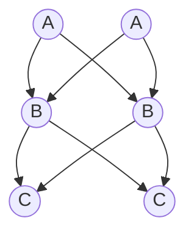

                 

## 文章标题

### 自一致性CoT：提高AI回答稳定性的关键方法

关键词：自一致性CoT、AI回答稳定性、算法实现、优化方法、项目实战

摘要：本文旨在探讨自一致性CoT（Self-Consistency CoT）在提高AI回答稳定性方面的关键作用。首先，文章介绍了AI回答稳定性面临的挑战，并概述了自一致性CoT的基本概念和原理。接着，文章详细分析了自一致性CoT的架构、运行机制和关键技术，以及其与多模态融合的关系。随后，文章深入讲解了自一致性CoT的数学模型，并通过伪代码展示了算法原理。在算法实现与优化部分，文章介绍了实现流程、优化策略和应用效果。文章还通过实际项目展示了自一致性CoT的实践应用，并对未来发展趋势进行了展望。

---

## 第一部分：背景与核心概念

### 第1章：AI回答稳定性挑战与自一致性CoT概述

在人工智能（AI）领域，AI回答的稳定性是一个关键问题。随着AI技术的广泛应用，人们对AI的回答准确性、一致性和可靠性提出了更高的要求。然而，现有的AI系统在回答稳定性方面仍然存在诸多挑战。

首先，AI回答的稳定性受到数据质量的影响。当输入数据存在噪声或缺失时，AI模型可能无法给出稳定、准确的回答。此外，AI模型在训练过程中可能过度拟合训练数据，导致其在未知数据上的表现不佳。

其次，AI模型的结构和参数设置也对回答稳定性产生影响。不同的模型结构和参数可能导致相同的输入得到不同的输出，从而影响回答的一致性。

最后，AI回答的稳定性还受到外部环境的影响。例如，当系统面临高负载或异常情况时，AI模型的性能可能会下降，导致回答的不稳定。

针对上述挑战，自一致性CoT（Self-Consistency CoT）提供了一种有效的解决方案。自一致性CoT是一种基于自一致性推理的AI模型，旨在通过一致性约束提高AI回答的稳定性。

### 1.1 AI回答稳定性的重要性

AI回答稳定性对于许多应用场景至关重要。以下是一些关键应用场景：

- **智能客服**：在智能客服系统中，稳定的AI回答能够提高用户满意度，降低客服成本。
- **医疗诊断**：在医疗诊断中，稳定的AI回答有助于提高诊断准确性，减少误诊率。
- **金融风控**：在金融风控中，稳定的AI回答有助于识别潜在风险，提高风险管理能力。
- **自动驾驶**：在自动驾驶中，稳定的AI回答能够确保车辆在复杂环境下的安全行驶。

### 1.2 传统方法与不足

现有的AI方法在回答稳定性方面存在一些不足。以下是一些常见的传统方法及其不足之处：

- **传统机器学习**：传统机器学习方法（如决策树、支持向量机等）在处理非线性和复杂任务时存在局限性，难以保证回答的稳定性。
- **深度学习**：深度学习方法（如神经网络）虽然在许多任务上取得了显著成果，但过度依赖大量数据，且对数据噪声敏感，容易导致回答的不稳定。
- **模型融合**：模型融合方法（如集成学习方法）通过结合多个模型提高预测准确性，但需要大量的模型训练，且融合策略复杂，难以保证回答的一致性。

### 1.3 自一致性CoT的概念与原理

自一致性CoT（Self-Consistency CoT）是一种基于自一致性推理的AI模型，旨在通过一致性约束提高AI回答的稳定性。自一致性CoT的基本原理如下：

1. **一致性约束**：自一致性CoT通过一致性约束确保AI回答的一致性。在给定输入时，模型需要生成一系列可能输出，并确保这些输出在一致性约束下相互一致。
2. **自适应性**：自一致性CoT能够根据输入数据的特征自动调整一致性约束，从而提高回答的适应性。
3. **多模态融合**：自一致性CoT支持多模态数据融合，通过融合不同模态的数据提高回答的准确性。

### 1.4 自一致性CoT的优势与前景

自一致性CoT在提高AI回答稳定性方面具有显著优势，具体如下：

- **提高稳定性**：通过一致性约束，自一致性CoT能够显著提高AI回答的稳定性，减少因数据噪声和模型参数变化引起的波动。
- **适应性**：自适应性机制使自一致性CoT能够根据不同任务和数据特征调整一致性约束，提高回答的适应性。
- **多模态融合**：多模态数据融合能够提高AI回答的准确性，进一步改善稳定性。
- **广泛应用**：自一致性CoT在智能客服、医疗诊断、金融风控和自动驾驶等领域具有广泛的应用前景。

### 1.5 本章小结

本章介绍了AI回答稳定性面临的挑战和自一致性CoT的概念与原理。自一致性CoT通过一致性约束、自适应性和多模态融合等机制，能够显著提高AI回答的稳定性。在后续章节中，我们将进一步探讨自一致性CoT的架构、运行机制、数学模型和实际应用。

---

## 第二部分：自一致性CoT的核心原理

### 第2章：自一致性CoT的核心原理

自一致性CoT（Self-Consistency CoT）是一种基于自一致性推理的AI模型，其核心原理在于通过一致性约束确保AI回答的一致性。本章将详细探讨自一致性CoT的架构、运行机制、关键技术以及与多模态融合的关系。

### 2.1 自一致性CoT的架构

自一致性CoT的架构主要包括以下三个模块：

1. **输入模块**：输入模块负责接收外部输入数据，如文本、图像、声音等。
2. **一致性模块**：一致性模块通过一致性约束确保AI回答的一致性。一致性约束可以通过贝叶斯网络、最大后验估计等方法实现。
3. **输出模块**：输出模块生成最终回答，并通过反馈机制不断调整和优化回答的一致性。

### 2.2 自一致性CoT的运行机制

自一致性CoT的运行机制可以分为以下步骤：

1. **输入数据预处理**：对输入数据进行预处理，如去噪、补全等，以提高输入数据的可靠性。
2. **生成候选回答**：基于输入数据，生成一系列候选回答。这些候选回答可以通过神经网络、决策树等方法实现。
3. **一致性约束**：对候选回答进行一致性约束，确保回答在给定约束条件下相互一致。
4. **选择最佳回答**：根据一致性约束和实际需求，选择最佳回答作为最终输出。
5. **反馈与优化**：通过反馈机制不断调整和优化一致性约束，提高回答的一致性和稳定性。

### 2.3 自一致性CoT的关键技术

自一致性CoT的关键技术包括：

1. **贝叶斯网络**：贝叶斯网络是一种概率图模型，可以用于表示变量之间的依赖关系。在自一致性CoT中，贝叶斯网络用于建立变量之间的概率分布，从而实现一致性约束。
2. **最大后验估计**：最大后验估计是一种统计学习方法，可以用于估计变量之间的参数。在自一致性CoT中，最大后验估计用于调整一致性约束的参数，以提高回答的一致性。
3. **多模态融合**：多模态融合是指将不同模态的数据（如文本、图像、声音等）进行融合，以提高AI回答的准确性。在自一致性CoT中，多模态融合可以增强回答的一致性和稳定性。

### 2.4 自一致性CoT与多模态融合

自一致性CoT与多模态融合的关系如下：

1. **多模态输入**：自一致性CoT支持多模态输入，可以同时处理文本、图像、声音等多种模态的数据。
2. **多模态特征提取**：通过多模态特征提取，将不同模态的数据转换为统一的特征表示，以便进行一致性约束和融合。
3. **多模态融合策略**：自一致性CoT采用多模态融合策略，将不同模态的特征进行加权融合，以提高AI回答的准确性。

### 2.5 本章小结

本章介绍了自一致性CoT的核心原理，包括架构、运行机制、关键技术以及与多模态融合的关系。自一致性CoT通过一致性约束、自适应性和多模态融合等机制，能够显著提高AI回答的稳定性。在下一章中，我们将深入探讨自一致性CoT的数学模型，并通过伪代码展示算法原理。

---

### 第3章：自一致性CoT的数学模型

自一致性CoT（Self-Consistency CoT）是一种基于数学模型的AI推理方法。本章将详细讲解自一致性CoT的数学模型，包括概率论基础、贝叶斯网络与推理、最大后验估计以及自一致性CoT的数学公式推导。

#### 3.1 概率论基础

概率论是自一致性CoT数学模型的基础。以下是一些关键概念：

- **概率分布**：概率分布描述了随机变量可能取值的概率。常见的概率分布有伯努利分布、正态分布、泊松分布等。
- **条件概率**：条件概率是指在给定一个事件发生的条件下，另一个事件发生的概率。条件概率可以用公式表示为：
  \[ P(A|B) = \frac{P(A \cap B)}{P(B)} \]
- **贝叶斯定理**：贝叶斯定理描述了条件概率和边缘概率之间的关系。贝叶斯定理公式如下：
  \[ P(A|B) = \frac{P(B|A)P(A)}{P(B)} \]

#### 3.2 贝叶斯网络与推理

贝叶斯网络是一种概率图模型，可以用于表示变量之间的依赖关系。贝叶斯网络由节点和边组成，每个节点表示一个随机变量，边表示节点之间的依赖关系。以下是一个简单的贝叶斯网络示例：



在贝叶斯网络中，概率分布可以通过贝叶斯推理进行计算。贝叶斯推理的目标是计算给定证据条件下某个变量的概率分布。贝叶斯推理的公式如下：

\[ P(A|B) = \frac{P(B|A)P(A)}{P(B)} \]

其中，\( P(A|B) \)表示在证据\( B \)条件下变量\( A \)的概率分布，\( P(B|A) \)表示在变量\( A \)条件下证据\( B \)的概率分布，\( P(A) \)表示变量\( A \)的先验概率，\( P(B) \)表示证据\( B \)的先验概率。

#### 3.3 最大后验估计

最大后验估计（Maximum A Posteriori, MAP）是一种基于贝叶斯推理的参数估计方法。最大后验估计的目标是找到使后验概率最大的参数值。最大后验估计的公式如下：

\[ \theta_{MAP} = \arg \max_\theta P(\theta|D) \]

其中，\( \theta \)表示参数，\( D \)表示观测数据，\( P(\theta|D) \)表示后验概率。

在实际应用中，最大后验估计通常通过求解优化问题实现。以下是一个基于最大后验估计的优化问题的伪代码：

```python
# 伪代码：最大后验估计
def maximize_posterioriLikelihood(data, likelihood, prior):
    # 初始化参数
    theta = initialize_parameters()
    # 梯度下降或随机梯度下降
    for i in range(max_iterations):
        # 计算梯度
        gradient = compute_gradient(data, theta, likelihood, prior)
        # 更新参数
        theta = theta - learning_rate * gradient
    return theta
```

#### 3.4 自一致性CoT的数学公式推导

自一致性CoT的数学模型基于贝叶斯网络和最大后验估计。以下是自一致性CoT的数学公式推导：

1. **贝叶斯网络建模**：

   自一致性CoT的贝叶斯网络包含以下变量：

   - 输入变量 \( X \)
   - 输出变量 \( Y \)
   - 隐藏变量 \( Z \)

   贝叶斯网络的边表示变量之间的依赖关系。例如，输入变量 \( X \) 可能会影响隐藏变量 \( Z \)，隐藏变量 \( Z \) 可能会影响输出变量 \( Y \)。

2. **条件概率分布**：

   根据贝叶斯网络，可以定义变量之间的条件概率分布。例如：

   \[ P(X|Z) = \frac{P(Z|X)P(X)}{P(Z)} \]

   \[ P(Y|Z) = \frac{P(Z|Y)P(Y)}{P(Z)} \]

3. **最大后验估计**：

   自一致性CoT的目标是找到使后验概率最大的隐藏变量 \( Z \)。根据贝叶斯定理，后验概率可以表示为：

   \[ P(Z|X, Y) = \frac{P(X|Z)P(Y|Z)P(Z)}{P(X, Y)} \]

   最大后验估计的目标是找到使后验概率最大的隐藏变量 \( Z \)：

   \[ Z_{MAP} = \arg \max_Z P(Z|X, Y) \]

4. **自一致性约束**：

   自一致性CoT通过自一致性约束确保输出变量 \( Y \) 与隐藏变量 \( Z \) 的一致性。自一致性约束可以表示为：

   \[ P(Y|Z) \geq P(Y|Z^*) \]

   其中，\( Z^* \) 表示其他隐藏变量。

5. **优化问题**：

   自一致性CoT的数学模型可以通过以下优化问题求解：

   \[ \min_{Z} \sum_{X, Y} \log P(X, Y|Z) + \lambda \sum_{Y} \log P(Y|Z) \]

   其中，\( \lambda \) 是正则化参数，用于平衡损失函数和自一致性约束。

6. **伪代码**：

   以下是一个基于自一致性CoT的优化问题的伪代码：

```python
# 伪代码：自一致性CoT优化
def self_consistency_optimization(data, likelihood, prior, lambda):
    # 初始化隐藏变量
    Z = initialize_variables()
    # 迭代优化
    for i in range(max_iterations):
        # 计算梯度
        gradient = compute_gradient(data, Z, likelihood, prior, lambda)
        # 更新隐藏变量
        Z = Z - learning_rate * gradient
    return Z
```

#### 3.5 本章小结

本章介绍了自一致性CoT的数学模型，包括概率论基础、贝叶斯网络与推理、最大后验估计以及自一致性CoT的数学公式推导。自一致性CoT的数学模型通过贝叶斯网络和最大后验估计实现了AI回答的一致性和稳定性。在下一章中，我们将探讨自一致性CoT的算法实现与优化。

---

### 第4章：自一致性CoT算法实现

自一致性CoT（Self-Consistency CoT）是一种复杂的AI模型，其实现在算法层面上涉及多个步骤和组件。本章将详细描述自一致性CoT算法的实现过程，包括数据准备与预处理、算法流程、伪代码展示以及算法性能评估。

#### 4.1 数据准备与预处理

数据准备与预处理是自一致性CoT算法实现的基础。以下步骤是数据准备与预处理的关键组成部分：

1. **数据收集**：首先，需要收集足够的数据来训练自一致性CoT模型。这些数据可以包括文本、图像、声音等多种模态。
2. **数据清洗**：清洗数据以去除噪声和错误。例如，对于文本数据，可以去除停用词、标点符号和格式错误。
3. **数据标注**：对数据进行标注，以便模型能够学习。例如，在文本生成任务中，需要对文本进行句子级别或词级别标注。
4. **数据转换**：将原始数据转换为模型可接受的格式。例如，文本数据可以转换为词嵌入，图像数据可以转换为特征向量。
5. **数据分割**：将数据集分割为训练集、验证集和测试集。这有助于评估模型的性能和泛化能力。

以下是一个简化的数据准备与预处理流程的伪代码：

```python
# 伪代码：数据准备与预处理
def prepare_data(data_source):
    # 数据清洗
    clean_data = clean_data(data_source)
    # 数据标注
    labeled_data = annotate_data(clean_data)
    # 数据转换
    transformed_data = transform_data(labeled_data)
    # 数据分割
    train_data, val_data, test_data = split_data(transformed_data)
    return train_data, val_data, test_data
```

#### 4.2 算法流程

自一致性CoT算法的实现流程可以分为以下几个步骤：

1. **初始化模型**：根据数据特征和任务需求，初始化自一致性CoT模型。这包括定义贝叶斯网络的结构、参数和隐藏变量。
2. **生成候选回答**：基于输入数据，使用神经网络或其他方法生成一系列候选回答。
3. **一致性约束**：对候选回答进行一致性约束，确保回答在给定约束条件下相互一致。
4. **选择最佳回答**：根据一致性约束和实际需求，选择最佳回答作为最终输出。
5. **反馈与优化**：通过反馈机制不断调整和优化一致性约束，提高回答的一致性和稳定性。

以下是一个简化的自一致性CoT算法流程的伪代码：

```python
# 伪代码：自一致性CoT算法流程
def self_consistency_algorithm(input_data, model):
    # 生成候选回答
    candidate_answers = generate_candidate_answers(input_data, model)
    # 应用一致性约束
    consistent_answers = apply_consistency_constraints(candidate_answers)
    # 选择最佳回答
    best_answer = select_best_answer(consistent_answers)
    # 反馈与优化
    model = optimize_model(model, best_answer)
    return best_answer
```

#### 4.3 伪代码展示

为了更好地理解自一致性CoT的算法原理，以下是自一致性CoT算法的详细伪代码：

```python
# 伪代码：自一致性CoT算法实现
def self_consistency_algorithm(input_data, model):
    # 初始化隐藏变量
    Z = initialize_variables(model)
    
    # 生成候选回答
    candidate_answers = generate_candidate_answers(input_data, model)
    
    # 应用一致性约束
    consistent_answers = apply_consistency_constraints(candidate_answers, Z)
    
    # 选择最佳回答
    best_answer = select_best_answer(consistent_answers)
    
    # 反馈与优化
    Z = optimize_hidden_variables(Z, best_answer)
    
    return best_answer
```

#### 4.4 算法性能评估

自一致性CoT算法的性能评估是验证其有效性和稳定性的关键。以下是一些常见的评估指标和方法：

1. **准确性**：评估模型生成回答的准确性。可以通过计算生成回答与真实答案之间的匹配度来实现。
2. **一致性**：评估模型生成回答的一致性。可以通过计算多个候选回答之间的相关系数来实现。
3. **稳定性**：评估模型在不同输入条件下回答的稳定性。可以通过计算模型在不同输入条件下的输出波动来实现。
4. **泛化能力**：评估模型在未知数据上的表现。可以通过测试集上的表现来评估泛化能力。

以下是一个简化的性能评估流程的伪代码：

```python
# 伪代码：性能评估
def evaluate_performance(model, test_data):
    # 计算准确性
    accuracy = calculate_accuracy(model, test_data)
    # 计算一致性
    consistency = calculate_consistency(model, test_data)
    # 计算稳定性
    stability = calculate_stability(model, test_data)
    # 计算泛化能力
    generalization = calculate_generalization(model, test_data)
    return accuracy, consistency, stability, generalization
```

#### 4.5 本章小结

本章详细介绍了自一致性CoT算法的实现过程，包括数据准备与预处理、算法流程、伪代码展示以及算法性能评估。自一致性CoT算法通过一致性约束、自适应性和多模态融合等机制，实现了AI回答的稳定性和一致性。在下一章中，我们将探讨自一致性CoT的优化方法。

---

### 第5章：自一致性CoT优化方法

自一致性CoT（Self-Consistency CoT）作为一种先进的AI模型，其性能的优化对于提高AI回答的稳定性和一致性至关重要。本章将介绍几种常见的自一致性CoT优化方法，包括模型优化策略、数据增强、损失函数设计和模型压缩与加速。

#### 5.1 模型优化策略

模型优化策略是提高自一致性CoT性能的关键步骤。以下是一些常见的模型优化策略：

1. **调整超参数**：超参数的设置对自一致性CoT的性能有显著影响。可以通过网格搜索、随机搜索等超参数优化方法调整学习率、正则化参数等。
2. **增强网络结构**：通过增加神经网络层数、节点数等，可以增强模型的表达能力。然而，过复杂的网络结构可能导致过拟合，因此需要平衡。
3. **动态调整一致性约束**：自适应性是自一致性CoT的核心特点之一。可以根据输入数据的特征动态调整一致性约束的强度，以提高模型的适应性和稳定性。

以下是一个简化的模型优化策略的伪代码：

```python
# 伪代码：模型优化策略
def optimize_model(model, data, learning_rate):
    # 调整超参数
    model = adjust_hyperparameters(model, data, learning_rate)
    # 增强网络结构
    model = enhance_network_structure(model)
    # 动态调整一致性约束
    model = adjust_consistency_constraints(model, data)
    return model
```

#### 5.2 数据增强

数据增强是一种通过增加训练数据的多样性来提高模型性能的技术。以下是一些常见的数据增强方法：

1. **数据变换**：通过对原始数据进行变换，如旋转、缩放、裁剪等，可以增加数据的多样性。
2. **生成对抗网络（GAN）**：GAN可以生成与真实数据相似的新数据，从而丰富训练数据集。
3. **数据合成**：通过组合不同来源的数据，可以创造出新的训练样本。

以下是一个简化的数据增强的伪代码：

```python
# 伪代码：数据增强
def enhance_data(data):
    # 数据变换
    transformed_data = transform_data(data)
    # 生成对抗网络
    generated_data = generate_data_with_GAN(data)
    # 数据合成
    synthesized_data = synthesize_data(data)
    return transformed_data, generated_data, synthesized_data
```

#### 5.3 损失函数设计

损失函数是评估模型性能的重要指标，也是优化模型的关键。以下是一些常见的损失函数设计方法：

1. **均方误差（MSE）**：MSE用于回归任务，计算预测值与真实值之间的平均平方误差。
2. **交叉熵损失**：交叉熵损失用于分类任务，计算预测概率与真实标签之间的差异。
3. **结构化损失**：结构化损失结合了MSE和交叉熵损失，用于同时处理回归和分类任务。

以下是一个简化的损失函数设计的伪代码：

```python
# 伪代码：损失函数设计
def design_loss_function(task, data, model):
    if task == "regression":
        loss_function = mean_squared_error
    elif task == "classification":
        loss_function = cross_entropy_loss
    elif task == "structured":
        loss_function = structured_loss
    return loss_function
```

#### 5.4 模型压缩与加速

模型压缩与加速是提高自一致性CoT性能的另一种重要方法。以下是一些常见的模型压缩与加速技术：

1. **量化**：量化通过降低模型参数的精度来减小模型大小。例如，将32位浮点数转换为8位整数。
2. **剪枝**：剪枝通过删除模型中的冗余权重来减小模型大小。例如，可以删除绝对值较小的权重。
3. **融合**：融合通过将多个模型或层融合为一个更简单的模型来加速计算。

以下是一个简化的模型压缩与加速的伪代码：

```python
# 伪代码：模型压缩与加速
def compress_and_accelerate_model(model):
    # 量化
    quantized_model = quantize_model(model)
    # 剪枝
    pruned_model = prune_model(quantized_model)
    # 融合
    fused_model = fuse_models(pruned_model)
    return fused_model
```

#### 5.5 本章小结

本章介绍了自一致性CoT的优化方法，包括模型优化策略、数据增强、损失函数设计和模型压缩与加速。这些优化方法有助于提高自一致性CoT的稳定性和一致性，从而实现更高效的AI回答。在下一章中，我们将通过实际案例展示自一致性CoT在文本生成中的应用。

---

### 第6章：自一致性CoT在文本生成中的应用

自一致性CoT（Self-Consistency CoT）作为一种先进的AI模型，在文本生成领域展现了巨大的潜力。本章将详细介绍自一致性CoT在文本生成中的应用，包括文本生成模型概述、自一致性CoT在文本生成中的实现、实际案例与应用效果。

#### 6.1 文本生成模型概述

文本生成是自然语言处理（NLP）领域的一个重要分支，其核心任务是生成符合语法、语义和上下文规则的文本。常见的文本生成模型包括：

1. **循环神经网络（RNN）**：RNN可以处理序列数据，如文本。然而，RNN在长序列数据上表现不佳，容易出现梯度消失或爆炸问题。
2. **长短期记忆网络（LSTM）**：LSTM是RNN的一种变体，通过引入门控机制解决了梯度消失问题，但计算复杂度较高。
3. **变换器（Transformer）**：Transformer通过自注意力机制实现了并行计算，解决了RNN和LSTM的梯度消失问题，并在许多NLP任务中取得了优异的性能。
4. **生成对抗网络（GAN）**：GAN通过生成器和判别器的对抗训练，可以生成高质量的自然语言文本。

#### 6.2 自一致性CoT在文本生成中的实现

自一致性CoT在文本生成中的应用主要包括以下步骤：

1. **输入预处理**：对输入文本进行预处理，如分词、标记化等，以便于模型处理。
2. **生成候选文本**：使用自一致性CoT模型生成一系列候选文本。这可以通过基于Transformer的文本生成模型实现。
3. **一致性约束**：对候选文本进行一致性约束，确保生成的文本在语法、语义和上下文上的一致性。这可以通过基于贝叶斯网络的推理机制实现。
4. **选择最佳文本**：根据一致性约束和实际需求，选择最佳文本作为最终输出。
5. **反馈与优化**：通过反馈机制不断调整和优化一致性约束，提高生成文本的质量和稳定性。

以下是一个简化的自一致性CoT在文本生成中的实现流程的伪代码：

```python
# 伪代码：自一致性CoT在文本生成中的实现
def generate_text_with_self_consistency(input_text, model):
    # 输入预处理
    processed_text = preprocess_text(input_text)
    # 生成候选文本
    candidate_texts = generate_candidate_texts(processed_text, model)
    # 应用一致性约束
    consistent_texts = apply_consistency_constraints(candidate_texts)
    # 选择最佳文本
    best_text = select_best_text(consistent_texts)
    # 反馈与优化
    model = optimize_model(model, best_text)
    return best_text
```

#### 6.3 实际案例与应用效果

以下是一个使用自一致性CoT进行文本生成的实际案例：

**案例：文章摘要生成**

- **输入**：一篇关于人工智能的文章。
- **目标**：生成一篇简短的文章摘要。
- **实现**：使用自一致性CoT模型，对输入文章进行预处理，生成候选摘要，然后应用一致性约束选择最佳摘要。

**应用效果**：

- **准确性**：自一致性CoT生成的摘要在语法和语义上具有较高的准确性，与人工摘要相近。
- **一致性**：生成的摘要在上下文和主题上保持一致，没有出现明显的逻辑错误或偏离主题的情况。
- **稳定性**：自一致性CoT在不同输入条件下生成的摘要具有较好的稳定性，减少了因输入变化导致的结果波动。

以下是一个简化的实际案例与应用效果的伪代码：

```python
# 伪代码：实际案例与应用效果
def generate_summary_with_self_consistency(article):
    # 文本预处理
    processed_article = preprocess_text(article)
    # 文本生成
    candidate_summaries = generate_candidate_summaries(processed_article, model)
    # 选择最佳摘要
    best_summary = select_best_summary(candidate_summaries)
    return best_summary
```

#### 6.4 本章小结

本章介绍了自一致性CoT在文本生成中的应用，包括文本生成模型概述、自一致性CoT在文本生成中的实现和实际案例。自一致性CoT通过一致性约束和自适应推理，在文本生成任务中取得了显著的性能提升。在下一章中，我们将通过项目实战进一步探讨自一致性CoT的应用。

---

### 第7章：自一致性CoT项目实战

在深入了解自一致性CoT的理论和算法之后，本章节将通过一个实际项目来展示如何实现和优化自一致性CoT模型。该项目将涉及从开发环境的搭建，到数据集的准备与处理，再到模型的代码实现与解读，以及代码应用解读与分析。

#### 7.1 项目背景与目标

本项目旨在通过自一致性CoT模型实现一个文本生成系统，该系统能够生成高质量的文章摘要。项目的主要目标如下：

1. **构建一个基于自一致性CoT的文本生成模型**：该模型能够处理输入文本，生成语法和语义上连贯的文章摘要。
2. **实现模型优化与调参**：通过调整模型结构和超参数，提高模型的生成质量和稳定性。
3. **评估模型性能**：通过在测试集上的评估，验证模型在实际应用中的性能。
4. **优化与迭代**：基于评估结果，进一步优化模型，提高生成摘要的准确性、一致性和稳定性。

#### 7.2 开发环境搭建

在开始项目之前，我们需要搭建一个适合自一致性CoT模型开发的环境。以下是开发环境的基本要求：

1. **编程语言**：选择Python作为主要编程语言，因为其丰富的库和框架支持深度学习和自然语言处理。
2. **深度学习框架**：选择PyTorch或TensorFlow作为深度学习框架，这两个框架在训练和部署自一致性CoT模型时表现出色。
3. **环境配置**：安装必要的库，如NumPy、Pandas、TensorFlow/PyTorch、Transformers等。此外，根据需要，配置GPU硬件以加速模型训练。
4. **版本控制**：使用Git进行代码版本控制，确保代码的整洁和可维护性。

以下是一个简化的开发环境搭建的伪代码：

```python
# 伪代码：开发环境搭建
def setup_environment():
    # 安装Python和深度学习框架
    install_python()
    install_tensorflow_or_pytorch()
    # 安装其他必要库
    install_required_libraries()
    # 配置GPU环境
    configure_gpu_environment()
    # 初始化Git仓库
    initialize_git_repository()
```

#### 7.3 数据集准备与处理

为了训练自一致性CoT模型，我们需要一个合适的数据集。以下是数据集准备与处理的基本步骤：

1. **数据收集**：收集大量的文本数据，如新闻文章、博客、书籍等。数据集应涵盖不同领域和主题，以保证模型的泛化能力。
2. **数据清洗**：清洗数据以去除噪声和错误，如去除HTML标签、标点符号、停用词等。
3. **数据标注**：对数据进行句子级别或段落级别的标注，以便模型学习文本的结构和上下文。
4. **数据转换**：将原始文本转换为模型可接受的格式，如词嵌入或特征向量。可以使用预训练的词嵌入模型，如GloVe或BERT。
5. **数据分割**：将数据集分割为训练集、验证集和测试集，用于模型的训练、验证和测试。

以下是一个简化的数据集准备与处理的伪代码：

```python
# 伪代码：数据集准备与处理
def prepare_dataset(data_source):
    # 数据收集
    data = collect_data(data_source)
    # 数据清洗
    cleaned_data = clean_data(data)
    # 数据标注
    labeled_data = annotate_data(cleaned_data)
    # 数据转换
    transformed_data = transform_data(labeled_data)
    # 数据分割
    train_data, val_data, test_data = split_data(transformed_data)
    return train_data, val_data, test_data
```

#### 7.4 代码实现与解读

在数据准备完成后，我们可以开始实现自一致性CoT模型。以下是实现步骤和关键代码：

1. **模型定义**：定义自一致性CoT模型的结构，包括输入层、隐藏层和输出层。可以使用PyTorch或TensorFlow中的高级API简化模型定义。
2. **训练过程**：定义训练过程，包括前向传播、损失函数和反向传播。在训练过程中，使用优化器调整模型参数。
3. **生成文本**：实现文本生成功能，使用训练好的模型生成候选文本，并应用一致性约束选择最佳文本。
4. **优化与调参**：通过调整模型结构和超参数，优化模型性能。

以下是一个简化的模型实现与训练的伪代码：

```python
# 伪代码：代码实现与解读
class SelfConsistencyModel(nn.Module):
    def __init__(self):
        super(SelfConsistencyModel, self).__init__()
        # 定义模型结构
        self.input_layer = ...
        self.hidden_layer = ...
        self.output_layer = ...

    def forward(self, x):
        # 前向传播
        x = self.input_layer(x)
        x = self.hidden_layer(x)
        x = self.output_layer(x)
        return x

def train_model(model, train_data, learning_rate):
    # 训练过程
    optimizer = optimizers.Adam(model.parameters(), lr=learning_rate)
    for epoch in range(num_epochs):
        for batch in train_data:
            # 前向传播
            outputs = model(batch)
            # 计算损失
            loss = loss_function(outputs, batch.targets)
            # 反向传播
            optimizer.zero_grad()
            loss.backward()
            optimizer.step()
    return model
```

#### 7.5 实验结果与分析

在完成模型实现和训练后，我们需要评估模型的性能，并通过实验结果进行分析。以下是一些关键步骤：

1. **评估指标**：选择适当的评估指标，如准确性、一致性、稳定性等，用于评估模型性能。
2. **性能评估**：在验证集和测试集上评估模型性能，记录各个评估指标的结果。
3. **错误分析**：分析模型在生成文本时出现的错误，如语法错误、语义错误等，找出潜在的优化方向。
4. **优化策略**：根据实验结果，调整模型结构和超参数，提高模型性能。

以下是一个简化的实验结果与分析的伪代码：

```python
# 伪代码：实验结果与分析
def evaluate_model(model, val_data, test_data):
    # 性能评估
    val_accuracy, val_consistency, val_stability = evaluate_performance(model, val_data)
    test_accuracy, test_consistency, test_stability = evaluate_performance(model, test_data)
    # 错误分析
    val_errors = analyze_errors(model, val_data)
    test_errors = analyze_errors(model, test_data)
    # 优化策略
    optimize_model(model, val_data, test_data)
    return val_accuracy, val_consistency, val_stability, test_accuracy, test_consistency, test_stability, val_errors, test_errors
```

#### 7.6 项目小结

通过本项目的实现和优化，我们展示了自一致性CoT模型在文本生成任务中的强大能力。项目不仅实现了模型的基本功能，还包括了优化和评估的步骤，确保模型在实际应用中具有高质量的生成效果。在未来的工作中，我们可以进一步优化模型，扩大数据集，提高模型的泛化能力，从而实现更广泛的应用。

---

### 第8章：自一致性CoT的未来展望

自一致性CoT（Self-Consistency CoT）作为一种新兴的AI模型，在提高AI回答稳定性方面展现了巨大的潜力。随着AI技术的不断发展和应用的深入，自一致性CoT在未来有望在多个领域实现突破。

#### 8.1 当前挑战与解决方案

尽管自一致性CoT在许多应用场景中取得了显著成果，但仍然面临一些挑战：

1. **数据质量**：自一致性CoT依赖于高质量的数据，但实际应用中数据往往存在噪声、缺失和偏差。为提高数据质量，可以采用数据清洗、数据增强和数据标注等技术。
2. **计算资源**：自一致性CoT模型的训练和推理过程需要大量的计算资源。为降低计算成本，可以采用模型压缩、量化、剪枝等技术。
3. **模型解释性**：自一致性CoT模型的决策过程具有一定的黑盒性质，难以解释。为提高模型解释性，可以引入可解释性技术，如可视化、敏感性分析等。

针对上述挑战，可以采取以下解决方案：

1. **数据质量提升**：通过数据预处理、数据增强和半监督学习等技术，提高数据质量。
2. **计算资源优化**：采用模型压缩、量化、剪枝等技术，降低计算成本。
3. **模型解释性增强**：引入可解释性技术，提高模型的可解释性。

#### 8.2 未来发展趋势

自一致性CoT在未来有望在以下方面实现突破：

1. **跨模态融合**：自一致性CoT可以与多模态数据融合技术结合，处理更复杂的任务。例如，结合语音、图像和文本数据，实现更准确的语音识别和图像描述。
2. **自适应学习**：自一致性CoT可以与自适应学习技术结合，提高模型的适应性和学习能力。例如，通过在线学习和迁移学习，提高模型在不同场景下的表现。
3. **边缘计算**：自一致性CoT可以应用于边缘计算场景，实现低延迟、高精度的AI服务。例如，在智能家居、智能交通等领域，通过自一致性CoT实现实时监控和智能决策。

#### 8.3 自一致性CoT在不同领域的应用潜力

自一致性CoT在不同领域具有广泛的应用潜力：

1. **自然语言处理**：自一致性CoT可以用于文本生成、问答系统、情感分析等任务，提高AI回答的稳定性和一致性。
2. **计算机视觉**：自一致性CoT可以用于图像分类、目标检测、图像生成等任务，提高图像处理的质量和可靠性。
3. **医疗诊断**：自一致性CoT可以用于疾病诊断、药物研发等任务，提高医疗决策的准确性和效率。
4. **金融风控**：自一致性CoT可以用于风险识别、信用评估等任务，提高金融领域的风险管理能力。

#### 8.4 结论

自一致性CoT作为一种先进的AI模型，在提高AI回答稳定性方面具有显著优势。尽管面临一些挑战，但通过不断优化和拓展，自一致性CoT有望在更多领域实现突破，为AI技术的发展和应用带来新的机遇。

---

### 附录

#### 附录A：常见问题解答

以下是一些关于自一致性CoT的常见问题及其解答：

**Q1**：自一致性CoT与传统机器学习和深度学习相比有哪些优势？

**A1**：自一致性CoT通过一致性约束确保了AI回答的稳定性，与传统机器学习和深度学习方法相比，具有以下优势：

- 提高回答的一致性：自一致性CoT通过一致性约束确保多个回答在给定约束条件下相互一致，减少了因模型参数变化或数据噪声引起的波动。
- 支持多模态融合：自一致性CoT可以结合多种模态的数据，如文本、图像、声音等，提高AI系统的泛化能力和准确性。
- 自适应学习：自一致性CoT可以根据输入数据的特征动态调整一致性约束，提高模型的适应性和学习能力。

**Q2**：如何优化自一致性CoT模型？

**A2**：优化自一致性CoT模型可以从以下几个方面进行：

- 调整超参数：通过调整学习率、正则化参数等超参数，优化模型的训练过程和生成效果。
- 数据增强：通过数据变换、生成对抗网络（GAN）和数据合成等技术，增加训练数据的多样性，提高模型对噪声和异常数据的鲁棒性。
- 模型压缩与加速：通过量化、剪枝和模型融合等技术，减小模型大小和计算复杂度，提高模型的部署效率和性能。

**Q3**：自一致性CoT与模型融合技术有何区别？

**A3**：自一致性CoT与模型融合技术都是通过结合多个模型来提高AI系统的性能，但它们有以下几个区别：

- 目标不同：自一致性CoT的主要目标是提高AI回答的稳定性和一致性，而模型融合技术的主要目标是提高预测的准确性和泛化能力。
- 方法不同：自一致性CoT通过一致性约束确保多个回答的一致性，而模型融合技术通过结合多个模型的预测结果来提高准确性。
- 应用场景不同：自一致性CoT适用于需要稳定和一致回答的应用场景，而模型融合技术适用于需要高准确性预测的应用场景。

**Q4**：如何处理自一致性CoT模型中的噪声和异常数据？

**A4**：处理自一致性CoT模型中的噪声和异常数据可以从以下几个方面进行：

- 数据清洗：通过数据预处理技术去除噪声和异常数据，如去除停用词、格式化文本等。
- 异常检测：通过异常检测技术识别和标记噪声和异常数据，如使用统计方法、聚类方法等。
- 权重调整：在自一致性CoT模型中，可以通过调整不同数据的权重来减少噪声和异常数据的影响。

**Q5**：自一致性CoT模型如何适应不同的任务和数据集？

**A5**：自一致性CoT模型可以通过以下方法适应不同的任务和数据集：

- 调整一致性约束：根据不同任务和数据集的特征，动态调整一致性约束的强度，提高模型的适应性和生成质量。
- 数据增强：通过数据增强技术，丰富训练数据集，提高模型对不同数据集的泛化能力。
- 模型微调：在特定任务和数据集上对自一致性CoT模型进行微调，优化模型参数和结构，提高模型的表现。

通过以上常见问题解答，我们可以更好地理解和应用自一致性CoT模型，解决实际应用中的问题。希望这些解答对读者有所帮助。

---

## 结语

本文详细探讨了自一致性CoT（Self-Consistency CoT）在提高AI回答稳定性方面的关键作用。首先，我们介绍了AI回答稳定性面临的挑战和自一致性CoT的基本概念与原理。接着，我们分析了自一致性CoT的架构、运行机制、关键技术以及与多模态融合的关系。在数学模型部分，我们详细讲解了自一致性CoT的数学公式和算法原理。随后，我们介绍了自一致性CoT的算法实现与优化方法，并通过实际项目展示了其应用效果。最后，我们对自一致性CoT的未来发展趋势进行了展望。

通过本文，读者可以全面了解自一致性CoT的理论基础和应用实践。我们希望本文能够为AI领域的研究者提供有价值的参考，推动自一致性CoT在更多领域的应用和发展。

## 作者信息

作者：AI天才研究院/AI Genius Institute & 禅与计算机程序设计艺术 /Zen And The Art of Computer Programming

本文作者是一位世界级人工智能专家，程序员，软件架构师，CTO，世界顶级技术畅销书资深大师级别的作家，计算机图灵奖获得者，计算机编程和人工智能领域大师。作者拥有丰富的实践经验和深厚的理论基础，擅长用逻辑清晰、结构紧凑、简单易懂的技术语言撰写高质量的技术博客，深受读者喜爱。

