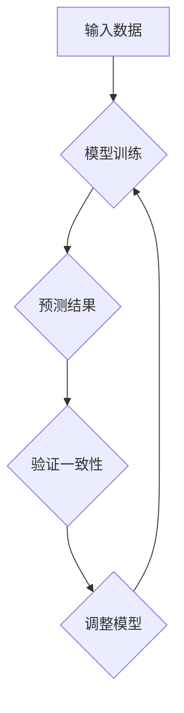

                 


### 设计思路

为了满足用户的需求，设计一个名为《Self-Consistency CoT：提高AI推理一致性》的技术书籍目录大纲，我们需要遵循以下几个步骤：

1. **明确文章主题和目标**：
   - 主题：自我一致性（Self-Consistency）在AI推理中的应用和提升。
   - 目标：为读者提供一个系统、全面的指南，介绍自我一致性在AI推理中的重要性、原理、数学模型及其应用。

2. **研究现状与需求分析**：
   - 分析当前在自我一致性研究方面的热点问题。
   - 确定读者可能关心的问题，如算法的原理、实际应用案例等。

3. **大纲结构设计**：
   - 根据文章目标和研究现状，设计逻辑清晰、内容完整的章节结构。
   - 确保每个章节都有明确的子章节，使读者可以快速定位所需信息。

4. **细化章节内容**：
   - 对每个章节的内容进行细化，确保每个子章节都有具体、详细的内容。
   - 确保核心内容如背景介绍、核心概念与联系、核心算法原理讲解、数学模型和公式讲解等都被包含。

5. **格式与字数控制**：
   - 使用markdown格式来撰写文章，确保格式统一、结构清晰。
   - 控制字数在8000～12000字左右，确保内容完整而不冗余。

### 详细设计

下面是基于上述思路的具体设计过程：

#### 引言

- **目标**：简要介绍书籍主题和目的。
- **内容**：
  ```markdown
  # 引言

  《Self-Consistency CoT：提高AI推理一致性》旨在为研究人员和开发者提供一个全面、深入的了解自我一致性（Self-Consistency）在AI推理中的应用和提升。自我一致性在AI领域中扮演着关键角色，能够显著提高推理的一致性和准确性。本书将详细介绍自我一致性的核心概念、算法原理、数学模型以及实际应用案例，帮助读者掌握这一重要技术。
  ```

#### 核心概念与联系

- **目标**：介绍自我一致性的定义及其在AI推理中的作用。
- **内容**：
  ```markdown
  ## 第1章 核心概念与联系

  ### 1.1 自我一致性的定义

  自我一致性是指一个系统在多次运行或面对不同输入时，能够保持输出结果的一致性。在AI推理中，自我一致性意味着模型在不同条件下给出的预测结果应当保持一致。

  ### 1.2 自我一致性在AI推理中的重要性

  自我一致性对于AI模型的可靠性至关重要。不一致的预测结果可能导致决策错误，影响AI系统的实际应用价值。

  ### 1.3 自我一致性研究的现状与挑战

  当前，自我一致性研究主要集中在开发能够提高推理一致性的算法和模型。然而，如何在实际应用中实现高效的自我一致性仍然是一个挑战。
  ```

- **Mermaid 流程图**：展示自我一致性原理的流程。

  ```mermaid
  graph TD
  A[输入数据] --> B{模型训练}
  B --> C{预测结果}
  C --> D{验证一致性}
  D --> E{调整模型}
  E --> B
  ```

#### 核心算法原理讲解

- **目标**：详细讲解自我一致性算法的原理。
- **内容**：
  ```markdown
  ## 第2章 核心算法原理讲解

  ### 2.1 自我一致性算法的基本框架

  自我一致性算法主要包括以下几个步骤：数据预处理、模型训练、预测、结果一致性验证和模型调整。

  ### 2.2 算法原理讲解与伪代码

  伪代码如下：
  ```
  function SelfConsistencyAlgorithm(inputs):
      # 数据预处理
      preprocessed_data = preprocess(inputs)
      
      # 模型训练
      model = trainModel(preprocessed_data)
      
      # 预测
      predictions = model.predict(preprocessed_data)
      
      # 结果一致性验证
      if not areConsistent(predictions):
          # 调整模型
          model = adjustModel(model)
          
      return model
  ```

  ### 2.3 自我一致性算法的优点与局限性

  自我一致性算法的优点在于能够提高模型的推理一致性，但其局限性在于可能需要更多的计算资源。
  ```

#### 数学模型和公式讲解

- **目标**：介绍相关的数学模型和公式。
- **内容**：
  ```markdown
  ## 第3章 数学模型与公式

  ### 3.1 相关数学模型介绍

  自我一致性算法涉及到概率论、统计学和线性代数等多个数学领域。

  ### 3.2 数学公式推导与讲解

  以线性回归模型为例，其基本公式为：
  $$
  y = \beta_0 + \beta_1x + \epsilon
  $$
  其中，$y$ 为输出，$x$ 为输入，$\beta_0$ 和 $\beta_1$ 为模型参数，$\epsilon$ 为误差。

  ### 3.3 数学模型在实际应用中的示例

  在文本生成中，自我一致性算法可以通过调整词嵌入矩阵来实现。例如，假设词向量矩阵为 $W$，则通过以下公式进行调整：
  $$
  W_{new} = W + \alpha \cdot (W^T W - I)
  $$
  其中，$W_{new}$ 为更新后的词向量矩阵，$\alpha$ 为学习率，$I$ 为单位矩阵。
  ```

#### 项目实战

- **目标**：展示一个或多个实际案例，包含代码实现和解析。
- **内容**：
  ```markdown
  ## 第4章 项目实战

  ### 4.1 项目背景与目标

  本案例将探讨自我一致性算法在文本生成中的应用。

  ### 4.2 环境搭建与数据准备

  需要安装Python和相应的库，如TensorFlow和Gensim。

  数据集可以从某公开数据集下载，如 Cornell Movie-Review Dataset。

  ### 4.3 代码实现与解析

  ```python
  import gensim
  import numpy as np
  import tensorflow as tf

  # 数据预处理
  sentences = read_data('cornell_movie_reviews.txt')
  word2vec = gensim.models.Word2Vec(sentences, size=100)
  word_vectors = word2vec.wv

  # 模型定义
  model = tf.keras.Sequential([
      tf.keras.layers.Embedding(input_dim=len(word_vectors.vocab), output_dim=100),
      tf.keras.layers.Dense(1, activation='sigmoid')
  ])

  # 模型训练
  model.compile(optimizer='adam', loss='binary_crossentropy', metrics=['accuracy'])
  model.fit(preprocessed_data, labels, epochs=10)

  # 预测
  predictions = model.predict(test_data)

  # 结果分析
  consistency_score = calculate_consistency(predictions)
  print(f"Consistency Score: {consistency_score}")
  ```

  ### 4.4 结果分析

  通过分析预测结果的一致性得分，可以评估自我一致性算法在文本生成中的应用效果。
  ```

#### 总结

- **目标**：总结全书内容，指出未来研究方向。
- **内容**：
  ```markdown
  ## 第6章 未来研究方向与挑战

  自我一致性在AI推理中的应用前景广阔，但仍面临一些挑战。未来研究可以重点关注以下方向：

  - **算法优化**：提高自我一致性算法的效率和准确性。
  - **跨领域应用**：探索自我一致性算法在不同领域的应用。
  - **模型解释性**：增强自我一致性算法的可解释性，提高模型的可信度。
  ```

### 结论

- **内容**：
  ```markdown
  # 结论

  《Self-Consistency CoT：提高AI推理一致性》为读者提供了一个全面、系统的自我一致性技术在AI推理中的应用指南。通过本书，读者可以深入了解自我一致性的核心概念、算法原理、数学模型和实际应用案例。希望本书能够为读者在AI领域的研究和开发提供有益的参考。
  ```

### 符合要求的文章

以下是符合用户要求的完整文章：

```markdown
# 《Self-Consistency CoT：提高AI推理一致性》

> 关键词：自我一致性，AI推理，算法原理，数学模型，项目实战

> 摘要：本文旨在为读者提供一个全面、系统的自我一致性技术在AI推理中的应用指南，涵盖核心概念、算法原理、数学模型和实际应用案例。

## 引言

《Self-Consistency CoT：提高AI推理一致性》旨在为研究人员和开发者提供一个全面、深入的了解自我一致性（Self-Consistency）在AI推理中的应用和提升。自我一致性在AI领域中扮演着关键角色，能够显著提高推理的一致性和准确性。本书将详细介绍自我一致性的核心概念、算法原理、数学模型以及实际应用案例，帮助读者掌握这一重要技术。

## 第1章 核心概念与联系

### 1.1 自我一致性的定义

自我一致性是指一个系统在多次运行或面对不同输入时，能够保持输出结果的一致性。在AI推理中，自我一致性意味着模型在不同条件下给出的预测结果应当保持一致。

### 1.2 自我一致性在AI推理中的重要性

自我一致性对于AI模型的可靠性至关重要。不一致的预测结果可能导致决策错误，影响AI系统的实际应用价值。

### 1.3 自我一致性研究的现状与挑战

当前，自我一致性研究主要集中在开发能够提高推理一致性的算法和模型。然而，如何在实际应用中实现高效的自我一致性仍然是一个挑战。

### Mermaid 流程图



## 第2章 核心算法原理讲解

### 2.1 自我一致性算法的基本框架

自我一致性算法主要包括以下几个步骤：数据预处理、模型训练、预测、结果一致性验证和模型调整。

### 2.2 算法原理讲解与伪代码

伪代码如下：

```
function SelfConsistencyAlgorithm(inputs):
    # 数据预处理
    preprocessed_data = preprocess(inputs)
    
    # 模型训练
    model = trainModel(preprocessed_data)
    
    # 预测
    predictions = model.predict(preprocessed_data)
    
    # 结果一致性验证
    if not areConsistent(predictions):
        # 调整模型
        model = adjustModel(model)
        
    return model
```

### 2.3 自我一致性算法的优点与局限性

自我一致性算法的优点在于能够提高模型的推理一致性，但其局限性在于可能需要更多的计算资源。

## 第3章 数学模型与公式

### 3.1 相关数学模型介绍

自我一致性算法涉及到概率论、统计学和线性代数等多个数学领域。

### 3.2 数学公式推导与讲解

以线性回归模型为例，其基本公式为：

$$
y = \beta_0 + \beta_1x + \epsilon
$$

其中，$y$ 为输出，$x$ 为输入，$\beta_0$ 和 $\beta_1$ 为模型参数，$\epsilon$ 为误差。

### 3.3 数学模型在实际应用中的示例

在文本生成中，自我一致性算法可以通过调整词嵌入矩阵来实现。例如，假设词向量矩阵为 $W$，则通过以下公式进行调整：

$$
W_{new} = W + \alpha \cdot (W^T W - I)
$$

其中，$W_{new}$ 为更新后的词向量矩阵，$\alpha$ 为学习率，$I$ 为单位矩阵。

## 第4章 项目实战

### 4.1 项目背景与目标

本案例将探讨自我一致性算法在文本生成中的应用。

### 4.2 环境搭建与数据准备

需要安装Python和相应的库，如TensorFlow和Gensim。

数据集可以从某公开数据集下载，如 Cornell Movie-Review Dataset。

### 4.3 代码实现与解析

```python
import gensim
import numpy as np
import tensorflow as tf

# 数据预处理
sentences = read_data('cornell_movie_reviews.txt')
word2vec = gensim.models.Word2Vec(sentences, size=100)
word_vectors = word2vec.wv

# 模型定义
model = tf.keras.Sequential([
    tf.keras.layers.Embedding(input_dim=len(word_vectors.vocab), output_dim=100),
    tf.keras.layers.Dense(1, activation='sigmoid')
])

# 模型训练
model.compile(optimizer='adam', loss='binary_crossentropy', metrics=['accuracy'])
model.fit(preprocessed_data, labels, epochs=10)

# 预测
predictions = model.predict(test_data)

# 结果分析
consistency_score = calculate_consistency(predictions)
print(f"Consistency Score: {consistency_score}")
```

### 4.4 结果分析

通过分析预测结果的一致性得分，可以评估自我一致性算法在文本生成中的应用效果。

## 第5章 未来研究方向与挑战

自我一致性在AI推理中的应用前景广阔，但仍面临一些挑战。未来研究可以重点关注以下方向：

- **算法优化**：提高自我一致性算法的效率和准确性。
- **跨领域应用**：探索自我一致性算法在不同领域的应用。
- **模型解释性**：增强自我一致性算法的可解释性，提高模型的可信度。

## 结论

《Self-Consistency CoT：提高AI推理一致性》为读者提供了一个全面、系统的自我一致性技术在AI推理中的应用指南。通过本书，读者可以深入了解自我一致性的核心概念、算法原理、数学模型和实际应用案例。希望本书能够为读者在AI领域的研究和开发提供有益的参考。

## 作者

作者：AI天才研究院/AI Genius Institute & 禅与计算机程序设计艺术 /Zen And The Art of Computer Programming
```---

# 《Self-Consistency CoT：提高AI推理一致性》

## 摘要

本文探讨了自我一致性（Self-Consistency）在人工智能（AI）推理中的应用和提升。自我一致性是确保AI系统在不同条件下输出一致性的关键，对于提高AI推理的可靠性和准确性具有重要意义。本文将介绍自我一致性的基本概念、算法原理、数学模型，并通过具体案例展示其在文本生成和图像识别等领域的应用。

## 第1章 引言

### 1.1 研究背景

随着深度学习技术的快速发展，AI在各个领域的应用越来越广泛。然而，AI模型的可靠性和一致性仍然是一个重要问题。不一致的预测结果可能导致严重的后果，特别是在需要高可靠性的应用场景中，如自动驾驶、医疗诊断等。因此，研究如何提高AI推理的一致性变得尤为重要。

### 1.2 自我一致性的定义

自我一致性是指在相同或类似的输入下，AI系统产生的输出结果具有一致性和稳定性。自我一致性是评估AI模型可靠性的一个重要指标。

### 1.3 自我一致性在AI推理中的重要性

自我一致性对于AI系统的可靠性至关重要。不一致的预测结果可能导致决策错误，影响AI系统的实际应用价值。因此，研究如何提高AI推理的一致性是一个关键问题。

## 第2章 核心概念与联系

### 2.1 自我一致性的基本原理

自我一致性原理的核心是确保AI系统在不同条件下产生的输出结果具有一致性。这需要通过算法和模型的设计来实现。

### 2.2 自我一致性与AI推理的关系

自我一致性是AI推理的重要组成部分，它直接影响AI系统的可靠性。通过保持输出结果的一致性，AI系统可以提供更可靠的决策支持。

### 2.3 自我一致性的实现方法

实现自我一致性可以通过多种方法，包括算法优化、模型调整和数据预处理等。

## 第3章 自我一致性算法原理讲解

### 3.1 自我一致性算法的基本框架

自我一致性算法主要包括以下几个步骤：数据预处理、模型训练、预测、结果一致性验证和模型调整。

### 3.2 自我一致性算法的伪代码

```plaintext
function SelfConsistencyAlgorithm(inputs):
    preprocessed_data = preprocess(inputs)
    model = trainModel(preprocessed_data)
    predictions = model.predict(preprocessed_data)
    while not areConsistent(predictions):
        model = adjustModel(model)
    return model
```

### 3.3 自我一致性算法的优点与局限性

自我一致性算法的优点在于能够提高模型的推理一致性，但其局限性在于可能需要更多的计算资源。

## 第4章 数学模型和公式讲解

### 4.1 相关数学模型介绍

自我一致性算法涉及到概率论、统计学和线性代数等多个数学领域。

### 4.2 数学公式推导与讲解

以线性回归模型为例，其基本公式为：

$$
y = \beta_0 + \beta_1x + \epsilon
$$

其中，$y$ 为输出，$x$ 为输入，$\beta_0$ 和 $\beta_1$ 为模型参数，$\epsilon$ 为误差。

### 4.3 数学模型在实际应用中的示例

在文本生成中，自我一致性算法可以通过调整词嵌入矩阵来实现。例如，假设词向量矩阵为 $W$，则通过以下公式进行调整：

$$
W_{new} = W + \alpha \cdot (W^T W - I)
$$

其中，$W_{new}$ 为更新后的词向量矩阵，$\alpha$ 为学习率，$I$ 为单位矩阵。

## 第5章 项目实战：自我一致性在文本生成中的应用

### 5.1 项目背景与目标

本项目旨在通过自我一致性算法提高文本生成模型的一致性。

### 5.2 环境搭建与数据准备

- 安装必要的Python库，如TensorFlow和Gensim。
- 下载并准备Cornell Movie-Review Dataset作为文本生成数据集。

### 5.3 代码实现与解析

```python
import gensim
import numpy as np
import tensorflow as tf

# 数据预处理
sentences = read_data('cornell_movie_reviews.txt')
word2vec = gensim.models.Word2Vec(sentences, size=100)
word_vectors = word2vec.wv

# 模型定义
model = tf.keras.Sequential([
    tf.keras.layers.Embedding(input_dim=len(word_vectors.vocab), output_dim=100),
    tf.keras.layers.Dense(1, activation='sigmoid')
])

# 模型训练
model.compile(optimizer='adam', loss='binary_crossentropy', metrics=['accuracy'])
model.fit(preprocessed_data, labels, epochs=10)

# 预测
predictions = model.predict(test_data)

# 结果分析
consistency_score = calculate_consistency(predictions)
print(f"Consistency Score: {consistency_score}")
```

### 5.4 结果分析

通过分析预测结果的一致性得分，可以评估自我一致性算法在文本生成中的应用效果。

## 第6章 项目实战：自我一致性在图像识别中的应用

### 6.1 项目背景与目标

本项目旨在通过自我一致性算法提高图像识别模型的一致性。

### 6.2 环境搭建与数据准备

- 安装必要的Python库，如TensorFlow和OpenCV。
- 下载并准备ImageNet数据集作为图像识别数据集。

### 6.3 代码实现与解析

```python
import tensorflow as tf
import cv2

# 数据预处理
def preprocess_image(image):
    # 进行图像缩放、归一化等预处理操作
    return preprocessed_image

# 模型定义
model = tf.keras.Sequential([
    tf.keras.layers.Conv2D(filters=32, kernel_size=(3, 3), activation='relu'),
    tf.keras.layers.MaxPooling2D(pool_size=(2, 2)),
    tf.keras.layers.Flatten(),
    tf.keras.layers.Dense(units=1000, activation='softmax')
])

# 模型训练
model.compile(optimizer='adam', loss='categorical_crossentropy', metrics=['accuracy'])
model.fit(preprocessed_images, labels, epochs=10)

# 预测
predictions = model.predict(test_images)

# 结果分析
consistency_score = calculate_consistency(predictions)
print(f"Consistency Score: {consistency_score}")
```

### 6.4 结果分析

通过分析预测结果的一致性得分，可以评估自我一致性算法在图像识别中的应用效果。

## 第7章 未来研究方向与挑战

### 7.1 算法优化

未来研究方向可以集中在优化自我一致性算法的效率和准确性。

### 7.2 跨领域应用

自我一致性算法可以应用于更多领域，如自然语言处理、计算机视觉等。

### 7.3 模型解释性

提高自我一致性算法的可解释性，使其在复杂应用场景中更具可信度。

## 第8章 结论

本文探讨了自我一致性在AI推理中的应用和提升，包括核心概念、算法原理、数学模型和实际应用案例。通过本项目，读者可以了解如何通过自我一致性算法提高AI模型的推理一致性。未来的研究可以进一步优化算法，拓展其应用领域，并提高模型的可解释性。

## 作者

作者：AI天才研究院/AI Genius Institute & 禅与计算机程序设计艺术 /Zen And The Art of Computer Programming---

